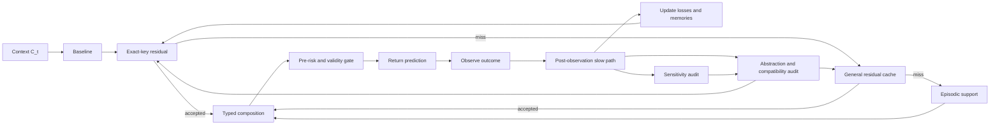

# EventFrame Whitepaper: A Mathematical Framework for Event-Centric Prediction

**Author:** Juan Hua Xu

**ORCID:** <https://orcid.org/0009-0008-7305-5690>

**Research profile:** <https://github.com/JuanHuaXu>

**License:** MIT License. Copyright (c) 2026 Juan Hua Xu.

_Public working paper. This version has not been experimentally validated._

## Abstract

EventFrame is a framework for event-centric prediction. It represents experience as typed event frames rather than as unstructured sequences alone, but does not treat those frames as fundamental ontology. Event frames are task-relative compressed records. Physical information bounds motivate caution about microscopic descriptions but do not prove a discrete substrate or the framework's sparsity hypothesis.

The central object is \(e_t\in\mathcal E_{\Delta_\tau}\), obtained as \(e_t=\Gamma_{\Delta_\tau}(\omega_{A_t})\). Temporal resolution may range from seconds to microseconds when measurement supports it. Given \(C_t=e_{t-k+1:t}\), the predictor returns a distribution over marked event times and a no-event outcome. A strictly proper predictive score is primary; bounded event-aware timing error is a diagnostic.

At a fixed temporal resolution, the governing principle minimizes priority-weighted post-observation event action plus non-negative representation cost. Feasibility requires operational use of the abstraction, a bound on externally evaluated within-bucket target-law divergence, and non-inferiority of the untransformed proper score. Candidate design and untouched chronological confirmation are separated. Prediction-time admission uses a distinct risk and state containing only quantities available before the prediction occurs.

EventFrame separates a baseline from cached statistical error correction. The typed point composition \(\hat e_{t+1}=B(C_t)\oplus_E r_t^{\mathrm{use}}\) uses a self-adjoint operator representation, norm clipping, admissible projection, and a decoder. Proper-score evaluation additionally requires a declared residual Markov kernel that maps the baseline forecast law to a corrected law; point composition alone cannot support a proper-score improvement claim. A separately typed operator composes runtime packets. The construction is structurally inspired by Causal Fermion Systems but is not its causal action and makes no physical-equivalence claim.

Validity-constrained fuzzing measures model sensitivity, not causality. Causal claims require an explicit structural causal model and identified interventions. Approximate predictive lumpability compares detailed contexts that share an abstract context. Every group retains a traceability frame plus a coverage-aware context audit set; one representative alone cannot establish group stability. A staged compatibility layer can compare heterogeneous abstractions, reconcile local forecasts, apply spectral refinement under explicit linear assumptions, and preserve regime mixtures. Its depth is selected by priority, evidence, and measured hardware cost while certified cache reuse remains available.

The paper remains a research framework without implementation results. Its evaluation program uses as-of rolling-origin replay and measures proper forecast quality, residual utility, sensitivity stability, audit coverage, abstraction compatibility, priority-weighted correction, regime adaptation, and hardware-indexed runtime tradeoffs.

## 1. Introduction

Prediction systems often operate over sequences whose internal structure is only implicit. A model may receive tokens, vectors, logs, traces, or state observations and learn statistical regularities among them. This can be effective, but it makes some questions difficult to ask directly: which compressed distinction mattered, what changed, when did it happen, where did it occur, why might it matter, and how did it transform the state of the world?

EventFrame begins from a compression premise: a modeled substrate may contain more detail than a prediction system can retain. Event frames are task-relative coarse-grained representations, not assertions about fundamental spacetime. Physical information bounds motivate caution but do not prove this software-level premise [7--9].

The framework represents experience as event frames selected for predictive and intervention relevance. An event frame is a typed record of an occurrence or transition after compression. It includes the 5W1H fields of who, what, when, where, why, and how, plus auxiliary state and confidence metadata. The goal is not to claim that every domain naturally exposes these fields perfectly. The goal is to create a disciplined representation in which uncertainty, missing fields, competing explanations, and compression choices can still be recorded explicitly.

The core contribution is adaptive event abstraction. The framework minimizes post-observation predictive action and representation cost while constraining within-bucket future divergence. It distinguishes model-sensitivity evidence from causal intervention evidence.

Given \(C_t=e_{t-k+1:t}\), the system predicts a distribution over event identity, event time, and no event within horizon \(H\). Proper forecast scores are primary because timing-only loss can reward the wrong event at the right time. Event-aware timing remains an interpretable diagnostic.

The reference prediction procedure has six steps:

1. Form a context \(C_t\) from the last \(k\) event frames.
2. Compute a baseline forecast law \(\mathsf Q_B(\cdot\mid C_t)\) and point summary \(b_t=B(C_t)\).
3. From state \(S_{t^-}\), select an exact-key or general residual \(r_t^{\mathrm{use}}\) only when its distance, confidence, effective-support, age, epoch, compatibility-margin, and provenance checks pass.
4. Clip one effective residual, use it for both \(\hat e_{t+1}=b_t\oplus_E r_t^{\mathrm{use}}\) and the declared residual Markov kernel, and apply the pre-observation risk gate to the resulting output bundle.
5. Observe the next marked event or no-event outcome and evaluate proper predictive loss.
6. Use a slower refinement process to update residuals, test invariants, revise abstractions, or revise the event ontology.

This procedure explains why the framework includes both memory and residual prediction. Episodic memory stores prior cases. A residual cache stores reusable corrections to a baseline transition. The distinction matters because recalling a similar event and applying a similar error correction are not the same operation. The first supports case-based reasoning; the second supports low-latency approximation when similar contexts produce similar transition errors.

The slow path uses validity-constrained perturbations to test model sensitivity, coverage-aware bucket audits to find hidden divergence, and approximate predictive lumpability to test compression. Causal analysis is a separate optional path requiring structural equations and identification assumptions.

The contributions of this paper are therefore:

1. A compressed event-frame ontology for prediction-oriented representation.
2. A governing optimization principle for adaptive event abstraction.
3. A residual prediction model with constrained composition and action-residual fast-path caching.
4. A combined episodic and residual memory architecture.
5. A validity-constrained sensitivity method for conditional invariants and ontology review.
6. A lumpability-based approach to abstraction.
7. A fast-path and slow-path reference runtime model.
8. Experiment designs for testing the framework's claims.

These are proposed as a research framework, not as validated results or a fixed implementation. Event-centric latent retrieval itself has prior art [10]. D'Acunto, Di Lorenzo, and Barbarossa's *Networks of Causal Abstractions: A Sheaf-theoretic Framework* provides prior work on coordinating heterogeneous causal abstractions through network sheaves, restriction maps, connection Laplacians, global sections, and mixture causal models [13]. EventFrame's claimed contribution is the typed residual-error and evidence-controlled event-abstraction loop, including its predictive Anti-Pigeon criterion, cache certificates, and priority- and hardware-aware staged integration. The next section defines the event ontology.

## Claims Register

This section states the paper's major claims as falsifiable targets. The claims are not treated as established results. Each one names what would need to be measured, proved, or falsified by later experiments.

Claim 0. At a fixed resolution, adaptive event abstraction minimizes normalized priority-weighted post-observation action plus non-negative representation cost while an external target-law diameter and proper-score guard prevent self-certified compression. Selection and untouched chronological confirmation are separate, and runtime admission uses as-of pre-observation risk.

Claim 1. Structured event frames are useful predictive units if, for a declared task, they improve interpretability or temporal prediction relative to unstructured sequence records without hiding field-level error.

Claim 1a. Event frames are task-relative compressed representations rather than claims about fundamental ontology. Physical constants do not prove the compression hypothesis.

Claim 1b. Temporal precision controls frame granularity if changing the declared time resolution \(\Delta_\tau\) changes the candidate-frame set, cache pressure, and detectable divergence boundaries in measurable ways.

Claim 2. Residual caches reduce prediction cost or error when similar contexts or action signatures produce similar baseline errors and as-of, metadata-gated residuals improve forward-held-out loss often enough to justify lookup and maintenance. Point and law correction use the same clipped residual; proper-score improvement requires a declared forecast-law correction.

Claim 2a. Runtime prediction packets are useful when a separately typed packet composition operator improves selection of memory nodes, graph edges, retrieval lane, compaction risk, response mode, or control branch on held-out packet loss.

Claim 3. Episodic memory and residual cache memory serve different roles because prior-case recall and prior-error correction can be independently useful or harmful under the same prediction context.

Claim 4. Validity-constrained property fuzzing exposes conditional model invariants and ontology review signals. It does not establish causal effects without an explicit SCM and identification strategy.

Claim 5. Approximate predictive lumpability provides a route to abstraction when projected event states preserve target-relevant transition behavior within a declared divergence threshold.

Claim 5a. Event streams can conjoin or diverge over time when multiple streams become prediction-equivalent under a merge threshold or when small distinctions amplify into target-distinct downstream futures.

Claim 5b. Each group retains at least one concrete traceability frame plus a coverage-aware context audit set; one representative alone is insufficient for group-level divergence claims, and unseen-context certification additionally requires exhaustive coverage or a verified continuity bound.

Claim 6. Anti-Pigeon rejects buckets whose externally evaluated context-conditional target-law diameter exceeds threshold. Model-forecast diameter is diagnostic only. Regime comparisons require common support or transport assumptions, and causal attribution requires separate intervention evidence.

Claim 6a. Target-effective distinctions are sparse only when their measured ratio is small within a finite declared candidate set.

Claim 7. Fast-path and slow-path separation is computationally useful if low-latency prediction can reuse cached residuals while slower background work improves future predictions without blocking the current one.

Claim 7a. Expected exact-key lookup is history-independent only when context update, key construction, graph degree, key size, and cache size are bounded; fallback and maintenance costs remain explicit.

Claim 8. Heterogeneous abstractions can be tested through declared comparison maps and edge defects, complementing within-bucket Anti-Pigeon audits. The construction is sheaf-compatible only when the required map laws hold and causal only when SCM semantics are supplied.

Claim 8a. A full refinement architecture can retain certified residual reuse while adding compatibility audit, local reconciliation, spectral refinement under linear assumptions, and regime-mixture refinement. Hardware changes stage depth, not stage meaning.

Claim 8b. Upgrade value is evaluated by predeclared priority-weighted utility beside unweighted and stratified results; loss and resource percentages are not compared until converted to a common utility scale.

## 2. Event Ontology

EventFrame uses event frames as predictive units, not as fundamental ontology. The underlying substrate is assumed to contain more detail than the predictor can retain. That substrate may be physical, simulated, biological, robotic, or software-based. EventFrame treats a frame as a task-relative compressed representation. Physical information bounds motivate caution about microscopic descriptions but do not prove a discrete substrate, a Planck-scale sampling lattice, or the EventFrame sparsity hypothesis.

An event is therefore a structured representation of a change, occurrence, action, observation, or state transition after coarse-graining. An event frame records that compressed event in fields that can be compared, predicted, fuzzed, cached, and abstracted.

An event frame at index \(t\) is written:

$$
e_t = (w_t, a_t, \tau_t, \ell_t, m_t, h_t, x_t, c_t)
$$

where \(w_t\) denotes participating agents or entities, \(a_t\) denotes the action or occurrence type, \(\tau_t\) denotes the time index or interval, \(\ell_t\) denotes location or spatial context, \(m_t\) denotes motive, objective, causal explanation, or inferred driver, \(h_t\) denotes mechanism or process, \(x_t\) denotes auxiliary state, and \(c_t\) denotes confidence, provenance, or uncertainty metadata.

The conceptual role of this ontology is compression. It prevents prediction from treating history as a single undifferentiated sequence, but it also prevents prediction from pretending that every microscopic distinction deserves its own event identity. The fields ask different compressed questions. The "what" field identifies an occurrence type. The "when" field supports temporal prediction loss. The "who" and "where" fields localize the event. The "why" and "how" fields record explanatory hypotheses and mechanisms. The auxiliary state field allows symbolic, vector, graph, or latent variables to travel with the event. The confidence field prevents uncertain extraction from pretending to be certain observation.

Let \(\Omega\) denote a dense substrate state space and let \(\omega_{A_t}\) denote the substrate history over a finite region \(A_t\). A coarse-graining map at temporal resolution \(\Delta_\tau\):

$$
\Gamma_{\Delta_\tau}: \Omega^{A_t} \rightarrow \mathcal{E}_{\Delta_\tau}
$$

produces an event frame:

$$
e_t = \Gamma_{\Delta_\tau}(\omega_{A_t}).
$$

This equation states the ontology clearly: the event frame is a lossy, task-oriented compression. The compression is useful only if it preserves distinctions that matter for prediction, intervention, memory, or review.

The temporal resolution \(\Delta_\tau\) controls how precise the "when" field is. A model may choose second-level frames, microsecond-level frames, or another declared scale. Finer resolution can instantiate more candidate frames, but it does not imply that every candidate frame is intervention-effective or should be retained forever. Sparsity means that useful distinctions are rare relative to the possible substrate and candidate-frame distinctions, not that the model is forbidden from creating many candidate frames when the task demands precision.

Mathematically, the event space is treated as a typed product:

$$
\mathcal{E} =
\mathcal{W} \times \mathcal{A} \times \mathcal{T} \times
\mathcal{L} \times \mathcal{M} \times \mathcal{H} \times
\mathcal{X} \times \mathcal{C}.
$$

This equation is operational, not decorative. It says that before a field can be used in prediction, caching, fuzzing, or abstraction, the field must have a representation and a comparison rule. For example, \(\mathcal{T}\) may contain timestamps or intervals; \(\mathcal{L}\) may contain coordinates, graph nodes, or symbolic regions; \(\mathcal{C}\) may contain confidence scores and source provenance. EventFrame does not require one universal encoding for all domains, but it requires the encoding to be declared.

An event state is the system state before, during, or after an event. In some domains, \(x_t\) may include an explicit pre-state and post-state. In others, \(x_t\) may be a latent state vector inferred from observations. A transition occurs when one event context gives rise to a later event frame. The basic trajectory is:

$$
E_{1:T} = (e_1, e_2, \ldots, e_T).
$$

Operationally, a prediction step extracts a context from this trajectory:

$$
C_t = e_{t-k+1:t}.
$$

The context \(C_t\) is the recent event history available to the predictor. It gives the predictor local structure for forecasting the next event and its time. If the context is too short, important predictive or temporal dependencies may be missing. Causal dependence is a stronger claim and requires an explicit causal model or identified intervention evidence. The context length \(k\) is a modeling choice that should be evaluated experimentally.

The ontology also supports typed links. Temporal links order events, spatial links relate locations, and predictive-dependency links record forecast-relevant association. Causal links are reserved for relations supported by a declared structural causal model or an identified intervention. These link types must remain distinct in storage and evaluation.

Event histories are therefore not limited to linear chains. Multiple event streams can become representable as a single aggregate event over time. This is event confluence: separate streams merge into a larger stream or macro-event when their separate identities no longer affect the target beyond a declared threshold. The reverse can also occur. A small distinction can branch into multiple downstream event streams when a perturbation is amplified by the dynamics. This is event divergence, or butterfly-effect-style sensitivity. EventFrame must model both patterns because compression that is safe in a confluence region may be unsafe near a divergence point.

For traceability, EventFrame keeps at least one concrete frame for every event-frame group. One frame cannot characterize a heterogeneous group, so abstraction audits use a coverage-aware set containing boundary, uncertain, and sampled examples. Section 7 formalizes that audit set and the limits of conclusions drawn from it.

The event sparsity hypothesis follows from this compression view. Relative to a finite declared candidate set, EventFrame hypothesizes that only a small fraction of distinctions materially change the prediction target. Model fuzzing and ablation test predictive sensitivity; only randomized or otherwise identified interventions test causal effect. The hypothesis must be measured in each domain rather than inferred from Planck constants or entropy bounds.

The main limitation of the ontology is extraction and compression quality. In real data, the "why" and "how" fields may be ambiguous, inferred, or unavailable. More fundamentally, the chosen coarse-graining \(\Gamma_{\Delta_\tau}\) may discard distinctions that later turn out to matter. EventFrame handles this by allowing missing values, confidence metadata, and revision under slow-path review rather than requiring false precision. A conservative implementation should distinguish observed fields from inferred fields and should propagate uncertainty into prediction and review. The next section defines the mathematical framework built on this compressed ontology.

## 3. Mathematical Framework

The mathematical framework turns compressed event frames into objects that can be predicted, evaluated, cached, and abstracted. Given a context \(C_t\), the predictor must produce a next-event distribution before the next observation exists. Only after the observation arrives may the runtime compute realized prediction loss and update memory or abstraction.

Let \(\Omega\) denote a dense substrate state space. For a finite region \(A_t\), let \(\omega_{A_t} \in \Omega^{A_t}\) denote the substrate history over that region. At temporal resolution \(\Delta_\tau\), an event frame is produced by:

$$
e_t = \Gamma_{\Delta_\tau}(\omega_{A_t}), \qquad
\Gamma_{\Delta_\tau}: \Omega^{A_t} \rightarrow \mathcal{E}_{\Delta_\tau}.
$$

The coarse-graining \(\Gamma_{\Delta_\tau}\) is task-relative and lossy. It selects distinctions available to prediction, memory, and review; it does not establish a fundamental discretization of spacetime. The Planck scales and physical information bounds motivate caution about microscopic descriptions but do not prove the EventFrame sparsity hypothesis [7--9].

A trajectory at fixed resolution is:

$$
E_{1:T}=(e_1,\ldots,e_T), \qquad e_t\in\mathcal E_{\Delta_\tau},
$$

and a time quantizer is:

$$
Q_{\Delta_\tau}:\mathbb R\rightarrow\mathcal T_{\Delta_\tau}.
$$

Second-level or microsecond-level precision is permitted only when the measurement process supports it. Finer resolution creates more candidate frames and can expose boundaries, but also increases noise and cache pressure.

For a context length \(k\), define:

$$
C_t=e_{t-k+1:t}\in\mathcal E^k.
$$

Let \(\mathfrak C_{\mathrm{adm}}\subseteq\mathcal E^k\) be the declared admissible context domain on which the chosen version of each conditional forecast law is defined. Population suprema below range over this domain or over the support of a named evaluation law, not over arbitrary zero-probability contexts.

Let \(a(x)\) be the time at which observation, label, cache record, or derived object \(x\) becomes available to the runtime. Let \(\mathscr F_t^{\mathrm{pred}}\) be the information available when the prediction at index \(t\) is issued, including \(C_t\) but excluding \(Z_{t+1}\). Mutable runtime state is the left-limit snapshot \(S_{t^-}\), constructed only from objects with \(a(x)\le t\). Every prediction, priority, cache lookup, abstraction decision, and pre-risk value used at time \(t\) must be measurable with respect to \(\mathscr F_t^{\mathrm{pred}}\). For a no-event outcome, \(a(Z_{t+1})\) is no earlier than expiration of horizon \(H\); delayed labels use their actual later availability time.

Let \(\nu(e)\) be the event mark or occurrence type and \(\tau(e)\) its time. Over a prediction horizon \(H>0\), the next outcome is:

$$
Z_{t+1}=
\begin{cases}
(\nu(e_{t+1}),\tau(e_{t+1})-\tau(e_t)), & \text{if an event occurs within }H,\\
\varnothing, & \text{otherwise.}
\end{cases}
$$

A probabilistic predictor returns a distribution rather than only a point:

$$
\mathsf Q_\theta(\cdot\mid C_t)\in\mathcal P(\mathcal Z_H),
$$

where \(\mathcal Z_H\) contains marked event times in \((0,H]\) and the no-event outcome \(\varnothing\). Let \(\hat e_\theta(C_t)\in\mathcal E\) be a separately declared point decision or structured point summary. The typed predictor output is the bundle:

$$
\mathcal O_\theta(C_t)=
\left(\mathsf Q_\theta(\cdot\mid C_t),\hat e_\theta(C_t)\right)
\in\mathcal P(\mathcal Z_H)\times\mathcal E.
$$

The primary prediction objective is a declared strictly proper scoring rule applied to the probability-law component:

$$
\mathcal L_{\mathrm{pred}}(\theta;t)
=S_{\mathrm{prop}}\!\left(\mathsf Q_\theta(\cdot\mid C_t),Z_{t+1}\right).
$$

Fix a dominating reference measure \(\mu_H\) on the marked-time branch, including declared units for time, and let \(q_\theta=d\mathsf Q_\theta^{\mathrm{event}}/d\mu_H\) be the event subdensity. Its integral equals \(1-\mathsf Q_\theta(\{\varnothing\}\mid C_t)\). Relative to this fixed reference measure, the logarithmic score is one implementation:

$$
\mathcal L_{\log}(\theta;t)=
\begin{cases}
-\log q_\theta(\nu_{t+1},\Delta t_{t+1}\mid C_t), & Z_{t+1}\neq\varnothing,\\
-\log \mathsf Q_\theta(\{\varnothing\}\mid C_t), & Z_{t+1}=\varnothing.
\end{cases}
$$

Changing \(\mu_H\) or the time units changes density values by an additive score constant, so forecast comparisons must hold them fixed. This score covers event identity, timing, uncertainty, and right-censoring; calibration remains an empirical property to test. Proper scoring rules prevent a predictor from improving its expected score by reporting a distribution other than the one it believes [6].

For human-readable diagnostics, let \(\hat Z_{t+1}\) be a point summary of the distribution. A bounded event-aware timing diagnostic is:

$$
\mathcal L_{\mathrm{event}}^H(\hat Z,Z)=
\begin{cases}
0, & \hat Z=Z=\varnothing,\\
1, & \text{exactly one is }\varnothing\text{ or their marks differ},\\
\min\!\left(1,\dfrac{|\widehat{\Delta t}-\Delta t|}{H}\right),
& \text{their non-null marks agree.}
\end{cases}
$$

Unlike the original timing-only diagnostic, this expression cannot assign zero loss to the wrong event type merely because its timestamp is correct. It remains a diagnostic; model fitting and forecast comparison should use \(\mathcal L_{\mathrm{pred}}\).

For any other field, use a distinct projection \(\psi_i:\mathcal E\rightarrow\mathcal X_i\) and declared distance. The ordinary field loss is conditional on a concrete observed event:

$$
\mathcal L_i(\hat e_{t+1},Z_{t+1})
=d_i(\psi_i(\hat e_{t+1}),\psi_i(e_{t+1})),
\qquad Z_{t+1}\neq\varnothing.
$$

When \(Z_{t+1}=\varnothing\), this field loss is not evaluated unless a separate missing-aware loss with an explicit no-event symbol has been declared.

EventFrame uses separate pre-observation and post-observation quantities. For a candidate output bundle \(\widetilde{\mathcal O}=(\widetilde{\mathsf Q},\tilde e)\), a pre-observation admissibility risk may use only information available at prediction time:

$$
\mathcal R_{\mathrm{pre}}(\widetilde{\mathcal O}\mid C_t)
=\lambda_a^{\mathrm{pre}}D_{\mathrm{abs}}^{\mathrm{pre}}(\widetilde{\mathcal O},C_t)
+\lambda_c^{\mathrm{pre}}D_{\mathrm{edge}}^{\mathrm{pre}}(\widetilde{\mathcal O},C_t)
+\lambda_u^{\mathrm{pre}}U^{\mathrm{pre}}(\widetilde{\mathcal O}\mid C_t).
$$

The three components lie in \([0,1]\), the weights are non-negative, and \(\lambda_a^{\mathrm{pre}}+\lambda_c^{\mathrm{pre}}+\lambda_u^{\mathrm{pre}}=1\).

The proper loss need not be bounded; the logarithmic score above is not. To combine it with bounded system diagnostics, choose and preregister an order-preserving map \(g_{\mathrm{pred}}:\overline{\mathbb R}\to[0,1]\) on the declared finite score range, with \(g_{\mathrm{pred}}(+\infty)=1\), and define:

$$
\overline{\mathcal L}_{\mathrm{pred}}(\widetilde{\mathsf Q},Z)
=g_{\mathrm{pred}}\!\left(S_{\mathrm{prop}}(\widetilde{\mathsf Q},Z)\right).
$$

Constant or order-reversing transforms are inadmissible. Unless \(g_{\mathrm{pred}}\) is a positive affine transformation on the score's range, \(\overline{\mathcal L}_{\mathrm{pred}}\) is not asserted to remain proper. Model fitting and forecast comparison continue to report the untransformed proper score. After \(Z_{t+1}\) is observed, the bounded realized event action is:

$$
\begin{aligned}
\mathcal A_{\mathrm{post}}(\widetilde{\mathcal O},Z_{t+1})
={}&\lambda_p^{\mathrm{post}}\overline{\mathcal L}_{\mathrm{pred}}(\widetilde{\mathsf Q},Z_{t+1})
+\lambda_a^{\mathrm{post}}D_{\mathrm{abs}}^{\mathrm{post}}(\widetilde{\mathcal O},Z_{t+1})\\
&+\lambda_c^{\mathrm{post}}D_{\mathrm{edge}}^{\mathrm{post}}(\widetilde{\mathcal O},Z_{t+1})
+\lambda_u^{\mathrm{post}}U^{\mathrm{post}}(\widetilde{\mathcal O},Z_{t+1}).
\end{aligned}
$$

Every post-observation component lies in \([0,1]\), the four post weights are non-negative and sum to one, and therefore \(\mathcal A_{\mathrm{post}}\in[0,1]\).

The fast path may gate a correction using \(\mathcal R_{\mathrm{pre}}\); it may never use \(\mathcal A_{\mathrm{post}}\) before the observation exists.

The governing principle can now be stated without overloading \(\Omega\). It is evaluated at a fixed resolution \(\Gamma_{\Delta_\tau}\); comparisons across resolutions are a separate outer experiment on common raw histories. Group the event-residual implementation contract as:

$$
\Xi_R=(q_E,d_E,\Pi_E,\delta_E,\mathfrak K_E,
\alpha,\kappa,\epsilon_R,\text{cache gates}),
$$

and the candidate abstraction structure as \(\Xi_A\), containing its compatibility graph and comparison maps. Separately freeze an evaluation contract:

$$
\begin{aligned}
\Lambda_{\mathrm{eval}}=
({}&P_{\mathrm{obj}},P_{\mathrm{conf}},P_\star,
\mathfrak C_{\mathrm{adm}},d_C,
\text{targets and divergences},\text{thresholds},
\\
&\text{score weights},p^{\mathrm{pri}},w_{\mathrm{pri}},
\lambda_{\mathrm{rep}},\mathcal C_{\mathrm{rep}},
\text{confidence and map-validity procedures}).
\end{aligned}
$$

Here \(P_{\mathrm{obj}}\) is the design sample used to select a candidate, \(P_{\mathrm{conf}}\) is an untouched confirmation sample or future block, and \(P_\star(Y\mid C)\) is the external target conditional law that the predictor attempts to approximate. This contract is fixed independently of the candidates being compared; a candidate cannot shrink the context domain, relax its thresholds, choose its own weights, redefine the target, or validate its own comparison maps. Require \(\lambda_{\mathrm{rep}}\ge0\) and \(\mathcal C_{\mathrm{rep}}\ge0\). At the fixed resolution, let:

$$
\Theta_\Gamma=(\mathsf Q_\theta,B,\pi,
\mathcal C_A,\mathcal C_R,\mathcal C_E,\Xi_R,\Xi_A)
$$

denote the complete event-prediction design evaluated under \(\Lambda_{\mathrm{eval}}\). Let \(\mathcal O_{\Theta_\Gamma}(C;S_{t^-})\) denote its final typed output bundle from the state available immediately before prediction time. Let \(\mathfrak K_\pi\) be the buckets induced by \(\pi\), and let \(\mathfrak K_\pi^+=\{K\in\mathfrak K_\pi:\mathfrak C_K\neq\varnothing\}\) be the active buckets with admissible contexts. For an active bucket \(K\), define its external future-diameter \(D_K^\star(\pi)\) as in Section 7 under the fixed target law, divergence, and context domain. Runtime-packet contracts are evaluated by their separate packet loss and are added to \(\Theta_\Gamma\) only in an implementation that jointly optimizes packet selection.

Compression must be operational, not merely decorative. Define retained information by

$$
h_\pi(C)=\bigl(\pi^{(k)}(C),s_\pi(C)\bigr),
$$

where \(s_\pi\) is declared side information. There must exist measurable maps \(\widetilde{\mathsf Q}_\theta,\widetilde B,\widetilde\alpha,\widetilde\kappa\) such that \(\mathsf Q_\theta=\widetilde{\mathsf Q}_\theta\circ h_\pi\), \(B=\widetilde B\circ h_\pi\), \(\alpha=\widetilde\alpha\circ h_\pi\), and \(\kappa=\widetilde\kappa\circ h_\pi\). The storage and acquisition cost of \(s_\pi\) is charged to \(\mathcal C_{\mathrm{rep}}\). Without this factorization, \(\pi\) may remain an interpretive annotation, but the system must not claim operational compression through \(\pi\).

Let \(p^{\mathrm{pri}}(C;S_{t^-})\in[0,1]\) be priority assigned from information available at prediction time and let \(w_{\mathrm{pri}}(p)>0\) be a declared importance function with finite, positive mean. The priority model, its preprocessing, and the weight function are fitted only on data available before the evaluated block and are frozen independently of the candidates. The unweighted objective is recovered by setting \(w_{\mathrm{pri}}\equiv1\). For \(D\in\{P_{\mathrm{obj}},P_{\mathrm{conf}}\}\), define:

$$
\mathcal R_{\mathrm{pri}}^{D}(\Theta_\Gamma)=
\frac{
\mathbb E_{(C,Z)\sim D}
\left[w_{\mathrm{pri}}(p^{\mathrm{pri}}(C;S_{t^-}))
\mathcal A_{\mathrm{post}}(\mathcal O_{\Theta_\Gamma}(C;S_{t^-}),Z)\right]}
{\mathbb E_{C\sim D}
\left[w_{\mathrm{pri}}(p^{\mathrm{pri}}(C;S_{t^-}))\right]}.
$$

Let \(S_{\mathrm{prop}}\) be a predeclared strictly proper scoring rule on the predictive-law component, and define the unweighted proper risk

$$
\mathcal R_{\mathrm{prop}}^{D}(\Theta_\Gamma)
=\mathbb E_{(C,Z)\sim D}
\left[S_{\mathrm{prop}}(\mathsf Q_{\Theta_\Gamma}(\cdot\mid C;S_{t^-}),Z)\right].
$$

All displayed expectations must be finite. The proper risk prevents improvements in a bounded composite score from being purchased by a worse probabilistic forecast.

Define the feasible design family:

$$
\mathfrak F_{AP}^{\Gamma}=
\lbrace\Theta_\Gamma:
\begin{array}{l}
D_K^\star(\pi)\le\epsilon_{AP}
\text{ for every }K\in\mathfrak K_\pi^+,\\
\text{the operational factorization through }h_\pi\text{ holds},\\
\mathcal R_{\mathrm{prop}}^{P_{\mathrm{obj}}}(\Theta_\Gamma)
\le \mathcal R_{\mathrm{prop}}^{P_{\mathrm{obj}}}(\Theta_{\Gamma,0})
+\epsilon_{\mathrm{prop}}
\end{array}
\rbrace.
$$

Here \(\Theta_{\Gamma,0}\) is a frozen reference predictor and \(\epsilon_{\mathrm{prop}}\ge0\) is declared in advance. In finite samples, each inequality is enforced with the predeclared one-sided confidence procedure rather than by a point estimate alone.

The governing value is:

$$
\boxed{
\mathcal J_\Gamma^*=
\inf_{\Theta_\Gamma\in\mathfrak F_{AP}^{\Gamma}}
\left[\mathcal R_{\mathrm{pri}}^{P_{\mathrm{obj}}}(\Theta_\Gamma)
+\lambda_{\mathrm{rep}}\mathcal C_{\mathrm{rep}}(\Theta_\Gamma)\right]
}.
$$

If the feasible set is non-empty and the infimum is attained, an optimizer satisfies:

$$
\Theta_\Gamma^*\in\arg\min_{\Theta_\Gamma\in\mathfrak F_{AP}^{\Gamma}}
\left[\mathcal R_{\mathrm{pri}}^{P_{\mathrm{obj}}}(\Theta_\Gamma)
+\lambda_{\mathrm{rep}}\mathcal C_{\mathrm{rep}}(\Theta_\Gamma)\right].
$$

Otherwise, for a declared \(\varepsilon_{\mathrm{opt}}>0\), report a feasible \(\Theta_{\Gamma,\varepsilon}\) whose objective is at most \(\mathcal J_\Gamma^*+\varepsilon_{\mathrm{opt}}\), if such a candidate has been constructed.

Selection and tuning use only \(P_{\mathrm{obj}}\). After the candidate, preprocessing, thresholds, priority rule, and analysis are frozen, final claims are evaluated once on \(P_{\mathrm{conf}}\). Both samples use rolling-origin or forward-chaining construction, grouped by independent trajectory or entity where applicable, with an embargo long enough to cover context overlap, forecast horizon, and label delay. Weighted results are accompanied by unweighted and priority-stratified results. The feasible-set constraint discourages compression that hides target-distinct futures; it does not guarantee non-emptiness, attainment, identifiability, or computational tractability. Cross-resolution comparisons use the same raw histories and fixed target law; a candidate resolution may not redefine the outcome it is judged against.

An event history may be represented by a time-unrolled directed graph:

$$
G_t=(V_t,R_t),
$$

where \(V_t\subset\mathcal E\) and edges in \(R_t\) are typed as temporal, predictive-dependency, or causal. The graph is acyclic only after time-unrolling; feedback in the physical system is represented through edges across successive times. Predictive-dependency edges must not be interpreted as causal edges without a structural causal model.

For causal language, EventFrame requires an explicit structural causal model \(\mathfrak M=(U,V,F,P_U)\). An intervention such as \(do(V_j=v')\) replaces the structural equation for \(V_j\); only then is

$$
\Delta_Y^{\mathrm{causal}}(v';P_{\mathrm{ref}})=
D_Y^{\mathrm{law}}\!\left(P_{\mathfrak M}(Y\mid do(V_j=v')),P_{\mathrm{ref}}(Y)\right)
$$

a causal effect magnitude relative to a declared reference law \(P_{\mathrm{ref}}\), such as the natural-course law \(P_{\mathfrak M}(Y)\) or another intervention law [5]. It is not a signed effect, and its interpretation depends on the chosen distance and reference. Without \(\mathfrak M\), changing an input frame or graph is a model perturbation and measures predictor sensitivity, not causation.

The event sparsity hypothesis is therefore stated relative to a finite, non-empty declared candidate set \(\mathcal D_t\), not by comparing cardinalities with a continuous substrate. If \(\mathcal I_{\mathrm{eff}}(Y,\eta_Y)\subseteq\mathcal D_t\) contains candidate distinctions whose identified or randomized intervention effect magnitude exceeds \(\eta_Y\), then the empirical sparsity ratio is:

$$
s_{\mathrm{eff}}=
\frac{|\mathcal I_{\mathrm{eff}}(Y,\eta_Y)|}{|\mathcal D_t|}.
$$

EventFrame hypothesizes \(s_{\mathrm{eff}}\ll1\) in domains where compression is useful. This is a falsifiable modeling hypothesis, not a physical theorem.

Confluence and divergence concern target-relative predictive behavior. A merge \(\mu_\delta(S_1,\ldots,S_m)\) is accepted only when its held-out predictive degradation and bucket future-diameter remain below declared thresholds. A perturbation operator \(\mathcal B_\epsilon\) may generate candidate downstream graphs, but a distribution over those candidates must be specified before writing probabilities conditioned on its output.

Every non-empty event bucket \(K\) retains at least one concrete frame \(\bar e_K\in K\) for traceability. Future-divergence detection audits contexts, because the same frame may occur after different histories. With \(\mathrm{anc}(C)\) denoting the terminal frame of context \(C\), let \(\mathfrak C_K=\{C\in\mathfrak C_{\mathrm{adm}}:\mathrm{anc}(C)\in K\}\). For an active bucket, maintain a non-empty \(\mathcal R_C(K)\subseteq\mathfrak C_K\) satisfying a declared context-coverage rule, for example:

$$
\sup_{C\in\mathfrak C_K}\min_{R\in\mathcal R_C(K)}d_C(C,R)\le\delta_K.
$$

The audit set may combine contexts for a medoid, boundary examples, high-uncertainty examples, and a reservoir sample. Tests over \(\mathcal R_C(K)\) are statistical estimates, not proofs about unobserved contexts. A certified future-diameter bound additionally requires exhaustive coverage or the verified continuity condition in Section 7. Confidence, coverage, and false-negative risk must be reported.

Confidence and provenance metadata \(c_t\) determine whether fields may be used for training, lookup, sensitivity testing, or causal analysis. Observed fields, inferred fields, and synthetic perturbations remain distinct throughout the lifecycle.

## 4. Residual Prediction

Residual prediction separates a first-pass event estimate from a correction. The baseline captures ordinary transition structure; the residual records a recurring statistical prediction error. A residual is not a causal hypothesis unless separate intervention evidence identifies it as causal.

Let the baseline probability law and its structured point summary be:

$$
\mathsf Q_B:\mathcal E^k\rightarrow\mathcal P(\mathcal Z_H),
\qquad
B:\mathcal E^k\rightarrow\mathcal E,
\qquad b_t=B(C_t).
$$

To make structured correction type-correct, choose a finite-dimensional Hilbert space \(\mathscr H\) and let \(\mathbb H_d\) be the real vector space of self-adjoint operators on \(\mathscr H\), equipped with the Frobenius norm \(\|\cdot\|_F\). Define:

$$
q_E:\mathcal E\rightarrow\mathbb H_d,
\qquad
d_E:\mathcal Q_{E,\mathrm{adm}}\rightarrow\mathcal E,
$$

where \(\mathcal Q_{E,\mathrm{adm}}\subseteq\mathbb H_d\) is a non-empty closed admissible set and \(d_E\) is a decoder, not an inverse of the lossy encoder. For a radius \(\delta_E>0\), define norm clipping by:

$$
\mathrm{clip}_{\delta_E}(r)=
\begin{cases}
0, & r=0,\\
r\min\!\left(1,\dfrac{\delta_E}{\|r\|_F}\right), & r\neq0.
\end{cases}
$$

Let the admissibility projection be a deterministic selection:

$$
\Pi_E(v)\in\arg\min_{u\in\mathcal Q_{E,\mathrm{adm}}}\|u-v\|_F.
$$

A minimizer exists when the admissible set is closed in finite dimensions. It is unique when that set is convex; otherwise the implementation must declare a tie-breaking rule. Event residual composition is:

$$
b\oplus_E r=
\begin{cases}
b, & r=0,\\
d_E\!\left(\Pi_E\!\left(q_E(b)+\mathrm{clip}_{\delta_E}(r)\right)\right), & r\neq0,
\end{cases}
\qquad r\in\mathbb H_d.
$$

Thus zero is an exact identity even when the encoder is lossy or the baseline encoding is outside the admissible set.

This construction borrows only the use of self-adjoint operator representations and variational admissibility from Causal Fermion Systems [1,2]. It is not the CFS causal action, does not inherit CFS field equations, and makes no claim of physical equivalence.

Residuals are estimated after observation. When a concrete next event has been observed, a simple representation residual is:

$$
r_t^{\mathrm{obs}}=q_E(e_{t+1})-q_E(b_t).
$$

If the horizon ends with \(Z_{t+1}=\varnothing\) before a concrete next event is observed, this event-representation residual is not yet available. The no-event outcome may update distributional residual utility, but it must not be silently encoded as a concrete event. An implementation may replace subtraction with a learned alignment or constrained estimator, but its domain and objective must be declared. In all cases, the residual is a reusable correction candidate whose utility must be re-evaluated on later observations.

The general residual cache available immediately before prediction is:

$$
\mathcal C_{R,t^-}=\{(\kappa_i,r_i,c_i,n_i,t_i,v_i,m_i,s_i)\}_{i=1}^{N_t},
\qquad
\kappa:\mathcal E^k\rightarrow\mathcal K_R,
\qquad r_i\in\mathbb H_d,
$$

where \(c_i\) is residual confidence, \(n_i\) is effective support, \(t_i\) is the last certified update time, \(v_i\) is its abstraction epoch, \(m_i\) is its compatibility safety margin, and \(s_i\) is provenance including residual identity and eligible training interval. Only entries whose availability time is at most \(t\) may occur in \(\mathcal C_{R,t^-}\). For \(N_t>0\), let:

$$
j_t=\min\!\left(\arg\min_{1\le i\le N_t}
d_{\mathcal K_R}(\kappa(C_t),\kappa_i)\right),
$$

where the outer minimum is the declared deterministic tie-break. Define general-cache acceptance without dereferencing an empty cache:

$$
J_t^R=
\begin{cases}
\mathbf 1\!\left[
\begin{array}{l}
d_{\mathcal K_R}(\kappa(C_t),\kappa_{j_t})\le\epsilon_R,\quad
c_{j_t}\ge\gamma_R,\quad n_{j_t}\ge n_{\min}^R,\\
\mathrm{age}_t(t_{j_t})\le A_{\max}^R,\quad
v_{j_t}=v_t,\quad m_{j_t}\ge0,\quad s_{j_t}\text{ is valid}
\end{array}
\right],&N_t>0,\\
0,&N_t=0.
\end{cases}
$$

The retrieved residual is:

$$
r_t^*=
\begin{cases}
r_{j_t}, & J_t^R=1,\\
0_{\mathbb H_d}, & \text{otherwise.}
\end{cases}
$$

A valid zero residual is distinguishable from a miss because \(J_t^R\), not its value, records acceptance. Realized loss and cache updates wait for an available \(Z_{t+1}\); the final selector and pre-observation gate are defined only after the candidate bundle below exists.

For lower-latency exact-key reuse, let:

$$
\alpha:\mathcal E^k\rightarrow\mathcal K_A,
$$

and define the partial map:

$$
\mathcal C_{A,t^-}:
\mathcal K_A\rightharpoonup
\mathbb H_d\times[0,1]\times\mathbb N_0\times\mathcal T
\times\mathbb N_0\times\mathbb R.
$$

For \(k_t=\alpha(C_t)\), bind the cache entry only when it exists:

$$
 k_t\in\mathrm{dom}(\mathcal C_{A,t^-})
 \quad\Longrightarrow\quad
\mathcal C_{A,t^-}(k_t)=(r_{k_t},c_{k_t},n_{k_t},t_{k_t},v_{k_t},m_{k_t}),
$$

where \(n_{k_t}\) is effective support after accounting for clustered or overlapping trials, \(v_{k_t}\) is the cache entry's local abstraction epoch, \(v_t\) is the active as-of epoch for the same dependency region, and \(m_{k_t}\) is the compatibility safety margin materialized by the slow path. If \(E(k_t)\) is the declared set of compatibility edges on which the entry depends, for example:

$$
m_{k_t}=
\begin{cases}
\epsilon_{\mathrm{merge}}^{\mathrm{comp}}, & E(k_t)=\varnothing,\\
\epsilon_{\mathrm{merge}}^{\mathrm{comp}}
-\max_{e\in E(k_t)}\mathrm{UCB}_{\mathrm{sim}}[\delta_e], & E(k_t)\neq\varnothing.
\end{cases}
$$

The simultaneous confidence procedure covers every edge inspected for that cache certificate.

Define the exact-cache acceptance indicator without dereferencing a missing entry:

$$
J_t^A=
\begin{cases}
\mathbf 1\!\left[
c_{k_t}\ge\gamma_A,\ n_{k_t}\ge n_{\min},\
\mathrm{age}_t(t_{k_t})\le A_{\max},\ v_{k_t}=v_t,\ m_{k_t}\ge0
\right],&k_t\in\mathrm{dom}(\mathcal C_{A,t^-}),\\
0,&k_t\notin\mathrm{dom}(\mathcal C_{A,t^-}).
\end{cases}
$$

Then:

$$
r_t^A=
\begin{cases}
r_{k_t}, & J_t^A=1,\\
0_{\mathbb H_d}, & \text{otherwise.}
\end{cases}
$$

A valid zero residual is now distinguishable from a miss because \(J_t^A\), not the residual value, records acceptance. The exact-to-general selection is:

$$
r_t^{\mathrm{use}}=
\begin{cases}
r_t^A, & J_t^A=1,\\
r_t^*, & J_t^A=0\text{ and }J_t^R=1,\\
0_{\mathbb H_d},&\text{otherwise.}
\end{cases}
$$

To connect point correction to the probability law evaluated by the proper score, let \(\mathrm{Ker}(\mathcal Z_H)\) denote Markov kernels on \(\mathcal Z_H\), and declare a measurable map:

$$
\mathfrak K_E:\mathbb H_d\rightarrow\mathrm{Ker}(\mathcal Z_H),
\qquad
\mathfrak K_E(0)(z,A)=\mathbf 1_A(z).
$$

For every measurable \(A\subseteq\mathcal Z_H\) and candidate residual \(r\in\mathbb H_d\), first set \(\bar r=\mathrm{clip}_{\delta_E}(r)\) and define:

$$
\mathsf Q_t^{(r)}(A\mid C_t)=
\int_{\mathcal Z_H}\mathfrak K_E(\bar r)(z,A)
\,\mathsf Q_B(dz\mid C_t).
$$

Because \(\mathfrak K_E(r)\) is a Markov kernel, \(\mathsf Q_t^{(r)}\) is a probability law. Define the candidate bundle:

$$
\mathcal O_t(r)=
\left(\mathsf Q_t^{(r)}(\cdot\mid C_t),\ b_t\oplus_E\bar r\right).
$$

The same effective residual \(\bar r\) therefore controls both the probability law and the point correction. The baseline bundle is exactly \(\mathcal O_t^B=\mathcal O_t(0)=(\mathsf Q_B(\cdot\mid C_t),b_t)\). Form the selected candidate \(\mathcal O_t^{\mathrm{cand}}=\mathcal O_t(r_t^{\mathrm{use}})\), and accept it only from current information:

$$
J_t^{\mathrm{pre}}=
\mathbf 1\!\left[
\mathcal R_{\mathrm{pre}}(\mathcal O_t^{\mathrm{cand}}\mid C_t;S_{t^-})
\le\eta_{\mathrm{pre}}
\right].
$$

The final residual law and bundle are:

$$
\mathcal O_t^R=
\begin{cases}
\mathcal O_t^{\mathrm{cand}},&J_t^{\mathrm{pre}}=1,\\
\mathcal O_t^B,&J_t^{\mathrm{pre}}=0,
\end{cases}
\qquad
\mathsf Q_t^R=
\begin{cases}
\mathsf Q_t^{(r_t^{\mathrm{use}})},&J_t^{\mathrm{pre}}=1,\\
\mathsf Q_B,&J_t^{\mathrm{pre}}=0.
\end{cases}
$$

An implementation may try the next lower-precedence residual after a rejected candidate only when that fallback order and every gate were preregistered. No post-observation quantity may enter this decision.

If an implementation supplies only the point operator \(\oplus_E\) and no declared kernel \(\mathfrak K_E\), it may claim improvement only on point diagnostics, not on the proper forecast score.

A bounded hash table can provide expected \(O(1)\) lookup after the bounded key has been constructed. The epoch and margin are constant-size certificate checks; graph traversal and compatibility estimation remain off the hot path. Key construction, hashing, collision handling, synchronization, and eviction remain separate costs. The active epoch \(v_t\) must increase whenever a dependent comparison map, edge set, threshold, or simultaneous defect bound changes. Local epochs and a reverse dependency index permit affected entries to be invalidated without globally flushing unrelated abstractions.

After observation, evaluate the particular residual candidate stored for key \(k\), either on a deployed trial or in shadow mode. Set \(I_{t,k}=1\) when

$$
\mathcal A_{\mathrm{post}}(\mathcal O_t^B,Z_{t+1})
-\mathcal A_{\mathrm{post}}(\mathcal O_t(r_k),Z_{t+1})
\ge\delta_A,
$$

and set \(I_{t,k}=0\) otherwise, where \(\delta_A>0\). A fallback residual belonging to another key may not update this candidate's confidence. Under an explicitly stationary, conditionally independent Bernoulli model for evaluated trials assigned to key \(k\), with prior \(\mathrm{Beta}(a_0,b_0)\) and \(a_0,b_0>0\), the posterior mean is:

$$
c_{k,t^-}=\frac{a_0+\sum_{u\in\mathcal T_{k,t^-}^{\mathrm{cache}}}I_{u,k}}
{a_0+b_0+|\mathcal T_{k,t^-}^{\mathrm{cache}}|}.
$$

Here \(\mathcal T_{k,t^-}^{\mathrm{cache}}\) contains only trials for that exact candidate whose outcome availability time satisfies \(a(Z_{u+1})\le t\). The Beta update is justified only for conditionally independent episode-level units. Overlapping windows from the same trajectory must be clustered or replaced by a declared effective-support calculation; they may not be counted as independent trials. This posterior mean is not automatically calibrated; calibration is tested on forward-held-out trials. Repeated monitoring uses a confidence sequence, alpha-spending rule, or fixed preregistered review times rather than repeatedly applying a fixed-sample interval. For drift, the implementation may use explicitly time-decayed counts, but must report the decay schedule and effective sample size. Low confidence, insufficient support, excessive pre-risk, or worsened post-loss routes the case to slow-path review.

The runtime packet uses a separate typed composition operator. Let:

$$
X_t=\chi(C_t,\mathcal M_t,G_t,\sigma_t)\in\mathcal X_{\mathrm{ctx}},
$$

and define the packet space:

$$
\mathcal Y_{\mathrm{pkt}}
=\mathcal N_{\mathrm{mem}}
\times\mathcal E_{\mathrm{graph}}
\times\mathcal L_{\mathrm{lane}}
\times\mathcal C_{\mathrm{compact}}
\times\mathcal M_{\mathrm{mode}}
\times\mathcal U_{\mathrm{control}}.
$$

Choose a normed finite-dimensional packet representation \(\mathcal V_Y\), a non-empty closed admissible subset \(\mathcal V_{Y,\mathrm{adm}}\), and maps:

$$
q_Y:\mathcal Y_{\mathrm{pkt}}\rightarrow\mathcal V_Y,
\qquad
d_Y:\mathcal V_{Y,\mathrm{adm}}\rightarrow\mathcal Y_{\mathrm{pkt}},
$$

with a deterministic projection selection \(\Pi_Y(v)\in\arg\min_{u\in\mathcal V_{Y,\mathrm{adm}}}\|u-v\|_Y\) and clipping radius \(\delta_Y>0\). Define:

$$
y\oplus_Y r=
\begin{cases}
y,&r=0,\\
d_Y\!\left(\Pi_Y\!\left(q_Y(y)+\mathrm{clip}_{\delta_Y}(r)\right)\right),&r\neq0.
\end{cases}
$$

The baseline and residual now have compatible types:

$$
B_Y:\mathcal X_{\mathrm{ctx}}\rightarrow\mathcal Y_{\mathrm{pkt}},
\qquad
R_Y:\mathcal X_{\mathrm{ctx}}\rightarrow\mathcal V_Y,
$$

and the packet prediction is:

$$
\widehat{\mathbf y}_{t+1}=B_Y(X_t)\oplus_Y R_Y(X_t).
$$

Its components are top memory nodes, top graph edges, retrieval lane, compaction risk, response mode, and an optional control branch. Discrete components may be encoded as logits with validity masks; the decoder must specify tie-breaking and null actions.

After execution, let \(\mathbf y_{t+1}^{\star}\) be the audited packet target and let \(\mathcal L_{\mathrm{pkt}}(\widehat{\mathbf y},\mathbf y^{\star})\in[0,1]\) be a declared weighted component loss. Packet residual utility is the observed improvement:

$$
I_t^Y=\mathbf 1\!\left[
\mathcal L_{\mathrm{pkt}}(B_Y(X_t)\oplus_Y R_Y(X_t),\mathbf y_{t+1}^{\star})
+\delta_{\mathrm{pkt}}
\le
\mathcal L_{\mathrm{pkt}}(B_Y(X_t),\mathbf y_{t+1}^{\star})
\right].
$$

Require \(\delta_{\mathrm{pkt}}>0\), so mere ties do not count as evidence that a packet residual improved utility.

Confidence is updated from the corresponding success/failure counts, as above. If \(\mathcal P_t=\{(p_m,w_m)\}_{m=1}^{M}\) is a non-empty candidate set with \(w_m\ge0\), \(\sum_mw_m>0\), and \(\lambda_P\ge0\), let \(\ell_t^{(m)}\in[0,1]\) be the declared post-observation loss appropriate to candidate \(p_m\), such as packet loss for packet candidates or event action for event candidates. An explicitly heuristic exponential-weights update is:

$$
w_m^{\mathrm{new}}=
\frac{w_m\exp(-\lambda_P\ell_t^{(m)})}
{\sum_{j=1}^{M}w_j\exp(-\lambda_P\ell_t^{(j)})}.
$$

This is not a Bayesian particle filter unless \(\ell_t^{(m)}\) is a negative log-likelihood with the required probabilistic model. Pruning or resampling must monitor effective sample size to avoid premature collapse.

The main failure modes are cache pollution, overcorrection, stale residuals, false similarity, invalid decoding, and packet-component incompatibility. Every implementation must report cache support, age, pre-risk, realized improvement, fallback frequency, and decoder failures.

## 5. Memory Model

EventFrame uses memory for two different purposes: recalling prior events and reusing prior corrections. These purposes should not be collapsed. Episodic memory stores cases. A residual cache stores adjustments to a baseline prediction. Both may support prediction, but they answer different questions.

An episodic key-value cache can be written:

$$
\mathcal{C}_E = \{(u_i, v_i, s_i)\}_{i=1}^{M},
$$

where \(u_i\) is a retrieval key, \(v_i\) is an event frame, trajectory segment, or summary, and \(s_i\) is metadata. Given a context \(C_t\), an episodic lookup retrieves prior cases that resemble the current situation. The operational use is case recall: retrieve examples that may inform the baseline model, explain the current state, or provide analogies for review.

A residual cache is different:

$$
\mathcal{C}_R = \{(\kappa_i, r_i, s_i)\}_{i=1}^{N}.
$$

Here \(r_i\) is not a prior event. It is a correction to a prior baseline prediction. The operational use is correction reuse: if the current context resembles a past context where the baseline missed in a known direction, apply the cached residual through the typed operator \(\oplus_E\).

The conceptual distinction is important. Episodic memory says, "something like this happened before." Residual memory says, "the predictor made this kind of mistake before." A system can have useful episodic recall but poor residual reuse if prior cases are similar but their prediction errors differ. Conversely, a residual may be reusable even when the full episode is not otherwise relevant.

Prediction combines the two memories by priority rather than by collapse. A reference flow is:

1. Compute the baseline \(b_t = B(C_t)\).
2. Try action-residual lookup in \(\mathcal{C}_A\).
3. If the action residual is valid under confidence, age, and pre-risk checks, compose \(\hat{e}_{t+1}=b_t\oplus_E r_t^A\).
4. If confidence is insufficient, try residual lookup in \(\mathcal{C}_R\).
5. If residual confidence is still insufficient, retrieve episodic cases from \(\mathcal{C}_E\) and use them to refine the baseline, explain uncertainty, or schedule slow-path review.
6. After observation, update episodic memory, residual confidence, and any action-residual entry that was used or falsified.

This flow keeps the low-latency path cheap while preserving a fallback to richer case evidence. Residual memory can answer quickly when the current situation matches a known error pattern. Episodic memory becomes more important when the residual cache is missing, low-confidence, stale, or contradicted by recent outcomes.

Similarity lookup requires declared key functions and distances. For episodic memory, the key function may emphasize entities, action types, and temporal neighborhoods. For residual memory, the key should emphasize features that predict baseline error. These are not necessarily the same. For example, two events may share an action type but differ in timing dynamics; they may be episodically similar while producing different residuals.

Consolidation is the process of updating memory after observation. A conservative consolidation step should:

1. Record the observed event \(e_{t+1}\) with provenance and confidence.
2. Compute proper predictive loss and the event-aware timing diagnostic.
3. Estimate whether the baseline error is systematic enough to store as a residual.
4. Update or decay cache entries based on age, confidence, and repeated utility.
5. Preserve at least one traceability frame and the coverage-aware context audit set required by Section 7.
6. Mark low-confidence entries so they cannot dominate future predictions.

Cache pollution is the main risk. If every error becomes a residual, the cache may memorize noise. If keys are too broad, residuals are applied in inappropriate contexts. If keys are too narrow, useful residuals are never reused. The cache should therefore track hit rate, post-correction loss, and whether retrieved residuals improve over the baseline.

Fast-path memory use should be cheap. A practical implementation may use approximate nearest-neighbor lookup, hashed keys, or bounded-size caches. The paper treats constant-time lookup as an approximation, not as a guarantee. Slow-path memory refinement may be more expensive because it runs after the initial prediction, when latency pressure is lower.

Representative preservation is a memory responsibility. A single traceability frame prevents a group from becoming an empty label, but boundary detection requires the context audit set, its associated anchor frames, coverage metadata, and sampling history. If these are discarded, the runtime must mark the group unaudited rather than infer stability from one example.

The memory model supports the overall EventFrame loop. Episodic memory helps interpret and compare cases. Residual memory corrects recurring transition errors. Slow-path consolidation keeps both memories from turning into unfiltered history. The next section uses perturbation rather than recall to discover which event properties are stable under prediction.

## 6. Fuzzing and Invariants

Property fuzzing tests model sensitivity: perturb a selected event field, rerun prediction, and measure the change in a declared output. It does not by itself establish how the real world would respond to an intervention.

Let \(\phi_i\) be an event property. A validity-constrained fuzzing operator is:

$$
\mathcal F_{i,\epsilon}:\mathcal E\rightharpoonup\mathcal E,
$$

where the partial arrow records that some perturbations are invalid. At context position or subset \(r\):

$$
\mathcal F_{i,\epsilon}^{(r)}:\mathcal E^k\rightharpoonup\mathcal E^k.
$$

Let \(\mathcal O_\theta(C)=(\mathsf Q_\theta(\cdot\mid C),\hat e_\theta(C))\) be the typed predictor output. For a declared output functional \(g\) on that bundle and distance \(d_g\), model sensitivity is:

$$
\Delta_g^{\mathrm{model}}=
d_g\!\left(
g(\mathcal O_\theta(C_t)),
g(\mathcal O_\theta(\mathcal F_{i,\epsilon}^{(r)}(C_t)))
\right).
$$

The validation law \(\mathcal V_i\) must be supported only on triples \((C_t,\epsilon,r)\) for which the partial perturbation is defined. The field is empirically stable over that declared valid family when:

$$
\Pr_{(C_t,\epsilon,r)\sim\mathcal V_i}
\left(\Delta_g^{\mathrm{model}}\le\eta_g\right)
\ge1-\alpha_g,
$$

with a one-sided lower confidence bound for this probability at least \(1-\alpha_g\). A point estimate or a two-sided interval that crosses the threshold does not establish stability. The reporting score

$$
S_g=\min\!\left(1,\frac{\Delta_g^{\mathrm{model}}}{\eta_g}\right)
$$

requires \(\eta_g>0\). Thresholds are selected from measurement resolution, operational decision tolerance, and held-out calibration; fixed fractions such as \(0.05H\) are examples only and must not be presented as universal constants.

For 5W1H review, let \(\psi_j^{\mathrm{role}}(e)\) denote the component assigned to role \(j\in\{W,A,T,L,M,H\}\). The average sensitivity of field \(\phi_i\) to target property \(g\) is:

$$
I_{i\rightarrow g}^{\mathrm{model}}=
\mathbb E_{(C_t,\epsilon,r)\sim\mathcal V_i}
\left[\Delta_g^{\mathrm{model}}\right].
$$

This quantity may nominate a field for retain, migrate, duplicate, split, or uncertain status. It says that the current predictor uses the field; it does not prove that the field is a cause, that the assigned semantic explanation is true, or that changing the field in the world would change the target.

An operational protocol is:

1. Select contexts, target property, field, perturbation family, and validity constraints.
2. Separate observed contexts from synthetic perturbations.
3. Run original and perturbed predictions.
4. Estimate sensitivity, uncertainty, and boundary regions on held-out contexts.
5. Check whether the result survives alternative plausible perturbation families.
6. Use the result as a review signal, not an automatic ontology rewrite.

Synthetic frames are never inserted into episodic memory as observations. They may be stored in a separate audit log with their generating operator and validity assumptions.

Graph perturbation follows the same rule. Let \(G_t=(V_t,R_t)\) be a time-unrolled predictive graph and let:

$$
G_t'=\mathcal I_{v,\epsilon}^{\mathrm{model}}(G_t).
$$

The resulting predictor sensitivity is:

$$
\Delta_Y^{\mathrm{model}}=
D_Y^{\mathrm{law}}\!\left(\mathsf Q_\theta^Y(\cdot\mid G_t'),\mathsf Q_\theta^Y(\cdot\mid G_t)\right),
$$

where \(\mathsf Q_\theta^Y\) is the declared predictive marginal for target \(Y\). This may update predictive-dependency confidence, residual keys, or abstraction review priorities. It must not update causal-edge confidence merely because the predictor changed.

When an explicit structural causal model \(\mathfrak M=(U,V,F,P_U)\) exists and an intervention target is well-defined, a separate causal analysis may compute:

$$
\Delta_Y^{\mathrm{causal}}=
D_Y^{\mathrm{law}}\!\left(
P_{\mathfrak M}(Y\mid do(V_j=v')),
P_{\mathrm{ref}}(Y)
\right).
$$

The reference law \(P_{\mathrm{ref}}\) must be declared, and this distance is an effect magnitude rather than a signed effect. Identification assumptions, manipulated variables, confounder controls, and transport assumptions must be stated. Randomized or otherwise identified intervention evidence may update causal-edge confidence; input fuzzing alone may not [5].

The slow path begins only after a realized post-observation loss is available:

1. Observe \(\mathcal A_{\mathrm{post}}>\eta_{\mathrm{post}}\) or repeated packet failure.
2. Select candidate fields, nodes, or edges from residual and uncertainty evidence.
3. Run validity-constrained model perturbations.
4. If an SCM and identification strategy exist, run the corresponding causal analysis separately.
5. Update cache keys, predictive edges, or abstraction markers only after repeated held-out improvement.

For a candidate ontology change from state \(s\) to \(s'\), use an independent paired forward-validation set \(\mathcal V_{\mathrm{rev}}=\{(C_t,Z_{t+1})\}_{t=1}^{n}\). Replay each case from \(S_{t^-}\), include it only when \(a(Z_{t+1})\) is inside the validation availability window, and group inference by independent trajectory or entity. Define per-case composite improvement:

$$
\Delta_t^{s\rightarrow s'}=
\mathcal A_{\mathrm{post}}(\mathcal O^s(C_t),Z_{t+1})
-\mathcal A_{\mathrm{post}}(\mathcal O^{s'}(C_t),Z_{t+1}).
$$

and the paired proper-score degradation:

$$
G_{t,\mathrm{prop}}^{s\rightarrow s'}=
S_{\mathrm{prop}}(\mathsf Q^{s'}(\cdot\mid C_t;S_{t^-}),Z_{t+1})
-S_{\mathrm{prop}}(\mathsf Q^{s}(\cdot\mid C_t;S_{t^-}),Z_{t+1}).
$$

Promotion requires all of the following preregistered conditions:

$$
n\ge n_{\min}^{\mathrm{rev}},
\qquad
\mathrm{LCB}_{\mathrm{paired}}\!\left[\frac{1}{n}\sum_{t=1}^{n}\Delta_t^{s\rightarrow s'}\right]
\ge\delta_{\mathrm{rev}}>0,
$$

$$
\mathrm{UCB}\!\left[
\frac{1}{n}\sum_{t=1}^{n}
\mathbf 1\{\Delta_t^{s\rightarrow s'}<-\delta_{\mathrm{harm}}\}
\right]
\le\beta_{\mathrm{harm}}.
$$

It additionally requires proper-score non-inferiority:

$$
\mathrm{UCB}_{\mathrm{paired}}\!\left[
\frac{1}{n}\sum_{t=1}^{n}G_{t,\mathrm{prop}}^{s\rightarrow s'}
\right]
\le\epsilon_{\mathrm{prop}}^{\mathrm{rev}},
\qquad \epsilon_{\mathrm{prop}}^{\mathrm{rev}}\ge0.
$$

Here \(\delta_{\mathrm{harm}}\ge0\) and \(\beta_{\mathrm{harm}}\in[0,1]\) are fixed before evaluation.

Thus average composite improvement cannot hide either an uncontrolled rate of material regressions or degraded probabilistic calibration. The confidence construction must account for every adaptively compared candidate state. If promotion is monitored repeatedly, use a confidence sequence, alpha spending, or preregistered review times. All learned preprocessing, perturbation selection, and priority rules are fitted before the validation cutoff. The evaluation contexts must not be the same or temporally overlapping examples used to propose the change. Before validation, the field remains provisional. Previous assignments and provenance are retained so the change can be audited or reversed.

An EventFrame invariant is therefore conditional: stable under this valid perturbation family, for this predictor and target, in this data regime, within this threshold and confidence level. Failure modes include invalid perturbations, off-manifold inputs, hidden confounding, adaptive reuse of the validation set, and thresholds below measurement noise.

## 7. Lumpability and Abstraction

Abstraction is useful only when it preserves the transition behavior required by the declared target. Let:

$$
\pi:\mathcal E\rightarrow\mathcal S_{\mathrm{abs}}
$$

map detailed events to abstract states, and extend it componentwise to contexts as \(\pi^k(C_t)\).

Let \(\mathfrak C_{\mathrm{adm}}\subseteq\mathcal E^k\) be the declared admissible context domain from Section 3. The target \(Y\), target law \(P_\star\), divergence, and admissible context domain are fixed by the evaluation contract before \(\pi\) is selected. An aggregate conditional law is not by itself a lumpability test because it averages over hidden detailed states inside a bucket. Instead, define the external predictive lumpability defect:

$$
\varepsilon_{\mathrm{lump}}^\star(\pi)=
\sup_{C,C'\in\mathfrak C_{\mathrm{adm}}:\,h_\pi(C)=h_\pi(C')}
D\!\left(
P_\star(Y\mid C),
P_\star(Y\mid C')
\right).
$$

The abstraction is \(\epsilon_L\)-predictively lumpable for the target when:

$$
\varepsilon_{\mathrm{lump}}^\star(\pi)\le\epsilon_L.
$$

This pairwise condition prevents an aggregate conditional distribution from hiding incompatible microstate transitions. It adapts classical and near-lumpability to finite-context prediction rather than claiming a new Markov-chain theorem [3,4]. In finite data, the supremum is estimated with confidence bounds over observed or generated context pairs; passing the estimate is evidence, not proof about unseen contexts.

Operationally:

1. Freeze the target, target law, divergence \(D\), tolerance \(\epsilon_L\), and evaluation protocol; then choose \(\pi\).
2. Form detailed context pairs that map to the same operational key \(h_\pi\).
3. Compare their fixed-target future distributions.
4. Report the maximum estimated divergence with uncertainty and minimum bucket support.
5. Accept the abstraction only when held-out predictive degradation and the upper confidence bound remain below threshold.

Confluence applies the same requirement to merged event streams. Divergence rejects a merge when a small valid perturbation produces target-distinct future distributions. These statements concern predictive equivalence unless a separate causal model supports intervention claims.

Every non-empty bucket \(K\subseteq\mathcal E\) retains at least one concrete frame \(\bar e_K\in K\) for traceability, but one frame is not sufficient to characterize a heterogeneous bucket. Let \(\mathrm{anc}(C)=e_t\) denote the terminal or anchor frame of context \(C=e_{t-k+1:t}\), and define the context family represented by \(K\):

$$
\mathfrak C_K=\{C\in\mathfrak C_{\mathrm{adm}}:\mathrm{anc}(C)\in K\}.
$$

When \(\mathfrak C_K\neq\varnothing\), call \(K\) active and maintain a non-empty context audit set \(\mathcal R_C(K)\subseteq\mathfrak C_K\). If no context has yet been assigned to the bucket, retain \(\bar e_K\) for traceability but mark the bucket inactive and unaudited; no future-diameter or admissibility claim is made for it. With a declared context metric \(d_C\), a representational coverage rule for an auditable bucket may be:

$$
\sup_{C\in\mathfrak C_K}\min_{R\in\mathcal R_C(K)}d_C(C,R)\le\delta_K.
$$

The set should include contexts for a medoid or high-confidence anchor, boundary examples, high-uncertainty examples, and a reservoir sample when the bucket is large. Its associated anchor frames preserve concrete traceability. If compression prevents this coverage estimate, the system cannot claim that the bucket has been audited.

Anti-Pigeon is the split-side guard against invalid abstraction and stale predictive habit. The name denotes anti-pigeonholing: events may share a bucket only while their target futures remain sufficiently similar.

For each bucket \(K\) and contexts \(C,C'\in\mathfrak C_K\), define the external target-law disagreement:

$$
D_{C,C'}^{K,\star}=
D\!\left(
P_\star(Y\mid C),
P_\star(Y\mid C')
\right),
$$

and the theoretical future-diameter:

$$
D_K^\star(\pi)=\sup_{C,C'\in\mathfrak C_K}D_{C,C'}^{K,\star}.
$$

The bucket is admissible only when:

$$
D_K^\star(\pi)\le\epsilon_{AP}.
$$

Separately define the model-forecast diameter

$$
D_K^{\mathrm{mdl}}(\Theta_\Gamma)=
\sup_{C,C'\in\mathfrak C_K}
D\!\left(
\mathsf Q_{\Theta_\Gamma}^{Y}(\cdot\mid C;S_{t^-}),
\mathsf Q_{\Theta_\Gamma}^{Y}(\cdot\mid C';S_{t^-})
\right).
$$

This model diameter detects internal inconsistency and drift, but it cannot certify the abstraction: a predictor that emits the same wrong law everywhere has zero model diameter while the external future-diameter may be large.

Define the true restricted audit diameter and its estimator by:

$$
D_K^{\mathrm{audit},\star}=
\max_{R,R'\in\mathcal R_C(K)}D_{R,R'}^{K,\star},
\qquad
\widehat D_K^\star=
\max_{R,R'\in\mathcal R_C(K)}\widehat D_{R,R'}^{K,\star}
$$

where \(\widehat D_{R,R'}^{K,\star}\) estimates target-law disagreement from observed outcomes without using the candidate forecast as ground truth. The audit reports \(\widehat D_K^\star\), coverage, and statistical uncertainty. The deterministic relation is \(D_K^{\mathrm{audit},\star}\le D_K^\star\); no sample-wise ordering between \(\widehat D_K^\star\) and \(D_K^\star\) is asserted. A statistically significant large pairwise divergence is evidence to split or mark the bucket. Representational coverage alone does not make a small estimate a certificate of unseen future behavior.

To obtain a certified upper bound from a non-exhaustive audit, require that \(D\) obey the triangle inequality and verify a continuity bound for the forecast map on \(\mathfrak C_K\). For example, if a certified constant \(\overline L_K\) satisfies:

$$
D\!\left(P_\star(Y\mid C),P_\star(Y\mid R)\right)
\le\overline L_Kd_C(C,R)
\qquad\text{for all }C,R\in\mathfrak C_K,
$$

then the coverage rule implies:

$$
D_K^\star(\pi)\le D_K^{\mathrm{audit},\star}+2\overline L_K\delta_K.
$$

With statistical estimation, a simultaneous upper confidence certificate is:

$$
D_K^{\mathrm{cert},\star}=
\max_{R,R'\in\mathcal R_C(K)}
\mathrm{UCB}_{\mathrm{sim}}[D_{R,R'}^{K,\star}]
+2\overline L_K\delta_K.
$$

The confidence procedure must cover all adaptively selected audit pairs used by the maximum. If the audit is exhaustive, the coverage term vanishes. If neither exhaustive coverage nor a verified continuity bound is available, the audit supports only an observed-sample claim and cannot certify \(D_K^\star\le\epsilon_{AP}\).

Observed operating regimes use a distinct symbol \(\zeta_t\in\mathcal Z_{\mathrm{reg}}\). On the common-support domain \(\mathfrak C_{a,b}=\mathrm{supp}(C\mid\zeta_a)\cap\mathrm{supp}(C\mid\zeta_b)\), regime-conditioned predictive divergence is:

$$
D_{i,a,b}^{\mathrm{reg}}=
D\!\left(
P_\star(Y\mid C_i,\zeta_a),
P_\star(Y\mid C_i,\zeta_b)
\right).
$$

This quantity is evaluated only for \(C_i\in\mathfrak C_{a,b}\). Outside common support it requires a declared overlap and transport model; otherwise it is unidentified and no comparison is reported. If it exceeds \(\epsilon_{AP}^{\mathrm{reg}}\) repeatedly on held-out contexts, the system has evidence that a shared predictive bucket is stale. It may split by regime, condition the cache key on \(\zeta\), decay the residual, or mark the abstraction as divergence-sensitive. This conditional difference supports predictive adaptation; it is not evidence that \(\zeta\) is causal unless intervention or identification assumptions establish that fact.

A split operator returns \(\{K_1,\ldots,K_m\}\) such that every non-empty active child has sufficient effective support and either exhaustive verification or \(D_{K_j}^{\mathrm{cert},\star}\le\epsilon_{AP}\). Singleton buckets always satisfy an empirical pairwise bound, so representation cost, minimum support, untouched confirmation performance, and coverage of future contexts are required to prevent trivial memorization.

Merge and split thresholds should use hysteresis, for example \(\epsilon_{\mathrm{merge}}<\epsilon_{AP}\), and changes should be accepted only after a minimum held-out improvement. Abstraction quality reports memory and latency gains alongside predictive degradation, subgroup errors, audit coverage, and split/merge churn.

EventFrame can extend this bucket-local test to a network of heterogeneous abstractions. Let:

$$
\mathcal G_t^A=(V_t^A,E_t^A)
$$

be an abstraction compatibility graph. A node may represent an event group, temporal resolution, sensor, local predictor, or agent. Node \(i\) produces a predictive law:

$$
\mathsf Q_i(\cdot\mid C_t)\in\mathcal P(\mathcal Y_i).
$$

For an edge \(e=\{i,j\}\), choose a common measurable comparison space \(\mathcal Y_e\) and measurable maps \(g_{ie}:\mathcal Y_i\to\mathcal Y_e\) and \(g_{je}:\mathcal Y_j\to\mathcal Y_e\). Their pushforward restrictions are:

$$
\mathsf r_{ie}\mathsf Q_i=(g_{ie})_{\#}\mathsf Q_i,
\qquad
\mathsf r_{je}\mathsf Q_j=(g_{je})_{\#}\mathsf Q_j.
$$

Given a declared divergence \(D_e\), the edge compatibility defect is:

$$
\delta_e(\mathsf Q)=
D_e\!\left(\mathsf r_{ie}\mathsf Q_i,\mathsf r_{je}\mathsf Q_j\right),
\qquad
\Delta_{\mathrm{comp}}(\mathsf Q)=
\begin{cases}
0, & E_t^A=\varnothing,\\
\max_{e\in E_t^A}\mathrm{UCB}_{\mathrm{sim}}[\delta_e(\mathsf Q)],
& E_t^A\neq\varnothing.
\end{cases}
$$

Here the simultaneous confidence procedure must cover the family of inspected or adaptively selected edges. A zero defect on every edge defines a compatible assignment for the declared comparison maps. A small defect is only approximate predictive compatibility. It is not causal compatibility unless the node laws are interventional or counterfactual distributions from explicit SCMs and the maps preserve their declared causal semantics.

The closest mathematical prior work for this extension is D'Acunto, Di Lorenzo, and Barbarossa's *Networks of Causal Abstractions: A Sheaf-theoretic Framework* [13]. Their causal abstraction network coordinates heterogeneous causal models using network sheaves and cosheaves, restriction maps, a connection Laplacian, global sections, and mixture causal models. EventFrame adapts the local-to-global compatibility pattern to event-centered predictive laws, then combines it with within-bucket Anti-Pigeon tests, residual-cache certification, and priority-aware staged execution. It does not inherit their causal semantics, consistency results, convergence results, or mixture-learning guarantees.

Accordingly, the EventFrame construction is described only as a sheaf-compatible scaffold. It should be called a sheaf only after its assigned spaces and restriction maps satisfy the required identity and composition laws. EventFrame does not assume those laws merely because local forecasts are connected by a graph.

The network defect complements rather than replaces Anti-Pigeon. \(D_K^\star\) tests hidden external future disagreement inside a bucket; \(\delta_e\) tests disagreement between representations after both are mapped into a common comparison space. A proposed merge is accepted only when both its external bucket future-diameter and affected edge-defect upper bounds are below their merge thresholds. A bucket or edge is split, invalidated, or routed to deeper review when a lower confidence bound exceeds its split threshold. Separate thresholds \(\epsilon_{\mathrm{merge}}^{\mathrm{comp}}<\epsilon_{\mathrm{split}}^{\mathrm{comp}}\) provide hysteresis.

When simple rejection would discard useful local information, a local reconciliation stage may solve:

$$
\overline{\mathsf Q}_{\mathcal N}
\in\arg\min_{\{\widetilde{\mathsf Q}_i:i\in\mathcal N\}}
\left[
\sum_{i\in\mathcal N}a_iD_i(\widetilde{\mathsf Q}_i,\mathsf Q_i)
+\lambda_A\sum_{e\in E^{+}(\mathcal N)}w_e\delta_e(\widetilde{\mathsf Q})
\right],
$$

where \(\mathcal N\subseteq V_t^A\) is an affected neighborhood, \(E^{+}(\mathcal N)=\{e\in E_t^A:e\cap\mathcal N\neq\varnothing\}\) includes both internal and boundary edges, forecasts outside \(\mathcal N\) remain fixed, \(a_i,w_e\ge0\), and every divergence and tie-breaking rule is declared. The first term preserves each local forecast; the second penalizes incompatibility without hiding damage at the neighborhood boundary. A minimizer is asserted only when the feasible family is compact and the objective is lower semicontinuous, or under another stated existence theorem; otherwise the algorithm must return a declared approximate minimizer with an optimality gap. Reconciliation is not unqualified averaging, and the unreconciled forecasts and defects remain available for audit.

For a fixed graph with finite-dimensional embeddings \(x_i=\phi_i(\mathsf Q_i)\) and linear restrictions \(R_{ie}\), define the boundary operator on edge \(e=\{i,j\}\) by:

$$
(\partial_Ax)_e=R_{ie}x_i-R_{je}x_j,
\qquad
L_A=\partial_A^{*}\partial_A.
$$

Then \(\|\partial_Ax\|^2=\langle x,L_Ax\rangle\) and \(\ker L_A=\ker\partial_A\), the linearly compatible assignments. If \(\lambda_{\max}(L_A)>0\), the fixed-step refinement

$$
x^{(n+1)}=x^{(n)}-\eta L_Ax^{(n)},
\qquad
0<\eta<\frac{2}{\lambda_{\max}(L_A)},
$$

converges in finite dimensions to the orthogonal projection of \(x^{(0)}\) onto \(\ker L_A\). If \(L_A=0\), the assignment is already linearly compatible and no update is required. These statements require a fixed graph, fixed linear restrictions, and the stated inner products. Nonlinear distribution-valued forecasts do not inherit this spectral guarantee automatically.

Finally, a node may represent a predictive regime mixture:

$$
\mathsf Q_i(\cdot\mid C_t)
=\sum_{s=1}^{S_i}\lambda_{is}(C_t)\mathsf Q_{is}(\cdot\mid C_t),
\qquad
\lambda_{is}\ge0,
\quad
\sum_{s=1}^{S_i}\lambda_{is}=1.
$$

This mixture can preserve multiple currently plausible mechanisms instead of collapsing them into one habitual prediction. It remains a predictive mixture unless each component has an explicit SCM and the data and assumptions identify causal interpretation. Mixture learning is the final, most expensive refinement stage; it may revise node laws or comparison maps and then rerun compatibility and reconciliation.

## 8. Complexity and Runtime Model

EventFrame separates prediction-time computation from post-observation refinement. The fast path may use only \(\mathscr F_t^{\mathrm{pred}}\) and state \(S_{t^-}\); realized loss, residual estimation, and abstraction learning begin only after the next outcome's availability time.

The reference fast path is:

1. Incrementally update \(C_t=e_{t-k+1:t}\).
2. Optionally form \(X_t=\chi(C_t,\mathcal M_t,G_t,\sigma_t)\).
3. Compute baseline law \(\mathsf Q_B(\cdot\mid C_t)\) and point summary \(b_t=B(C_t)\), or packet baseline \(B_Y(X_t)\).
4. Construct the bounded action key \(k_t=\alpha(C_t)\).
5. Try \(\mathcal C_{A,t^-}(k_t)\), then \(\mathcal C_{R,t^-}\), then episodic support if confidence is insufficient.
6. Compose a candidate event output bundle or packet using the shared clipped effective residual.
7. Evaluate \(\mathcal R_{\mathrm{pre}}\), confidence, effective support, age, epoch, margin, provenance, and decoder validity from \(S_{t^-}\).
8. Return the admissible prediction or fall back to the baseline. Do not evaluate realized prediction loss yet.

The packet names memory nodes, graph edges, retrieval lane, compaction risk, response mode, and an optional control branch. It predicts what the runtime should read or do; the event prediction describes what is expected to happen.

Expected constant-time lookup is a conditional implementation property. Let \(T_K\) be key-construction cost, \(T_A\) exact-key lookup, \(T_R(N)\) general residual retrieval, \(T_E(M)\) episodic retrieval, and \(T_{\oplus}\) typed composition. Then:

$$
T_{\mathrm{fast}}
=T_C+T_B(k)+T_K+T_A+I_R T_R(N)+I_E T_E(M)+T_{\oplus}+T_{\mathrm{pre}},
$$

where \(I_R,I_E\in\{0,1\}\) indicate fallbacks. Sliding-window maintenance gives \(T_C=O(1)\). A bounded, already-constructed key and bounded hash table give expected \(T_A=O(1)\). The claim fails if key construction scans unbounded context, graph degree grows, the table is unbounded, or lookup falls back to nearest neighbors. Concurrency, hashing, collision handling, and eviction costs must be measured rather than hidden inside the constant.

The slow path starts after \(Z_{t+1}\) or the audited packet target exists:

1. Evaluate \(\mathcal L_{\mathrm{pred}}\), \(\mathcal L_{\mathrm{event}}^H\), and \(\mathcal A_{\mathrm{post}}\).
2. Evaluate packet component loss when a packet was used.
3. Estimate observed residuals and update support/confidence.
4. Consolidate episodic and residual memory.
5. Run validity-constrained sensitivity tests.
6. Run causal analysis only when an explicit SCM and identification strategy exist.
7. Audit bucket coverage and future-diameter estimates.
8. Accept split, merge, or ontology changes only on independent held-out evidence.

A cost decomposition is:

$$
T_{\mathrm{base}}
=T_{\mathrm{score}}+T_{\mathrm{residual}}+T_{\mathrm{consolidate}}
+\sum_{q=1}^{M_f}T_{\mathrm{predict}}^{(q)}+T_{\mathrm{audit}}
$$

$$
T_{\mathrm{upgrade}}
=T_{\mathrm{comp}}+T_{\mathrm{reconcile}}
+T_{\mathrm{spectral}}+T_{\mathrm{mixture}},
$$

$$
T_{\mathrm{slow}}=T_{\mathrm{base}}+T_{\mathrm{upgrade}}
+\sum_{q=1}^{M_c}T_{\mathrm{causal}}^{(q)},
$$

where \(M_f,M_c\in\mathbb N_0\) are the numbers of fuzzing-prediction and causal-analysis invocations. Set \(M_c=0\) when no causal model is available. Slow work must be budgeted, deferred, or batched so it does not silently migrate into the latency-critical path.

The full upgrade is defined as a staged family rather than one indivisible algorithm. Let \(S_t\) contain the current forecasts, caches, abstraction graph, audit state, and hardware profile \(h\). Define refinement operators:

$$
\mathcal U_0=\text{certified baseline/residual reuse},
\qquad
\mathcal U_1=\text{edge compatibility audit},
$$

$$
\mathcal U_2=\text{local reconciliation},
\qquad
\mathcal U_3=\text{component or spectral refinement},
$$

$$
\mathcal U_4=\text{regime-mixture and map refinement}.
$$

Starting from \(S_t^{(0)}=\mathcal U_0(S_{t^-})\), let \(r_n\in\{1,2,3,4\}\) be the stage selected for slow-path invocation \(n\), subject to its prerequisites. The step-integration recurrence is:

$$
S_t^{(n)}=\mathcal U_{r_n}(S_t^{(n-1)}),
\qquad n=1,\ldots,N_t.
$$

Let every conservative invocation-cost bound be strictly positive, \(c_r^{U}(h,S)>0\), and charge repeated stages separately:

$$
C_t^{U}(n;h)=
\sum_{q=1}^{n}c_{r_q}^{U}(h,S_t^{(q-1)}).
$$

Invocation \(n\) is permitted only if:

$$
C_t^{U}(n;h)\le\mathcal B(p_t^{\mathrm{pri}}),
$$

and all prerequisite evidence and safety gates pass. The run stops at the first failed budget or prerequisite check, a declared convergence condition, or a finite iteration cap. Its reported refinement depth is:

$$
d_t(h)=\max\left(\{0\}\cup\{r_1,\ldots,r_{N_t}\}\right).
$$

Here \(p_t^{\mathrm{pri}}\in[0,1]\) is priority declared from prediction-time information, \(\mathcal B\) is a priority-dependent resource budget, and \(c_r^U(h,S)\) is a preregistered upper confidence bound or deterministic worst-case bound on hardware profile \(h\). The runtime also accumulates actual cost and reports overruns. Predicted admission alone is not a hard budget guarantee; a strict deadline additionally requires interruptible stages and a reserved worst-case completion margin or a deterministic stop. Stage 4 may revise mixtures or comparison maps, after which Stages 1--3 may be selected again; every rerun appears again in \(C_t^U\). The architecture targets all five stages; \(d_t(h)\) records the deepest stage reached, while the complete invocation sequence \((r_1,\ldots,r_{N_t})\), actual cost, and stopping reason are also reported.

This definition separates semantic interfaces from hardware policy. Faster processors, larger memory, improved accelerators, or cheaper distributional solvers reduce measured costs and their conservative bounds and can increase \(d_t(h)\) without changing event, residual, compatibility, or causality definitions. A conforming implementation must therefore record both the output stage and the hardware/cost profile used to select it.

For a changed edge set \(E_{\Delta}\), compatibility work is approximately:

$$
T_{\mathrm{comp}}=O\!\left(\sum_{e\in E_{\Delta}}C_{D_e}\right),
$$

where \(C_{D_e}\) is the cost of mapping and comparing the two incident forecasts. With bounded local degree this is local in the changed neighborhood. Spectral work depends on component size, representation dimension, sparsity, solver, and requested tolerance. Mixture refinement additionally depends on component counts and optimization restarts and is expected to remain the most expensive stage. No fixed millisecond or slowdown claim is made without an implementation and hardware profile.

The integration roadmap is cumulative:

1. Specify typed node laws, edge comparison spaces, maps, divergences, confidence procedures, and deterministic fallbacks.
2. Add read-only compatibility auditing and materialize epoch/margin certificates for the unchanged fast path.
3. Enable local reconciliation only on held-out evidence that it improves priority-weighted utility without unacceptable harm.
4. Add component-level spectral diagnostics and refinement where linearization assumptions are validated.
5. Add predictive regime mixtures; promote them to causal mixtures only with explicit SCMs and identification assumptions.
6. Rebenchmark stage costs on each hardware generation and widen activation budgets without weakening validation gates.

The runtime reports prediction score, event-aware timing error, pre-risk calibration, cache hit and fallback rates, residual improvement, effective support, decoder failures, slow-path delay, selected refinement depth, hardware profile, edge defects, bucket audit coverage, and split/merge churn. Without these measurements, the claimed fast/slow tradeoff remains an architectural proposal rather than an established result.

## 9. Experimental Evaluation

EventFrame's main claims require experiments. The framework should be evaluated on whether compressed event frames preserve intervention-relevant distinctions, whether structured events improve interpretability and prediction, whether residual caches reduce cost or error, whether property fuzzing discovers stable invariants, and whether abstraction preserves target-relevant transition behavior.

Every experiment follows one leakage-resistant protocol. Raw trajectories and the target definition are fixed before candidate resolutions or abstractions are compared. Evaluation uses rolling-origin or forward-chaining windows, grouped by independent trajectory or entity. Between training/design and evaluation blocks, impose an embargo at least as long as the maximum context span plus forecast horizon plus outcome-label delay. At every prediction, replay only \(S_{t^-}\) and objects with availability time at most \(t\); delayed corrections, cache entries, confidence updates, epochs, audit results, and outcomes are unavailable until their recorded availability times.

All learned preprocessing, feature normalization, priority models, temporal-resolution choices, thresholds, perturbation generators, and policy-selection rules are fitted inside the corresponding training or design window. Candidate selection and all iterative analysis use \(P_{\mathrm{obj}}\). After those choices and the analysis code are frozen, confirm final claims once on untouched \(P_{\mathrm{conf}}\). Confidence intervals and tests use trajectory clusters, blocked resampling, or a justified effective sample size rather than treating overlapping contexts as independent. Repeated monitoring uses confidence sequences, alpha spending, or preregistered review times. Random example-level splits are not admissible when contexts overlap in time, entity, source episode, or label construction.

A minimal synthetic event world should generate trajectories with known transition rules. Each event should expose the fields:

$$
e_t = (w_t, a_t, \tau_t, \ell_t, m_t, h_t, x_t, c_t).
$$

The generator should include many microscopic variables but control which variables actually influence event timing or downstream state. It should also allow multiple temporal resolutions, such as seconds, milliseconds, and microseconds. This makes it possible to test whether coarse-graining preserves intervention-effective distinctions, whether fuzzing recovers true dependencies, and whether abstraction removes irrelevant detail without damaging prediction.

The first experiment measures marked next-event prediction. Compare:

1. A baseline predictor without residual cache.
2. A baseline predictor with episodic retrieval.
3. A baseline predictor with residual cache.
4. A full EventFrame reference predictor.

The primary metric is the untransformed proper score \(\mathcal L_{\mathrm{pred}}\), including the no-event outcome and event identity, with confidence intervals over trajectories. Report \(\mathcal L_{\mathrm{event}}^H\), mark accuracy, calibration, and censoring performance as diagnostics. A residual method may claim proper-score improvement only when it declares the Markov kernel \(\mathfrak K_E\) that transforms the baseline law; point-only residuals are evaluated only on point diagnostics. The key question is whether distributional residual composition improves held-out forecasts rather than only their timestamps.

The second experiment tests compression and target relevance. Define a finite candidate distinction set \(\mathcal D_t\), vary \(\Gamma_{\Delta_\tau}\), and report \(s_{\mathrm{eff}}\). In a synthetic generator, randomized changes to known structural variables can identify intervention effects. In observational benchmarks, report predictive sensitivity separately and do not label it causal without an identification argument.

The third experiment measures cache utility under as-of replay. Report action-residual hit rate, general residual hit rate, post-hit temporal loss, baseline temporal loss on the same examples, confidence calibration, effective support, cache age, epoch and margin rejection, provenance rejection, and the fraction of hits that improve prediction. A residual cache is useful only if retrieved residuals improve over the baseline often enough to justify lookup and maintenance. Cache pollution should be measured by tracking entries that repeatedly fail to improve predictions. For the action-residual path, also report how often expected \(O(1)\) lookup succeeds without falling back to nearest-neighbor residual search or episodic retrieval.

The fourth experiment evaluates property fuzzing. For each field \(\phi_i\), perturb it across a declared range and compute:

$$
S_g = \min\left(1, \frac{\Delta_g}{\eta_g}\right).
$$

The experiment should compare discovered stable fields to the known generating rules. If the generator makes location irrelevant to timing, temporal fuzzing should identify location as stable for that target. If the generator makes actor identity relevant, actor perturbation should change temporal predictions beyond threshold.

The fourth experiment should also test ontology review. Deliberately misassign generated fields and use \(I_{i\rightarrow g}^{\mathrm{model}}\) to nominate retain, migrate, split, or uncertain states. Report recovery of predictive roles. Evaluate causal-role recovery only in generators whose structural equations and randomized interventions are known.

The fifth experiment evaluates confluence, divergence, and audit coverage. Each group retains a traceability frame and a coverage-aware context audit set. Place hidden divergent contexts outside the medoid neighborhood and measure false-negative rate as audit-set size and context-space coverage change. A one-representative baseline should be included to demonstrate why one anchor is insufficient.

The sixth experiment evaluates invariant stability over time. Candidate invariants discovered in one trajectory segment should be tested on later segments and under distribution shift. This distinguishes local accidental stability from robust invariance. Report the rate at which candidate invariants remain valid, fail, or become conditional.

The seventh experiment estimates \(\varepsilon_{\mathrm{lump}}^\star(\pi)\) over pairs of contexts sharing an operational key and reports a simultaneous upper confidence bound. For each bucket \(K\), compare \(\widehat D_K^\star\) with the known external \(D_K^\star\) in synthetic data, and report the model-only diagnostic \(D_K^{\mathrm{mdl}}\) separately. This directly tests false merges, divergence missed by incomplete audit coverage, and the failure mode in which a uniformly wrong model falsely appears internally consistent.

The same experiment includes an observed regime shift \(\zeta_a\to\zeta_b\). Measure \(D_{i,a,b}^{\mathrm{reg}}\), post-loss increase, detection delay, false alarms, and adaptation cost. A separate randomized generator test may establish whether the regime variable is causal; ordinary conditional divergence may not.

The eighth experiment evaluates runtime tradeoffs. Measure fast-path latency, slow-path cost, cache update cost, and memory growth. Report the conditions under which residual lookup approximates constant-time behavior and the conditions under which it fails.

The ninth experiment evaluates complete staged-execution policies, not merely adjacent stage labels. A policy \(q\) freezes its admissible invocation sequences, prerequisites, repetition rules, stopping rule, and cost bound before confirmation. Compare preregistered policies including \(\mathcal U_0\) alone, cumulative one-pass policies through each later stage, and any adaptive policy that may repeat or reorder stages. Report the realized invocation sequence for every case, ordinary proper score, edge-defect calibration, high-priority false-negative rate, probability of harmful correction, split/merge churn, budget overruns, and slow-path latency at the 50th, 95th, and 99th percentiles. Results from one policy do not establish the value of another.

Average correction alone is not the deployment criterion. On a non-empty evaluation set, let \(p_t^{\mathrm{pri}}\in[0,1]\) be assigned before the outcome by a rule frozen independently of the stages being compared, let \(w_{\mathrm{pri}}(p)>0\) be a declared finite importance function, and normalize over evaluation cases:

$$
\widetilde w_t=
\frac{w_{\mathrm{pri}}(p_t^{\mathrm{pri}})}
{\sum_{u=1}^{T}w_{\mathrm{pri}}(p_u^{\mathrm{pri}})}.
$$

For complete policies \(q_a\) and \(q_b\), define the bounded per-case system losses by:

$$
L_t^{[q]}=
\mathcal A_{\mathrm{post}}(\mathcal O_t^{[q]},Z_{t+1})
\in[0,1].
$$

The untransformed proper score is reported separately. Priority-weighted absolute gain is:

$$
G_{a\rightarrow b}^{\mathrm{pri}}=
\sum_{t=1}^{T}\widetilde w_t
\left(L_t^{[q_a]}-L_t^{[q_b]}\right),
$$

When the weighted baseline-loss denominator is strictly positive, priority-weighted relative risk reduction is:

$$
G_{a\rightarrow b,\mathrm{rel}}^{\mathrm{pri}}=
\frac{\sum_{t=1}^{T}w_{\mathrm{pri}}(p_t^{\mathrm{pri}})
\left(L_t^{[q_a]}-L_t^{[q_b]}\right)}
{\sum_{t=1}^{T}w_{\mathrm{pri}}(p_t^{\mathrm{pri}})L_t^{[q_a]}}.
$$

If \(\sum_t w_{\mathrm{pri}}(p_t^{\mathrm{pri}})L_t^{[q_a]}=0\), the relative statistic is undefined and the experiment reports only absolute gain and the paired loss distribution.

Priority must not be assigned after seeing whether a stage helped, and a candidate stage may not control the rule that weights its own evaluation. Report unweighted results beside weighted results, the full priority-stratified loss distribution, and uncertainty intervals. A small average gain may justify a stage if it produces a credible reduction in predeclared critical-case failure with bounded harm elsewhere.

Latency percentage and loss percentage are not directly commensurate. For hardware profile \(h\), choose \(T_{\mathrm{budget}}>0\) and non-negative conversion coefficients, then convert measured resource effects into the same declared utility scale:

$$
C_{a\rightarrow b}(h)=
\lambda_T\frac{\Delta T_{a\rightarrow b}(h)}{T_{\mathrm{budget}}}
+\lambda_C\Delta C_{a\rightarrow b}^{\mathrm{compute}}(h)
+\lambda_M\Delta C_{a\rightarrow b}^{\mathrm{memory}}(h).
$$

The two \(\Delta C\) terms are declared normalized changes, not raw processor operations or bytes. Their coefficients and \(\lambda_T\) convert all three resource terms into the same utility units as the gain statistic.

An evidence-controlled promotion rule may conservatively require a paired lower confidence bound on gain and an upper confidence bound on measured resource cost:

$$
\mathrm{LCB}_{\mathrm{paired}}[G_{a\rightarrow b}^{\mathrm{pri}}]
-\mathrm{UCB}[C_{a\rightarrow b}(h)]
>\delta_{\mathrm{safety}},
$$

Promotion also requires the paired upper confidence bound on proper-score degradation of \(q_b\) relative to \(q_a\) to be at most the preregistered \(\epsilon_{\mathrm{prop}}\).

or a joint confidence construction with the same coverage, or a separately preregistered critical-risk constraint. If stages, priorities, thresholds, or hardware profiles are selected after inspecting the same evaluation data, the confidence procedure must adjust for those comparisons or use a fresh confirmation set. The weights, normalization, confidence procedure, safety margin, and hardware profile must be fixed before evaluation. This is a proposed decision rule, not evidence that any upgrade stage currently passes it.

Ablation studies should remove one component at a time: residual cache, episodic memory, fuzzing, abstraction, compatibility audit, reconciliation, spectral refinement, regime mixtures, and slow-path refinement. The paper should treat negative results as informative. If residual caches fail in a domain, the failure helps characterize when EventFrame is useful. If fuzzing produces unstable invariants, the thresholds or perturbation families may be wrong.

The evaluation plan is deliberately falsifiable. Each claim should be tied to a measurable result. The next section lists open problems that remain even if the initial experiments succeed.

## Discussion: Innovation and Scientific Refinement

EventFrame treats refinement conservatively. A residual, anomaly, or fuzzing result first identifies a predictive distinction. It becomes a causal distinction only when randomized or otherwise identified intervention evidence supports that interpretation.

The runtime alternates between compression and refinement. Lumpability asks when detailed distinctions can be removed because future behavior remains equivalent for the target. Anti-Pigeon asks when an abstraction hides incompatible futures and must split. Validity-constrained perturbation supplies model-sensitivity evidence; an explicit causal model is required for causal intervention claims.

The alternation can be written operationally:

1. Predict with the current event ontology and abstraction.
2. After observation, measure \(\mathcal{A}_{\mathrm{post}}\).
3. If forward-held-out post-loss remains low and proper-score non-inferiority holds, preserve the current abstraction.
4. If post-loss remains high, run sensitivity and abstraction audits.
5. If distinctions do not affect the target, compress through lumpability.
6. If distinctions repeatedly affect the target, refine through Anti-Pigeon or ontology revision.

EventFrame does not assume that its ontology is correct at the start. The ontology is a working compression that earns predictive stability on independent tests. Causal-edge credibility is evaluated separately under an SCM or identified intervention design.

This discussion also limits the claim. EventFrame does not provide a theory of scientific discovery. It provides a runtime vocabulary for prediction, residual diagnosis, sensitivity testing, and evidence-controlled abstraction.

Convergence requires stronger conditions than stationarity and finite move types. Consider a finite set \(\mathfrak S\) of complete candidate abstraction states evaluated on a fixed validation distribution. Let

$$
\Phi(s)=\sum_{t=1}^{T}\widetilde w_t\mathcal A_{\mathrm{post},t}^{s}
+\lambda_{\mathrm{rep}}\mathcal C_{\mathrm{rep}}(s),
$$

where the normalized priority weights \(\widetilde w_t\) are fixed with the evaluation set and infeasible Anti-Pigeon states are excluded. If the update rule is deterministic and accepts \(s\to s'\) only when \(\Phi(s')\le\Phi(s)-\delta\) for a fixed \(\delta>0\), then no state can be revisited and the process terminates after at most \(|\mathfrak S|-1\) accepted moves at a state with no improving candidate move. This is a finite-state descent result, not a guarantee for an online changing environment. With noisy estimates, adaptive candidate generation, changing caches, or distribution drift, the result does not apply unless confidence bounds and a fixed potential restore the strict-decrease invariant.

The next section lists open problems that remain before this pattern can support stronger guarantees.

## 10. Open Problems

EventFrame is a framework, not a completed theory. Several open problems must be resolved before it can support strong claims.

The first open problem is the status of substrate-to-frame compression. EventFrame assumes that useful event frames are sparse relative to the microscopic substrate and concentrated around intervention-effective distinctions. This is motivated by physical information-bound intuitions, but the paper does not prove it. A future theory would need to state when a coarse-graining \(\Gamma\) preserves exactly the distinctions needed for prediction and intervention.

The second open problem is formal guarantees. The paper now specifies a finite-dimensional operator space, clipping, admissible projection, and decoder, but does not prove that learned encoders preserve semantic fields or that non-convex admissible projections are stable. The CFS connection remains structural inspiration, not physical equivalence.

The third open problem is online convergence. Finite-state strict descent terminates on a fixed evaluation distribution, but real runtimes change caches, candidates, and data distributions. Regret, tracking error, and churn bounds under drift remain open.

The fourth open problem is event scoring. Proper marked-event scores handle identity, time, uncertainty, and censoring, but practical systems still need calibrated component distances over actors, locations, mechanisms, and auxiliary state.

The fifth open problem is grounding. EventFrame assumes that event fields can be extracted or inferred. In many domains, this is difficult. The "why" and "how" fields may be ambiguous, contested, or unavailable. Confidence metadata can record uncertainty, but it does not solve extraction. A robust system must distinguish observed fields from inferred fields and must avoid treating speculation as fact.

The sixth open problem is drift. Residual caches depend on the assumption that similar contexts continue to produce similar transition errors. When the environment changes, old residuals may become harmful. Cache metadata, decay, and slow-path review can reduce this risk, but drift detection remains a core challenge.

The seventh open problem is cache pollution. If the system stores too many residuals, it may memorize noise. If it stores too few, it misses useful corrections. The right update rule may depend on domain, context length, confidence, and the cost of false correction.

The eighth open problem is residual confidence under drift. Residuals are statistical corrections, not causal hypotheses. A stronger theory would specify decay schedules, effective sample size, false-correction costs, and change detection.

The ninth open problem is robust invariant extraction. Fuzzing can identify candidate invariants, but perturbation validity is hard. A counterfactual event may be syntactically valid but semantically impossible. Thresholds may be too permissive or too strict. Invariants may be local, conditional, or unstable under distribution shift.

The tenth open problem is abstraction quality. Approximate predictive lumpability is attractive, but exact lumpability is usually too strong. The framework needs practical criteria for deciding when an abstraction is good enough for one target but unsafe for another. An abstraction that preserves timing may destroy causal explanation.

The eleventh open problem is confluence and divergence detection. A system needs criteria for deciding when event streams have truly become prediction-equivalent and when small distinctions are about to amplify. Bad confluence loses necessary distinctions; bad divergence preserves noise as if it were signal.

The twelfth open problem is audit-set construction. One traceability frame is necessary but insufficient. Future work should compare coresets, boundary examples, reservoir sampling, coverage metrics, and adversarial audits.

The thirteenth open problem is temporal resolution selection. Finer time precision can create more candidate frames and expose divergence boundaries, but it can also increase noise, cache pressure, and false distinctions. The framework needs principled methods for choosing \(\Delta_\tau\), possibly adapting it across domains or event groups.

The fourteenth open problem is multimodal scaling. Event frames may be built from text, sensor streams, images, logs, graphs, or simulations. A unified event representation must allow these sources to contribute without pretending that all fields have the same reliability or comparison rule.

The fifteenth open problem is evaluation design. Synthetic worlds are useful because ground truth is known, but real domains are messier. A credible research program should move from synthetic tests to controlled real-world benchmarks while preserving the ability to inspect fields, residuals, and invariants.

The sixteenth open problem is causal identification. Model graph perturbations measure sensitivity. Future work must specify structural equations, intervention targets, identification assumptions, and transport conditions before promoting predictive dependencies to causal edges.

The seventeenth open problem is empirical evidence. The bibliography and mathematical distinctions are now explicit, but implementation, ablation, and controlled real-world validation remain absent.

The eighteenth open problem is compatibility-map validity. Pairwise comparison maps may be learned incorrectly, may fail to compose, or may erase exactly the distinctions that Anti-Pigeon is intended to protect. A graph of forecasts is not automatically a sheaf, and low edge defect under bad maps is not evidence of global coherence.

The nineteenth open problem is priority calibration. Priority weighting can protect rare consequential cases, but a misspecified or manipulable priority function can hide ordinary harms or overfit a favored subgroup. Priority must be assigned before outcomes and evaluated beside unweighted and stratified results.

The twentieth open problem is hardware-aware scheduling. The staged architecture permits deeper refinement as hardware improves, but stage-cost prediction, queue stability, energy use, and worst-case deadlines remain implementation-dependent. Faster hardware does not relax statistical, causal, or safety prerequisites.

These open problems define the boundary of the current paper. The framework is useful if it makes prediction, memory, and abstraction more explicit and testable. It should not be presented as a final cognitive architecture, universal predictor, or complete mathematical theory. The conclusion summarizes the role EventFrame can play as a conservative event-centric substrate.

## 11. Conclusion

EventFrame proposes typed, task-relative event frames for prediction without treating them as fundamental entities. A coarse-graining \(\Gamma_{\Delta_\tau}\) maps detailed histories into event frames at a declared resolution. The predictor returns a distribution over marked event times and a no-event outcome, evaluated by a proper score; bounded event-aware timing error remains diagnostic.

At fixed temporal resolution, the governing objective minimizes expected priority-weighted post-observation action plus non-negative representation cost. Feasibility requires that prediction and retrieval operationally factor through the declared abstraction, that each bucket pass an external target-law future-diameter bound, and that the untransformed proper score remain non-inferior. Candidate selection and untouched chronological confirmation are separate. A distinct pre-observation risk gates fast-path use from \(S_{t^-}\) because realized loss is unavailable until its recorded availability time.

Baseline and residual point composition is type-resolved:

$$
\hat e_{t+1}=b_t\oplus_E r_t^{\mathrm{use}}.
$$

The operator encodes events into a finite-dimensional self-adjoint operator space, norm-clips the residual, projects into a declared admissible set, and decodes with a named decoder. A separately declared residual Markov kernel transforms the baseline probability law when proper-score improvement is claimed; the point operator alone does not define that law. Runtime packets use an independent packet encoder, residual space, admissible set, and operator \(\oplus_Y\). The construction takes limited structural inspiration from Causal Fermion Systems but is not a CFS action or physical theory.

Episodic memory stores prior cases; residual memory stores prior statistical corrections. Residuals are not causal hypotheses without separate intervention evidence. The fast path performs bounded lookup, typed composition, and pre-risk checks. The slow path evaluates realized scores, updates confidence, runs model-sensitivity audits, and tests abstractions. Causal-edge updates require an explicit structural causal model and identification strategy.

Approximate predictive lumpability compares detailed contexts that map to the same operational abstraction key. Anti-Pigeon rejects buckets whose externally estimated target-law future-diameter exceeds threshold; a candidate model's own forecast agreement is diagnostic and cannot certify itself. Every bucket retains a concrete traceability frame, but divergence testing uses a coverage-aware context audit set because one representative cannot characterize a heterogeneous group. Observed regime divergence is evaluated on common support and supports predictive adaptation, not causal attribution by itself.

The target architecture also admits a staged abstraction compatibility network. It begins with certified residual reuse, then adds edge audits, local reconciliation, spectral refinement under declared linear assumptions, and predictive regime mixtures. Hardware improvements may permit a greater refinement depth, but do not change the mathematical interfaces or waive evidence gates. Rare high-priority corrections are evaluated with predeclared priority-weighted risk alongside unweighted and stratified results.

A finite-state abstraction search terminates under a strict-decrease rule on a fixed potential and fixed evaluation distribution. This result does not imply convergence in an online drifting environment. Implementation, staged ablation, compatibility-map validation, audit-coverage studies, and controlled real-world validation remain necessary before the framework's utility claims can be accepted.

## Appendix A. Symbol Index

This index resolves the core symbols used by the formulas. Component spaces for event fields use calligraphic letters without descriptive subscripts; packet component spaces always carry descriptive subscripts.

\(\Omega\): substrate state space. It is never used as a cost function.

\(A_t\), \(\omega_{A_t}\): finite substrate/computational region and its history.

\(\Delta_\tau\), \(\Gamma_{\Delta_\tau}\): temporal resolution and task-relative coarse-graining map.

\(e_t\), \(C_t\), \(\mathfrak C_{\mathrm{adm}}\): event frame, length-\(k\) event context, and declared context domain for conditional laws and suprema.

\(H\), \(Z_{t+1}\): prediction horizon and observed marked-time or no-event outcome.

\(a(x)\), \(\mathscr F_t^{\mathrm{pred}}\), \(S_{t^-}\): availability time, prediction-time information, and mutable state reconstructed immediately before prediction.

\(P_{\mathrm{obj}}\), \(P_{\mathrm{conf}}\), \(P_\star\): design/selection law, untouched confirmation law, and externally fixed target law.

\(\nu(e)\), \(\tau(e)\): event-mark and event-time extractors.

\(\mathsf Q_\theta\), \(\mathcal O_\theta(C)\): predictive distribution over marked event times and the no-event outcome, and the typed bundle pairing that law with a structured point summary.

\(\mathcal L_{\mathrm{pred}}\), \(\overline{\mathcal L}_{\mathrm{pred}}\), \(\mathcal L_{\mathrm{event}}^H\): untransformed proper predictive loss, its preregistered bounded system-action transform, and bounded event-aware timing diagnostic.

\(\mathcal R_{\mathrm{pre}}\), \(\mathcal A_{\mathrm{post}}\): pre-observation admission risk and post-observation realized event action.

\(\mathsf Q_B\), \(B\), \(b_t\): baseline forecast law, baseline point predictor, and its point prediction. Event buckets use \(K\), never \(B\).

\(\mathscr H\), \(\mathbb H_d\): finite-dimensional Hilbert space and its self-adjoint operator representation space.

\(q_E\), \(d_E\), \(\Pi_E\), \(\delta_E\): event encoder, decoder, admissibility projection, and clipping radius.

\(\oplus_E\): typed event residual composition \(\mathcal E\times\mathbb H_d\to\mathcal E\).

\(\mathcal C_{A,t^-}\), \(\mathcal C_{R,t^-}\), \(\mathcal C_E\): as-of exact-key residual, as-of general residual, and episodic caches.

\(J_t^A\), \(J_t^R\), \(r_t^{\mathrm{use}}\), \(\mathfrak K_E\), \(\mathsf Q_t^R\): exact- and general-cache acceptance indicators, selected residual, residual Markov-kernel map, and corrected forecast law.

\(\Xi_R\), \(\Xi_A\), \(\Lambda_{\mathrm{eval}}\): residual contract, candidate abstraction-compatibility structure, and the externally frozen evaluation contract.

\(v_{k_t}\), \(v_t\), \(m_{k_t}\): cache-entry epoch, active local abstraction epoch, and materialized compatibility safety margin.

\(X_t\), \(\mathcal X_{\mathrm{ctx}}\): compressed runtime state and its domain. This domain is distinct from the auxiliary event-field space \(\mathcal X\).

\(\mathcal Y_{\mathrm{pkt}}\), \(\mathcal V_Y\): runtime packet space and packet residual representation space.

\(B_Y\), \(R_Y\), \(\oplus_Y\): packet baseline, packet residual, and typed packet composition.

\(\widehat{\mathbf y}_{t+1}\), \(\mathbf y_{t+1}^{\star}\): predicted and audited runtime packets.

\(G_t=(V_t,R_t)\): time-unrolled typed event graph. Predictive-dependency and causal edges remain distinct.

\(\mathfrak M=(U,V,F,P_U)\): structural causal model required for \(do\)-intervention notation.

\(\pi:\mathcal E\to\mathcal S_{\mathrm{abs}}\), \(h_\pi\), \(K\), \(\mathfrak K_\pi\), \(\mathfrak K_\pi^+\): abstraction map, operational abstraction key including costed side information, one event bucket, all induced buckets, and active buckets with admissible contexts.

\(\bar e_K\), \(\mathfrak C_K\), \(\mathcal R_C(K)\): concrete traceability frame, contexts anchored in a bucket, and coverage-aware context audit set.

\(D_K^\star\), \(D_K^{\mathrm{mdl}}\), \(D_K^{\mathrm{audit},\star}\), \(\widehat D_K^\star\), \(D_K^{\mathrm{cert},\star}\): external target-law future-diameter, model-only diagnostic diameter, restricted external diameter, its estimator, and simultaneous statistical-plus-continuity certificate.

\(D_Y^{\mathrm{law}}\): distance between probability laws. It is distinct from packet decoder \(d_Y\).

\(\mathcal G_t^A=(V_t^A,E_t^A)\): abstraction compatibility graph.

\(\mathsf Q_i\), \(\mathcal Y_i\): node-local predictive law and its outcome space.

\(g_{ie}\), \(\mathsf r_{ie}\): measurable node-to-edge comparison map and its pushforward restriction on predictive laws.

\(\delta_e\), \(\Delta_{\mathrm{comp}}\): edge compatibility defect and maximum defect upper confidence bound.

\(\partial_A\), \(L_A\): compatibility boundary and Laplacian, defined only for the stated finite-dimensional linear representation.

\(\mathcal U_0,\ldots,\mathcal U_4\), \(r_n\), \(d_t(h)\): baseline/refinement operators, selected stage at invocation \(n\), and deepest reached stage under hardware profile \(h\).

\(p_t^{\mathrm{pri}}\), \(w_{\mathrm{pri}}\), \(\mathcal R_{\mathrm{pri}}^D\), \(\mathcal R_{\mathrm{prop}}^D\), \(G_{a\rightarrow b}^{\mathrm{pri}}\): pre-outcome priority, its declared importance function, normalized weighted risk, unweighted proper risk, and gain between complete policies.

\(\zeta_t\), \(\mathcal Z_{\mathrm{reg}}\): observed operating regime and its space. A regime is not causal by default.

\(\mathcal C_{\mathrm{rep}}\), \(\Phi\): representation/runtime cost and finite-state descent potential.

\(\mathfrak F_{AP}^{\Gamma}\), \(\mathcal J_\Gamma^*\): fixed-resolution Anti-Pigeon-feasible design family and infimal governing objective value.

## References

The assembled paper uses the following numbered bibliography.

1. Felix Finster. "Causal Fermion Systems -- An Overview." 2015. arXiv:1505.05075. <https://arxiv.org/abs/1505.05075>
2. Felix Finster, Sebastian Kindermann, and Jan-Hendrik Treude. *Causal Fermion Systems: An Introduction to Fundamental Structures, Methods and Applications.* 2024. arXiv:2411.06450. <https://arxiv.org/abs/2411.06450>
3. Peter Buchholz. "Exact and Ordinary Lumpability in Finite Markov Chains." *Journal of Applied Probability* 31(1):59-75, 1994. DOI: 10.2307/3215235. <https://doi.org/10.2307/3215235>
4. John G. Kemeny and J. Laurie Snell. *Finite Markov Chains.* Springer, 1976 reprint. ISBN 978-0-387-90192-3.
5. Judea Pearl. "The Foundations of Causal Inference." *Sociological Methodology* 40(1):75-149, 2010. DOI: 10.1111/j.1467-9531.2010.01228.x. <https://doi.org/10.1111/j.1467-9531.2010.01228.x>
6. Tilmann Gneiting and Adrian E. Raftery. "Strictly Proper Scoring Rules, Prediction, and Estimation." *Journal of the American Statistical Association* 102(477):359-378, 2007. DOI: 10.1198/016214506000001437. <https://doi.org/10.1198/016214506000001437>
7. National Institute of Standards and Technology. "Fundamental Physical Constants -- Complete Listing, 2022 CODATA Adjustment." <https://physics.nist.gov/cuu/Constants/Table/allascii.txt>
8. Jacob D. Bekenstein. "Universal Upper Bound on the Entropy-to-Energy Ratio for Bounded Systems." *Physical Review D* 23:287-298, 1981. DOI: 10.1103/PhysRevD.23.287. <https://doi.org/10.1103/PhysRevD.23.287>
9. Leonard Susskind. "The World as a Hologram." *Journal of Mathematical Physics* 36:6377-6396, 1995. arXiv:hep-th/9409089. <https://arxiv.org/abs/hep-th/9409089>
10. Zhaowen Fan. "Event-Centric World Modeling with Memory-Augmented Retrieval for Embodied Decision-Making." 2026. arXiv:2604.07392v1. <https://arxiv.org/abs/2604.07392v1>
11. D. J. Daley and D. Vere-Jones. *An Introduction to the Theory of Point Processes, Volume I.* Second edition, Springer, 2003. DOI: 10.1007/b97277. <https://doi.org/10.1007/b97277>
12. Joao Gama, Indre Zliobaite, Albert Bifet, Mykola Pechenizkiy, and Abdelhamid Bouchachia. "A Survey on Concept Drift Adaptation." *ACM Computing Surveys* 46(4), 2014. DOI: 10.1145/2523813. <https://doi.org/10.1145/2523813>
13. Gabriele D'Acunto, Paolo Di Lorenzo, and Sergio Barbarossa. "Networks of Causal Abstractions: A Sheaf-theoretic Framework." 2026. arXiv:2509.25236v3. <https://arxiv.org/abs/2509.25236v3>

The physical references motivate only the general limits of microscopic description. They do not prove a discrete Planck-scale substrate, EventFrame sparsity, or any software-memory claim. The CFS references support only the stated structural inspiration; EventFrame does not implement the CFS causal action. Reference 13 motivates compositional compatibility across heterogeneous causal abstractions; EventFrame's predictive compatibility graph is not claimed to reproduce that paper's causal abstraction network or guarantees.
