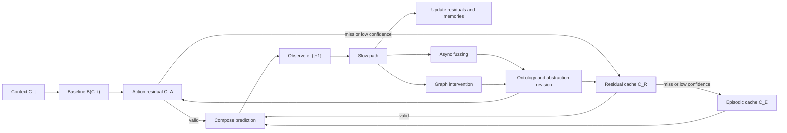

# EventFrame Whitepaper

_Working paper assembled from reviewed source sections. This build is local-only and not a publication artifact._

## Abstract

EventFrame is a framework for event-centric prediction. It represents experience as typed event frames rather than as unstructured sequences alone, but it does not treat those frames as fundamental ontology. The motivating assumption is that the underlying physical or computational substrate is far denser than any usable predictive representation. Event frames are compressed records of distinctions that matter for prediction, intervention, memory, and review.

The central representational object is an event frame \(e_t \in \mathcal{E}_{\Delta_\tau}\), where \(\mathcal{E}_{\Delta_\tau}\) is a product space over compressed event fields at temporal resolution \(\Delta_\tau\). Formally, an event frame can be viewed as a coarse-graining \(e_t = \Gamma_{\Delta_\tau}(\omega_{A_t})\) of a denser substrate history \(\omega_{A_t}\). The precision of the when field determines how many candidate frames are instantiated, from seconds to microseconds when measurement supports that scale. A predictor receives a context \(C_t = e_{t-k+1:t}\) and estimates the next event \(\hat{e}_{t+1}\). The primary loss in this formulation is temporal: prediction error is measured by the distance between the predicted event time and the observed event time, normalized by a horizon \(H\) and clamped to \([0,1]\).

EventFrame separates a baseline transition model from residual correction. A baseline predictor \(B(C_t)\) produces an initial event estimate. A residual cache may retrieve a reusable correction \(r_t^*\) when the current context resembles a previous context with a similar prediction error. A lower-latency action-residual cache may reuse corrections keyed by compact action signatures when confidence, support, and age checks pass. The corrected event is composed as \(\hat{e}_{t+1} = B(C_t) \oplus_{\mathcal{A}} r_t^*\), where \(\oplus_{\mathcal{A}}\) denotes a constrained composition operator inspired by Causal Fermion Systems without claiming physical equivalence to that theory. The composition step is intended to preserve structured admissibility while allowing cached corrections to improve fast-path prediction.

The framework also defines methods for property fuzzing, invariant discovery, ontology self-organization, event confluence, event divergence, and abstraction. Over time, multiple event streams may become representable as a single aggregate event, as streams merge into larger rivers. The opposite can also occur: small distinctions can amplify into materially different downstream event branches. To keep these boundaries measurable, every event-frame group retains at least one representative frame. Approximate predictive lumpability provides the merge-side route from detailed event frames to coarser abstract states when the abstraction preserves transition behavior for the target of interest. The Anti-Pigeon principle provides the split-side criterion: a bucket must split or be marked divergence-sensitive when its members predict materially different futures.

The paper presents EventFrame as a conservative research framework. Its main claims are architectural, methodological, and experimental rather than settled theoretical results. The proposed evaluation program measures temporal prediction accuracy, residual-cache utility, invariant stability, abstraction quality, and the tradeoff between fast-path prediction and slow-path refinement.

## 1. Introduction

Prediction systems often operate over sequences whose internal structure is only implicit. A model may receive tokens, vectors, logs, traces, or state observations and learn statistical regularities among them. This can be effective, but it makes some questions difficult to ask directly: which compressed distinction mattered, what changed, when did it happen, where did it occur, why might it matter, and how did it transform the state of the world?

EventFrame begins from a compression premise. The underlying substrate may be far denser than any representation a prediction system can maintain, whether the substrate is physical, simulated, biological, robotic, or software-based. A useful prediction system cannot assign a separate durable event frame to every microscopic or low-level distinction. EventFrame therefore treats the event frame as a coarse-grained representation, not as the fundamental thing itself. Physical information bounds can motivate this intuition, but the framework only requires the domain-general inequality that substrate detail is much larger than representable event space.

The framework represents experience as event frames selected for predictive and intervention relevance. An event frame is a typed record of an occurrence or transition after compression. It includes the 5W1H fields of who, what, when, where, why, and how, plus auxiliary state and confidence metadata. The goal is not to claim that every domain naturally exposes these fields perfectly. The goal is to create a disciplined representation in which uncertainty, missing fields, competing explanations, and compression choices can still be recorded explicitly.

Conceptually, EventFrame treats prediction as a question about the next structured event. Given a recent context \(C_t = e_{t-k+1:t}\), the system estimates \(\hat{e}_{t+1}\). The canonical loss is temporal: the prediction is evaluated by how far the predicted event time is from the observed event time within a chosen horizon \(H\). This keeps the first version of the framework focused. Other field-level errors can be measured, but the central operational question is whether the framework improves time-to-event prediction while retaining interpretable structure.

The reference prediction procedure has six steps:

1. Form a context \(C_t\) from the last \(k\) event frames.
2. Compute a baseline prediction \(b_t = B(C_t)\).
3. Retrieve a residual correction \(r_t^*\) from a residual cache if the current context matches a prior error pattern.
4. Compose the prediction as \(\hat{e}_{t+1} = b_t \oplus_{\mathcal{A}} r_t^*\).
5. Observe \(e_{t+1}\) and evaluate temporal loss.
6. Use a slower refinement process to update residuals, test invariants, revise abstractions, or revise the event ontology.

This procedure explains why the framework includes both memory and residual prediction. Episodic memory stores prior cases. A residual cache stores reusable corrections to a baseline transition. The distinction matters because recalling a similar event and applying a similar error correction are not the same operation. The first supports case-based reasoning; the second supports low-latency approximation when similar contexts produce similar transition errors.

EventFrame also proposes a slow path for analysis beyond immediate prediction. Property fuzzing perturbs event fields to test whether predicted outcomes remain stable. Stable properties can become candidate invariants. Event confluence asks whether multiple streams can be represented as one aggregate event without losing target-relevant prediction. Event divergence asks whether a small distinction amplifies into materially different downstream branches. Approximate predictive lumpability then asks whether detailed event frames can be projected into coarser abstract states without losing target-relevant transition behavior. The Anti-Pigeon principle is the corresponding split criterion: do not collapse events into broad categories merely because they look similar; split or mark a group when its members predict target-distinct futures.

The contributions of this paper are therefore:

1. A compressed event-frame ontology for prediction-oriented representation.
2. A mathematical event-space formulation with temporal prediction loss.
3. A residual prediction model with constrained composition and action-residual fast-path caching.
4. A combined episodic and residual memory architecture.
5. A property fuzzing method for invariant discovery and 5W1H ontology self-organization.
6. A lumpability-based approach to abstraction.
7. A fast-path and slow-path reference runtime model.
8. Experiment designs for testing the framework's claims.

These are proposed as a research framework, not as a finished theory or a fixed implementation. Several claims require empirical validation, especially the utility of residual caches, the stability of invariants discovered by fuzzing, and the quality of learned abstractions. The next section defines the event ontology used by the rest of the paper.

## Claims Register

This section states the paper's major claims as falsifiable targets. The claims are not treated as established results. Each one names what would need to be measured, proved, or falsified by later experiments.

Claim 1. Structured event frames are useful predictive units if, for a declared task, they improve interpretability or temporal prediction relative to unstructured sequence records without hiding field-level error.

Claim 1a. Event frames are compressed representations, not fundamental ontology, if they can be modeled as coarse-grained records selected from a denser substrate by predictive and intervention relevance.

Claim 1b. Temporal precision controls frame granularity if changing the declared time resolution \(\Delta_\tau\) changes the candidate-frame set, cache pressure, and detectable divergence boundaries in measurable ways.

Claim 2. Residual caches reduce prediction cost or error when similar contexts or action signatures produce similar baseline errors and retrieved residuals improve temporal loss often enough to justify lookup and maintenance.

Claim 3. Episodic memory and residual cache memory serve different roles because prior-case recall and prior-error correction can be independently useful or harmful under the same prediction context.

Claim 4. Property fuzzing exposes candidate invariants and ontology corrections when controlled perturbations of event fields reveal which assigned 5W1H roles are stable, misleading, or target-relevant across validation contexts.

Claim 5. Approximate predictive lumpability provides a route to abstraction when projected event states preserve target-relevant transition behavior within a declared divergence threshold.

Claim 5a. Event streams can conjoin or diverge over time when multiple streams become prediction-equivalent under a merge threshold or when small distinctions amplify into target-distinct downstream futures.

Claim 5b. Each event-frame group should retain a representative frame if later intervention, divergence, and convergence tests need a concrete anchor for the group.

Claim 6. Anti-Pigeon prevents invalid abstraction when an event bucket whose members predict materially different futures is split, refined, or marked divergence-sensitive instead of being retained as one abstraction.

Claim 6a. Intervention-effective event distinctions are sparse if useful prediction and intervention distinctions occupy a small subset of the microscopic or candidate-frame distinctions considered by the model.

Claim 7. Fast-path and slow-path separation is computationally useful if low-latency prediction can reuse cached residuals while slower background work improves future predictions without blocking the current one.

## 2. Event Ontology

EventFrame uses event frames as the basic predictive unit, but not as the fundamental ontology. The underlying substrate is assumed to be much denser than the representation used by the predictor. That substrate may be physical, simulated, biological, robotic, or software-based. EventFrame does not attempt to model every low-level distinction. It treats an event frame as a compressed representation of a region where a distinction may matter for prediction or intervention.

An event is therefore a structured representation of a change, occurrence, action, observation, or state transition after coarse-graining. An event frame records that compressed event in fields that can be compared, predicted, fuzzed, cached, and abstracted.

An event frame at index \(t\) is written:

\[
e_t = (w_t, a_t, \tau_t, \ell_t, m_t, h_t, x_t, c_t)
\]

where \(w_t\) denotes participating agents or entities, \(a_t\) denotes the action or occurrence type, \(\tau_t\) denotes the time index or interval, \(\ell_t\) denotes location or spatial context, \(m_t\) denotes motive, objective, causal explanation, or inferred driver, \(h_t\) denotes mechanism or process, \(x_t\) denotes auxiliary state, and \(c_t\) denotes confidence, provenance, or uncertainty metadata.

The conceptual role of this ontology is compression. It prevents prediction from treating history as a single undifferentiated sequence, but it also prevents prediction from pretending that every microscopic distinction deserves its own event identity. The fields ask different compressed questions. The "what" field identifies an occurrence type. The "when" field supports temporal prediction loss. The "who" and "where" fields localize the event. The "why" and "how" fields record explanatory hypotheses and mechanisms. The auxiliary state field allows symbolic, vector, graph, or latent variables to travel with the event. The confidence field prevents uncertain extraction from pretending to be certain observation.

Let \(\Omega\) denote a dense substrate state space and let \(\omega_{A_t}\) denote the substrate history over a finite region \(A_t\). A coarse-graining map at temporal resolution \(\Delta_\tau\):

\[
\Gamma_{\Delta_\tau}: \Omega^{A_t} \rightarrow \mathcal{E}_{\Delta_\tau}
\]

produces an event frame:

\[
e_t = \Gamma_{\Delta_\tau}(\omega_{A_t}).
\]

This equation states the ontology clearly: the event frame is a lossy, task-oriented compression. The compression is useful only if it preserves distinctions that matter for prediction, intervention, memory, or review.

The temporal resolution \(\Delta_\tau\) controls how precise the "when" field is. A model may choose second-level frames, microsecond-level frames, or another declared scale. Finer resolution can instantiate more candidate frames, but it does not imply that every candidate frame is intervention-effective or should be retained forever. Sparsity means that useful distinctions are rare relative to the possible substrate and candidate-frame distinctions, not that the model is forbidden from creating many candidate frames when the task demands precision.

Mathematically, the event space is treated as a typed product:

\[
\mathcal{E} =
\mathcal{W} \times \mathcal{A} \times \mathcal{T} \times
\mathcal{L} \times \mathcal{M} \times \mathcal{H} \times
\mathcal{X} \times \mathcal{C}.
\]

This equation is operational, not decorative. It says that before a field can be used in prediction, caching, fuzzing, or abstraction, the field must have a representation and a comparison rule. For example, \(\mathcal{T}\) may contain timestamps or intervals; \(\mathcal{L}\) may contain coordinates, graph nodes, or symbolic regions; \(\mathcal{C}\) may contain confidence scores and source provenance. EventFrame does not require one universal encoding for all domains, but it requires the encoding to be declared.

An event state is the system state before, during, or after an event. In some domains, \(x_t\) may include an explicit pre-state and post-state. In others, \(x_t\) may be a latent state vector inferred from observations. A transition occurs when one event context gives rise to a later event frame. The basic trajectory is:

\[
E_{1:T} = (e_1, e_2, \ldots, e_T).
\]

Operationally, a prediction step extracts a context from this trajectory:

\[
C_t = e_{t-k+1:t}.
\]

The context \(C_t\) is the recent event history available to the predictor. It gives the predictor enough local structure to ask what event should occur next and when. If the context is too short, important causal or temporal dependencies may be missing. If the context is too long, lookup and transition estimation may become noisy or expensive. The context length \(k\) is therefore a modeling choice that should be evaluated experimentally.

The ontology also supports links among events. Temporal links order events and represent intervals or delays. Spatial links relate event locations. Causal links express hypothesized dependencies, such as one event enabling, preventing, or modifying another. These links may be stored inside \(x_t\), represented as fields in \(c_t\), or modeled as edges in a separate event graph. The important constraint is that links remain available to the prediction and review process rather than being hidden in uninspectable history.

Event histories are therefore not limited to linear chains. Multiple event streams can become representable as a single aggregate event over time. This is event confluence: separate streams merge into a larger stream or macro-event when their separate identities no longer affect the target beyond a declared threshold. The reverse can also occur. A small distinction can branch into multiple downstream event streams when a perturbation is amplified by the dynamics. This is event divergence, or butterfly-effect-style sensitivity. EventFrame must model both patterns because compression that is safe in a confluence region may be unsafe near a divergence point.

For this reason, EventFrame keeps at least one representative event frame for every event-frame group. A group may be produced by abstraction, cache-key equivalence, lumpability, or confluence. The representative is a concrete retained frame, not merely a label. It gives the system something to intervene on, perturb, and compare when measuring whether a group should split because an intervention causes divergence, or whether several groups should merge because their downstream behavior has converged.

The event sparsity hypothesis follows from this compression view. If every microscopic substrate distinction required a unique event frame, the representation would be physically and computationally implausible. EventFrame instead assumes that intervention-effective event distinctions are sparse: only some compressed differences change the prediction target or downstream state beyond a threshold. Property fuzzing, ablation, and intervention tests are ways to discover which distinctions are worth preserving.

The main limitation of the ontology is extraction and compression quality. In real data, the "why" and "how" fields may be ambiguous, inferred, or unavailable. More fundamentally, the chosen coarse-graining \(\Gamma_{\Delta_\tau}\) may discard distinctions that later turn out to matter. EventFrame handles this by allowing missing values, confidence metadata, and revision under slow-path review rather than requiring false precision. A conservative implementation should distinguish observed fields from inferred fields and should propagate uncertainty into prediction and review. The next section defines the mathematical framework built on this compressed ontology.

## 3. Mathematical Framework

The mathematical framework turns compressed event frames into objects that can be predicted, evaluated, cached, and abstracted. The main purpose of the formalism is operational: given a context \(C_t\), produce a next-event estimate \(\hat{e}_{t+1}\), measure its temporal error, and decide whether memory or abstraction should be updated.

Let \(\Omega\) denote a dense substrate state space. For a finite region \(A_t\), let \(\omega_{A_t}\) denote the substrate history over that region. At temporal resolution \(\Delta_\tau\), an event frame is produced by a coarse-graining map:

\[
e_t = \Gamma_{\Delta_\tau}(\omega_{A_t}), \quad
\Gamma_{\Delta_\tau}: \Omega^{A_t} \rightarrow \mathcal{E}_{\Delta_\tau}.
\]

The conceptual role of \(\Gamma_{\Delta_\tau}\) is to select usable predictive distinctions from a substrate that is too dense to represent directly. The operational use is that every prediction, cache key, and invariant test operates on \(e_t\), while slow-path review may revise \(\Gamma_{\Delta_\tau}\) or \(\Delta_\tau\) if the compression discards distinctions that matter.

Let \(\mathcal{E}_{\Delta_\tau}\) be the compressed event space defined by the product of typed fields at temporal resolution \(\Delta_\tau\). A linear trajectory is:

\[
E_{1:T} = (e_1, e_2, \ldots, e_T), \quad e_t \in \mathcal{E}_{\Delta_\tau}.
\]

The time field may be quantized by:

\[
Q_{\Delta_\tau}: \mathbb{R} \rightarrow \mathcal{T}_{\Delta_\tau}.
\]

If \(\Delta_\tau = 1\,s\), the model works at second-level precision. If
\(\Delta_\tau = 1\,\mu s\), it works at microsecond-level precision, provided
the data support that scale. Finer \(\Delta_\tau\) increases the number of
candidate frames and may improve boundary detection, but it also increases
cache pressure and noise sensitivity.

For readability, later equations write \(\mathcal{E}\) as shorthand for
\(\mathcal{E}_{\Delta_\tau}\) when the temporal resolution is fixed.

More generally, an event history is a directed acyclic event graph:

\[
G_t = (V_t, R_t),
\]

where \(V_t \subset \mathcal{E}\) is a set of event frames and \(R_t\) contains temporal, causal, or dependency edges. This graph view allows streams to merge and branch instead of forcing all event histories into a single chain.

For a context length \(k\), the prediction context is:

\[
C_t = e_{t-k+1:t} = (e_{t-k+1}, \ldots, e_t) \in \mathcal{E}^k.
\]

A transition model maps this context to a predicted event:

\[
F_\theta: \mathcal{E}^k \rightarrow \mathcal{E}.
\]

Here \(\theta\) may denote learned parameters, rules, retrieval settings, or a mixture of these. The direct formulation is:

\[
\hat{e}_{t+1} = F_\theta(C_t).
\]

The conceptual role of \(F_\theta\) is simple: it is the mechanism that converts recent structured history into a next event. The operational use is also direct: compute \(C_t\), apply \(F_\theta\), and receive \(\hat{e}_{t+1}\). Later sections decompose \(F_\theta\) into a baseline predictor plus residual correction, but the single-function view is useful for defining loss.

The canonical loss is temporal. For point-valued event times:

\[
\mathcal{L}_{time}^{H}(\theta) =
\min\left(1,\frac{\left|\tau(\hat{e}_{t+1})-\tau(e_{t+1})\right|}{H}\right).
\]

The variable \(H > 0\) is a prediction horizon. The operator \(\tau(e)\) extracts the time field of an event. The loss is zero when the predicted and observed times match, grows linearly within the horizon, and saturates at one when the error reaches or exceeds \(H\). This clamping is deliberate: it prevents a small number of extreme misses from dominating all diagnostics.

For interval-valued times, replace absolute difference with an interval distance \(d_{\mathcal{T}}\):

\[
\mathcal{L}_{time}^{H}(\theta) =
\min\left(1,\frac{d_{\mathcal{T}}(\tau(\hat{e}_{t+1}),\tau(e_{t+1}))}{H}\right).
\]

The interval distance may be midpoint distance, endpoint Hausdorff distance, or another declared metric. The assumption is that \(\mathcal{T}\) has enough structure to compare predicted and observed times. If the time field is missing or uncertain, the loss should be reported with that uncertainty rather than silently treated as exact.

Optional diagnostic distances may be defined over other event fields. For a field projection \(\rho_i: \mathcal{E} \rightarrow \mathcal{X}_i\), a diagnostic field loss may be written:

\[
\mathcal{L}_i(\theta) = d_i(\rho_i(\hat{e}_{t+1}), \rho_i(e_{t+1})).
\]

These losses answer secondary questions: did the predictor identify the right actor, action type, location, or mechanism? They are not the canonical objective in the current formulation, but they are important for error analysis and for discovering which fields matter in a domain.

The event sparsity hypothesis can be stated operationally. Let \(I_j\) be an intervention on a substrate or event-frame distinction, and let \(Y\) be a prediction target. A distinction is intervention-effective when:

\[
d_Y(P(Y \mid do(I_j)), P(Y)) > \eta_Y.
\]

EventFrame assumes that such distinctions are sparse relative to the microscopic substrate. This is not a proven physical theorem in the paper. It is a modeling hypothesis that justifies searching for compressed event frames rather than assigning a unique frame to every microscopic cell.

Confluence and divergence define when compression is safe or unsafe over time. Let \(S_1,\ldots,S_m\) be event streams or subgraphs. A merge operator:

\[
e^{merge}_t = \mu_{\delta}(S_1,\ldots,S_m)
\]

is accepted only when replacing the streams by \(e^{merge}_t\) changes the prediction target by at most a threshold. Conversely, a branching operator:

\[
\mathcal{B}_{\epsilon}: \mathcal{E} \rightarrow \mathcal{P}(\mathcal{G})
\]

identifies downstream event subgraphs reachable under a perturbation or intervention scale \(\epsilon\). If the target distribution changes by more than \(\eta_Y\), the original distinction is divergence-effective and should not be compressed away.

Representative preservation makes this test operational for groups. Let \(\mathcal{H}_j \subseteq \mathcal{E}\) be an event-frame group induced by an abstraction, cache key, or merge. EventFrame requires:

\[
\exists \bar{e}_j \in \mathcal{H}_j
\]

for every non-empty group. The retained frame \(\bar{e}_j\) is a measurement anchor. For an intervention \(I\), a group-level divergence score can be estimated as:

\[
D_j(I) =
d_Y(P(Y \mid do(I), \bar{e}_j), P(Y \mid \bar{e}_j)).
\]

If \(D_j(I)\) exceeds the target threshold, the group is not stable under that intervention and should be split, refined, or marked as sensitive. If two representative frames remain within a merge threshold, their groups may be candidates for confluence.

Confidence and provenance metadata enter the framework through \(c_t\). Operationally, \(c_t\) should affect whether a field is trusted for training, lookup, fuzzing, or invariant extraction. For example, if \(m_t\) is an inferred motive with low confidence, fuzzing that motive should not be treated the same as perturbing an observed timestamp. A conservative implementation can use \(c_t\) to weight losses, filter cache entries, or mark claims as uncertain.

The framework is limited by representation choices. A poor event encoding can make a useful transition appear noisy, while an overly rich encoding can make similar events appear unrelated. The rest of the paper therefore treats distance functions, cache keys, and abstraction maps as objects that must be specified and tested, not assumed. The next section decomposes the transition model into baseline prediction and residual correction.

## 4. Residual Prediction

Residual prediction separates a first-pass event estimate from a correction. The baseline predictor captures ordinary transition structure. The residual captures recurring ways in which the baseline tends to be wrong. This separation is useful when full recomputation is expensive or when similar contexts repeatedly produce similar errors.

Let \(B\) be a baseline predictor:

\[
B: \mathcal{E}^k \rightarrow \mathcal{E}.
\]

Given a context \(C_t\), the baseline prediction is:

\[
b_t = B(C_t).
\]

A residual model or residual cache supplies a correction \(r_t\). In ordinary vector spaces, one might add a residual directly. EventFrame avoids treating event frames as simple vectors. Instead, it writes prediction as structured composition:

\[
\hat{e}_{t+1} = b_t \oplus_{\mathcal{A}} r_t.
\]

The operator \(\oplus_{\mathcal{A}}\) applies a residual correction while preserving admissibility constraints. The subscript \(\mathcal{A}\) indicates that the corrected representation is regularized by a causal-action-inspired criterion. This is inspired by Causal Fermion Systems in the limited sense that meaningful configurations are evaluated through structured relationships and an action-like admissibility condition. EventFrame does not claim to be a physical causal fermion system.

The reference composition rule is:

\[
b \oplus_{\mathcal{A}} r =
q^{-1}_{\mathrm{approx}}\left(\Pi_{\mathcal{Q}}\left(q(b) + \operatorname{clamp}(r)\right)\right).
\]

Here \(q: \mathcal{E} \rightarrow \mathcal{Q}\) encodes an event into an operator-like representation space, \(r \in \mathcal{Q}\) is a residual correction, \(\operatorname{clamp}(r)\) bounds the residual magnitude, \(\Pi_{\mathcal{Q}}\) projects the corrected representation back into the admissible representation space, and \(q^{-1}_{\mathrm{approx}}\) decodes the representation back into an event frame. The operational use is: encode the baseline, apply a bounded correction, project to a valid representation, and decode to a predicted event.

The admissibility constraint can be made measurable through a surrogate event action. One conservative choice is:

\[
\mathcal{A}_{event}(\hat{e}_{t+1}) =
\lambda_r \mathcal{L}_{time}^{H}
+ \lambda_a D_{abs}
+ \lambda_c D_{edge}
+ \lambda_u U(\hat{e}_{t+1}),
\]

where \(D_{abs}\) measures abstraction or bucket inconsistency, \(D_{edge}\) measures causal-edge or graph-transition inconsistency, \(U(\hat{e}_{t+1})\) measures prediction uncertainty, and the \(\lambda\) terms are non-negative weights declared by the implementation. This is not a Causal Fermion Systems action. It is a runtime surrogate inspired by the idea that admissible configurations should minimize a structured action-like quantity. A corrected prediction is preferred only when it improves temporal loss without creating excessive abstraction, graph, or uncertainty penalties.

The same surrogate action should drive runtime escalation. If the corrected prediction satisfies:

\[
\mathcal{A}_{event}(\hat{e}_{t+1}) \le \eta_{\mathcal{A}},
\]

the fast path may trust the correction, subject to confidence and age checks. If the action exceeds \(\eta_{\mathcal{A}}\), the system should treat the correction as unresolved: trigger background fuzzing, inspect causal edges, update residual confidence, or revise abstractions and ontology assignments. This makes \(\mathcal{A}_{event}\) a shared decision quantity rather than a decorative score.

Residuals may be estimated after observation. If the baseline prediction is \(b_t\) and the observed event is \(e_{t+1}\), then the observed residual is the correction that would have moved \(b_t\) toward \(e_{t+1}\) under the chosen representation. Because \(\mathcal{Q}\) is only specified as an operator-like representation space, the residual should be estimated by a declared residual estimator:

\[
r_t^{obs} = \Delta_{\mathcal{Q}}(q(b_t), q(e_{t+1})).
\]

Here \(\Delta_{\mathcal{Q}}\) is model-dependent. In a vector representation it may reduce to subtraction, but in a structured or operator-like representation it may be an optimization, projection, alignment, or learned correction rule. The residual should therefore be treated as a reusable correction candidate, not as a guaranteed truth. More strongly, residuals are cached causal hypotheses about how the baseline tends to fail; their continued validity is determined by future observations. Their value depends on the representation and the domain.

Residual reuse requires a lookup rule. A residual cache stores triples:

\[
\mathcal{C}_R = \{(\kappa_i, r_i, s_i)\}_{i=1}^{N},
\]

where \(\kappa_i\) is a context key, \(r_i\) is a residual, and \(s_i\) stores metadata such as age, confidence, and observed temporal loss. A key function \(\kappa: \mathcal{E}^{k} \rightarrow \mathcal{K}\) maps the current context to a retrieval key. The retrieved residual is:

\[
r_t^* =
\begin{cases}
r_j & \text{if } j = \arg\min_i d_{\mathcal{K}}(\kappa(C_t), \kappa_i)
\text{ and } d_{\mathcal{K}}(\kappa(C_t), \kappa_j) \le \epsilon_K,\\
0_{\mathcal{Q}} & \text{otherwise.}
\end{cases}
\]

This rule is the operational heart of fast-path residual prediction. If a sufficiently similar prior context exists, reuse its correction. If not, fall back to the baseline.

For implementations that require a lower-latency path, EventFrame can use an action-residual cache keyed by a compact action signature. Let:

\[
\alpha: \mathcal{E}^{k} \rightarrow \mathcal{K}_A
\]

map a context to an action key, such as a tuple of action type, temporal regime, relevant actor class, and abstraction bucket. The action-residual cache is a partial map:

\[
\mathcal{C}_A: \mathcal{K}_A \rightharpoonup (r_a, c_a, n_a, t_a),
\]

where \(r_a \in \mathcal{Q}\) is the cached action residual, \(c_a \in [0,1]\) is confidence, \(n_a\) is support count, and \(t_a\) is last update time. The fast-path action residual is:

\[
r_t^{A} =
\begin{cases}
r_a & \text{if } \alpha(C_t) \in \operatorname{dom}(\mathcal{C}_A)
\text{ and } c_a \ge \gamma_A
\text{ and } n_a \ge n_{\min}
\text{ and } age(t_a) \le A_{\max},\\
0_{\mathcal{Q}} & \text{otherwise.}
\end{cases}
\]

If \(\mathcal{C}_A\) is implemented as a bounded hash table or array over declared action keys, lookup is expected \(O(1)\). This is an implementation property, not a mathematical guarantee: collisions, eviction, unbounded key growth, or nearest-neighbor fallback can increase cost. The action-residual path should therefore report hit rate, confidence, support, age, and post-correction temporal loss.

Action-residual validity is updated only after observation. A simple confidence update can be:

\[
c_a^{new} =
(1-\beta)c_a + \beta \mathbf{1}
\left[
\mathcal{A}_{event}(b_t \oplus_{\mathcal{A}} r_a)
+ \delta_A
< \mathcal{A}_{event}(b_t)
\right],
\]

where \(\delta_A\) is the required improvement margin and \(\beta\) is an update rate. The update rewards corrections that improve the shared runtime action, not only raw temporal loss. When confidence falls below \(\gamma_A\), when support is too small, when the corrected prediction worsens the action, or when \(\mathcal{A}_{event}(\hat{e}_{t+1}) > \eta_{\mathcal{A}}\), the slow path should trigger fuzzing, episodic review, graph intervention, ontology review, or residual eviction rather than continuing to trust the cached action residual.

The main failure modes are cache pollution, overcorrection, stale residuals, and false similarity. Cache pollution occurs when low-quality residuals accumulate. Overcorrection occurs when a residual dominates the baseline. Stale residuals occur when the environment changes. False similarity occurs when the key function treats different contexts as equivalent. The clamping function, metadata \(s_i\), and threshold \(\epsilon_K\) are safeguards, but they do not remove the need for empirical evaluation. The next section distinguishes this residual cache from episodic memory.

## 5. Memory Model

EventFrame uses memory for two different purposes: recalling prior events and reusing prior corrections. These purposes should not be collapsed. Episodic memory stores cases. A residual cache stores adjustments to a baseline prediction. Both may support prediction, but they answer different questions.

An episodic key-value cache can be written:

\[
\mathcal{C}_E = \{(u_i, v_i, s_i)\}_{i=1}^{M},
\]

where \(u_i\) is a retrieval key, \(v_i\) is an event frame, trajectory segment, or summary, and \(s_i\) is metadata. Given a context \(C_t\), an episodic lookup retrieves prior cases that resemble the current situation. The operational use is case recall: retrieve examples that may inform the baseline model, explain the current state, or provide analogies for review.

A residual cache is different:

\[
\mathcal{C}_R = \{(\kappa_i, r_i, s_i)\}_{i=1}^{N}.
\]

Here \(r_i\) is not a prior event. It is a correction to a prior baseline prediction. The operational use is correction reuse: if the current context resembles a past context where the baseline missed in a known direction, apply the cached residual through \(\oplus_{\mathcal{A}}\).

The conceptual distinction is important. Episodic memory says, "something like this happened before." Residual memory says, "the predictor made this kind of mistake before." A system can have useful episodic recall but poor residual reuse if prior cases are similar but their prediction errors differ. Conversely, a residual may be reusable even when the full episode is not otherwise relevant.

Prediction combines the two memories by priority rather than by collapse. A reference flow is:

1. Compute the baseline \(b_t = B(C_t)\).
2. Try action-residual lookup in \(\mathcal{C}_A\).
3. If the action residual is valid, compose \(\hat{e}_{t+1} = b_t \oplus_{\mathcal{A}} r_t^A\).
4. If confidence is insufficient, try residual lookup in \(\mathcal{C}_R\).
5. If residual confidence is still insufficient, retrieve episodic cases from \(\mathcal{C}_E\) and use them to refine the baseline, explain uncertainty, or schedule slow-path review.
6. After observation, update episodic memory, residual confidence, and any action-residual entry that was used or falsified.

This flow keeps the low-latency path cheap while preserving a fallback to richer case evidence. Residual memory can answer quickly when the current situation matches a known error pattern. Episodic memory becomes more important when the residual cache is missing, low-confidence, stale, or contradicted by recent outcomes.

Similarity lookup requires declared key functions and distances. For episodic memory, the key function may emphasize entities, action types, and temporal neighborhoods. For residual memory, the key should emphasize features that predict baseline error. These are not necessarily the same. For example, two events may share an action type but differ in timing dynamics; they may be episodically similar while producing different residuals.

Consolidation is the process of updating memory after observation. A conservative consolidation step should:

1. Record the observed event \(e_{t+1}\) with provenance and confidence.
2. Compute temporal loss for the prediction.
3. Estimate whether the baseline error is systematic enough to store as a residual.
4. Update or decay cache entries based on age, confidence, and repeated utility.
5. Preserve at least one representative event frame for every event-frame group used by abstraction, confluence, or cache-key equivalence.
6. Mark low-confidence entries so they cannot dominate future predictions.

Cache pollution is the main risk. If every error becomes a residual, the cache may memorize noise. If keys are too broad, residuals are applied in inappropriate contexts. If keys are too narrow, useful residuals are never reused. The cache should therefore track hit rate, post-correction loss, and whether retrieved residuals improve over the baseline.

Fast-path memory use should be cheap. A practical implementation may use approximate nearest-neighbor lookup, hashed keys, or bounded-size caches. The paper treats constant-time lookup as an approximation, not as a guarantee. Slow-path memory refinement may be more expensive because it runs after the initial prediction, when latency pressure is lower.

Representative preservation is a memory responsibility. If an abstraction stores only a label and discards all concrete examples, the system loses the ability to test whether interventions split that group or whether several groups have converged. At least one retained representative frame per group keeps later boundary measurement possible.

The memory model supports the overall EventFrame loop. Episodic memory helps interpret and compare cases. Residual memory corrects recurring transition errors. Slow-path consolidation keeps both memories from turning into unfiltered history. The next section uses perturbation rather than recall to discover which event properties are stable under prediction.

## 6. Fuzzing and Invariants

Property fuzzing tests whether predictions depend on specific event fields. The method perturbs a selected property, reruns prediction, and measures whether a target property of the output changes beyond a declared threshold. If a prediction remains stable under a controlled family of perturbations, the stable property becomes a candidate invariant.

Let \(\phi_i\) be an event property, such as actor, action type, time, location, or a component of auxiliary state. A single-event fuzzing operator is:

\[
\mathcal{F}_{i,\epsilon}(e) = e',
\]

where \(e'\) differs from \(e\) primarily in property \(\phi_i\) by perturbation magnitude \(\epsilon\). For prediction, the corresponding context-level operator is:

\[
\mathcal{F}_{i,\epsilon}^{(r)}: \mathcal{E}^k \rightarrow \mathcal{E}^k,
\]

where \(r\) identifies the event position or subset of \(C_t\) being perturbed.

The conceptual role of fuzzing is to separate apparent relevance from predictive relevance. A field may look semantically important but not affect the prediction target for a specific task. Another field may look incidental but sharply change the predicted event time. Fuzzing gives a controlled way to test these dependencies.

Fuzzing also supports 5W1H ontology self-organization. The initial assignment of information to who, what, when, where, why, and how may be wrong, incomplete, or too coarse. Let \(\rho_j(e)\) denote the component of an event assigned to role \(j \in \{W,A,T,L,M,H\}\), corresponding to actor, action, time, location, motive, and mechanism. For a field \(\phi_i\), define its target influence on output property \(g\) as:

\[
I_{i \rightarrow g} =
\mathbb{E}_{C_t,\epsilon,r}
\left[
d_g(g(F_\theta(C_t)), g(F_\theta(\mathcal{F}_{i,\epsilon}^{(r)}(C_t))))
\right].
\]

If a field assigned to one role consistently influences a target associated with another role, the ontology should not pretend the original assignment is final. The slow path may mark the field for migration, duplication, or splitting. For example, a value recorded as "where" may function as part of "how" if perturbing it changes the mechanism of the event rather than only spatial localization. A value recorded as "why" may need to split into confidence-tagged motive hypotheses if different interventions produce incompatible futures.

Let \(g\) be a property of the prediction output, and let \(d_g\) be a distance over that property. The change induced by fuzzing is:

\[
\Delta_g =
d_g(g(F_\theta(C_t)), g(F_\theta(\mathcal{F}_{i,\epsilon}^{(r)}(C_t)))).
\]

A property is treated as stable under the fuzzing family if:

\[
\Delta_g \le \eta_g,
\]

where \(\eta_g\) is a declared threshold. For reporting, use a clamped score:

\[
S_g = \min\left(1, \frac{\Delta_g}{\eta_g}\right).
\]

The value \(S_g = 0\) means no observed change, while \(S_g = 1\) means the perturbation reaches or exceeds the threshold. For temporal prediction, the threshold can be tied to the horizon \(H\). A strict test may use \(\eta_\tau = 0.05H\), while an exploratory test may use \(\eta_\tau = 0.10H\).

An operational fuzzing protocol is:

1. Select a context \(C_t\), prediction target \(g\), field \(\phi_i\), and context position or subset \(r\).
2. Define the perturbation family and valid magnitudes \(\epsilon\).
3. Run the original prediction.
4. Run predictions on perturbed contexts.
5. Compute \(\Delta_g\) and \(S_g\).
6. Record stable, unstable, and boundary regions.

The same protocol can detect confluence and divergence. If perturbing two event streams does not change the target beyond threshold, the streams may be candidates for confluence into a merged event. If a small perturbation produces multiple target-distinct downstream predictions, the event sits near a divergence boundary. This is the operational version of butterfly-effect-style sensitivity: small changes matter only when they amplify beyond the declared target threshold.

Counterfactual event frames are the perturbed frames produced by this protocol. They should be marked as synthetic and should not be inserted into episodic memory as observed events. They may, however, be used by the slow path to test invariants, improve key design, or identify abstraction boundaries.

Fuzzing can be extended from fields to event graphs. Let \(G_t = (V_t, R_t)\) be the local event graph and let \(\mathcal{I}_{v,\epsilon}\) denote an intervention on event node, edge, or local subgraph \(v\). A counterfactual graph update is:

\[
G_t' = do(\mathcal{I}_{v,\epsilon})(G_t),
\]

with target effect:

\[
\Delta_Y^{graph} =
d_Y(P(Y \mid G_t'), P(Y \mid G_t)).
\]

The slow path uses this graph intervention when the residual action remains high. The reference loop is:

1. Observe a high residual action \(\mathcal{A}_{event} > \eta_{\mathcal{A}}\).
2. Choose candidate nodes, edges, or local subgraphs from the residual, episodic evidence, or uncertain 5W1H fields.
3. Apply graph interventions to produce counterfactual event graphs.
4. Measure \(\Delta_Y^{graph}\), residual improvement, and abstraction consistency.
5. Update residual keys, causal-edge confidence, ontology assignments, or Anti-Pigeon split markers only when the intervention repeatedly explains the error.

This is counterfactual graph learning, but in a conservative sense. The counterfactual graph is a test object used for slow-path learning, not an observed history.

Ontology updates should therefore be intervention-driven. A conservative update rule is:

\[
\operatorname{revise}(\phi_i) =
\begin{cases}
\operatorname{retain}(\phi_i) & \text{if all relevant } I_{i \rightarrow g} \text{ remain below threshold},\\
\operatorname{migrate}(\phi_i, j \rightarrow j') & \text{if influence is stable for role } j',\\
\operatorname{split}(\phi_i) & \text{if one field carries multiple target-distinct influences},\\
\operatorname{mark\ uncertain}(\phi_i) & \text{if perturbation evidence is unstable.}
\end{cases}
\]

This is not an automatic ontology rewrite. It is a slow-path review signal. The implementation should preserve provenance, confidence, and the previous assignment so that field migration can be audited or reversed. To prevent oscillation, a migration should be promoted only after repeated successful intervention validation. For example, require at least \(n_{\rho}\) independent validation contexts in which the proposed assignment reduces \(\mathcal{A}_{event}\) or target error by margin \(\delta_{\rho}\):

\[
\#\{C_t : \mathcal{A}_{event}^{old}(C_t) - \mathcal{A}_{event}^{new}(C_t) \ge \delta_{\rho}\}
\ge n_{\rho}.
\]

Before that condition is met, the safer state is "mark uncertain" rather than permanent migration.

An invariant is not a universal truth unless the fuzzing family and domain justify that claim. In EventFrame, invariants are usually conditional: stable under these perturbations, in this data regime, for this prediction target, within this threshold. That conservative framing matters because an invariant useful for temporal prediction may fail for actor prediction or causal explanation.

Failure modes include invalid perturbations, unrealistic counterfactuals, threshold gaming, and hidden confounding. If perturbing one field implicitly changes another, the test may not isolate the intended property. If the perturbation creates impossible events, stability may be meaningless. If thresholds are too loose, everything looks invariant and all streams appear to merge; if too strict, no abstraction or confluence is possible. The next section uses invariance evidence to decide when detailed events can be safely compressed.

## 7. Lumpability and Abstraction

Abstraction is useful only when it preserves what the prediction task needs. EventFrame uses approximate predictive lumpability as a formal route from detailed event frames to coarser states. The purpose is to compress detail when the compressed representation preserves transition behavior for the target of interest.

Let:

\[
\pi: \mathcal{E} \rightarrow \mathcal{Z}
\]

be a projection from detailed event frames to abstract states. The abstract state \(\pi(e_t)\) may remove fields, group values, or map a high-dimensional representation into a smaller symbolic or latent state. The projection is useful only if it preserves enough predictive structure.

A transition process is predictively lumpable for a target when:

\[
P(\pi(e_{t+1}) \mid e_t) \approx P(\pi(e_{t+1}) \mid \pi(e_t)).
\]

The left side conditions on the detailed event. The right side conditions only on the abstract state. This one-step expression is a simplified case. For context-length \(k\), the analogous test conditions on \(C_t\) and on the projected context \(\pi(C_t)\). If the two distributions are close, the abstraction preserves target-relevant transition behavior. The approximation should be measured by a declared divergence or distance and accepted only under a threshold.

Operationally, abstraction quality can be tested by comparing predictions before and after projection:

1. Choose a projection \(\pi\) and target property.
2. Estimate transition behavior using detailed contexts.
3. Estimate transition behavior using projected contexts.
4. Compare temporal loss and target distribution divergence.
5. Accept the abstraction only if predictive degradation remains below a declared threshold.

This connects directly to property fuzzing. If perturbing a field does not change the prediction target beyond threshold, that field may be a candidate for abstraction. If lumpability tests show that projected states preserve transition behavior, the abstraction has stronger evidence. Fuzzing gives local stability evidence; lumpability tests transition-level preservation.

Abstraction also has to respect event confluence and divergence. When streams merge, a projection or merge operator may intentionally replace several event histories with one aggregate event. When a small distinction branches into materially different futures, the same projection becomes unsafe. A good abstraction therefore has two duties: merge distinctions that have become prediction-equivalent, and preserve distinctions that are divergence-effective.

EventFrame therefore imposes a representative preservation invariant. Every event-frame group \(\mathcal{H}_j\) created by projection, clustering, confluence, or cache-key equivalence must keep at least one representative frame \(\bar{e}_j \in \mathcal{H}_j\). This representative lets the system measure boundary conditions later: intervene on the representative to test whether the group should diverge, or compare representatives from multiple groups to test whether they have converged enough to merge.

The Anti-Pigeon principle is the split-side criterion that prevents invalid abstraction. It says that events should not be grouped into broad categories merely because they share surface features. Grouping must be earned by invariance evidence, confluence evidence, lumpability evidence, or measured predictive adequacy. The principle is not a theorem. It is a discipline for avoiding abstractions that are convenient but predictively wrong.

Formally, let \(B \subseteq \mathcal{E}\) be an event bucket represented by one abstract state, cache key, or event-frame group. For each retained event \(e_i \in B\), let \(H_i\) denote the prediction history or representative context associated with that event. Let \(P_Y(\cdot \mid H_i)\) be the predicted future distribution for the target \(Y\). Define pairwise future divergence:

\[
D_{ij} =
D\left(P_Y(\cdot \mid H_i), P_Y(\cdot \mid H_j)\right),
\]

where \(D\) is a declared divergence or distance, such as total variation distance, KL divergence when well-defined, Wasserstein distance, or latent predictive distance. The bucket fails the Anti-Pigeon criterion whenever:

\[
\exists e_i,e_j \in B \quad \text{such that} \quad D_{ij} \ge \epsilon_{AP}.
\]

Equivalently, the bucket is valid for the target only when:

\[
\max_{e_i,e_j \in B} D_{ij} < \epsilon_{AP}.
\]

When this test fails, the system applies a split or refinement operator:

\[
\operatorname{Split}_{\epsilon_{AP}}(B) = \{B_1,\ldots,B_M\},
\]

such that each resulting non-empty bucket satisfies the same internal-divergence bound:

\[
\forall B_\ell,\quad \max_{e_i,e_j \in B_\ell} D_{ij} < \epsilon_{AP}.
\]

Every resulting bucket must retain at least one representative event frame. The representative requirement is what makes the split test repeatable: after refinement, the system can continue checking whether a bucket remains stable, should split again, or has converged enough to merge with another bucket.

This makes lumpability and Anti-Pigeon dual operations. Lumpability accepts a merge when future distributions remain close enough under a declared merge threshold. Anti-Pigeon rejects or splits a bucket when internal future divergence crosses a declared split threshold. In practice, the thresholds may differ, for example \(\eta_{\mu} < \epsilon_{AP}\), so the system does not oscillate between merge and split decisions near a noisy boundary.

Abstraction quality should be reported with both benefits and costs. Benefits may include lower memory use, faster lookup, better generalization, and simpler explanations. Costs may include lost distinctions, degraded temporal prediction, and hidden subgroup errors. A good abstraction for fast-path prediction may still be too coarse for causal explanation or invariant discovery.

The main mathematical limitation is that exact lumpability is often too strong for real event data. EventFrame therefore uses approximate predictive lumpability and must cite prior work on Markov chain lumpability, state aggregation, and approximate abstraction. The paper should not claim a new theorem unless a proof is added. The next section places these pieces into a reference runtime model.

## 8. Complexity and Runtime Model

EventFrame separates low-latency prediction from slower refinement. The fast path produces an immediate prediction using the current context, baseline model, and available memory. The slow path evaluates errors, updates caches, tests invariants, and refines abstractions. This separation is a systems claim that must be evaluated experimentally.

The reference fast path is:

1. Form \(C_t = e_{t-k+1:t}\).
2. Compute \(b_t = B(C_t)\).
3. Retrieve \(r_t^A\) from the action-residual cache \(\mathcal{C}_A\), if a valid entry exists.
4. Otherwise retrieve \(r_t^*\) from \(\mathcal{C}_R\).
5. If residual confidence is insufficient, retrieve episodic support from \(\mathcal{C}_E\).
6. Compose \(\hat{e}_{t+1} = b_t \oplus_{\mathcal{A}} r\), using the highest-confidence admissible correction or \(0_{\mathcal{Q}}\).
7. Return the prediction with confidence metadata.

The architecture can be summarized as:

If context formation is treated as a sliding window, its incremental cost is \(O(1)\). The baseline cost is \(T_B(k)\), which depends on the model. Action-residual lookup can be expected \(O(1)\) when \(\mathcal{C}_A\) is a bounded hash table or array over declared action keys. The reason is structural: the 5W1H schema has fixed field arity, the action key \(\alpha(C_t)\) is bounded by declared local fields and abstraction labels, and the graph neighborhood used by the key must have bounded degree. Under those assumptions, lookup depends on the size of the local abstraction key rather than the length of the full history. If action keys grow without bound, if graph degree is unbounded, or if lookup falls back to nearest-neighbor search, the \(O(1)\) approximation no longer applies. General residual lookup cost depends on the cache design. A hash-like lookup may be approximately \(O(1)\), while nearest-neighbor search over \(N\) entries may be \(O(N)\) without indexing. Episodic retrieval has its own cost \(T_E(M)\). Composition cost is \(T_{\oplus}\), determined by encoding, clamping, projection, and decoding.

A simple fast-path cost sketch is:

\[
T_{fast} \approx O(1) + T_B(k) + T_A + T_R(N) + T_E(M) + T_{\oplus}.
\]

Here \(T_A\) is the action-residual lookup cost, \(T_R(N)\) is the general residual lookup cost, and \(T_E(M)\) is episodic retrieval cost. In a successful action-residual hit, \(T_R(N)\) and \(T_E(M)\) may be skipped. This equation should be interpreted as a decomposition, not a guarantee. The framework does not prove constant-time prediction. It identifies where cost enters and which parts can be optimized or approximated.

The slow path begins after an observation becomes available:

1. Evaluate \(\mathcal{L}_{time}^{H}\).
2. Estimate the observed residual.
3. Decide whether the residual is worth caching.
4. Update episodic memory and residual cache metadata.
5. Run selected fuzzing tests.
6. Run selected graph interventions when residual action remains above threshold.
7. Reassess invariants and abstraction maps.
8. Revise 5W1H field assignments when intervention evidence shows that information should migrate, split, or be marked uncertain.

The slow path may be much more expensive:

\[
T_{slow} \approx T_{loss} + T_{residual} + T_{consolidate} + M_f T_{predict} + T_{abstraction},
\]

where \(M_f\) is the number of fuzzed variants and \(T_{predict}\) is the cost of rerunning prediction. Graph interventions add another budgeted term when enabled:

\[
T_{slow+graph} \approx T_{slow} + M_g T_{intervene},
\]

where \(M_g\) is the number of graph interventions and \(T_{intervene}\) is the cost of updating or simulating a counterfactual event subgraph. This cost is acceptable only if slow-path work is deferred, batched, or scheduled under a budget.

The conceptual reason for the split is that prediction and learning have different latency requirements. A system may need to answer quickly, but it does not need to discover invariants synchronously with every prediction. Residual caches allow some slow-path learning to be reused later by the fast path. In the reference loop, residual prediction produces an error hypothesis; graph intervention tests whether changing an event node, edge, or local subgraph explains that error; counterfactual updates refine residuals; and ontology or abstraction updates are promoted only when repeated interventions support the same distinction.

The runtime model has several failure modes. If the residual cache grows without control, lookup cost and pollution increase. If slow-path refinement is delayed too long, stale residuals may remain active. If fast-path prediction trusts low-confidence memory, errors can compound. If abstraction is too aggressive, the system may become fast but wrong.

The runtime should therefore report not only prediction accuracy but also cache hit rate, residual utility, cache age, slow-path budget, and abstraction degradation. The next section proposes experiments to measure these properties.

## 9. Experimental Evaluation

EventFrame's main claims require experiments. The framework should be evaluated on whether compressed event frames preserve intervention-relevant distinctions, whether structured events improve interpretability and prediction, whether residual caches reduce cost or error, whether property fuzzing discovers stable invariants, and whether abstraction preserves target-relevant transition behavior.

A minimal synthetic event world should generate trajectories with known transition rules. Each event should expose the fields:

\[
e_t = (w_t, a_t, \tau_t, \ell_t, m_t, h_t, x_t, c_t).
\]

The generator should include many microscopic variables but control which variables actually influence event timing or downstream state. It should also allow multiple temporal resolutions, such as seconds, milliseconds, and microseconds. This makes it possible to test whether coarse-graining preserves intervention-effective distinctions, whether fuzzing recovers true dependencies, and whether abstraction removes irrelevant detail without damaging prediction.

The first experiment measures temporal prediction accuracy. Compare:

1. A baseline predictor without residual cache.
2. A baseline predictor with episodic retrieval.
3. A baseline predictor with residual cache.
4. A full EventFrame reference predictor.

The primary metric is mean or median \(\mathcal{L}_{time}^{H}\), with confidence intervals over trajectories. Secondary metrics may include actor, action, and location diagnostics. The key question is whether the residual formulation improves temporal prediction without hiding which fields contributed.

The second experiment tests compression and intervention relevance. Define a coarse-graining \(\Gamma_{\Delta_\tau}\) from microscopic variables to event frames and vary \(\Delta_\tau\). A distinction should be treated as intervention-effective only when intervening on it changes the target beyond a declared threshold \(\eta_Y\). This experiment tests the event sparsity hypothesis directly: useful event frames should be sparse relative to the microscopic substrate and candidate-frame set while still preserving target-relevant interventions.

The third experiment measures cache utility. Report action-residual hit rate, general residual hit rate, post-hit temporal loss, baseline temporal loss on the same examples, confidence calibration, support count, cache age, and the fraction of hits that improve prediction. A residual cache is useful only if retrieved residuals improve over the baseline often enough to justify lookup and maintenance. Cache pollution should be measured by tracking entries that repeatedly fail to improve predictions. For the action-residual path, also report how often expected \(O(1)\) lookup succeeds without falling back to nearest-neighbor residual search or episodic retrieval.

The fourth experiment evaluates property fuzzing. For each field \(\phi_i\), perturb it across a declared range and compute:

\[
S_g = \min\left(1, \frac{\Delta_g}{\eta_g}\right).
\]

The experiment should compare discovered stable fields to the known generating rules. If the generator makes location irrelevant to timing, temporal fuzzing should identify location as stable for that target. If the generator makes actor identity relevant, actor perturbation should change temporal predictions beyond threshold.

The fourth experiment should also test ontology self-organization. Deliberately place some generated information in the wrong 5W1H field, split one causal factor across two fields, and merge two distinct factors into one field. The slow path should use intervention scores \(I_{i \rightarrow g}\) to propose retain, migrate, split, or uncertain markings. Report whether those proposals recover the generator's true causal roles without over-rewriting stable fields.

The fifth experiment evaluates confluence and divergence. Generate event streams that eventually become prediction-equivalent and test whether a merge operator \(\mu_{\delta}\) can replace them with an aggregate event without degrading temporal prediction. Generate separate cases in which small perturbations amplify into target-distinct downstream branches and test whether the system preserves those divergence-effective distinctions rather than merging them away. Each event-frame group must retain at least one representative frame, and the experiment should measure whether those representatives correctly identify split thresholds and merge thresholds.

The sixth experiment evaluates invariant stability over time. Candidate invariants discovered in one trajectory segment should be tested on later segments and under distribution shift. This distinguishes local accidental stability from robust invariance. Report the rate at which candidate invariants remain valid, fail, or become conditional.

The seventh experiment evaluates lumpability and Anti-Pigeon refinement. Define projections \(\pi\) that remove or group selected fields. Compare detailed and abstract predictors using temporal loss and transition-distribution divergence. A merge should be accepted only when loss degradation remains below a declared threshold and at least one representative frame is retained for every event-frame group. Then test the dual split criterion: for each bucket \(B\), estimate \(\max_{e_i,e_j \in B} D_{ij}\). If the maximum future divergence exceeds \(\epsilon_{AP}\), the bucket should split or be marked divergence-sensitive. This experiment directly tests whether surface-similar groupings are rejected when they hide target-distinct futures.

The eighth experiment evaluates runtime tradeoffs. Measure fast-path latency, slow-path cost, cache update cost, and memory growth. Report the conditions under which residual lookup approximates constant-time behavior and the conditions under which it fails.

Ablation studies should remove one component at a time: residual cache, episodic memory, fuzzing, abstraction, and slow-path refinement. The paper should treat negative results as informative. If residual caches fail in a domain, the failure helps characterize when EventFrame is useful. If fuzzing produces unstable invariants, the thresholds or perturbation families may be wrong.

The evaluation plan is deliberately falsifiable. Each claim should be tied to a measurable result. The next section lists open problems that remain even if the initial experiments succeed.

## Discussion: Innovation and Scientific Refinement

EventFrame treats innovation conservatively. An innovation is not merely a novel label, cluster, or prediction. It is the discovery of a new causal distinction that repeatedly survives intervention. In the framework's terms, a candidate innovation begins as a residual, anomaly, fuzzing result, or graph-intervention result. It becomes meaningful only if later observations keep validating the distinction.

This connects the runtime to a broader scientific pattern. Science alternates between compression and refinement. Lumpability compresses: it asks when detailed distinctions can be removed because future behavior remains equivalent for the target. Anti-Pigeon refines: it asks when an apparently unified abstraction hides incompatible futures and must split. Counterfactual graph learning supplies a mechanism for testing which side is currently warranted.

The alternation can be written operationally:

1. Predict with the current event ontology and abstraction.
2. Measure residual action \(\mathcal{A}_{event}\).
3. If the action remains low, preserve the current abstraction.
4. If the action remains high, run fuzzing or graph intervention.
5. If distinctions do not affect the target, compress through lumpability.
6. If distinctions repeatedly affect the target, refine through Anti-Pigeon or ontology revision.

In this sense, EventFrame does not assume that its ontology is correct at the start. The ontology is a working compression that earns stability through intervention. A field assignment, cache key, event group, or causal edge becomes more credible when it reduces future residual action under repeated tests. It becomes less credible when counterfactual interventions reveal hidden structure.

This discussion also limits the claim. EventFrame does not provide a complete theory of scientific discovery. It provides a runtime vocabulary for one recurring pattern: prediction creates residuals, residuals suggest interventions, interventions test distinctions, and validated distinctions either compress or refine the event representation. The next section lists open problems that remain before this pattern can support stronger guarantees.

## 10. Open Problems

EventFrame is a framework, not a completed theory. Several open problems must be resolved before it can support strong claims.

The first open problem is the status of substrate-to-frame compression. EventFrame assumes that useful event frames are sparse relative to the microscopic substrate and concentrated around intervention-effective distinctions. This is motivated by physical information-bound intuitions, but the paper does not prove it. A future theory would need to state when a coarse-graining \(\Gamma\) preserves exactly the distinctions needed for prediction and intervention.

The second open problem is formal guarantees. The residual composition operator is constrained and Causal Fermion Systems-inspired, but the current formulation does not prove convergence, optimality, or physical equivalence. A future theory would need to specify the representation space \(\mathcal{Q}\), admissibility projection \(\Pi_{\mathcal{Q}}\), decoder \(q^{-1}_{\mathrm{approx}}\), and action-like criterion in enough detail to prove useful properties.

The third open problem is event distance. Temporal loss is the canonical objective, but practical systems also need diagnostic distances over actors, actions, locations, mechanisms, and auxiliary state. These distances may be symbolic, geometric, probabilistic, graph-based, or learned. A poor distance can make similar events appear different or different events appear similar.

The fourth open problem is grounding. EventFrame assumes that event fields can be extracted or inferred. In many domains, this is difficult. The "why" and "how" fields may be ambiguous, contested, or unavailable. Confidence metadata can record uncertainty, but it does not solve extraction. A robust system must distinguish observed fields from inferred fields and must avoid treating speculation as fact.

The fifth open problem is drift. Residual caches depend on the assumption that similar contexts continue to produce similar transition errors. When the environment changes, old residuals may become harmful. Cache metadata, decay, and slow-path review can reduce this risk, but drift detection remains a core challenge.

The sixth open problem is cache pollution. If the system stores too many residuals, it may memorize noise. If it stores too few, it misses useful corrections. The right update rule may depend on domain, context length, confidence, and the cost of false correction.

The seventh open problem is residual confidence theory. The current action-residual update treats residuals as cached causal hypotheses whose confidence is revised by later observations. A stronger theory would specify convergence conditions, decay schedules, false-positive costs, and when a residual should trigger graph intervention rather than eviction.

The eighth open problem is robust invariant extraction. Fuzzing can identify candidate invariants, but perturbation validity is hard. A counterfactual event may be syntactically valid but semantically impossible. Thresholds may be too permissive or too strict. Invariants may be local, conditional, or unstable under distribution shift.

The ninth open problem is abstraction quality. Approximate predictive lumpability is attractive, but exact lumpability is usually too strong. The framework needs practical criteria for deciding when an abstraction is good enough for one target but unsafe for another. An abstraction that preserves timing may destroy causal explanation.

The tenth open problem is confluence and divergence detection. A system needs criteria for deciding when event streams have truly become prediction-equivalent and when small distinctions are about to amplify. Bad confluence loses necessary distinctions; bad divergence preserves noise as if it were signal.

The eleventh open problem is representative selection. Keeping one representative per group is necessary for boundary tests, but choosing a bad representative may hide internal divergence or exaggerate differences between groups. Future work should compare medoids, boundary examples, highest-confidence examples, and adversarial representatives.

The twelfth open problem is temporal resolution selection. Finer time precision can create more candidate frames and expose divergence boundaries, but it can also increase noise, cache pressure, and false distinctions. The framework needs principled methods for choosing \(\Delta_\tau\), possibly adapting it across domains or event groups.

The thirteenth open problem is multimodal scaling. Event frames may be built from text, sensor streams, images, logs, graphs, or simulations. A unified event representation must allow these sources to contribute without pretending that all fields have the same reliability or comparison rule.

The fourteenth open problem is evaluation design. Synthetic worlds are useful because ground truth is known, but real domains are messier. A credible research program should move from synthetic tests to controlled real-world benchmarks while preserving the ability to inspect fields, residuals, and invariants.

The fifteenth open problem is counterfactual graph learning. The current paper sketches graph interventions as slow-path tests for high residual action, but it does not provide a full learning algorithm, regret bound, or graph-backpropagation method. Future work should specify how candidate graph interventions are selected, budgeted, validated, and promoted into residual keys or ontology changes.

The sixteenth open problem is publication-quality references. The current reference section is a placeholder register. A publication draft should replace it with full bibliographic entries for Causal Fermion Systems, lumpability, state aggregation, temporal point processes, causal abstraction, counterfactual learning, and information-bound motivations.

These open problems define the boundary of the current paper. The framework is useful if it makes prediction, memory, and abstraction more explicit and testable. It should not be presented as a final cognitive architecture, universal predictor, or complete mathematical theory. The conclusion summarizes the role EventFrame can play as a conservative event-centric substrate.

## 11. Conclusion

EventFrame proposes an event-centric substrate for prediction, but its event frames are compressed representations rather than fundamental entities. Instead of treating history as an undifferentiated sequence or assigning a unique frame to every microscopic distinction, it represents intervention-relevant experience as typed event frames with fields for who, what, when, where, why, how, auxiliary state, and confidence metadata. This structure makes prediction more inspectable: the system can ask what event is expected next, when it is expected, which compressed fields influenced the estimate, and how the estimate failed.

The mathematical core is deliberately modest. A coarse-graining \(\Gamma_{\Delta_\tau}\) maps dense substrate histories into event frames at a chosen temporal resolution, and a context \(C_t = e_{t-k+1:t}\) is mapped to a predicted event \(\hat{e}_{t+1}\). The canonical objective is temporal loss, normalized by a horizon \(H\) and clamped to \([0,1]\). This makes the first prediction task explicit and measurable. Other event-field distances can support diagnostics, but they do not replace the central time-to-event objective in the current formulation.

The reference runtime separates baseline prediction from residual correction. A baseline predictor produces \(b_t = B(C_t)\). A residual cache may retrieve a correction \(r_t^*\). The final prediction is composed as:

\[
\hat{e}_{t+1} = b_t \oplus_{\mathcal{A}} r_t^*.
\]

This composition is structured and constrained rather than ordinary vector addition. It is inspired by Causal Fermion Systems only as a source of intuition about operator-like representations and action-like admissibility. The paper does not claim that EventFrame is a physical causal fermion system. Its practical decision quantity is instead the surrogate event action \(\mathcal{A}_{event}\), which determines whether a correction can be trusted or should trigger slow-path review.

Memory is divided into episodic recall and residual correction. Episodic memory stores prior cases. Residual memory stores reusable prediction errors, including lower-latency action residuals when compact action keys have enough confidence and support. This distinction supports fast-path prediction while leaving more expensive analysis to a slow path. The slow path evaluates loss, consolidates memory, tests candidate invariants through fuzzing, and examines whether abstractions preserve transition behavior.

Property fuzzing, counterfactual graph learning, and approximate predictive lumpability provide mechanisms for disciplined abstraction. Fuzzing asks which fields actually affect the prediction target and whether the current 5W1H assignment should be retained, migrated, split, or marked uncertain. Graph interventions test whether high residual action can be explained by changing event nodes, edges, or local subgraphs. Lumpability asks whether detailed events can be projected into coarser states without losing target-relevant transition behavior. Anti-Pigeon supplies the dual split criterion: abstraction should be refined when a grouped bucket predicts materially different futures.

Representative preservation keeps abstraction testable. Each event-frame group retains at least one concrete frame so later interventions can measure whether the group should split through divergence or merge through convergence.

The claims in this paper remain conservative. Compressed event frames are proposed as useful predictive units, residual caches as a plausible way to reduce cost or error, property fuzzing as a method for candidate invariant discovery, and lumpability as a formal route to abstraction. The event sparsity hypothesis is treated as a modeling premise to be tested, not as a settled theorem. The proposed evaluation program measures temporal prediction accuracy, compression quality, cache utility, invariant stability, abstraction quality, and runtime tradeoffs.

EventFrame is therefore best understood as a research framework for making event-centric prediction explicit. Its value lies in giving prediction systems a shared language for structured events, residual error, memory, invariance, graph intervention, and abstraction. The next stage is empirical: implement controlled event worlds, run the proposed ablations, and revise the framework according to what survives measurement.

## Claim Map

This map keeps the assembled paper tied to the claims register. It is not a proof checklist; it identifies where each claim is defined, motivated, or tested.

| Claim | Paper location | Current status |
| --- | --- | --- |
| Claim 1 | Claims Register; Sections 1, 2, 3, 9 | Conceptual and experimental claim. |
| Claim 1a | Claims Register; Sections 2, 3, 10 | Modeling assumption; domain-general compression motivation. |
| Claim 1b | Claims Register; Sections 2, 3, 9, 10 | Representational design claim. |
| Claim 2 | Claims Register; Sections 4, 5, 8, 9 | Systems claim requiring cache confidence and utility experiments. |
| Claim 3 | Claims Register; Section 5 | Definitional and architectural claim. |
| Claim 4 | Claims Register; Sections 6, 9 | Methodological claim requiring controlled thresholds and ontology-revision tests. |
| Claim 5 | Claims Register; Sections 7, 9, 10 | Mathematical route adapted from lumpability and state aggregation. |
| Claim 5a | Claims Register; Sections 3, 7, Discussion | Modeling claim about confluence, branching, and sensitivity. |
| Claim 5b | Claims Register; Sections 3, 7 | Design invariant for abstraction groups. |
| Claim 6 | Claims Register; Sections 6, 7, 9, Discussion | Formal split criterion against invalid abstraction. |
| Claim 6a | Claims Register; Sections 2, 3, 9, 10 | Sparsity hypothesis; must remain falsifiable. |
| Claim 7 | Claims Register; Sections 8, 9 | Runtime and evaluation claim. |

## References

### Causal Fermion Systems

Use for residual composition inspiration only. The EventFrame Whitepaper should
not claim that EventFrame is itself a physical causal fermion system.

- Felix Finster, causal fermion systems and the causal action principle.
- The CFS web platform page on the causal action principle:
  <https://www.causal-fermion-system.com/>
- The Causal Fermion Systems overview:
  <https://en.wikipedia.org/wiki/Causal_fermion_systems>

### Lumpability and State Aggregation

Use for predictive lumpability, abstraction, and state compression.

- Kemeny and Snell, finite Markov chains and classical lumpability.
- Peter Buchholz, exact and ordinary lumpability in finite Markov chains.
- Approximate lumpability and state aggregation literature for non-exact abstractions.

### Temporal Prediction Loss

Use for time-to-event prediction, survival analysis, temporal point processes,
and event forecasting metrics if the experimental section broadens beyond the
current formulation.

### Physical Information Bounds and Coarse-Graining

Use to motivate why event frames are compressed representations rather than a
unique label for every microscopic distinction.

- NIST/CODATA values for Planck length and Planck time:
  <https://physics.nist.gov/cgi-bin/cuu/Value?plkl=>
  <https://physics.nist.gov/cgi-bin/cuu/Value?plkt=>
- Jacob Bekenstein, "Universal upper bound on the entropy-to-energy ratio for bounded systems":
  <https://link.aps.org/doi/10.1103/PhysRevD.23.287>
- Leonard Susskind, "The World as a Hologram":
  <https://arxiv.org/abs/hep-th/9409089>
- Gerard 't Hooft and Leonard Susskind, holographic principle and entropy bounds.
- Coarse-graining and effective theory literature for mapping dense microscopic states to predictive macrostates.
