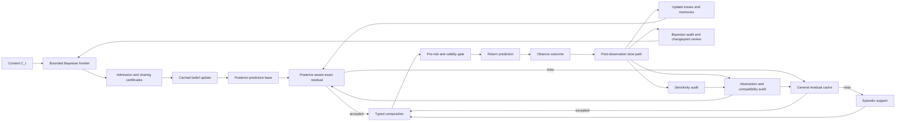

# EventFrame Whitepaper: A Mathematical Framework for Event-Centric Prediction

**Author:** Juan Hua Xu

**ORCID:** <https://orcid.org/0009-0008-7305-5690>

**Research profile:** <https://github.com/JuanHuaXu>

**License:** MIT License. Copyright (c) 2026 Juan Hua Xu.

_Public working paper. Initial implementation evidence is reported in Section 9; full real-world validation remains outstanding._

## Abstract

EventFrame is a framework for event-centric prediction. It represents experience as typed event frames rather than as unstructured sequences alone, but does not treat those frames as fundamental ontology. Event frames are task-relative compressed records. For physical substrates, physical information bounds motivate a limiting thought experiment about microscopic description; they do not prove a discrete substrate or the framework's sparsity hypothesis, and they do not support claims about simulated or software substrates.

The central object is $e_t\in\mathcal E_{\Delta_\tau}$, obtained as $e_t=\Gamma_{\Delta_\tau}(\omega_{A_t})$. Temporal resolution may range from seconds to microseconds when measurement supports it. Given $C_t=e_{t-k+1:t}$, the predictor returns a distribution over marked event times and a no-event outcome. A strictly proper score is the primary probabilistic-fidelity metric; the governing system-design objective is composite, and bounded event-aware timing error is diagnostic.

At a fixed temporal resolution, a target-law constrained population objective supplies an oracle benchmark. The operational rule instead minimizes empirical priority-weighted post-observation action plus non-negative representation cost over a finite family satisfying certified abstraction and proper-score constraints. Oracle feasibility and empirical certifiability are distinct. Candidate design and untouched chronological confirmation are separated. Prediction-time admission uses a distinct risk and state containing only quantities available before the prediction occurs.

EventFrame separates a posterior-predictive base from cached statistical error correction. Bounded vector retrieval, sheaf-inspired compatibility neighbors, and as-of causal or predictive adjacency nominate a finite Bayesian frontier. The reference policy cheaply updates every evidence-ready member; an activation threshold selects bounded deep review without suppressing that update. Neither operation updates the whole corpus. Anti-Pigeon certificates determine which admitted events may share a posterior. Member-level evidence remains full strength while shared-posterior evidence may be discounted; sufficiently supported split evidence or a changepoint shock can revoke an existing sharing certificate, materialize separate posteriors, and invalidate shared residuals, but cannot self-certify a replacement merge. For ordinary Bayesian semantics, one declared joint evidence-and-outcome kernel has displayed marginals equal to the update likelihood and next-outcome kernel; separately modeled components remain modular forecasts. The resulting kernel maps valid effective posteriors to the base forecast law. A horizon-indexed residual record then carries separately typed point-template and forecast-law components, each with its own clipping and estimator semantics. Law-bearing reuse requires a certified law-motion margin, point-bearing reuse requires a certified template-motion margin, and both bounds include propagated posterior-approximation error. Proper-score evaluation uses the law after this ordered composition on the complete measurable marked-time/no-event space; auxiliary structured fields use the point component. The kernel explicitly governs the no-event atom, and a fixed decision rule keeps the final mark and time coherent with the corrected law. Informative nomination requires certified positive support; independent design-weighted audits cover only their exact query-journal and declared omitted population. Bounded run-length monitoring, persistent cumulative drift evidence, cooldown, changepoint invalidation, and explicit resource caps prevent the local posterior from being presented as an unqualified full-stream posterior. After an external retrieval contract returns a bounded frontier, a separately typed elastic rank correction uses packing-boundary certainty for plasticity and an independent accepted-path reliability gate for authorization. This rank-domain control does not alter the scored forecast law. A separately typed operator composes runtime packets. The operator representation takes limited inspiration from Causal Fermion Systems; EventFrame's clipping, projection, and residual objective are its own constructions, not the CFS causal action.

Validity-constrained fuzzing measures model sensitivity, not causality. Causal claims require an explicit structural causal model and identified interventions. Approximate predictive lumpability compares detailed contexts that share an abstract context. Every group retains a traceability frame plus a coverage-aware context audit set; one representative alone cannot establish group stability. A staged compatibility layer can compare heterogeneous abstractions, reconcile local forecasts, perform bounded predictive sheaf snaps after untouched confirmation, apply spectral refinement under explicit linear assumptions, and preserve regime mixtures. Snaps revise predictive organization through atomic graph-key-epoch publication; they do not promote causal edges. Refinement depth is selected by priority, evidence, and measured hardware cost while certified cache reuse remains available.

The paper remains a research framework with implementation evidence, not a validated system. The original 5%-activation cheap-update policy, per-application residual-harm criterion, exact compatible-sharing criterion, and output-invariant snap implementation remain failed. A later untouched rescue confirmation tested replacement propositions. Frontier-all cheap updates plus selective deep review exactly retained frontier-all Brier, priority-weighted Brier, and recall at 10. An abstaining residual expert achieved mean Brier gain 0.01378, with a 95% trajectory-bootstrap interval of [0.00904, 0.01863], while worst-trajectory excess loss 0.00909 stayed below the frozen 0.02 budget; 256 of 861 applied corrections were still individually harmful. Practical-equivalence comparison recommended share for 61 of 64 compatible groups and split for 60 of 64 moderate and all 64 strong divergent groups, with no wrong terminal decisions and no transfer of Anti-Pigeon sharing authority. Synthetic integration verifies atomic split and split-reset transitions, but the real-session replay installed no sharing certificates and therefore did not exercise those transitions. In a retrospective 1,286-design-case/138-regression-case software-development-session replay, rank-boundary certainty modulation improved the regression block's Recall@10 from 42.85% to 46.50%, packed recall from 32.56% to 35.79%, and mean reciprocal rank from 89.88% to 93.27% relative to the previous full upgrade, while leaving Brier loss unchanged. The same inspected block cannot serve as untouched confirmation, and a calibration map fitted in one retrieval regime regressed sharply on the design block of a fresh replay, so stationary probability calibration remains unsupported. Finite-population omitted-influence bounds covered 256 of 256 synthetic trials, but their mean upper bound was 0.21999 for mean true influence 0.00526, so practical certificate power and real-world coverage remain open. Graph publication now changes nominated-candidate graph features and rank deltas and rollback removes them, but untouched forecast benefit remains untested. A new changepoint confirmation passed five of six scenarios and narrowly exceeded the gradual alarm ceiling. A local 1,000-event in-memory benchmark measured approximately 1.52--1.53 ms p50 and 3.13--3.36 ms p99, excluding external embeddings, database RPC, concurrency, cold start, and host integration. Structured-frame and priority outcome claims remain inconclusive. These results validate bounded mechanisms in synthetic fixtures and support rank adaptation in retrospective replay; they do not validate complete marked-time/no-event scoring, robust certificate coverage, stationary calibration, or controlled real-world utility.

## 1. Introduction

Prediction systems often operate over sequences whose internal structure is only implicit. A model may receive tokens, vectors, logs, traces, or state observations and learn statistical regularities among them. This can be effective, but it makes some questions difficult to ask directly: which compressed distinction mattered, what changed, when did it happen, where did it occur, why might it matter, and how did it transform the state of the world?

EventFrame begins from a compression premise: a modeled substrate may contain more detail than a prediction system can retain. Event frames are task-relative coarse-grained representations, not assertions about fundamental spacetime. For physical substrates, Planck scales and information bounds motivate a limiting thought experiment [7--9]; they do not prove the compression premise. Simulated and software substrates require independent task- and resource-based justification.

The framework represents experience as event frames selected for predictive and intervention relevance. An event frame is a typed record of an occurrence or transition after compression. It includes the 5W1H fields of who, what, when, where, why, and how, plus auxiliary state and confidence metadata. The goal is not to claim that every domain naturally exposes these fields perfectly. The goal is to create a disciplined representation in which uncertainty, missing fields, competing explanations, and compression choices can still be recorded explicitly.

The core contribution is adaptive event abstraction. At fixed resolution, an external-law population objective defines the constrained oracle benchmark; the operational rule selects from a finite family using certified empirical constraints, post-observation action, and representation cost. It distinguishes model-sensitivity evidence from causal intervention evidence.

Given $C_t=e_{t-k+1:t}$, the system predicts a distribution over event identity, event time, and no event within horizon $H$. A proper forecast score is the primary probabilistic-fidelity metric because timing-only loss can reward the wrong event at the right time. The complete system design minimizes a separate composite objective under a proper-score guard. Event-aware timing remains an interpretable diagnostic.

The reference prediction procedure has seven steps:

1. Form a context $C_t$ from the last $k$ event frames.
2. Construct the bounded Bayesian candidate frontier and apply the reference frontier-all cheap update to every evidence-ready member. A frozen activation score may select expensive deep review, but does not suppress the cheap update unless a separately evaluated resource-quality policy explicitly replaces the reference. Require certified positive support for the complete recorded nomination and evidence-readiness process, and share a cached posterior only under a current Anti-Pigeon certificate. Retain full-strength member evidence beneath any discounted pooled update so a validated split or changepoint shock can revoke stale sharing without allowing selected-only evidence to self-certify that revocation.
3. Map the valid effective posterior family to the posterior-predictive base law $\mathsf Q_t^0(\cdot\mid C_t)$ and aligned template $b_t^0$, using $\mathsf Q_B$ and $B$ only when no valid belief bucket is available.
4. From candidate-specific state $S_{\Theta,t^-}$, select an exact-key or general residual record $\mathbf r_t^{\mathrm{use}}$ only when its distance, confidence, effective support, age, epoch, forecast-horizon equality, compatibility margin, component provenance, posterior-predictive version, and mode-applicable certified law and template motion checks pass.
5. Clip the separately typed point and law residual components, apply the law kernel after $\mathsf Q_t^0$, derive a mark/time-coherent no-event-capable summary from the corrected law, and apply the pre-observation risk gate to the complete output bundle. For bounded retrieval packets, apply any independently authorized rank correction after the retrieval contract and before packing; packing-boundary certainty modulates its magnitude but is not a probability of truth.
6. Observe the next marked event or no-event outcome and evaluate proper predictive loss.
7. Use a slower refinement process to audit a declared omitted population, run proposal-only practical-equivalence comparison, detect changepoints, recalibrate beliefs, update residuals, test invariants, revise abstractions, or revise the event ontology. Only an external Anti-Pigeon certificate may authorize posterior sharing.

This procedure explains why the framework includes both memory and residual prediction. Episodic memory stores prior cases. A residual cache stores reusable corrections to a baseline transition. The distinction matters because recalling a similar event and applying a similar error correction are not the same operation. The first supports case-based reasoning; the second supports low-latency approximation when similar contexts produce similar transition errors.

The slow path uses validity-constrained perturbations to test model sensitivity, coverage-aware bucket audits to find hidden divergence, and approximate predictive lumpability to test compression. Causal analysis is a separate optional path requiring structural equations and identification assumptions.

The contributions of this paper are therefore:

1. A compressed event-frame ontology for prediction-oriented representation.
2. A governing optimization principle for adaptive event abstraction.
3. A residual prediction model with constrained composition and action-residual fast-path caching.
4. A bounded Bayesian update frontier with a frontier-all cheap-update reference policy, selective deep review, Anti-Pigeon posterior-sharing control, fail-closed shock revocation, a practical-equivalence split/share diagnostic with bounded borrowing, selection-aware semantics, bounded cumulative changepoint invalidation, and independent audit sampling.
5. A combined episodic, residual, and bounded belief-memory architecture.
6. A validity-constrained sensitivity method for conditional invariants and ontology review.
7. A lumpability-based approach to abstraction.
8. A bounded predictive sheaf-snapping rule for validated local compatibility-graph revision.
9. A fast-path and slow-path reference runtime model with reliability-gated elastic rank correction at the packing boundary.
10. Experiment designs for testing the framework's claims.

These are proposed as a research framework with initial synthetic and local runtime evidence, not as validated real-world results or a fixed implementation. Event-centric latent retrieval itself has prior art [10]. Streaming and sequential Bayesian methods provide prior work for incremental posterior approximation and changepoint monitoring [14--18], while Pattern Markov Chains and shift-aware sequential prediction provide narrower event-forecasting precedents [19,20]. D'Acunto, Di Lorenzo, and Barbarossa's *Networks of Causal Abstractions: A Sheaf-theoretic Framework* provides prior work on coordinating heterogeneous causal abstractions through network sheaves, restriction maps, connection Laplacians, global sections, and mixture causal models [13]. EventFrame's claimed contribution is the typed residual-error and evidence-controlled event-abstraction loop, including bounded frontier updates, optional selective activation, Anti-Pigeon posterior granularity, cache certificates, bounded predictive sheaf snapping, and priority- and hardware-aware staged integration. It does not claim to invent streaming Bayes, particle filtering, online changepoint detection, or event-pattern forecasting. The snapping term is EventFrame terminology for validated local predictive-structure revision, not a theorem or standard operation inherited from sheaf theory. The next section defines the event ontology.

## Claims Register

This section states the paper's major claims as falsifiable targets. The claims are not treated as established results. Each one names what would need to be measured, proved, or falsified by later experiments.

The current experiment ledger labels a proposition Validated in fixture when its frozen test met the declared target, Falsified in fixture when it failed, Inconclusive when the declared evidence requirement was not met, and Not tested when no reported experiment addresses it. These labels are local to the stated generator, hardware, metric, and evaluation window. A fixture-level validation is not universal proof, and a fixture-level falsification rejects the tested proposition or configuration rather than every possible implementation of the broader claim.

| Claim | Tested proposition | Result | Evidence and boundary |
| --- | --- | --- | --- |
| 2b | Frontier-all improves candidate-level probability quality over no Bayesian update. | Validated in fixture | Priority-weighted Brier loss improved by 9.29% in the frozen 20-candidate synthetic frontier. |
| 2b | The tested 5%-activation selective policy retains the quality gain of frontier-all. | Falsified in fixture | Selective admission improved priority-weighted Brier by only 0.16%, versus 9.29% for frontier-all; a paired stress report placed ordinary Brier loss 0.02891 above update-all. |
| 2b | Frontier-all cheap updates plus selective deep work retain frontier-all forecast output. | Validated in synthetic mechanism fixture | Brier loss, priority-weighted Brier loss, and recall at 10 exactly matched frontier-all; this does not establish the value of a deep specialist. |
| 2b | The tested Bayesian policies repair post-shift ranking at recall at 10. | Falsified in fixture | Every tested policy had post-shift recall at 10 of 0.3000. |
| 2 | A reusable residual improves probability quality under a stable recurring bias. | Validated in fixture | The repeated-bias fixture reduced Brier loss by 29.81% over 40 untouched outcomes. |
| 2 | Residual reuse adds predictive gain in the original frontier experiment. | Falsified in fixture | The selective-plus-residual policy produced no incremental gain over selective admission alone. |
| 2 | Heterogeneous residual reuse satisfies the frozen gain and false-reuse safety criteria. | Falsified in fixture | Mean Brier gain was 0.01931, 95% trajectory bootstrap [0.00614, 0.03280], but 635/1,536 applied corrections were harmful: 41.34%, 95% Wilson [38.90%, 43.82%], versus a 5% ceiling. |
| 2 | An abstaining residual expert meets positive-gain and cumulative trajectory-harm criteria. | Validated in synthetic confirmation fixture | Mean gain was 0.01378, 95% trajectory bootstrap [0.00904, 0.01863]; worst-trajectory excess loss was 0.00909 below the frozen 0.02 budget. Individually harmful applications remained 256/861. |
| 6 | Correctly separating a deliberately invalid broad group improves probability quality. | Validated, mechanism only | An oracle two-bucket split reduced Brier loss by 29.41%; oracle labels mean the Anti-Pigeon certificate procedure itself was not tested. |
| 2b, 6 | The bounded comparator nominates behaviorally divergent groups. | Validated in fixture | Independent v6 confirmation split 64/64 strong and 58/64 moderate groups, or 100% and 90.63%, without a false share. |
| 2b, 6 | The bounded comparator positively recognizes ordinary compatible noisy groups at the tested support. | Falsified in fixture | All 64 compatible 0.8/0.8 groups remained uncertain at 100 outcomes per member. |
| 2b, 6 | A practical-equivalence comparator recognizes compatible and divergent groups at tested support. | Validated in synthetic confirmation fixture | It recommended share for 61/64 compatible groups, split for 60/64 moderate and 64/64 strong divergent groups, with zero wrong terminal decisions; sharing still requires external Anti-Pigeon authority. |
| 2b, 6 | Bayesian comparison preserves Anti-Pigeon authority. | Validated in integration fixture | The comparison reached share and split branches without changing a posterior key or certificate. |
| 2b, 6 | Validated contradictory member evidence can revoke an active shared posterior without certifying a replacement merge. | Validated, mechanism only | Synthetic integration exercised atomic split and split-reset actions, revoked the sharing certificate, disabled the shared residual, and materialized event-local posteriors. The real-session replay installed no sharing certificate and did not exercise this transition. |
| 2b, 6 | Discounting pooled shared evidence while retaining full-strength member evidence preserves a responsive divergence test. | Validated, mechanism only | Integration controls measured reduced pooled effective support while member sufficient statistics retained their full inclusion weights. Population-level split timing and false-revocation rates remain untested. |
| 2c | Rank-boundary certainty modulation improves bounded-packet retrieval over the previous full upgrade on the inspected real-session block. | Supported in retrospective regression | In 138 reused regression cases, Recall@10 rose from 42.85% to 46.50%, packed recall from 32.56% to 35.79%, and MRR from 89.88% to 93.27%; Brier was unchanged. This is not untouched confirmation. |
| 2c | Rank-boundary certainty modulation retains bidirectional correction and the hard envelope. | Validated in synthetic mechanism confirmation | It promoted 200/200 useful targets, demoted 200/200 harmful targets, retained 90/90 useful controls, produced zero unnecessary churn, and crossed zero of 50 deliberately wide margins. |
| 2b, 2c | One frozen calibration map remains valid across retrieval-frontier regimes. | Falsified in retrospective reproducibility replay | Confirmation Brier was favorable but inconclusive; design Brier regressed from 0.20568 to 0.47441, and nomination recall differed materially across runs. Calibration artifacts must bind the complete gating fingerprint. |
| 2b | The original run-length-zero detector reliably handles noisy abrupt, gradual, and recurring drift. | Falsified in fixture | Miss rates were 96.88%, 100%, and 93.75%, respectively. |
| 2b | The revised monitor generalizes across frozen synthetic confirmations. | Mixed; not robustly validated | An earlier v6 confirmation passed all six criteria, but the later untouched rescue confirmation failed the gradual alarm ceiling narrowly: 0.203125 alarms per trajectory versus 0.20. |
| 2b | Omitted-influence bounds attain declared coverage on the finite synthetic audit population. | Validated in synthetic fixture only | All 256 bounds covered exact influence; the 95% Wilson lower bound was 0.9852. Mean UCB 0.21999 versus mean true influence 0.00526 shows weak certificate power. |
| 8b | Accepted predictive snaps improve untouched scored forecasts in the current runtime. | Falsified in integration fixture | Publishing and rollback changed graph and dependent versions, but recall scores, rank deltas, templates, and forecast laws were invariant. |
| 8b | Published graph changes affect nominated-candidate features and rank deltas, and rollback removes them. | Validated, mechanism only | Integration controls passed; untouched forecast benefit remains untested. |
| 1 | Structured frames improve prediction or interpretability on the reserved chronological block. | Inconclusive | The block had 46 cases from only two independent trajectories, below the frozen minimum of three, and no independent interpretability ratings. |
| 1 | The matched structured-frame evaluator enforces equality and evidence-minimum contracts. | Validated, mechanism only | It rejects mismatched source/model/budget/ranking contracts and refuses readiness below three trajectories or without blinded ratings. |
| 8c | Frozen priority weighting reduces high-priority misses without material overall recall harm. | Inconclusive | The same two-trajectory block measured a 7.5% high-priority miss rate for baseline and EventFrame; the declared clustered test was unavailable. |
| 8c | The priority deployment gate prevents aggregate gain from hiding excess high-priority misses. | Validated, mechanism only | It rejected a positive-aggregate-gain control with additional high-priority misses and refuses evaluation without high-priority observations. |
| 7, 7a | The frontier-all policy change remains below 100 ms local sequential p99 recall in the declared fixture. | Validated, narrow benchmark | Measured p99 was 9.043 ms at 1,000 stored events; transport, external embeddings, concurrency, cold start, and full service load were excluded. |
| 0, 1b, 2a, 3--5b, 6a, 8, 8a | All remaining empirical propositions. | Not tested | The paper specifies protocols, but reports no claim-validating experiment for these propositions yet. Claim 1a is a scope statement rather than an empirical performance claim. |

Claim 0. At a fixed resolution, an external target-law constrained population objective defines an oracle benchmark. The operational rule selects from a finite family using certified Anti-Pigeon and proper-score constraints, empirical priority-weighted action, and representation cost. Oracle feasibility and empirical certifiability are distinct; generating laws are distinct from their realized design and untouched confirmation samples, and as-of runtime admission remains separate.

Claim 1. Structured event frames are useful predictive units if, for a declared task, they improve interpretability or temporal prediction relative to unstructured sequence records without hiding field-level error.

Claim 1a. Event frames are task-relative compressed representations rather than claims about fundamental ontology. Physical constants do not prove the compression hypothesis.

Claim 1b. Temporal precision controls frame granularity if changing the declared time resolution $\Delta_\tau$ changes the candidate-frame set, cache pressure, and detectable divergence boundaries in measurable ways.

Claim 2. Residual caches reduce prediction cost or error when similar contexts or action signatures produce similar baseline errors and as-of, metadata-gated residual records improve forward-held-out loss often enough to justify lookup and maintenance. A residual may operate as an abstaining online expert: failed support, motion, epoch, age, positive-gain, or cumulative-harm gates route it to shadow evaluation rather than application. Point residuals are in-horizon only, while a separately declared law estimator covers marked and no-event outcomes. A typed cache record keeps point-template and law corrections semantically separate; the full kernel governs the no-event atom, and the final mark and time are coherent with the corrected law. Joint records require forward validation of the complete bundle. Cumulative harm control does not imply that every applied correction is beneficial before an unannounced change becomes observable.

Claim 2a. Runtime prediction packets are useful when a separately typed packet composition operator improves selection of memory nodes, graph edges, retrieval lane, compaction risk, response mode, or control branch on held-out packet loss.

Claim 2b. A bounded Bayesian frontier can preserve local update cost when vector width, graph degree, candidate universe, evidence-ready frontier size, hypothesis dimension, retained changepoint state, and complete admission-probability evaluation are explicitly capped. The reference frontier-all policy updates every evidence-ready nominated member; activation selects bounded deep work without suppressing the cheap update. Neither policy performs corpus-wide posterior updates. Anti-Pigeon certificates determine which admitted evidence may share a posterior. A bounded practical-equivalence comparison may nominate $\mathrm{share}$, $\mathrm{split}$, or $\mathrm{uncertain}$ and a bounded borrowing weight, but it cannot authorize sharing or mutate posterior keys. Ordinary posterior-predictive semantics require one declared joint model whose displayed evidence and outcome marginals induce the likelihood and next-outcome kernel; separately modeled components remain modular forecasts. The effective posterior family maps to the base forecast law, which is then corrected only by residual components whose law or template motion certificates remain valid, including propagated approximation error, and evaluated by the proper score. Informative nomination must enter the likelihood and satisfy the certified positive admission-support condition, or the result is reported only as an admission-conditioned working posterior. Independent design-weighted audits and simultaneous omitted-influence bounds certify only the exact query-journal and finite omitted population for which inclusion probabilities and population bounds are valid. Initial synthetic evidence supports frontier-all cheap updates, selective deep-work separation, practical-equivalence recommendations, and finite-population audit coverage; it does not establish full-stream calibration, useful audit tightness, real-world coverage, or deep-specialist benefit.

Claim 2c. A bounded retrieval packet may apply a Bayesian elastic rank delta after the external retrieval contract and before packing. The raw delta must originate from an accepted Bayesian, residual, or versioned graph path; an independent reliability gate can reduce or null it. Plasticity is high only when the score gap at the packing boundary is small and low when that boundary is already clear. The rank certainty is not a posterior probability, does not alter the proper-scored forecast law, and cannot bypass the hard delta cap. Anti-Pigeon shock revocation may invalidate shared evidence and residuals that generated a delta, but it cannot manufacture a rank correction or certify a replacement group.

Claim 3. Episodic memory and residual cache memory serve different roles because prior-case recall and prior-error correction can be independently useful or harmful under the same prediction context.

Claim 4. Validity-constrained property fuzzing exposes conditional model invariants and ontology review signals. It does not establish causal effects without an explicit SCM and identification strategy.

Claim 5. Approximate predictive lumpability provides a route to abstraction when projected event states preserve target-relevant transition behavior within a declared divergence threshold.

Claim 5a. Event streams can conjoin or diverge over time when multiple streams become prediction-equivalent under a merge threshold or when small distinctions amplify into target-distinct downstream futures.

Claim 5b. Each group retains at least one concrete traceability frame plus a coverage-aware context audit set; one representative alone is insufficient for group-level divergence claims, and unseen-context certification additionally requires exhaustive coverage or a verified continuity bound.

Claim 6. Conditional on valid target-law estimation, audit coverage, simultaneous uncertainty coverage, and any declared continuity bound, Anti-Pigeon rejects buckets whose certified context-conditional target-law diameter exceeds threshold. This is an empirical certificate, not a framework-level theorem that those premises hold. Model-forecast diameter and Bayesian practical-equivalence evidence are diagnostic proposals only; neither may certify its own bucket. Regime comparisons require common support or transport assumptions, and causal attribution requires separate intervention evidence.

Claim 6a. Predictively effective distinctions are sparse only when their held-out ablation ratio is small within a finite declared candidate set. A causal sparsity ratio is a separate quantity available only under identified interventions.

Claim 7. Fast-path and slow-path separation is computationally useful if low-latency prediction can reuse cached residuals while slower background work improves future predictions without blocking the current one.

Claim 7a. Expected exact-key lookup is history-independent only when context update, key construction, graph degree, key size, and cache size are bounded; fallback and maintenance costs remain explicit.

Claim 8. Heterogeneous abstractions can be tested through declared comparison maps and edge defects, complementing within-bucket Anti-Pigeon audits. The current construction is a sheaf-inspired compatibility scaffold; it becomes sheaf-theoretic only when the required map laws hold and causal only when SCM semantics are supplied.

Claim 8a. A full refinement architecture can retain certified residual reuse while adding compatibility audit, local reconciliation, bounded predictive sheaf snapping, spectral refinement under linear assumptions, and regime-mixture refinement. Hardware changes stage depth, not stage meaning.

Claim 8b. A predictive sheaf snap can improve a heterogeneous abstraction network when a finite local edit family is selected on chronological design data, fixed comparison obligations prevent deletion from masquerading as compatibility, the candidate is accepted only on later untouched evidence, and graph-key-epoch state is published atomically. Compatibility evidence alone does not promote causal edges.

Claim 8c. Upgrade value is evaluated by predeclared priority-weighted utility beside unweighted and stratified results; loss and resource percentages are not compared until converted to a common utility scale.

## 2. Event Ontology

EventFrame uses event frames as predictive units, not as fundamental ontology. The underlying substrate is assumed to contain more detail than the predictor can retain. That substrate may be physical, simulated, biological, robotic, or software-based. EventFrame treats a frame as a task-relative compressed representation. For physical substrates, Planck scales and physical information bounds motivate a limiting thought experiment about microscopic description; they do not prove a discrete substrate, a Planck-scale sampling lattice, or the EventFrame sparsity hypothesis. Simulated and software substrates require independent task- and resource-based compression arguments.

An event is therefore a structured representation of a change, occurrence, action, observation, or state transition after coarse-graining. An event frame records that compressed event in fields that can be compared, predicted, fuzzed, cached, and abstracted.

An event frame at index $t$ is written:

$$
e_t = (w_t, a_t, \tau_t, \ell_t, m_t, h_t, x_t, c_t)
$$

where $w_t$ denotes participating agents or entities, $a_t$ denotes the action or occurrence type, $\tau_t$ denotes the time index or interval, $\ell_t$ denotes location or spatial context, $m_t$ denotes motive, objective, causal explanation, or inferred driver, $h_t$ denotes mechanism or process, $x_t$ denotes auxiliary state, and $c_t$ denotes confidence, provenance, or uncertainty metadata. When $\tau_t$ is an interval, the complete interval remains part of the frame; scalar timing formulas use a separately declared temporal anchor, defaulting to interval onset.

The conceptual role of this ontology is compression. It prevents prediction from treating history as a single undifferentiated sequence, but it also prevents prediction from pretending that every microscopic distinction deserves its own event identity. The fields ask different compressed questions. The "what" field identifies an occurrence type. The "when" field supports temporal prediction loss. The "who" and "where" fields localize the event. The "why" and "how" fields record explanatory hypotheses and mechanisms. The auxiliary state field allows symbolic, vector, graph, or latent variables to travel with the event. The confidence field prevents uncertain extraction from pretending to be certain observation.

Let $\Omega$ denote a fine-grained substrate state space and let $\omega_{A_t}$ denote the substrate history over a finite region $A_t$. The adjective fine-grained describes retained detail and imposes no topology on $\Omega$. A coarse-graining map at temporal resolution $\Delta_\tau$:

$$
\Gamma_{\Delta_\tau}: \Omega^{A_t} \rightarrow \mathcal{E}_{\Delta_\tau}
$$

produces an event frame:

$$
e_t = \Gamma_{\Delta_\tau}(\omega_{A_t}).
$$

This equation states the ontology clearly: the event frame is a lossy, task-oriented compression. The compression is useful only if it preserves distinctions that matter for prediction, intervention, memory, or review.

The temporal resolution $\Delta_\tau$ controls how precise the "when" field is. A model may choose second-level frames, microsecond-level frames, or another declared scale. Finer resolution can instantiate more candidate frames, but it does not imply that every candidate frame is predictively effective, causally effective, or worth retaining forever. Predictive and causal sparsity are measured separately over a finite declared candidate set; neither is inferred from the size of the substrate.

Mathematically, the event space is treated as a typed product:

$$
\mathcal{E} =
\mathcal{W} \times \mathcal{A} \times \mathcal{T} \times
\mathcal{L} \times \mathcal{M} \times \mathcal{H} \times
\mathcal{X} \times \mathcal{C}.
$$

This equation is operational, not decorative. It says that before a field can be used in prediction, caching, fuzzing, or abstraction, the field must have a representation and a comparison rule. For example, $\mathcal{T}$ may contain timestamps or intervals; $\mathcal{L}$ may contain coordinates, graph nodes, or symbolic regions; $\mathcal{C}$ may contain confidence scores and source provenance. EventFrame does not require one universal encoding for all domains, but it requires the encoding to be declared.

An event state is the system state before, during, or after an event. In some domains, $x_t$ may include an explicit pre-state and post-state. In others, $x_t$ may be a latent state vector inferred from observations. A transition occurs when one event context gives rise to a later event frame. The basic trajectory is:

$$
E_{1:T} = (e_1, e_2, \ldots, e_T).
$$

Operationally, a prediction step extracts a context from this trajectory:

$$
C_t = e_{t-k+1:t}.
$$

The context $C_t$ is the recent event history available to the predictor. It gives the predictor local structure for forecasting the next event and its time. If the context is too short, important predictive or temporal dependencies may be missing. Causal dependence is a stronger claim and requires an explicit causal model or identified intervention evidence. The context length $k$ is a modeling choice that should be evaluated experimentally.

The ontology also supports typed links. Temporal links order events, spatial links relate locations, and predictive-dependency links record forecast-relevant association. Causal links are reserved for relations supported by a declared structural causal model or an identified intervention. These link types must remain distinct in storage and evaluation.

Event histories are therefore not limited to linear chains. Multiple event streams can become representable as a single aggregate event over time. This is event confluence: separate streams merge into a larger stream or macro-event when their separate identities no longer affect the target beyond a declared threshold. The reverse can also occur. A small distinction can branch into multiple downstream event streams when a perturbation is amplified by the dynamics. This is event divergence, or butterfly-effect-style sensitivity. EventFrame must model both patterns because compression that is safe in a confluence region may be unsafe near a divergence point.

For traceability, EventFrame keeps at least one concrete frame for every event-frame group. One frame cannot characterize a heterogeneous group, so abstraction audits use a coverage-aware set containing boundary, uncertain, and sampled examples. Section 7 formalizes that audit set and the limits of conclusions drawn from it.

The event sparsity hypothesis follows from this compression view. Relative to a finite declared candidate set, EventFrame hypothesizes that only a small fraction of distinctions materially worsen held-out proper risk when ablated. This predictive ratio is observationally testable under the fixed ablation protocol. A separate causal ratio requires randomized or otherwise identified interventions. Both must be measured in each domain rather than inferred from Planck constants or entropy bounds.

The main limitation of the ontology is extraction and compression quality. In real data, the "why" and "how" fields may be ambiguous, inferred, or unavailable. More fundamentally, the chosen coarse-graining $\Gamma_{\Delta_\tau}$ may discard distinctions that later turn out to matter. EventFrame handles this by allowing missing values, confidence metadata, and revision under slow-path review rather than requiring false precision. A conservative implementation should distinguish observed fields from inferred fields and should propagate uncertainty into prediction and review. The next section defines the mathematical framework built on this compressed ontology.

## 3. Mathematical Framework

The mathematical framework turns compressed event frames into objects that can be predicted, evaluated, cached, and abstracted. Given a context $C_t$, the predictor must produce a next-event distribution before the next observation exists. Only after the observation arrives may the runtime compute realized prediction loss and update memory or abstraction.

Let $\Omega$ denote a fine-grained substrate state space; fine-grained refers to retained detail and imposes no topology on $\Omega$. For a finite region $A_t$, let $\omega_{A_t} \in \Omega^{A_t}$ denote the substrate history over that region. At temporal resolution $\Delta_\tau$, an event frame is produced by:

$$
e_t = \Gamma_{\Delta_\tau}(\omega_{A_t}), \qquad
\Gamma_{\Delta_\tau}: \Omega^{A_t} \rightarrow \mathcal{E}_{\Delta_\tau}.
$$

The coarse-graining $\Gamma_{\Delta_\tau}$ is task-relative and lossy. It selects distinctions available to prediction, memory, and review; it does not establish a fundamental discretization of spacetime. For a physical substrate, CODATA Planck scales and physical information bounds motivate a limiting thought experiment about microscopic description [7--9]. They do not imply a Planck-scale sampling lattice or prove EventFrame sparsity. Simulated and software substrates require an independent task- and resource-based compression argument; the physical citations do not support that case.

A trajectory at fixed resolution is:

$$
E_{1:T}=(e_1,\ldots,e_T), \qquad e_t\in\mathcal E_{\Delta_\tau},
$$

and a time quantizer is:

$$
Q_{\Delta_\tau}:\mathbb R\rightarrow\mathcal T_{\Delta_\tau}.
$$

Second-level or microsecond-level precision is permitted only when the measurement process supports it. Finer resolution creates more candidate frames and can expose boundaries, but also increases noise and cache pressure.

For a context length $k$, define:

$$
C_t=e_{t-k+1:t}\in\mathcal E^k.
$$

Let $\varnothing\neq\mathfrak C_{\mathrm{adm}}\subseteq\mathcal E^k$ be the declared admissible context domain on which the chosen version of each conditional forecast law is defined. Population suprema below range over this domain or over the support of a named evaluation law, not over arbitrary zero-probability contexts.

Let $a(x)$ be the time at which observation, label, cache record, or derived object $x$ becomes available to the runtime. Let $\mathscr F_t^{\mathrm{pred}}$ be the information available when the prediction at index $t$ is issued, including $C_t$ but excluding $Z_{t+1}$. Mutable runtime state is the left-limit snapshot $S_{t^-}$, constructed only from objects with $a(x)\le t$. Every prediction, priority, cache lookup, abstraction decision, and pre-risk value used at time $t$ must be measurable with respect to $\mathscr F_t^{\mathrm{pred}}$. For a no-event outcome, $a(Z_{t+1})$ is no earlier than expiration of horizon $H$; delayed labels use their actual later availability time.

Let $\nu(e)$ be the event mark or occurrence type. Let $\tau(e)\in\mathbb R$ be a declared scalar temporal anchor: it is the timestamp for a point event and, by default, the onset for an interval event. A domain may choose another measurable anchor, such as midpoint, but must freeze that convention before fitting and use it consistently in labeling, caching, and evaluation; the complete interval remains available in the event frame. Over a prediction horizon $H>0$, the next outcome is:

$$
Z_{t+1}=
\begin{cases}
(\nu(e_{t+1}),\tau(e_{t+1})-\tau(e_t)), & \text{if an event occurs within }H,\\
\varnothing, & \text{otherwise.}
\end{cases}
$$

Let $(\mathcal N,\mathscr A_{\mathcal N})$ be the measurable mark space and let $((0,H],\mathscr B_H)$ carry the Borel sigma-algebra in the declared time units. Define the marked branch and complete outcome space as the measurable disjoint union

$$
(\mathcal Z_H^+,\mathscr A_H^+)
=(\mathcal N\times(0,H],\mathscr A_{\mathcal N}\otimes\mathscr B_H),
\qquad
(\mathcal Z_H,\mathscr A_H)
=(\mathcal Z_H^+\sqcup\{\varnothing\},
\mathscr A_H^+\oplus2^{\{\varnothing\}}).
$$

A probabilistic predictor returns a distribution rather than only a point:

$$
\mathsf Q_\theta(\cdot\mid C_t)\in\mathcal P(\mathcal Z_H),
$$

where $\mathcal P(\mathcal Z_H)$ denotes probability measures on $(\mathcal Z_H,\mathscr A_H)$, equipped with the evaluation sigma-algebra generated by $Q\mapsto Q(A)$ for $A\in\mathscr A_H$. This is a finite-horizon marked-event representation with a right-censoring atom; standard marked point-process constructions provide a broader continuous-time setting [11]. Let $\mathcal E_\varnothing=\mathcal E\sqcup\{\varnothing\}$ be the tagged extension of the structured event space. A fixed measurable decision rule

$$
d_H:\mathcal P(\mathcal Z_H)\rightarrow\mathcal Z_H
$$

returns the no-event decision or a marked time, with a declared loss and deterministic tie-break. Let $\hat e_\theta^H(C_t)\in\mathcal E_\varnothing$ be a structured summary coherent with that decision: it equals $\varnothing$ exactly when $d_H(\mathsf Q_\theta(\cdot\mid C_t))=\varnothing$, and otherwise its mark and time agree with the marked decision. The typed predictor output is the bundle:

$$
\mathcal O_\theta(C_t)=
\left(\mathsf Q_\theta(\cdot\mid C_t),\hat e_\theta^H(C_t)\right)
\in\mathcal P(\mathcal Z_H)\times\mathcal E_\varnothing.
$$

The primary probabilistic-fidelity objective is a declared strictly proper scoring rule applied to the probability-law component. It is distinct from the composite system-design objective below:

$$
\mathcal L_{\mathrm{pred}}(\theta;t)
=S_{\mathrm{prop}}\!\left(\mathsf Q_\theta(\cdot\mid C_t),Z_{t+1}\right).
$$

Fix a dominating reference measure $\mu_H$ on the marked-time branch, including declared units for time, and let $q_\theta=d\mathsf Q_\theta^{\mathrm{event}}/d\mu_H$ be the event subdensity. Its integral equals $1-\mathsf Q_\theta(\{\varnothing\}\mid C_t)$. Relative to this fixed reference measure, the logarithmic score is one implementation:

$$
\mathcal L_{\log}(\theta;t)=
\begin{cases}
-\log q_\theta(\nu_{t+1},\Delta t_{t+1}\mid C_t), & Z_{t+1}\neq\varnothing,\\
-\log \mathsf Q_\theta(\{\varnothing\}\mid C_t), & Z_{t+1}=\varnothing.
\end{cases}
$$

If $d\mu_H'=h\,d\mu_H$, then the marked-branch logarithmic loss changes by the forecast-independent but generally outcome-dependent term $\log h(Z)$. A pure unit rescaling makes this term constant. Such an integrable outcome-only term preserves propriety and pairwise forecast differences on the same observation, but the reference measure and units must remain fixed when absolute scores or results across datasets are reported. This score covers event identity, timing, uncertainty, and right-censoring; calibration remains an empirical property to test. Proper scoring rules prevent a predictor from improving its expected score by reporting a distribution other than the one it believes [6].

For human-readable diagnostics, let $\hat Z_{t+1}=d_H(\mathsf Q_\theta(\cdot\mid C_t))$. A bounded event-aware timing diagnostic is:

$$
\mathcal L_{\mathrm{event}}^H(\hat Z,Z)=
\begin{cases}
0, & \hat Z=Z=\varnothing,\\
1, & \text{exactly one is }\varnothing\text{ or their marks differ},\\
\min\!\left(1,\dfrac{|\widehat{\Delta t}-\Delta t|}{H}\right),
& \text{their non-null marks agree.}
\end{cases}
$$

Unlike the original timing-only diagnostic, this expression cannot assign zero loss to the wrong event type merely because its timestamp is correct. It remains a diagnostic; model fitting and forecast comparison should use $\mathcal L_{\mathrm{pred}}$.

For any other field, use a distinct projection $\psi_i:\mathcal E\rightarrow\mathcal X_i$ and declared distance. Bind the coherent structured prediction by $\hat e_{\theta,t+1}^H:=\hat e_\theta^H(C_t)$. The ordinary field loss is defined only when both the decision and observation are marked events:

$$
\mathcal L_i(\hat e_{\theta,t+1}^H,Z_{t+1})
=d_i(\psi_i(\hat e_{\theta,t+1}^H),\psi_i(e_{t+1})),
\qquad
\hat e_{\theta,t+1}^H\in\mathcal E,
\quad Z_{t+1}\neq\varnothing.
$$

When either argument is $\varnothing$, this field loss is not evaluated unless a separate missing-aware loss on $\mathcal E_\varnothing$ has been declared. The proper score and event diagnostic still evaluate the no-event decision.

EventFrame uses separate pre-observation and post-observation quantities. For a candidate output bundle $\widetilde{\mathcal O}=(\widetilde{\mathsf Q},\tilde e^H)$, a pre-observation admissibility risk may use only information available at prediction time:

$$
\mathcal R_{\mathrm{pre}}(\widetilde{\mathcal O}\mid C_t)
=\lambda_a^{\mathrm{pre}}D_{\mathrm{abs}}^{\mathrm{pre}}(\widetilde{\mathcal O},C_t)
+\lambda_c^{\mathrm{pre}}D_{\mathrm{edge}}^{\mathrm{pre}}(\widetilde{\mathcal O},C_t)
+\lambda_u^{\mathrm{pre}}U^{\mathrm{pre}}(\widetilde{\mathcal O}\mid C_t).
$$

The three components lie in $[0,1]$, the weights are non-negative, and $\lambda_a^{\mathrm{pre}}+\lambda_c^{\mathrm{pre}}+\lambda_u^{\mathrm{pre}}=1$.

The proper loss need not be bounded; the logarithmic score above equals $+\infty$ when the realized outcome receives zero density or mass. To combine an extended-real score with bounded system diagnostics, choose and preregister a measurable non-decreasing map $g_{\mathrm{pred}}:\overline{\mathbb R}\to[0,1]$ on the score's entire attainable extended-real range, including explicit endpoint values. For a non-negative log loss, one admissible example is

$$
g_{\mathrm{pred}}(\ell)=1-\exp(-\ell/\kappa),
\quad \ell\in[0,\infty),
\qquad
g_{\mathrm{pred}}(+\infty)=1,
\quad \kappa>0.
$$

For a score with negative attainable values, the evaluation contract instead supplies a total monotone transform on that stated range, including $-\infty$ if attainable. Define:

$$
\overline{\mathcal L}_{\mathrm{pred}}(\widetilde{\mathsf Q},Z)
=g_{\mathrm{pred}}\!\left(S_{\mathrm{prop}}(\widetilde{\mathsf Q},Z)\right).
$$

Constant or order-reversing transforms are inadmissible. Unless $g_{\mathrm{pred}}$ is a positive affine transformation on the score's range, $\overline{\mathcal L}_{\mathrm{pred}}$ is not asserted to remain proper. Model fitting and forecast comparison continue to report the untransformed proper score. After $Z_{t+1}$ is observed, the bounded realized event action is:

$$
\begin{aligned}
\mathcal A_{\mathrm{post}}(\widetilde{\mathcal O},Z_{t+1})
={}&\lambda_p^{\mathrm{post}}\overline{\mathcal L}_{\mathrm{pred}}(\widetilde{\mathsf Q},Z_{t+1})
+\lambda_a^{\mathrm{post}}D_{\mathrm{abs}}^{\mathrm{post}}(\widetilde{\mathcal O},Z_{t+1})\\
&+\lambda_c^{\mathrm{post}}D_{\mathrm{edge}}^{\mathrm{post}}(\widetilde{\mathcal O},Z_{t+1})
+\lambda_u^{\mathrm{post}}U^{\mathrm{post}}(\widetilde{\mathcal O},Z_{t+1}).
\end{aligned}
$$

Every post-observation component lies in $[0,1]$, the four post weights are non-negative and sum to one, and therefore $\mathcal A_{\mathrm{post}}\in[0,1]$.

The evaluation contract supplies the complete measurable definitions of $D_{\mathrm{abs}}^{\mathrm{pre}}$, $D_{\mathrm{edge}}^{\mathrm{pre}}$, $U^{\mathrm{pre}}$, their post-observation counterparts, and every target, normalization, missing-value rule, threshold, and weight they use. Alternatively it may supply finite admissible classes plus a design-sample fitting and deterministic tie-breaking procedure. Packet-target construction, packet component loss, priority-model class and fitting rule, and regime-shift detection window, repetition rule, threshold, and resulting action are frozen under the same requirement. None may be selected or retuned from confirmation outcomes or separately for the candidate it scores. A learned component is fitted using only the designated design history, charged to representation or fitting cost when appropriate, and frozen before confirmation.

The fast path may gate a correction using $\mathcal R_{\mathrm{pre}}$; it may never use $\mathcal A_{\mathrm{post}}$ before the observation exists.

The governing principle can now be stated without overloading $\Omega$. It is evaluated at a fixed resolution $\Gamma_{\Delta_\tau}$; comparisons across resolutions are a separate outer experiment on common raw histories. Group the event-residual implementation contract as:

$$
\Xi_R=(q_E,d_E,\Pi_E,\delta_E,\delta_Q,\mathcal M_R,\rho_H^Q,\mathfrak K_H^Q,d_H,\mathrm{lift}_H,
\alpha,\kappa,\epsilon_R,\text{cache gates}),
$$

and the candidate abstraction structure as $\Xi_A^{(v)}$, containing a versioned compatibility graph, its assigned comparison spaces and maps, and the declared edge divergences and weights. The version $v$ changes only when a validated slow-path revision is published.

The bounded Bayesian contract $\Xi_B$ contains the vector, sheaf-inspired, and as-of graph frontier rules; the frontier cap; the frozen frontier-all or selective policy; nomination, evidence-readiness, activation, and criticality maps; one coherent joint evidence-and-outcome kernel, its dominating evidence measure, and the exact marginal identities inducing the ordinary likelihood and posterior-predictive kernel; the complete admission model, positive support floor, and simultaneous lower-bound procedure; mixture weights and template map; Anti-Pigeon sharing certificate; source-dependence treatment; member-level sufficient statistics, prior, minimum support, threshold, and group-size cap for the proposal-only shared-versus-split comparator; run-length approximation, warm-up, cumulative-detector slack and boundary, cooldown, and reset rule for changepoint monitoring; independent audit schedule; normalized Jensen--Shannon omitted-influence procedure; component-sensitive law and template motion certificates including propagated approximation error; resource caps; coupled-state publication and invalidation budgets; and atomic publication rule. Separately modeled likelihood and forecast components remain modular forecasts and are not made posterior predictive by validation alone. Its as-of posterior cache is $\mathcal C_{B,t^-}$. Outgoing graph relationships may nominate candidates but cannot supply evidence about outcomes that have not yet become available. Separately freeze an evaluation contract:

$$
\begin{aligned}
\Lambda_{\mathrm{eval}}=
({}&P_{\mathrm{obj}},P_{\mathrm{conf}},
\mathcal S_{\mathrm{obj}},\mathcal S_{\mathrm{conf}},P_\star,
\mathfrak C_{\mathrm{adm}},d_C,
\text{targets, divergences, thresholds},\\
&\text{complete diagnostics or finite admissible classes},
\text{fitting and tie-break rules},\\
&g_{\mathrm{pred}},\text{score weights},p^{\mathrm{pri}},w_{\mathrm{pri}},
\lambda_{\mathrm{rep}},\mathcal C_{\mathrm{rep}},\\
&\text{packet target and loss},\text{regime-shift rule},
\text{confidence and map-validity procedures},\\
&\text{snap candidate, obligation, and publication rules},\\
&\text{Bayesian model coherence, prediction, selection, and omission rules},\\
&\text{Bayesian motion, cap, and publication rules}).
\end{aligned}
$$

Let $\mathfrak h_t\in\mathfrak H_t$ denote the complete observable history available at prediction origin $t$, including timestamps and object-availability metadata but excluding $Z_{t+1}$. The context extractor is $c_k(\mathfrak h_t)=C_t$. For each complete design $\Theta$, a measurable deterministic as-of replay operator reconstructs its candidate-specific mutable state:

$$
S_{\Theta,t^-}=\mathrm{Replay}_\Theta(\mathfrak h_t).
$$

Here $P_{\mathrm{obj}}$ and $P_{\mathrm{conf}}$ are fixed design- and confirmation-generating laws on prediction instances $(\mathfrak h_t,Z_{t+1})$. Their realized, chronologically separated samples or trajectory blocks are $\mathcal S_{\mathrm{obj}}\sim P_{\mathrm{obj}}$ and $\mathcal S_{\mathrm{conf}}\sim P_{\mathrm{conf}}$; independence is not assumed unless the sampling design supplies it. Replaying each candidate on the same raw history permits its caches, posteriors, epochs, changepoint states, confidence, and prior updates to differ without treating state as an unintegrated free variable. The external target conditional law is $P_\star(Y\mid C)$. This contract is fixed independently of the candidates being compared; a candidate cannot shrink the history or context domain, relax its thresholds, choose its own weights, redefine the target, or validate its own comparison maps. Require $\lambda_{\mathrm{rep}}\ge0$ and $\mathcal C_{\mathrm{rep}}\ge0$. At the fixed resolution, let:

$$
\Theta_\Gamma=(\mathsf Q_\theta,B,\pi,
\mathcal C_A,\mathcal C_R,\mathcal C_E,\mathcal C_B,
\Xi_R,\Xi_B,\Xi_A^{(v)})
$$

denote the complete event-prediction design evaluated under $\Lambda_{\mathrm{eval}}$. For each prediction origin, Section 5 produces the effective posterior family; Section 4 maps it to $(\mathsf Q_t^0,b_t^0)$, applies only a posterior-compatible residual, and returns $\mathcal O_t^R=(\mathsf Q_t^R,\hat e_t^H)$. Define the scored candidate output explicitly by

$$
\mathcal O_{\Theta_\Gamma}(C_t;S_{\Theta_\Gamma,t^-})=\mathcal O_t^R,
\qquad
\mathsf Q_{\Theta_\Gamma}(\cdot\mid C_t;S_{\Theta_\Gamma,t^-})=\mathsf Q_t^R(\cdot\mid C_t).
$$

Thus deleting or changing the Bayesian layer changes the scored law whenever it changes the posterior-predictive base; the residual kernel is calibrated against and applied after that base law. Let $\mathfrak K_\pi$ be the buckets induced by $\pi$, and let $\mathfrak K_\pi^+=\{K\in\mathfrak K_\pi:\mathfrak C_K\neq\varnothing\}$ be the active buckets with admissible contexts. For an active bucket $K$, define its external future-diameter $D_K^\star(\pi)$ as in Section 7 under the fixed target law, divergence, and context domain. Runtime-packet contracts are evaluated by their separate packet loss and are added to $\Theta_\Gamma$ only in an implementation that jointly optimizes packet selection.

Compression must be operational, not merely decorative. Define retained information by

$$
h_\pi(C)=\bigl(\pi^{(k)}(C),s_\pi(C)\bigr),
$$

where $s_\pi$ is declared side information. There must exist measurable maps $\widetilde{\mathsf Q}_\theta,\widetilde B,\widetilde\alpha,\widetilde\kappa$ such that $\mathsf Q_\theta=\widetilde{\mathsf Q}_\theta\circ h_\pi$, $B=\widetilde B\circ h_\pi$, $\alpha=\widetilde\alpha\circ h_\pi$, and $\kappa=\widetilde\kappa\circ h_\pi$. The storage and acquisition cost of $s_\pi$ is charged to $\mathcal C_{\mathrm{rep}}$. Without this factorization, $\pi$ may remain an interpretive annotation, but the system must not claim operational compression through $\pi$.

Let $p^{\mathrm{pri}}(C;S_{\Theta,t^-})\in[0,1]$ be priority assigned from information available at prediction time and let $w_{\mathrm{pri}}(p)>0$ be a declared importance function with finite, positive mean. The priority model, its preprocessing, and the weight function are fitted only on data available before the evaluated block and are frozen independently of the candidates. The unweighted objective is recovered by setting $w_{\mathrm{pri}}\equiv1$. For $D\in\{P_{\mathrm{obj}},P_{\mathrm{conf}}\}$, define trajectory-instance risk:

$$
\mathcal R_{\mathrm{pri}}^{D}(\Theta_\Gamma)=
\frac{
\mathbb E_{(\mathfrak h_t,Z)\sim D}
\left[w_{\mathrm{pri}}(p^{\mathrm{pri}}(c_k(\mathfrak h_t);S_{\Theta_\Gamma,t^-}))
\mathcal A_{\mathrm{post}}(\mathcal O_{\Theta_\Gamma}(c_k(\mathfrak h_t);S_{\Theta_\Gamma,t^-}),Z)\right]}
{\mathbb E_{\mathfrak h_t\sim D}
\left[w_{\mathrm{pri}}(p^{\mathrm{pri}}(c_k(\mathfrak h_t);S_{\Theta_\Gamma,t^-}))\right]}.
$$

Let $S_{\mathrm{prop}}$ be a predeclared strictly proper scoring rule on the predictive-law component, and define the unweighted proper risk

$$
\mathcal R_{\mathrm{prop}}^{D}(\Theta_\Gamma)
=\mathbb E_{(\mathfrak h_t,Z)\sim D}
\left[S_{\mathrm{prop}}(\mathsf Q_{\Theta_\Gamma}(\cdot\mid c_k(\mathfrak h_t);S_{\Theta_\Gamma,t^-}),Z)\right].
$$

All displayed population expectations must be finite. A candidate with infinite empirical proper loss is assigned an infinite proper-risk guard statistic and is not certifiable; numerical probability flooring is permitted only if it is part of the frozen forecast family and its effect on propriety is stated. The proper risk prevents improvements in a bounded composite score from being purchased by a worse probabilistic forecast.

The population target law defines an oracle benchmark, not an implementable selector. Define the oracle feasible family:

$$
\mathfrak F_{AP}^{\Gamma,\star}=
\lbrace\Theta_\Gamma:
\begin{array}{l}
D_K^\star(\pi)\le\epsilon_{AP}
\text{ for every }K\in\mathfrak K_\pi^+,\\
\text{the operational factorization through }h_\pi\text{ holds},\\
\mathcal R_{\mathrm{prop}}^{P_{\mathrm{obj}}}(\Theta_\Gamma)
\le \mathcal R_{\mathrm{prop}}^{P_{\mathrm{obj}}}(\Theta_{\Gamma,0})
+\epsilon_{\mathrm{prop}}
\end{array}
\rbrace.
$$

Here $\Theta_{\Gamma,0}$ is a frozen reference predictor and $\epsilon_{\mathrm{prop}}\ge0$ is declared in advance. The oracle governing value is:

$$
\boxed{
\mathcal J_\Gamma^{\mathrm{oracle}}=
\inf_{\Theta_\Gamma\in\mathfrak F_{AP}^{\Gamma,\star}}
\left[\mathcal R_{\mathrm{pri}}^{P_{\mathrm{obj}}}(\Theta_\Gamma)
+\lambda_{\mathrm{rep}}\mathcal C_{\mathrm{rep}}(\Theta_\Gamma)\right]
}.
$$

This value states the desired population property. When $P_\star$ is unknown it is not directly computable, and no finite-sample algorithm may claim membership in $\mathfrak F_{AP}^{\Gamma,\star}$ merely from a small point estimate. If the oracle feasible set is non-empty and its infimum is attained, an oracle optimizer satisfies:

$$
\Theta_\Gamma^{\mathrm{oracle}}\in
\arg\min_{\Theta_\Gamma\in\mathfrak F_{AP}^{\Gamma,\star}}
\left[\mathcal R_{\mathrm{pri}}^{P_{\mathrm{obj}}}(\Theta_\Gamma)
+\lambda_{\mathrm{rep}}\mathcal C_{\mathrm{rep}}(\Theta_\Gamma)\right].
$$

Operational selection instead begins with a finite, predeclared candidate family $\mathfrak G_\Gamma(\mathcal S_{\mathrm{obj}})$, constructed using design data only. A candidate is certifiable only when every active bucket has either exhaustive audit coverage or the verified continuity certificate from Section 7. Let $\widehat{\mathcal R}_{\mathrm{prop}}^{\mathcal S_{\mathrm{obj}}}$ and $\widehat{\mathcal R}_{\mathrm{pri}}^{\mathcal S_{\mathrm{obj}}}$ be the corresponding grouped, as-of empirical risks, and define:

$$
\widehat{\mathfrak F}_{AP}^{\Gamma}=
\left\{\Theta_\Gamma\in\mathfrak G_\Gamma(\mathcal S_{\mathrm{obj}}):
\begin{array}{l}
D_K^{\mathrm{cert},\star}(\pi)\le\epsilon_{AP}
\text{ for every }K\in\mathfrak K_\pi^+,\\
\text{the operational factorization through }h_\pi\text{ holds},\\
\mathrm{UCB}\!\left[
\widehat{\mathcal R}_{\mathrm{prop}}^{\mathcal S_{\mathrm{obj}}}(\Theta_\Gamma)
-\widehat{\mathcal R}_{\mathrm{prop}}^{\mathcal S_{\mathrm{obj}}}(\Theta_{\Gamma,0})
\right]\le\epsilon_{\mathrm{prop}}
\end{array}
\right\}.
$$

If $\widehat{\mathfrak F}_{AP}^{\Gamma}\neq\varnothing$, the implementable design rule is the finite minimum

$$
\widehat\Theta_\Gamma\in
\arg\min_{\Theta_\Gamma\in\widehat{\mathfrak F}_{AP}^{\Gamma}}
\left[
\widehat{\mathcal R}_{\mathrm{pri}}^{\mathcal S_{\mathrm{obj}}}(\Theta_\Gamma)
+\lambda_{\mathrm{rep}}\mathcal C_{\mathrm{rep}}(\Theta_\Gamma)
\right],
$$

with a declared deterministic tie-break. If the certified family is empty, the procedure returns no admissible design or a separately declared conservative fallback; it does not relax the thresholds. The confidence guarantees apply to the stated finite-sample constraints, not to attainment of the oracle infimum.

Selection and tuning use only $\mathcal S_{\mathrm{obj}}$. After the candidate, preprocessing, thresholds, priority rule, and analysis are frozen, final claims are evaluated once on untouched $\mathcal S_{\mathrm{conf}}$. Both samples use rolling-origin or forward-chaining construction under their named generating laws, grouped by independent trajectory or entity where applicable, with an embargo long enough to cover context overlap, forecast horizon, and label delay. Weighted results are accompanied by unweighted and priority-stratified results. Oracle feasibility does not guarantee empirical certifiability, and empirical certifiability does not prove unrestricted population feasibility beyond the certificate's assumptions and coverage. Cross-resolution comparisons use the same raw histories and fixed target law; a candidate resolution may not redefine the outcome it is judged against.

An event history may be represented by a time-unrolled directed graph:

$$
G_t=(V_t,R_t),
$$

where $V_t\subset\mathcal E$ and edges in $R_t$ are typed as temporal, predictive-dependency, or causal. The graph is acyclic only after time-unrolling; feedback in the physical system is represented through edges across successive times. Predictive-dependency edges must not be interpreted as causal edges without a structural causal model.

For causal language, EventFrame requires an explicit structural causal model $\mathfrak M=(U,V,F,P_U)$. An intervention such as $do(V_j=v')$ replaces the structural equation for $V_j$; only then is

$$
\Delta_Y^{\mathrm{causal}}(v';P_{\mathrm{ref}})=
D_Y^{\mathrm{law}}\!\left(P_{\mathfrak M}(Y\mid do(V_j=v')),P_{\mathrm{ref}}(Y)\right)
$$

a causal effect magnitude relative to a declared reference law $P_{\mathrm{ref}}$, such as the natural-course law $P_{\mathfrak M}(Y)$ or another intervention law [5]. It is not a signed effect, and its interpretation depends on the chosen distance and reference. Without $\mathfrak M$, changing an input frame or graph is a model perturbation and measures predictor sensitivity, not causation.

The event sparsity hypothesis is stated relative to a finite, non-empty declared candidate set $\mathcal D_t$, not by comparing cardinalities with a continuous substrate. Predictive and causal relevance are different estimands. For each distinction $d\in\mathcal D_t$, let $\Theta_\Gamma^{-d}$ be a predeclared ablation or coarsening fitted on design data under the same protocol. Define the paired proper-risk effect under the confirmation-generating law and, after all full and ablated designs are frozen, its empirical estimate:

$$
\Delta_{\mathrm{pred}}(d)=
\mathcal R_{\mathrm{prop}}^{P_{\mathrm{conf}}}(\Theta_\Gamma^{-d})
-\mathcal R_{\mathrm{prop}}^{P_{\mathrm{conf}}}(\Theta_\Gamma),
\qquad
\widehat\Delta_{\mathrm{pred}}(d)=
\widehat{\mathcal R}_{\mathrm{prop}}^{\mathcal S_{\mathrm{conf}}}(\Theta_\Gamma^{-d})
-\widehat{\mathcal R}_{\mathrm{prop}}^{\mathcal S_{\mathrm{conf}}}(\Theta_\Gamma).
$$

With a predeclared threshold $\eta_{\mathrm{pred}}\ge0$, define the observationally evaluable predictive ratio using a paired simultaneous confidence procedure over the entire declared distinction family:

$$
s_{\mathrm{eff}}^{\mathrm{pred}}=
\frac{|\{d\in\mathcal D_t:
\mathrm{LCB}_{\mathrm{sim}}[\Delta_{\mathrm{pred}}(d)]>\eta_{\mathrm{pred}}\}|}
{|\mathcal D_t|}.
$$

The confidence bound is constructed from $\widehat\Delta_{\mathrm{pred}}(d)$. Confirmation outcomes may classify the frozen distinctions but may not refit, regenerate, or select the candidate family. This is a predictive association under the fixed ablation and evaluation distribution, not a causal effect. If $\mathcal I_{\mathrm{eff}}^{\mathrm{causal}}(Y,\eta_Y)\subseteq\mathcal D_t$ contains distinctions whose randomized or otherwise identified intervention-effect magnitude exceeds $\eta_Y$, define separately:

$$
s_{\mathrm{eff}}^{\mathrm{causal}}=
\frac{|\mathcal I_{\mathrm{eff}}^{\mathrm{causal}}(Y,\eta_Y)|}{|\mathcal D_t|}.
$$

EventFrame hypothesizes $s_{\mathrm{eff}}^{\mathrm{pred}}\ll1$ in domains where predictive compression is useful. It may hypothesize $s_{\mathrm{eff}}^{\mathrm{causal}}\ll1$ only in a domain where the required interventions are identified. Both are falsifiable domain-level hypotheses, not physical theorems.

Confluence and divergence concern target-relative predictive behavior. A merge $\mu_\delta(S_1,\ldots,S_m)$ is accepted only when its held-out predictive degradation and bucket future-diameter remain below declared thresholds. A perturbation operator $\mathcal B_\epsilon$ may generate candidate downstream graphs, but a distribution over those candidates must be specified before writing probabilities conditioned on its output.

Every non-empty event bucket $K$ retains at least one concrete frame $\bar e_K\in K$ for traceability. Future-divergence detection audits contexts, because the same frame may occur after different histories. With $\mathrm{anc}(C)$ denoting the terminal frame of context $C$, let $\mathfrak C_K=\{C\in\mathfrak C_{\mathrm{adm}}:\mathrm{anc}(C)\in K\}$. For an active bucket, maintain a non-empty $\mathcal R_C(K)\subseteq\mathfrak C_K$ satisfying a declared context-coverage rule, for example:

$$
\sup_{C\in\mathfrak C_K}\min_{R\in\mathcal R_C(K)}d_C(C,R)\le\delta_K.
$$

The audit set may combine contexts for a medoid, boundary examples, high-uncertainty examples, and a reservoir sample. Tests over $\mathcal R_C(K)$ are statistical estimates, not proofs about unobserved contexts. A certified future-diameter bound additionally requires exhaustive coverage or the verified continuity condition in Section 7. Confidence, coverage, and false-negative risk must be reported.

Confidence and provenance metadata $c_t$ determine whether fields may be used for training, lookup, sensitivity testing, or causal analysis. Observed fields, inferred fields, and synthetic perturbations remain distinct throughout the lifecycle.

## 4. Residual Prediction

Residual prediction separates a first-pass event estimate from a correction. The fallback baseline captures ordinary transition structure; when valid Bayesian beliefs exist, their posterior predictive becomes the first-pass base. The residual records a recurring statistical error relative to that recorded base. A residual is not a causal hypothesis unless separate intervention evidence identifies it as causal.

Let the baseline probability law and its conditional structured event template be:

$$
\mathsf Q_B:\mathcal E^k\rightarrow\mathcal P(\mathcal Z_H),
\qquad
B:\mathcal E^k\rightarrow\mathcal E,
\qquad b_t=B(C_t).
$$

The baseline is a fallback, not the final scored input when valid Bayesian beliefs are available. After the selective update in Section 5, let $\mathcal K_t^{\mathrm{bel}}$ be the finite set of posterior buckets valid for the current context, horizon, provenance, and epoch. For each $K\in\mathcal K_t^{\mathrm{bel}}$, let $q_{K,t}^{\mathrm{eff}}$ be its accepted updated posterior, or its current cached prior when no evidence was admitted. Let $(\mathcal X_K,\mathscr A_{\mathcal X_K})$ be the bucket evidence space and let $\nu_K$ be a declared sigma-finite dominating measure on it. Ordinary posterior-predictive semantics require a single measurable joint kernel

$$
\mathbb P_{K,\theta}:
\mathfrak H_t\longrightarrow
\mathcal P(\mathcal X_K\times\mathcal Z_H),
\qquad
\mathbb P_{K,\theta}(d\xi,dz\mid\mathfrak h),
\quad \theta\in\Theta_K.
$$

The outcome kernel appearing in the scored forecast has type

$$
\mathsf P_{H,K}:\Theta_K\times\mathcal E^k
\longrightarrow\mathcal P(\mathcal Z_H).
$$

Its evidence and outcome marginals are

$$
\begin{aligned}
\mathbb P_{K,\theta}^{\Xi}(D\mid\mathfrak h)
&=\mathbb P_{K,\theta}(D\times\mathcal Z_H\mid\mathfrak h),\\
\mathbb P_{K,\theta}^{Z}(A\mid\mathfrak h)
&=\mathbb P_{K,\theta}(\mathcal X_K\times A\mid\mathfrak h),
\end{aligned}
$$

for $D\in\mathscr A_{\mathcal X_K}$ and $A\in\mathscr A_H$. The likelihood and forecast kernel are linked by the required identities

$$
L_K(\xi\mid\theta,\mathfrak h)
=\frac{d\mathbb P_{K,\theta}^{\Xi}(\cdot\mid\mathfrak h)}{d\nu_K}(\xi),
\qquad
\mathbb P_{K,\theta}^{Z}(A\mid\mathfrak h)
=\mathsf P_{H,K}(A\mid\theta,c_k(\mathfrak h)).
$$

Here $\mathbb P_{K,\theta}^{\Xi}(\cdot\mid\mathfrak h)\ll\nu_K$ for every declared $(\theta,\mathfrak h)$. Because $\mathsf P_{H,K}$ below does not separately consume $\xi$, the ordinary contract additionally requires the conditional factorization

$$
\mathbb P_{K,\theta}(d\xi,dz\mid\mathfrak h)
=L_K(\xi\mid\theta,\mathfrak h)\,\nu_K(d\xi)\,
\mathsf P_{H,K}(dz\mid\theta,c_k(\mathfrak h)).
$$

This states that evidence and next outcome are conditionally independent given $(\theta,c_k(\mathfrak h))$ under the declared history restriction. If that factorization fails, the predictive kernel must retain $\xi$ or the additional history and the posterior-predictive integral below must use that conditional kernel. Selection conditioning in Section 5 is derived from the evidence factor and the complete nomination-and-activation event. A likelihood and forecast kernel not induced by one such joint family may still define a modular belief-conditioned forecast, but no proper-score or calibration test turns it into an ordinary posterior predictive; it is excluded from that semantic claim and reported separately.

Use frozen as-of fusion weights $\lambda_{K,t}^{\mathrm{bel}}\ge0$ satisfying $\sum_{K\in\mathcal K_t^{\mathrm{bel}}}\lambda_{K,t}^{\mathrm{bel}}=1$ when the set is non-empty. The posterior-predictive base law is

$$
\mathsf Q_t^0(A\mid C_t)=
\begin{cases}
\displaystyle
\sum_{K\in\mathcal K_t^{\mathrm{bel}}}
\lambda_{K,t}^{\mathrm{bel}}
\int_{\Theta_K}\mathsf P_{H,K}(A\mid\theta,C_t)
q_{K,t}^{\mathrm{eff}}(d\theta),
&\mathcal K_t^{\mathrm{bel}}\neq\varnothing,\\[2mm]
\mathsf Q_B(A\mid C_t),
&\mathcal K_t^{\mathrm{bel}}=\varnothing.
\end{cases}
$$

Thus $\mathsf Q_t^0\in\mathcal P(\mathcal Z_H)$. The weights, bucket-eligibility rule, kernels, and any approximation are frozen in $\Xi_B$. A plug-in implementation is permitted only when $\Xi_B$ replaces the integral by a declared measurable posterior decision rule and labels it as plug-in prediction.

For auxiliary structured fields, declare a measurable posterior-aware template map $B_H^{\mathrm{bel}}$. Set

$$
b_t^0=
\begin{cases}
B_H^{\mathrm{bel}}\!\left(C_t,
(q_{K,t}^{\mathrm{eff}})_{K\in\mathcal K_t^{\mathrm{bel}}},
(\lambda_{K,t}^{\mathrm{bel}})_{K\in\mathcal K_t^{\mathrm{bel}}}\right),
&\mathcal K_t^{\mathrm{bel}}\neq\varnothing,\\
B(C_t),&\mathcal K_t^{\mathrm{bel}}=\varnothing.
\end{cases}
$$

The canonical order is fixed: construct the frontier, admit evidence, update or retrieve posteriors, form $(\mathsf Q_t^0,b_t^0)$, select only residuals certified for that base, apply the residual kernel, and then score the resulting law.

To make structured correction type-correct, choose a finite-dimensional Hilbert space $\mathscr H$. Let $\mathbb H_d^E$ and $\mathbb H_d^Q$ be separately tagged copies of the real vector space of self-adjoint operators on $\mathscr H$, each equipped with the Frobenius norm $\|\cdot\|_F$. The superscripts distinguish point-template semantics from forecast-law semantics even when an implementation uses the same matrix representation. Define:

$$
q_E:\mathcal E\rightarrow\mathbb H_d^E,
\qquad
d_E:\mathcal Q_{E,\mathrm{adm}}\rightarrow\mathcal E,
$$

where $\mathcal Q_{E,\mathrm{adm}}\subseteq\mathbb H_d^E$ is a non-empty closed admissible set and $d_E$ is a decoder, not an inverse of the lossy encoder. For a radius $\delta_E>0$, define point-residual norm clipping by:

$$
\mathrm{clip}_{\delta_E}(r)=
\begin{cases}
0, & r=0,\\
r\min\!\left(1,\dfrac{\delta_E}{\|r\|_F}\right), & r\neq0.
\end{cases}
$$

Let the admissibility projection be a deterministic selection:

$$
\Pi_E(v)\in\arg\min_{u\in\mathcal Q_{E,\mathrm{adm}}}\|u-v\|_F.
$$

A minimizer exists when the admissible set is closed in finite dimensions. It is unique when that set is convex; otherwise the implementation must declare a tie-breaking rule. Event residual composition is:

$$
b\oplus_E r=
\begin{cases}
b, & r=0,\\
d_E\!\left(\Pi_E\!\left(q_E(b)+\mathrm{clip}_{\delta_E}(r)\right)\right), & r\neq0,
\end{cases}
\qquad r\in\mathbb H_d^E.
$$

Thus zero is an exact identity even when the encoder is lossy or the baseline encoding is outside the admissible set.

This construction takes limited inspiration from the use of self-adjoint operator representations in Causal Fermion Systems [1,2]. The clipping radius, admissible set, projection, decoder, and residual objective are EventFrame definitions; they are not CFS terminology or consequences of the CFS causal action principle. The construction does not inherit CFS field equations and makes no claim of physical equivalence.

Residuals are estimated after observation and are indexed by the forecast horizon that generated their label. For the forecast issued at $t$, a simple point-representation residual exists only when the concrete next event lies inside that same horizon:

$$
r_{t,H}^{E,\mathrm{obs}}=
q_E(e_{t+1})-q_E(b_t^0),
\qquad
0<\tau(e_{t+1})-\tau(e_t)\le H.
$$

If $Z_{t+1}=\varnothing$, then $r_{t,H}^{E,\mathrm{obs}}$ is undefined for that forecast origin. A concrete event observed after $H$ may label a later forecast origin, but it must not retroactively become the point residual of the expired $H$-horizon forecast. To learn a law correction from either branch, declare a measurable horizon-specific distributional residual estimator with a separately tagged codomain

$$
\rho_H^Q:\mathcal P(\mathcal Z_H)\times\mathcal Z_H\rightarrow\mathbb H_d^Q,
\qquad
r_{t,H}^{Q,\mathrm{obs}}=
\rho_H^Q\!\left(\mathsf Q_t^0(\cdot\mid C_t),Z_{t+1}\right).
$$

Its objective may be a proper-score gradient, a constrained law update, or another predeclared rule, but it must be defined at $Z_{t+1}=\varnothing$, fitted without future leakage, and evaluated on later outcomes. Define the residual mode set $\mathcal M_R=\{\varnothing,E,Q,EQ\}$ and a typed residual record

$$
\mathbf r=(r^E,r^Q,m)
\in\mathbb H_d^E\times\mathbb H_d^Q\times\mathcal M_R.
$$

Write $\mathcal V_R=\mathbb H_d^E\times\mathbb H_d^Q\times\mathcal M_R$ and $\mathbf 0_R=(0_E,0_Q,\varnothing)$.

The mode says which components are semantically present; an absent component is stored as zero, but zero remains a valid present correction when its mode includes that component. A point-only record $m=E$ may support point diagnostics but cannot change the forecast law. A law-only record $m=Q$ may change the law and proper score while leaving non-mark, non-time template fields at baseline. A joint record $m=EQ$ contains separately estimated components and must pass joint forward validation of the resulting bundle; it does not assert $r^E=r^Q$ or infer one component's semantics from the other. A no-event observation must not be silently encoded as a concrete point residual. Every cache entry records its mode, estimator identities, horizon, and censoring convention; reuse across horizons requires a separately validated transport rule. In all cases, a stored record is a reusable correction candidate whose utility must be re-evaluated on later observations.

The general residual cache available immediately before prediction is:

$$
\mathcal C_{R,t^-}=
\{(\kappa_i,\mathbf r_i,c_i,n_i,t_i,v_i,\mu_i,H_i,
\upsilon_i^{\mathrm{bel}},\mu_i^{\mathrm{bel}},
\mu_i^{\mathrm{tmpl}},s_i)\}_{i=1}^{N_t},
\qquad
\kappa:\mathcal E^k\rightarrow\mathcal K_R,
\qquad \mathbf r_i\in\mathcal V_R,
$$

where $c_i$ is residual confidence, $n_i$ is effective support, $t_i$ is the last certified update time, $v_i$ is its abstraction epoch, $\mu_i$ is its compatibility safety margin, $H_i$ is its forecast horizon, $\upsilon_i^{\mathrm{bel}}$ is the posterior-predictive certificate version against which it was calibrated, $\mu_i^{\mathrm{bel}}$ is its materialized base-law motion margin, and $\mu_i^{\mathrm{tmpl}}$ is its base-template motion margin. The provenance $s_i$ includes component modes, estimator identities, censoring convention, eligible training interval, posterior-predictive law and template reference identities, and permitted motion radii. Only entries whose availability time is at most $t$ may occur in $\mathcal C_{R,t^-}$. For $N_t>0$, let:

For each residual entry, freeze a bounded law metric $D_{\mathrm{res}}$, a posterior-predictive reference law $\mathsf Q_i^{0,\mathrm{ref}}$, and a permitted radius $\epsilon_i^{\mathrm{bel}}$. For point-bearing modes also freeze a bounded template metric $D_{\mathrm{tmpl}}$, reference template $b_i^{0,\mathrm{ref}}$, and radius $\epsilon_i^{\mathrm{tmpl}}$. Let $\overline D_{i,t}^{\mathrm{bel}}$ and $\overline D_{i,t}^{\mathrm{tmpl}}$ be analytic or simultaneously valid upper bounds for the respective motions, and materialize

$$
\mu_i^{\mathrm{bel}}=
\epsilon_i^{\mathrm{bel}}-\overline D_{i,t}^{\mathrm{bel}},
\qquad
\mu_i^{\mathrm{tmpl}}=
\epsilon_i^{\mathrm{tmpl}}-\overline D_{i,t}^{\mathrm{tmpl}},
$$

where the bounded quantities cover

$$
D_{\mathrm{res}}(\mathsf Q_t^0,\mathsf Q_i^{0,\mathrm{ref}}),
\qquad
D_{\mathrm{tmpl}}(b_t^0,b_i^{0,\mathrm{ref}}).
$$

Each bound includes the declared posterior-approximation error propagated through $\mathsf P_{H,K}$, fusion, and, for the point path, $B_H^{\mathrm{bel}}$, in addition to statistical uncertainty. A plug-in distance or approximation estimate without uncertainty coverage is not a residual-survival certificate. Ordinary posterior updates remain inside version $\upsilon_t^{\mathrm{bel}}$ only while every applicable fixed-reference margin remains valid. Otherwise the dependency-closure transition in Section 7 bumps the local version and marks affected residual entries stale before the new posterior becomes readable.

$$
j_t=\min\!\left(\arg\min_{1\le i\le N_t}
d_{\mathcal K_R}(\kappa(C_t),\kappa_i)\right),
$$

where the outer minimum is the declared deterministic tie-break. Define general-cache acceptance without dereferencing an empty cache:

$$
J_t^R=
\begin{cases}
\mathbf 1\!\left[
\begin{array}{l}
d_{\mathcal K_R}(\kappa(C_t),\kappa_{j_t})\le\epsilon_R,\quad
c_{j_t}\ge\gamma_R,\quad n_{j_t}\ge n_{\min}^R,\\
\mathrm{age}_t(t_{j_t})\le A_{\max}^R,\quad
v_{j_t}=v_t,\quad H_{j_t}=H,\quad \mu_{j_t}\ge0,\\
\upsilon_{j_t}^{\mathrm{bel}}=\upsilon_t^{\mathrm{bel}},\quad
\bigl(m_{j_t}\notin\{Q,EQ\}\text{ or }\mu_{j_t}^{\mathrm{bel}}\ge0\bigr),\\
\bigl(m_{j_t}\notin\{E,EQ\}\text{ or }\mu_{j_t}^{\mathrm{tmpl}}\ge0\bigr),\quad
s_{j_t}\text{ is valid}
\end{array}
\right],&N_t>0,\\
0,&N_t=0.
\end{cases}
$$

The retrieved residual is:

$$
\mathbf r_t^*=
\begin{cases}
\mathbf r_{j_t}, & J_t^R=1,\\
\mathbf 0_R, & \text{otherwise.}
\end{cases}
$$

A valid zero residual is distinguishable from a miss because $J_t^R$, not its value, records acceptance. Realized loss and cache updates wait for an available $Z_{t+1}$; the final selector and pre-observation gate are defined only after the candidate bundle below exists.

For lower-latency exact-key reuse, let:

$$
\alpha:\mathcal E^k\rightarrow\mathcal K_A,
$$

and define the partial map:

$$
\mathcal C_{A,t^-}:
\mathcal K_A\rightharpoonup
\mathcal V_R\times[0,1]\times\mathbb N_0\times\mathcal T
\times\mathbb N_0\times\mathbb R\times\mathbb R_{>0}
\times\mathbb N_0\times\mathbb R\times\mathbb R
\times\mathcal S_{\mathrm{prov}}.
$$

For $k_t=\alpha(C_t)$, bind the cache entry only when it exists:

$$
 k_t\in\mathrm{dom}(\mathcal C_{A,t^-})
\quad\Longrightarrow\quad
\mathcal C_{A,t^-}(k_t)=
(\mathbf r_{k_t},c_{k_t},n_{k_t},t_{k_t},v_{k_t},\mu_{k_t},H_{k_t},
\upsilon_{k_t}^{\mathrm{bel}},\mu_{k_t}^{\mathrm{bel}},
\mu_{k_t}^{\mathrm{tmpl}},s_{k_t}),
$$

where $n_{k_t}$ is effective support after accounting for clustered or overlapping trials, $v_{k_t}$ is the cache entry's local abstraction epoch, $v_t$ is the active as-of epoch for the same dependency region, $\mu_{k_t}$ is the compatibility safety margin materialized by the slow path, $H_{k_t}$ is the horizon under which the residual was estimated, $\upsilon_{k_t}^{\mathrm{bel}}$ is its posterior-predictive certificate version, and $\mu_{k_t}^{\mathrm{bel}},\mu_{k_t}^{\mathrm{tmpl}}$ are its materialized law and template motion margins. The provenance $s_{k_t}$ records component modes, estimator identities, censoring convention, eligible training interval, posterior-predictive law and template reference identities, and permitted motion radii. If $E(k_t)$ is the declared set of compatibility edges on which the entry depends, for example:

$$
\mu_{k_t}=
\begin{cases}
\epsilon_{\mathrm{merge}}^{\mathrm{comp}}, & E(k_t)=\varnothing,\\
\epsilon_{\mathrm{merge}}^{\mathrm{comp}}
-\max_{e\in E(k_t)}\mathrm{UCB}_{\mathrm{sim}}[\delta_e], & E(k_t)\neq\varnothing.
\end{cases}
$$

The simultaneous confidence procedure covers every edge inspected for that cache certificate.

Define the exact-cache acceptance indicator without dereferencing a missing entry:

$$
J_t^A=
\begin{cases}
\mathbf 1\!\left[
\begin{gathered}
c_{k_t}\ge\gamma_A,\quad n_{k_t}\ge n_{\min},\quad
\mathrm{age}_t(t_{k_t})\le A_{\max},\\
v_{k_t}=v_t,\quad H_{k_t}=H,\quad \mu_{k_t}\ge0,\\
\upsilon_{k_t}^{\mathrm{bel}}=\upsilon_t^{\mathrm{bel}},\quad
\bigl(m_{k_t}\notin\{Q,EQ\}\text{ or }\mu_{k_t}^{\mathrm{bel}}\ge0\bigr),\\
\bigl(m_{k_t}\notin\{E,EQ\}\text{ or }\mu_{k_t}^{\mathrm{tmpl}}\ge0\bigr),\quad
s_{k_t}\text{ is valid}
\end{gathered}
\right],&k_t\in\mathrm{dom}(\mathcal C_{A,t^-}),\\
0,&k_t\notin\mathrm{dom}(\mathcal C_{A,t^-}).
\end{cases}
$$

Then:

$$
\mathbf r_t^A=
\begin{cases}
\mathbf r_{k_t}, & J_t^A=1,\\
\mathbf 0_R, & \text{otherwise.}
\end{cases}
$$

A valid zero residual is now distinguishable from a miss because $J_t^A$, not the residual value, records acceptance. The exact-to-general selection is:

$$
\mathbf r_t^{\mathrm{use}}=
\begin{cases}
\mathbf r_t^A, & J_t^A=1,\\
\mathbf r_t^*, & J_t^A=0\text{ and }J_t^R=1,\\
\mathbf 0_R,&\text{otherwise.}
\end{cases}
$$

To connect a law residual to the probability law evaluated by the proper score, choose $\delta_Q>0$, define $\mathrm{clip}_{\delta_Q}$ on $\mathbb H_d^Q$ by the same norm-clipping rule as above, and let $\mathrm{Ker}(\mathcal Z_H)$ denote Markov kernels on the measurable space $(\mathcal Z_H,\mathscr A_H)$. Declare:

$$
\mathfrak K_H^Q:\mathbb H_d^Q\rightarrow\mathrm{Ker}(\mathcal Z_H),
\qquad
\mathfrak K_H^Q(0_Q)(z,A)=\mathbf 1_A(z).
$$

For every $A\in\mathscr A_H$, the evaluation map $(r^Q,z)\mapsto\mathfrak K_H^Q(r^Q)(z,A)$ must be jointly measurable on $\mathbb H_d^Q\times\mathcal Z_H$; for fixed $r^Q$, it must be a Markov kernel. These conditions supply the measurable structure actually used below without requiring an unspecified sigma-algebra on a function space. The declaration covers every $z\in\mathcal Z_H$, including $\varnothing$, for every effective residual. The implementation must explicitly specify both $\mathfrak K_H^Q(\bar r^Q)(\varnothing,\{\varnothing\})$ and $\mathfrak K_H^Q(\bar r^Q)(z,\{\varnothing\})$ for $z\in\mathcal Z_H^+$; preservation of the no-event atom is not a default assumption.

For $\mathbf r=(r^E,r^Q,m)$, define the effective components

$$
\bar r^E=
\begin{cases}
\mathrm{clip}_{\delta_E}(r^E),&m\in\{E,EQ\},\\
0_E,&m\in\{\varnothing,Q\},
\end{cases}
\qquad
\bar r^Q=
\begin{cases}
\mathrm{clip}_{\delta_Q}(r^Q),&m\in\{Q,EQ\},\\
0_Q,&m\in\{\varnothing,E\}.
\end{cases}
$$

For every $A\in\mathscr A_H$, define:

$$
\mathsf Q_t^{(\mathbf r)}(A\mid C_t)=
\int_{\mathcal Z_H}\mathfrak K_H^Q(\bar r^Q)(z,A)
\,\mathsf Q_t^0(dz\mid C_t).
$$

Because $\mathfrak K_H^Q(r^Q)$ is a Markov kernel, $\mathsf Q_t^{(\mathbf r)}$ is a probability law. Its no-event mass is explicitly:

$$
\begin{aligned}
\mathsf Q_t^{(\mathbf r)}(\{\varnothing\}\mid C_t)
={}&\mathfrak K_H^Q(\bar r^Q)(\varnothing,\{\varnothing\})
\mathsf Q_t^0(\{\varnothing\}\mid C_t)\\
&+\int_{\mathcal Z_H^+}
\mathfrak K_H^Q(\bar r^Q)(z,\{\varnothing\})
\,\mathsf Q_t^0(dz\mid C_t).
\end{aligned}
$$

Thus a nonzero residual may change the no-event probability by moving mass in either direction. Let $\mathrm{lift}_H:\mathcal E\times\mathcal Z_H^+\to\mathcal E$ be a declared measurable map that aligns a structured event template with the mark and time selected by $d_H$. Define the no-event-capable structured point summary:

$$
\hat e_t^H(\mathbf r)=
\begin{cases}
\varnothing,
&d_H(\mathsf Q_t^{(\mathbf r)})=\varnothing,\\
\mathrm{lift}_H\!\left(b_t^0\oplus_E\bar r^E,d_H(\mathsf Q_t^{(\mathbf r)})\right),
&d_H(\mathsf Q_t^{(\mathbf r)})\in\mathcal Z_H^+.
\end{cases}
$$

$$
\mathcal O_t(\mathbf r)=
\left(\mathsf Q_t^{(\mathbf r)}(\cdot\mid C_t),\hat e_t^H(\mathbf r)\right)
\in\mathcal P(\mathcal Z_H)\times\mathcal E_\varnothing.
$$

The residual record pairs two independently typed semantics. The law component controls the proper forecast, while the point component controls auxiliary structured fields. The fixed $d_H$ and $\mathrm{lift}_H$ keep the final mark and time coherent with the corrected law, but they do not prove that auxiliary fields improved; a joint record must pass forward validation of the complete output bundle. The no-residual bundle is exactly $\mathcal O_t^0=\mathcal O_t(\mathbf 0_R)=(\mathsf Q_t^0(\cdot\mid C_t),\hat e_t^H(\mathbf 0_R))$. It equals the original baseline bundle only when $\mathcal K_t^{\mathrm{bel}}=\varnothing$. Form the selected candidate $\mathcal O_t^{\mathrm{cand}}=\mathcal O_t(\mathbf r_t^{\mathrm{use}})$, and accept it only from current information:

$$
J_t^{\mathrm{pre}}=
\mathbf 1\!\left[
\mathcal R_{\mathrm{pre}}(\mathcal O_t^{\mathrm{cand}}\mid C_t;S_{t^-})
\le\eta_{\mathrm{pre}}
\right].
$$

The final residual law and bundle are:

$$
\mathcal O_t^R=
\begin{cases}
\mathcal O_t^{\mathrm{cand}},&J_t^{\mathrm{pre}}=1,\\
\mathcal O_t^0,&J_t^{\mathrm{pre}}=0,
\end{cases}
\qquad
\mathsf Q_t^R=
\begin{cases}
\mathsf Q_t^{(\mathbf r_t^{\mathrm{use}})},&J_t^{\mathrm{pre}}=1,\\
\mathsf Q_t^0,&J_t^{\mathrm{pre}}=0.
\end{cases}
$$

Define the deterministic scored residual-policy map $\mathfrak F_R$ by

$$
\mathfrak F_R(\mathsf Q_t^0,b_t^0,C_t;S_{t^-})=\mathsf Q_t^R.
$$

It includes posterior-aware cache selection, the full-outcome residual kernel, and the pre-observation fallback. This map is reused by the omitted-influence audit in Section 5; therefore that audit compares complete scored laws rather than detached posterior states.

An implementation may try the next lower-precedence residual after a rejected candidate only when that fallback order and every gate were preregistered. No post-observation quantity may enter this decision.

If an implementation supplies only the point operator $\oplus_E$ and no declared law component and kernel $\mathfrak K_H^Q$, it may claim improvement only on point diagnostics, not on the proper forecast score. Conversely, a law-only record may support a proper-score claim but does not claim correction of auxiliary template fields.

Worked toy instantiation. The following finite example is arithmetic scaffolding, not an experimental result. Let $H=1$ second and order the outcome space as

$$
\mathcal Z_H=\{z_a,z_b,\varnothing\},
\qquad
z_a=(\mathrm{move},0.2),
\qquad
z_b=(\mathrm{stop},0.8).
$$

For one context $C_t$, suppose $\mathcal K_t^{\mathrm{bel}}=\varnothing$, so the posterior-predictive fallback is the row vector $\mathsf Q_t^0=\mathbf q_B=(0.50,0.20,0.30)$ and $b_t^0=B(C_t)$.

Take $\mathscr H=\mathbb R^3$, represent both tagged residual components by diagonal self-adjoint matrices, and use the certified joint cache record

$$
r_0^E=r_0^Q=\mathrm{diag}(0.10,-0.05,-0.05),
\qquad
\mathbf r_0=(r_0^E,r_0^Q,EQ),
\qquad
\delta_E=\delta_Q=0.20.
$$

The equality of the two matrices is a convenience of this toy, not a semantic identification. Their Frobenius norm is $\sqrt{0.015}<0.20$, so clipping leaves both unchanged. For completeness, one distributional estimator on this finite space is

$$
\rho_H^Q(\mathbf q,z)
=\mathrm{diag}(\mathbf 1_z-\mathbf q),
$$

where $\mathbf 1_z$ is the one-hot vector for any $z\in\mathcal Z_H$, including $\varnothing$. A separately declared point estimator supplies $r_0^E$. A cache may store projected or averaged outputs such as $\mathbf r_0$, together with component-specific estimator identities, horizon, and provenance; the example does not claim that one observation produced either component.

Define

$$
\lambda(r^Q)=
\min\!\left(1,
\max\!\left(0,
\frac{\langle r^Q,r_0^Q\rangle_F}{\|r_0^Q\|_F^2}
\right)\right)
$$

and let the full-outcome kernel, in the displayed outcome order, be the row-stochastic matrix

$$
K(r^Q)=
\begin{pmatrix}
1&0&0\\
\lambda(r^Q)/4&1-\lambda(r^Q)/4&0\\
\lambda(r^Q)/6&0&1-\lambda(r^Q)/6
\end{pmatrix}.
$$

Set $\mathfrak K_H^Q(r^Q)(z_i,\{z_j\})=K(r^Q)_{ij}$. Every row sums to one, all entries are non-negative, and $K(0_Q)=I$. At $r_0^Q$, the corrected law is

$$
\mathbf q_R=\mathbf q_BK(r_0^Q)
=(0.60,0.15,0.25).
$$

The law correction therefore moves $0.05$ probability from $z_b$ and $0.05$ from $\varnothing$ to $z_a$; the no-event branch is operational rather than pinned. Let $d_H$ select a mode under zero-one loss with the displayed order as tie-break. Let $b_t^0=e_a\in\mathcal E$, whose mark and anchor correspond to $z_a$, and set $q_E(e_a)=\mathrm{diag}(1,0,0)$. Let $\mathcal Q_{E,\mathrm{adm}}$ be the diagonal probability simplex, let $\Pi_E$ be Euclidean projection onto it, and let $d_E$ decode its largest coordinate into the corresponding marked template with the same tie-break. Then $e_a\oplus_Er_0^E=e_a$. With $\mathrm{lift}_H$ replacing the template's mark and temporal anchor by the marked decision, the coherent summary is

$$
d_H(\mathbf q_R)=z_a,
\qquad
\hat e_t^H(\mathbf r_0)=\mathrm{lift}_H(e_a,z_a)=e_a.
$$

If $z_a$ is observed, logarithmic loss changes from $-\log(0.50)\approx0.693$ to $-\log(0.60)\approx0.511$. If $\varnothing$ is observed, it worsens from $-\log(0.30)\approx1.204$ to $-\log(0.25)\approx1.386$. This paired calculation shows why a residual needs forward evidence and cannot be certified from one favorable case.

Suppose the exact joint cache entry records $H_{k_t}=1$, $\upsilon_{k_t}^{\mathrm{bel}}=\upsilon_t^{\mathrm{bel}}$, $\mu_{k_t}^{\mathrm{bel}}\ge0$, $\mu_{k_t}^{\mathrm{tmpl}}\ge0$, all other metadata gates pass, and the requested horizon is $H=1$. Then $J_t^A=1$ and $\mathbf r_t^{\mathrm{use}}=\mathbf r_0$. The same entry requested at $H=0.5$ has $J_t^A=0$ solely because $H_{k_t}\ne H$, so the expired-horizon correction is not reused.

Finally, let the finite design family built on $\mathcal S_{\mathrm{obj}}$ be $\{\Theta_0,\Theta_1\}$, where $\Theta_0$ is baseline-only and $\Theta_1$ includes the certified residual. Take $\epsilon_{AP}=0.05$, $D_K^{\mathrm{cert},\star}(\Theta_0)=0.03$, $D_K^{\mathrm{cert},\star}(\Theta_1)=0.04$, $\epsilon_{\mathrm{prop}}=0.02$, and suppose the grouped design-sample calculations are

$$
\begin{aligned}
\left(
\widehat{\mathcal R}_{\mathrm{prop}}^{\mathcal S_{\mathrm{obj}}}(\Theta_0),
\widehat{\mathcal R}_{\mathrm{prop}}^{\mathcal S_{\mathrm{obj}}}(\Theta_1)
\right)&=(0.80,0.72),\\
\left(
\widehat{\mathcal R}_{\mathrm{pri}}^{\mathcal S_{\mathrm{obj}}}(\Theta_0),
\widehat{\mathcal R}_{\mathrm{pri}}^{\mathcal S_{\mathrm{obj}}}(\Theta_1)
\right)&=(0.30,0.24),\\
\left(
\mathcal C_{\mathrm{rep}}(\Theta_0),
\mathcal C_{\mathrm{rep}}(\Theta_1)
\right)&=(0,0.01).
\end{aligned}
$$

with $\mathrm{UCB}[0.72-0.80]=-0.02\le\epsilon_{\mathrm{prop}}$ and $\lambda_{\mathrm{rep}}=1$. Both designs remain feasible, while their empirical composite values are $0.30$ and $0.25$, so the deterministic operational rule selects $\widehat\Theta_\Gamma=\Theta_1$. An untouched $\mathcal S_{\mathrm{conf}}$ may then confirm or reject the frozen claim, but it cannot alter the candidate family or the selected residual. These stipulated values demonstrate how to execute the contracts; they are not measurements of EventFrame performance.

A bounded hash table can provide expected $O(1)$ lookup after the bounded key has been constructed. The epoch and margins are constant-size certificate checks; graph traversal, component-motion certification, and compatibility estimation remain off the hot path. Key construction, hashing, collision handling, synchronization, and eviction remain separate costs. The active epoch $v_t$ or posterior-predictive version $\upsilon_t^{\mathrm{bel}}$ must increase whenever its dependent graph contract or any certified law or template motion region changes. Local versions and a reverse dependency index permit affected entries to be invalidated without globally flushing unrelated abstractions. A predictive sheaf snap or out-of-tolerance posterior update is built against shadow state and published atomically with its affected keys and epoch map. A reader uses one immutable graph-posterior-key-epoch snapshot for the entire prediction. Entries invalidated by publication fall back to the current posterior-predictive no-residual law or another currently certified cache path until recertified; rollback republishes the previous complete structure with a new monotone publication version rather than reusing an old identifier.

After observation, evaluate the particular residual candidate stored for key $k$, either on a deployed trial or in shadow mode. Set $I_{t,k}=1$ when

$$
\mathcal A_{\mathrm{post}}(\mathcal O_t^0,Z_{t+1})
-\mathcal A_{\mathrm{post}}(\mathcal O_t(\mathbf r_k),Z_{t+1})
\ge\delta_A,
$$

and set $I_{t,k}=0$ otherwise, where $\delta_A>0$. A fallback residual belonging to another key may not update this candidate's confidence. Under an explicitly stationary, conditionally independent Bernoulli model for evaluated trials assigned to key $k$, with prior $\mathrm{Beta}(a_0,b_0)$ and $a_0,b_0>0$, the posterior mean is:

$$
c_{k,t^-}=\frac{a_0+\sum_{u\in\mathcal T_{k,t^-}^{\mathrm{cache}}}I_{u,k}}
{a_0+b_0+|\mathcal T_{k,t^-}^{\mathrm{cache}}|}.
$$

Here $\mathcal T_{k,t^-}^{\mathrm{cache}}$ contains only trials for that exact candidate whose outcome availability time satisfies $a(Z_{u+1})\le t$. The Beta update is justified only for conditionally independent episode-level units. Overlapping windows from the same trajectory must be clustered or replaced by a declared effective-support calculation; they may not be counted as independent trials. This posterior mean is not automatically calibrated; calibration is tested on forward-held-out trials. Repeated monitoring uses a confidence sequence, alpha-spending rule, or fixed preregistered review times rather than repeatedly applying a fixed-sample interval. For drift, the implementation may use explicitly time-decayed counts, but must report the decay schedule and effective sample size. Low confidence, insufficient support, excessive pre-risk, or worsened post-loss routes the case to slow-path review.

The runtime packet uses a separate typed composition operator. Let:

$$
X_t=\chi(C_t,\mathcal M_t,G_t,\sigma_t)\in\mathcal X_{\mathrm{ctx}},
$$

and define the packet space:

$$
\mathcal Y_{\mathrm{pkt}}
=\mathcal N_{\mathrm{mem}}
\times\mathcal E_{\mathrm{graph}}
\times\mathcal L_{\mathrm{lane}}
\times\mathcal C_{\mathrm{compact}}
\times\mathcal M_{\mathrm{mode}}
\times\mathcal U_{\mathrm{control}}.
$$

Choose a normed finite-dimensional packet representation $\mathcal V_Y$, a non-empty closed admissible subset $\mathcal V_{Y,\mathrm{adm}}$, and maps:

$$
q_Y:\mathcal Y_{\mathrm{pkt}}\rightarrow\mathcal V_Y,
\qquad
d_Y:\mathcal V_{Y,\mathrm{adm}}\rightarrow\mathcal Y_{\mathrm{pkt}},
$$

with a deterministic projection selection $\Pi_Y(v)\in\arg\min_{u\in\mathcal V_{Y,\mathrm{adm}}}\|u-v\|_Y$ and clipping radius $\delta_Y>0$. Define:

$$
y\oplus_Y r=
\begin{cases}
y,&r=0,\\
d_Y\!\left(\Pi_Y\!\left(q_Y(y)+\mathrm{clip}_{\delta_Y}(r)\right)\right),&r\neq0.
\end{cases}
$$

The baseline and residual now have compatible types:

$$
B_Y:\mathcal X_{\mathrm{ctx}}\rightarrow\mathcal Y_{\mathrm{pkt}},
\qquad
R_Y:\mathcal X_{\mathrm{ctx}}\rightarrow\mathcal V_Y,
$$

and the packet prediction is:

$$
\widehat{\mathbf y}_{t+1}=B_Y(X_t)\oplus_Y R_Y(X_t).
$$

Its components are top memory nodes, top graph edges, retrieval lane, compaction risk, response mode, and an optional control branch. Discrete components may be encoded as logits with validity masks; the decoder must specify tie-breaking and null actions.

After execution, let $\mathbf y_{t+1}^{\star}$ be the audited packet target and let $\mathcal L_{\mathrm{pkt}}(\widehat{\mathbf y},\mathbf y^{\star})\in[0,1]$ be a declared weighted component loss. Packet residual utility is the observed improvement:

$$
I_t^Y=\mathbf 1\!\left[
\mathcal L_{\mathrm{pkt}}(B_Y(X_t)\oplus_Y R_Y(X_t),\mathbf y_{t+1}^{\star})
+\delta_{\mathrm{pkt}}
\le
\mathcal L_{\mathrm{pkt}}(B_Y(X_t),\mathbf y_{t+1}^{\star})
\right].
$$

Require $\delta_{\mathrm{pkt}}>0$, so mere ties do not count as evidence that a packet residual improved utility.

Confidence is updated from the corresponding success/failure counts, as above. If $\mathcal P_t=\{(p_m,w_m)\}_{m=1}^{M}$ is a non-empty candidate set with $w_m\ge0$, $\sum_mw_m>0$, and $\lambda_P\ge0$, let $\ell_t^{(m)}\in[0,1]$ be the declared post-observation loss appropriate to candidate $p_m$, such as packet loss for packet candidates or event action for event candidates. An explicitly heuristic exponential-weights update is:

$$
w_m^{\mathrm{new}}=
\frac{w_m\exp(-\lambda_P\ell_t^{(m)})}
{\sum_{j=1}^{M}w_j\exp(-\lambda_P\ell_t^{(j)})}.
$$

This is not a Bayesian particle filter unless $\ell_t^{(m)}$ is a negative log-likelihood with the required probabilistic model. Pruning or resampling must monitor effective sample size to avoid premature collapse.

The main failure modes are cache pollution, overcorrection, stale residuals, false similarity, invalid decoding, and packet-component incompatibility. Every implementation must report cache support, age, pre-risk, realized improvement, fallback frequency, and decoder failures.

## 5. Memory Model

EventFrame uses memory for two different purposes: recalling prior events and reusing prior corrections. These purposes should not be collapsed. Episodic memory stores cases. A residual cache stores adjustments to the posterior-predictive base law and template that were actually issued before correction. The fallback baseline is one possible base. Both memories may support prediction, but they answer different questions.

An episodic key-value cache can be written:

$$
\mathcal{C}_E = \{(u_i, v_i, s_i)\}_{i=1}^{M},
$$

where $u_i$ is a retrieval key, $v_i$ is an event frame, trajectory segment, or summary, and $s_i$ is metadata. Given a context $C_t$, an episodic lookup retrieves prior cases that resemble the current situation. The operational use is case recall: retrieve examples that may inform the baseline model, explain the current state, or provide analogies for review.

A residual cache is different:

$$
\mathcal{C}_R = \{(\kappa_i, r_i, s_i)\}_{i=1}^{N}.
$$

Here $r_i$ is not a prior event. It is a correction to a prior pre-residual prediction. The operational use is correction reuse: if the current context resembles a past context where that base law or template missed in a known direction, apply a residual through its typed point operator or law kernel only when every mode-applicable law or template motion certificate still covers the current base.

The conceptual distinction is important. Episodic memory says, "something like this happened before." Residual memory says, "the predictor made this kind of mistake before." A system can have useful episodic recall but poor residual reuse if prior cases are similar but their prediction errors differ. Conversely, a residual may be reusable even when the full episode is not otherwise relevant.

Prediction combines the two memories by priority rather than by collapse. A reference flow is:

1. Nominate the bounded Bayesian frontier, apply the frontier-all cheap update to every evidence-ready member, and use the frozen activation score only to nominate bounded deep review unless a separately validated selective-update policy is in force.
2. Form the posterior-predictive base $(\mathsf Q_t^0,b_t^0)$, falling back to $(\mathsf Q_B,B)$ when no valid belief bucket exists.
3. Try action-residual lookup in $\mathcal{C}_A$, including posterior-predictive version and motion checks.
4. If that record is not certified, try general residual lookup in $\mathcal{C}_R$ under the same base-law compatibility requirement.
5. If residual confidence is still insufficient, retrieve episodic cases from $\mathcal{C}_E$ to explain uncertainty or schedule slow-path review; any change to the current scored law must pass through a declared predictive map and the same gates.
6. Compose and gate the candidate; after observation, update episodic memory, posterior state, residual confidence, and any cache entry that was used or falsified.

This flow keeps the low-latency path cheap while preserving a fallback to richer case evidence. Residual memory can answer quickly when the current situation matches a known error pattern. Episodic memory becomes more important when the residual cache is missing, low-confidence, stale, or contradicted by recent outcomes.

Similarity lookup requires declared key functions and distances. For episodic memory, the key function may emphasize entities, action types, and temporal neighborhoods. For residual memory, the key should emphasize features that predict pre-residual forecast error and include the base-law certificate identity. These are not necessarily the same. For example, two events may share an action type but differ in timing dynamics; they may be episodically similar while producing different residuals.

Consolidation is the process of updating memory after observation. A conservative consolidation step should:

1. Record the observed event $e_{t+1}$ with provenance and confidence.
2. Compute proper predictive loss and the event-aware timing diagnostic.
3. Estimate whether the error relative to the recorded $(\mathsf Q_t^0,b_t^0)$ is systematic enough to store as a residual.
4. Update or decay cache entries based on age, confidence, and repeated utility.
5. Preserve at least one traceability frame and the coverage-aware context audit set required by Section 7.
6. Mark low-confidence entries so they cannot dominate future predictions.

Cache pollution is the main risk. If every error becomes a residual, the cache may memorize noise. If keys are too broad, residuals are applied in inappropriate contexts. If keys are too narrow, useful residuals are never reused. The cache should therefore track hit rate, post-correction loss, and whether retrieved residuals improve over the contemporaneous pre-residual base.

Fast-path memory use should be cheap. A practical implementation may use approximate nearest-neighbor lookup, hashed keys, or bounded-size caches. The paper treats constant-time lookup as an approximation, not as a guarantee. Slow-path memory refinement may be more expensive because it runs after the initial prediction, when latency pressure is lower.

Representative preservation is a memory responsibility. A single traceability frame prevents a group from becoming an empty label, but boundary detection requires the context audit set, its associated anchor frames, coverage metadata, and sampling history. If these are discarded, the runtime must mark the group unaudited rather than infer stability from one example.

### Bounded Bayesian Update Frontier

EventFrame may attach a bounded Bayesian belief state to an event bucket, residual family, latent regime, or declared hypothesis family. It does not update every stored belief after every frame. Let $\mathfrak E_t^B$ be the finite declared universe of event and hypothesis identities eligible for nomination at $t$. Vector retrieval and graph locality propose a finite update frontier. Let $\mathcal R_t^{\mathrm{vec}}$ be at most $k_v$ candidates returned by the frozen vector-retrieval rule. Let $\mathcal N_t^{\mathrm{sh}}$ be the bounded neighborhood returned by the abstraction compatibility graph. This is a sheaf-inspired neighborhood, not a sheaf-theoretic neighborhood unless the required restriction identity and composition laws have actually been instantiated. Updating all members below always means all evidence-ready members of this bounded frontier, not all records in the corpus.

If an explicit SCM $\mathfrak M$ exists, let $v_t^E$ be the graph node associated with the current context and use its declared parents and children. A child here is an outgoing relationship already present in the as-of graph, not a future realized event. Without an identified SCM, the corresponding predictive-dependency neighbors may be used but may not be called causal. The candidate frontier is

$$
\mathcal N_t^B=
\mathcal R_t^{\mathrm{vec}}
\cup\mathcal N_t^{\mathrm{sh}}
\cup
\begin{cases}
\mathrm{Pa}_{\mathfrak M}(v_t^E)\cup
\mathrm{Ch}_{\mathfrak M}(v_t^E),&\mathfrak M\text{ is available},\\
\mathcal N_t^{\mathrm{pred}},&\text{otherwise.}
\end{cases}
$$

Every set is constructed from the as-of snapshot and has a predeclared cardinality or degree cap. For an evidence-bearing event $e\in\mathcal N_t^B$, define four measurable scores in $[0,1]$: vector relevance $v_t^B(e)$, sheaf-inspired neighbor compatibility $n_t^B(e)$, novelty $u_t^B(e)$, and source independence $s_t^B(e)$. Freeze non-negative weights satisfying $\alpha_B+\beta_B+\gamma_B+\delta_B=1$, and set

$$
J_t^{\mathrm{nom}}(e)=\mathbf1\{e\in\mathcal N_t^B\},
\qquad
J_t^{\mathrm{evid}}(e)=
\mathbf1\{\xi_t(e)\text{ exists and }a(\xi_t(e))\le t\},
\qquad e\in\mathfrak E_t^B.
$$

An as-of graph child or declared hypothesis may be nominated while $J_t^{\mathrm{evid}}(e)=0$. Such a candidate can lower review latency or reserve state, but it cannot activate or update a posterior until evidence is available. Define the activation score on the evidence-ready nominated domain and extend it by zero elsewhere:

$$
A_t^B(e)=
\begin{cases}
\alpha_Bv_t^B(e)+\beta_Bn_t^B(e)
+\gamma_Bu_t^B(e)+\delta_Bs_t^B(e),
&J_t^{\mathrm{nom}}(e)J_t^{\mathrm{evid}}(e)=1,\\
0,&\text{otherwise.}
\end{cases}
$$

Let $c_t^B(e)\in[0,1]$ be structural criticality available before the downstream target whose performance will be evaluated. For fixed $0\le\tau_{\min}\le\tau_{\max}\le1$, define the lower threshold for critical neighbors by

$$
\tau_t^B(e)=
\min\!\left(\tau_{\max},
\max\!\left(\tau_{\min},
\tau_0-\lambda_{\mathrm{crit}}c_t^B(e)\right)\right),
\qquad
J_t^{\mathrm{act}}(e)=
J_t^{\mathrm{nom}}(e)J_t^{\mathrm{evid}}(e)
\mathbf1[A_t^B(e)\ge\tau_t^B(e)].
$$

Freeze an update policy $q_B\in\{q_{\mathrm{FA}},q_{\mathrm{sel}}\}$, where $q_{\mathrm{FA}}$ is bounded-frontier-update-all and $q_{\mathrm{sel}}$ is threshold-selective. Define the total update-admission indicator

$$
J_t^{\mathrm{upd},q_B}(e)=
\begin{cases}
J_t^{\mathrm{nom}}(e)J_t^{\mathrm{evid}}(e),
&q_B=q_{\mathrm{FA}},\\
J_t^{\mathrm{act}}(e),&q_B=q_{\mathrm{sel}}.
\end{cases}
$$

The reference policy is $q_{\mathrm{FA}}$. Under the implemented replacement, $J_t^{\mathrm{act}}$ nominates bounded deep work such as model comparison, particle refinement, graph expansion, or recalibration while every evidence-ready frontier member still receives the cheap update. A selective cheap-update policy is admitted only as a measured resource-quality tradeoff; it is not presumed superior merely because it performs fewer updates. All nomination, evidence-readiness, scoring, normalization, weighting, threshold, tie-break, policy-selection, and source-dependence rules are part of $\Lambda_{\mathrm{eval}}$. A score may use a newly arrived frame once that frame is available, but it may not use a later target outcome, posterior audit, or graph revision. Because $J_t^{\mathrm{upd},q_B}$ is defined on all of $\mathfrak E_t^B$ and equals zero outside the frontier or before evidence readiness, its model probability includes the complete admission path. A conforming implementation materializes and scores only $\mathcal N_t^B$; it represents the zero branch outside that frontier sparsely rather than scanning $\mathfrak E_t^B$. For $q_{\mathrm{FA}}$, admission is nomination plus evidence readiness; for $q_{\mathrm{sel}}$, it additionally includes threshold admission. Admission controls expenditure; it does not establish that candidates are safe to pool.

Anti-Pigeon controls posterior granularity. For a candidate bucket $K$, let $v_K^B$ be the abstraction epoch under which its posterior-sharing certificate was produced. Sharing is permitted only when

$$
J_{K,t}^{\mathrm{share}}=
\mathbf1\!\left\{
D_K^{\mathrm{cert},\star}\le\epsilon_{B,\mathrm{share}},\quad
n_K^{\mathrm{eff}}\ge n_{B,\min},\quad
v_K^B=v_t,\quad
H_K=H,\quad
s_K^B\text{ is valid}
\right\}.
$$

The certificate concerns externally evaluated downstream target-law disagreement, not agreement among the candidate model's own posteriors. Its guarantee is empirical and conditional on the declared target-law estimator, audit design, simultaneous coverage procedure, and any continuity bound actually attaining their stated coverage; EventFrame does not prove those premises from its architecture. The fast path checks a materialized certificate; it does not recompute $D_K^{\mathrm{cert},\star}$. Admitted events in a certified bucket may update one shared posterior. If the certificate fails or is unavailable, each event retains or receives a separate posterior and the case may be routed to slow-path split review. Unrelated events are ignored by the production update except for the audit and changepoint mechanisms below.

A bounded Bayesian comparison may nominate a sharing or splitting review, but it does not certify its own abstraction. In the Bernoulli retrieval-usefulness specialization, retain member-level sufficient statistics $(u_e,v_e)$ even when a current certificate lets members share one operational posterior, where $u_e$ and $v_e$ are the design-weighted useful and not-useful counts available in the current evidence epoch. Under a common $\mathrm{Beta}(a_0,b_0)$ prior, the log marginal evidence for one shared rate and for independent member rates is

$$
\begin{aligned}
\ell_K^{\mathrm{share}}
&=\log\frac{\mathrm B\!\left(a_0+\sum_{e\in K}u_e,
b_0+\sum_{e\in K}v_e\right)}{\mathrm B(a_0,b_0)},\\
\ell_K^{\mathrm{split}}
&=\sum_{e\in K}
\log\frac{\mathrm B(a_0+u_e,b_0+v_e)}{\mathrm B(a_0,b_0)}.
\end{aligned}
$$

For a frozen split prior $\pi_K^{\mathrm{split}}\in(0,1)$, define

$$
p_K^{\mathrm{split}}
=\mathrm{logistic}\!\left(
\log\frac{\pi_K^{\mathrm{split}}}{1-\pi_K^{\mathrm{split}}}
+\ell_K^{\mathrm{split}}-\ell_K^{\mathrm{share}}
\right).
$$

Exact equality is unnecessarily strict for operational pooling. Freeze a region-of-practical-equivalence width $\epsilon_{B,\mathrm{eq}}>0$ and a declared posterior calculation, exact or approximation-controlled, for

$$
p_K^{\mathrm{eq}}=
P\!\left(
\max_{e,e'\in K}|\theta_e-\theta_{e'}|
\le\epsilon_{B,\mathrm{eq}}
\,\middle|\,(u_e,v_e)_{e\in K}
\right).
$$

With $n_e^{\mathrm{eff}}=u_e+v_e$, minimum member support $n_{B,\mathrm{cmp}}>0$, frozen $\tau_{B,\mathrm{cmp}}\in(1/2,1)$, and frozen equivalence threshold $\tau_{B,\mathrm{eq}}\in(1/2,1)$, the diagnostic gives split evidence precedence:

$$
G_{K,t}^{B}=\begin{cases}
\mathrm{split},&
\min_{e\in K}n_e^{\mathrm{eff}}\ge n_{B,\mathrm{cmp}}
\text{ and }p_K^{\mathrm{split}}\ge\tau_{B,\mathrm{cmp}},\\
\mathrm{share},&
\min_{e\in K}n_e^{\mathrm{eff}}\ge n_{B,\mathrm{cmp}}
\text{ and }p_K^{\mathrm{eq}}\ge\tau_{B,\mathrm{eq}},\\
\mathrm{uncertain},&\text{otherwise.}
\end{cases}
$$

For frozen $w_{B,\max}\in[0,1]$, an optional proposal-only borrowing weight may be

$$
w_{K,t}^{B}=\begin{cases}
0,&G_{K,t}^{B}=\mathrm{split},\\
p_K^{\mathrm{eq}},&G_{K,t}^{B}=\mathrm{share},\\
\min(w_{B,\max},w_{B,\max}p_K^{\mathrm{eq}}),&G_{K,t}^{B}=\mathrm{uncertain}.
\end{cases}
$$

This is partial-pooling advice, not grouping authority. The comparison includes the shared-versus-independent complexity tradeoff and practical-equivalence evidence, but its conclusion remains model-dependent. Formally, $G_{K,t}^{B}$ and $w_{K,t}^{B}$ cannot set $J_{K,t}^{\mathrm{share}}$, publish $s_K^B$, or mutate $\kappa_t^B$. A $\mathrm{share}$ proposal still requires the external target-law certificate above; a $\mathrm{split}$ proposal forces zero borrowing and may suspend reuse or request review, but final bucket revision remains an independently validated slow-path transition.

#### Anti-Pigeon shock revocation

Positive sharing and revocation are asymmetric. Only a valid external Anti-Pigeon certificate may create a shared key, but sufficiently strong later evidence may invalidate that certificate without certifying any replacement merge. To keep a shared posterior from becoming confident faster than its member-level divergence test, freeze a pooled-evidence factor $\omega_{B,\mathrm{pool}}\in(0,1]$. For an available Bernoulli outcome $Y_{e,t}$, inclusion weight $w_{e,t}$, and active shared bucket $K$, update the pooled posterior by

$$
(\alpha_{K,t},\beta_{K,t})
=(\alpha_{K,t-1},\beta_{K,t-1})
+\omega_{B,\mathrm{pool}}w_{e,t}(Y_{e,t},1-Y_{e,t}),
$$

while retaining full-strength member statistics

$$
(u_{e,t},v_{e,t})
=(u_{e,t-1},v_{e,t-1})
+w_{e,t}(Y_{e,t},1-Y_{e,t}).
$$

The discount controls pooled confidence; it does not weaken the evidence used to discover that the grouping itself is wrong. Event-local posteriors are not discounted by this rule.

Let $J_t^{\mathrm{val}}(e)=1$ only for a full-stream outcome or an independently selected audit outcome whose inclusion semantics are valid for revision. Define the split-shock indicator

$$
J_{K,t}^{\mathrm{shock}}(e)
=J_{K,t}^{\mathrm{share}}J_t^{\mathrm{val}}(e)
\mathbf1\!\left[
\min_{e'\in K}n_{e'}^{\mathrm{eff}}\ge n_{B,\mathrm{cmp}},
\ p_K^{\mathrm{split}}\ge\tau_{B,\mathrm{cmp}}
\right].
$$

This is called a shock because it authorizes a structural response stronger than an ordinary posterior nudge. Combined with the changepoint indicator, the fail-closed revision action is

$$
A_{K,t}^{\mathrm{rev}}=
\begin{cases}
\mathrm{split\_reset},&J_{K,t}^{\mathrm{shock}}=1, J_{K,t}^{\mathrm{cp}}=1,\\
\mathrm{split},&J_{K,t}^{\mathrm{shock}}=1, J_{K,t}^{\mathrm{cp}}=0,\\
\mathrm{shared\_reset},&J_{K,t}^{\mathrm{share}}=1, J_{K,t}^{\mathrm{cp}}=1,\\
\mathrm{individual\_reset},&J_{K,t}^{\mathrm{share}}=0, J_{K,t}^{\mathrm{cp}}=1,\\
\mathrm{retain},&\text{otherwise.}
\end{cases}
$$

A split transition atomically revokes the old sharing certificate, marks its shared posterior and dependent residuals inactive, advances the affected posterior, residual, abstraction, graph, and epoch versions through the dependency-closure mechanism, and materializes event-local posteriors from the retained member statistics. A split-reset additionally resets the triggering member onto the revealing outcome. Revocation is not positive regrouping: no branch above may publish a replacement Anti-Pigeon certificate. Selected-only evidence may update a working or shared posterior but cannot make this structural decision self-certifying.

Let $\kappa_t^B(e)$ be the frozen posterior-key assignment after the Anti-Pigeon decision: admitted events share a key only when the corresponding sharing certificate passes; otherwise each receives a separate key. For each key $K$, define the admitted evidence-packet set

$$
\mathcal X_{K,t}^{\mathrm{upd},q_B}
=\left\{\xi_t(e):
J_t^{\mathrm{upd},q_B}(e)=1,
\ \kappa_t^B(e)=K\right\}.
$$

Let $(\Theta_K,\mathscr A_{\Theta_K})$ be a declared parameter space and let $q_{K,t^-}\in\mathcal P(\Theta_K)$ be the cached prior available before the update. Let $\xi_t(e)$ be the evidence packet extracted from an available event and its currently available labels. The ordinary Bayesian interpretation requires the single model family $\{\mathbb P_{K,\theta}\}$ declared in Section 4: $L_K$ is exactly its dominated evidence marginal and $\mathsf P_{H,K}$ is exactly its outcome marginal under the displayed context-sufficiency identity. A modular update and forecast that do not share that family remain modular even after favorable forward validation and may not use ordinary posterior-predictive language.

For a non-empty $\mathcal X_{K,t}^{\mathrm{upd},q_B}$, an ordinary Bayesian update is

$$
q_{K,t}^{+}(d\theta)=
\frac{
L_K^{\mathrm{adm},q_B}(\mathcal X_{K,t}^{\mathrm{upd},q_B}\mid\theta,\mathfrak h_t)
q_{K,t^-}(d\theta)}
{\int_{\Theta_K}
L_K^{\mathrm{adm},q_B}(\mathcal X_{K,t}^{\mathrm{upd},q_B}\mid\vartheta,\mathfrak h_t)
q_{K,t^-}(d\vartheta)},
$$

provided the denominator is finite and strictly positive. Nomination, evidence readiness, novelty, or compatibility may depend on the arrived event, so admission is generally informative under either policy. For one evidence packet $\xi$, the admission-conditioned likelihood is

$$
L_K^{\mathrm{adm},q_B}(\xi\mid\theta,\mathfrak h_t,J^{\mathrm{upd},q_B}=1)=
\frac{
P_\theta(J^{\mathrm{upd},q_B}=1\mid\xi,\mathfrak h_t)
L_K(\xi\mid\theta,\mathfrak h_t)}
{P_\theta(J^{\mathrm{upd},q_B}=1\mid\mathfrak h_t)},
$$

on the domain where the denominator is positive. Reliable correction requires more than pointwise positivity. Let

$$
p_K^{\mathrm{adm},q_B}(\theta,\mathfrak h)
=P_\theta(J^{\mathrm{upd},q_B}=1\mid\mathfrak h),
$$

let $\underline p_{K,t}^{\mathrm{adm},q_B}(\mathfrak h)$ be either an analytic lower bound or a simultaneously valid lower confidence bound for $\inf_{\theta\in\Theta_K}p_K^{\mathrm{adm},q_B}(\theta,\mathfrak h)$, and freeze $p_{\min}^{\mathrm{adm}}>0$. The certified admission-support region is

$$
\mathfrak H_{K,t}^{\mathrm{adm},q_B}
=\left\{\mathfrak h:
\underline p_{K,t}^{\mathrm{adm},q_B}(\mathfrak h)
\ge p_{\min}^{\mathrm{adm}}\right\}.
$$

An admission-corrected full-stream posterior claim is permitted only on this region. Under $q_{\mathrm{FA}}$, threshold selection disappears but nomination and evidence readiness remain part of admission and may still require correction. Outside the certified region, including a structurally never-nominated case, the update is labeled a working posterior or is withheld. A non-admitted event inside the declared candidate universe may still enter the independent audit population; an event outside $\mathfrak E_t^B$ is outside both the production admission certificate and that audit unless a separate exhaustive or envelope argument covers it.

For a jointly admitted evidence set, the contract must model the joint admission probability; multiplying one-event admission corrections is valid only under a declared conditional factorization. Admission may be ignored only under a stated conditional-ignorability result, for example when the complete admission process depends exclusively on already conditioned-on pre-evidence variables. If the admission probability cannot be modeled with the required support bound, the result is called an admission-conditioned working posterior, not a calibrated posterior for the full event stream, and must be tested against the independent audit stream.

Because $J_t^{\mathrm{upd},q_B}$ contains nomination and evidence readiness under both policies, both the numerator and marginal denominator integrate the complete admission event. Conditioning only on the selective threshold while treating frontier membership as fixed is valid only under a separately stated conditional design.

The effective posterior consumed by Section 4 is

$$
q_{K,t}^{\mathrm{eff}}=
\begin{cases}
q_{K,t}^{+},&
\mathcal X_{K,t}^{\mathrm{upd},q_B}\neq\varnothing
\text{ and the update is valid},\\
q_{K,t^-},&\text{otherwise, provided the cached prior is valid}.
\end{cases}
$$

Buckets without either valid branch are excluded from $\mathcal K_t^{\mathrm{bel}}$. Section 4 maps the resulting finite posterior family into $\mathsf Q_t^0$, applies only residuals certified against that base law, and scores the final $\mathsf Q_t^R$.

#### Bayesian elastic rank delta

Probability prediction and retrieval ordering are related but different contracts. Let a bounded external retrieval contract return $N_t$ candidates in initial order with finite scores $s_{(1),t}^{\mathrm{ret}},\ldots,s_{(N_t),t}^{\mathrm{ret}}$, and let $P_t\le N_t$ be the packing-count boundary before token-budget truncation. Define rank-domain answer certainty by

$$
c_t^{\mathrm{pack}}=
\begin{cases}
1,&P_t=N_t,\\
\mathrm{clip}_{[0,1]}\!\left(
\dfrac{s_{(P_t),t}^{\mathrm{ret}}-s_{(P_t+1),t}^{\mathrm{ret}}}
{\max\{|s_{(P_t),t}^{\mathrm{ret}}|,
|s_{(P_t+1),t}^{\mathrm{ret}}|,\varepsilon_s\}}
\right),&P_t<N_t,
\end{cases}
$$

for a fixed $\varepsilon_s>0$. A small boundary gap means the current top packet is unsettled; a large gap means the boundary is comparatively stable. This number is not the posterior probability that an answer is true or useful.

For candidate $i$, let $d_{i,t}^{\mathrm{raw}}$ be the bounded EventFrame correction relative to its frozen local scoring baseline, and let $r_{i,t}^{\mathrm{corr}}\in[0,1]$ be an independently declared correction-reliability value. A conforming implementation sets $r_{i,t}^{\mathrm{corr}}=0$ unless an accepted Bayesian posterior, certified residual, or versioned graph-compatibility path actually generated the correction. With frozen $0\le\lambda_{\min}\le\lambda_{\max}$, define

$$
\lambda_{i,t}^{\mathrm{el}}
=r_{i,t}^{\mathrm{corr}}
\left[\lambda_{\min}
+(\lambda_{\max}-\lambda_{\min})(1-c_t^{\mathrm{pack}})\right],
$$

and apply

$$
\Delta_{i,t}^{\mathrm{rank}}
=\mathrm{clip}_{[-\Delta_{\max},\Delta_{\max}]}
\left(\lambda_{i,t}^{\mathrm{el}}d_{i,t}^{\mathrm{raw}}\right),
\qquad
s_{i,t}^{\mathrm{final}}
=\mathrm{clip}_{[0,1]}
\left(s_{i,t}^{\mathrm{ret}}+\Delta_{i,t}^{\mathrm{rank}}\right).
$$

The same rule handles promotion and demotion. An uncertain boundary permits a larger authorized move; a clear boundary suppresses it. Reliability remains a mandatory gate even when certainty modulation is disabled, in which case $\lambda_{i,t}^{\mathrm{el}}=r_{i,t}^{\mathrm{corr}}$. Anti-Pigeon shock revocation can invalidate the shared posterior or residual that supplied $d_{i,t}^{\mathrm{raw}}$; version checks then force the delta to zero or regeneration. Elasticity cannot create a correction and cannot bypass $\Delta_{\max}$.

This ranking operator runs after the retrieval contract and before packing. It does not alter $\mathsf Q_t^R$, its proper score, or its calibration. A monotone probability-calibration map is separately fitted on chronological design data and must bind the complete nomination and gating fingerprint. If that fingerprint changes, the map is stale and must fail closed or return to shadow evaluation. Calibrated usefulness was an unsuitable plasticity signal because it coupled a probability claim to a rank-boundary control; $c_t^{\mathrm{pack}}$ and $r_{i,t}^{\mathrm{corr}}$ make those roles explicit.

Likewise, a product of conditionally independent likelihoods is ordinary Bayes only when the declared source model justifies that factorization. Tempering correlated-source contributions,

$$
q_{K,t}^{+}(d\theta)\propto
q_{K,t^-}(d\theta)
\prod_{e\in\mathcal X_{K,t}^{\mathrm{upd},q_B}}
L_K(\xi_t(e)\mid\theta,\mathfrak h_t)^{\omega_t(e)},
\qquad 0\le\omega_t(e)\le1,
$$

defines a generalized or power posterior unless it is derived from a joint generative model. Source-independence scoring therefore cannot by itself justify multiplying evidence as if it were independent.

For cheap regime monitoring, a bucket may maintain a bounded approximation to a Bayesian online changepoint run-length posterior [17,18]. Let $R_{K,t}\in\mathbb N_0$ be run length. The simplest trigger uses only posterior mass at run length zero, but noisy changes can spread mass over several recent run lengths and gradual changes need not produce a sharp reset. A bounded Bernoulli specialization therefore combines the run-length statistic with a two-sided cumulative detector.

Let $Y_{K,t}\in\{0,1\}$ be the currently available usefulness outcome. During a frozen warm-up of $n_{\mathrm{warm}}$ outcomes, estimate the reference mean by the ordinary running mean and hold both cumulative statistics at zero. After warm-up, update the slow reference with $0<\eta_s<1$,

$$
m_{K,t}^{s}=(1-\eta_s)m_{K,t-1}^{s}+\eta_sY_{K,t},
$$

and, using the pre-update reference in the residual, define

$$
\begin{aligned}
C_{K,t}^{+}&=\max\!\left(0,
C_{K,t-1}^{+}+Y_{K,t}-m_{K,t-1}^{s}-\delta_{\mathrm C}\right),\\
C_{K,t}^{-}&=\min\!\left(0,
C_{K,t-1}^{-}+Y_{K,t}-m_{K,t-1}^{s}+\delta_{\mathrm C}\right),
\end{aligned}
$$

where $\delta_{\mathrm C}>0$ absorbs small fluctuations. With run-length threshold $\gamma_{\mathrm{cp}}$, cumulative boundary $h_{\mathrm C}>0$, and cooldown counter $d_{K,t}^{\mathrm{cool}}$, define

$$
J_{K,t}^{\mathrm{cp}}=
\mathbf1\!\left[
 d_{K,t}^{\mathrm{cool}}=0
\text{ and }
\left(
P(R_{K,t}=0\mid\mathfrak h_t)\ge\gamma_{\mathrm{cp}}
\text{ or }C_{K,t}^{+}\ge h_{\mathrm C}
\text{ or }-C_{K,t}^{-}\ge h_{\mathrm C}
\right)
\right].
$$

When this indicator fires, the runtime resets the affected posterior and monitor onto the triggering outcome, starts a fixed cooldown during which state may update but no new trigger may fire, and applies the dependency-closure bump $\mathsf B_{\mathcal D}$ and stale-marking operator $\mathsf I_{\mathcal D}$ from Section 7 to the affected posterior, residual, and graph-version region before expanding the review frontier and routing recalibration to the slow path. The warm-up, cap, thresholds, cooldown, and repeated-trigger scoring rule are frozen before confirmation. A monitor fed only admitted evidence detects changes in the admission-conditioned process. Under frontier-all this still excludes non-nominated and not-yet-ready evidence; under selective admission it also excludes threshold-rejected evidence. The monitor supports a full-stream regime claim only when its transition and observation model includes the complete admission mechanism or when the independent audit stream is incorporated with its sampling design. Exact classical run-length support can grow with the stream; a constant-memory or constant-time claim therefore requires a declared cap, pruning rule, or finite sufficient-statistic approximation and must report its approximation error. The CUSUM state is constant-size; the capped run-length update remains linear in the retained run-length support.

Bounded retrieval and optional selective admission can become self-confirming by never revisiting what they have learned to ignore. EventFrame therefore reserves a predeclared audit probability $\pi_{\mathrm{audit}}>0$. Conditional on the non-admitted candidate set and independently of activation-score magnitude, draw

$$
J_t^{\mathrm{audit}}(e)\sim\mathrm{Bernoulli}(\pi_{\mathrm{audit}}).
$$

If the accepted audit sample exceeds a fixed capacity $N_{\mathrm{audit}}^{\max}$, a frozen uniform reservoir subsamples it and records every final inclusion probability. Audit estimators use the corresponding design weights; an unweighted capped convenience sample cannot support the omission certificate.

For one audited non-admitted evidence packet $e$, let $(q_{K,t}^{\mathrm{loc}})_K$ be the effective posterior family produced by the ordinary frontier policy and let $(q_{K,t}^{\mathrm{exp}}(e))_K$ be the shadow family after admitting that packet through the same admission-aware update. Section 4 maps these to posterior-predictive bases $(\mathsf Q_t^{0,\mathrm{loc}},b_t^{0,\mathrm{loc}})$ and $(\mathsf Q_t^{0,\mathrm{exp}}(e),b_t^{0,\mathrm{exp}}(e))$. Replay the complete residual policy in each state:

$$
\mathsf Q_t^{\mathrm{local}}=
\mathfrak F_R(\mathsf Q_t^{0,\mathrm{loc}},b_t^{0,\mathrm{loc}},C_t;S_{t^-}^{\mathrm{loc}}),
\qquad
\mathsf Q_t^{\mathrm{expanded}}(e)=
\mathfrak F_R(\mathsf Q_t^{0,\mathrm{exp}}(e),b_t^{0,\mathrm{exp}}(e),C_t;S_{t^-}^{\mathrm{exp}}(e)).
$$

Thus both laws include posterior prediction, posterior-aware residual selection, residual composition, and pre-risk fallback. Define the normalized Jensen--Shannon divergence on $\mathcal P(\mathcal Z_H)$:

$$
D_{\mathrm{omit}}(P,Q)=
\frac{\mathrm{KL}(P\Vert M)+\mathrm{KL}(Q\Vert M)}
{2\log 2},
\qquad M=\frac{P+Q}{2}.
$$

Using natural logarithms, this measurable divergence lies in $[0,1]$. Let $\mathbb P_{\mathrm{audit},K,t}$ be the frozen design distribution over audit-eligible inactive packets in bucket $K$, including the recorded reservoir inclusion probabilities, and define the audit-population omission risk

$$
\Delta_{K,t}^{\mathrm{omit}}=
\mathbb E_{e\sim\mathbb P_{\mathrm{audit},K,t}}
\left[
D_{\mathrm{omit}}\!\left(
\mathsf Q_t^{\mathrm{local}},
\mathsf Q_t^{\mathrm{expanded}}(e)
\right)
\right].
$$

The predeclared procedure $\mathfrak U_{\mathrm{omit}}^{\mathrm{seq}}(\alpha_{\mathrm{omit}})$ is a design-weighted simultaneous upper confidence sequence covering every named bucket, inspected expansion, and repeated audit time. Let $\mathfrak K_t^{\mathrm{audit}}$ be the buckets with positive effective audit support after reservoir sampling and valid design weights. Set

$$
U_t^{\mathrm{omit}}=
\max_{K\in\mathfrak K_t^{\mathrm{audit}}}
\mathfrak U_{\mathrm{omit}}^{\mathrm{seq}}(\alpha_{\mathrm{omit}})
\left[\Delta_{K,t}^{\mathrm{omit}}\right].
$$

If $\mathfrak K_t^{\mathrm{audit}}=\varnothing$, the system reports no omission certificate rather than substituting zero. Local updating is certified only in the declared audit-population sense while $U_t^{\mathrm{omit}}\le\epsilon_{B,\mathrm{omit}}$. A universal omitted-event claim additionally requires exhaustive audit coverage or a verified continuity or envelope bound. A plug-in divergence, unweighted capped sample, or pointwise interval without simultaneous sequential coverage is not a certificate.

Every production or shadow decision records

$$
(q_B,J_t^{\mathrm{nom}},J_t^{\mathrm{evid}},A_t^B,\tau_t^B,
J_t^{\mathrm{act}},J_t^{\mathrm{upd},q_B},J_{K,t}^{\mathrm{share}},J_t^{\mathrm{audit}},
v_t,\upsilon_t^{\mathrm{bel}},H,s_t^{\mathrm{prov}}),
$$

together with audit inclusion probability, so calibration can be reconstructed under as-of replay.

Before an ordinary posterior update publishes in place, its posterior-predictive law and template are compared with the fixed references for $\upsilon_t^{\mathrm{bel}}$ using the analytic or simultaneous bounds declared in Section 4. Those bounds include propagated posterior-approximation error. The update retains that version only while every affected law-bearing residual has non-negative law margin and every point-bearing residual has non-negative template margin. Otherwise $\mathsf B_{\mathcal D}$ bumps the dependency closure and $\mathsf I_{\mathcal D}$ invalidates affected residuals. Posterior, posterior key, dependent residual certificate, graph version, and epoch then publish atomically. Prediction readers observe one complete old or new version, never a mixed state. Posterior storage has a declared capacity and deterministic eviction rule. Eviction removes fast-path reuse eligibility but preserves immutable provenance required by later audits.

Streaming variational Bayes motivates incremental and asynchronous posterior approximation [14]. Streaming variational Monte Carlo and online variational sequential Monte Carlo provide richer state-space and particle-based alternatives [15,16], but their constant-per-sample or online properties do not make their particle count, parameter dimension, optimization, or hardware cost free. Pattern Markov Chains are relevant only for declared event-pattern completion forecasts, not as a universal next-event Bayesian model [19]. Work on out-of-distribution sequential event prediction motivates latent-context and shift-aware evaluation [20], but EventFrame does not inherit its causal interpretation without the corresponding identification assumptions.

The memory model supports the overall EventFrame loop. Episodic memory helps interpret and compare cases. Residual memory corrects recurring transition errors. The bounded Bayesian frontier updates cached beliefs under a frontier-all reference policy or an explicitly evaluated selective policy, while Anti-Pigeon decides which evidence may share one posterior. Slow-path consolidation, changepoint review, and independent audits keep all three memories from turning into overconfident filtered history. The next section uses perturbation rather than recall to discover which event properties are stable under prediction.

## 6. Fuzzing and Invariants

Property fuzzing tests model sensitivity: perturb a selected event field, rerun prediction, and measure the change in a declared output. It does not by itself establish how the real world would respond to an intervention.

Let $\phi_i$ be an event property. A validity-constrained fuzzing operator is:

$$
\mathcal F_{i,\epsilon}:\mathcal E\rightharpoonup\mathcal E,
$$

where the partial arrow records that some perturbations are invalid. At context position or subset $r$:

$$
\mathcal F_{i,\epsilon}^{(r)}:\mathcal E^k\rightharpoonup\mathcal E^k.
$$

Let $\mathcal O_\theta(C)=(\mathsf Q_\theta(\cdot\mid C),\hat e_\theta^H(C))$ be the typed predictor output, including its coherent no-event-capable point summary. For a declared output functional $g$ on that bundle and distance $d_g$, model sensitivity is:

$$
\Delta_g^{\mathrm{model}}=
d_g\!\left(
g(\mathcal O_\theta(C_t)),
g(\mathcal O_\theta(\mathcal F_{i,\epsilon}^{(r)}(C_t)))
\right).
$$

The validation law $\mathcal V_i$ must be supported only on triples $(C_t,\epsilon,r)$ for which the partial perturbation is defined. The field is empirically stable over that declared valid family when:

$$
\Pr_{(C_t,\epsilon,r)\sim\mathcal V_i}
\left(\Delta_g^{\mathrm{model}}\le\eta_g\right)
\ge1-\alpha_g,
$$

with a one-sided lower confidence bound for this probability at least $1-\alpha_g$. A point estimate or a two-sided interval that crosses the threshold does not establish stability. The reporting score

$$
S_g=\min\!\left(1,\frac{\Delta_g^{\mathrm{model}}}{\eta_g}\right)
$$

requires $\eta_g>0$. Thresholds are selected from measurement resolution, operational decision tolerance, and held-out calibration; fixed fractions such as $0.05H$ are examples only and must not be presented as universal constants.

For 5W1H review, let $\psi_j^{\mathrm{role}}(e)$ denote the component assigned to role $j\in\{W,A,T,L,M,H\}$. The average sensitivity of field $\phi_i$ to target property $g$ is:

$$
I_{i\rightarrow g}^{\mathrm{model}}=
\mathbb E_{(C_t,\epsilon,r)\sim\mathcal V_i}
\left[\Delta_g^{\mathrm{model}}\right].
$$

This quantity may nominate a field for retain, migrate, duplicate, split, or uncertain status. It says that the current predictor uses the field; it does not prove that the field is a cause, that the assigned semantic explanation is true, or that changing the field in the world would change the target.

An operational protocol is:

1. Select contexts, target property, field, perturbation family, and validity constraints.
2. Separate observed contexts from synthetic perturbations.
3. Run original and perturbed predictions.
4. Estimate sensitivity, uncertainty, and boundary regions on held-out contexts.
5. Check whether the result survives alternative plausible perturbation families.
6. Use the result as a review signal, not an automatic ontology rewrite.

Synthetic frames are never inserted into episodic memory as observations. They may be stored in a separate audit log with their generating operator and validity assumptions.

Graph perturbation follows the same rule. Let $G_t=(V_t,R_t)$ be a time-unrolled predictive graph and let:

$$
G_t'=\mathcal I_{v,\epsilon}^{\mathrm{model}}(G_t).
$$

The resulting predictor sensitivity is:

$$
\Delta_Y^{\mathrm{model}}=
D_Y^{\mathrm{law}}\!\left(\mathsf Q_\theta^Y(\cdot\mid G_t'),\mathsf Q_\theta^Y(\cdot\mid G_t)\right),
$$

where $\mathsf Q_\theta^Y$ is the declared predictive marginal for target $Y$. This may update predictive-dependency confidence, residual keys, or abstraction review priorities. It must not update causal-edge confidence merely because the predictor changed.

When an explicit structural causal model $\mathfrak M=(U,V,F,P_U)$ exists and an intervention target is well-defined, a separate causal analysis may compute:

$$
\Delta_Y^{\mathrm{causal}}=
D_Y^{\mathrm{law}}\!\left(
P_{\mathfrak M}(Y\mid do(V_j=v')),
P_{\mathrm{ref}}(Y)
\right).
$$

The reference law $P_{\mathrm{ref}}$ must be declared, and this distance is an effect magnitude rather than a signed effect. Identification assumptions, manipulated variables, confounder controls, and transport assumptions must be stated. Randomized or otherwise identified intervention evidence may update causal-edge confidence; input fuzzing alone may not [5].

The slow path begins only after a realized post-observation loss is available:

1. Observe $\mathcal A_{\mathrm{post}}>\eta_{\mathrm{post}}$ or repeated packet failure.
2. Select candidate fields, nodes, or edges from residual and uncertainty evidence.
3. Run validity-constrained model perturbations.
4. If an SCM and identification strategy exist, run the corresponding causal analysis separately.
5. Update cache keys, predictive edges, or abstraction markers only after repeated held-out improvement.

For a candidate ontology change from state $s$ to $s'$, use an independent paired forward-validation set $\mathcal V_{\mathrm{rev}}=\{(C_t,Z_{t+1})\}_{t=1}^{n}$. Replay each case from $S_{t^-}$, include it only when $a(Z_{t+1})$ is inside the validation availability window, and group inference by independent trajectory or entity. Define per-case composite improvement:

$$
\Delta_t^{s\rightarrow s'}=
\mathcal A_{\mathrm{post}}(\mathcal O^s(C_t),Z_{t+1})
-\mathcal A_{\mathrm{post}}(\mathcal O^{s'}(C_t),Z_{t+1}).
$$

and the paired proper-score degradation:

$$
G_{t,\mathrm{prop}}^{s\rightarrow s'}=
S_{\mathrm{prop}}(\mathsf Q^{s'}(\cdot\mid C_t;S_{t^-}),Z_{t+1})
-S_{\mathrm{prop}}(\mathsf Q^{s}(\cdot\mid C_t;S_{t^-}),Z_{t+1}).
$$

Promotion requires all of the following preregistered conditions:

$$
n\ge n_{\min}^{\mathrm{rev}},
\qquad
\mathrm{LCB}_{\mathrm{paired}}\!\left[\frac{1}{n}\sum_{t=1}^{n}\Delta_t^{s\rightarrow s'}\right]
\ge\delta_{\mathrm{rev}}>0,
$$

$$
\mathrm{UCB}\!\left[
\frac{1}{n}\sum_{t=1}^{n}
\mathbf 1\{\Delta_t^{s\rightarrow s'}<-\delta_{\mathrm{harm}}\}
\right]
\le\beta_{\mathrm{harm}}.
$$

It additionally requires proper-score non-inferiority:

$$
\mathrm{UCB}_{\mathrm{paired}}\!\left[
\frac{1}{n}\sum_{t=1}^{n}G_{t,\mathrm{prop}}^{s\rightarrow s'}
\right]
\le\epsilon_{\mathrm{prop}}^{\mathrm{rev}},
\qquad \epsilon_{\mathrm{prop}}^{\mathrm{rev}}\ge0.
$$

Here $\delta_{\mathrm{harm}}\ge0$ and $\beta_{\mathrm{harm}}\in[0,1]$ are fixed before evaluation.

Thus average composite improvement cannot hide either an uncontrolled rate of material regressions or degraded probabilistic calibration. The confidence construction must account for every adaptively compared candidate state. If promotion is monitored repeatedly, use a confidence sequence, alpha spending, or preregistered review times. All learned preprocessing, perturbation selection, and priority rules are fitted before the validation cutoff. The evaluation contexts must not be the same or temporally overlapping examples used to propose the change. Before validation, the field remains provisional. Previous assignments and provenance are retained so the change can be audited or reversed.

An EventFrame invariant is therefore conditional: stable under this valid perturbation family, for this predictor and target, in this data regime, within this threshold and confidence level. Failure modes include invalid perturbations, off-manifold inputs, hidden confounding, adaptive reuse of the validation set, and thresholds below measurement noise.

## 7. Lumpability and Abstraction

Abstraction is useful only when it preserves the transition behavior required by the declared target. Let:

$$
\pi:\mathcal E\rightarrow\mathcal S_{\mathrm{abs}}
$$

map detailed events to abstract states, and extend it componentwise to contexts as $\pi^k(C_t)$.

Let $\mathfrak C_{\mathrm{adm}}\subseteq\mathcal E^k$ be the declared admissible context domain from Section 3. The target $Y$, target law $P_\star$, divergence, and admissible context domain are fixed by the evaluation contract before $\pi$ is selected. An aggregate conditional law is not by itself a lumpability test because it averages over hidden detailed states inside a bucket. Instead, define the external predictive lumpability defect:

$$
\varepsilon_{\mathrm{lump}}^\star(\pi)=
\sup_{C,C'\in\mathfrak C_{\mathrm{adm}}:\,h_\pi(C)=h_\pi(C')}
D\!\left(
P_\star(Y\mid C),
P_\star(Y\mid C')
\right).
$$

The abstraction is $\epsilon_L$-predictively lumpable for the target when:

$$
\varepsilon_{\mathrm{lump}}^\star(\pi)\le\epsilon_L.
$$

This pairwise condition prevents an aggregate conditional distribution from hiding incompatible microstate transitions. It adapts classical and near-lumpability to finite-context prediction rather than claiming a new Markov-chain theorem [3,4]. In finite data, the supremum is estimated with confidence bounds over observed or generated context pairs; passing the estimate is evidence, not proof about unseen contexts.

Operationally:

1. Freeze the target, target law, divergence $D$, tolerance $\epsilon_L$, and evaluation protocol; then choose $\pi$.
2. Form detailed context pairs that map to the same operational key $h_\pi$.
3. Compare their fixed-target future distributions.
4. Report the maximum estimated divergence with uncertainty and minimum bucket support.
5. Accept the abstraction only when held-out predictive degradation and the upper confidence bound remain below threshold.

Confluence applies the same requirement to merged event streams. Divergence rejects a merge when a small valid perturbation produces target-distinct future distributions. These statements concern predictive equivalence unless a separate causal model supports intervention claims.

Every non-empty bucket $K\subseteq\mathcal E$ retains at least one concrete frame $\bar e_K\in K$ for traceability, but one frame is not sufficient to characterize a heterogeneous bucket. Let $\mathrm{anc}(C)=e_t$ denote the terminal or anchor frame of context $C=e_{t-k+1:t}$, and define the context family represented by $K$:

$$
\mathfrak C_K=\{C\in\mathfrak C_{\mathrm{adm}}:\mathrm{anc}(C)\in K\}.
$$

When $\mathfrak C_K\neq\varnothing$, call $K$ active and maintain a non-empty context audit set $\mathcal R_C(K)\subseteq\mathfrak C_K$. If no context has yet been assigned to the bucket, retain $\bar e_K$ for traceability but mark the bucket inactive and unaudited; no future-diameter or admissibility claim is made for it. With a declared context metric $d_C$, a representational coverage rule for an auditable bucket may be:

$$
\sup_{C\in\mathfrak C_K}\min_{R\in\mathcal R_C(K)}d_C(C,R)\le\delta_K.
$$

The set should include contexts for a medoid or high-confidence anchor, boundary examples, high-uncertainty examples, and a reservoir sample when the bucket is large. Its associated anchor frames preserve concrete traceability. If compression prevents this coverage estimate, the system cannot claim that the bucket has been audited.

Anti-Pigeon is the split-side guard against invalid abstraction and stale predictive habit. The name denotes anti-pigeonholing: events may share a bucket only while their target futures remain sufficiently similar.

For each bucket $K$ and contexts $C,C'\in\mathfrak C_K$, define the external target-law disagreement:

$$
D_{C,C'}^{K,\star}=
D\!\left(
P_\star(Y\mid C),
P_\star(Y\mid C')
\right),
$$

and the theoretical future-diameter:

$$
D_K^\star(\pi)=\sup_{C,C'\in\mathfrak C_K}D_{C,C'}^{K,\star}.
$$

The bucket is admissible only when:

$$
D_K^\star(\pi)\le\epsilon_{AP}.
$$

Separately define the model-forecast diameter

$$
D_K^{\mathrm{mdl}}(\Theta_\Gamma)=
\sup_{C,C'\in\mathfrak C_K}
D\!\left(
\mathsf Q_{\Theta_\Gamma}^{Y}(\cdot\mid C;S_{t^-}),
\mathsf Q_{\Theta_\Gamma}^{Y}(\cdot\mid C';S_{t^-})
\right).
$$

This model diameter detects internal inconsistency and drift, but it cannot certify the abstraction: a predictor that emits the same wrong law everywhere has zero model diameter while the external future-diameter may be large.

Define the true restricted audit diameter and its estimator by:

$$
D_K^{\mathrm{audit},\star}=
\max_{R,R'\in\mathcal R_C(K)}D_{R,R'}^{K,\star},
\qquad
\widehat D_K^\star=
\max_{R,R'\in\mathcal R_C(K)}\widehat D_{R,R'}^{K,\star}
$$

where $\widehat D_{R,R'}^{K,\star}$ estimates target-law disagreement from observed outcomes without using the candidate forecast as ground truth. The audit reports $\widehat D_K^\star$, coverage, and statistical uncertainty. The deterministic relation is $D_K^{\mathrm{audit},\star}\le D_K^\star$; no sample-wise ordering between $\widehat D_K^\star$ and $D_K^\star$ is asserted. A statistically significant large pairwise divergence is evidence to split or mark the bucket. Representational coverage alone does not make a small estimate a certificate of unseen future behavior.

To obtain a certified upper bound from a non-exhaustive audit, require that $D$ obey the triangle inequality and verify a continuity bound for the forecast map on $\mathfrak C_K$. Let $\overline L_K^{\mathrm{cert}}$ be either a deterministic uniform bound established analytically or a simultaneous upper confidence bound produced by a predeclared procedure. It must satisfy, at the certificate's stated confidence level:

$$
D\!\left(P_\star(Y\mid C),P_\star(Y\mid R)\right)
\le\overline L_K^{\mathrm{cert}}d_C(C,R)
\qquad\text{for all }C,R\in\mathfrak C_K,
$$

then the coverage rule implies:

$$
D_K^\star(\pi)\le D_K^{\mathrm{audit},\star}+2\overline L_K^{\mathrm{cert}}\delta_K.
$$

With statistical estimation, a simultaneous upper confidence certificate is:

$$
D_K^{\mathrm{cert},\star}=
\max_{R,R'\in\mathcal R_C(K)}
\mathrm{UCB}_{\mathrm{sim}}[D_{R,R'}^{K,\star}]
+2\overline L_K^{\mathrm{cert}}\delta_K.
$$

The confidence procedure jointly covers every audit pair selected for the maximum, including adaptive selections, and every data-estimated continuity bound. A plug-in estimate of $\overline L_K$ without uncertainty coverage is not a certificate. If the audit is exhaustive, the coverage term vanishes. If neither exhaustive coverage nor a verified continuity bound is available, the audit supports only an observed-sample claim and cannot certify $D_K^\star\le\epsilon_{AP}$.

Observed operating regimes use a distinct symbol $\zeta_t\in\mathcal Z_{\mathrm{reg}}$. On the common-support domain $\mathfrak C_{a,b}=\mathrm{supp}(C\mid\zeta_a)\cap\mathrm{supp}(C\mid\zeta_b)$, regime-conditioned predictive divergence is:

$$
D_{i,a,b}^{\mathrm{reg}}=
D\!\left(
P_\star(Y\mid C_i,\zeta_a),
P_\star(Y\mid C_i,\zeta_b)
\right).
$$

This quantity is evaluated only for $C_i\in\mathfrak C_{a,b}$. Outside common support it requires a declared overlap and transport model; otherwise it is unidentified and no comparison is reported. The evaluation contract freezes a held-out review window $W_{\mathrm{reg}}$, the minimum number $m_{\mathrm{reg}}$ of multiplicity-adjusted exceedances of $\epsilon_{AP}^{\mathrm{reg}}$, and the resulting action before candidate inspection. Meeting that rule is evidence that a shared predictive bucket is stale; the predeclared action may split by regime, condition the cache key on $\zeta$, decay the residual, or mark the abstraction as divergence-sensitive. Post hoc changes to the window, repetition count, threshold, or action invalidate the claim. This adaptation problem is related to concept-drift detection and response [12]. The conditional difference supports predictive adaptation; it is not evidence that $\zeta$ is causal unless intervention or identification assumptions establish that fact.

A split operator returns $\{K_1,\ldots,K_m\}$ such that every non-empty active child has sufficient effective support and either exhaustive verification or $D_{K_j}^{\mathrm{cert},\star}\le\epsilon_{AP}$. Singleton buckets always satisfy an empirical pairwise bound, so representation cost, minimum support, untouched confirmation performance, and coverage of future contexts are required to prevent trivial memorization.

Merge and split thresholds should use hysteresis, for example $\epsilon_{\mathrm{merge}}<\epsilon_{AP}$, and changes should be accepted only after a minimum held-out improvement. Abstraction quality reports memory and latency gains alongside predictive degradation, subgroup errors, audit coverage, and split/merge churn.

EventFrame can extend this bucket-local test to a network of heterogeneous abstractions. Let:

$$
\mathcal G_t^A=(V_t^A,E_t^A)
$$

be an abstraction compatibility graph. A node may represent an event group, temporal resolution, sensor, local predictor, or agent. Node $i$ produces a predictive law:

$$
\mathsf Q_i(\cdot\mid C_t)\in\mathcal P(\mathcal Y_i).
$$

For an edge $e=\{i,j\}$, choose a common measurable comparison space $\mathcal Y_e$ and measurable maps $g_{ie}:\mathcal Y_i\to\mathcal Y_e$ and $g_{je}:\mathcal Y_j\to\mathcal Y_e$. Their pushforward restrictions are:

$$
\mathsf r_{ie}\mathsf Q_i=(g_{ie})_*\mathsf Q_i,
\qquad
\mathsf r_{je}\mathsf Q_j=(g_{je})_*\mathsf Q_j.
$$

Given a declared divergence $D_e$, the edge compatibility defect is:

$$
\delta_e(\mathsf Q)=
D_e\!\left(\mathsf r_{ie}\mathsf Q_i,\mathsf r_{je}\mathsf Q_j\right),
\qquad
\Delta_{\mathrm{comp}}(\mathsf Q)=
\begin{cases}
0, & E_t^A=\varnothing,\\
\max_{e\in E_t^A}\mathrm{UCB}_{\mathrm{sim}}[\delta_e(\mathsf Q)],
& E_t^A\neq\varnothing.
\end{cases}
$$

Here the simultaneous confidence procedure must cover the family of inspected or adaptively selected edges. A zero defect on every edge defines a compatible assignment for the declared comparison maps. A small defect is only approximate predictive compatibility. It is not causal compatibility unless the node laws are interventional or counterfactual distributions from explicit SCMs and the maps preserve their declared causal semantics.

The closest mathematical prior work for this extension is D'Acunto, Di Lorenzo, and Barbarossa's *Networks of Causal Abstractions: A Sheaf-theoretic Framework* [13]. Their causal abstraction network coordinates heterogeneous causal models using network sheaves and cosheaves, restriction maps, a connection Laplacian, global sections, and mixture causal models. EventFrame adapts the local-to-global compatibility pattern to event-centered predictive laws, then combines it with within-bucket Anti-Pigeon tests, residual-cache certification, and priority-aware staged execution. It does not inherit their causal semantics, consistency results, convergence results, or mixture-learning guarantees.

Accordingly, the EventFrame construction is described only as a sheaf-inspired compatibility scaffold. It should be called a sheaf only after its assigned spaces and restriction maps satisfy the required identity and composition laws. EventFrame does not assume those laws merely because local forecasts are connected by a graph.

EventFrame calls a validated local revision of this scaffold a **predictive sheaf snap**. This is paper-specific terminology, not a standard sheaf-theoretic operation. Write the published compatibility structure at version $v$ as:

$$
\Xi_A^{(v)}=
\left(
\mathcal G^{A,(v)},
\{\mathcal Y_i\}_{i\in V^{A,(v)}},
\{\mathcal Y_e,D_e,w_e,\{g_{ie}:i\in e\}\}_{e\in E^{A,(v)}}
\right).
$$

For an affected neighborhood $\mathcal N$, let $D_t^{\mathrm{design}}$ and $D_t^{\mathrm{conf}}$ be disjoint chronological design and confirmation blocks satisfying the paper's embargo and as-of rules. Let $\mathfrak S_t(\Xi_A^{(v)};\mathcal N)$ be a finite, predeclared family of candidate structures constructed only from information available by the slow-path review time, with the unchanged structure $\Xi_A^{(v)}$ included as the no-snap candidate. An edit may split, merge, or duplicate predictive nodes; add or remove predictive-compatibility edges; or select a comparison map from a prevalidated candidate class. The family has bounded neighborhood radius, candidate count, and map complexity. It may not relabel a predictive edge as causal. The notation $\Theta_\Gamma[\Xi']$ means the complete candidate design induced by $\Xi'$, including any required local revision $\pi'$ of the operational abstraction map, refitted node laws, keys, and certificates. Those dependent components are fitted only on $D_t^{\mathrm{design}}$; a graph edit is never scored while retaining keys or forecasts that are inconsistent with it.

Fix a task-defined comparison-obligation set $\mathfrak O_t$ before candidate inspection. Each obligation names local predictions that must remain comparable. A candidate discharges an obligation through a valid direct edge or a composition-valid comparison path; otherwise it must retain the obligation explicitly as unresolved. Let $U_{\mathrm{obl}}(\Xi';\mathfrak O_t)\ge0$ be the predeclared weighted unresolved burden. This prevents a candidate from obtaining zero defect merely by deleting difficult edges; in particular, an empty graph is not automatically a successful snap when $\mathfrak O_t\neq\varnothing$.

Let $\mathcal D_{\Delta,t}(\Xi')$ be the reverse dependency closure of the proposed edit, including every bucket, node law, comparison map, key, certificate, cache entry, or edge whose value or validity can change, not only objects edited syntactically. Let $\mathfrak K_{\Delta,t}(\Xi')$ and $E_{\Delta,t}^{\mathrm{keep}}(\Xi')$ be its affected active-bucket and retained-or-new-edge projections.

On a chronological design block $D_t^{\mathrm{design}}$, score a candidate by:

$$
\begin{aligned}
\Psi_t(\Xi';\Xi_A^{(v)})={}&
\widehat{\mathcal R}_{\mathrm{pri}}^{D_t^{\mathrm{design}}}(\Theta_\Gamma[\Xi'])
+\lambda_{\mathrm{comp}}\widehat\Delta_{\mathrm{comp}}^{D_t^{\mathrm{design}}}
(\Theta_\Gamma[\Xi'];\Xi')\\
&+\lambda_{\mathrm{edit}}d_{\mathrm{edit}}(\Xi',\Xi_A^{(v)})
+\lambda_{\mathrm{snap}}\mathcal C_{\mathrm{snap}}(\Xi')
+\lambda_{\mathrm{obl}}U_{\mathrm{obl}}(\Xi';\mathfrak O_t),
\end{aligned}
$$

where the hatted quantities are design-block estimates computed under the predeclared candidate-selection procedure. The compatibility estimate uses the candidate-induced laws and the maps in $\Xi'$. Every term is finite and normalized to a declared common utility scale, or its coefficient carries the conversion needed to produce that scale. All coefficients are non-negative: $\lambda_{\mathrm{comp}}$ weights compatibility defect, $\lambda_{\mathrm{edit}}$ weights structural churn, and $\lambda_{\mathrm{snap}}$ weights measured or hardware-indexed revision cost. The unresolved-obligation coefficient $\lambda_{\mathrm{obl}}$ is strictly positive unless the candidate family itself requires $U_{\mathrm{obl}}=0$. Because the candidate family is finite and non-empty, a deterministic tie-breaking rule selects:

$$
\Xi_A^{\mathrm{cand}}
\in\arg\min_{\Xi'\in\mathfrak S_t(\Xi_A^{(v)};\mathcal N)}
\Psi_t(\Xi';\Xi_A^{(v)}).
$$

Candidate generation and selection do not authorize publication. On $D_t^{\mathrm{conf}}$, define the proper-risk change:

$$
\Delta\mathcal R_{\mathrm{prop},t}^{\mathrm{snap}}=
\widehat{\mathcal R}_{\mathrm{prop}}^{D_t^{\mathrm{conf}}}(\Theta_\Gamma[\Xi_A^{\mathrm{cand}}])
-\widehat{\mathcal R}_{\mathrm{prop}}^{D_t^{\mathrm{conf}}}(\Theta_\Gamma[\Xi_A^{(v)}]).
$$

Let $G_{v\rightarrow\mathrm{cand},t}^{\mathrm{pri}}$ be the paired priority-weighted gain defined as in Section 9, and let $C_{v\rightarrow\mathrm{cand},t}(h)$ be its resource cost on the same declared utility scale. Declare $\delta_{\mathrm{snap}}>0$, $\epsilon_{\mathrm{obl}}\ge0$, and $0\le\epsilon_{\mathrm{acc}}^{\mathrm{comp}}\le\epsilon_{\mathrm{split}}^{\mathrm{comp}}$ before candidate inspection. With $\max\varnothing=0$, the joint snap-acceptance indicator is:

$$
\begin{aligned}
A_t^{\mathrm{snap}}=1\quad\Longleftrightarrow\quad&
\mathrm{LCB}\!\left[G_{v\rightarrow\mathrm{cand},t}^{\mathrm{pri}}\right]
-\mathrm{UCB}\!\left[C_{v\rightarrow\mathrm{cand},t}(h)\right]
{}>\delta_{\mathrm{snap}},\\
&\mathrm{UCB}\!\left[\Delta\mathcal R_{\mathrm{prop},t}^{\mathrm{snap}}\right]
\le\epsilon_{\mathrm{prop}},\\
&\max_{K\in\mathfrak K_{\Delta,t}(\Xi_A^{\mathrm{cand}})}
D_K^{\mathrm{cert},\star}\le\epsilon_{AP},\\
&\max_{e\in E_{\Delta,t}^{\mathrm{keep}}(\Xi_A^{\mathrm{cand}})}
\mathrm{UCB}_{\mathrm{sim}}[\delta_e]\le\epsilon_{\mathrm{acc}}^{\mathrm{comp}},\\
&U_{\mathrm{obl}}(\Xi_A^{\mathrm{cand}};\mathfrak O_t)
\le\epsilon_{\mathrm{obl}}.
\end{aligned}
$$

Set $A_t^{\mathrm{snap}}=0$ otherwise. Every outcome-dependent quantity in the indicator is computed exclusively from as-of predictions on $D_t^{\mathrm{conf}}$; no confirmation outcome may refit the candidate. The predeclared joint confidence procedure covers every displayed stochastic gate after candidate selection. Repeated reviews use fresh blocks or a sequentially valid procedure. On acceptance, relabel the confirmed candidate as version $v+1$ and write $\mathcal D_{\Delta,t}=\mathcal D_{\Delta,t}(\Xi_A^{\mathrm{cand}})$.

Let $\mathbf v^{(v)}$ be the local version map containing abstraction epochs and posterior-predictive certificate versions. Let

$$
\mathcal C_{\mathrm{mem}}^{(v)}=
(\mathcal C_A^{(v)},\mathcal C_R^{(v)},
\mathcal C_E^{(v)},\mathcal C_B^{(v)}).
$$

The single dependency-closure operator $\mathsf B_{\mathcal D}$ monotonically increments every affected graph, abstraction, posterior-predictive, and residual-certificate version, while $\mathsf I_{\mathcal D}$ marks every dependent memory entry stale. Predictive snaps, changepoints, and posterior updates that leave their certified motion region all use this same transition. The publish-or-retain transition is:

$$
\left(\Xi_A^{\mathrm{new}},\pi^{\mathrm{new}},
\mathbf v^{\mathrm{new}},\mathcal C_{\mathrm{mem}}^{\mathrm{new}}\right)=
\begin{cases}
\left(\Xi_A^{(v+1)},\pi',
\mathsf B_{\mathcal D_{\Delta,t}}(\mathbf v^{(v)}),
\mathsf I_{\mathcal D_{\Delta,t}}(\mathcal C_{\mathrm{mem}}^{(v)})\right),
& A_t^{\mathrm{snap}}=1,\\
\left(\Xi_A^{(v)},\pi,\mathbf v^{(v)},\mathcal C_{\mathrm{mem}}^{(v)}\right),
& A_t^{\mathrm{snap}}=0.
\end{cases}
$$

The accepted tuple publishes atomically, and the previous complete version remains available for rollback. The invalidation operator preserves unaffected entries and marks affected ones unusable until recertified; it does not silently assign them certificates under the new version. A reader sees one graph-posterior-key-epoch snapshot. When $A_t^{\mathrm{snap}}=0$, no candidate component is published. This operation revises predictive organization only. It may nominate a causal hypothesis, but changing an SCM edge additionally requires the paper's intervention and identification conditions; compatibility improvement alone is insufficient.

When an explicit SCM exists, an accepted predictive snap may nominate a separate finite family of local SCM edits, such as adding or removing an edge, reversing a direction not fixed by temporal order, or introducing a measured mediator or regime variable. Every causal candidate must specify the resulting structural equations, obey declared temporal and domain constraints, and identify the intervention law under which it will be tested. Candidate generation may use predictive defect, but causal selection and confirmation require independent randomized or otherwise identified intervention evidence with correction for the inspected edit family. Observational fit, lower compatibility defect, or successful predictive gluing cannot by themselves orient or promote a causal edge. Until those tests pass, the published causal graph remains unchanged.

The network defect complements rather than replaces Anti-Pigeon. $D_K^\star$ tests hidden external future disagreement inside a bucket; $\delta_e$ tests disagreement between representations after both are mapped into a common comparison space. A proposed merge is accepted only when both its external bucket future-diameter and affected edge-defect upper bounds are below their merge thresholds. A bucket or edge is split, invalidated, or routed to deeper review when a lower confidence bound exceeds its split threshold. Separate thresholds $\epsilon_{\mathrm{merge}}^{\mathrm{comp}}<\epsilon_{\mathrm{split}}^{\mathrm{comp}}$ provide hysteresis.

When simple rejection would discard useful local information, a local reconciliation stage may solve:

$$
(\overline{\mathsf Q}_i)_{i\in\mathcal N}
\in\arg\min_{(\widetilde{\mathsf Q}_i)_{i\in\mathcal N}\in\mathfrak Q_{\mathcal N}}
\left[
\sum_{i\in\mathcal N}a_iD_i(\widetilde{\mathsf Q}_i,\mathsf Q_i)
+\lambda_A\sum_{e\in E^{+}(\mathcal N)}w_e\delta_e(\widetilde{\mathsf Q})
\right],
$$

where $\mathcal N\subseteq V_t^A$ is an affected neighborhood, $\mathfrak Q_{\mathcal N}\subseteq\prod_{i\in\mathcal N}\mathcal P(\mathcal Y_i)$ is the declared feasible forecast-tuple family, and $E^{+}(\mathcal N)=\{e\in E_t^A:e\cap\mathcal N\neq\varnothing\}$ includes both internal and boundary edges. Forecasts outside $\mathcal N$ remain fixed and $a_i,w_e\ge0$. Each $D_i:\mathcal P(\mathcal Y_i)\times\mathcal P(\mathcal Y_i)\to[0,+\infty]$ is a declared fidelity divergence with $D_i(Q,Q)=0$; every divergence and tie-breaking rule is frozen by the evaluation contract. The first term preserves each local forecast; the second penalizes incompatibility without hiding damage at the neighborhood boundary. A minimizer is asserted only when $\mathfrak Q_{\mathcal N}$ is compact and the objective is lower semicontinuous, or under another stated existence theorem; otherwise the algorithm must return a declared approximate tuple with an optimality gap. Reconciliation is not unqualified averaging, and the unreconciled forecasts and defects remain available for audit.

For a fixed graph with finite-dimensional embeddings $x_i=\phi_i(\mathsf Q_i)$ and linear restrictions $R_{ie}$, define the boundary operator on edge $e=\{i,j\}$ by:

$$
(\partial_Ax)_e=R_{ie}x_i-R_{je}x_j,
\qquad
L_A=\partial_A^{*}\partial_A.
$$

Then $\|\partial_Ax\|^2=\langle x,L_Ax\rangle$ and $\ker L_A=\ker\partial_A$, the linearly compatible assignments. If $\lambda_{\max}(L_A)>0$, the fixed-step refinement

$$
x^{(n+1)}=x^{(n)}-\eta L_Ax^{(n)},
\qquad
0<\eta<\frac{2}{\lambda_{\max}(L_A)},
$$

converges in finite dimensions to the orthogonal projection of $x^{(0)}$ onto $\ker L_A$. If $L_A=0$, the assignment is already linearly compatible and no update is required. These statements require a fixed graph, fixed linear restrictions, and the stated inner products. Nonlinear distribution-valued forecasts do not inherit this spectral guarantee automatically.

Finally, a node may represent a predictive regime mixture:

$$
\mathsf Q_i(\cdot\mid C_t)
=\sum_{s=1}^{S_i}\lambda_{is}(C_t)\mathsf Q_{is}(\cdot\mid C_t),
\qquad
\lambda_{is}\ge0,
\quad
\sum_{s=1}^{S_i}\lambda_{is}=1.
$$

This mixture can preserve multiple currently plausible mechanisms instead of collapsing them into one habitual prediction. It remains a predictive mixture unless each component has an explicit SCM and the data and assumptions identify causal interpretation. Mixture learning is the final, most expensive refinement stage; it may revise node laws or comparison maps and then rerun compatibility and reconciliation.

## 8. Complexity and Runtime Model

EventFrame separates prediction-time computation from post-observation refinement. The fast path may use only $\mathscr F_t^{\mathrm{pred}}$ and state $S_{t^-}$; realized loss, residual estimation, and abstraction learning begin only after the next outcome's availability time.

The reference fast path is:

1. Incrementally update $C_t=e_{t-k+1:t}$.
2. Optionally form $X_t=\chi(C_t,\mathcal M_t,G_t,\sigma_t)$.
3. Construct the bounded vector, sheaf-inspired, and as-of graph candidate frontier $\mathcal N_t^B$.
4. Apply the frontier-all cheap update to every evidence-ready frontier member. Use the frozen activation threshold to select bounded deep work, not to suppress the cheap update, unless a separately validated selective-update policy is explicitly in force. Check the certified positive support bound for the complete nomination probability and materialized Anti-Pigeon sharing certificates; retrieve the corresponding cached prior and apply only a bounded Bayesian update. Unsupported admission correction falls back to working-posterior or no-update semantics.
5. Compute the posterior-predictive base law $\mathsf Q_t^0(\cdot\mid C_t)$ and aligned template $b_t^0$ from the valid effective posterior family, falling back to $\mathsf Q_B$ and $B$ only when that family is empty; independently compute packet baseline $B_Y(X_t)$ when required.
6. Construct the bounded action key $k_t=\alpha(C_t)$.
7. Try $\mathcal C_{A,t^-}(k_t)$, then $\mathcal C_{R,t^-}$, then episodic support if confidence is insufficient; require the residual's posterior-predictive version, the law-motion margin for every law-bearing record, and the template-motion margin for every point-bearing record to match $(\mathsf Q_t^0,b_t^0)$.
8. Compose a candidate event output bundle or packet using the separately typed clipped point and law residual components.
9. Evaluate $\mathcal R_{\mathrm{pre}}$, confidence, effective support, age, epoch, margin, provenance, and decoder validity from $S_{t^-}$.
10. When the output is a bounded retrieval packet, receive the external retrieval scores, compute $c_t^{\mathrm{pack}}$, apply only reliability-gated elastic deltas, sort by $s_{i,t}^{\mathrm{final}}$, and then enforce packing-count and token budgets. Anti-Pigeon or epoch invalidation is checked before a cached delta can act.
11. Return the admissible prediction or fall back to the posterior-predictive no-residual bundle $\mathcal O_t^0$. Do not evaluate realized prediction loss yet.

The packet names memory nodes, graph edges, retrieval lane, compaction risk, response mode, and an optional control branch. It predicts what the runtime should read or do; the event prediction describes what is expected to happen.

Expected constant-time lookup is a conditional implementation property. Let $T_K$ be key-construction cost, $T_A$ exact-key lookup, $T_R(N)$ general residual retrieval, $T_E(M)$ episodic retrieval, $T_{\oplus}$ typed composition, $T_{\mathrm{Bayes}}^{\mathrm{fast}}$ the bounded-frontier Bayesian work, and $T_{\mathrm{rank}}(N_t)$ the boundary-certainty, delta-application, and bounded sorting cost. Then:

$$
T_{\mathrm{fast}}
=T_C+T_{\mathrm{Bayes}}^{\mathrm{fast}}+T_B(k)+T_K+T_A
+I_R T_R(N)+I_E T_E(M)+T_{\oplus}+T_{\mathrm{pre}}
+T_{\mathrm{rank}}(N_t),
$$

where $I_R,I_E\in\{0,1\}$ indicate fallbacks. Let

$$
N_t^{\mathrm{upd},q_B}
=\left|\left\{e\in\mathfrak E_t^B:
J_t^{\mathrm{upd},q_B}(e)=1\right\}\right|
\le |\mathcal N_t^B|\le B_{\max},
$$

For a frontier cap $N_t\le B_{\max}$, certainty and delta application are $O(N_t)$, and comparison sorting is $O(N_t\log N_t)$ unless the retrieval contract already supplies a compatible bounded order and a selection algorithm is used. Thus the elastic arithmetic is constant per candidate and independent of corpus size, but the complete ranking stage is not called $O(1)$. Rank-delta cache lookup remains expected $O(1)$ only under the same bounded-key and bounded-table assumptions as the residual cache.

where $B_{\max}$ is the predeclared frontier cap. Let $M_{\mathrm{hyp}}$ bound the updated sufficient-statistic or discrete-hypothesis dimension, and let $R_{\mathrm{cp}}$ bound retained changepoint run-length states. Let $T_{\mathrm{adm}}(|\mathcal N_t^B|;q_B)$ evaluate readiness and any policy-specific threshold over the materialized frontier; nomination cost is already charged to vector retrieval and bounded expansion. Let $T_{\mathrm{sel}}(N_t^{\mathrm{upd},q_B},M_{\mathrm{hyp}};q_B)$ evaluate or approximate the complete admission probability, including nomination, required by the admission-conditioned likelihood without a separate corpus scan. For a conjugate, finite-hypothesis, or otherwise bounded primitive,

$$
\begin{aligned}
T_{\mathrm{Bayes}}^{\mathrm{fast}}
={}&T_{\mathrm{vec}}(k_v)+T_{\mathrm{expand}}(d_{\mathrm{sh}},d_G)
+T_{\mathrm{adm}}(|\mathcal N_t^B|;q_B)\\
&+T_{\mathrm{sel}}(N_t^{\mathrm{upd},q_B},M_{\mathrm{hyp}};q_B)
+O(N_t^{\mathrm{upd},q_B}M_{\mathrm{hyp}}R_{\mathrm{cp}})
+T_{\mathrm{cert}}.
\end{aligned}
$$

This is history-independent only when $k_v$, sheaf-inspired degree $d_{\mathrm{sh}}$, as-of graph degree $d_G$, $B_{\max}$, $M_{\mathrm{hyp}}$, and $R_{\mathrm{cp}}$ are bounded, when the vector-index query itself has a declared bound, and when $T_{\mathrm{sel}}$ uses a bounded exact computation or a predeclared bounded approximation. Under $q_{\mathrm{FA}}$, $N_t^{\mathrm{upd},q_B}$ is the evidence-ready frontier size; under $q_{\mathrm{sel}}$, it is no larger. Thus frontier-all changes the bounded multiplicative constant, not the dependence on corpus size. Corpus size may still affect $T_{\mathrm{vec}}$, index construction, cache maintenance, and storage I/O. Constant time per sample in a cited streaming algorithm means constant with respect to accumulated stream length under that algorithm's fixed resources; it does not mean zero dependence on frontier width, particle count, parameter dimension, optimization iterations, graph degree, selection-probability evaluation, or hardware. Sliding-window maintenance gives $T_C=O(1)$. A bounded, already-constructed key and bounded hash table give expected $T_A=O(1)$. The claim fails if key construction scans unbounded context, frontier or graph degree grows, the posterior or run-length support expands without cap, the table is unbounded, or lookup falls back to unrestricted nearest-neighbor search. Concurrency, hashing, collision handling, every term in $T_{\mathrm{sel}}$, and eviction costs must be measured rather than hidden inside the constant.

Continuous publication couples posterior, residual, epoch, graph, and abstraction state. Let

$$
\Sigma_t=
(\mathcal C_{B,t^-},\mathcal C_{R,t^-},\mathbf v_t,\Xi_A^{(v)},G_t)
$$

be the versioned learning state visible to prediction readers. Index evidence epochs by $j$, where one epoch contains only publications triggered before the next newly available external evidence item. Freeze finite budgets $B_{\mathrm{pub}},B_{\mathrm{inv}}\in\mathbb N_0$, hysteresis thresholds, cooldowns, and deterministic conflict ordering. A conforming runtime enforces

$$
N_{\mathrm{pub}}(j)\le B_{\mathrm{pub}},
\qquad
N_{\mathrm{inv}}(j)\le B_{\mathrm{inv}}.
$$

Exhausting either budget freezes further dependent publication in that region, retains or republishes the last complete valid snapshot, and routes the case to slow audit. These bounds prevent unbounded same-evidence-epoch update and invalidation loops; atomic publication prevents mixed versions. They do not prove convergence across an unbounded or drifting evidence stream. A stronger claim requires a joint state metric or Lyapunov argument covering posterior updates, residual recertification, epoch changes, and abstraction edits together.

The slow path starts after $Z_{t+1}$ or the audited packet target exists:

1. Evaluate $\mathcal L_{\mathrm{pred}}$, $\mathcal L_{\mathrm{event}}^H$, and $\mathcal A_{\mathrm{post}}$.
2. Evaluate packet component loss when a packet was used.
3. Estimate observed residuals and update support/confidence.
4. Consolidate episodic and residual memory.
5. Evaluate inactive audit samples, omitted influence, posterior calibration, and changepoint triggers.
6. Run bounded practical-equivalence split/share comparisons and calculate proposal-only borrowing weights. Only external Anti-Pigeon evidence may create sharing; validated full-stream or independent-audit shock evidence may revoke an existing certificate, split the bucket, and invalidate dependent residuals without certifying a replacement merge.
7. Refit or expand Bayesian posteriors with particle, variational, or unrestricted model-comparison methods when required.
8. Run validity-constrained sensitivity tests.
9. Run causal analysis only when an explicit SCM and identification strategy exist.
10. Audit bucket coverage and future-diameter estimates.
11. Accept split, merge, posterior-sharing, or ontology changes only on independent held-out evidence.

A cost decomposition is:

$$
T_{\mathrm{base}}
=T_{\mathrm{score}}+T_{\mathrm{residual}}+T_{\mathrm{consolidate}}
+T_{\mathrm{Bayes},\mathrm{audit}}+T_{\mathrm{cp}}
+\sum_{q=1}^{M_f}T_{\mathrm{predict}}^{(q)}+T_{\mathrm{audit}}
$$

$$
T_{\mathrm{upgrade}}
=T_{\mathrm{comp}}+T_{\mathrm{reconcile}}
+T_{\mathrm{snap}}+T_{\mathrm{spectral}}+T_{\mathrm{mixture}}
+T_{\mathrm{Bayes},\mathrm{deep}},
$$

$$
T_{\mathrm{slow}}=T_{\mathrm{base}}+T_{\mathrm{upgrade}}
+\sum_{q=1}^{M_c}T_{\mathrm{causal}}^{(q)},
$$

where $M_f,M_c\in\mathbb N_0$ are the numbers of fuzzing-prediction and causal-analysis invocations. Set $M_c=0$ when no causal model is available. Slow work must be budgeted, deferred, or batched so it does not silently migrate into the latency-critical path.

For the Beta-Bernoulli group comparison in Section 5, retrieving already materialized member sufficient statistics and evaluating both marginal evidences costs $O(|K|)$ time and $O(1)$ additional accumulator space, subject to a declared group-size cap $|K|\le K_{\max}$. This cost is independent of accumulated history only because each member retains bounded sufficient statistics. It is not placed on ordinary recall, and it excludes the external audit and confirmation work required to issue an Anti-Pigeon certificate.

The Bayesian upgrade has an orthogonal cumulative ladder that does not renumber the abstraction-refinement stages:

$$
\begin{aligned}
\mathcal B_0&=\text{bounded activation, certificate lookup, and cached update},\\
\mathcal B_1&=\text{bounded robust changepoint monitoring},\\
\mathcal B_2&=\text{declared event-pattern forecast refinement},\\
\mathcal B_3&=\text{particle, variational SMC, unrestricted comparison, and model recalibration}.
\end{aligned}
$$

Only $\mathcal B_0$, and $\mathcal B_1$ when its run-length state is explicitly bounded, may be admitted to the direct fast path. $\mathcal B_2$ is fast only for a bounded precompiled pattern family and state space. $\mathcal B_3$ is slow-path work. A changepoint, high omitted-influence certificate, missing prior, invalid sharing certificate, high-priority case, or exhausted approximation budget escalates to a predeclared deeper Bayesian stage.

The full upgrade is defined as a staged family rather than one indivisible algorithm. Let $S_t$ contain the current forecasts, caches, abstraction graph, audit state, and hardware profile $h$. Define refinement operators:

$$
\mathcal U_0=\text{certified baseline/residual reuse},
\qquad
\mathcal U_1=\text{edge compatibility audit},
$$

$$
\mathcal U_2=\text{local reconciliation},
\qquad
\mathcal U_3=\text{bounded predictive sheaf snap},
$$

$$
\mathcal U_4=\text{component or spectral refinement},
\qquad
\mathcal U_5=\text{regime-mixture and map refinement}.
$$

Starting from $S_t^{(0)}=\mathcal U_0(S_{t^-})$, let $r_n\in\{1,2,3,4,5\}$ be the stage selected for slow-path invocation $n$, subject to its prerequisites. The step-integration recurrence is:

$$
S_t^{(n)}=\mathcal U_{r_n}(S_t^{(n-1)}),
\qquad n=1,\ldots,N_t.
$$

Let every conservative invocation-cost bound be strictly positive, $c_r^{U}(h,S)>0$, and charge repeated stages separately:

$$
C_t^{U}(n;h)=
\sum_{q=1}^{n}c_{r_q}^{U}(h,S_t^{(q-1)}).
$$

Invocation $n$ is permitted only if:

$$
C_t^{U}(n;h)\le\mathcal B(p_t^{\mathrm{pri}}),
$$

and all prerequisite evidence and safety gates pass. The run stops at the first failed budget or prerequisite check, a declared convergence condition, or a finite iteration cap. Its reported refinement depth is:

$$
d_t(h)=\max\left(\{0\}\cup\{r_1,\ldots,r_{N_t}\}\right).
$$

Here $p_t^{\mathrm{pri}}\in[0,1]$ is priority declared from prediction-time information, $\mathcal B$ is a priority-dependent resource budget, and $c_r^U(h,S)$ is a preregistered upper confidence bound or deterministic worst-case bound on hardware profile $h$. The runtime also accumulates actual cost and reports overruns. Predicted admission alone is not a hard budget guarantee; a strict deadline additionally requires interruptible stages and a reserved worst-case completion margin or a deterministic stop. Stage 5 may revise mixtures or comparison maps, after which Stages 1--4 may be selected again; every rerun appears again in $C_t^U$. The architecture targets certified reuse plus all five refinement stages; $d_t(h)$ records the deepest stage reached, while the complete invocation sequence $(r_1,\ldots,r_{N_t})$, actual cost, and stopping reason are also reported.

This definition separates semantic interfaces from hardware policy. Faster processors, larger memory, improved accelerators, or cheaper distributional solvers reduce measured costs and their conservative bounds and can increase $d_t(h)$ without changing event, residual, compatibility, or causality definitions. A conforming implementation must therefore record both the output stage and the hardware/cost profile used to select it.

For a changed edge set $E_{\Delta}$, compatibility work is approximately:

$$
T_{\mathrm{comp}}=O\!\left(\sum_{e\in E_{\Delta}}C_{D_e}\right),
$$

where $C_{D_e}$ is the cost of mapping and comparing the two incident forecasts. With bounded local degree this is local in the changed neighborhood. Spectral work depends on component size, representation dimension, sparsity, solver, and requested tolerance. Mixture refinement additionally depends on component counts and optimization restarts and is expected to remain the most expensive stage. No fixed millisecond or slowdown claim is made without an implementation and hardware profile.

For a finite predictive-snap family $\mathfrak S_t$, the design-block computation is bounded by the work charged for every inspected candidate:

$$
T_{\mathrm{snap}}
\le
T_{\mathrm{generate}}
+
\sum_{\Xi'\in\mathfrak S_t}
\left[
T_{\mathrm{refit}}(\Xi')
+\sum_{e\in E_\Delta(\Xi')}C_{D_e}
+T_{\mathrm{obl}}(\Xi')
+T_{\mathrm{score}}(\Xi')
\right]
+T_{\mathrm{confirm}}+T_{\mathrm{publish}}.
$$

Here $T_{\mathrm{generate}}$ includes bounded neighborhood and candidate construction, $T_{\mathrm{obl}}$ validates direct or composed comparison obligations, and $T_{\mathrm{confirm}}$ is confirmation scoring cost rather than the wall-clock wait for future outcomes. $T_{\mathrm{score}}$ includes candidate risk, affected-bucket Anti-Pigeon evaluation, and affected-edge compatibility evaluation not already charged in the explicit edge sum; an implementation must partition these measurements so no operation is omitted or counted twice. The ordinary $T_{\mathrm{comp}}$ term audits the published graph, whereas the inner edge sum charges incremental candidate comparisons. The untouched confirmation block may delay publication but is not placed on the current prediction path. Candidate count, neighborhood radius, reverse dependency closure, refit budget, comparison-obligation set, and map class must be bounded before the review begins; unrestricted graph-structure search is not a conforming snapping implementation. The candidate graph, induced local abstraction mapping, and dependent keys are built in shadow state, and publication is an atomic graph-key-epoch swap. Consequently snapping requires only the existing version-consistent epoch check on the direct fast path. The indirect cost is a temporary rise in baseline or certified-fallback use while affected residual entries are recertified.

The integration roadmap is cumulative:

1. Specify typed Bayesian evidence, parameter spaces, activation maps, source model, selection semantics, bounded sufficient statistics, and deterministic fallbacks.
2. Add shadow-only activation, independent audit sampling, and omitted-influence measurement before allowing production posterior updates.
3. Materialize Anti-Pigeon posterior-sharing certificates and enable bounded cached updates with atomic posterior-key-epoch publication.
4. Add bounded robust changepoint monitoring, warm-up, cooldown, and targeted invalidation; keep particle or unbounded run-length methods asynchronous.
5. Add proposal-only bounded practical-equivalence comparison and partial-pooling advice while retaining Anti-Pigeon as the sole posterior-sharing authority.
6. Add read-only compatibility auditing and materialize epoch/margin certificates for the unchanged residual fast path.
7. Enable local reconciliation only on held-out evidence that it improves priority-weighted utility without unacceptable harm.
8. Add bounded predictive sheaf snapping with shadow construction, targeted invalidation, atomic publication, and rollback.
9. Add component-level spectral diagnostics and refinement where linearization assumptions are validated.
10. Add predictive regime mixtures and deep Bayesian state-space refinement; promote causal interpretations only with explicit SCMs and identification assumptions.
11. Rebenchmark every stage on each hardware generation and widen activation budgets without weakening validation, selection, or Anti-Pigeon gates.

The runtime reports prediction score, event-aware timing error, pre-risk calibration, cache hit and fallback rates, residual improvement, activation and audit rates, selected and unselected posterior calibration, omitted influence, effective support, changepoint delay and false alarms, Bayesian frontier size, posterior-update cost, decoder failures, slow-path delay, selected Bayesian and abstraction refinement depths, hardware profile, edge defects, bucket audit coverage, snap attempts and acceptances, rollback, cache recertification delay, and split/merge churn. Without these measurements, the claimed fast/slow tradeoff remains an architectural proposal rather than an established result.

## 9. Experimental Evaluation

EventFrame's main claims require experiments. The framework should be evaluated on whether compressed event frames preserve intervention-relevant distinctions, whether structured events improve interpretability and prediction, whether residual caches reduce cost or error, whether property fuzzing discovers stable invariants, and whether abstraction preserves target-relevant transition behavior.

Every experiment follows one leakage-resistant protocol. Raw trajectories and the target definition are fixed before candidate resolutions or abstractions are compared. Evaluation uses rolling-origin or forward-chaining windows, grouped by independent trajectory or entity. Between training/design and evaluation blocks, impose an embargo at least as long as the maximum context span plus forecast horizon plus outcome-label delay. At every prediction, replay only $S_{t^-}$ and objects with availability time at most $t$; delayed corrections, cache entries, confidence updates, epochs, audit results, and outcomes are unavailable until their recorded availability times.

All learned preprocessing, feature normalization, priority models, temporal-resolution choices, thresholds, perturbation generators, and policy-selection rules are fitted inside the corresponding training or design window. Candidate selection and all iterative analysis use $\mathcal S_{\mathrm{obj}}$, drawn under $P_{\mathrm{obj}}$. After those choices and the analysis code are frozen, confirm final claims once on untouched $\mathcal S_{\mathrm{conf}}$, drawn under $P_{\mathrm{conf}}$. Confidence intervals and tests use trajectory clusters, blocked resampling, or a justified effective sample size rather than treating overlapping contexts as independent. Repeated monitoring uses confidence sequences, alpha spending, or preregistered review times. Random example-level splits are not admissible when contexts overlap in time, entity, source episode, or label construction.

### Initial Implementation Evidence

An initial mechanism experiment was run against the Go reference service with an in-memory event store. It used 20 memory events in four latent groups, 120 chronological predictions across four trajectory identifiers, a stable interval through turn 79, and a hidden shift over turns 80--119. Every policy received the same complete 20-candidate nominated frontier and packed all 20 candidates, so the comparison isolates posterior admission rather than retrieval loss. The bounded-frontier-update-all policy updated all 20 candidates; the selective policy admitted 5% under its frozen threshold. Priority was assigned before outcomes, and the report used 2,000 deterministic trajectory-cluster bootstrap samples.

The candidate-level forecast results were:

| Policy | Brier loss | Priority-weighted Brier loss | Recall at 10 | MRR | Admission rate |
| --- | ---: | ---: | ---: | ---: | ---: |
| No Bayesian update | 0.319899 | 0.343444 | 0.7667 | 0.7133 | 0% |
| Bounded-frontier-update-all | 0.290615 | 0.311532 | 0.7667 | 0.7113 | 100% |
| Threshold-selective | 0.319527 | 0.342906 | 0.7667 | 0.7133 | 5% |
| Threshold-selective plus residual | 0.319527 | 0.342906 | 0.7667 | 0.7133 | 5% |

Against no Bayesian update, bounded-frontier-update-all improved priority-weighted Brier loss by 0.031912, a 9.29% relative reduction. The tested selective policy improved it by 0.000538, or 0.16%, and residual reuse added no incremental improvement. After the hidden shift, every policy had recall at 10 of 0.3000; frontier-all improved probability quality but did not repair ranking. Only four nearly symmetric trajectory clusters were available, so the narrow deterministic bootstrap interval for the frontier-all absolute gain, $[0.031838,0.031977]$, describes this generator and is not broad population evidence.

This result supports one limited design decision: when the nominated frontier is already strictly bounded, updating every evidence-ready frontier member is the reference default until a selective policy demonstrates a favorable measured resource-quality tradeoff. It does not support corpus-wide updates. It also does not establish the complete marked-time/no-event proper-score claim, residual utility, Anti-Pigeon coverage, omitted-influence coverage, shift-ranking recovery, or downstream real-world usefulness.

A separate sequential Apple M4 benchmark used a 1,000-event local vector-database fixture, 384-dimensional SQ8 retrieval, $\mathrm{recall\_k}=50$, and $\mathrm{pack\_k}=10$. After the implementation default changed from selective admission to frontier-all admission, normal-case p99 recall was 9.043 ms versus 9.026 ms before the change. The run included service logic, database access, bounded Bayesian shadow evaluation, journaling, reranking, and packing, but excluded external embedding calls, Unix-socket HTTP, concurrency, cold start, and host-application integration. This supports only the narrow claim that the policy change did not create corpus-wide posterior work in that fixture; it is not a service-level latency guarantee.

### Additional Bayesian and Anti-Pigeon Mechanism Evidence

Further experiments used the same Go reference service or its production Bayesian primitives with fixed synthetic generators. These experiments specialize the target to Bernoulli retrieval usefulness; they do not evaluate the paper's complete marked-time/no-event law.

In a repeated-bias residual fixture, one repeatedly retrieved event was never useful. After 60 chronological training outcomes, 40 untouched evaluation outcomes produced baseline Brier loss 0.8550 and residual-corrected loss 0.6001, an absolute gain of 0.2549 and a 29.81% relative reduction. The residual gate accepted all 40 evaluation cases. This demonstrates correction of one stable recurring bias, not safety under heterogeneous contexts, false-reuse control, or maintenance-cost benefit. It does not contradict the earlier zero residual gain: the earlier generator did not create the same reusable systematic error.

An Anti-Pigeon granularity fixture used four observationally identical events, two always useful and two never useful, over 30 training and 20 evaluation turns. A deliberately invalid broad shared bucket had Brier loss 0.3638 and false-merge rate 1.00. A simulation-only oracle two-bucket split had Brier loss 0.2568 and false-merge rate 0, a 29.41% relative reduction while using two posterior keys rather than four. Separate per-event posteriors had Brier loss 0.2591. The oracle labels supplied the split, and the broad certificate deliberately asserted a false diameter; therefore this experiment tests the consequence of granularity, not whether the external Anti-Pigeon certificate procedure attains coverage.

The implemented slow-path Beta-Bernoulli comparator was then evaluated over 64 fixed-seed trajectories with 100 outcomes per member. In untouched v4 confirmation it proposed $\mathrm{split}$ for all 64 strong 0.9/0.1 groups, 100% with a 95% Wilson score interval of [94.34%, 100%], and 56 of 64 moderate 0.65/0.35 groups, 87.5% with interval [77.23%, 93.53%]. It proposed no false $\mathrm{share}$ in either 64-trajectory divergent scenario; the corresponding per-scenario 95% Wilson upper endpoint is 5.66%, so zero observed errors is not evidence of a zero population error rate. All 64 compatible noisy 0.8/0.8 groups remained $\mathrm{uncertain}$. A deterministic integration control with 50 all-useful outcomes per member reached the $\mathrm{share}$ branch. The comparison never changed a posterior key or certificate in that integration test; its machine-readable Go test record is preserved with the evidence. Thus the evidence supports conservative split nomination under this generator, not reliable positive certification of ordinary compatible groups. Anti-Pigeon remains authoritative.

The original exact-run-length-zero changepoint monitor failed the first synthetic drift test: it missed 96.88% of noisy abrupt changes, 100% of gradual midpoint crossings, and 93.75% of noisy recurring changes. Two subsequent frozen detector confirmations produced improved detection but also 12 and 9 unmatched alarms, respectively, over their 64 stable trajectories. They were not carried forward, but the repository does not contain a numeric acceptance boundary frozen before those runs; they are therefore retained as design iterations rather than described as failures of a predeclared false-alarm target. The v4 design replaced biased EWMA warm-up with an ordinary running mean, used a two-sided CUSUM with frozen slack and boundary, retained capped Bayesian run-length monitoring, and added a post-reset cooldown. Its final policy was frozen before a new confirmation seed.

Untouched v4 confirmation used 64 trajectories per scenario. It detected all noiseless abrupt and recurring changes; 56 of 64 noisy abrupt changes within 20 observations, 87.5% with a 95% Wilson interval of [77.23%, 93.53%]; 99 of 128 noisy recurring changes within 20 observations, 77.34% with interval [69.36%, 83.74%]; and 60 of 64 gradual changes within a separately declared 60-observation window after a stable prefix, 93.75% with interval [85.00%, 97.54%]. These are fixed-terminal-sample descriptive intervals, not confidence sequences for repeated monitoring.

For each trajectory, detector triggers are matched one-to-one to declared changes in chronological order when the trigger falls from the change time through the inclusive scenario window. A trigger left after this matching is an unmatched alarm. Mean delay is averaged over matched, detected changes only; missed changes do not contribute zero delay. The stable scenario produced 1 unmatched alarm over 64 trajectories, or 0.0156 per trajectory. Noisy abrupt, recurring, and gradual scenarios produced 17, 21, and 10 unmatched alarms, respectively: 0.2656, 0.3281, and 0.1563 per trajectory, and 23.29%, 17.50%, and 14.29% of all triggers in those scenarios. These are substantial mechanism improvements, but the stable alarm, recurring miss rate, repeated alarms, and long gradual delay prevent a claim of production-ready drift detection.

The design iterations and final run used different declared schemas and seed bases. For v4, group comparison used design seed base 984451656 and subsequently untouched confirmation seed base 69867970; changepoint evaluation used design seed base 982451653 and subsequently untouched confirmation seed base 67867967. This separation reduces direct tuning leakage but does not supply independent replication, sequential confidence sequences, or real-world transport evidence. The repository preserves the initial report, both intermediate design/confirmation pairs, the final v4 pair, the integration-control test record, and a human-readable digest in the evidence directory.

### Claims-Completion Round

A later completion protocol froze a design seed base of 32,452,843 and a distinct confirmation seed base of 49,979,687 before the stochastic heterogeneous-residual, group-comparison, and changepoint runs. Predictive-snap wiring was tested separately by a deterministic integration fixture. A chronological block reserved software-development sessions from 2026-08-28 up to but excluding 2026-08-30. Every target was assigned one of Validated, Falsified, or Inconclusive; failed criteria were retained. These tests still specialize the forecast to Bernoulli retrieval usefulness rather than the complete marked-time/no-event law.

The heterogeneous residual fixture used 64 trajectories, split evenly between persistent and reversed regimes. Each trajectory had 40 training and 24 evaluation observations, for 1,536 evaluation cases and 4,096 maintenance updates. Baseline Brier loss was 0.25000 and residual Brier loss was 0.23069, giving mean gain 0.01931 with a 95% trajectory-bootstrap interval of [0.00614, 0.03280]. That average concealed unsafe reuse: all 1,536 evaluation cases applied a residual and 635 were harmful. The harmful-reuse rate was 41.34%, with 95% Wilson interval [38.90%, 43.82%], far above the frozen 5% upper-bound criterion. The tested heterogeneous residual policy is therefore falsified despite positive average gain. This does not negate the stable-bias fixture; it shows that stable utility is insufficient evidence for drift safety.

The independent group-comparison confirmation again made no wrong share decision in a divergent group. It proposed split for 58 of 64 moderate 0.65/0.35 groups, or 90.63%, and all 64 strong 0.9/0.1 groups. However, all 64 compatible 0.8/0.8 groups remained uncertain. The divergent split criteria passed and the integration control preserved Anti-Pigeon authority, but the frozen complete criterion required at least 80% correct terminal decisions for both compatible and divergent groups. The tested complete share-versus-split proposition is therefore falsified.

The changepoint confirmation met all six frozen synthetic criteria. Noiseless abrupt and recurring changes were detected perfectly with no unmatched alarms. Noisy abrupt changes were detected in 56 of 64 trajectories, 87.5% with 95% Wilson interval [77.23%, 93.53%], with 0.2031 unmatched alarms per trajectory and mean detected-change delay 12.55. Gradual changes were detected in 61 of 64 trajectories, 95.31% with interval [87.10%, 98.39%], with 0.1875 unmatched alarms per trajectory and mean delay 45.44. Noisy recurring changes were detected 102 times out of 128, 79.69% with interval [71.90%, 85.74%], with 0.2188 unmatched alarms per trajectory and mean delay 13.35. This validates the frozen seeded mechanism criteria, not a production threshold, a sequential confidence guarantee, or prevalence on real streams.

The reserved chronological block yielded 46 scored cases but only two independent trajectories. The protocol required at least three; structured-frame, real residual, selective-update, and priority-weighting claims are therefore inconclusive regardless of favorable point estimates. In particular, baseline and EventFrame both had a 7.5% high-priority miss rate. No independent interpretability ratings were collected, and the block did not provide a clean structured-versus-unstructured ablation.

The selective stress replay retained the earlier four-trajectory generator. A 5%-activation policy had ordinary Brier loss 0.31953 versus 0.29061 for bounded-frontier-update-all, an increase of 0.02891; its priority-weighted loss increase was 0.03137 with a trajectory-bootstrap interval of [0.03130, 0.03144]. The runtime accepted externally supplied omitted-influence certificates in this fixture, but no implementation-generated estimator established empirical coverage or evaluated never-nominated events. The selective-quality result is adverse, while the certificate-coverage claim remains inconclusive rather than failed.

Finally, an integration test published an accepted predictive graph snap, recalled the same event, rolled the snap back, and recalled again. Graph and dependent versions advanced as designed, but score, rank delta, rank score, base law, pre-residual law, corrected law, template, and residual-application state did not change. The current service does not consume the predictive graph in nomination or forecast composition, so a positive untouched-outcome gain is impossible in that implementation. The current predictive-snap outcome-improvement proposition is falsified; publication, invalidation, and rollback remain implemented scaffold behavior.

The frozen protocol, generated reports, synthetic dataset, aggregate chronological reports, and machine-readable snap test are preserved under `evidence/claims-completion/`. Raw private session text is not included.

### Rescue and Replacement Confirmation

The failed propositions above were not relabeled. A later program assigned new propositions to their proposed replacements. It retained a failed first design with seed base 86,028,121, froze the final design at seed base 961,748,941, and ran one untouched confirmation at seed base 104,729,951. The confirmation artifact records the frozen acceptance criteria and its binding to the final design seed. These are synthetic mechanism tests and local benchmarks, not independent replication or controlled real-world evidence.

The cheap-update replacement keeps frontier-all inside the already bounded nominated frontier and uses activation only for expensive deep work. In confirmation, frontier-all plus selective deep work exactly matched frontier-all Brier loss, priority-weighted Brier loss, and recall at 10. The old 5%-activation cheap-update policy retained only a 0.000538 priority-weighted Brier gain and remained materially worse. Neither frontier-all nor the replacement repaired post-shift recall at 10, which remained 0.3000. The result validates placement of selectivity after the cheap update; it does not demonstrate benefit from a deep specialist.

The residual replacement treats correction as an abstaining online expert. It requires positive forward gain evidence and a frozen cumulative trajectory-harm budget, shrinks accepted corrections, and routes failed gates to shadow evaluation. Over 64 confirmation trajectories and 1,536 evaluation cases, baseline Brier loss was 0.25000 and safe-residual loss was 0.23622. Mean gain was 0.013779, with a 95% trajectory-bootstrap interval of [0.009041, 0.018631]. The expert applied 861 corrections and abstained on 675. Its worst-trajectory excess loss was 0.009088, below the frozen 0.02 budget. However, 256 of 861 applied corrections, 29.73%, were individually harmful. Thus the cumulative-harm replacement passed, while the old 5% per-application-harm proposition remains falsified. An unannounced reversal cannot be detected before its first revealing outcome.

The group replacement tests practical equivalence inside a frozen margin rather than exact equality and emits a bounded borrowing weight. In confirmation it recommended $\mathrm{share}$ for 61 of 64 compatible 0.8/0.8 groups, 95.31% with 95% Wilson interval [87.10%, 98.39%]; $\mathrm{split}$ for 60 of 64 moderate 0.65/0.35 groups, 93.75% with interval [85.00%, 97.54%]; and $\mathrm{split}$ for all 64 strong 0.9/0.1 groups, with interval [94.34%, 100%]. It made zero wrong terminal decisions in each scenario; the corresponding per-scenario 95% Wilson upper bound is 5.66%, not zero. Integration controls confirmed that recommendations and borrowing weights did not change posterior keys or certificates. External Anti-Pigeon evidence remains the only sharing authority.

The omitted-influence replacement defines an exact finite audit population with nonzero independent inclusion probabilities and compares complete local and shadow-expanded scored laws. Across 256 synthetic finite populations of 1,000 members sampled at probability 0.2, every upper bound covered the exact mean influence. The 95% Wilson lower bound on coverage was 0.9852, above the frozen 0.95 target. This validates the tested finite-population mechanism, not corpus-wide or adversarial coverage. The mean upper bound was 0.21999 while mean true influence was 0.00526; the bound is therefore too conservative for a typical 0.05 deployment certificate at the tested population and sampling rate. Runtime certificates are limited to the exact durable query journal and declared omitted population; stale, cross-query, unknown-size, or zero-inclusion-probability populations are uncertified.

Graph-consumed snapping now computes a bounded propagation feature only over already nominated candidates and adds its versioned contribution after the retrieval contract but before packing. Integration controls showed that publication changed graph features and rank deltas for nominated candidates, introduced no un-nominated candidate, and rollback removed those changes. This rescues the output-wiring mechanism, not the untouched-outcome proposition: no chronological confirmation has shown better proper score or ranking from a snap.

The priority evaluator and matched structured-frame ablation are also now executable controls. The priority gate rejected a synthetic candidate with better aggregate Brier loss but additional high-priority misses, and it refuses evaluation when no high-priority observations exist. The ablation gate rejects unmatched source, model, embedding-budget, candidate-universe, or ranking contracts and refuses readiness below three independent trajectories or without blinded interpretability ratings. These controls close implementation gaps, but the outcome claims remain inconclusive because no new qualifying independent data were available.

The same untouched rescue confirmation retested changepoints without threshold adjustment after inspection. Noiseless abrupt, noiseless recurring, stable, noisy abrupt, and noisy recurring scenarios passed. Gradual drift detected 59 of 64 changes, 92.19% with 95% Wilson interval [82.98%, 96.62%], and mean delay 43.64 over detected changes only. It produced 13 unmatched alarms, or 0.203125 per trajectory, narrowly above the frozen 0.20 ceiling. The detector therefore has mixed evidence across frozen confirmations and is not robustly validated.

On Apple M4, bounded propagation over 200 nodes and 400 edges measured 84.9--92.1 microseconds per operation across five runs. A separate 1,000-event in-memory recall benchmark measured approximately 1.52--1.53 ms p50 and 3.13--3.36 ms p99. These measurements exclude external embedding, database RPC, production concurrency, cold start, and host-application integration. The frozen proposal, failed design, final design, confirmation, integration controls, evaluator controls, and benchmark records are preserved under `evidence/claim-rescue-v1/`.

### Elastic Ranking, Anti-Pigeon Shock, and Calibration Rescue

Later implementation work specialized packet ranking to a 50-candidate retrieval frontier and a 10-item packing boundary. These experiments reuse sanitized software-development session data and a downstream-reuse usefulness proxy. They test bounded ranking behavior, not the complete marked-time/no-event law, direct task success, agency safety, or causal effect. Except where a synthetic confirmation is explicitly named, the session block had already influenced development and is retrospective regression evidence.

The first elastic-delta replay compared a fixed bounded rank correction with confidence-sensitive scaling on matching case and trajectory identifiers. Over 138 regression cases in three sessions, Recall@10 rose from 0.43285 to 0.45187 and packed recall from 0.34525 to 0.35628; the trajectory-cluster intervals for both paired gains were positive. Brier, expected calibration error, and priority-weighted Brier were identical because elasticity changed rank scores but not forecast probabilities. This supported separating the rank operator from the scored law, but its original confidence variable still mixed probability confidence with rank plasticity.

The Anti-Pigeon shock implementation then added a fail-closed revision transition. Shared pooled outcomes receive a frozen discount while member sufficient statistics retain full weight. Synthetic integration exercised the split and split-reset actions: validated contradictory member evidence revoked the old certificate, disabled the shared posterior and residual, and materialized event-local posteriors. Stale-certificate and restart controls passed. These tests establish transition wiring, not the population false-revocation rate or external target-law certificate coverage. The later real-session replay installed no sharing certificates, so it did not exercise shock revocation.

That real-session replay exposed a separate probability problem. Against its frozen baseline, the full upgrade improved confirmation Recall@10 by 0.06027, but Brier worsened by 0.00300 with a negative gain interval. A logit calibration rescue fitted on design data improved the already inspected confirmation block, but a fresh reproducibility replay under the same nominal contract produced design Brier 0.47441 versus baseline 0.20568 while confirmation Brier was 0.28817 versus 0.32094 with an interval crossing zero. Nomination recall also differed from 0.45361 in the earlier run to 1.0 in the fresh run. Therefore the broad stationary-calibration rescue is falsified: a calibration artifact must bind the full nomination and gating fingerprint, and ranking and probability claims must remain separate.

The subsequent rescue replaced probability confidence as the elastic control. The final rule uses the normalized score gap at the initial packing boundary as $c_t^{\mathrm{pack}}$ and multiplies plasticity by independently accepted correction reliability $r_{i,t}^{\mathrm{corr}}$. On the same fresh retrieval regime, the 138-case regression block improved from the previous full upgrade's Recall@10 0.42851 to 0.46496, packed recall 0.32557 to 0.35790, and mean reciprocal rank 0.89884 to 0.93273. Relative to the raw baseline, Recall@10 gain was 0.07058 with trajectory-cluster 95% interval [0.05051, 0.22491], and packed-recall gain was 0.07227 with interval [0.01774, 0.22491]. Mean packed token use fell by 10.26 tokens and high-priority misses did not increase. Brier was exactly unchanged from the previous full upgrade, as required by the rank/law separation.

A separate synthetic mechanism confirmation tested the final modulation over known score margins. It promoted 200 of 200 useful targets from initial ranks 11, 15, 25, 40, and 50; demoted 200 of 200 harmful targets from ranks 1, 3, 5, 7, and 10; performed both operations in all 200 paired cases; and retained all 90 useful controls. It produced zero unnecessary packet churn and crossed none of 50 deliberately wide score margins, whose 95% Wilson upper endpoint was 7.13%. In-process active recall p99 was 0.891 ms under an in-memory controlled ranker. This validates the bounded mechanism in the constructed corpus, not natural-language relevance or end-to-end production latency.

Taken together, these results support the architecture but not a deployment-level probability claim. Anti-Pigeon shock is a structural invalidation path; calibration maps forecast scores to probabilities; and boundary certainty modulates ranking plasticity. The retrospective ranking improvements are substantial enough to justify prospective evaluation, but the session block is spent, usefulness labels are proxies, calibration is regime-sensitive, and the real replay did not test Anti-Pigeon split timing. Aggregate artifacts are preserved under `evidence/rank-adaptation-v1/`; raw private session text and large derived datasets are not included.

The remaining protocols below are required to move beyond this evidence.

A minimal synthetic event world should generate trajectories with known transition rules. Each event should expose the fields:

$$
e_t = (w_t, a_t, \tau_t, \ell_t, m_t, h_t, x_t, c_t).
$$

The generator should include many microscopic variables but control which variables actually influence event timing or downstream state. It should also allow multiple temporal resolutions, such as seconds, milliseconds, and microseconds. This makes it possible to test whether coarse-graining preserves intervention-effective distinctions, whether fuzzing recovers true dependencies, and whether abstraction removes irrelevant detail without damaging prediction.

The first experiment measures marked next-event prediction. Compare:

1. A baseline predictor without residual cache.
2. A baseline predictor with episodic retrieval.
3. A baseline predictor with residual cache.
4. A full EventFrame reference predictor.

The primary metric is the untransformed proper score $\mathcal L_{\mathrm{pred}}$, including the no-event outcome and event identity, with confidence intervals over trajectories. Report $\mathcal L_{\mathrm{event}}^H$, mark accuracy, calibration, censoring performance, and auxiliary-field loss as separately frozen diagnostics. A residual method may claim proper-score improvement only for a law component with declared kernel $\mathfrak K_H^Q$; a point-only record is evaluated only on point diagnostics, and a joint record must be evaluated on the complete bundle. The key question is whether distributional residual composition improves held-out forecasts without purchasing that gain through harmful template fields.

The second experiment tests compression and target relevance. Define a finite candidate distinction set $\mathcal D_t$, fit every full and ablated design before confirmation, vary $\Gamma_{\Delta_\tau}$, and report the simultaneous-confidence-classified ablation ratio $s_{\mathrm{eff}}^{\mathrm{pred}}$. Confirmation outcomes may classify frozen distinctions but may not regenerate or refit them. In a synthetic generator, randomized changes to known structural variables can additionally identify and report $s_{\mathrm{eff}}^{\mathrm{causal}}$. Observational benchmarks report only the predictive ratio unless a separate identification argument is supplied.

The third experiment measures cache utility under as-of replay. Report action-residual hit rate, general residual hit rate, post-hit temporal loss, baseline temporal loss on the same examples, confidence calibration, effective support, cache age, epoch and margin rejection, provenance rejection, and the fraction of hits that improve prediction. A residual cache is useful only if retrieved residuals improve over the baseline often enough to justify lookup and maintenance. Cache pollution should be measured by tracking entries that repeatedly fail to improve predictions. For the action-residual path, also report how often expected $O(1)$ lookup succeeds without falling back to nearest-neighbor residual search or episodic retrieval.

The fourth experiment evaluates bounded Bayesian updating, posterior-predictive wiring, model coherence, and Anti-Pigeon posterior granularity. Over the same frozen frontier, compare no Bayesian update, bounded-frontier-update-all, threshold-selective admission with naive unconditioned likelihood, selective inference with the declared complete nomination-and-activation likelihood, selective inference with separate per-event posteriors, Anti-Pigeon-certified posterior sharing, and a simulation-only oracle frontier. Bounded-frontier-update-all is not corpus-wide update-all. Include an ablation that holds residuals fixed while deleting the posterior-predictive map; unless the effective posterior equals the fallback or the predictive kernels coincide, the scored law must change. Add a negative control that pairs a valid evidence likelihood with an outcome kernel from an unrelated model family: it must fail the displayed joint-marginal identities and therefore the ordinary posterior-predictive contract. Evaluate its untouched forward proper score and calibration only under the weaker modular belief-conditioned forecast label; favorable results do not repair the failed identity.

Test residual motion by independently varying the posterior-predictive law and aligned template: hold the law inside tolerance while moving the template outside tolerance, reverse those roles, and move both. A law-only record must depend only on the law margin, a point-only record only on the template margin, and a joint record on both. Compare reuse without version checks, reuse under every applicable certified tolerance, and invalidation beyond either applicable tolerance. Inject controlled posterior-approximation error and report whether the propagated law and template bounds retain their stated simultaneous coverage. The generator should include informative nomination and activation, correlated sources, hidden divergent subgroups, abrupt and gradual regime changes, and relevant events outside the normal frontier.

Primary forecast evaluation remains on the complete chronological event stream, not only admitted cases. Report untransformed proper score, calibration and interval coverage on the full stream and admitted stratum, nomination and admission rate, precision, and recall for outcome-relevant evidence, certified-support mass, admission-probability lower-bound coverage, missed and never-nominated high-priority events, false Anti-Pigeon posterior merges, posterior fragmentation, effective sample size, changepoint false alarms and delay, law-motion and template-motion rejection, approximation-error budget and coverage, invalidation delay, and simultaneous coverage of $U_t^{\mathrm{omit}}$. Conditional on non-admission, the audit draw must be independent of activation-score magnitude under its frozen schedule; compare $\mathsf Q_t^{\mathrm{expanded}}(e)$ with $\mathsf Q_t^{\mathrm{local}}$ using $D_{\mathrm{omit}}$, and report audit rate, final inclusion probabilities, design-weight stability, reservoir saturation, false certification, and no-certificate frequency. Results from naive selective updating must be labeled as admission-conditioned working-posterior results unless conditional ignorability and the declared support condition are established.

The same experiment includes an adversarial stability stress test with alternating regimes, noisy split/merge boundaries, delayed labels, and repeated posterior-residual disagreement. Report publications and invalidations per evidence epoch, invalidation-cascade size, posterior and residual turnover, epoch churn, repeated split/merge cycles, rollback, frozen-region frequency after budget exhaustion, cache-hit recovery, and time spent on fallback. Compare no stability guard with the frozen hysteresis, cooldown, conflict-ordering, and $(B_{\mathrm{pub}},B_{\mathrm{inv}})$ budget contract. Passing establishes bounded same-epoch churn under the tested contract, not convergence on an unbounded drifting stream.

Runtime reporting includes corpus size, frontier size, admitted count, posterior-hypothesis count, run-length support after pruning, cache hit rate, memory, and 50th, 95th, and 99th percentile latency for $\mathcal B_0$ through $\mathcal B_3$. Evaluate exact or near-exact streaming updates against capped approximations on short sequences where an oracle is computable. A fixed-resource claim passes only if vector retrieval, graph degrees, frontier and admitted counts, hypotheses, update rank, audit reservoir, and changepoint state are all bounded and approximation error remains within its preregistered tolerance.

The fifth experiment evaluates property fuzzing. For each field $\phi_i$, perturb it across a declared range and compute:

$$
S_g = \min\left(1, \frac{\Delta_g}{\eta_g}\right).
$$

The experiment should compare discovered stable fields to the known generating rules. If the generator makes location irrelevant to timing, temporal fuzzing should identify location as stable for that target. If the generator makes actor identity relevant, actor perturbation should change temporal predictions beyond threshold.

The sixth experiment tests ontology review. Deliberately misassign generated fields and use $I_{i\rightarrow g}^{\mathrm{model}}$ to nominate retain, migrate, split, or uncertain states. Report recovery of predictive roles. Evaluate causal-role recovery only in generators whose structural equations and randomized interventions are known.

The seventh experiment evaluates confluence, divergence, and audit coverage. Each group retains a traceability frame and a coverage-aware context audit set. Place hidden divergent contexts outside the medoid neighborhood and measure false-negative rate as audit-set size and context-space coverage change. A one-representative baseline should be included to demonstrate why one anchor is insufficient.

The eighth experiment evaluates invariant stability over time. Candidate invariants discovered in one trajectory segment should be tested on later segments and under distribution shift. This distinguishes local accidental stability from robust invariance. Report the rate at which candidate invariants remain valid, fail, or become conditional, following the distinction between abrupt, gradual, recurring, and other drift patterns surveyed in [12].

The ninth experiment estimates $\varepsilon_{\mathrm{lump}}^\star(\pi)$ over pairs of contexts sharing an operational key and reports a simultaneous upper confidence bound. For each bucket $K$, compare $\widehat D_K^\star$ with the known external $D_K^\star$ in synthetic data, and report the model-only diagnostic $D_K^{\mathrm{mdl}}$ separately. This directly tests false merges, divergence missed by incomplete audit coverage, and the failure mode in which a uniformly wrong model falsely appears internally consistent.

The same experiment includes an observed regime shift $\zeta_a\to\zeta_b$. Measure $D_{i,a,b}^{\mathrm{reg}}$, post-loss increase, detection delay, false alarms, and adaptation cost. A separate randomized generator test may establish whether the regime variable is causal; ordinary conditional divergence may not.

The tenth experiment evaluates runtime tradeoffs. Measure fast-path latency, slow-path cost, cache update cost, Bayesian update cost, and memory growth. Report the conditions under which residual lookup and bounded Bayesian updating approximate constant-time behavior and the conditions under which either fails.

The eleventh experiment evaluates predictive sheaf snapping. Synthetic event networks should include known local miswirings, unnecessary edges, missing regime splits, and deliberately misleading comparison maps. Compare no snapping, the bounded preregistered snap family, a larger-family stress test, and an oracle edit available only in simulation. Candidate generation and selection use the chronological design block; acceptance uses a later untouched block. Report beneficial-, harmful-, false-, and missed-snap rates; edit distance; compatibility-defect change; external future-diameter; unresolved comparison-obligation burden; ordinary and priority-weighted proper-score change; graph churn; rollback frequency; candidate count; selection and confirmation cost; affected-cache and posterior fraction; cache-hit recovery time; and fast-path latency before, during, and after publication. Report whether simultaneous coverage remains calibrated under adaptive edge and candidate inspection. Causal-edge recovery is scored only in generators with explicit SCMs, candidate structural equations, and identified interventions; it must compare predictive nomination with causal acceptance so that a useful predictive snap is not counted as a correct causal edit merely because its forecast improved.

The twelfth experiment evaluates complete staged-execution policies, not merely adjacent stage labels. A policy $q$ freezes its admissible invocation sequences, prerequisites, repetition rules, stopping rule, and cost bound before confirmation. Compare preregistered policies including $\mathcal U_0$ alone, cumulative one-pass policies through each later stage, the Bayesian ladder $\mathcal B_0,\ldots,\mathcal B_3$, and any adaptive policy that may repeat or reorder stages. Report the realized invocation sequence for every case, ordinary proper score, edge-defect calibration, high-priority false-negative rate, probability of harmful correction, snap acceptance and rollback, posterior invalidation, split/merge churn, budget overruns, and slow-path latency at the 50th, 95th, and 99th percentiles. Results from one policy do not establish the value of another.

Average correction alone is not the deployment criterion. On a non-empty evaluation set, let $p_t^{\mathrm{pri}}\in[0,1]$ be assigned before the outcome by a rule frozen independently of the stages being compared, let $w_{\mathrm{pri}}(p)>0$ be a declared finite importance function, and normalize over evaluation cases:

$$
\widetilde w_t=
\frac{w_{\mathrm{pri}}(p_t^{\mathrm{pri}})}
{\sum_{u=1}^{T}w_{\mathrm{pri}}(p_u^{\mathrm{pri}})}.
$$

For complete policies $q_a$ and $q_b$, define the bounded per-case system losses by:

$$
L_t^{[q]}=
\mathcal A_{\mathrm{post}}(\mathcal O_t^{[q]},Z_{t+1})
\in[0,1].
$$

The untransformed proper score is reported separately. Priority-weighted absolute gain is:

$$
G_{a\rightarrow b}^{\mathrm{pri}}=
\sum_{t=1}^{T}\widetilde w_t
\left(L_t^{[q_a]}-L_t^{[q_b]}\right),
$$

When the weighted baseline-loss denominator is strictly positive, priority-weighted relative risk reduction is:

$$
G_{a\rightarrow b,\mathrm{rel}}^{\mathrm{pri}}=
\frac{\sum_{t=1}^{T}w_{\mathrm{pri}}(p_t^{\mathrm{pri}})
\left(L_t^{[q_a]}-L_t^{[q_b]}\right)}
{\sum_{t=1}^{T}w_{\mathrm{pri}}(p_t^{\mathrm{pri}})L_t^{[q_a]}}.
$$

If $\sum_t w_{\mathrm{pri}}(p_t^{\mathrm{pri}})L_t^{[q_a]}=0$, the relative statistic is undefined and the experiment reports only absolute gain and the paired loss distribution.

Priority must not be assigned after seeing whether a stage helped, and a candidate stage may not control the rule that weights its own evaluation. Report unweighted results beside weighted results, the full priority-stratified loss distribution, and uncertainty intervals. A small average gain may justify a stage if it produces a credible reduction in predeclared critical-case failure with bounded harm elsewhere.

Latency percentage and loss percentage are not directly commensurate. For hardware profile $h$, choose $T_{\mathrm{budget}}>0$ and non-negative conversion coefficients, then convert measured resource effects into the same declared utility scale:

$$
C_{a\rightarrow b}(h)=
\lambda_T\frac{\Delta T_{a\rightarrow b}(h)}{T_{\mathrm{budget}}}
+\lambda_C\Delta C_{a\rightarrow b}^{\mathrm{compute}}(h)
+\lambda_M\Delta C_{a\rightarrow b}^{\mathrm{memory}}(h).
$$

The two $\Delta C$ terms are declared normalized changes, not raw processor operations or bytes. Their coefficients and $\lambda_T$ convert all three resource terms into the same utility units as the gain statistic.

An evidence-controlled promotion rule may conservatively require a paired lower confidence bound on gain and an upper confidence bound on measured resource cost:

$$
\mathrm{LCB}_{\mathrm{paired}}[G_{a\rightarrow b}^{\mathrm{pri}}]
-\mathrm{UCB}[C_{a\rightarrow b}(h)]>\delta_{\mathrm{safety}},
$$

Promotion also requires the paired upper confidence bound on proper-score degradation of $q_b$ relative to $q_a$ to be at most the preregistered $\epsilon_{\mathrm{prop}}$.

or a joint confidence construction with the same coverage, or a separately preregistered critical-risk constraint. If stages, priorities, thresholds, or hardware profiles are selected after inspecting the same evaluation data, the confidence procedure must adjust for those comparisons or use a fresh confirmation set. The weights, normalization, confidence procedure, safety margin, and hardware profile must be fixed before evaluation. This is a proposed decision rule, not evidence that any upgrade stage currently passes it.

Ablation studies should remove one component at a time: residual cache, episodic memory, Bayesian admission, admission correction, Anti-Pigeon posterior sharing, non-admitted-event audit, changepoint invalidation, fuzzing, abstraction, compatibility audit, reconciliation, predictive sheaf snapping, targeted invalidation, rollback, spectral refinement, regime mixtures, and slow-path refinement. The paper should treat negative results as informative. If selective updating loses calibration or misses important omitted evidence, the frontier or admission model fails. If residual caches fail in a domain, the failure helps characterize when EventFrame is useful. If fuzzing produces unstable invariants, the thresholds or perturbation families may be wrong. If snapping reduces design-block defect but harms untouched proper score or causes persistent cache-hit collapse, the snap policy fails its stated purpose.

The evaluation plan is deliberately falsifiable. Each claim should be tied to a measurable result. The next section lists open problems that remain even if the initial experiments succeed.

## Discussion: Innovation and Scientific Refinement

EventFrame treats refinement conservatively. A residual, anomaly, or fuzzing result first identifies a predictive distinction. It becomes a causal distinction only when randomized or otherwise identified intervention evidence supports that interpretation.

The runtime alternates between compression and refinement. Lumpability asks when detailed distinctions can be removed because future behavior remains equivalent for the target. Anti-Pigeon asks when an abstraction hides incompatible futures and must split. Validity-constrained perturbation supplies model-sensitivity evidence; an explicit causal model is required for causal intervention claims.

The alternation can be written operationally:

1. Predict with the current event ontology and abstraction.
2. After observation, measure $\mathcal{A}_{\mathrm{post}}$.
3. If forward-held-out post-loss remains low and proper-score non-inferiority holds, preserve the current abstraction.
4. If post-loss remains high, run sensitivity and abstraction audits.
5. If distinctions do not affect the target, compress through lumpability.
6. If distinctions repeatedly affect the target, refine through Anti-Pigeon or ontology revision.
7. If incompatibility is localized to a heterogeneous abstraction neighborhood, generate a bounded predictive sheaf-snap family in shadow state.
8. Publish a snap only after untouched chronological confirmation; otherwise retain the current graph.

EventFrame does not assume that its ontology is correct at the start. The ontology is a working compression that earns predictive stability on independent tests. A predictive snap may reorganize nodes, compatibility edges, or comparison maps, but causal-edge credibility is evaluated separately under an SCM or identified intervention design.

This discussion also limits the claim. EventFrame does not provide a theory of scientific discovery. It provides a runtime vocabulary for prediction, residual diagnosis, sensitivity testing, and evidence-controlled abstraction.

Convergence requires stronger conditions than stationarity and finite move types. Consider a finite set $\mathfrak S$ of complete candidate abstraction states evaluated on a fixed validation distribution. Let

$$
\Phi(s)=\sum_{t=1}^{T}\widetilde w_t\mathcal A_{\mathrm{post},t}^{s}
+\lambda_{\mathrm{rep}}\mathcal C_{\mathrm{rep}}(s),
$$

where the normalized priority weights $\widetilde w_t$ are fixed with the evaluation set and infeasible Anti-Pigeon states are excluded. If the update rule is deterministic and accepts $s\to s'$ only when $\Phi(s')\le\Phi(s)-\delta$ for a fixed $\delta>0$, then no state can be revisited and the process terminates after at most $|\mathfrak S|-1$ accepted moves at a state with no improving candidate move. This is a finite-state descent result, not a guarantee for an online changing environment. With noisy estimates, adaptive candidate generation, changing caches, or distribution drift, the result does not apply unless confidence bounds and a fixed potential restore the strict-decrease invariant.

The next section lists open problems that remain before this pattern can support stronger guarantees.

## 10. Open Problems

EventFrame is a framework, not a completed theory. Several open problems must be resolved before it can support strong claims.

The first open problem is the status of substrate-to-frame compression. EventFrame hypothesizes that predictively effective distinctions have a small held-out ablation ratio in compressible domains. A separate causal sparsity ratio is meaningful only where interventions are identified. Physical information bounds provide a limiting analogy only for physical substrates; they do not justify compression in simulated or software systems. A future theory would need to state when a coarse-graining $\Gamma$ preserves exactly the distinctions needed for prediction and, where applicable, intervention.

The second open problem is formal guarantees. The paper now specifies a finite-dimensional operator space, clipping, admissible projection, and decoder, but does not prove that learned encoders preserve semantic fields or that non-convex admissible projections are stable. The CFS connection remains structural inspiration, not physical equivalence.

The third open problem is online convergence. Finite-state strict descent terminates on a fixed evaluation distribution, and per-evidence-epoch publication budgets can cap immediate thrashing, but real runtimes jointly change posteriors, residuals, epochs, graphs, candidates, and data distributions. No common state metric or Lyapunov function currently covers all of those transitions. Regret, tracking error, cross-epoch oscillation, invalidation cascades, and churn bounds under drift remain open.

The fourth open problem is event scoring. Proper marked-event scores handle identity, time, uncertainty, and censoring, but practical systems still need calibrated component distances over actors, locations, mechanisms, and auxiliary state.

The fifth open problem is grounding. EventFrame assumes that event fields can be extracted or inferred. In many domains, this is difficult. The "why" and "how" fields may be ambiguous, contested, or unavailable. Confidence metadata can record uncertainty, but it does not solve extraction. A robust system must distinguish observed fields from inferred fields and must avoid treating speculation as fact.

The sixth open problem is drift. Residual caches depend on the assumption that similar contexts continue to produce similar transition errors. When the environment changes, old residuals may become harmful. Cache metadata, decay, and slow-path review can reduce this risk, but drift detection remains a core challenge.

The seventh open problem is cache pollution. If the system stores too many residuals, it may memorize noise. If it stores too few, it misses useful corrections. The right update rule may depend on domain, context length, confidence, and the cost of false correction.

The eighth open problem is residual confidence under drift. Residuals are statistical corrections, not causal hypotheses. The original heterogeneous confirmation improved average Brier loss while harming 41.34% of applied cases. The abstaining replacement later met a cumulative trajectory-harm budget and positive-gain criterion, but 29.73% of its applied corrections were still individually harmful. Cumulative control, average utility, and per-application safety are different requirements. Stronger theory must address unannounced changes, decay schedules, effective sample size, false-correction costs, changepoint coupling, and time-uniform coverage.

The ninth open problem is robust invariant extraction. Fuzzing can identify candidate invariants, but perturbation validity is hard. A counterfactual event may be syntactically valid but semantically impossible. Thresholds may be too permissive or too strict. Invariants may be local, conditional, or unstable under distribution shift.

The tenth open problem is abstraction quality. Approximate predictive lumpability is attractive, but exact lumpability is usually too strong. The framework needs practical criteria for deciding when an abstraction is good enough for one target but unsafe for another. An abstraction that preserves timing may destroy causal explanation.

The eleventh open problem is confluence and divergence detection. A system needs criteria for deciding when event streams have truly become prediction-equivalent and when small distinctions are about to amplify. Bad confluence loses necessary distinctions; bad divergence preserves noise as if it were signal.

The twelfth open problem is audit-set construction. One traceability frame is necessary but insufficient. Future work should compare coresets, boundary examples, reservoir sampling, coverage metrics, and adversarial audits.

The thirteenth open problem is temporal resolution selection. Finer time precision can create more candidate frames and expose divergence boundaries, but it can also increase noise, cache pressure, and false distinctions. The framework needs principled methods for choosing $\Delta_\tau$, possibly adapting it across domains or event groups.

The fourteenth open problem is multimodal scaling. Event frames may be built from text, sensor streams, images, logs, graphs, or simulations. A unified event representation must allow these sources to contribute without pretending that all fields have the same reliability or comparison rule.

The fifteenth open problem is evaluation design. Synthetic worlds are useful because ground truth is known, but real domains are messier. A credible research program should move from synthetic tests to controlled real-world benchmarks while preserving the ability to inspect fields, residuals, and invariants.

The sixteenth open problem is causal identification. Model graph perturbations measure sensitivity. Future work must specify structural equations, intervention targets, identification assumptions, and transport conditions before promoting predictive dependencies to causal edges.

The seventeenth open problem is empirical evidence. A Go reference implementation, synthetic mechanism experiments, a narrow local sequential benchmark, one 46-case chronological block, and retrospective ranking replays now exist. The chronological block had only two independent trajectories and therefore did not meet its frozen inferential minimum. The 138-case rank-adaptation block had three trajectories and positive cluster intervals, but it had already influenced development and used downstream reuse rather than direct task-success labels. Complete marked-time/no-event scoring, prospective replication, controlled real-world validation, and service-level load evidence remain absent.

The eighteenth open problem is compatibility-map validity. Pairwise comparison maps may be learned incorrectly, may fail to compose, or may erase exactly the distinctions that Anti-Pigeon is intended to protect. A graph of forecasts is not automatically a sheaf, and low edge defect under bad maps is not evidence of global coherence.

The nineteenth open problem is predictive sheaf-snap search. The runtime now feeds a bounded graph-propagation feature into rank deltas for already nominated candidates, and integration controls show publication and rollback change that feature as intended. It still has no untouched chronological evidence that a snap improves proper score or ranking. Candidate families must be expressive enough to repair local incompatibility but bounded enough to avoid combinatorial search, repeated-test overfitting, and graph churn. Outcome validation, edit penalties, adaptive-test control, and cache-hit recovery under drift remain open.

The twentieth open problem is priority calibration. Priority weighting can protect rare consequential cases, but the two-trajectory chronological block measured the same 7.5% high-priority miss rate for baseline and EventFrame and could not support the declared clustered inference. A misspecified or manipulable priority function can also hide ordinary harms or overfit a favored subgroup. Priority must be assigned before outcomes and evaluated beside unweighted and stratified results on a larger independent block.

The twenty-first open problem is hardware-aware scheduling. The staged architecture permits deeper refinement as hardware improves, but stage-cost prediction, queue stability, energy use, worst-case deadlines, and post-snap cache recovery remain implementation-dependent. Faster hardware does not relax statistical, causal, or safety prerequisites.

The twenty-second open problem is selective posterior calibration. Activation depends on relevance, novelty, topology, and source structure, so the admitted stream is generally not an ignorable sample. Selection-conditioned likelihoods, inverse-probability methods, doubly robust audits, and conservative working-posterior semantics should be compared under misspecification.

The twenty-third open problem is posterior granularity. Anti-Pigeon supplies an external divergence gate for sharing. The first exact shared-versus-split comparator identified divergent groups but left every ordinary compatible noisy group uncertain. A practical-equivalence replacement later recommended share for 61 of 64 compatible groups and split for 60 of 64 moderate and all 64 strong divergent groups without a wrong terminal decision in its synthetic confirmation. The shock transition can now revoke active sharing and materialize local posteriors in integration fixtures, while pooled-evidence discount keeps member divergence evidence responsive. This supports proposal and transition behavior under one generator, not external certificate coverage, optimal margins, safe split timing, false-revocation control, or safe merging under sparse evidence, multiple horizons, source dependence, and drift. Over-sharing creates confident category errors; over-splitting wastes evidence and memory.

The twenty-fourth open problem is bounded changepoint inference. Exact Bayesian online changepoint support grows with stream length. One frozen confirmation met all six synthetic criteria, but a later untouched rescue confirmation passed only five: gradual drift produced 0.203125 unmatched alarms per trajectory against a 0.20 ceiling. The evidence is therefore mixed rather than robustly validated. Truncation, pruning, finite-state approximation, cooldown, and cumulative thresholds require error and stability bounds that remain meaningful under delayed labels and repeated changes.

The twenty-fifth open problem is omitted influence. A bounded local frontier can miss weak individual signals whose joint effect is material. The runtime now implements a query-journal-scoped finite-population shadow audit, and all 256 synthetic upper bounds covered exact influence. Its mean bound, 0.21999, was far above mean true influence, 0.00526, so useful certificate power was not established. Never-nominated events require known positive inclusion support, a valid population-size bound, and durable query provenance. Tight bounds and coverage under real, adversarial, highly correlated, stale-journal, or cross-query omissions remain open.

The twenty-sixth open problem is rank-plasticity calibration. Packing-boundary certainty improved retrospective Recall@10, packed recall, and mean reciprocal rank without changing the scored law, and synthetic controls respected the hard correction envelope. The evidence does not identify optimal $(\lambda_{\min},\lambda_{\max},\Delta_{\max})$, continuous correction reliability, behavior under adversarial score compression, or long-run churn. Prospective evaluation must freeze the retrieval and gating fingerprint, use direct relevance or task-success labels, compare fixed, probability-modulated, and boundary-modulated controls, and report promotion, demotion, calibration, high-priority harm, token use, and tail latency separately.

These open problems define the boundary of the current paper. The framework is useful if it makes prediction, memory, and abstraction more explicit and testable. It should not be presented as a final cognitive architecture, universal predictor, or complete mathematical theory. The conclusion summarizes the role EventFrame can play as a conservative event-centric substrate.

## 11. Conclusion

EventFrame proposes typed, task-relative event frames for prediction without treating them as fundamental entities. A coarse-graining $\Gamma_{\Delta_\tau}$ maps detailed histories into event frames at a declared resolution. The predictor returns a distribution over marked event times and a no-event outcome, evaluated by a proper score; bounded event-aware timing error remains diagnostic.

At fixed temporal resolution, a population objective defines an oracle benchmark that minimizes expected priority-weighted post-observation action plus non-negative representation cost under external target-law and proper-score constraints. The operational rule is different: it minimizes empirical action over a finite candidate family whose bucket and proper-score constraints have predeclared certificates. Oracle feasibility and empirical certifiability are not interchangeable. Candidate selection and untouched chronological confirmation are separate. A distinct pre-observation risk gates fast-path use from $S_{t^-}$ because realized loss is unavailable until its recorded availability time.

For an in-horizon concrete event, the point component of a typed residual record gives the type-resolved template composition:

$$
e_{t+1}^{\mathrm{tmpl}}=b_t^0\oplus_E \bar r_t^E.
$$

The point operator encodes events into a finite-dimensional tagged self-adjoint operator space, norm-clips the point residual, projects into a declared admissible set, and decodes with a named decoder. That component is undefined when the originating horizon expires without an event. A separately tagged law component drives a full-outcome Markov kernel, explicitly governs probability flow into and out of the no-event atom, and supplies the law evaluated by the proper score. A fixed decision rule aligns the final mark and time with that law; joint forward validation determines whether the auxiliary template fields also help. Runtime packets use an independent packet encoder, residual space, admissible set, and operator $\oplus_Y$. The construction takes limited inspiration from CFS self-adjoint operator representations; its clipping and projection are EventFrame definitions, not a CFS action or physical theory.

Episodic memory stores prior cases; residual memory stores prior statistical corrections. Residuals are not causal hypotheses without separate intervention evidence. A bounded Bayesian frontier adds vector retrieval, sheaf-inspired neighbors, and as-of graph adjacency. The reference policy cheaply updates every evidence-ready member; an activation threshold selects bounded deep work without suppressing that update. Neither performs corpus-wide posterior updates. Anti-Pigeon decides which admitted events may share a posterior. Shared pooled evidence may be discounted while member evidence remains full strength; validated split evidence or a changepoint shock can revoke stale sharing, materialize separate posteriors, and invalidate shared residuals, but cannot certify a replacement merge. For an ordinary posterior-predictive claim, one declared joint evidence-and-outcome kernel has displayed marginals equal to the update likelihood and outcome kernel; separately modeled components remain modular forecasts even after favorable validation. The resulting valid effective posterior family maps to the base law $\mathsf Q_t^0$, after which a compatible residual produces the scored law $\mathsf Q_t^R$. Informative nomination requires a likelihood conditioned on the complete nomination process and a certified positive support bound; otherwise the result is explicitly only an admission-conditioned working posterior. Independent design-weighted audits place a simultaneous bound on omitted influence only for the exact query journal and declared finite population. A capped run-length monitor plus a two-sided cumulative detector, frozen warm-up, and cooldown can nominate drift. Changepoints or out-of-tolerance component motion invalidate dependent posterior, residual, graph, and rank-delta versions: law-bearing records require certified law stability, point-bearing records require certified template stability, and both bounds include propagated posterior-approximation error.

The fast path performs bounded lookup, a capped cached posterior update, typed composition, pre-risk checks, and, for retrieval packets, reliability-gated elastic ranking before packing. Boundary certainty controls plasticity but is not a Bayesian truth probability; calibration remains attached to the scored law and its complete retrieval-regime fingerprint. The slow path evaluates realized scores, updates confidence, audits inactive evidence, runs bounded group-comparison and changepoint procedures, and tests abstractions. Particle filters, variational sequential Monte Carlo, unrestricted model comparison, and unrestricted recalibration remain deep slow-path operations unless a concrete implementation supplies hard resource bounds. Causal-edge updates require an explicit structural causal model and identification strategy; an as-of outgoing edge can nominate a candidate but cannot provide future evidence.

Approximate predictive lumpability compares detailed contexts that map to the same operational abstraction key. Anti-Pigeon rejects buckets whose empirically certified target-law future-diameter exceeds threshold only conditional on valid estimation, audit coverage, simultaneous uncertainty coverage, and any declared continuity bound; the framework does not establish those premises by itself. A candidate model's own forecast agreement is diagnostic and cannot certify itself. Every bucket retains a concrete traceability frame, but divergence testing uses a coverage-aware context audit set because one representative cannot characterize a heterogeneous group. Observed regime divergence is evaluated on common support and supports predictive adaptation, not causal attribution by itself.

The target architecture also admits a staged abstraction compatibility network. It begins with certified residual reuse, then adds edge audits, local reconciliation, bounded predictive sheaf snapping, spectral refinement under declared linear assumptions, and predictive regime mixtures. A snap selects from a finite local edit family, preserves externally fixed comparison obligations, requires later untouched confirmation, and publishes an atomic graph-key-epoch version with targeted cache invalidation and rollback. It reorganizes predictive compatibility and does not establish causality. Hardware improvements may permit a greater refinement depth, but do not change the mathematical interfaces or waive evidence gates. Rare high-priority corrections are evaluated with predeclared priority-weighted risk alongside unweighted and stratified results.

A finite-state abstraction search terminates under a strict-decrease rule on a fixed potential and fixed evaluation distribution. Finite publication and invalidation budgets prevent unbounded same-evidence-epoch thrashing, but neither result implies convergence of the coupled posterior-residual-abstraction system in an online drifting environment. The original selective cheap-update, per-application residual-safety, exact compatible-sharing, and output-invariant snap propositions remain failed. The rescue confirmation supports narrower replacements: frontier-all plus selective deep work retained frontier-all output; an abstaining residual expert achieved positive mean gain within a cumulative trajectory-harm budget; practical-equivalence comparison recognized compatible and divergent synthetic groups while preserving Anti-Pigeon sharing authority; finite-population omitted-influence bounds attained synthetic coverage but were loose; and graph publication now affects nominated-candidate rank features with rollback. Anti-Pigeon split and split-reset wiring is implemented and tested synthetically, but was not exercised in real replay. Retrospective rank-boundary modulation improved Recall@10, packed recall, and mean reciprocal rank without changing Brier, while cross-regime stationary calibration remained unsupported. A later changepoint confirmation passed five of six criteria, so monitor evidence is mixed. Matched structured-frame and priority gates are executable, but their real outcome claims remain inconclusive. The updated in-memory 1,000-event fixture stayed below 3.36 ms p99 while excluding major service costs. Complete marked-time/no-event evaluation, prospective rank confirmation, deep-specialist ablation, useful and real-world certificate coverage, snap outcome validation, stability stress tests, concurrent load testing, and controlled real-world validation remain necessary before the framework's utility claims can be accepted.

## Appendix A. Symbol Index

This index resolves the core symbols used by the formulas. Component spaces for event fields use calligraphic letters without descriptive subscripts; packet component spaces always carry descriptive subscripts.

$\Omega$: substrate state space. It is never used as a cost function.

$A_t$, $\omega_{A_t}$: finite substrate/computational region and its history.

$\Delta_\tau$, $\Gamma_{\Delta_\tau}$: temporal resolution and task-relative coarse-graining map.

$e_t$, $C_t$, $\mathfrak C_{\mathrm{adm}}$: event frame, length-$k$ event context, and declared context domain for conditional laws and suprema.

$H$, $(\mathcal N,\mathscr A_{\mathcal N})$, $(\mathcal Z_H,\mathscr A_H)$, $Z_{t+1}$: prediction horizon, measurable mark space, complete measurable marked-time/no-event space, and observed outcome.

$a(x)$, $\mathscr F_t^{\mathrm{pred}}$, $\mathfrak H_t$, $\mathfrak h_t$, $c_k$, $\mathrm{Replay}_\Theta$, $S_{\Theta,t^-}$: availability time, prediction information, observable-history space and one history, context extractor, candidate replay operator, and reconstructed candidate state.

$P_{\mathrm{obj}}$, $P_{\mathrm{conf}}$, $P_\star$: design-generating law, confirmation-generating law, and externally fixed target law.

$\mathcal S_{\mathrm{obj}}$, $\mathcal S_{\mathrm{conf}}$: realized design sample or trajectory block and untouched confirmation sample or block.

$\nu(e)$, $\tau(e)$: event-mark extractor and declared scalar temporal anchor; the anchor is a point timestamp or, by default, interval onset.

$\mathcal E_\varnothing$, $d_H$: tagged no-event extension of the structured event space and fixed point-decision rule on forecast laws.

$\hat e_\theta^H(C)$, $\hat e_t^H(\mathbf r)$, $\mathrm{lift}_H$: coherent no-event-capable predictor summary, residual-record summary, and map aligning a structured template with a selected marked outcome.

$\mathsf Q_\theta$, $\mathcal O_\theta(C)$: predictive distribution over marked event times and the no-event outcome, and the typed bundle pairing that law with a coherent no-event-capable structured summary.

$\mathcal L_{\mathrm{pred}}$, $\overline{\mathcal L}_{\mathrm{pred}}$, $\mathcal L_{\mathrm{event}}^H$: untransformed proper predictive loss, its preregistered bounded system-action transform, and bounded event-aware timing diagnostic.

$\mathcal R_{\mathrm{pre}}$, $\mathcal A_{\mathrm{post}}$: pre-observation admission risk and post-observation realized event action.

$\mathsf Q_B$, $B$, $b_t$: fallback forecast law, fallback conditional event-template predictor, and its template. Event buckets use $K$, never $B$.

$\mathcal K_t^{\mathrm{bel}}$, $q_{K,t}^{\mathrm{eff}}$, $\mathbb P_{K,\theta}$, $\mathsf P_{H,K}$, $\lambda_{K,t}^{\mathrm{bel}}$: valid belief buckets, effective posteriors, coherent joint evidence-and-outcome model family, its declared outcome-predictive kernels, and frozen mixture weights.

$(\mathcal X_K,\mathscr A_{\mathcal X_K})$, $\nu_K$, $\mathbb P_{K,\theta}^{\Xi}$, $\mathbb P_{K,\theta}^{Z}$: measurable bucket evidence space, dominating measure, and the joint model's evidence and outcome marginals.

$\mathsf Q_t^0$, $B_H^{\mathrm{bel}}$, $b_t^0$: posterior-predictive base law, its template map, and aligned pre-residual template. The fallback baseline is used only when the valid belief-bucket set is empty.

$\mathscr H$, $\mathbb H_d^E$, $\mathbb H_d^Q$: finite-dimensional Hilbert space and separately tagged point-template and forecast-law copies of its self-adjoint operator representation space.

$q_E$, $d_E$, $\Pi_E$, $\delta_E$, $\delta_Q$: event encoder, decoder, admissibility projection, and point/law clipping radii.

$\oplus_E$: typed event residual composition $\mathcal E\times\mathbb H_d^E\to\mathcal E$.

$\mathcal C_{A,t^-}$, $\mathcal C_{R,t^-}$, $\mathcal C_E$: as-of exact-key residual, as-of general residual, and episodic caches.

$\mathcal M_R$, $\mathcal V_R$, $\mathbf r$, $\mathbf0_R$: residual-component mode set, typed record space, residual record, and no-correction record.

$J_t^A$, $J_t^R$, $\mathbf r_t^{\mathrm{use}}$, $r_{t,H}^{E,\mathrm{obs}}$: cache acceptance indicators, selected record, and point residual defined only for an in-horizon event.

$\rho_H^Q$, $r_{t,H}^{Q,\mathrm{obs}}$, $\mathfrak K_H^Q$, $\mathfrak F_R$, $\mathsf Q_t^R$: law-residual estimator, observed law residual, measurable full-outcome kernel map, deterministic complete residual policy, and final scored corrected law.

$D_{\mathrm{res}}$, $\mathsf Q_i^{0,\mathrm{ref}}$, $\epsilon_i^{\mathrm{bel}}$, $\overline D_{i,t}^{\mathrm{bel}}$, $\mu_i^{\mathrm{bel}}$: fixed residual-reference law distance, reference base law, allowed law motion, certified upper law-motion bound, and law-component survival margin.

$D_{\mathrm{tmpl}}$, $b_i^{0,\mathrm{ref}}$, $\epsilon_i^{\mathrm{tmpl}}$, $\overline D_{i,t}^{\mathrm{tmpl}}$, $\mu_i^{\mathrm{tmpl}}$, $\upsilon_i^{\mathrm{bel}}$: fixed template distance, reference base template, allowed template motion, certified upper template-motion bound, point-component survival margin, and posterior-predictive certificate version.

$s_i$, $s_{k_t}$, $\mathcal S_{\mathrm{prov}}$: provenance records for general and exact residual-cache entries and their declared space.

$\Xi_R$, $\Xi_B$, $\Xi_A^{(v)}$, $\Lambda_{\mathrm{eval}}$: residual contract, bounded Bayesian contract, published versioned abstraction-compatibility structure, and the externally frozen evaluation contract.

$H_i$, $H_{k_t}$, $v_{k_t}$, $v_t$, $\mu_{k_t}$: cache horizons, cache-entry and active epochs, and materialized compatibility safety margin.

$\mathfrak E_t^B$, $\mathcal N_t^B$, $\mathcal R_t^{\mathrm{vec}}$, $\mathcal N_t^{\mathrm{sh}}$: bounded Bayesian candidate universe, nominated frontier, and its vector-retrieval and sheaf-inspired components.

$J_t^{\mathrm{nom}}$, $J_t^{\mathrm{evid}}$, $A_t^B$, $\tau_t^B$, $J_t^{\mathrm{act}}$: nomination and evidence-readiness indicators, Bayesian activation score, criticality-adjusted threshold, and threshold-selective indicator.

$q_B$, $q_{\mathrm{FA}}$, $q_{\mathrm{sel}}$, $J_t^{\mathrm{upd},q_B}$: frozen Bayesian policy, bounded-frontier-update-all and threshold-selective policies, and complete policy-indexed update-admission indicator.

$\kappa_t^B$, $\mathcal X_{K,t}^{\mathrm{upd},q_B}$, $L_K^{\mathrm{adm},q_B}$: Anti-Pigeon-governed posterior-key assignment, admitted evidence-packet set for key $K$, and complete admission-conditioned likelihood.

$p_K^{\mathrm{adm},q_B}$, $\underline p_{K,t}^{\mathrm{adm},q_B}$, $p_{\min}^{\mathrm{adm}}$, $\mathfrak H_{K,t}^{\mathrm{adm},q_B}$: complete admission probability, certified uniform lower bound, positive support floor, and certified admission-support region.

$J_{K,t}^{\mathrm{share}}$, $q_{K,t^-}$, $q_{K,t}^+$, $\mathcal C_{B,t^-}$: Anti-Pigeon posterior-sharing decision, cached prior, updated posterior, and as-of posterior cache.

$u_e$, $v_e$, $n_e^{\mathrm{eff}}$, $\ell_K^{\mathrm{share}}$, $\ell_K^{\mathrm{split}}$, $p_K^{\mathrm{split}}$, $p_K^{\mathrm{eq}}$, $G_{K,t}^{B}$, $w_{K,t}^{B}$: member useful/not-useful statistics, effective support, shared/split log marginal evidence, posterior split and practical-equivalence probabilities, proposal-only group decision, and bounded borrowing weight.

$\pi_K^{\mathrm{split}}$, $\tau_{B,\mathrm{cmp}}$, $n_{B,\mathrm{cmp}}$, $K_{\max}$: frozen split prior, comparison threshold, minimum member support, and group-size cap.

$\omega_{B,\mathrm{pool}}$, $J_t^{\mathrm{val}}(e)$, $J_{K,t}^{\mathrm{shock}}$, $A_{K,t}^{\mathrm{rev}}$: shared-posterior evidence discount, structural-revision evidence eligibility, validated Anti-Pigeon split-shock indicator, and fail-closed retain/reset/split action.

$Y_{K,t}$, $m_{K,t}^{s}$, $C_{K,t}^{+}$, $C_{K,t}^{-}$, $\delta_{\mathrm C}$, $h_{\mathrm C}$, $d_{K,t}^{\mathrm{cool}}$, $n_{\mathrm{warm}}$: observed usefulness, slow reference mean, two-sided cumulative statistics, cumulative slack and boundary, cooldown counter, and warm-up length.

$J_{K,t}^{\mathrm{cp}}$, $J_t^{\mathrm{audit}}$, $N_{\mathrm{audit}}^{\max}$: combined changepoint trigger, independent inactive-event audit indicator, and fixed audit-reservoir capacity.

$\mathsf Q_t^{\mathrm{local}}$, $\mathsf Q_t^{\mathrm{expanded}}(e)$, $D_{\mathrm{omit}}$, $\Delta_{K,t}^{\mathrm{omit}}$, $\mathfrak U_{\mathrm{omit}}^{\mathrm{seq}}$, $U_t^{\mathrm{omit}}$: complete scored local and shadow-expanded laws, normalized Jensen--Shannon divergence, audit-population omission risk, frozen simultaneous confidence sequence, and maximum certified omission bound.

$k_v$, $d_{\mathrm{sh}}$, $d_G$, $B_{\max}$, $N_t^{\mathrm{upd},q_B}$, $M_{\mathrm{hyp}}$, $R_{\mathrm{cp}}$: vector width, sheaf-inspired and graph degree caps, frontier cap, admitted update count, bounded hypothesis or statistic dimension, and retained changepoint-state cap.

$T_{\mathrm{adm}}$, $T_{\mathrm{sel}}$, $T_{\mathrm{Bayes}}^{\mathrm{fast}}$: policy-indexed admission evaluation, complete admission-probability evaluation, and bounded direct Bayesian cost. $T_B(k)$ remains the fallback baseline-predictor cost.

$s_{(j),t}^{\mathrm{ret}}$, $P_t$, $N_t$, $\varepsilon_s$, $c_t^{\mathrm{pack}}$: external retrieval score at initial rank $j$, packing-count boundary, returned frontier size, score normalization floor, and rank-domain packing-boundary certainty.

$d_{i,t}^{\mathrm{raw}}$, $r_{i,t}^{\mathrm{corr}}$, $\lambda_{\min}$, $\lambda_{\max}$, $\lambda_{i,t}^{\mathrm{el}}$: raw EventFrame rank correction, independently accepted correction reliability, frozen certainty-modulation bounds, and resulting elastic multiplier.

$\Delta_{\max}$, $\Delta_{i,t}^{\mathrm{rank}}$, $s_{i,t}^{\mathrm{final}}$, $T_{\mathrm{rank}}(N_t)$: absolute rank-correction cap, applied elastic rank delta, final pre-packing score, and bounded ranking-stage cost.

$\Sigma_t$, $B_{\mathrm{pub}}$, $B_{\mathrm{inv}}$, $N_{\mathrm{pub}}(j)$, $N_{\mathrm{inv}}(j)$: coupled versioned learning state, finite per-evidence-epoch publication and invalidation budgets, and realized counts.

$X_t$, $\mathcal X_{\mathrm{ctx}}$: compressed runtime state and its domain. This domain is distinct from the auxiliary event-field space $\mathcal X$.

$\mathcal Y_{\mathrm{pkt}}$, $\mathcal V_Y$: runtime packet space and packet residual representation space.

$B_Y$, $R_Y$, $\oplus_Y$: packet baseline, packet residual, and typed packet composition.

$\widehat{\mathbf y}_{t+1}$, $\mathbf y_{t+1}^{\star}$: predicted and audited runtime packets.

$G_t=(V_t,R_t)$: time-unrolled typed event graph. Predictive-dependency and causal edges remain distinct.

$\mathfrak M=(U,V,F,P_U)$: structural causal model required for $do$-intervention notation.

$\pi:\mathcal E\to\mathcal S_{\mathrm{abs}}$, $h_\pi$, $K$, $\mathfrak K_\pi$, $\mathfrak K_\pi^+$: abstraction map, operational abstraction key including costed side information, one event bucket, all induced buckets, and active buckets with admissible contexts.

$\bar e_K$, $\mathfrak C_K$, $\mathcal R_C(K)$: concrete traceability frame, contexts anchored in a bucket, and coverage-aware context audit set.

$D_K^\star$, $D_K^{\mathrm{mdl}}$, $D_K^{\mathrm{audit},\star}$, $\widehat D_K^\star$, $D_K^{\mathrm{cert},\star}$: external target-law future-diameter, model-only diagnostic diameter, restricted external diameter, its estimator, and simultaneous statistical-plus-continuity certificate.

$\overline L_K^{\mathrm{cert}}$: analytic uniform continuity bound or simultaneous upper confidence bound included in the bucket certificate.

$D_Y^{\mathrm{law}}$: distance between probability laws. It is distinct from packet decoder $d_Y$.

$\mathcal G_t^A=(V_t^A,E_t^A)$: abstraction compatibility graph.

$\mathsf Q_i$, $\mathcal Y_i$: node-local predictive law and its outcome space.

$g_{ie}$, $\mathsf r_{ie}$: measurable node-to-edge comparison map and its pushforward restriction on predictive laws.

$\delta_e$, $\Delta_{\mathrm{comp}}$: edge compatibility defect and maximum defect upper confidence bound.

$\mathfrak Q_{\mathcal N}$, $D_i$, $(\overline{\mathsf Q}_i)_{i\in\mathcal N}$: reconciliation feasible tuple family, local fidelity divergences, and returned reconciled forecast tuple.

$\partial_A$, $L_A$: compatibility boundary and Laplacian, defined only for the stated finite-dimensional linear representation.

$D_t^{\mathrm{design}}$, $D_t^{\mathrm{conf}}$, $\mathfrak S_t(\Xi_A^{(v)};\mathcal N)$, $\Psi_t$, $d_{\mathrm{edit}}$, $\mathcal C_{\mathrm{snap}}$: disjoint chronological snap-design and confirmation blocks, finite local candidate family, design-block score, structural-churn penalty, and revision cost. $\Theta_\Gamma[\Xi']$ is the complete candidate induced by an edit, including dependent local abstraction, model, key, and certificate revisions.

$\mathfrak O_t$, $U_{\mathrm{obl}}$: externally fixed comparison-obligation set and weighted unresolved burden.

$\lambda_{\mathrm{comp}}$, $\lambda_{\mathrm{edit}}$, $\lambda_{\mathrm{snap}}$, $\lambda_{\mathrm{obl}}$: non-negative snap-selection weights for compatibility defect, structural churn, revision cost, and unresolved obligations; the final weight is strictly positive unless unresolved obligations are forbidden.

$\mathcal D_{\Delta,t}(\Xi')$, $\mathfrak K_{\Delta,t}(\Xi')$, $E_{\Delta,t}^{\mathrm{keep}}(\Xi')$: reverse dependency closure of a snap candidate and its affected active-bucket and retained/new-edge projections.

$\Delta\mathcal R_{\mathrm{prop},t}^{\mathrm{snap}}$, $G_{v\rightarrow\mathrm{cand},t}^{\mathrm{pri}}$, $C_{v\rightarrow\mathrm{cand},t}(h)$, $A_t^{\mathrm{snap}}$: empirical confirmation proper-risk change, paired priority gain, utility-normalized resource cost, and joint snap-acceptance indicator.

$T_{\mathrm{generate}}$, $T_{\mathrm{obl}}$, $T_{\mathrm{confirm}}$, $T_{\mathrm{publish}}$: bounded snap-candidate generation, comparison-obligation validation, confirmation scoring, and atomic publication costs.

$\delta_{\mathrm{snap}}>0$, $\epsilon_{\mathrm{obl}}\ge0$, $\epsilon_{\mathrm{acc}}^{\mathrm{comp}}\in[0,\epsilon_{\mathrm{split}}^{\mathrm{comp}}]$: predeclared net-gain safety margin, unresolved-obligation limit, and compatibility threshold for affected retained or newly added edges.

$\mathbf v^{(v)}$, $\mathcal C_{\mathrm{mem}}^{(v)}$, $\mathsf B_{\mathcal D}$, $\mathsf I_{\mathcal D}$: local epoch map, versioned memory tuple, monotone epoch-bump map, and targeted stale-marking operator for a dependency closure.

$\mathcal U_0,\ldots,\mathcal U_5$, $r_n$, $d_t(h)$: baseline/refinement operators, selected stage at invocation $n$, and deepest reached stage under hardware profile $h$; $\mathcal U_3$ is bounded predictive sheaf snapping.

$\mathcal B_0,\ldots,\mathcal B_3$: bounded cached Bayesian update, bounded changepoint monitor, event-pattern refinement, and deep particle, variational, or unrestricted-comparison stages.

$p_t^{\mathrm{pri}}$, $w_{\mathrm{pri}}$, $\mathcal R_{\mathrm{pri}}^D$, $\mathcal R_{\mathrm{prop}}^D$, $G_{a\rightarrow b}^{\mathrm{pri}}$: pre-outcome priority, its declared importance function, normalized weighted risk, unweighted proper risk, and gain between complete policies.

$\Delta_{\mathrm{pred}}(d)$, $\widehat\Delta_{\mathrm{pred}}(d)$, $s_{\mathrm{eff}}^{\mathrm{pred}}$, $s_{\mathrm{eff}}^{\mathrm{causal}}$: paired proper-risk effect of ablating distinction $d$, its confirmation estimate, the simultaneous-confidence-classified predictive sparsity ratio, and the separately identified causal sparsity ratio.

$\zeta_t$, $\mathcal Z_{\mathrm{reg}}$: observed operating regime and its space. A regime is not causal by default.

$\mathcal C_{\mathrm{rep}}$, $\Phi$: representation/runtime cost and finite-state descent potential.

$\mathfrak F_{AP}^{\Gamma,\star}$, $\mathcal J_\Gamma^{\mathrm{oracle}}$: population Anti-Pigeon-feasible design family and its oracle infimal benchmark.

$\mathfrak G_\Gamma$, $\widehat{\mathfrak F}_{AP}^{\Gamma}$, $\widehat\Theta_\Gamma$: finite predeclared design family, empirically certified feasible family, and operationally selected design.

## Source Sections

Draft white paper sections here. Use one Markdown file per section.

## References

The assembled paper uses the following numbered bibliography.

1. Felix Finster. "Causal Fermion Systems -- An Overview." 2015. arXiv:1505.05075. <https://arxiv.org/abs/1505.05075>
2. Felix Finster, Sebastian Kindermann, and Jan-Hendrik Treude. *Causal Fermion Systems: An Introduction to Fundamental Structures, Methods and Applications.* 2024. arXiv:2411.06450. <https://arxiv.org/abs/2411.06450>
3. Peter Buchholz. "Exact and Ordinary Lumpability in Finite Markov Chains." *Journal of Applied Probability* 31(1):59-75, 1994. DOI: 10.2307/3215235. <https://doi.org/10.2307/3215235>
4. John G. Kemeny and J. Laurie Snell. *Finite Markov Chains.* Springer, 1976 reprint. ISBN 978-0-387-90192-3.
5. Judea Pearl. "The Foundations of Causal Inference." *Sociological Methodology* 40(1):75-149, 2010. DOI: 10.1111/j.1467-9531.2010.01228.x. <https://doi.org/10.1111/j.1467-9531.2010.01228.x>
6. Tilmann Gneiting and Adrian E. Raftery. "Strictly Proper Scoring Rules, Prediction, and Estimation." *Journal of the American Statistical Association* 102(477):359-378, 2007. DOI: 10.1198/016214506000001437. <https://doi.org/10.1198/016214506000001437>
7. National Institute of Standards and Technology. "Fundamental Physical Constants -- Complete Listing, 2022 CODATA Adjustment." <https://physics.nist.gov/cuu/Constants/Table/allascii.txt>
8. Jacob D. Bekenstein. "Universal Upper Bound on the Entropy-to-Energy Ratio for Bounded Systems." *Physical Review D* 23:287-298, 1981. DOI: 10.1103/PhysRevD.23.287. <https://doi.org/10.1103/PhysRevD.23.287>
9. Leonard Susskind. "The World as a Hologram." *Journal of Mathematical Physics* 36:6377-6396, 1995. arXiv:hep-th/9409089. <https://arxiv.org/abs/hep-th/9409089>
10. Zhaowen Fan. "Event-Centric World Modeling with Memory-Augmented Retrieval for Embodied Decision-Making." 2026. arXiv:2604.07392v1. <https://arxiv.org/abs/2604.07392v1>
11. D. J. Daley and D. Vere-Jones. *An Introduction to the Theory of Point Processes, Volume I.* Second edition, Springer, 2003. DOI: 10.1007/b97277. <https://doi.org/10.1007/b97277>
12. Joao Gama, Indre Zliobaite, Albert Bifet, Mykola Pechenizkiy, and Abdelhamid Bouchachia. "A Survey on Concept Drift Adaptation." *ACM Computing Surveys* 46(4), 2014. DOI: 10.1145/2523813. <https://doi.org/10.1145/2523813>
13. Gabriele D'Acunto, Paolo Di Lorenzo, and Sergio Barbarossa. "Networks of Causal Abstractions: A Sheaf-theoretic Framework." 2026. arXiv:2509.25236v3. <https://arxiv.org/abs/2509.25236v3>
14. Tamara Broderick, Nicholas Boyd, Andre Wibisono, Ashia C. Wilson, and Michael I. Jordan. "Streaming Variational Bayes." 2013. arXiv:1307.6769v2. <https://arxiv.org/abs/1307.6769v2>
15. Yuan Zhao, Josue Nassar, Ian Jordan, Monica Bugallo, and Il Memming Park. "Streaming Variational Monte Carlo." *IEEE Transactions on Pattern Analysis and Machine Intelligence* 45(1):1150-1161, 2023; published online 2022. DOI: 10.1109/TPAMI.2022.3153225. <https://doi.org/10.1109/TPAMI.2022.3153225>
16. Alessandro Mastrototaro and Jimmy Olsson. "Online Variational Sequential Monte Carlo." *Proceedings of the 41st International Conference on Machine Learning*, PMLR 235:35039-35062, 2024. <https://proceedings.mlr.press/v235/mastrototaro24a.html>
17. Ryan Prescott Adams and David J. C. MacKay. "Bayesian Online Changepoint Detection." 2007. arXiv:0710.3742v1. <https://arxiv.org/abs/0710.3742v1>
18. Matias Altamirano, Francois-Xavier Briol, and Jeremias Knoblauch. "Robust and Scalable Bayesian Online Changepoint Detection." *Proceedings of the 40th International Conference on Machine Learning*, PMLR 202:642-663, 2023. <https://proceedings.mlr.press/v202/altamirano23a.html>
19. Elias Alevizos, Alexander Artikis, and Georgios Paliouras. "Event Forecasting with Pattern Markov Chains." 2018. arXiv:1804.10388v1. <https://arxiv.org/abs/1804.10388v1>
20. Chenxiao Yang, Qitian Wu, Qingsong Wen, Zhiqiang Zhou, Liang Sun, and Junchi Yan. "Towards Out-of-Distribution Sequential Event Prediction: A Causal Treatment." *Advances in Neural Information Processing Systems* 35, 2022. arXiv:2210.13005v2. <https://arxiv.org/abs/2210.13005v2>

References 7--9 support only a limiting thought experiment for physical substrates: CODATA supplies the named physical scales, while Bekenstein and Susskind concern physical information bounds under their stated assumptions. They do not prove a discrete sampling lattice, EventFrame sparsity, or any simulated- or software-substrate claim. The CFS references support only the self-adjoint-operator inspiration; EventFrame's clipping, projection, admissible set, and residual objective are independent definitions and do not implement the CFS causal action. Reference 11 supplies marked point-process background for the finite-horizon marked-event representation. Reference 12 supplies concept-drift taxonomy and adaptation background. Reference 13 motivates compositional compatibility across heterogeneous causal abstractions; EventFrame's predictive compatibility graph is not claimed to reproduce that paper's causal abstraction network or guarantees. References 14--16 motivate streaming and sequential approximate Bayesian updates but do not establish EventFrame latency, calibration, or model correctness. References 17 and 18 motivate online changepoint monitoring; constant resource use in EventFrame additionally requires explicit run-length truncation or approximation. Reference 19 applies to declared regular-expression event patterns rather than arbitrary next-event laws. Reference 20 motivates shift-aware latent-context modeling; EventFrame does not inherit its causal identification assumptions or guarantees.
