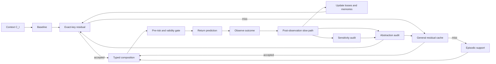

# EventFrame Whitepaper: A Mathematical Framework for Event-Centric Prediction

**Author:** Juan Hua Xu
**ORCID:** <https://orcid.org/0009-0008-7305-5690>
**Research profile:** <https://github.com/JuanHuaXu>
**License:** MIT License. Copyright (c) 2026 Juan Hua Xu.

_Public working paper. This version has not been experimentally validated._

## Abstract

EventFrame is a framework for event-centric prediction. It represents experience as typed event frames rather than as unstructured sequences alone, but does not treat those frames as fundamental ontology. Event frames are task-relative compressed records. Physical information bounds motivate caution about microscopic descriptions but do not prove a discrete substrate or the framework's sparsity hypothesis.

The central object is $e_t\in\mathcal E_{\Delta_\tau}$, obtained as $e_t=\Gamma_{\Delta_\tau}(\omega_{A_t})$. Temporal resolution may range from seconds to microseconds when measurement supports it. Given $C_t=e_{t-k+1:t}$, the predictor returns a distribution over marked event times and a no-event outcome. A strictly proper predictive score is primary; bounded event-aware timing error is a diagnostic.

The governing principle minimizes post-observation event action plus representation cost, subject to an Anti-Pigeon bound on within-bucket future divergence. Prediction-time admission uses a separate risk containing only quantities available before the next event occurs.

EventFrame separates a baseline from cached statistical error correction. The typed composition $\hat e_{t+1}=B(C_t)\oplus_E r_t^*$ uses a self-adjoint operator representation, norm clipping, admissible projection, and a decoder. A separately typed operator composes runtime packets. The construction is structurally inspired by Causal Fermion Systems but is not its causal action and makes no physical-equivalence claim.

Validity-constrained fuzzing measures model sensitivity, not causality. Causal claims require an explicit structural causal model and identified interventions. Approximate predictive lumpability compares detailed contexts that share an abstract context. Every group retains a traceability frame plus a coverage-aware audit set; one representative alone cannot establish group stability.

The paper remains a research framework without implementation results. Its evaluation program measures proper forecast quality, residual utility, sensitivity stability, audit coverage, abstraction quality, regime adaptation, and runtime tradeoffs.

## 1. Introduction

Prediction systems often operate over sequences whose internal structure is only implicit. A model may receive tokens, vectors, logs, traces, or state observations and learn statistical regularities among them. This can be effective, but it makes some questions difficult to ask directly: which compressed distinction mattered, what changed, when did it happen, where did it occur, why might it matter, and how did it transform the state of the world?

EventFrame begins from a compression premise: a modeled substrate may contain more detail than a prediction system can retain. Event frames are task-relative coarse-grained representations, not assertions about fundamental spacetime. Physical information bounds motivate caution but do not prove this software-level premise [7--9].

The framework represents experience as event frames selected for predictive and intervention relevance. An event frame is a typed record of an occurrence or transition after compression. It includes the 5W1H fields of who, what, when, where, why, and how, plus auxiliary state and confidence metadata. The goal is not to claim that every domain naturally exposes these fields perfectly. The goal is to create a disciplined representation in which uncertainty, missing fields, competing explanations, and compression choices can still be recorded explicitly.

The core contribution is adaptive event abstraction. The framework minimizes post-observation predictive action and representation cost while constraining within-bucket future divergence. It distinguishes model-sensitivity evidence from causal intervention evidence.

Given $C_t=e_{t-k+1:t}$, the system predicts a distribution over event identity, event time, and no event within horizon $H$. Proper forecast scores are primary because timing-only loss can reward the wrong event at the right time. Event-aware timing remains an interpretable diagnostic.

The reference prediction procedure has six steps:

1. Form a context $C_t$ from the last $k$ event frames.
2. Compute a baseline prediction $b_t = B(C_t)$.
3. Retrieve a residual correction $r_t^*$ from a residual cache if the current context matches a prior error pattern.
4. Compose the prediction as $\hat e_{t+1}=b_t\oplus_E r_t^*$ and apply the pre-observation risk gate.
5. Observe the next marked event or no-event outcome and evaluate proper predictive loss.
6. Use a slower refinement process to update residuals, test invariants, revise abstractions, or revise the event ontology.

This procedure explains why the framework includes both memory and residual prediction. Episodic memory stores prior cases. A residual cache stores reusable corrections to a baseline transition. The distinction matters because recalling a similar event and applying a similar error correction are not the same operation. The first supports case-based reasoning; the second supports low-latency approximation when similar contexts produce similar transition errors.

The slow path uses validity-constrained perturbations to test model sensitivity, coverage-aware bucket audits to find hidden divergence, and approximate predictive lumpability to test compression. Causal analysis is a separate optional path requiring structural equations and identification assumptions.

The contributions of this paper are therefore:

1. A compressed event-frame ontology for prediction-oriented representation.
2. A governing optimization principle for adaptive event abstraction.
3. A residual prediction model with constrained composition and action-residual fast-path caching.
4. A combined episodic and residual memory architecture.
5. A validity-constrained sensitivity method for conditional invariants and ontology review.
6. A lumpability-based approach to abstraction.
7. A fast-path and slow-path reference runtime model.
8. Experiment designs for testing the framework's claims.

These are proposed as a research framework, not as validated results or a fixed implementation. Event-centric latent retrieval itself has prior art [10]; EventFrame's claimed contribution is the typed residual-error and evidence-controlled abstraction loop. The next section defines the event ontology.

## Claims Register

This section states the paper's major claims as falsifiable targets. The claims are not treated as established results. Each one names what would need to be measured, proved, or falsified by later experiments.

Claim 0. Adaptive event abstraction is the governing principle: minimize expected post-observation event action plus representation cost while preventing buckets from hiding future-distinct events; use a separate pre-observation risk for runtime admission.

Claim 1. Structured event frames are useful predictive units if, for a declared task, they improve interpretability or temporal prediction relative to unstructured sequence records without hiding field-level error.

Claim 1a. Event frames are task-relative compressed representations rather than claims about fundamental ontology. Physical constants do not prove the compression hypothesis.

Claim 1b. Temporal precision controls frame granularity if changing the declared time resolution $\Delta_\tau$ changes the candidate-frame set, cache pressure, and detectable divergence boundaries in measurable ways.

Claim 2. Residual caches reduce prediction cost or error when similar contexts or action signatures produce similar baseline errors and retrieved residuals improve temporal loss often enough to justify lookup and maintenance.

Claim 2a. Runtime prediction packets are useful when a separately typed packet composition operator improves selection of memory nodes, graph edges, retrieval lane, compaction risk, response mode, or control branch on held-out packet loss.

Claim 3. Episodic memory and residual cache memory serve different roles because prior-case recall and prior-error correction can be independently useful or harmful under the same prediction context.

Claim 4. Validity-constrained property fuzzing exposes conditional model invariants and ontology review signals. It does not establish causal effects without an explicit SCM and identification strategy.

Claim 5. Approximate predictive lumpability provides a route to abstraction when projected event states preserve target-relevant transition behavior within a declared divergence threshold.

Claim 5a. Event streams can conjoin or diverge over time when multiple streams become prediction-equivalent under a merge threshold or when small distinctions amplify into target-distinct downstream futures.

Claim 5b. Each group retains at least one concrete traceability frame plus a coverage-aware audit set; one representative alone is insufficient for group-level divergence claims.

Claim 6. Anti-Pigeon rejects buckets whose estimated future-diameter exceeds threshold and adapts stale predictive buckets across observed regimes. Causal attribution requires separate intervention evidence.

Claim 6a. Target-effective distinctions are sparse only when their measured ratio is small within a finite declared candidate set.

Claim 7. Fast-path and slow-path separation is computationally useful if low-latency prediction can reuse cached residuals while slower background work improves future predictions without blocking the current one.

Claim 7a. Expected exact-key lookup is history-independent only when context update, key construction, graph degree, key size, and cache size are bounded; fallback and maintenance costs remain explicit.

## 2. Event Ontology

EventFrame uses event frames as predictive units, not as fundamental ontology. The underlying substrate is assumed to contain more detail than the predictor can retain. That substrate may be physical, simulated, biological, robotic, or software-based. EventFrame treats a frame as a task-relative compressed representation. Physical information bounds motivate caution about microscopic descriptions but do not prove a discrete substrate, a Planck-scale sampling lattice, or the EventFrame sparsity hypothesis.

An event is therefore a structured representation of a change, occurrence, action, observation, or state transition after coarse-graining. An event frame records that compressed event in fields that can be compared, predicted, fuzzed, cached, and abstracted.

An event frame at index $t$ is written:

```math
e_t = (w_t, a_t, \tau_t, \ell_t, m_t, h_t, x_t, c_t)
```
where $w_t$ denotes participating agents or entities, $a_t$ denotes the action or occurrence type, $\tau_t$ denotes the time index or interval, $\ell_t$ denotes location or spatial context, $m_t$ denotes motive, objective, causal explanation, or inferred driver, $h_t$ denotes mechanism or process, $x_t$ denotes auxiliary state, and $c_t$ denotes confidence, provenance, or uncertainty metadata.

The conceptual role of this ontology is compression. It prevents prediction from treating history as a single undifferentiated sequence, but it also prevents prediction from pretending that every microscopic distinction deserves its own event identity. The fields ask different compressed questions. The "what" field identifies an occurrence type. The "when" field supports temporal prediction loss. The "who" and "where" fields localize the event. The "why" and "how" fields record explanatory hypotheses and mechanisms. The auxiliary state field allows symbolic, vector, graph, or latent variables to travel with the event. The confidence field prevents uncertain extraction from pretending to be certain observation.

Let $\Omega$ denote a dense substrate state space and let $\omega_{A_t}$ denote the substrate history over a finite region $A_t$. A coarse-graining map at temporal resolution $\Delta_\tau$:

```math
\Gamma_{\Delta_\tau}: \Omega^{A_t} \rightarrow \mathcal{E}_{\Delta_\tau}
```
produces an event frame:

```math
e_t = \Gamma_{\Delta_\tau}(\omega_{A_t}).
```
This equation states the ontology clearly: the event frame is a lossy, task-oriented compression. The compression is useful only if it preserves distinctions that matter for prediction, intervention, memory, or review.

The temporal resolution $\Delta_\tau$ controls how precise the "when" field is. A model may choose second-level frames, microsecond-level frames, or another declared scale. Finer resolution can instantiate more candidate frames, but it does not imply that every candidate frame is intervention-effective or should be retained forever. Sparsity means that useful distinctions are rare relative to the possible substrate and candidate-frame distinctions, not that the model is forbidden from creating many candidate frames when the task demands precision.

Mathematically, the event space is treated as a typed product:

```math
\mathcal{E} =
\mathcal{W} \times \mathcal{A} \times \mathcal{T} \times
\mathcal{L} \times \mathcal{M} \times \mathcal{H} \times
\mathcal{X} \times \mathcal{C}.
```
This equation is operational, not decorative. It says that before a field can be used in prediction, caching, fuzzing, or abstraction, the field must have a representation and a comparison rule. For example, $\mathcal{T}$ may contain timestamps or intervals; $\mathcal{L}$ may contain coordinates, graph nodes, or symbolic regions; $\mathcal{C}$ may contain confidence scores and source provenance. EventFrame does not require one universal encoding for all domains, but it requires the encoding to be declared.

An event state is the system state before, during, or after an event. In some domains, $x_t$ may include an explicit pre-state and post-state. In others, $x_t$ may be a latent state vector inferred from observations. A transition occurs when one event context gives rise to a later event frame. The basic trajectory is:

```math
E_{1:T} = (e_1, e_2, \ldots, e_T).
```
Operationally, a prediction step extracts a context from this trajectory:

```math
C_t = e_{t-k+1:t}.
```
The context $C_t$ is the recent event history available to the predictor. It gives the predictor local structure for forecasting the next event and its time. If the context is too short, important predictive or temporal dependencies may be missing. Causal dependence is a stronger claim and requires an explicit causal model or identified intervention evidence. The context length $k$ is a modeling choice that should be evaluated experimentally.

The ontology also supports typed links. Temporal links order events, spatial links relate locations, and predictive-dependency links record forecast-relevant association. Causal links are reserved for relations supported by a declared structural causal model or an identified intervention. These link types must remain distinct in storage and evaluation.

Event histories are therefore not limited to linear chains. Multiple event streams can become representable as a single aggregate event over time. This is event confluence: separate streams merge into a larger stream or macro-event when their separate identities no longer affect the target beyond a declared threshold. The reverse can also occur. A small distinction can branch into multiple downstream event streams when a perturbation is amplified by the dynamics. This is event divergence, or butterfly-effect-style sensitivity. EventFrame must model both patterns because compression that is safe in a confluence region may be unsafe near a divergence point.

For traceability, EventFrame keeps at least one concrete frame for every event-frame group. One frame cannot characterize a heterogeneous group, so abstraction audits use a coverage-aware set containing boundary, uncertain, and sampled examples. Section 7 formalizes that audit set and the limits of conclusions drawn from it.

The event sparsity hypothesis follows from this compression view. Relative to a finite declared candidate set, EventFrame hypothesizes that only a small fraction of distinctions materially change the prediction target. Model fuzzing and ablation test predictive sensitivity; only randomized or otherwise identified interventions test causal effect. The hypothesis must be measured in each domain rather than inferred from Planck constants or entropy bounds.

The main limitation of the ontology is extraction and compression quality. In real data, the "why" and "how" fields may be ambiguous, inferred, or unavailable. More fundamentally, the chosen coarse-graining $\Gamma_{\Delta_\tau}$ may discard distinctions that later turn out to matter. EventFrame handles this by allowing missing values, confidence metadata, and revision under slow-path review rather than requiring false precision. A conservative implementation should distinguish observed fields from inferred fields and should propagate uncertainty into prediction and review. The next section defines the mathematical framework built on this compressed ontology.

## 3. Mathematical Framework

The mathematical framework turns compressed event frames into objects that can be predicted, evaluated, cached, and abstracted. Given a context $C_t$, the predictor must produce a next-event distribution before the next observation exists. Only after the observation arrives may the runtime compute realized prediction loss and update memory or abstraction.

Let $\Omega$ denote a dense substrate state space. For a finite region $A_t$, let $\omega_{A_t} \in \Omega^{A_t}$ denote the substrate history over that region. At temporal resolution $\Delta_\tau$, an event frame is produced by:

```math
e_t = \Gamma_{\Delta_\tau}(\omega_{A_t}), \qquad
\Gamma_{\Delta_\tau}: \Omega^{A_t} \rightarrow \mathcal{E}_{\Delta_\tau}.
```
The coarse-graining $\Gamma_{\Delta_\tau}$ is task-relative and lossy. It selects distinctions available to prediction, memory, and review; it does not establish a fundamental discretization of spacetime. The Planck scales and physical information bounds motivate caution about microscopic descriptions but do not prove the EventFrame sparsity hypothesis [7--9].

A trajectory at fixed resolution is:

```math
E_{1:T}=(e_1,\ldots,e_T), \qquad e_t\in\mathcal E_{\Delta_\tau},
```
and a time quantizer is:

```math
Q_{\Delta_\tau}:\mathbb R\rightarrow\mathcal T_{\Delta_\tau}.
```
Second-level or microsecond-level precision is permitted only when the measurement process supports it. Finer resolution creates more candidate frames and can expose boundaries, but also increases noise and cache pressure.

For a context length $k$, define:

```math
C_t=e_{t-k+1:t}\in\mathcal E^k.
```
Let $\nu(e)$ be the event mark or occurrence type and $\tau(e)$ its time. Over a prediction horizon $H>0$, the next outcome is:

```math
Z_{t+1}=
\begin{cases}
(\nu(e_{t+1}),\tau(e_{t+1})-\tau(e_t)), & \text{if an event occurs within }H,\\
\varnothing, & \text{otherwise.}
\end{cases}
```
A probabilistic predictor returns a distribution rather than only a point:

```math
\mathsf Q_\theta(\cdot\mid C_t)\in\mathcal P(\mathcal Z_H),
```
where $\mathcal Z_H$ contains marked event times in $(0,H]$ and the no-event outcome $\varnothing$. The primary prediction objective is a declared strictly proper scoring rule:

```math
\mathcal L_{\mathrm{pred}}(\theta;t)
=S_{\mathrm{prop}}\!\left(\mathsf Q_\theta(\cdot\mid C_t),Z_{t+1}\right).
```
For a model with joint event-time density $q_\theta$, the logarithmic score is one implementation:

```math
\mathcal L_{\log}(\theta;t)=
\begin{cases}
-\log q_\theta(\nu_{t+1},\Delta t_{t+1}\mid C_t), & Z_{t+1}\neq\varnothing,\\
-\log \mathsf Q_\theta(T_{t+1}>H\mid C_t), & Z_{t+1}=\varnothing.
\end{cases}
```
This scores event identity, timing, calibrated uncertainty, and right-censoring. Proper scoring rules prevent a predictor from improving its expected score by reporting a distribution other than the one it believes [6].

For human-readable diagnostics, let $\hat Z_{t+1}$ be a point summary of the distribution. A bounded event-aware timing diagnostic is:

```math
\mathcal L_{\mathrm{event}}^H(\hat Z,Z)=
\begin{cases}
0, & \hat Z=Z=\varnothing,\\
1, & \text{exactly one is }\varnothing\text{ or their marks differ},\\
\min\!\left(1,\dfrac{|\widehat{\Delta t}-\Delta t|}{H}\right),
& \text{their non-null marks agree.}
\end{cases}
```
Unlike the original timing-only diagnostic, this expression cannot assign zero loss to the wrong event type merely because its timestamp is correct. It remains a diagnostic; model fitting and forecast comparison should use $\mathcal L_{\mathrm{pred}}$.

For any other field, use a distinct projection $\psi_i:\mathcal E\rightarrow\mathcal X_i$ and declared distance:

```math
\mathcal L_i=d_i(\psi_i(\hat e_{t+1}),\psi_i(e_{t+1})).
```
EventFrame uses separate pre-observation and post-observation quantities. A pre-observation admissibility risk may use only information available at prediction time:

```math
\mathcal R_{\mathrm{pre}}(\tilde e\mid C_t)
=\lambda_a D_{\mathrm{abs}}^{\mathrm{pre}}
+\lambda_c D_{\mathrm{edge}}^{\mathrm{pre}}
+\lambda_u U(\tilde e\mid C_t).
```
Each component is declared and normalized to $[0,1]$, and the non-negative weights are reported. After $Z_{t+1}$ is observed, the realized event action is:

```math
\mathcal A_{\mathrm{post}}(\tilde e,Z_{t+1})
=\lambda_p\mathcal L_{\mathrm{pred}}
+\lambda_a D_{\mathrm{abs}}^{\mathrm{post}}
+\lambda_c D_{\mathrm{edge}}^{\mathrm{post}}
+\lambda_u U^{\mathrm{post}}.
```
The fast path may gate a correction using $\mathcal R_{\mathrm{pre}}$; it may never use $\mathcal A_{\mathrm{post}}$ before the observation exists.

The governing principle can now be stated without overloading $\Omega$. Let:

```math
\Theta=(\Gamma_{\Delta_\tau},F_\theta,\pi,\mathcal C_A,\mathcal C_R,\mathcal C_E)
```
collect the coarse-graining, predictor, abstraction map, and caches. Let $\mathfrak K_\pi$ be the buckets induced by $\pi$, let $\mathcal C_{\mathrm{rep}}(\Theta)$ be representation and runtime cost, and let $P_{\mathrm{eval}}$ be the declared evaluation distribution. For a bucket $K$, define its future-diameter $D_K(\Theta)$ as in Section 7. The research objective is:

```math
\boxed{
\Theta^*=\arg\min_\Theta
\left[
\mathbb E_{(C,Z)\sim P_{\mathrm{eval}}}
\mathcal A_{\mathrm{post}}(\hat e_\Theta(C),Z)
+\lambda_{\mathrm{rep}}\mathcal C_{\mathrm{rep}}(\Theta)
\right]
\quad\text{s.t.}\quad
\forall K\in\mathfrak K_\pi,\ D_K(\Theta)<\epsilon_{AP}.
}
```
The expectation is empirical when $P_{\mathrm{eval}}$ is a fixed validation set and population-level only when a data-generating distribution is specified. The constraint discourages compression that hides target-distinct futures; it does not by itself guarantee that the optimizer is identifiable or computationally tractable.

An event history may be represented by a time-unrolled directed graph:

```math
G_t=(V_t,R_t),
```
where $V_t\subset\mathcal E$ and edges in $R_t$ are typed as temporal, predictive-dependency, or causal. The graph is acyclic only after time-unrolling; feedback in the physical system is represented through edges across successive times. Predictive-dependency edges must not be interpreted as causal edges without a structural causal model.

For causal language, EventFrame requires an explicit structural causal model $\mathfrak M=(U,V,F,P_U)$. An intervention such as $do(V_j=v')$ replaces the structural equation for $V_j$; only then is

```math
d_Y\!\left(P_{\mathfrak M}(Y\mid do(V_j=v')),P_{\mathfrak M}(Y)\right)
```
a causal effect [5]. Without $\mathfrak M$, changing an input frame or graph is a model perturbation and measures predictor sensitivity, not causation.

The event sparsity hypothesis is therefore stated relative to a finite declared candidate set $\mathcal D_t$, not by comparing cardinalities with a continuous substrate. If $\mathcal I_{\mathrm{eff}}(Y,\eta_Y)\subseteq\mathcal D_t$ contains candidate distinctions whose identified or randomized intervention effect exceeds $\eta_Y$, then the empirical sparsity ratio is:

```math
s_{\mathrm{eff}}=
\frac{|\mathcal I_{\mathrm{eff}}(Y,\eta_Y)|}{|\mathcal D_t|}.
```
EventFrame hypothesizes $s_{\mathrm{eff}}\ll1$ in domains where compression is useful. This is a falsifiable modeling hypothesis, not a physical theorem.

Confluence and divergence concern target-relative predictive behavior. A merge $\mu_\delta(S_1,\ldots,S_m)$ is accepted only when its held-out predictive degradation and bucket future-diameter remain below declared thresholds. A perturbation operator $\mathcal B_\epsilon$ may generate candidate downstream graphs, but a distribution over those candidates must be specified before writing probabilities conditioned on its output.

Every non-empty event bucket $K$ retains at least one concrete frame for traceability. Detection requires more than one frame when the bucket is heterogeneous, so the runtime maintains an audit set $\mathcal R(K)\subseteq K$ satisfying a declared coverage rule, for example:

```math
\sup_{e\in K}\min_{r\in\mathcal R(K)}d_K(e,r)\le\delta_K.
```
The audit set may combine a medoid, boundary examples, high-uncertainty examples, and a reservoir sample. Tests over $\mathcal R(K)$ are statistical estimates of bucket behavior, not proofs about unobserved members. Confidence, coverage, and false-negative risk must be reported.

Confidence and provenance metadata $c_t$ determine whether fields may be used for training, lookup, sensitivity testing, or causal analysis. Observed fields, inferred fields, and synthetic perturbations remain distinct throughout the lifecycle.

## 4. Residual Prediction

Residual prediction separates a first-pass event estimate from a correction. The baseline captures ordinary transition structure; the residual records a recurring statistical prediction error. A residual is not a causal hypothesis unless separate intervention evidence identifies it as causal.

Let the point-summary baseline be:

```math
B:\mathcal E^k\rightarrow\mathcal E, \qquad b_t=B(C_t).
```
To make structured correction type-correct, choose a finite-dimensional Hilbert space $\mathscr H$ and let $\mathbb H_d$ be the real vector space of self-adjoint operators on $\mathscr H$, equipped with the Frobenius norm $\|\cdot\|_F$. Define:

```math
q_E:\mathcal E\rightarrow\mathbb H_d,
\qquad
d_E:\mathcal Q_{E,\mathrm{adm}}\rightarrow\mathcal E,
```
where $\mathcal Q_{E,\mathrm{adm}}\subseteq\mathbb H_d$ is a non-empty closed admissible set and $d_E$ is a decoder, not an inverse of the lossy encoder. For a radius $\delta_E>0$, define norm clipping by:

```math
\operatorname{clip}_{\delta_E}(r)=
\begin{cases}
0, & r=0,\\
r\min\!\left(1,\dfrac{\delta_E}{\|r\|_F}\right), & r\neq0.
\end{cases}
```
Let the admissibility projection be a deterministic selection:

```math
\Pi_E(v)\in\arg\min_{u\in\mathcal Q_{E,\mathrm{adm}}}\|u-v\|_F.
```
A minimizer exists when the admissible set is closed in finite dimensions. It is unique when that set is convex; otherwise the implementation must declare a tie-breaking rule. Event residual composition is:

```math
b\oplus_E r
=d_E\!\left(\Pi_E\!\left(q_E(b)+\operatorname{clip}_{\delta_E}(r)\right)\right),
\qquad r\in\mathbb H_d.
```
This construction borrows only the use of self-adjoint operator representations and variational admissibility from Causal Fermion Systems [1,2]. It is not the CFS causal action, does not inherit CFS field equations, and makes no claim of physical equivalence.

Residuals are estimated after observation. A simple representation residual is:

```math
r_t^{\mathrm{obs}}=q_E(e_{t+1})-q_E(b_t).
```
An implementation may replace subtraction with a learned alignment or constrained estimator, but its domain and objective must be declared. In all cases, the residual is a reusable correction candidate whose utility must be re-evaluated on later observations.

The general residual cache is:

```math
\mathcal C_R=\{(\kappa_i,r_i,s_i)\}_{i=1}^{N},
\qquad
\kappa:\mathcal E^k\rightarrow\mathcal K_R,
\qquad r_i\in\mathbb H_d,
```
where $s_i$ contains age, support, provenance, and realized post-observation loss. For $N>0$, let:

```math
j_t=\min\!\left(\arg\min_{1\le i\le N}
d_{\mathcal K_R}(\kappa(C_t),\kappa_i)\right),
```
where the outer minimum is the declared deterministic tie-break. The retrieved residual is:

```math
r_t^*=
\begin{cases}
r_{j_t}, & N>0\text{ and }d_{\mathcal K_R}(\kappa(C_t),\kappa_{j_t})\le\epsilon_R,\\
0_{\mathbb H_d}, & \text{otherwise.}
\end{cases}
```
The corrected point prediction is $\hat e_{t+1}=b_t\oplus_E r_t^*$. The pre-observation gate uses only current information:

```math
\mathcal R_{\mathrm{pre}}(\hat e_{t+1}\mid C_t)\le\eta_{\mathrm{pre}}.
```
Realized loss and cache updates wait for $Z_{t+1}$. This separates admission-time risk from post-observation evidence.

For lower-latency exact-key reuse, let:

```math
\alpha:\mathcal E^k\rightarrow\mathcal K_A,
```
and define the partial map:

```math
\mathcal C_A:
\mathcal K_A\rightharpoonup
\mathbb H_d\times[0,1]\times\mathbb N_0\times\mathcal T.
```
For $k_t=\alpha(C_t)$, bind the cache entry explicitly:

```math
\mathcal C_A(k_t)=(r_{k_t},c_{k_t},n_{k_t},t_{k_t}).
```
Then:

```math
r_t^A=
\begin{cases}
r_{k_t}, & k_t\in\operatorname{dom}(\mathcal C_A),\ c_{k_t}\ge\gamma_A,\
n_{k_t}\ge n_{\min},\ \operatorname{age}_t(t_{k_t})\le A_{\max},\\
0_{\mathbb H_d}, & \text{otherwise.}
\end{cases}
```
A bounded hash table can provide expected $O(1)$ lookup after the bounded key has been constructed. Key construction, hashing, collision handling, synchronization, and eviction remain separate costs.

After observation, let $I_t=1$ when the residual improves $\mathcal A_{\mathrm{post}}$ by at least $\delta_A$, and $I_t=0$ otherwise. With a Beta prior $\operatorname{Beta}(a_0,b_0)$, a calibrated stationary estimate is:

```math
c_{k_t}=\frac{a_0+\sum_{u\in\mathcal U_{k_t}}I_u}
{a_0+b_0+|\mathcal U_{k_t}|}.
```
For drift, the implementation may use explicitly time-decayed counts, but must report the decay schedule and effective sample size. Low confidence, insufficient support, excessive pre-risk, or worsened post-loss routes the case to slow-path review.

The runtime packet uses a separate typed composition operator. Let:

```math
X_t=\chi(C_t,\mathcal M_t,G_t,\sigma_t)\in\mathcal X_{\mathrm{ctx}},
```
and define the packet space:

```math
\mathcal Y_{\mathrm{pkt}}
=\mathcal N_{\mathrm{mem}}
\times\mathcal E_{\mathrm{graph}}
\times\mathcal L_{\mathrm{lane}}
\times\mathcal C_{\mathrm{compact}}
\times\mathcal M_{\mathrm{mode}}
\times\mathcal U_{\mathrm{control}}.
```
Choose a normed packet representation $\mathcal V_Y$, an admissible subset $\mathcal V_{Y,\mathrm{adm}}$, encoder $q_Y$, decoder $d_Y$, deterministic projection $\Pi_Y$, and clipping radius $\delta_Y$. Define:

```math
y\oplus_Y r
=d_Y\!\left(\Pi_Y\!\left(q_Y(y)+\operatorname{clip}_{\delta_Y}(r)\right)\right).
```
The baseline and residual now have compatible types:

```math
B_Y:\mathcal X_{\mathrm{ctx}}\rightarrow\mathcal Y_{\mathrm{pkt}},
\qquad
R_Y:\mathcal X_{\mathrm{ctx}}\rightarrow\mathcal V_Y,
```
and the packet prediction is:

```math
\widehat{\mathbf y}_{t+1}=B_Y(X_t)\oplus_Y R_Y(X_t).
```
Its components are top memory nodes, top graph edges, retrieval lane, compaction risk, response mode, and an optional control branch. Discrete components may be encoded as logits with validity masks; the decoder must specify tie-breaking and null actions.

After execution, let $\mathbf y_{t+1}^{\star}$ be the audited packet target and let $\mathcal L_{\mathrm{pkt}}(\widehat{\mathbf y},\mathbf y^{\star})\in[0,1]$ be a declared weighted component loss. Packet residual utility is the observed improvement:

```math
I_t^Y=\mathbf 1\!\left[
\mathcal L_{\mathrm{pkt}}(B_Y(X_t)\oplus_Y R_Y(X_t),\mathbf y_{t+1}^{\star})
+\delta_{\mathrm{pkt}}
\le
\mathcal L_{\mathrm{pkt}}(B_Y(X_t),\mathbf y_{t+1}^{\star})
\right].
```
Confidence is updated from the corresponding success/failure counts, as above. If $\mathcal P_t=\{(p_m,w_m)\}_{m=1}^{M}$ is a candidate set, an explicitly heuristic exponential-weights update is:

```math
w_m^{\mathrm{new}}=
\frac{w_m\exp(-\lambda_P\mathcal A_{\mathrm{post}}^{(m)})}
{\sum_{j=1}^{M}w_j\exp(-\lambda_P\mathcal A_{\mathrm{post}}^{(j)})}.
```
This is not a Bayesian particle filter unless $\mathcal A_{\mathrm{post}}$ is derived from a likelihood. Pruning or resampling must monitor effective sample size to avoid premature collapse.

The main failure modes are cache pollution, overcorrection, stale residuals, false similarity, invalid decoding, and packet-component incompatibility. Every implementation must report cache support, age, pre-risk, realized improvement, fallback frequency, and decoder failures.

## 5. Memory Model

EventFrame uses memory for two different purposes: recalling prior events and reusing prior corrections. These purposes should not be collapsed. Episodic memory stores cases. A residual cache stores adjustments to a baseline prediction. Both may support prediction, but they answer different questions.

An episodic key-value cache can be written:

```math
\mathcal{C}_E = \{(u_i, v_i, s_i)\}_{i=1}^{M},
```
where $u_i$ is a retrieval key, $v_i$ is an event frame, trajectory segment, or summary, and $s_i$ is metadata. Given a context $C_t$, an episodic lookup retrieves prior cases that resemble the current situation. The operational use is case recall: retrieve examples that may inform the baseline model, explain the current state, or provide analogies for review.

A residual cache is different:

```math
\mathcal{C}_R = \{(\kappa_i, r_i, s_i)\}_{i=1}^{N}.
```
Here $r_i$ is not a prior event. It is a correction to a prior baseline prediction. The operational use is correction reuse: if the current context resembles a past context where the baseline missed in a known direction, apply the cached residual through the typed operator $\oplus_E$.

The conceptual distinction is important. Episodic memory says, "something like this happened before." Residual memory says, "the predictor made this kind of mistake before." A system can have useful episodic recall but poor residual reuse if prior cases are similar but their prediction errors differ. Conversely, a residual may be reusable even when the full episode is not otherwise relevant.

Prediction combines the two memories by priority rather than by collapse. A reference flow is:

1. Compute the baseline $b_t = B(C_t)$.
2. Try action-residual lookup in $\mathcal{C}_A$.
3. If the action residual is valid under confidence, age, and pre-risk checks, compose $\hat{e}_{t+1}=b_t\oplus_E r_t^A$.
4. If confidence is insufficient, try residual lookup in $\mathcal{C}_R$.
5. If residual confidence is still insufficient, retrieve episodic cases from $\mathcal{C}_E$ and use them to refine the baseline, explain uncertainty, or schedule slow-path review.
6. After observation, update episodic memory, residual confidence, and any action-residual entry that was used or falsified.

This flow keeps the low-latency path cheap while preserving a fallback to richer case evidence. Residual memory can answer quickly when the current situation matches a known error pattern. Episodic memory becomes more important when the residual cache is missing, low-confidence, stale, or contradicted by recent outcomes.

Similarity lookup requires declared key functions and distances. For episodic memory, the key function may emphasize entities, action types, and temporal neighborhoods. For residual memory, the key should emphasize features that predict baseline error. These are not necessarily the same. For example, two events may share an action type but differ in timing dynamics; they may be episodically similar while producing different residuals.

Consolidation is the process of updating memory after observation. A conservative consolidation step should:

1. Record the observed event $e_{t+1}$ with provenance and confidence.
2. Compute proper predictive loss and the event-aware timing diagnostic.
3. Estimate whether the baseline error is systematic enough to store as a residual.
4. Update or decay cache entries based on age, confidence, and repeated utility.
5. Preserve at least one traceability frame and the coverage-aware audit set required by Section 7.
6. Mark low-confidence entries so they cannot dominate future predictions.

Cache pollution is the main risk. If every error becomes a residual, the cache may memorize noise. If keys are too broad, residuals are applied in inappropriate contexts. If keys are too narrow, useful residuals are never reused. The cache should therefore track hit rate, post-correction loss, and whether retrieved residuals improve over the baseline.

Fast-path memory use should be cheap. A practical implementation may use approximate nearest-neighbor lookup, hashed keys, or bounded-size caches. The paper treats constant-time lookup as an approximation, not as a guarantee. Slow-path memory refinement may be more expensive because it runs after the initial prediction, when latency pressure is lower.

Representative preservation is a memory responsibility. A single traceability frame prevents a group from becoming an empty label, but boundary detection requires the audit set, coverage metadata, and sampling history. If these are discarded, the runtime must mark the group unaudited rather than infer stability from one example.

The memory model supports the overall EventFrame loop. Episodic memory helps interpret and compare cases. Residual memory corrects recurring transition errors. Slow-path consolidation keeps both memories from turning into unfiltered history. The next section uses perturbation rather than recall to discover which event properties are stable under prediction.

## 6. Fuzzing and Invariants

Property fuzzing tests model sensitivity: perturb a selected event field, rerun prediction, and measure the change in a declared output. It does not by itself establish how the real world would respond to an intervention.

Let $\phi_i$ be an event property. A validity-constrained fuzzing operator is:

```math
\mathcal F_{i,\epsilon}:\mathcal E\rightharpoonup\mathcal E,
```
where the partial arrow records that some perturbations are invalid. At context position or subset $r$:

```math
\mathcal F_{i,\epsilon}^{(r)}:\mathcal E^k\rightharpoonup\mathcal E^k.
```
For an output property $g$ and distance $d_g$, model sensitivity is:

```math
\Delta_g^{\mathrm{model}}=
d_g\!\left(
g(F_\theta(C_t)),
g(F_\theta(\mathcal F_{i,\epsilon}^{(r)}(C_t)))
\right).
```
The field is empirically stable over a declared validation family $\mathcal V_i$ when:

```math
\Pr_{(C_t,\epsilon,r)\sim\mathcal V_i}
\left(\Delta_g^{\mathrm{model}}\le\eta_g\right)
\ge1-\alpha_g,
```
with a reported confidence interval. The reporting score

```math
S_g=\min\!\left(1,\frac{\Delta_g^{\mathrm{model}}}{\eta_g}\right)
```
requires $\eta_g>0$. Thresholds are selected from measurement resolution, operational decision tolerance, and held-out calibration; fixed fractions such as $0.05H$ are examples only and must not be presented as universal constants.

For 5W1H review, let $\psi_j^{\mathrm{role}}(e)$ denote the component assigned to role $j\in\{W,A,T,L,M,H\}$. The average sensitivity of field $\phi_i$ to target property $g$ is:

```math
I_{i\rightarrow g}^{\mathrm{model}}=
\mathbb E_{(C_t,\epsilon,r)\sim\mathcal V_i}
\left[\Delta_g^{\mathrm{model}}\right].
```
This quantity may nominate a field for retain, migrate, duplicate, split, or uncertain status. It says that the current predictor uses the field; it does not prove that the field is a cause, that the assigned semantic explanation is true, or that changing the field in the world would change the target.

An operational protocol is:

1. Select contexts, target property, field, perturbation family, and validity constraints.
2. Separate observed contexts from synthetic perturbations.
3. Run original and perturbed predictions.
4. Estimate sensitivity, uncertainty, and boundary regions on held-out contexts.
5. Check whether the result survives alternative plausible perturbation families.
6. Use the result as a review signal, not an automatic ontology rewrite.

Synthetic frames are never inserted into episodic memory as observations. They may be stored in a separate audit log with their generating operator and validity assumptions.

Graph perturbation follows the same rule. Let $G_t=(V_t,R_t)$ be a time-unrolled predictive graph and let:

```math
G_t'=\mathcal I_{v,\epsilon}^{\mathrm{model}}(G_t).
```
The resulting predictor sensitivity is:

```math
\Delta_Y^{\mathrm{model}}=
d_Y\!\left(P_\theta(Y\mid G_t'),P_\theta(Y\mid G_t)\right).
```
This may update predictive-dependency confidence, residual keys, or abstraction review priorities. It must not update causal-edge confidence merely because the predictor changed.

When an explicit structural causal model $\mathfrak M=(U,V,F,P_U)$ exists and an intervention target is well-defined, a separate causal analysis may compute:

```math
\Delta_Y^{\mathrm{causal}}=
d_Y\!\left(
P_{\mathfrak M}(Y\mid do(V_j=v')),
P_{\mathfrak M}(Y)
\right).
```
Identification assumptions, manipulated variables, confounder controls, and transport assumptions must be stated. Randomized or otherwise identified intervention evidence may update causal-edge confidence; input fuzzing alone may not [5].

The slow path begins only after a realized post-observation loss is available:

1. Observe $\mathcal A_{\mathrm{post}}>\eta_{\mathrm{post}}$ or repeated packet failure.
2. Select candidate fields, nodes, or edges from residual and uncertainty evidence.
3. Run validity-constrained model perturbations.
4. If an SCM and identification strategy exist, run the corresponding causal analysis separately.
5. Update cache keys, predictive edges, or abstraction markers only after repeated held-out improvement.

For a candidate ontology change from state $s$ to $s'$, promote the change only when at least $n_{\min}^{\mathrm{rev}}$ independent validation contexts show post-loss improvement of at least $\delta_{\mathrm{rev}}>0$:

```math
\#\left\{C_t:
\mathcal A_{\mathrm{post}}^{s}(C_t)
-\mathcal A_{\mathrm{post}}^{s'}(C_t)
\ge\delta_{\mathrm{rev}}
\right\}
\ge n_{\min}^{\mathrm{rev}}.
```
The evaluation contexts must not be the same examples used to propose the change. Before validation, the field remains provisional. Previous assignments and provenance are retained so the change can be audited or reversed.

An EventFrame invariant is therefore conditional: stable under this valid perturbation family, for this predictor and target, in this data regime, within this threshold and confidence level. Failure modes include invalid perturbations, off-manifold inputs, hidden confounding, adaptive reuse of the validation set, and thresholds below measurement noise.

## 7. Lumpability and Abstraction

Abstraction is useful only when it preserves the transition behavior required by the declared target. Let:

```math
\pi:\mathcal E\rightarrow\mathcal Z
```
map detailed events to abstract states, and extend it componentwise to contexts as $\pi^k(C_t)$.

The induced conditional distribution $P(\pi(e_{t+1})\mid\pi(e_t))$ is not by itself a lumpability test because it averages over the hidden mixture of detailed states inside a bucket. Instead, define the approximate predictive lumpability defect:

```math
\varepsilon_{\mathrm{lump}}(\pi)=
\sup_{C,C':\,\pi^k(C)=\pi^k(C')}
D\!\left(
P(\pi(e_{t+1})\mid C),
P(\pi(e_{t+1})\mid C')
\right).
```
The abstraction is $\epsilon_L$-predictively lumpable for the target when:

```math
\varepsilon_{\mathrm{lump}}(\pi)\le\epsilon_L.
```
This pairwise condition prevents an aggregate conditional distribution from hiding incompatible microstate transitions. It adapts classical and near-lumpability to finite-context prediction rather than claiming a new Markov-chain theorem [3,4]. In finite data, the supremum is estimated with confidence bounds over observed or generated context pairs; passing the estimate is evidence, not proof about unseen contexts.

Operationally:

1. Choose $\pi$, target, divergence $D$, tolerance $\epsilon_L$, and evaluation distribution.
2. Form detailed context pairs that map to the same abstract context.
3. Compare their next-abstract-event distributions.
4. Report the maximum estimated divergence with uncertainty and minimum bucket support.
5. Accept the abstraction only when held-out predictive degradation and the upper confidence bound remain below threshold.

Confluence applies the same requirement to merged event streams. Divergence rejects a merge when a small valid perturbation produces target-distinct future distributions. These statements concern predictive equivalence unless a separate causal model supports intervention claims.

Every non-empty bucket $K\subseteq\mathcal E$ retains at least one concrete frame for traceability, but one frame is not sufficient to characterize a heterogeneous bucket. Maintain an audit set:

```math
\varnothing\neq\mathcal R(K)\subseteq K
```
with a declared coverage rule, such as:

```math
\sup_{e\in K}\min_{r\in\mathcal R(K)}d_K(e,r)\le\delta_K.
```
The set should include a medoid or high-confidence anchor, boundary examples, high-uncertainty examples, and a reservoir sample when the bucket is large. If compression prevents this coverage estimate, the system cannot claim that the bucket has been audited.

Anti-Pigeon is the split-side guard against invalid abstraction and stale predictive habit. The name denotes anti-pigeonholing: events may share a bucket only while their target futures remain sufficiently similar.

For each bucket $K$ and associated contexts $C_i$, define:

```math
D_{ij}^{K}(\Theta)=
D\!\left(
P_\Theta(Y\mid C_i),
P_\Theta(Y\mid C_j)
\right),
```
and the theoretical future-diameter:

```math
D_K(\Theta)=\sup_{e_i,e_j\in K}D_{ij}^{K}(\Theta).
```
The bucket is admissible only when:

```math
D_K(\Theta)<\epsilon_{AP}.
```
An operational audit computes:

```math
\widehat D_K=
\max_{r_i,r_j\in\mathcal R(K)}D_{ij}^{K}
```
and reports coverage and statistical uncertainty. Because $\widehat D_K\le D_K$, a small audit maximum cannot prove that an uncovered bucket is safe. A large value is sufficient evidence to split or mark the bucket; a small value is only reassuring when the audit set has adequate coverage.

Observed operating regimes use a distinct symbol $\zeta_t\in\mathcal Z_{\mathrm{reg}}$. Regime-conditioned predictive divergence is:

```math
D_{i,a,b}^{\mathrm{reg}}=
D\!\left(
P_\Theta(Y\mid C_i,\zeta_a),
P_\Theta(Y\mid C_i,\zeta_b)
\right).
```
If this exceeds $\epsilon_{AP}^{\mathrm{reg}}$ repeatedly on held-out contexts, the system has evidence that a shared predictive bucket is stale. It may split by regime, condition the cache key on $\zeta$, decay the residual, or mark the abstraction as divergence-sensitive. This conditional difference supports predictive adaptation; it is not evidence that $\zeta$ is causal unless intervention or identification assumptions establish that fact.

A split operator returns $\{K_1,\ldots,K_m\}$ such that every non-empty child has sufficient support and an estimated upper confidence bound below $\epsilon_{AP}$. Singleton buckets always satisfy an empirical pairwise bound, so representation cost, minimum support, and held-out performance are required to prevent trivial memorization.

Merge and split thresholds should use hysteresis, for example $\epsilon_{\mathrm{merge}}<\epsilon_{AP}$, and changes should be accepted only after a minimum held-out improvement. Abstraction quality reports memory and latency gains alongside predictive degradation, subgroup errors, audit coverage, and split/merge churn.

## 8. Complexity and Runtime Model

EventFrame separates prediction-time computation from post-observation refinement. The fast path may use only data available at time $t$; realized loss, residual estimation, and abstraction learning begin after the next outcome is observed.

The reference fast path is:

1. Incrementally update $C_t=e_{t-k+1:t}$.
2. Optionally form $X_t=\chi(C_t,\mathcal M_t,G_t,\sigma_t)$.
3. Compute $b_t=B(C_t)$ or packet baseline $B_Y(X_t)$.
4. Construct the bounded action key $k_t=\alpha(C_t)$.
5. Try $\mathcal C_A(k_t)$, then $\mathcal C_R$, then episodic support if confidence is insufficient.
6. Compose $\hat e_{t+1}=b_t\oplus_E r$ or $\widehat{\mathbf y}_{t+1}=B_Y(X_t)\oplus_Y R_Y(X_t)$.
7. Evaluate the pre-observation risk $\mathcal R_{\mathrm{pre}}$, confidence, support, age, and decoder validity.
8. Return the admissible prediction or fall back to the baseline. Do not evaluate realized prediction loss yet.

The packet names memory nodes, graph edges, retrieval lane, compaction risk, response mode, and an optional control branch. It predicts what the runtime should read or do; the event prediction describes what is expected to happen.



Expected constant-time lookup is a conditional implementation property. Let $T_K$ be key-construction cost, $T_A$ exact-key lookup, $T_R(N)$ general residual retrieval, $T_E(M)$ episodic retrieval, and $T_{\oplus}$ typed composition. Then:

```math
T_{\mathrm{fast}}
=T_C+T_B(k)+T_K+T_A+I_R T_R(N)+I_E T_E(M)+T_{\oplus}+T_{\mathrm{pre}},
```
where $I_R,I_E\in\{0,1\}$ indicate fallbacks. Sliding-window maintenance gives $T_C=O(1)$. A bounded, already-constructed key and bounded hash table give expected $T_A=O(1)$. The claim fails if key construction scans unbounded context, graph degree grows, the table is unbounded, or lookup falls back to nearest neighbors. Concurrency, hashing, collision handling, and eviction costs must be measured rather than hidden inside the constant.

The slow path starts after $Z_{t+1}$ or the audited packet target exists:

1. Evaluate $\mathcal L_{\mathrm{pred}}$, $\mathcal L_{\mathrm{event}}^H$, and $\mathcal A_{\mathrm{post}}$.
2. Evaluate packet component loss when a packet was used.
3. Estimate observed residuals and update support/confidence.
4. Consolidate episodic and residual memory.
5. Run validity-constrained sensitivity tests.
6. Run causal analysis only when an explicit SCM and identification strategy exist.
7. Audit bucket coverage and future-diameter estimates.
8. Accept split, merge, or ontology changes only on independent held-out evidence.

A cost decomposition is:

```math
T_{\mathrm{slow}}
=T_{\mathrm{score}}+T_{\mathrm{residual}}+T_{\mathrm{consolidate}}
+M_fT_{\mathrm{predict}}+T_{\mathrm{audit}}+M_cT_{\mathrm{causal}},
```
where $M_cT_{\mathrm{causal}}=0$ when no causal model is available. Slow work must be budgeted, deferred, or batched so it does not silently migrate into the latency-critical path.

The runtime reports prediction score, event-aware timing error, pre-risk calibration, cache hit and fallback rates, residual improvement, effective support, decoder failures, slow-path delay, bucket audit coverage, and split/merge churn. Without these measurements, the claimed fast/slow tradeoff remains an architectural proposal rather than an established result.

## 9. Experimental Evaluation

EventFrame's main claims require experiments. The framework should be evaluated on whether compressed event frames preserve intervention-relevant distinctions, whether structured events improve interpretability and prediction, whether residual caches reduce cost or error, whether property fuzzing discovers stable invariants, and whether abstraction preserves target-relevant transition behavior.

A minimal synthetic event world should generate trajectories with known transition rules. Each event should expose the fields:

```math
e_t = (w_t, a_t, \tau_t, \ell_t, m_t, h_t, x_t, c_t).
```
The generator should include many microscopic variables but control which variables actually influence event timing or downstream state. It should also allow multiple temporal resolutions, such as seconds, milliseconds, and microseconds. This makes it possible to test whether coarse-graining preserves intervention-effective distinctions, whether fuzzing recovers true dependencies, and whether abstraction removes irrelevant detail without damaging prediction.

The first experiment measures marked next-event prediction. Compare:

1. A baseline predictor without residual cache.
2. A baseline predictor with episodic retrieval.
3. A baseline predictor with residual cache.
4. A full EventFrame reference predictor.

The primary metric is a proper score $\mathcal L_{\mathrm{pred}}$, including the no-event outcome and event identity, with confidence intervals over trajectories. Report $\mathcal L_{\mathrm{event}}^H$, mark accuracy, calibration, and censoring performance as diagnostics. The key question is whether residual composition improves held-out forecasts rather than only their timestamps.

The second experiment tests compression and target relevance. Define a finite candidate distinction set $\mathcal D_t$, vary $\Gamma_{\Delta_\tau}$, and report $s_{\mathrm{eff}}$. In a synthetic generator, randomized changes to known structural variables can identify intervention effects. In observational benchmarks, report predictive sensitivity separately and do not label it causal without an identification argument.

The third experiment measures cache utility. Report action-residual hit rate, general residual hit rate, post-hit temporal loss, baseline temporal loss on the same examples, confidence calibration, support count, cache age, and the fraction of hits that improve prediction. A residual cache is useful only if retrieved residuals improve over the baseline often enough to justify lookup and maintenance. Cache pollution should be measured by tracking entries that repeatedly fail to improve predictions. For the action-residual path, also report how often expected $O(1)$ lookup succeeds without falling back to nearest-neighbor residual search or episodic retrieval.

The fourth experiment evaluates property fuzzing. For each field $\phi_i$, perturb it across a declared range and compute:

```math
S_g = \min\left(1, \frac{\Delta_g}{\eta_g}\right).
```
The experiment should compare discovered stable fields to the known generating rules. If the generator makes location irrelevant to timing, temporal fuzzing should identify location as stable for that target. If the generator makes actor identity relevant, actor perturbation should change temporal predictions beyond threshold.

The fourth experiment should also test ontology review. Deliberately misassign generated fields and use $I_{i\rightarrow g}^{\mathrm{model}}$ to nominate retain, migrate, split, or uncertain states. Report recovery of predictive roles. Evaluate causal-role recovery only in generators whose structural equations and randomized interventions are known.

The fifth experiment evaluates confluence, divergence, and audit coverage. Each group retains a traceability frame and a coverage-aware audit set. Place hidden divergent members outside the medoid neighborhood and measure false-negative rate as audit-set size and coverage change. A one-representative baseline should be included to demonstrate why one anchor is insufficient.

The sixth experiment evaluates invariant stability over time. Candidate invariants discovered in one trajectory segment should be tested on later segments and under distribution shift. This distinguishes local accidental stability from robust invariance. Report the rate at which candidate invariants remain valid, fail, or become conditional.

The seventh experiment estimates $\varepsilon_{\mathrm{lump}}(\pi)$ over pairs of contexts sharing an abstract context and reports an upper confidence bound. For each bucket $K$, compare the audit estimate $\widehat D_K$ with the known full $D_K$ in synthetic data. This directly measures both false merges and divergence missed by incomplete audit coverage.

The same experiment includes an observed regime shift $\zeta_a\to\zeta_b$. Measure $D_{i,a,b}^{\mathrm{reg}}$, post-loss increase, detection delay, false alarms, and adaptation cost. A separate randomized generator test may establish whether the regime variable is causal; ordinary conditional divergence may not.

The eighth experiment evaluates runtime tradeoffs. Measure fast-path latency, slow-path cost, cache update cost, and memory growth. Report the conditions under which residual lookup approximates constant-time behavior and the conditions under which it fails.

Ablation studies should remove one component at a time: residual cache, episodic memory, fuzzing, abstraction, and slow-path refinement. The paper should treat negative results as informative. If residual caches fail in a domain, the failure helps characterize when EventFrame is useful. If fuzzing produces unstable invariants, the thresholds or perturbation families may be wrong.

The evaluation plan is deliberately falsifiable. Each claim should be tied to a measurable result. The next section lists open problems that remain even if the initial experiments succeed.

## Discussion: Innovation and Scientific Refinement

EventFrame treats refinement conservatively. A residual, anomaly, or fuzzing result first identifies a predictive distinction. It becomes a causal distinction only when randomized or otherwise identified intervention evidence supports that interpretation.

The runtime alternates between compression and refinement. Lumpability asks when detailed distinctions can be removed because future behavior remains equivalent for the target. Anti-Pigeon asks when an abstraction hides incompatible futures and must split. Validity-constrained perturbation supplies model-sensitivity evidence; an explicit causal model is required for causal intervention claims.

The alternation can be written operationally:

1. Predict with the current event ontology and abstraction.
2. After observation, measure $\mathcal{A}_{\mathrm{post}}$.
3. If held-out post-loss remains low, preserve the current abstraction.
4. If post-loss remains high, run sensitivity and abstraction audits.
5. If distinctions do not affect the target, compress through lumpability.
6. If distinctions repeatedly affect the target, refine through Anti-Pigeon or ontology revision.

EventFrame does not assume that its ontology is correct at the start. The ontology is a working compression that earns predictive stability on independent tests. Causal-edge credibility is evaluated separately under an SCM or identified intervention design.

This discussion also limits the claim. EventFrame does not provide a theory of scientific discovery. It provides a runtime vocabulary for prediction, residual diagnosis, sensitivity testing, and evidence-controlled abstraction.

Convergence requires stronger conditions than stationarity and finite move types. Consider a finite set $\mathfrak S$ of complete candidate abstraction states evaluated on a fixed validation distribution. Let

```math
\Phi(s)=\widehat{\mathbb E}\,\mathcal A_{\mathrm{post}}^{s}
+\lambda_{\mathrm{rep}}\mathcal C_{\mathrm{rep}}(s),
```
with infeasible Anti-Pigeon states excluded. If the update rule is deterministic and accepts $s\to s'$ only when $\Phi(s')\le\Phi(s)-\delta$ for a fixed $\delta>0$, then no state can be revisited and the process terminates after at most $|\mathfrak S|-1$ accepted moves at a state with no improving candidate move. This is a finite-state descent result, not a guarantee for an online changing environment. With noisy estimates, adaptive candidate generation, changing caches, or distribution drift, the result does not apply unless confidence bounds and a fixed potential restore the strict-decrease invariant.

The next section lists open problems that remain before this pattern can support stronger guarantees.

## 10. Open Problems

EventFrame is a framework, not a completed theory. Several open problems must be resolved before it can support strong claims.

The first open problem is the status of substrate-to-frame compression. EventFrame assumes that useful event frames are sparse relative to the microscopic substrate and concentrated around intervention-effective distinctions. This is motivated by physical information-bound intuitions, but the paper does not prove it. A future theory would need to state when a coarse-graining $\Gamma$ preserves exactly the distinctions needed for prediction and intervention.

The second open problem is formal guarantees. The paper now specifies a finite-dimensional operator space, clipping, admissible projection, and decoder, but does not prove that learned encoders preserve semantic fields or that non-convex admissible projections are stable. The CFS connection remains structural inspiration, not physical equivalence.

The third open problem is online convergence. Finite-state strict descent terminates on a fixed evaluation distribution, but real runtimes change caches, candidates, and data distributions. Regret, tracking error, and churn bounds under drift remain open.

The fourth open problem is event scoring. Proper marked-event scores handle identity, time, uncertainty, and censoring, but practical systems still need calibrated component distances over actors, locations, mechanisms, and auxiliary state.

The fifth open problem is grounding. EventFrame assumes that event fields can be extracted or inferred. In many domains, this is difficult. The "why" and "how" fields may be ambiguous, contested, or unavailable. Confidence metadata can record uncertainty, but it does not solve extraction. A robust system must distinguish observed fields from inferred fields and must avoid treating speculation as fact.

The sixth open problem is drift. Residual caches depend on the assumption that similar contexts continue to produce similar transition errors. When the environment changes, old residuals may become harmful. Cache metadata, decay, and slow-path review can reduce this risk, but drift detection remains a core challenge.

The seventh open problem is cache pollution. If the system stores too many residuals, it may memorize noise. If it stores too few, it misses useful corrections. The right update rule may depend on domain, context length, confidence, and the cost of false correction.

The eighth open problem is residual confidence under drift. Residuals are statistical corrections, not causal hypotheses. A stronger theory would specify decay schedules, effective sample size, false-correction costs, and change detection.

The ninth open problem is robust invariant extraction. Fuzzing can identify candidate invariants, but perturbation validity is hard. A counterfactual event may be syntactically valid but semantically impossible. Thresholds may be too permissive or too strict. Invariants may be local, conditional, or unstable under distribution shift.

The tenth open problem is abstraction quality. Approximate predictive lumpability is attractive, but exact lumpability is usually too strong. The framework needs practical criteria for deciding when an abstraction is good enough for one target but unsafe for another. An abstraction that preserves timing may destroy causal explanation.

The eleventh open problem is confluence and divergence detection. A system needs criteria for deciding when event streams have truly become prediction-equivalent and when small distinctions are about to amplify. Bad confluence loses necessary distinctions; bad divergence preserves noise as if it were signal.

The twelfth open problem is audit-set construction. One traceability frame is necessary but insufficient. Future work should compare coresets, boundary examples, reservoir sampling, coverage metrics, and adversarial audits.

The thirteenth open problem is temporal resolution selection. Finer time precision can create more candidate frames and expose divergence boundaries, but it can also increase noise, cache pressure, and false distinctions. The framework needs principled methods for choosing $\Delta_\tau$, possibly adapting it across domains or event groups.

The fourteenth open problem is multimodal scaling. Event frames may be built from text, sensor streams, images, logs, graphs, or simulations. A unified event representation must allow these sources to contribute without pretending that all fields have the same reliability or comparison rule.

The fifteenth open problem is evaluation design. Synthetic worlds are useful because ground truth is known, but real domains are messier. A credible research program should move from synthetic tests to controlled real-world benchmarks while preserving the ability to inspect fields, residuals, and invariants.

The sixteenth open problem is causal identification. Model graph perturbations measure sensitivity. Future work must specify structural equations, intervention targets, identification assumptions, and transport conditions before promoting predictive dependencies to causal edges.

The seventeenth open problem is empirical evidence. The bibliography and mathematical distinctions are now explicit, but implementation, ablation, and controlled real-world validation remain absent.

These open problems define the boundary of the current paper. The framework is useful if it makes prediction, memory, and abstraction more explicit and testable. It should not be presented as a final cognitive architecture, universal predictor, or complete mathematical theory. The conclusion summarizes the role EventFrame can play as a conservative event-centric substrate.

## 11. Conclusion

EventFrame proposes typed, task-relative event frames for prediction without treating them as fundamental entities. A coarse-graining $\Gamma_{\Delta_\tau}$ maps detailed histories into event frames at a declared resolution. The predictor returns a distribution over marked event times and a no-event outcome, evaluated by a proper score; bounded event-aware timing error remains diagnostic.

The governing objective minimizes expected post-observation event action plus representation cost while constraining each abstraction bucket's future-diameter. A separate pre-observation risk gates fast-path use because realized loss is unavailable until the next outcome occurs.

Baseline and residual composition is type-resolved:

```math
\hat e_{t+1}=b_t\oplus_E r_t^*.
```
The operator encodes events into a finite-dimensional self-adjoint operator space, norm-clips the residual, projects into a declared admissible set, and decodes with a named decoder. Runtime packets use an independent packet encoder, residual space, admissible set, and operator $\oplus_Y$. The construction takes limited structural inspiration from Causal Fermion Systems but is not a CFS action or physical theory.

Episodic memory stores prior cases; residual memory stores prior statistical corrections. Residuals are not causal hypotheses without separate intervention evidence. The fast path performs bounded lookup, typed composition, and pre-risk checks. The slow path evaluates realized scores, updates confidence, runs model-sensitivity audits, and tests abstractions. Causal-edge updates require an explicit structural causal model and identification strategy.

Approximate predictive lumpability compares detailed contexts that map to the same abstract context. Anti-Pigeon rejects buckets whose future-diameter exceeds threshold. Every bucket retains a concrete traceability frame, but divergence testing uses a coverage-aware audit set because one representative cannot characterize a heterogeneous group. Observed regime divergence supports predictive adaptation, not causal attribution by itself.

A finite-state abstraction search terminates under a strict-decrease rule on a fixed potential and fixed evaluation distribution. This result does not imply convergence in an online drifting environment. Implementation, ablation, audit-coverage studies, and controlled real-world validation remain necessary before the framework's utility claims can be accepted.

## Appendix A. Symbol Index

This index resolves the core symbols used by the formulas. Component spaces for event fields use calligraphic letters without descriptive subscripts; packet component spaces always carry descriptive subscripts.

$\Omega$: substrate state space. It is never used as a cost function.

$A_t$, $\omega_{A_t}$: finite substrate/computational region and its history.

$\Delta_\tau$, $\Gamma_{\Delta_\tau}$: temporal resolution and task-relative coarse-graining map.

$e_t$, $C_t$: event frame and event context of length $k$.

$H$, $Z_{t+1}$: prediction horizon and observed marked-time or no-event outcome.

$\nu(e)$, $\tau(e)$: event-mark and event-time extractors.

$\mathsf Q_\theta$: predictive distribution over marked event times and the no-event outcome.

$\mathcal L_{\mathrm{pred}}$, $\mathcal L_{\mathrm{event}}^H$: proper predictive loss and bounded event-aware timing diagnostic.

$\mathcal R_{\mathrm{pre}}$, $\mathcal A_{\mathrm{post}}$: pre-observation admission risk and post-observation realized event action.

$B$, $b_t$: baseline event predictor and its point prediction. Event buckets use $K$, never $B$.

$\mathscr H$, $\mathbb H_d$: finite-dimensional Hilbert space and its self-adjoint operator representation space.

$q_E$, $d_E$, $\Pi_E$, $\delta_E$: event encoder, decoder, admissibility projection, and clipping radius.

$\oplus_E$: typed event residual composition $\mathcal E\times\mathbb H_d\to\mathcal E$.

$\mathcal C_A$, $\mathcal C_R$, $\mathcal C_E$: exact-key residual, general residual, and episodic caches.

$X_t$, $\mathcal X_{\mathrm{ctx}}$: compressed runtime state and its domain. This domain is distinct from the auxiliary event-field space $\mathcal X$.

$\mathcal Y_{\mathrm{pkt}}$, $\mathcal V_Y$: runtime packet space and packet residual representation space.

$B_Y$, $R_Y$, $\oplus_Y$: packet baseline, packet residual, and typed packet composition.

$`\widehat{\mathbf y}_{t+1}`$, $`\mathbf y_{t+1}^{\star}`$: predicted and audited runtime packets.

$G_t=(V_t,R_t)$: time-unrolled typed event graph. Predictive-dependency and causal edges remain distinct.

$\mathfrak M=(U,V,F,P_U)$: structural causal model required for $do$-intervention notation.

$\pi$, $K$, $\mathfrak K_\pi$: abstraction map, one event bucket, and the family of buckets.

$\mathcal R(K)$, $D_K$, $\widehat D_K$: coverage-aware audit set, theoretical future-diameter, and audit estimate.

$\zeta_t$, $\mathcal Z_{\mathrm{reg}}$: observed operating regime and its space. A regime is not causal by default.

$\mathcal C_{\mathrm{rep}}$, $\Phi$: representation/runtime cost and finite-state descent potential.

## References

The assembled paper uses the following numbered bibliography.

1. Felix Finster. "Causal Fermion Systems -- An Overview." 2015. arXiv:1505.05075. <https://arxiv.org/abs/1505.05075>
2. Felix Finster, Sebastian Kindermann, and Jan-Hendrik Treude. *Causal Fermion Systems: An Introduction to Fundamental Structures, Methods and Applications.* 2024. arXiv:2411.06450. <https://arxiv.org/abs/2411.06450>
3. Peter Buchholz. "Exact and Ordinary Lumpability in Finite Markov Chains." *Journal of Applied Probability* 31(1):59-75, 1994. DOI: 10.2307/3215235. <https://doi.org/10.2307/3215235>
4. John G. Kemeny and J. Laurie Snell. *Finite Markov Chains.* Springer, 1976 reprint. ISBN 978-0-387-90192-3.
5. Judea Pearl. "The Foundations of Causal Inference." *Sociological Methodology* 40(1):75-149, 2010. DOI: 10.1111/j.1467-9531.2010.01228.x. <https://doi.org/10.1111/j.1467-9531.2010.01228.x>
6. Tilmann Gneiting and Adrian E. Raftery. "Strictly Proper Scoring Rules, Prediction, and Estimation." *Journal of the American Statistical Association* 102(477):359-378, 2007. DOI: 10.1198/016214506000001437. <https://doi.org/10.1198/016214506000001437>
7. National Institute of Standards and Technology. "Fundamental Physical Constants -- Complete Listing, 2022 CODATA Adjustment." <https://physics.nist.gov/cuu/Constants/Table/allascii.txt>
8. Jacob D. Bekenstein. "Universal Upper Bound on the Entropy-to-Energy Ratio for Bounded Systems." *Physical Review D* 23:287-298, 1981. DOI: 10.1103/PhysRevD.23.287. <https://doi.org/10.1103/PhysRevD.23.287>
9. Leonard Susskind. "The World as a Hologram." *Journal of Mathematical Physics* 36:6377-6396, 1995. arXiv:hep-th/9409089. <https://arxiv.org/abs/hep-th/9409089>
10. Zhaowen Fan. "Event-Centric World Modeling with Memory-Augmented Retrieval for Embodied Decision-Making." 2026. arXiv:2604.07392v1. <https://arxiv.org/abs/2604.07392v1>
11. D. J. Daley and D. Vere-Jones. *An Introduction to the Theory of Point Processes, Volume I.* Second edition, Springer, 2003. DOI: 10.1007/b97277. <https://doi.org/10.1007/b97277>
12. Joao Gama, Indre Zliobaite, Albert Bifet, Mykola Pechenizkiy, and Abdelhamid Bouchachia. "A Survey on Concept Drift Adaptation." *ACM Computing Surveys* 46(4), 2014. DOI: 10.1145/2523813. <https://doi.org/10.1145/2523813>

The physical references motivate only the general limits of microscopic description. They do not prove a discrete Planck-scale substrate, EventFrame sparsity, or any software-memory claim. The CFS references support only the stated structural inspiration; EventFrame does not implement the CFS causal action.
