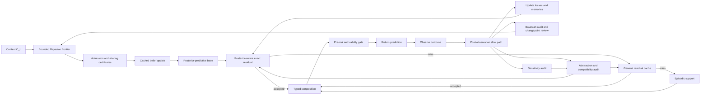

# EventFrame Whitepaper: A Mathematical Framework for Event-Centric Prediction

**Author:** Juan Hua Xu

**ORCID:** <https://orcid.org/0009-0008-7305-5690>

**Research profile:** <https://github.com/JuanHuaXu>

**License:** MIT License. Copyright (c) 2026 Juan Hua Xu.

_Public working paper. Initial implementation evidence is reported in Section 11; full real-world validation remains outstanding._

_GitHub rendering note: equations use native typesetting or semantic HTML with Unicode mathematical symbols and real sub/superscripts. This keeps the single-file edition within GitHub's per-page math-rendering budget. The PDF remains fully typeset._

## Abstract

EventFrame is a research framework for event-centric prediction using typed, task-relative compressed records, not a fundamental ontology. It combines a posterior-predictive base, separately typed point and forecast-law residuals, episodic retrieval, and bounded Bayesian updating. Every evidence-ready frontier member receives a cheap update; selective activation governs deeper review. Anti-Pigeon certificates control posterior sharing, while independently supported divergence can revoke it. Validity-constrained fuzzing and compatibility-based abstraction propose predictive refinements, not causal conclusions without identification assumptions. Proper scoring includes marked event times and the no-event outcome; a composite design objective also charges representation and resource costs. Rank correction remains separate from the scored forecast law.

Implementation evidence supports bounded mechanisms and retrospective retrieval improvement, not a validated general system. Corrected canonical-frame replay reduced Brier loss from 0.26117 to 0.24121 and increased Recall@10 from 0.36192 to 0.46087, but expected calibration error worsened from 0.14072 to 0.17976. The reserved block was development-exposed, not prospective independent replication. Synthetic replacements retained frontier-all quality and passed cumulative residual-harm and practical-equivalence criteria without erasing failures of the original selective-update, per-application harm, exact-sharing, and output-invariant snap propositions.

Observation-learning rescues support retaining validated incumbents, primarily mitigating overconfidence rather than establishing full recovery or unique Anti-Pigeon benefit. Broader native challengers still failed scientific gates after cost repair. Adaptive is the prospective research accuracy reference on the consumed cohort, with Full the faster control; this is descriptive selection, not independent confirmation or deployment approval. Numerical repairs and finite durable-freshness checks establish narrower components. Public ranking gains failed promotion, and recurrent discovery failed useful generalization. The tested mixed-load recall p99 remained 378.831 ms, so strict concurrent sub-100 ms latency is unvalidated.

All seven whole research directions remain open. Section 11 summarizes findings; Appendix B preserves detailed follow-up results and provenance. Complete marked-time/no-event validation, robust certificate coverage, controlled real-world utility, and causal transport remain outstanding.

## 1. Introduction

Prediction systems often operate over sequences whose internal structure is only implicit. A model may receive tokens, vectors, logs, traces, or state observations and learn statistical regularities among them. This can be effective, but it makes some questions difficult to ask directly: which compressed distinction mattered, what changed, when did it happen, where did it occur, why might it matter, and how did it transform the state of the world?

EventFrame begins from a compression premise: a modeled substrate may contain more detail than a prediction system can retain. Event frames are task-relative coarse-grained representations, not assertions about fundamental spacetime. For physical substrates, Planck scales and information bounds motivate a limiting thought experiment [7--9]; they do not prove the compression premise. Simulated and software substrates require independent task- and resource-based justification.

The framework represents experience as event frames selected for predictive and intervention relevance. An event frame is a typed record of an occurrence or transition after compression. It includes the 5W1H fields of who, what, when, where, why, and how, plus auxiliary state and confidence metadata. The goal is not to claim that every domain naturally exposes these fields perfectly. The goal is to create a disciplined representation in which uncertainty, missing fields, competing explanations, and compression choices can still be recorded explicitly.

The core contribution is adaptive event abstraction. At fixed resolution, an external-law population objective defines the constrained oracle benchmark; the operational rule selects from a finite family using certified empirical constraints, post-observation action, and representation cost. It distinguishes model-sensitivity evidence from causal intervention evidence.

At prediction time, EventFrame forecasts both what may happen and when it may happen, including the possibility that no relevant event occurs within the chosen horizon. Forecast probability is evaluated separately from operational usefulness: a system should not be able to purchase a convenient answer by becoming a worse probabilistic forecaster.

The framework separates three jobs that are often blurred together. Episodic retrieval finds prior cases. Bayesian belief memory summarizes accumulated outcome evidence. Residual memory stores reusable corrections to a baseline forecast. These components cooperate, but none is allowed to certify its own abstractions or silently convert predictive association into causal evidence.

Section 2 gives the complete lifecycle in ordinary language before introducing notation. Sections 3--9 then define the representation, mathematics, prediction rule, memory system, abstraction safeguards, and runtime model. The claims register follows those definitions, and the experimental section reports what the current implementation evidence supports, falsifies, or leaves unresolved.

The contributions of this paper are therefore:

1. A compressed event-frame ontology for prediction-oriented representation.
2. A governing optimization principle for adaptive event abstraction.
3. A residual prediction model with constrained composition and action-residual fast-path caching.
4. A bounded Bayesian update frontier with a frontier-all cheap-update reference policy, selective deep review, Anti-Pigeon posterior-sharing control, fail-closed shock revocation, a practical-equivalence split/share diagnostic with bounded borrowing, selection-aware semantics, bounded cumulative changepoint invalidation, and independent audit sampling.
5. A combined episodic, residual, and bounded belief-memory architecture.
6. A validity-constrained sensitivity method for conditional invariants, chain-wide predictive translation, and ontology review.
7. A lumpability-based approach to abstraction.
8. A bounded predictive sheaf-snapping rule for validated local compatibility-graph revision.
9. A fast-path and slow-path reference runtime model with reliability-gated elastic rank correction at the packing boundary.
10. Experiment designs for testing the framework's claims.

These are proposed as a research framework with initial synthetic and local runtime evidence, not as validated real-world results or a fixed implementation. Event-centric latent retrieval itself has prior art [10]. Streaming and sequential Bayesian methods provide prior work for incremental posterior approximation and changepoint monitoring [14--18], while Pattern Markov Chains and shift-aware sequential prediction provide narrower event-forecasting precedents [19,20]. D'Acunto, Di Lorenzo, and Barbarossa's *Networks of Causal Abstractions: A Sheaf-theoretic Framework* provides prior work on coordinating heterogeneous causal abstractions through network sheaves, restriction maps, connection Laplacians, global sections, and mixture causal models [13]. EventFrame's claimed contribution is the typed residual-error and evidence-controlled event-abstraction loop, including bounded frontier updates, optional selective activation, Anti-Pigeon posterior granularity, cache certificates, bounded predictive sheaf snapping, and priority- and hardware-aware staged integration. It does not claim to invent streaming Bayes, particle filtering, online changepoint detection, or event-pattern forecasting. The snapping term is EventFrame terminology for validated local predictive-structure revision, not a theorem or standard operation inherited from sheaf theory. The next section explains how these pieces work together without mathematics.

## 2. EventFrame in Plain Language

EventFrame is a memory and prediction layer for systems that must retrieve useful prior experience without treating an entire transcript as one undifferentiated block. It converts experience into compact internal records, uses those records to find a bounded set of relevant candidates, and hydrates full text only after ranking and packing are complete. The 5W1H representation is internal to EventFrame; an agent or chatbot can continue to send and receive ordinary text through its existing memory contract.

### What an event frame represents

An event frame is not necessarily one chat turn. It is one complete, task-relevant episodic segment at the chosen temporal resolution. A short exchange may yield one frame, several turns may combine into one frame, and one dense turn may contain several frames. Each frame records who participated, what happened, when and where it happened, why it may have happened, how it happened, and what uncertainty or provenance accompanies those fields.

The frame is a compressed representation rather than a claim about fundamental reality. EventFrame keeps distinctions that may matter for prediction, intervention, retrieval, or later review. Details that do not currently matter can be compressed, while uncertainty remains explicit rather than being promoted to fact.

### The normal prediction path

The fast path follows one bounded sequence:

1. Convert the current situation into one or more internal event frames.
2. Ask the vector store for a bounded candidate frontier, ordinarily tens or hundreds of frames rather than the whole corpus.
3. Expand that frontier with bounded graph neighbors, including prior and next explanatory or causal candidates that are available as of the query time.
4. Use current Anti-Pigeon certificates to assign shared or separate posterior keys before updating beliefs. Similar-looking events without a valid sharing certificate remain separate.
5. Apply the cheap update to every evidence-ready member of that frontier under its assigned key. Expensive analysis remains selective; mark exact repeated claim/lineage decisions for the separate selected-feedback veto.
6. Build a baseline forecast from the accepted beliefs, then apply only residual corrections whose provenance, age, horizon, confidence, and version checks still hold.
7. For memory retrieval, apply a bounded rank correction after external retrieval, then pack under repetition-occupancy and token budgets. Hydrate the selected records' full text only after this semantic work is finished.
8. Return the forecast or packed memory context immediately.

This ordering matters. The answer must survive retrieval into the candidate frontier before EventFrame can rerank it. A packer that truncates to ten items before a fifty-candidate reranker runs has already discarded forty candidates and cannot recover them.

After a successful low-certainty recall, an implementation may also place a bounded fuzz nomination on an incubation queue. Nomination reuses the already retrieved frontier and does not run perturbation analysis before the response. A background worker may later test the proposal while the serving path is idle; any resulting invariant or translation remains a review proposal rather than an automatic memory or ontology edit.

### Learning after the outcome

Learning happens after the relevant outcome becomes available. EventFrame records whether the forecast or retrieved memory was useful, updates the corresponding belief and residual confidence, and checks whether the current abstraction remains valid. It does not use future outcomes while making the earlier prediction.

Most updates are small and local. The slow path handles cases where evidence conflicts, uncertainty is high, a regime appears to have changed, or a shared abstraction may be hiding important differences. That path can audit omitted candidates, compare shared and split models, recalibrate probabilities, test perturbations, revise graph structure, or invalidate stale cache entries without blocking the current response.

### Anti-Pigeon and changing categories

Anti-Pigeon is short for resisting pigeonholing: the framework should not keep using a convenient historical category after the variables that made it useful have changed. Candidate retrieval proposes which events appear related. Bayesian comparison can suggest sharing, splitting, or uncertainty. Anti-Pigeon retains final authority over sharing because it tests whether members of a proposed group still have compatible downstream behavior under external evidence.

This supports both directions of revision. Events that repeatedly behave alike may share evidence and eventually join into one predictive group. Events that once looked alike may split after a changepoint or a revealing outcome. Event streams can therefore merge like tributaries or diverge when a small distinction becomes consequential.

Every group retains at least one concrete traceability frame and a broader audit set. The concrete frame makes the abstraction inspectable; the audit set tests whether the group is hiding divergent boundary cases. One representative alone is never treated as proof that the whole group is stable.

### Repetition is not corroboration

Repetition protection is separate from Anti-Pigeon. Ten recaptures of one assertion should not automatically fill ten memory slots or count as ten independent confirmations. The implemented gate limits similar same-lineage records inside the packet and rejects exact-group duplicates on the selected-feedback route, subject to the separate-bucket exemption defined in Section 6. It preserves stored records and ordinary frontier updates. It does not decide which assertion is true, authenticate a source, or prevent repetition across every future feedback request.

An optional authenticated-outcome mode adds a separate safeguard: an enrolled observer signs specific feedback, and a durable ledger lets that observation count once across requests and journals. This authenticates attribution and contents, not truth. A bounded working-belief filter can revise old certainty when newly admitted contrary outcomes arrive, affecting future scored forecasts. Untrusted chats remain readable memory, and Anti-Pigeon retains pooling authority. Section 6 defines the defaults and limits.

### Invariance and domain translation

Fuzzing one variable can reveal two different structures. If the variable changes upstream but the final result and prediction remain effectively unchanged, EventFrame treats that distinction as a candidate for a higher-order abstraction. If the corresponding variable changes at every aligned stage of another domain, while all unrelated variables remain fixed, EventFrame treats the pair as a predictive translation candidate. A temperature chain written in Celsius and the same chain written in kelvins is a simple declared-map example: the raw values differ, but the frozen conversion explains how they correspond.

Translation must hold through the chain, not only at its endpoint. If an intermediate stage changes an unrelated variable, endpoint agreement does not rescue the mapping. Anti-Pigeon keeps the chains separate until external evidence supports the proposed correspondence. The ordinary runtime calls this predictive chain translation. It uses the stronger causal label only when intervention evidence and a structural causal model justify it.

### Fast path and slow path

Observation attention is a separate proposed control layer, not neural attention or a synonym for retrieval relevance. The same frame can be examined as an immediate occurrence, part of an episode, or part of a longer process, and at different depths: description, explanation, conditional prediction, time/cost estimation, or planning. Section 13's Exploration X3 connects this distinction to the existing 5W1H fields and higher-order event structures, with conceptual motivation from [27]. It proposes choosing which question to investigate and which scope to inspect, rather than only repeating the same calculation. The temporal scope of an observation is not its processing latency; a validated long-horizon pattern may be cheap to apply. Section 11 preserves the initial synthetic allocation failure after a regime change and the second pilot's harmful stationary replacement. Later fixtures improved adaptation by retaining the incumbent and adding bounded challengers. Faster Anti-Pigeon review still did not establish a better replacement forecast, and broader candidate models failed strong quality controls even after becoming faster. Thus evidence-guided investigation, sharing authority, learning, and runtime efficiency remain separate obligations. The full controller remains unvalidated.

The fast path is designed for bounded local work: retrieve a capped frontier, update cached sufficient statistics, reuse valid corrections, rerank a bounded packet, optionally enqueue a bounded audit nomination, and respond. The slow path performs particle methods, broad model comparison, fuzz and abstraction audits, changepoint review, compatibility analysis, and recalibration asynchronously or under explicit resource budgets.

Future hardware may permit more slow-path stages to run more often, but it does not change their meaning or remove their evidence requirements. A faster machine cannot turn model sensitivity into causality, make a stale residual valid, or allow a proposed group to certify itself.

### A compact example

Suppose an agent must recall how a deployment failure was fixed. The vector store returns fifty compressed event frames. The correct repair is initially ranked outside the ten-item packet. EventFrame sees that the top ten have weak boundary certainty, finds that the lower-ranked repair matches the current mechanism and graph neighborhood, and applies a bounded positive rank correction. The repair enters the packed context, and only then is its full transcript text loaded for the agent.

Later, explicit feedback says whether that repair was useful. Repeated useful outcomes strengthen the local belief and correction. Strong contradictory evidence can rapidly revoke a previously shared group, demote stale confident knowledge, and preserve separate posteriors until new evidence justifies another merge.

The remainder of the paper turns this lifecycle into typed objects, measurable claims, and falsifiable experiments.

## 3. Event Representation and Ontology

EventFrame uses event frames as predictive units, not as fundamental ontology. The underlying substrate is assumed to contain more detail than the predictor can retain. That substrate may be physical, simulated, biological, robotic, or software-based. EventFrame treats a frame as a task-relative compressed representation. For physical substrates, Planck scales and physical information bounds motivate a limiting thought experiment about microscopic description; they do not prove a discrete substrate, a Planck-scale sampling lattice, or the EventFrame sparsity hypothesis. Simulated and software substrates require independent task- and resource-based compression arguments.

An event is therefore a structured representation of a change, occurrence, action, observation, or state transition after coarse-graining. An event frame records that compressed event in fields that can be compared, predicted, fuzzed, cached, and abstracted.

An event frame at index t is written:

<div align="center"><i>e</i><sub>t</sub> = (<i>w</i><sub>t</sub>, <i>a</i><sub>t</sub>, τ<sub>t</sub>, ℓ<sub>t</sub>, <i>m</i><sub>t</sub>, <i>h</i><sub>t</sub>, <i>x</i><sub>t</sub>, <i>c</i><sub>t</sub>).</div>

where w<sub>t</sub> denotes participating agents or entities, a<sub>t</sub> denotes the action or occurrence type, τ<sub>t</sub> denotes the time index or interval, ℓ<sub>t</sub> denotes location or spatial context, m<sub>t</sub> denotes motive, objective, causal explanation, or inferred driver, h<sub>t</sub> denotes mechanism or process, x<sub>t</sub> denotes auxiliary state, and c<sub>t</sub> denotes confidence, provenance, or uncertainty metadata. When τ<sub>t</sub> is an interval, the complete interval remains part of the frame; scalar timing formulas use a separately declared temporal anchor, defaulting to interval onset.

The conceptual role of this ontology is compression. It prevents prediction from treating history as a single undifferentiated sequence, but it also prevents prediction from pretending that every microscopic distinction deserves its own event identity. The fields ask different compressed questions. The "what" field identifies an occurrence type. The "when" field supports temporal prediction loss. The "who" and "where" fields localize the event. The "why" and "how" fields record explanatory hypotheses and mechanisms. The auxiliary state field allows symbolic, vector, graph, or latent variables to travel with the event. The confidence field prevents uncertain extraction from pretending to be certain observation.

Let Ω denote a fine-grained substrate state space and let ω<sub>A<sub>t</sub></sub> denote the substrate history over a finite region A<sub>t</sub>. The adjective fine-grained describes retained detail and imposes no topology on Ω. A coarse-graining map at temporal resolution Δ<sub>τ</sub>:

```math
\Gamma_{\Delta_\tau}: \Omega^{A_t} \rightarrow \mathcal{E}_{\Delta_\tau}
```

produces an event frame:

<div align="center"><i>e</i><sub>t</sub> = Γ<sub>Δ<sub>τ</sub></sub>(ω<sub><i>A</i><sub>t</sub></sub>).</div>

This equation states the ontology clearly: the event frame is a lossy, task-oriented compression. The compression is useful only if it preserves distinctions that matter for prediction, intervention, memory, or review.

The temporal resolution Δ<sub>τ</sub> controls how precise the "when" field is. A model may choose second-level frames, microsecond-level frames, or another declared scale. Finer resolution can instantiate more candidate frames, but it does not imply that every candidate frame is predictively effective, causally effective, or worth retaining forever. Predictive and causal sparsity are measured separately over a finite declared candidate set; neither is inferred from the size of the substrate.

Mathematically, the event space is treated as a typed product:

```math
\mathcal{E} =
\mathcal{W} \times \mathcal{A} \times \mathcal{T} \times
\mathcal{L} \times \mathcal{M} \times \mathcal{H} \times
\mathcal{X} \times \mathcal{C}.
```

This equation is operational, not decorative. It says that before a field can be used in prediction, caching, fuzzing, or abstraction, the field must have a representation and a comparison rule. For example, 𝒯 may contain timestamps or intervals; ℒ may contain coordinates, graph nodes, or symbolic regions; 𝒞 may contain confidence scores and source provenance. EventFrame does not require one universal encoding for all domains, but it requires the encoding to be declared.

An event state is the system state before, during, or after an event. In some domains, x<sub>t</sub> may include an explicit pre-state and post-state. In others, x<sub>t</sub> may be a latent state vector inferred from observations. A transition occurs when one event context gives rise to a later event frame. The basic trajectory is:

<div align="center"><i>E</i><sub>1:<i>T</i></sub> = (<i>e</i><sub>1</sub>, <i>e</i><sub>2</sub>, …, <i>e</i><sub><i>T</i></sub>).</div>

Operationally, a prediction step extracts a context from this trajectory:

<div align="center"><i>C</i><sub>t</sub> = <i>e</i><sub><i>t</i>−<i>k</i>+1:<i>t</i></sub>.</div>

The context C<sub>t</sub> is the recent event history available to the predictor. It gives the predictor local structure for forecasting the next event and its time. If the context is too short, important predictive or temporal dependencies may be missing. Causal dependence is a stronger claim and requires an explicit causal model or identified intervention evidence. The context length k is a modeling choice that should be evaluated experimentally.

The ontology also supports typed links. Temporal links order events, spatial links relate locations, and predictive-dependency links record forecast-relevant association. Causal links are reserved for relations supported by a declared structural causal model or an identified intervention. These link types must remain distinct in storage and evaluation.

Event histories are therefore not limited to linear chains. Multiple event streams can become representable as a single aggregate event over time. This is event confluence: separate streams merge into a larger stream or macro-event when their separate identities no longer affect the target beyond a declared threshold. The reverse can also occur. A small distinction can branch into multiple downstream event streams when a perturbation is amplified by the dynamics. This is event divergence, or butterfly-effect-style sensitivity. EventFrame must model both patterns because compression that is safe in a confluence region may be unsafe near a divergence point.

For traceability, EventFrame keeps at least one concrete frame for every event-frame group. One frame cannot characterize a heterogeneous group, so abstraction audits use a coverage-aware set containing boundary, uncertain, and sampled examples. Section 4 formalizes that audit set; Section 8 states the conditions under which conclusions drawn from it are valid.

The event sparsity hypothesis follows from this compression view. Relative to a finite declared candidate set, EventFrame hypothesizes that only a small fraction of distinctions materially worsen held-out proper risk when ablated. This predictive ratio is observationally testable under the fixed ablation protocol. A separate causal ratio requires randomized or otherwise identified interventions. Both must be measured in each domain rather than inferred from Planck constants or entropy bounds.

The main limitation of the ontology is extraction and compression quality. In real data, the "why" and "how" fields may be ambiguous, inferred, or unavailable. More fundamentally, the chosen coarse-graining Γ<sub>Δ<sub>τ</sub></sub> may discard distinctions that later turn out to matter. EventFrame handles this by allowing missing values, confidence metadata, and revision under slow-path review rather than requiring false precision. A conservative implementation should distinguish observed fields from inferred fields and should propagate uncertainty into prediction and review. The next section defines the mathematical framework built on this compressed ontology.

## 4. Mathematical Foundations

The mathematical framework turns compressed event frames into objects that can be predicted, evaluated, cached, and abstracted. Given a context C<sub>t</sub>, the predictor must produce a next-event distribution before the next observation exists. Only after the observation arrives may the runtime compute realized prediction loss and update memory or abstraction.

Let Ω denote a fine-grained substrate state space; fine-grained refers to retained detail and imposes no topology on Ω. For a finite region A<sub>t</sub>, let ω<sub>A<sub>t</sub></sub> ∈ Ω<sup>A<sub>t</sub></sup> denote the substrate history over that region. At temporal resolution Δ<sub>τ</sub>, an event frame is produced by:

```math
e_t = \Gamma_{\Delta_\tau}(\omega_{A_t}), \qquad
\Gamma_{\Delta_\tau}: \Omega^{A_t} \rightarrow \mathcal{E}_{\Delta_\tau}.
```

The coarse-graining Γ<sub>Δ<sub>τ</sub></sub> is task-relative and lossy. It selects distinctions available to prediction, memory, and review; it does not establish a fundamental discretization of spacetime. For a physical substrate, CODATA Planck scales and physical information bounds motivate a limiting thought experiment about microscopic description [7--9]. They do not imply a Planck-scale sampling lattice or prove EventFrame sparsity. Simulated and software substrates require an independent task- and resource-based compression argument; the physical citations do not support that case.

A trajectory at fixed resolution is:

```math
E_{1:T}=(e_1,\ldots,e_T), \qquad e_t\in\mathcal E_{\Delta_\tau},
```

and a time quantizer is:

<div align="center"><i>Q</i><sub>Δ<sub>τ</sub></sub>: ℝ → 𝒯<sub>Δ<sub>τ</sub></sub>.</div>

Second-level or microsecond-level precision is permitted only when the measurement process supports it. Finer resolution creates more candidate frames and can expose boundaries, but also increases noise and cache pressure.

For a context length k, define:

<div align="center"><i>C</i><sub>t</sub> = <i>e</i><sub><i>t</i>−<i>k</i>+1:<i>t</i></sub> ∈ ℰ<sup><i>k</i></sup>.</div>

Let ∅≠ℭ<sub>adm</sub>⊆ℰ<sup>k</sup> be the declared admissible context domain on which the chosen version of each conditional forecast law is defined. Population suprema below range over this domain or over the support of a named evaluation law, not over arbitrary zero-probability contexts.

Let a(x) be the time at which observation, label, cache record, or derived object x becomes available to the runtime. Let ℱ<sub>t</sub><sup>pred</sup> be the information available when the prediction at index t is issued, including C<sub>t</sub> but excluding Z<sub>t+1</sub>. Mutable runtime state is the left-limit snapshot S<sub>t<sup>−</sup></sub>, constructed only from objects with a(x)≤ t. Every prediction, priority, cache lookup, abstraction decision, and pre-risk value used at time t must be measurable with respect to ℱ<sub>t</sub><sup>pred</sup>. For a no-event outcome, a(Z<sub>t+1</sub>) is no earlier than expiration of horizon H; delayed labels use their actual later availability time.

Let ν(e) be the event mark or occurrence type. Let τ(e)∈ℝ be a declared scalar temporal anchor: it is the timestamp for a point event and, by default, the onset for an interval event. A domain may choose another measurable anchor, such as midpoint, but must freeze that convention before fitting and use it consistently in labeling, caching, and evaluation; the complete interval remains available in the event frame. Over a prediction horizon H&gt;0, the next outcome is:

```math
Z_{t+1}=
\begin{cases}
(\nu(e_{t+1}),\tau(e_{t+1})-\tau(e_t)), & \text{if an event occurs within }H,\\
\varnothing, & \text{otherwise.}
\end{cases}
```

Let (𝒩,𝒜<sub>𝒩</sub>) be the measurable mark space and let ((0,H],ℬ<sub>H</sub>) carry the Borel sigma-algebra in the declared time units. Define the marked branch and complete outcome space as the measurable disjoint union

```math
(\mathcal Z_H^+,\mathscr A_H^+)
=(\mathcal N\times(0,H],\mathscr A_{\mathcal N}\otimes\mathscr B_H),
\qquad
(\mathcal Z_H,\mathscr A_H)
=(\mathcal Z_H^+\sqcup\{\varnothing\},
\mathscr A_H^+\oplus2^{\{\varnothing\}}).
```

A probabilistic predictor returns a distribution rather than only a point:

<div align="center">𝖰<sub>θ</sub>(· | <i>C</i><sub>t</sub>) ∈ 𝒫(𝒵<sub><i>H</i></sub>).</div>

where 𝒫(𝒵<sub>H</sub>) denotes probability measures on (𝒵<sub>H</sub>,𝒜<sub>H</sub>), equipped with the evaluation sigma-algebra generated by Q↦ Q(A) for A∈𝒜<sub>H</sub>. This is a finite-horizon marked-event representation with a right-censoring atom; standard marked point-process constructions provide a broader continuous-time setting [11]. Let ℰ<sub>∅</sub>=ℰ⊔{∅} be the tagged extension of the structured event space. A fixed measurable decision rule

<div align="center"><i>d</i><sub><i>H</i></sub>: 𝒫(𝒵<sub><i>H</i></sub>) → 𝒵<sub><i>H</i></sub>.</div>

returns the no-event decision or a marked time, with a declared loss and deterministic tie-break. Let ê<sub>θ</sub><sup>H</sup>(C<sub>t</sub>)∈ℰ<sub>∅</sub> be a structured summary coherent with that decision: it equals ∅ exactly when d<sub>H</sub>(𝖰<sub>θ</sub>(·| C<sub>t</sub>))=∅, and otherwise its mark and time agree with the marked decision. The typed predictor output is the bundle:

```math
\mathcal O_\theta(C_t)=
\left(\mathsf Q_\theta(\cdot\mid C_t),\hat e_\theta^H(C_t)\right)
\in\mathcal P(\mathcal Z_H)\times\mathcal E_\varnothing.
```

The primary probabilistic-fidelity objective is a declared strictly proper scoring rule applied to the probability-law component. It is distinct from the composite system-design objective below:

```math
\mathcal L_{\mathrm{pred}}(\theta;t)
=S_{\mathrm{prop}}\!\left(\mathsf Q_\theta(\cdot\mid C_t),Z_{t+1}\right).
```

Fix a dominating reference measure μ<sub>H</sub> on the marked-time branch, including declared units for time, and let q<sub>θ</sub>=d𝖰<sub>θ</sub><sup>event</sup>/dμ<sub>H</sub> be the event subdensity. Its integral equals 1−𝖰<sub>θ</sub>({∅}| C<sub>t</sub>). Relative to this fixed reference measure, the logarithmic score is one implementation:

```math
\mathcal L_{\log}(\theta;t)=
\begin{cases}
-\log q_\theta(\nu_{t+1},\Delta t_{t+1}\mid C_t), & Z_{t+1}\neq\varnothing,\\
-\log \mathsf Q_\theta(\{\varnothing\}\mid C_t), & Z_{t+1}=\varnothing.
\end{cases}
```

If dμ<sub>H</sub>&#39;=h dμ<sub>H</sub>, then the marked-branch logarithmic loss changes by the forecast-independent but generally outcome-dependent term log h(Z). A pure unit rescaling makes this term constant. Such an integrable outcome-only term preserves propriety and pairwise forecast differences on the same observation, but the reference measure and units must remain fixed when absolute scores or results across datasets are reported. This score covers event identity, timing, uncertainty, and right-censoring; calibration remains an empirical property to test. Proper scoring rules prevent a predictor from improving its expected score by reporting a distribution other than the one it believes [6].

For human-readable diagnostics, let Ẑ<sub>t+1</sub>=d<sub>H</sub>(𝖰<sub>θ</sub>(·| C<sub>t</sub>)). A bounded event-aware timing diagnostic is:

```math
\mathcal L_{\mathrm{event}}^H(\hat Z,Z)=
\begin{cases}
0, & \hat Z=Z=\varnothing,\\
1, & \text{exactly one is }\varnothing\text{ or their marks differ},\\
\min\!\left(1,\dfrac{|\widehat{\Delta t}-\Delta t|}{H}\right),
& \text{their non-null marks agree.}
\end{cases}
```

Unlike the original timing-only diagnostic, this expression cannot assign zero loss to the wrong event type merely because its timestamp is correct. It remains a diagnostic; model fitting and forecast comparison should use ℒ<sub>pred</sub>.

For any other field, use a distinct projection ψ<sub>i</sub>:ℰ→𝒳<sub>i</sub> and declared distance. Bind the coherent structured prediction by ê<sub>θ,t+1</sub><sup>H</sup>:=ê<sub>θ</sub><sup>H</sup>(C<sub>t</sub>). The ordinary field loss is defined only when both the decision and observation are marked events:

```math
\mathcal L_i(\hat e_{\theta,t+1}^H,Z_{t+1})
=d_i(\psi_i(\hat e_{\theta,t+1}^H),\psi_i(e_{t+1})),
\qquad
\hat e_{\theta,t+1}^H\in\mathcal E,
\quad Z_{t+1}\neq\varnothing.
```

When either argument is ∅, this field loss is not evaluated unless a separate missing-aware loss on ℰ<sub>∅</sub> has been declared. The proper score and event diagnostic still evaluate the no-event decision.

EventFrame uses separate pre-observation and post-observation quantities. For a candidate output bundle 𝒪̃=(𝖰̃,ẽ<sup>H</sup>), a pre-observation admissibility risk may use only information available at prediction time:

```math
\mathcal R_{\mathrm{pre}}(\widetilde{\mathcal O}\mid C_t)
=\lambda_a^{\mathrm{pre}}D_{\mathrm{abs}}^{\mathrm{pre}}(\widetilde{\mathcal O},C_t)
+\lambda_c^{\mathrm{pre}}D_{\mathrm{edge}}^{\mathrm{pre}}(\widetilde{\mathcal O},C_t)
+\lambda_u^{\mathrm{pre}}U^{\mathrm{pre}}(\widetilde{\mathcal O}\mid C_t).
```

The three components lie in [0,1], the weights are non-negative, and λ<sub>a</sub><sup>pre</sup>+λ<sub>c</sub><sup>pre</sup>+λ<sub>u</sub><sup>pre</sup>=1.

The proper loss need not be bounded; the logarithmic score above equals +∞ when the realized outcome receives zero density or mass. To combine an extended-real score with bounded system diagnostics, choose and preregister a measurable non-decreasing map g<sub>pred</sub>:ℝ̄→[0,1] on the score's entire attainable extended-real range, including explicit endpoint values. For a non-negative log loss, one admissible example is

```math
g_{\mathrm{pred}}(\ell)=1-\exp(-\ell/\kappa),
\quad \ell\in[0,\infty),
\qquad
g_{\mathrm{pred}}(+\infty)=1,
\quad \kappa>0.
```

For a score with negative attainable values, the evaluation contract instead supplies a total monotone transform on that stated range, including −∞ if attainable. Define:

```math
\overline{\mathcal L}_{\mathrm{pred}}(\widetilde{\mathsf Q},Z)
=g_{\mathrm{pred}}\!\left(S_{\mathrm{prop}}(\widetilde{\mathsf Q},Z)\right).
```

Constant or order-reversing transforms are inadmissible. Unless g<sub>pred</sub> is a positive affine transformation on the score's range, ℒ̄<sub>pred</sub> is not asserted to remain proper. Model fitting and forecast comparison continue to report the untransformed proper score. After Z<sub>t+1</sub> is observed, the bounded realized event action is:

```math
\begin{aligned}
\mathcal A_{\mathrm{post}}(\widetilde{\mathcal O},Z_{t+1})
={}&\lambda_p^{\mathrm{post}}\overline{\mathcal L}_{\mathrm{pred}}(\widetilde{\mathsf Q},Z_{t+1})
+\lambda_a^{\mathrm{post}}D_{\mathrm{abs}}^{\mathrm{post}}(\widetilde{\mathcal O},Z_{t+1})\\
&+\lambda_c^{\mathrm{post}}D_{\mathrm{edge}}^{\mathrm{post}}(\widetilde{\mathcal O},Z_{t+1})
+\lambda_u^{\mathrm{post}}U^{\mathrm{post}}(\widetilde{\mathcal O},Z_{t+1}).
\end{aligned}
```

Every post-observation component lies in [0,1], the four post weights are non-negative and sum to one, and therefore 𝒜<sub>post</sub>∈[0,1].

The evaluation contract supplies the complete measurable definitions of D<sub>abs</sub><sup>pre</sup>, D<sub>edge</sub><sup>pre</sup>, U<sup>pre</sup>, their post-observation counterparts, and every target, normalization, missing-value rule, threshold, and weight they use. Alternatively it may supply finite admissible classes plus a design-sample fitting and deterministic tie-breaking procedure. Packet-target construction, packet component loss, priority-model class and fitting rule, and regime-shift detection window, repetition rule, threshold, and resulting action are frozen under the same requirement. None may be selected or retuned from confirmation outcomes or separately for the candidate it scores. A learned component is fitted using only the designated design history, charged to representation or fitting cost when appropriate, and frozen before confirmation.

The fast path may gate a correction using ℛ<sub>pre</sub>; it may never use 𝒜<sub>post</sub> before the observation exists.

The governing principle can now be stated without overloading Ω. It is evaluated at a fixed resolution Γ<sub>Δ<sub>τ</sub></sub>; comparisons across resolutions are a separate outer experiment on common raw histories. Group the event-residual implementation contract as:

```math
\Xi_R=(q_E,d_E,\Pi_E,\delta_E,\delta_Q,\mathcal M_R,\rho_H^Q,\mathfrak K_H^Q,d_H,\mathrm{lift}_H,
\alpha,\kappa,\epsilon_R,\text{cache gates}),
```

and the candidate abstraction structure as Ξ<sub>A</sub><sup>(v)</sup>, containing a versioned compatibility graph, its assigned comparison spaces and maps, and the declared edge divergences and weights. The version v changes only when a validated slow-path revision is published.

When repetition protection is enabled, the Section 6 descriptor, packing-occupancy, exemption, and selected-feedback rules are also frozen under Ξ<sub>B</sub> and Λ<sub>eval</sub>. The packet rule changes retrieval output only; the feedback rule can change subsequent learned state and therefore future scored laws. Its full admission semantics cannot be replaced by a claim of source independence from lexical similarity or a hash.

The bounded Bayesian contract Ξ<sub>B</sub> contains the vector, sheaf-inspired, and as-of graph frontier rules; the frontier cap; the frozen frontier-all or selective policy; nomination, evidence-readiness, activation, and criticality maps; one coherent joint evidence-and-outcome kernel, its dominating evidence measure, and the exact marginal identities inducing the ordinary likelihood and posterior-predictive kernel; the complete admission model, positive support floor, and simultaneous lower-bound procedure; mixture weights and template map; Anti-Pigeon sharing certificate; source-dependence treatment; member-level sufficient statistics, split prior, practical-equivalence width, minimum support, split and equivalence thresholds, borrowing cap, and group-size cap for the proposal-only group comparator; pooled-evidence discount, revision-valid evidence classes, shock/changepoint action table, and reset targets; run-length approximation, warm-up, cumulative-detector slack and boundary, and cooldown for changepoint monitoring; independent audit schedule; normalized Jensen--Shannon omitted-influence procedure; component-sensitive law and template motion certificates including propagated approximation error; resource caps; coupled-state publication and invalidation budgets; and atomic publication rule. Separately modeled likelihood and forecast components remain modular forecasts and are not made posterior predictive by validation alone. Its as-of posterior cache is 𝒞<sub>B,t<sup>−</sup></sub>. Outgoing graph relationships may nominate candidates but cannot supply evidence about outcomes that have not yet become available. Separately freeze an evaluation contract:

```math
\begin{aligned}
\Lambda_{\mathrm{eval}}=
({}&P_{\mathrm{obj}},P_{\mathrm{conf}},
\mathcal S_{\mathrm{obj}},\mathcal S_{\mathrm{conf}},P_\star,
\mathfrak C_{\mathrm{adm}},d_C,
\text{targets, divergences, thresholds},\\
&\text{complete diagnostics or finite admissible classes},
\text{fitting and tie-break rules},\\
&g_{\mathrm{pred}},\text{score weights},p^{\mathrm{pri}},w_{\mathrm{pri}},
\lambda_{\mathrm{rep}},\mathcal C_{\mathrm{rep}},\\
&\text{packet target and loss},\text{regime-shift rule},
\text{confidence and map-validity procedures},\\
&\text{snap candidate, obligation, and publication rules},\\
&\text{Bayesian model coherence, prediction, selection, and omission rules},\\
&\text{Bayesian motion, cap, and publication rules}).
\end{aligned}
```

Let 𝔥<sub>t</sub>∈ℌ<sub>t</sub> denote the complete observable history available at prediction origin t, including timestamps and object-availability metadata but excluding Z<sub>t+1</sub>. The context extractor is c<sub>k</sub>(𝔥<sub>t</sub>)=C<sub>t</sub>. For each complete design Θ, a measurable deterministic as-of replay operator reconstructs its candidate-specific mutable state:

```math
S_{\Theta,t^-}=\mathrm{Replay}_\Theta(\mathfrak h_t).
```

Here P<sub>obj</sub> and P<sub>conf</sub> are fixed design- and confirmation-generating laws on prediction instances (𝔥<sub>t</sub>,Z<sub>t+1</sub>). Their realized, chronologically separated samples or trajectory blocks are 𝒮<sub>obj</sub>∼ P<sub>obj</sub> and 𝒮<sub>conf</sub>∼ P<sub>conf</sub>; independence is not assumed unless the sampling design supplies it. Replaying each candidate on the same raw history permits its caches, posteriors, epochs, changepoint states, confidence, and prior updates to differ without treating state as an unintegrated free variable. The external target conditional law is P<sub>⋆</sub>(Y| C). This contract is fixed independently of the candidates being compared; a candidate cannot shrink the history or context domain, relax its thresholds, choose its own weights, redefine the target, or validate its own comparison maps. Require λ<sub>rep</sub>≥0 and 𝒞<sub>rep</sub>≥0. At the fixed resolution, let:

```math
\Theta_\Gamma=(\mathsf Q_\theta,B,\pi,
\mathcal C_A,\mathcal C_R,\mathcal C_E,\mathcal C_B,
\Xi_R,\Xi_B,\Xi_A^{(v)})
```

denote the complete event-prediction design evaluated under Λ<sub>eval</sub>. For each prediction origin, Section 6 produces the effective posterior family; Section 5 maps it to (𝖰<sub>t</sub><sup>0</sup>,b<sub>t</sub><sup>0</sup>), applies only a posterior-compatible residual, and returns 𝒪<sub>t</sub><sup>R</sup>=(𝖰<sub>t</sub><sup>R</sup>,ê<sub>t</sub><sup>H</sup>). Define the scored candidate output explicitly by

```math
\mathcal O_{\Theta_\Gamma}(C_t;S_{\Theta_\Gamma,t^-})=\mathcal O_t^R,
\qquad
\mathsf Q_{\Theta_\Gamma}(\cdot\mid C_t;S_{\Theta_\Gamma,t^-})=\mathsf Q_t^R(\cdot\mid C_t).
```

Thus deleting or changing the Bayesian layer changes the scored law whenever it changes the posterior-predictive base; the residual kernel is calibrated against and applied after that base law. Let 𝔎<sub>π</sub> be the buckets induced by π, and let 𝔎<sub>π</sub><sup>+</sup>={K∈𝔎<sub>π</sub>:ℭ<sub>K</sub>≠∅} be the active buckets with admissible contexts. For an active bucket K, define its external future-diameter D<sub>K</sub><sup>⋆</sup>(π) as in Section 8 under the fixed target law, divergence, and context domain. Runtime-packet contracts are evaluated by their separate packet loss and are added to Θ<sub>Γ</sub> only in an implementation that jointly optimizes packet selection.

Compression must be operational, not merely decorative. Define retained information by

```math
h_\pi(C)=\bigl(\pi^{(k)}(C),s_\pi(C)\bigr),
```

where s<sub>π</sub> is declared side information. There must exist measurable maps 𝖰̃<sub>θ</sub>,B̃,α̃,κ̃ such that 𝖰<sub>θ</sub>=𝖰̃<sub>θ</sub>∘ h<sub>π</sub>, B=B̃∘ h<sub>π</sub>, α=α̃∘ h<sub>π</sub>, and κ=κ̃∘ h<sub>π</sub>. The storage and acquisition cost of s<sub>π</sub> is charged to 𝒞<sub>rep</sub>. Without this factorization, π may remain an interpretive annotation, but the system must not claim operational compression through π.

Let p<sup>pri</sup>(C;S<sub>Θ,t<sup>−</sup></sub>)∈[0,1] be priority assigned from information available at prediction time and let w<sub>pri</sub>(p)&gt;0 be a declared importance function with finite, positive mean. The priority model, its preprocessing, and the weight function are fitted only on data available before the evaluated block and are frozen independently of the candidates. The unweighted objective is recovered by setting w<sub>pri</sub>≡1. For D∈{P<sub>obj</sub>,P<sub>conf</sub>}, define trajectory-instance risk:

```math
\mathcal R_{\mathrm{pri}}^{D}(\Theta_\Gamma)=
\frac{
\mathbb E_{(\mathfrak h_t,Z)\sim D}
\left[w_{\mathrm{pri}}(p^{\mathrm{pri}}(c_k(\mathfrak h_t);S_{\Theta_\Gamma,t^-}))
\mathcal A_{\mathrm{post}}(\mathcal O_{\Theta_\Gamma}(c_k(\mathfrak h_t);S_{\Theta_\Gamma,t^-}),Z)\right]}
{\mathbb E_{\mathfrak h_t\sim D}
\left[w_{\mathrm{pri}}(p^{\mathrm{pri}}(c_k(\mathfrak h_t);S_{\Theta_\Gamma,t^-}))\right]}.
```

Let S<sub>prop</sub> be a predeclared strictly proper scoring rule on the predictive-law component, and define the unweighted proper risk

```math
\mathcal R_{\mathrm{prop}}^{D}(\Theta_\Gamma)
=\mathbb E_{(\mathfrak h_t,Z)\sim D}
\left[S_{\mathrm{prop}}(\mathsf Q_{\Theta_\Gamma}(\cdot\mid c_k(\mathfrak h_t);S_{\Theta_\Gamma,t^-}),Z)\right].
```

All displayed population expectations must be finite. A candidate with infinite empirical proper loss is assigned an infinite proper-risk guard statistic and is not certifiable; numerical probability flooring is permitted only if it is part of the frozen forecast family and its effect on propriety is stated. The proper risk prevents improvements in a bounded composite score from being purchased by a worse probabilistic forecast.

The population target law defines an oracle benchmark, not an implementable selector. Define the oracle feasible family:

```math
\mathfrak F_{AP}^{\Gamma,\star}=
\lbrace\Theta_\Gamma:
\begin{array}{l}
D_K^\star(\pi)\le\epsilon_{AP}
\text{ for every }K\in\mathfrak K_\pi^+,\\
\text{the operational factorization through }h_\pi\text{ holds},\\
\mathcal R_{\mathrm{prop}}^{P_{\mathrm{obj}}}(\Theta_\Gamma)
\le \mathcal R_{\mathrm{prop}}^{P_{\mathrm{obj}}}(\Theta_{\Gamma,0})
+\epsilon_{\mathrm{prop}}
\end{array}
\rbrace.
```

Here Θ<sub>Γ,0</sub> is a frozen reference predictor and ε<sub>prop</sub>≥0 is declared in advance. The oracle governing value is:

```math
\boxed{
\mathcal J_\Gamma^{\mathrm{oracle}}=
\inf_{\Theta_\Gamma\in\mathfrak F_{AP}^{\Gamma,\star}}
\left[\mathcal R_{\mathrm{pri}}^{P_{\mathrm{obj}}}(\Theta_\Gamma)
+\lambda_{\mathrm{rep}}\mathcal C_{\mathrm{rep}}(\Theta_\Gamma)\right]
}.
```

This value states the desired population property. When P<sub>⋆</sub> is unknown it is not directly computable, and no finite-sample algorithm may claim membership in 𝔉<sub>AP</sub><sup>Γ,⋆</sup> merely from a small point estimate. If the oracle feasible set is non-empty and its infimum is attained, an oracle optimizer satisfies:

```math
\Theta_\Gamma^{\mathrm{oracle}}\in
\arg\min_{\Theta_\Gamma\in\mathfrak F_{AP}^{\Gamma,\star}}
\left[\mathcal R_{\mathrm{pri}}^{P_{\mathrm{obj}}}(\Theta_\Gamma)
+\lambda_{\mathrm{rep}}\mathcal C_{\mathrm{rep}}(\Theta_\Gamma)\right].
```

Operational selection instead begins with a finite, predeclared candidate family 𝔊<sub>Γ</sub>(𝒮<sub>obj</sub>), constructed using design data only. A candidate is certifiable only when every active bucket has either exhaustive audit coverage or the verified continuity certificate from Section 8. Let ℛ̂<sub>prop</sub><sup>𝒮<sub>obj</sub></sup> and ℛ̂<sub>pri</sub><sup>𝒮<sub>obj</sub></sup> be the corresponding grouped, as-of empirical risks, and define:

```math
\widehat{\mathfrak F}_{AP}^{\Gamma}=
\left\{\Theta_\Gamma\in\mathfrak G_\Gamma(\mathcal S_{\mathrm{obj}}):
\begin{array}{l}
D_K^{\mathrm{cert},\star}(\pi)\le\epsilon_{AP}
\text{ for every }K\in\mathfrak K_\pi^+,\\
\text{the operational factorization through }h_\pi\text{ holds},\\
\mathrm{UCB}\!\left[
\widehat{\mathcal R}_{\mathrm{prop}}^{\mathcal S_{\mathrm{obj}}}(\Theta_\Gamma)
-\widehat{\mathcal R}_{\mathrm{prop}}^{\mathcal S_{\mathrm{obj}}}(\Theta_{\Gamma,0})
\right]\le\epsilon_{\mathrm{prop}}
\end{array}
\right\}.
```

If 𝔉̂<sub>AP</sub><sup>Γ</sup>≠∅, the implementable design rule is the finite minimum

```math
\widehat\Theta_\Gamma\in
\arg\min_{\Theta_\Gamma\in\widehat{\mathfrak F}_{AP}^{\Gamma}}
\left[
\widehat{\mathcal R}_{\mathrm{pri}}^{\mathcal S_{\mathrm{obj}}}(\Theta_\Gamma)
+\lambda_{\mathrm{rep}}\mathcal C_{\mathrm{rep}}(\Theta_\Gamma)
\right],
```

with a declared deterministic tie-break. If the certified family is empty, the procedure returns no admissible design or a separately declared conservative fallback; it does not relax the thresholds. The confidence guarantees apply to the stated finite-sample constraints, not to attainment of the oracle infimum.

Selection and tuning use only 𝒮<sub>obj</sub>. After the candidate, preprocessing, thresholds, priority rule, and analysis are frozen, final claims are evaluated once on untouched 𝒮<sub>conf</sub>. Both samples use rolling-origin or forward-chaining construction under their named generating laws, grouped by independent trajectory or entity where applicable, with an embargo long enough to cover context overlap, forecast horizon, and label delay. Weighted results are accompanied by unweighted and priority-stratified results. Oracle feasibility does not guarantee empirical certifiability, and empirical certifiability does not prove unrestricted population feasibility beyond the certificate's assumptions and coverage. Cross-resolution comparisons use the same raw histories and fixed target law; a candidate resolution may not redefine the outcome it is judged against.

An event history may be represented by a time-unrolled directed graph:

```math
G_t=(V_t,R_t),
```

where V<sub>t</sub>⊂ℰ and edges in R<sub>t</sub> are typed as temporal, predictive-dependency, or causal. The graph is acyclic only after time-unrolling; feedback in the physical system is represented through edges across successive times. Predictive-dependency edges must not be interpreted as causal edges without a structural causal model.

For causal language, EventFrame requires an explicit structural causal model 𝔐=(U,V,F,P<sub>U</sub>). An intervention such as do(V<sub>j</sub>=v&#39;) replaces the structural equation for V<sub>j</sub>; only then is

```math
\Delta_Y^{\mathrm{causal}}(v';P_{\mathrm{ref}})=
D_Y^{\mathrm{law}}\!\left(P_{\mathfrak M}(Y\mid do(V_j=v')),P_{\mathrm{ref}}(Y)\right)
```

a causal effect magnitude relative to a declared reference law P<sub>ref</sub>, such as the natural-course law P<sub>𝔐</sub>(Y) or another intervention law [5]. It is not a signed effect, and its interpretation depends on the chosen distance and reference. Without 𝔐, changing an input frame or graph is a model perturbation and measures predictor sensitivity, not causation.

The event sparsity hypothesis is stated relative to a finite, non-empty declared candidate set 𝒟<sub>t</sub>, not by comparing cardinalities with a continuous substrate. Predictive and causal relevance are different estimands. For each distinction d∈𝒟<sub>t</sub>, let Θ<sub>Γ</sub><sup>−d</sup> be a predeclared ablation or coarsening fitted on design data under the same protocol. Define the paired proper-risk effect under the confirmation-generating law and, after all full and ablated designs are frozen, its empirical estimate:

```math
\Delta_{\mathrm{pred}}(d)=
\mathcal R_{\mathrm{prop}}^{P_{\mathrm{conf}}}(\Theta_\Gamma^{-d})
-\mathcal R_{\mathrm{prop}}^{P_{\mathrm{conf}}}(\Theta_\Gamma),
\qquad
\widehat\Delta_{\mathrm{pred}}(d)=
\widehat{\mathcal R}_{\mathrm{prop}}^{\mathcal S_{\mathrm{conf}}}(\Theta_\Gamma^{-d})
-\widehat{\mathcal R}_{\mathrm{prop}}^{\mathcal S_{\mathrm{conf}}}(\Theta_\Gamma).
```

With a predeclared threshold η<sub>pred</sub>≥0, define the observationally evaluable predictive ratio using a paired simultaneous confidence procedure over the entire declared distinction family:

```math
s_{\mathrm{eff}}^{\mathrm{pred}}=
\frac{|\{d\in\mathcal D_t:
\mathrm{LCB}_{\mathrm{sim}}[\Delta_{\mathrm{pred}}(d)]>\eta_{\mathrm{pred}}\}|}
{|\mathcal D_t|}.
```

The confidence bound is constructed from Δ̂<sub>pred</sub>(d). Confirmation outcomes may classify the frozen distinctions but may not refit, regenerate, or select the candidate family. This is a predictive association under the fixed ablation and evaluation distribution, not a causal effect. If ℐ<sub>eff</sub><sup>causal</sup>(Y,η<sub>Y</sub>)⊆𝒟<sub>t</sub> contains distinctions whose randomized or otherwise identified intervention-effect magnitude exceeds η<sub>Y</sub>, define separately:

```math
s_{\mathrm{eff}}^{\mathrm{causal}}=
\frac{|\mathcal I_{\mathrm{eff}}^{\mathrm{causal}}(Y,\eta_Y)|}{|\mathcal D_t|}.
```

EventFrame hypothesizes s<sub>eff</sub><sup>pred</sup>≪1 in domains where predictive compression is useful. It may hypothesize s<sub>eff</sub><sup>causal</sup>≪1 only in a domain where the required interventions are identified. Both are falsifiable domain-level hypotheses, not physical theorems.

Confluence and divergence concern target-relative predictive behavior. A merge μ<sub>δ</sub>(S<sub>1</sub>,…,S<sub>m</sub>) is accepted only when its held-out predictive degradation and bucket future-diameter remain below declared thresholds. A perturbation operator ℬ<sub>ε</sub> may generate candidate downstream graphs, but a distribution over those candidates must be specified before writing probabilities conditioned on its output.

Every non-empty event bucket K retains at least one concrete frame ē<sub>K</sub>∈ K for traceability. Future-divergence detection audits contexts, because the same frame may occur after different histories. With anc(C) denoting the terminal frame of context C, let ℭ<sub>K</sub>={C∈ℭ<sub>adm</sub>:anc(C)∈ K}. For an active bucket, maintain a non-empty ℛ<sub>C</sub>(K)⊆ℭ<sub>K</sub> satisfying a declared context-coverage rule, for example:

```math
\sup_{C\in\mathfrak C_K}\min_{R\in\mathcal R_C(K)}d_C(C,R)\le\delta_K.
```

The audit set may combine contexts for a medoid, boundary examples, high-uncertainty examples, and a reservoir sample. Tests over ℛ<sub>C</sub>(K) are statistical estimates, not proofs about unobserved contexts. A certified future-diameter bound additionally requires exhaustive coverage or the verified continuity condition in Section 8. Confidence, coverage, and false-negative risk must be reported.

Confidence and provenance metadata c<sub>t</sub> determine whether fields may be used for training, lookup, sensitivity testing, or causal analysis. Observed fields, inferred fields, and synthetic perturbations remain distinct throughout the lifecycle.

The next section specializes these foundations into the forecast law, aligned point summary, and separately typed residual corrections.

## 5. Forecasting and Residual Prediction

Residual prediction separates a first-pass event estimate from a correction. The fallback baseline captures ordinary transition structure; when valid Bayesian beliefs exist, their posterior predictive becomes the first-pass base. The residual records a recurring statistical error relative to that recorded base. A residual is not a causal hypothesis unless separate intervention evidence identifies it as causal.

Let the baseline probability law and its conditional structured event template be:

```math
\mathsf Q_B:\mathcal E^k\rightarrow\mathcal P(\mathcal Z_H),
\qquad
B:\mathcal E^k\rightarrow\mathcal E,
\qquad b_t=B(C_t).
```

The baseline is a fallback, not the final scored input when valid Bayesian beliefs are available. After the bounded update in Section 6, let 𝒦<sub>t</sub><sup>bel</sup> be the finite set of posterior buckets valid for the current context, horizon, provenance, and epoch. For each K∈𝒦<sub>t</sub><sup>bel</sup>, let q<sub>K,t</sub><sup>eff</sup> be its accepted updated posterior, or its current cached prior when no evidence was admitted. Let (𝒳<sub>K</sub>,𝒜<sub>𝒳<sub>K</sub></sub>) be the bucket evidence space and let ν<sub>K</sub> be a declared sigma-finite dominating measure on it. Ordinary posterior-predictive semantics require a single measurable joint kernel

```math
\mathbb P_{K,\theta}:
\mathfrak H_t\longrightarrow
\mathcal P(\mathcal X_K\times\mathcal Z_H),
\qquad
\mathbb P_{K,\theta}(d\xi,dz\mid\mathfrak h),
\quad \theta\in\Theta_K.
```

The outcome kernel appearing in the scored forecast has type

```math
\mathsf P_{H,K}:\Theta_K\times\mathcal E^k
\longrightarrow\mathcal P(\mathcal Z_H).
```

Its evidence and outcome marginals are

```math
\begin{aligned}
\mathbb P_{K,\theta}^{\Xi}(D\mid\mathfrak h)
&=\mathbb P_{K,\theta}(D\times\mathcal Z_H\mid\mathfrak h),\\
\mathbb P_{K,\theta}^{Z}(A\mid\mathfrak h)
&=\mathbb P_{K,\theta}(\mathcal X_K\times A\mid\mathfrak h),
\end{aligned}
```

for D∈𝒜<sub>𝒳<sub>K</sub></sub> and A∈𝒜<sub>H</sub>. The likelihood and forecast kernel are linked by the required identities

```math
L_K(\xi\mid\theta,\mathfrak h)
=\frac{d\mathbb P_{K,\theta}^{\Xi}(\cdot\mid\mathfrak h)}{d\nu_K}(\xi),
\qquad
\mathbb P_{K,\theta}^{Z}(A\mid\mathfrak h)
=\mathsf P_{H,K}(A\mid\theta,c_k(\mathfrak h)).
```

Here ℙ<sub>K,θ</sub><sup>Ξ</sup>(·|𝔥)≪ν<sub>K</sub> for every declared (θ,𝔥). Because 𝖯<sub>H,K</sub> below does not separately consume ξ, the ordinary contract additionally requires the conditional factorization

```math
\mathbb P_{K,\theta}(d\xi,dz\mid\mathfrak h)
=L_K(\xi\mid\theta,\mathfrak h)\,\nu_K(d\xi)\,
\mathsf P_{H,K}(dz\mid\theta,c_k(\mathfrak h)).
```

This states that evidence and next outcome are conditionally independent given (θ,c<sub>k</sub>(𝔥)) under the declared history restriction. If that factorization fails, the predictive kernel must retain ξ or the additional history and the posterior-predictive integral below must use that conditional kernel. Selection conditioning in Section 6 is derived from the evidence factor and the complete nomination-and-activation event. A likelihood and forecast kernel not induced by one such joint family may still define a modular belief-conditioned forecast, but no proper-score or calibration test turns it into an ordinary posterior predictive; it is excluded from that semantic claim and reported separately.

Use frozen as-of fusion weights λ<sub>K,t</sub><sup>bel</sup>≥0 satisfying ∑<sub>K∈𝒦<sub>t</sub><sup>bel</sup></sub>λ<sub>K,t</sub><sup>bel</sup>=1 when the set is non-empty. The posterior-predictive base law is

```math
\mathsf Q_t^0(A\mid C_t)=
\begin{cases}
\displaystyle
\sum_{K\in\mathcal K_t^{\mathrm{bel}}}
\lambda_{K,t}^{\mathrm{bel}}
\int_{\Theta_K}\mathsf P_{H,K}(A\mid\theta,C_t)
q_{K,t}^{\mathrm{eff}}(d\theta),
&\mathcal K_t^{\mathrm{bel}}\neq\varnothing,\\[2mm]
\mathsf Q_B(A\mid C_t),
&\mathcal K_t^{\mathrm{bel}}=\varnothing.
\end{cases}
```

Thus 𝖰<sub>t</sub><sup>0</sup>∈𝒫(𝒵<sub>H</sub>). The weights, bucket-eligibility rule, kernels, and any approximation are frozen in Ξ<sub>B</sub>. A plug-in implementation is permitted only when Ξ<sub>B</sub> replaces the integral by a declared measurable posterior decision rule and labels it as plug-in prediction.

For auxiliary structured fields, declare a measurable posterior-aware template map B<sub>H</sub><sup>bel</sup>. Set

```math
b_t^0=
\begin{cases}
B_H^{\mathrm{bel}}\!\left(C_t,
(q_{K,t}^{\mathrm{eff}})_{K\in\mathcal K_t^{\mathrm{bel}}},
(\lambda_{K,t}^{\mathrm{bel}})_{K\in\mathcal K_t^{\mathrm{bel}}}\right),
&\mathcal K_t^{\mathrm{bel}}\neq\varnothing,\\
B(C_t),&\mathcal K_t^{\mathrm{bel}}=\varnothing.
\end{cases}
```

The canonical order is fixed: construct the frontier, admit evidence, update or retrieve posteriors, form (𝖰<sub>t</sub><sup>0</sup>,b<sub>t</sub><sup>0</sup>), select only residuals certified for that base, apply the residual kernel, and then score the resulting law.

To make structured correction type-correct, choose a finite-dimensional Hilbert space ℋ. Let ℍ<sub>d</sub><sup>E</sup> and ℍ<sub>d</sub><sup>Q</sup> be separately tagged copies of the real vector space of self-adjoint operators on ℋ, each equipped with the Frobenius norm |·|<sub>F</sub>. The superscripts distinguish point-template semantics from forecast-law semantics even when an implementation uses the same matrix representation. Define:

```math
q_E:\mathcal E\rightarrow\mathbb H_d^E,
\qquad
d_E:\mathcal Q_{E,\mathrm{adm}}\rightarrow\mathcal E,
```

where 𝒬<sub>E,adm</sub>⊆ℍ<sub>d</sub><sup>E</sup> is a non-empty closed admissible set and d<sub>E</sub> is a decoder, not an inverse of the lossy encoder. For a radius δ<sub>E</sub>&gt;0, define point-residual norm clipping by:

```math
\mathrm{clip}_{\delta_E}(r)=
\begin{cases}
0, & r=0,\\
r\min\!\left(1,\dfrac{\delta_E}{\|r\|_F}\right), & r\neq0.
\end{cases}
```

Let the admissibility projection be a deterministic selection:

```math
\Pi_E(v)\in\arg\min_{u\in\mathcal Q_{E,\mathrm{adm}}}\|u-v\|_F.
```

A minimizer exists when the admissible set is closed in finite dimensions. It is unique when that set is convex; otherwise the implementation must declare a tie-breaking rule. Event residual composition is:

```math
b\oplus_E r=
\begin{cases}
b, & r=0,\\
d_E\!\left(\Pi_E\!\left(q_E(b)+\mathrm{clip}_{\delta_E}(r)\right)\right), & r\neq0,
\end{cases}
\qquad r\in\mathbb H_d^E.
```

Thus zero is an exact identity even when the encoder is lossy or the baseline encoding is outside the admissible set.

This construction takes limited inspiration from the use of self-adjoint operator representations in Causal Fermion Systems [1,2]. The clipping radius, admissible set, projection, decoder, and residual objective are EventFrame definitions; they are not CFS terminology or consequences of the CFS causal action principle. The construction does not inherit CFS field equations and makes no claim of physical equivalence.

Residuals are estimated after observation and are indexed by the forecast horizon that generated their label. For the forecast issued at t, a simple point-representation residual exists only when the concrete next event lies inside that same horizon:

```math
r_{t,H}^{E,\mathrm{obs}}=
q_E(e_{t+1})-q_E(b_t^0),
\qquad
0<\tau(e_{t+1})-\tau(e_t)\le H.
```

If Z<sub>t+1</sub>=∅, then r<sub>t,H</sub><sup>E,obs</sup> is undefined for that forecast origin. A concrete event observed after H may label a later forecast origin, but it must not retroactively become the point residual of the expired H-horizon forecast. To learn a law correction from either branch, declare a measurable horizon-specific distributional residual estimator with a separately tagged codomain

```math
\rho_H^Q:\mathcal P(\mathcal Z_H)\times\mathcal Z_H\rightarrow\mathbb H_d^Q,
\qquad
r_{t,H}^{Q,\mathrm{obs}}=
\rho_H^Q\!\left(\mathsf Q_t^0(\cdot\mid C_t),Z_{t+1}\right).
```

Its objective may be a proper-score gradient, a constrained law update, or another predeclared rule, but it must be defined at Z<sub>t+1</sub>=∅, fitted without future leakage, and evaluated on later outcomes. Define the residual mode set ℳ<sub>R</sub>={∅,E,Q,EQ} and a typed residual record

```math
\mathbf r=(r^E,r^Q,m)
\in\mathbb H_d^E\times\mathbb H_d^Q\times\mathcal M_R.
```

Write 𝒱<sub>R</sub>=ℍ<sub>d</sub><sup>E</sup>×ℍ<sub>d</sub><sup>Q</sup>×ℳ<sub>R</sub> and <b>0</b><sub>R</sub>=(0<sub>E</sub>,0<sub>Q</sub>,∅).

The mode says which components are semantically present; an absent component is stored as zero, but zero remains a valid present correction when its mode includes that component. A point-only record m=E may support point diagnostics but cannot change the forecast law. A law-only record m=Q may change the law and proper score while leaving non-mark, non-time template fields at baseline. A joint record m=EQ contains separately estimated components and must pass joint forward validation of the resulting bundle; it does not assert r<sup>E</sup>=r<sup>Q</sup> or infer one component's semantics from the other. A no-event observation must not be silently encoded as a concrete point residual. Every cache entry records its mode, estimator identities, horizon, and censoring convention; reuse across horizons requires a separately validated transport rule. In all cases, a stored record is a reusable correction candidate whose utility must be re-evaluated on later observations.

The general residual cache available immediately before prediction is:

```math
\mathcal C_{R,t^-}=
\{(\kappa_i,\mathbf r_i,c_i,n_i,t_i,v_i,\mu_i,H_i,
\upsilon_i^{\mathrm{bel}},\mu_i^{\mathrm{bel}},
\mu_i^{\mathrm{tmpl}},s_i)\}_{i=1}^{N_t},
\qquad
\kappa:\mathcal E^k\rightarrow\mathcal K_R,
\qquad \mathbf r_i\in\mathcal V_R,
```

where c<sub>i</sub> is residual confidence, n<sub>i</sub> is effective support, t<sub>i</sub> is the last certified update time, v<sub>i</sub> is its abstraction epoch, μ<sub>i</sub> is its compatibility safety margin, H<sub>i</sub> is its forecast horizon, υ<sub>i</sub><sup>bel</sup> is the posterior-predictive certificate version against which it was calibrated, μ<sub>i</sub><sup>bel</sup> is its materialized base-law motion margin, and μ<sub>i</sub><sup>tmpl</sup> is its base-template motion margin. The provenance s<sub>i</sub> includes component modes, estimator identities, censoring convention, eligible training interval, posterior-predictive law and template reference identities, and permitted motion radii. Only entries whose availability time is at most t may occur in 𝒞<sub>R,t<sup>−</sup></sub>. For N<sub>t</sub>&gt;0, let:

For each residual entry, freeze a bounded law metric D<sub>res</sub>, a posterior-predictive reference law 𝖰<sub>i</sub><sup>0,ref</sup>, and a permitted radius ε<sub>i</sub><sup>bel</sup>. For point-bearing modes also freeze a bounded template metric D<sub>tmpl</sub>, reference template b<sub>i</sub><sup>0,ref</sup>, and radius ε<sub>i</sub><sup>tmpl</sup>. Let D̄<sub>i,t</sub><sup>bel</sup> and D̄<sub>i,t</sub><sup>tmpl</sup> be analytic or simultaneously valid upper bounds for the respective motions, and materialize

```math
\mu_i^{\mathrm{bel}}=
\epsilon_i^{\mathrm{bel}}-\overline D_{i,t}^{\mathrm{bel}},
\qquad
\mu_i^{\mathrm{tmpl}}=
\epsilon_i^{\mathrm{tmpl}}-\overline D_{i,t}^{\mathrm{tmpl}},
```

where the bounded quantities cover

```math
D_{\mathrm{res}}(\mathsf Q_t^0,\mathsf Q_i^{0,\mathrm{ref}}),
\qquad
D_{\mathrm{tmpl}}(b_t^0,b_i^{0,\mathrm{ref}}).
```

Each bound includes the declared posterior-approximation error propagated through 𝖯<sub>H,K</sub>, fusion, and, for the point path, B<sub>H</sub><sup>bel</sup>, in addition to statistical uncertainty. A plug-in distance or approximation estimate without uncertainty coverage is not a residual-survival certificate. Ordinary posterior updates remain inside version υ<sub>t</sub><sup>bel</sup> only while every applicable fixed-reference margin remains valid. Otherwise the dependency-closure transition in Section 8 bumps the local version and marks affected residual entries stale before the new posterior becomes readable.

```math
j_t=\min\!\left(\arg\min_{1\le i\le N_t}
d_{\mathcal K_R}(\kappa(C_t),\kappa_i)\right),
```

where the outer minimum is the declared deterministic tie-break. Define general-cache acceptance without dereferencing an empty cache:

```math
J_t^R=
\begin{cases}
\mathbf 1\!\left[
\begin{array}{l}
d_{\mathcal K_R}(\kappa(C_t),\kappa_{j_t})\le\epsilon_R,\quad
c_{j_t}\ge\gamma_R,\quad n_{j_t}\ge n_{\min}^R,\\
\mathrm{age}_t(t_{j_t})\le A_{\max}^R,\quad
v_{j_t}=v_t,\quad H_{j_t}=H,\quad \mu_{j_t}\ge0,\\
\upsilon_{j_t}^{\mathrm{bel}}=\upsilon_t^{\mathrm{bel}},\quad
\bigl(m_{j_t}\notin\{Q,EQ\}\text{ or }\mu_{j_t}^{\mathrm{bel}}\ge0\bigr),\\
\bigl(m_{j_t}\notin\{E,EQ\}\text{ or }\mu_{j_t}^{\mathrm{tmpl}}\ge0\bigr),\quad
s_{j_t}\text{ is valid}
\end{array}
\right],&N_t>0,\\
0,&N_t=0.
\end{cases}
```

The retrieved residual is:

```math
\mathbf r_t^*=
\begin{cases}
\mathbf r_{j_t}, & J_t^R=1,\\
\mathbf 0_R, & \text{otherwise.}
\end{cases}
```

A valid zero residual is distinguishable from a miss because J<sub>t</sub><sup>R</sup>, not its value, records acceptance. Realized loss and cache updates wait for an available Z<sub>t+1</sub>; the final selector and pre-observation gate are defined only after the candidate bundle below exists.

For lower-latency exact-key reuse, let:

```math
\alpha:\mathcal E^k\rightarrow\mathcal K_A,
```

and define the partial map:

```math
\mathcal C_{A,t^-}:
\mathcal K_A\rightharpoonup
\mathcal V_R\times[0,1]\times\mathbb N_0\times\mathcal T
\times\mathbb N_0\times\mathbb R\times\mathbb R_{>0}
\times\mathbb N_0\times\mathbb R\times\mathbb R
\times\mathcal S_{\mathrm{prov}}.
```

For k<sub>t</sub>=α(C<sub>t</sub>), bind the cache entry only when it exists:

```math
 k_t\in\mathrm{dom}(\mathcal C_{A,t^-})
\quad\Longrightarrow\quad
\mathcal C_{A,t^-}(k_t)=
(\mathbf r_{k_t},c_{k_t},n_{k_t},t_{k_t},v_{k_t},\mu_{k_t},H_{k_t},
\upsilon_{k_t}^{\mathrm{bel}},\mu_{k_t}^{\mathrm{bel}},
\mu_{k_t}^{\mathrm{tmpl}},s_{k_t}),
```

where n<sub>k<sub>t</sub></sub> is effective support after accounting for clustered or overlapping trials, v<sub>k<sub>t</sub></sub> is the cache entry's local abstraction epoch, v<sub>t</sub> is the active as-of epoch for the same dependency region, μ<sub>k<sub>t</sub></sub> is the compatibility safety margin materialized by the slow path, H<sub>k<sub>t</sub></sub> is the horizon under which the residual was estimated, υ<sub>k<sub>t</sub></sub><sup>bel</sup> is its posterior-predictive certificate version, and μ<sub>k<sub>t</sub></sub><sup>bel</sup>,μ<sub>k<sub>t</sub></sub><sup>tmpl</sup> are its materialized law and template motion margins. The provenance s<sub>k<sub>t</sub></sub> records component modes, estimator identities, censoring convention, eligible training interval, posterior-predictive law and template reference identities, and permitted motion radii. If E(k<sub>t</sub>) is the declared set of compatibility edges on which the entry depends, for example:

```math
\mu_{k_t}=
\begin{cases}
\epsilon_{\mathrm{merge}}^{\mathrm{comp}}, & E(k_t)=\varnothing,\\
\epsilon_{\mathrm{merge}}^{\mathrm{comp}}
-\max_{e\in E(k_t)}\mathrm{UCB}_{\mathrm{sim}}[\delta_e], & E(k_t)\neq\varnothing.
\end{cases}
```

The simultaneous confidence procedure covers every edge inspected for that cache certificate.

Define the exact-cache acceptance indicator without dereferencing a missing entry:

```math
J_t^A=
\begin{cases}
\mathbf 1\!\left[
\begin{gathered}
c_{k_t}\ge\gamma_A,\quad n_{k_t}\ge n_{\min},\quad
\mathrm{age}_t(t_{k_t})\le A_{\max},\\
v_{k_t}=v_t,\quad H_{k_t}=H,\quad \mu_{k_t}\ge0,\\
\upsilon_{k_t}^{\mathrm{bel}}=\upsilon_t^{\mathrm{bel}},\quad
\bigl(m_{k_t}\notin\{Q,EQ\}\text{ or }\mu_{k_t}^{\mathrm{bel}}\ge0\bigr),\\
\bigl(m_{k_t}\notin\{E,EQ\}\text{ or }\mu_{k_t}^{\mathrm{tmpl}}\ge0\bigr),\quad
s_{k_t}\text{ is valid}
\end{gathered}
\right],&k_t\in\mathrm{dom}(\mathcal C_{A,t^-}),\\
0,&k_t\notin\mathrm{dom}(\mathcal C_{A,t^-}).
\end{cases}
```

Then:

```math
\mathbf r_t^A=
\begin{cases}
\mathbf r_{k_t}, & J_t^A=1,\\
\mathbf 0_R, & \text{otherwise.}
\end{cases}
```

A valid zero residual is now distinguishable from a miss because J<sub>t</sub><sup>A</sup>, not the residual value, records acceptance. The exact-to-general selection is:

```math
\mathbf r_t^{\mathrm{use}}=
\begin{cases}
\mathbf r_t^A, & J_t^A=1,\\
\mathbf r_t^*, & J_t^A=0\text{ and }J_t^R=1,\\
\mathbf 0_R,&\text{otherwise.}
\end{cases}
```

To connect a law residual to the probability law evaluated by the proper score, choose δ<sub>Q</sub>&gt;0, define clip<sub>δ<sub>Q</sub></sub> on ℍ<sub>d</sub><sup>Q</sup> by the same norm-clipping rule as above, and let Ker(𝒵<sub>H</sub>) denote Markov kernels on the measurable space (𝒵<sub>H</sub>,𝒜<sub>H</sub>). Declare:

```math
\mathfrak K_H^Q:\mathbb H_d^Q\rightarrow\mathrm{Ker}(\mathcal Z_H),
\qquad
\mathfrak K_H^Q(0_Q)(z,A)=\mathbf 1_A(z).
```

For every A∈𝒜<sub>H</sub>, the evaluation map (r<sup>Q</sup>,z)↦𝔎<sub>H</sub><sup>Q</sup>(r<sup>Q</sup>)(z,A) must be jointly measurable on ℍ<sub>d</sub><sup>Q</sup>×𝒵<sub>H</sub>; for fixed r<sup>Q</sup>, it must be a Markov kernel. These conditions supply the measurable structure actually used below without requiring an unspecified sigma-algebra on a function space. The declaration covers every z∈𝒵<sub>H</sub>, including ∅, for every effective residual. The implementation must explicitly specify both 𝔎<sub>H</sub><sup>Q</sup>(r̄<sup>Q</sup>)(∅,{∅}) and 𝔎<sub>H</sub><sup>Q</sup>(r̄<sup>Q</sup>)(z,{∅}) for z∈𝒵<sub>H</sub><sup>+</sup>; preservation of the no-event atom is not a default assumption.

For <b>r</b>=(r<sup>E</sup>,r<sup>Q</sup>,m), define the effective components

```math
\bar r^E=
\begin{cases}
\mathrm{clip}_{\delta_E}(r^E),&m\in\{E,EQ\},\\
0_E,&m\in\{\varnothing,Q\},
\end{cases}
\qquad
\bar r^Q=
\begin{cases}
\mathrm{clip}_{\delta_Q}(r^Q),&m\in\{Q,EQ\},\\
0_Q,&m\in\{\varnothing,E\}.
\end{cases}
```

For every A∈𝒜<sub>H</sub>, define:

```math
\mathsf Q_t^{(\mathbf r)}(A\mid C_t)=
\int_{\mathcal Z_H}\mathfrak K_H^Q(\bar r^Q)(z,A)
\,\mathsf Q_t^0(dz\mid C_t).
```

Because 𝔎<sub>H</sub><sup>Q</sup>(r<sup>Q</sup>) is a Markov kernel, 𝖰<sub>t</sub><sup>(<b>r</b>)</sup> is a probability law. Its no-event mass is explicitly:

```math
\begin{aligned}
\mathsf Q_t^{(\mathbf r)}(\{\varnothing\}\mid C_t)
={}&\mathfrak K_H^Q(\bar r^Q)(\varnothing,\{\varnothing\})
\mathsf Q_t^0(\{\varnothing\}\mid C_t)\\
&+\int_{\mathcal Z_H^+}
\mathfrak K_H^Q(\bar r^Q)(z,\{\varnothing\})
\,\mathsf Q_t^0(dz\mid C_t).
\end{aligned}
```

Thus a nonzero residual may change the no-event probability by moving mass in either direction. Let lift<sub>H</sub>:ℰ×𝒵<sub>H</sub><sup>+</sup>→ℰ be a declared measurable map that aligns a structured event template with the mark and time selected by d<sub>H</sub>. Define the no-event-capable structured point summary:

```math
\hat e_t^H(\mathbf r)=
\begin{cases}
\varnothing,
&d_H(\mathsf Q_t^{(\mathbf r)})=\varnothing,\\
\mathrm{lift}_H\!\left(b_t^0\oplus_E\bar r^E,d_H(\mathsf Q_t^{(\mathbf r)})\right),
&d_H(\mathsf Q_t^{(\mathbf r)})\in\mathcal Z_H^+.
\end{cases}
```

```math
\mathcal O_t(\mathbf r)=
\left(\mathsf Q_t^{(\mathbf r)}(\cdot\mid C_t),\hat e_t^H(\mathbf r)\right)
\in\mathcal P(\mathcal Z_H)\times\mathcal E_\varnothing.
```

The residual record pairs two independently typed semantics. The law component controls the proper forecast, while the point component controls auxiliary structured fields. The fixed d<sub>H</sub> and lift<sub>H</sub> keep the final mark and time coherent with the corrected law, but they do not prove that auxiliary fields improved; a joint record must pass forward validation of the complete output bundle. The no-residual bundle is exactly 𝒪<sub>t</sub><sup>0</sup>=𝒪<sub>t</sub>(<b>0</b><sub>R</sub>)=(𝖰<sub>t</sub><sup>0</sup>(·| C<sub>t</sub>),ê<sub>t</sub><sup>H</sup>(<b>0</b><sub>R</sub>)). It equals the original baseline bundle only when 𝒦<sub>t</sub><sup>bel</sup>=∅. Form the selected candidate 𝒪<sub>t</sub><sup>cand</sup>=𝒪<sub>t</sub>(<b>r</b><sub>t</sub><sup>use</sup>), and accept it only from current information:

```math
J_t^{\mathrm{pre}}=
\mathbf 1\!\left[
\mathcal R_{\mathrm{pre}}(\mathcal O_t^{\mathrm{cand}}\mid C_t;S_{t^-})
\le\eta_{\mathrm{pre}}
\right].
```

The final residual law and bundle are:

```math
\mathcal O_t^R=
\begin{cases}
\mathcal O_t^{\mathrm{cand}},&J_t^{\mathrm{pre}}=1,\\
\mathcal O_t^0,&J_t^{\mathrm{pre}}=0,
\end{cases}
\qquad
\mathsf Q_t^R=
\begin{cases}
\mathsf Q_t^{(\mathbf r_t^{\mathrm{use}})},&J_t^{\mathrm{pre}}=1,\\
\mathsf Q_t^0,&J_t^{\mathrm{pre}}=0.
\end{cases}
```

Define the deterministic scored residual-policy map 𝔉<sub>R</sub> by

```math
\mathfrak F_R(\mathsf Q_t^0,b_t^0,C_t;S_{t^-})=\mathsf Q_t^R.
```

It includes posterior-aware cache selection, the full-outcome residual kernel, and the pre-observation fallback. This map is reused by the omitted-influence audit in Section 6; therefore that audit compares complete scored laws rather than detached posterior states.

An implementation may try the next lower-precedence residual after a rejected candidate only when that fallback order and every gate were preregistered. No post-observation quantity may enter this decision.

If an implementation supplies only the point operator ⊕<sub>E</sub> and no declared law component and kernel 𝔎<sub>H</sub><sup>Q</sup>, it may claim improvement only on point diagnostics, not on the proper forecast score. Conversely, a law-only record may support a proper-score claim but does not claim correction of auxiliary template fields.

Worked toy instantiation. The following finite example is arithmetic scaffolding, not an experimental result. Let H=1 second and order the outcome space as

```math
\mathcal Z_H=\{z_a,z_b,\varnothing\},
\qquad
z_a=(\mathrm{move},0.2),
\qquad
z_b=(\mathrm{stop},0.8).
```

For one context C<sub>t</sub>, suppose 𝒦<sub>t</sub><sup>bel</sup>=∅, so the posterior-predictive fallback is the row vector 𝖰<sub>t</sub><sup>0</sup>=<b>q</b><sub>B</sub>=(0.50,0.20,0.30) and b<sub>t</sub><sup>0</sup>=B(C<sub>t</sub>).

Take ℋ=ℝ<sup>3</sup>, represent both tagged residual components by diagonal self-adjoint matrices, and use the certified joint cache record

```math
r_0^E=r_0^Q=\mathrm{diag}(0.10,-0.05,-0.05),
\qquad
\mathbf r_0=(r_0^E,r_0^Q,EQ),
\qquad
\delta_E=\delta_Q=0.20.
```

The equality of the two matrices is a convenience of this toy, not a semantic identification. Their Frobenius norm is √(0.015)&lt;0.20, so clipping leaves both unchanged. For completeness, one distributional estimator on this finite space is

```math
\rho_H^Q(\mathbf q,z)
=\mathrm{diag}(\mathbf 1_z-\mathbf q),
```

where <b>1</b><sub>z</sub> is the one-hot vector for any z∈𝒵<sub>H</sub>, including ∅. A separately declared point estimator supplies r<sub>0</sub><sup>E</sup>. A cache may store projected or averaged outputs such as <b>r</b><sub>0</sub>, together with component-specific estimator identities, horizon, and provenance; the example does not claim that one observation produced either component.

Define

```math
\lambda(r^Q)=
\min\!\left(1,
\max\!\left(0,
\frac{\langle r^Q,r_0^Q\rangle_F}{\|r_0^Q\|_F^2}
\right)\right)
```

and let the full-outcome kernel, in the displayed outcome order, be the row-stochastic matrix

```math
K(r^Q)=
\begin{pmatrix}
1&0&0\\
\lambda(r^Q)/4&1-\lambda(r^Q)/4&0\\
\lambda(r^Q)/6&0&1-\lambda(r^Q)/6
\end{pmatrix}.
```

Set 𝔎<sub>H</sub><sup>Q</sup>(r<sup>Q</sup>)(z<sub>i</sub>,{z<sub>j</sub>})=K(r<sup>Q</sup>)<sub>ij</sub>. Every row sums to one, all entries are non-negative, and K(0<sub>Q</sub>)=I. At r<sub>0</sub><sup>Q</sup>, the corrected law is

```math
\mathbf q_R=\mathbf q_BK(r_0^Q)
=(0.60,0.15,0.25).
```

The law correction therefore moves 0.05 probability from z<sub>b</sub> and 0.05 from ∅ to z<sub>a</sub>; the no-event branch is operational rather than pinned. Let d<sub>H</sub> select a mode under zero-one loss with the displayed order as tie-break. Let b<sub>t</sub><sup>0</sup>=e<sub>a</sub>∈ℰ, whose mark and anchor correspond to z<sub>a</sub>, and set q<sub>E</sub>(e<sub>a</sub>)=diag(1,0,0). Let 𝒬<sub>E,adm</sub> be the diagonal probability simplex, let Π<sub>E</sub> be Euclidean projection onto it, and let d<sub>E</sub> decode its largest coordinate into the corresponding marked template with the same tie-break. Then e<sub>a</sub>⊕<sub>E</sub>r<sub>0</sub><sup>E</sup>=e<sub>a</sub>. With lift<sub>H</sub> replacing the template's mark and temporal anchor by the marked decision, the coherent summary is

```math
d_H(\mathbf q_R)=z_a,
\qquad
\hat e_t^H(\mathbf r_0)=\mathrm{lift}_H(e_a,z_a)=e_a.
```

If z<sub>a</sub> is observed, logarithmic loss changes from −log(0.50)≈0.693 to −log(0.60)≈0.511. If ∅ is observed, it worsens from −log(0.30)≈1.204 to −log(0.25)≈1.386. This paired calculation shows why a residual needs forward evidence and cannot be certified from one favorable case.

Suppose the exact joint cache entry records H<sub>k<sub>t</sub></sub>=1, υ<sub>k<sub>t</sub></sub><sup>bel</sup>=υ<sub>t</sub><sup>bel</sup>, μ<sub>k<sub>t</sub></sub><sup>bel</sup>≥0, μ<sub>k<sub>t</sub></sub><sup>tmpl</sup>≥0, all other metadata gates pass, and the requested horizon is H=1. Then J<sub>t</sub><sup>A</sup>=1 and <b>r</b><sub>t</sub><sup>use</sup>=<b>r</b><sub>0</sub>. The same entry requested at H=0.5 has J<sub>t</sub><sup>A</sup>=0 solely because H<sub>k<sub>t</sub></sub>≠ H, so the expired-horizon correction is not reused.

Finally, let the finite design family built on 𝒮<sub>obj</sub> be {Θ<sub>0</sub>,Θ<sub>1</sub>}, where Θ<sub>0</sub> is baseline-only and Θ<sub>1</sub> includes the certified residual. Take ε<sub>AP</sub>=0.05, D<sub>K</sub><sup>cert,⋆</sup>(Θ<sub>0</sub>)=0.03, D<sub>K</sub><sup>cert,⋆</sup>(Θ<sub>1</sub>)=0.04, ε<sub>prop</sub>=0.02, and suppose the grouped design-sample calculations are

```math
\begin{aligned}
\left(
\widehat{\mathcal R}_{\mathrm{prop}}^{\mathcal S_{\mathrm{obj}}}(\Theta_0),
\widehat{\mathcal R}_{\mathrm{prop}}^{\mathcal S_{\mathrm{obj}}}(\Theta_1)
\right)&=(0.80,0.72),\\
\left(
\widehat{\mathcal R}_{\mathrm{pri}}^{\mathcal S_{\mathrm{obj}}}(\Theta_0),
\widehat{\mathcal R}_{\mathrm{pri}}^{\mathcal S_{\mathrm{obj}}}(\Theta_1)
\right)&=(0.30,0.24),\\
\left(
\mathcal C_{\mathrm{rep}}(\Theta_0),
\mathcal C_{\mathrm{rep}}(\Theta_1)
\right)&=(0,0.01).
\end{aligned}
```

with UCB[0.72−0.80]=−0.02≤ε<sub>prop</sub> and λ<sub>rep</sub>=1. Both designs remain feasible, while their empirical composite values are 0.30 and 0.25, so the deterministic operational rule selects Θ̂<sub>Γ</sub>=Θ<sub>1</sub>. An untouched 𝒮<sub>conf</sub> may then confirm or reject the frozen claim, but it cannot alter the candidate family or the selected residual. These stipulated values demonstrate how to execute the contracts; they are not measurements of EventFrame performance.

A bounded hash table can provide expected O(1) lookup after the bounded key has been constructed. The epoch and margins are constant-size certificate checks; graph traversal, component-motion certification, and compatibility estimation remain off the hot path. Key construction, hashing, collision handling, synchronization, and eviction remain separate costs. The active epoch v<sub>t</sub> or posterior-predictive version υ<sub>t</sub><sup>bel</sup> must increase whenever its dependent graph contract or any certified law or template motion region changes. Local versions and a reverse dependency index permit affected entries to be invalidated without globally flushing unrelated abstractions. A predictive sheaf snap or out-of-tolerance posterior update is built against shadow state and published atomically with its affected keys and epoch map. A reader uses one immutable graph-posterior-key-epoch snapshot for the entire prediction. Entries invalidated by publication fall back to the current posterior-predictive no-residual law or another currently certified cache path until recertified; rollback republishes the previous complete structure with a new monotone publication version rather than reusing an old identifier.

After observation, evaluate the particular residual candidate stored for key k, either on a deployed trial or in shadow mode. Set I<sub>t,k</sub>=1 when

```math
\mathcal A_{\mathrm{post}}(\mathcal O_t^0,Z_{t+1})
-\mathcal A_{\mathrm{post}}(\mathcal O_t(\mathbf r_k),Z_{t+1})
\ge\delta_A,
```

and set I<sub>t,k</sub>=0 otherwise, where δ<sub>A</sub>&gt;0. A fallback residual belonging to another key may not update this candidate's confidence. Under an explicitly stationary, conditionally independent Bernoulli model for evaluated trials assigned to key k, with prior Beta(a<sub>0</sub>,b<sub>0</sub>) and a<sub>0</sub>,b<sub>0</sub>&gt;0, the posterior mean is:

```math
c_{k,t^-}=\frac{a_0+\sum_{u\in\mathcal T_{k,t^-}^{\mathrm{cache}}}I_{u,k}}
{a_0+b_0+|\mathcal T_{k,t^-}^{\mathrm{cache}}|}.
```

Here 𝒯<sub>k,t<sup>−</sup></sub><sup>cache</sup> contains only trials for that exact candidate whose outcome availability time satisfies a(Z<sub>u+1</sub>)≤ t. The Beta update is justified only for conditionally independent episode-level units. Overlapping windows from the same trajectory must be clustered or replaced by a declared effective-support calculation; they may not be counted as independent trials. This posterior mean is not automatically calibrated; calibration is tested on forward-held-out trials. Repeated monitoring uses a confidence sequence, alpha-spending rule, or fixed preregistered review times rather than repeatedly applying a fixed-sample interval. For drift, the implementation may use explicitly time-decayed counts, but must report the decay schedule and effective sample size. Low confidence, insufficient support, excessive pre-risk, or worsened post-loss routes the case to slow-path review.

The runtime packet uses a separate typed composition operator. Let:

```math
X_t=\chi(C_t,\mathcal M_t,G_t,\sigma_t)\in\mathcal X_{\mathrm{ctx}},
```

and define the packet space:

```math
\mathcal Y_{\mathrm{pkt}}
=\mathcal N_{\mathrm{mem}}
\times\mathcal E_{\mathrm{graph}}
\times\mathcal L_{\mathrm{lane}}
\times\mathcal C_{\mathrm{compact}}
\times\mathcal M_{\mathrm{mode}}
\times\mathcal U_{\mathrm{control}}.
```

Choose a normed finite-dimensional packet representation 𝒱<sub>Y</sub>, a non-empty closed admissible subset 𝒱<sub>Y,adm</sub>, and maps:

```math
q_Y:\mathcal Y_{\mathrm{pkt}}\rightarrow\mathcal V_Y,
\qquad
d_Y:\mathcal V_{Y,\mathrm{adm}}\rightarrow\mathcal Y_{\mathrm{pkt}},
```

with a deterministic projection selection Π<sub>Y</sub>(v)∈argmin<sub>u∈𝒱<sub>Y,adm</sub></sub>|u−v|<sub>Y</sub> and clipping radius δ<sub>Y</sub>&gt;0. Define:

```math
y\oplus_Y r=
\begin{cases}
y,&r=0,\\
d_Y\!\left(\Pi_Y\!\left(q_Y(y)+\mathrm{clip}_{\delta_Y}(r)\right)\right),&r\neq0.
\end{cases}
```

The baseline and residual now have compatible types:

```math
B_Y:\mathcal X_{\mathrm{ctx}}\rightarrow\mathcal Y_{\mathrm{pkt}},
\qquad
R_Y:\mathcal X_{\mathrm{ctx}}\rightarrow\mathcal V_Y,
```

and the packet prediction is:

```math
\widehat{\mathbf y}_{t+1}=B_Y(X_t)\oplus_Y R_Y(X_t).
```

Its components are top memory nodes, top graph edges, retrieval lane, compaction risk, response mode, and an optional control branch. Discrete components may be encoded as logits with validity masks; the decoder must specify tie-breaking and null actions.

After execution, let <b>y</b><sub>t+1</sub><sup>⋆</sup> be the audited packet target and let ℒ<sub>pkt</sub>(<b>y</b>̂,<b>y</b><sup>⋆</sup>)∈[0,1] be a declared weighted component loss. Packet residual utility is the observed improvement:

```math
I_t^Y=\mathbf 1\!\left[
\mathcal L_{\mathrm{pkt}}(B_Y(X_t)\oplus_Y R_Y(X_t),\mathbf y_{t+1}^{\star})
+\delta_{\mathrm{pkt}}
\le
\mathcal L_{\mathrm{pkt}}(B_Y(X_t),\mathbf y_{t+1}^{\star})
\right].
```

Require δ<sub>pkt</sub>&gt;0, so mere ties do not count as evidence that a packet residual improved utility.

Confidence is updated from the corresponding success/failure counts, as above. If 𝒫<sub>t</sub>={(p<sub>m</sub>,w<sub>m</sub>)}<sub>m=1</sub><sup>M</sup> is a non-empty candidate set with w<sub>m</sub>≥0, ∑<sub>m</sub>w<sub>m</sub>&gt;0, and λ<sub>P</sub>≥0, let ℓ<sub>t</sub><sup>(m)</sup>∈[0,1] be the declared post-observation loss appropriate to candidate p<sub>m</sub>, such as packet loss for packet candidates or event action for event candidates. An explicitly heuristic exponential-weights update is:

```math
w_m^{\mathrm{new}}=
\frac{w_m\exp(-\lambda_P\ell_t^{(m)})}
{\sum_{j=1}^{M}w_j\exp(-\lambda_P\ell_t^{(j)})}.
```

This is not a Bayesian particle filter unless ℓ<sub>t</sub><sup>(m)</sup> is a negative log-likelihood with the required probabilistic model. Pruning or resampling must monitor effective sample size to avoid premature collapse.

The main failure modes are cache pollution, overcorrection, stale residuals, false similarity, invalid decoding, and packet-component incompatibility. Every implementation must report cache support, age, pre-risk, realized improvement, fallback frequency, and decoder failures.

The next section defines how episodic cases, residual records, Bayesian beliefs, and drift state are stored and updated around this forecast rule.

## 6. Memory, Bayesian Updating, and Drift

EventFrame uses memory for two different purposes: recalling prior events and reusing prior corrections. These purposes should not be collapsed. Episodic memory stores cases. A residual cache stores adjustments to the posterior-predictive base law and template that were actually issued before correction. The fallback baseline is one possible base. Both memories may support prediction, but they answer different questions.

An episodic key-value cache can be written:

```math
\mathcal{C}_E = \{(u_i, v_i, s_i)\}_{i=1}^{M},
```

where u<sub>i</sub> is a retrieval key, v<sub>i</sub> is an event frame, trajectory segment, or summary, and s<sub>i</sub> is metadata. Given a context C<sub>t</sub>, an episodic lookup retrieves prior cases that resemble the current situation. The operational use is case recall: retrieve examples that may inform the baseline model, explain the current state, or provide analogies for review.

A residual cache is different:

```math
\mathcal{C}_R = \{(\kappa_i, r_i, s_i)\}_{i=1}^{N}.
```

Here r<sub>i</sub> is not a prior event. It is a correction to a prior pre-residual prediction. The operational use is correction reuse: if the current context resembles a past context where that base law or template missed in a known direction, apply a residual through its typed point operator or law kernel only when every mode-applicable law or template motion certificate still covers the current base.

The conceptual distinction is important. Episodic memory says, "something like this happened before." Residual memory says, "the predictor made this kind of mistake before." A system can have useful episodic recall but poor residual reuse if prior cases are similar but their prediction errors differ. Conversely, a residual may be reusable even when the full episode is not otherwise relevant.

Prediction combines the two memories by priority rather than by collapse. A reference flow is:

1. Nominate the bounded Bayesian frontier, apply the frontier-all cheap update to every evidence-ready member, and use the frozen activation score only to nominate bounded deep review unless a separately validated selective-update policy is in force.
2. Form the posterior-predictive base (𝖰<sub>t</sub><sup>0</sup>,b<sub>t</sub><sup>0</sup>), falling back to (𝖰<sub>B</sub>,B) when no valid belief bucket exists.
3. Try action-residual lookup in 𝒞<sub>A</sub>, including posterior-predictive version and motion checks.
4. If that record is not certified, try general residual lookup in 𝒞<sub>R</sub> under the same base-law compatibility requirement.
5. If residual confidence is still insufficient, retrieve episodic cases from 𝒞<sub>E</sub> to explain uncertainty or schedule slow-path review; any change to the current scored law must pass through a declared predictive map and the same gates.
6. Compose and gate the candidate; after observation, update episodic memory, posterior state, residual confidence, and any cache entry that was used or falsified.

This flow keeps the low-latency path cheap while preserving a fallback to richer case evidence. Residual memory can answer quickly when the current situation matches a known error pattern. Episodic memory becomes more important when the residual cache is missing, low-confidence, stale, or contradicted by recent outcomes.

Similarity lookup requires declared key functions and distances. For episodic memory, the key function may emphasize entities, action types, and temporal neighborhoods. For residual memory, the key should emphasize features that predict pre-residual forecast error and include the base-law certificate identity. These are not necessarily the same. For example, two events may share an action type but differ in timing dynamics; they may be episodically similar while producing different residuals.

Consolidation is the process of updating memory after observation. A conservative consolidation step should:

1. Record the observed event e<sub>t+1</sub> with provenance and confidence.
2. Compute proper predictive loss and the event-aware timing diagnostic.
3. Estimate whether the error relative to the recorded (𝖰<sub>t</sub><sup>0</sup>,b<sub>t</sub><sup>0</sup>) is systematic enough to store as a residual.
4. Update or decay cache entries based on age, confidence, and repeated utility.
5. Preserve at least one traceability frame and the coverage-aware context audit set required by Section 8.
6. Mark low-confidence entries so they cannot dominate future predictions.

Cache pollution is the main risk. If every error becomes a residual, the cache may memorize noise. If keys are too broad, residuals are applied in inappropriate contexts. If keys are too narrow, useful residuals are never reused. The cache should therefore track hit rate, post-correction loss, and whether retrieved residuals improve over the contemporaneous pre-residual base.

Fast-path memory use should be cheap. A practical implementation may use approximate nearest-neighbor lookup, hashed keys, or bounded-size caches. The paper treats constant-time lookup as an approximation, not as a guarantee. Slow-path memory refinement may be more expensive because it runs after the initial prediction, when latency pressure is lower.

Representative preservation is a memory responsibility. A single traceability frame prevents a group from becoming an empty label, but boundary detection requires the context audit set, its associated anchor frames, coverage metadata, and sampling history. If these are discarded, the runtime must mark the group unaudited rather than infer stability from one example.

### Repetition and Poisoning Gate

Repeated text can crowd a retrieval packet without supplying new evidence. The reference runtime therefore applies two distinct repetition controls: a greedy packing-occupancy gate and an exact-group veto on selected-only Bayesian feedback. The term poisoning gate names these limited controls, not a detector of false statements, malicious intent, or prompt instructions. The threat model permits repeated or slightly edited stored assertions and changing conversation identifiers; it does not assume authenticated provenance, an uncompromised feedback issuer, or guaranteed retrieval of a clean source.

#### Claim and recorded-lineage descriptors

For a stored frame e, let N<sub>rep</sub> lowercase text and replace runs of non-letter/non-digit characters by word boundaries. Let c<sub>rep</sub>(e) be the ordered, separator-delimited tuple of normalized who, what, where, why, and how fields. A normalized where value beginning with `session ` is replaced by the empty string. The when field, raw transcript, event identifier, run identifier, and conversation identifier do not enter this claim descriptor. This deliberately prevents recapturing an assertion in a new conversation from creating corroboration, but can also conflate genuinely time-dependent claims.

Let ℓ<sub>rep</sub>(e) be the recorded lineage descriptor. A conversation frame uses only its normalized producer; fresh source citations or tool-call identifiers do not create a new conversation lineage. A non-conversation frame uses the producer plus its sorted source-event identifiers when present, otherwise its tool-call identifier when present, otherwise the producer alone. Conversation recognition uses the declared conversation kinds or tags. These are recorded provenance fields, not authenticated origin or a transitive derivation graph.

Let o<sub>rep</sub>(e)∈{0,1} be one only for a non-conversation frame explicitly declaring a distinct occurrence with both what and when marked observed. Define g<sub>rep</sub>(e) as a domain-separated SHA-256 digest of the claim and lineage digests, additionally including normalized when only if o<sub>rep</sub>(e)=1. Two declared occurrences with identical normalized when still share a key. Hash equality is an operational identity assumption, not a proof of semantic equivalence or independence. Hashes of low-entropy assertions are not anonymization and should not be published as privacy protection.

Let V<sub>rep</sub>(e) be the token set of the normalized claim tuple, retaining tokens with at least two UTF-8 bytes and all numeric tokens. Let s<sub>rep</sub>(e,f) be the cardinality of its intersection divided by the cardinality of its union, defined as zero when either token set is empty. With frozen τ<sub>rep</sub>=0.85, define the symmetric indicator R<sub>rep</sub>(e,f) to be one if the group keys agree, or if the lineages agree, both occurrence flags are zero, and s<sub>rep</sub>(e,f)≥τ<sub>rep</sub>; otherwise it is zero. This Jaccard heuristic is not transitive and does not understand negation, role reversal, or the importance of one changed number.

#### Greedy packet occupancy

Let E<sub>t</sub><sup>pack</sup>(e,f) indicate that both frames have different current Anti-Pigeon posterior keys in the reserved certified-key namespace. The runtime checks this namespace and inequality after posterior-key assignment. This is an exemption from repetition suppression, not a certificate of cross-bucket divergence or source independence. Set R̃<sub>t</sub><sup>rep</sup>(e,f)=R<sub>rep</sub>(e,f)(1−E<sub>t</sub><sup>pack</sup>(e,f)).

Given the final candidate order e<sub>1</sub>,…,e<sub>n</sub>, packing capacity p, token budget b, and non-negative token estimates z<sub>i</sub>, start with accepted-index set I<sub>0</sub>=∅. Freeze positive integer occupancy limit m<sub>rep</sub>, default one. For each candidate in order:

1. Stop when |I<sub>i−1</sub>|=p. Skip the candidate if its token estimate plus the already accepted token sum exceeds b.
2. Compute n<sub>i</sub><sup>rep</sup>=∑<sub>j∈ I<sub>i−1</sub></sub>R̃<sub>t</sub><sup>rep</sup>(e<sub>i</sub>,e<sub>j</sub>).
3. Accept the candidate exactly when n<sub>i</sub><sup>rep</sup>&lt;m<sub>rep</sub>, setting I<sub>i</sub>=I<sub>i−1</sub>∪{i}; otherwise retain I<sub>i</sub>=I<sub>i−1</sub>. A token-rejected candidate also leaves the set unchanged.

The packet is the accepted ordered subsequence. With the default limit, no accepted pair has R̃<sub>t</sub><sup>rep</sup>=1: the later member would have failed step 3. For larger limits the rule bounds each arrival's correlated predecessors, not every final node degree or a transitive component's size. Exempt bucket pairs remain outside this bound. Suppression frees space for later candidates, so both removals and additions can occur relative to an unguarded packet. No stored frame, abstraction, or provenance is deleted or merged. The gate cannot recover a clean answer excluded from the nominated frontier, and the first accepted repetition need not be true.

#### Selected-feedback veto and scored-law boundary

The feedback control uses exact g<sub>rep</sub> equality, not the packing Jaccard rule. In the Bayesian report's decision order, let j<sub>i</sub> be the first earlier decision with the same non-empty group key. Let b<sub>i</sub><sup>rep</sup>=0 if no such decision exists; otherwise set b<sub>i</sub><sup>rep</sup>=1−E<sub>t</sub><sup>pack</sup>(e<sub>i</sub>,e<sub>j<sub>i</sub></sub>). The first representative remains fixed even when a later bucket is exempt. Consequently, this mechanism is not a per-bucket deduplicator: several later records in one bucket may all be exempt relative to that first representative.

For an outcome request let J<sub>i</sub><sup>old</sup> denote the complete pre-existing journal, availability, inclusion, and source-specific acceptance decision. Its new decision is J<sub>i</sub><sup>fb</sup>=J<sub>i</sub><sup>old</sup>(1−b<sub>i</sub><sup>rep</sup>) for the selected-only source class, and J<sub>i</sub><sup>fb</sup>=J<sub>i</sub><sup>old</sup> for the full-stream or independent-audit source classes. A zero rejects the request rather than applying its outcome weight. Independent-audit requests still require the journal's audit draw and recorded inclusion probability. A full-stream label is not made trustworthy merely by naming that source class.

This veto does not change J<sub>t</sub><sup>upd,q<sub>B</sub></sup>, activation, or ordinary cheap frontier updates. Packing alone changes the retrieval packet, not the already computed 𝖰<sub>t</sub><sup>R</sup>. Rejecting feedback can change future sufficient statistics, q<sub>K,t</sub><sup>eff</sup>, the Section 5 posterior-predictive base, and subsequently the scored law. Thus the combined gate is not globally law-invariant. It neither bounds cumulative influence across journals nor blocks repeated full-stream or valid audit updates. Usefulness probabilities remain probabilities of usefulness, not probabilities that an assertion is true.

Freeze descriptor rules, ordering, exemptions, occupancy limits, source classes, and policy version under Ξ<sub>B</sub> and Λ<sub>eval</sub>. The durable suppression decision is distinct from the internal descriptor key; current keys are not serialized in the outcome journal. Reconstructing them requires retained as-of frames and the matching implementation. For any ordinary Bayesian claim about feedback surviving the veto, the admission model must include this additional selection stage and its dependence on other candidates; the earlier single-packet admission formula alone does not establish that correction. The current heuristic supplies no such certificate and supports only working-posterior semantics where it is needed. Authenticated provenance, cross-journal evidence accounting, semantic contradiction protection, and poisoned-answer evaluation remain open requirements.

### Authenticated Outcomes and Reversible Working Beliefs

The preceding limitations describe the original repetition heuristic alone. The optional layer below narrows attribution and same-identity replay gaps, but does not supply complete derivation lineage, a cumulative independence budget, or poisoned-answer validation.

An optional outcome-admission layer distinguishes attributable evidence from factual truth. It operates when usefulness feedback is submitted, not when raw text is stored or an old frame is retrieved. The original repetition gate remains a packet and selected-feedback heuristic; authenticating a producer requires a separate operator-enrolled public-key registry. Unsigned learning remains a compatibility mode. The reversible filter below is opt-in and requires authenticated admission.

#### Attribution and one-time observation accounting

Let 𝖤 denote a bounded outcome envelope containing tenant, issuer, key identifier, observation identifier, target event and query journal, resolved usefulness, original feedback signals, observed and available times, source class, inclusion probability, optional parent references, and signature. Freeze its encoding and source scopes in Ξ<sub>B</sub>. Let ζ<sup>auth</sup> be the enrolled public-key registry fingerprint. The indicator J<sup>auth</sup>(𝖤;ζ<sup>auth</sup>) is one only when the signature verifies under a currently valid, non-revoked key enrolled for that tenant and feedback class, the observation time lies in its key-validity interval, availability is not in the future, and no declared parent makes it derived evidence. Existing journal, temporal, selection, and source-specific gates still apply. Authority to sign a full-stream label does not prove exhaustive sampling.

The reference encoding binds resolved usefulness and every original signal field, so the normalized durable request remains verifiable. It also binds the target journal and inclusion probability, but excludes transport retry identifiers. The implementation uses Ed25519, a versioned JSON-array encoding, and domain-separated SHA-256 digests; these are implementation choices, not new cryptographic constructions. A bounded successful-verification cache never bypasses current key-validity or admission checks. The registry is immutable during a run and replaced through controlled restart.

Define ι<sup>obs</sup>(𝖤) as the domain-separated digest of tenant, issuer, and observation identifier, deliberately excluding key identifier and journal. Let 𝒟<sup>obs</sup> be the durable partial map from this identity to the committed payload digest. First-consumption indicator ν<sup>obs</sup>(𝖤) is obtained inside the transaction that mutates posterior, residual, and version state. Only an otherwise admitted envelope with an absent identity may commit a new update. An admission-eligible exact retry is a duplicate; a changed payload, re-signed key, or new journal for a consumed identity conflicts instead of learning again. Failed admission does not consume an identity. Unsigned callers cannot preoccupy the reserved ledger namespace.

Subject to unforgeability, collision resistance, stable issuer/observation identifiers, and an intact transactional ledger, one identity cannot count twice across concurrent requests, journals, and restart. This is not a global influence budget: an enrolled observer can lie, invent identifiers, or omit derivations, and different issuers can repeat one underlying source. Parent-bearing claims are withheld from independent outcome admission, not recursively resolved. There is no new autonomous provenance-investigation worker. Deleting or rolling back the ledger removes its replay history.

Authenticated posteriors carry ζ<sup>auth</sup>. Registry replacement prevents old-trust member and parent beliefs from serving or supplying group-comparison evidence; fresh outcomes start new-trust statistics, and children retain the applicable fingerprint. This is conservative invalidation, not issuer-specific historical subtraction. Existing policy versions also govern audit and residual reuse. Removing the registry deliberately returns to weaker unsigned semantics.

#### A bounded, revisable usefulness model

For bucket K, let n index newly committed admissible observations for its current working state. Rejected and duplicate requests neither advance n nor decay the state. Let x<sub>n</sub><sup>wrk</sup>∈{0,1} denote resolved usefulness, not factual truth. Declare Bernoulli hypotheses θ<sub>lo</sub>,θ<sub>hi</sub> with 0&lt;p<sub>lo</sub>&lt;p<sub>hi</sub>&lt;1 and likelihood L<sub>wrk</sub>(x|θ<sub>j</sub>)=p<sub>j</sub><sup>x</sup>(1−p<sub>j</sub>)<sup>1−x</sup>, for j∈{lo,hi}. The same family describes next-outcome usefulness before filtering approximations, aligning evidence and predictive semantics.

Freeze retention 0≤λ<sub>wrk</sub>≤1, log-odds bound L<sub>wrk</sub><sup>max</sup>&gt;0, factor bound c<sub>wrk</sub>&gt;0, and equal prior odds. Define clip<sub>a</sub>(z)=max(−a,min(a,z)) for a&gt;0. If w<sub>n</sub><sup>wrk</sup>&gt;0 is the outcome weight after any pooled-evidence discount, set w̄<sub>n</sub><sup>wrk</sup>=min(1,w<sub>n</sub><sup>wrk</sup>). The bounded log factor is

f<sub>n</sub><sup>wrk</sup>=clip<sub>c<sub>wrk</sub></sub>(log L<sub>wrk</sub>(x<sub>n</sub><sup>wrk</sup>|θ<sub>hi</sub>)−log L<sub>wrk</sub>(x<sub>n</sub><sup>wrk</sup>|θ<sub>lo</sub>)).

Starting at ℓ<sub>K,0</sub><sup>wrk</sup>=0, the committed update is

ℓ<sub>K,n+1</sub><sup>wrk</sup>=clip<sub>L<sub>wrk</sub><sup>max</sup></sub>(λ<sub>wrk</sub>ℓ<sub>K,n</sub><sup>wrk</sup>+w̄<sub>n</sub><sup>wrk</sup>f<sub>n</sub><sup>wrk</sup>).

The weight cap prevents an inverse-selection weight from manufacturing multiple observations. Retention is per admitted observation, not wall-clock decay. Clipping, discounting, and omitted selection normalization make this a generalized working filter, not an exact posterior, unbiased importance-weighted estimator, or calibrated full-stream probability. Authentication does not remove nomination bias. Ordinary posterior claims elsewhere retain their stronger joint-model and admission requirements.

Define σ<sub>wrk</sub>(z)=1/(1+exp(−z)). The hypothesis belief mass is σ<sub>wrk</sub>(ℓ<sub>K,n</sub><sup>wrk</sup>), whereas the probability of useful next output is

p<sub>K,n</sub><sup>wrk</sup>=p<sub>lo</sub>+(p<sub>hi</sub>−p<sub>lo</sub>)σ<sub>wrk</sub>(ℓ<sub>K,n</sub><sup>wrk</sup>).

These probabilities are not interchangeable. When existing selection, omission, and state-validity gates permit application, the implementation inserts p<sub>K,n</sub><sup>wrk</sup> into the belief-conditioned scoring path before residual correction and proper-score evaluation. For the non-contextual, non-hierarchical configuration, let s<sub>i</sub><sup>base</sup> be candidate i's baseline score, ω<sub>score</sub>∈[0,0.25] its frozen belief weight, and F<sub>cal</sub> the declared probability-calibration map. Its pre-residual useful probability is F<sub>cal</sub>((1−ω<sub>score</sub>)s<sub>i</sub><sup>base</sup>+ω<sub>score</sub>p<sub>K,n</sub><sup>wrk</sup>); without an admitted belief it uses the calibrated baseline. The working probability is also recorded as the belief law. Contextual scoring uses its separately frozen feature map; simultaneous working-filter and hierarchical-posterior modes are rejected. This is a modular Bernoulli-usefulness instantiation of Section 5's composition order, not implementation of the complete marked-time/no-event law.

Defaults are p<sub>lo</sub>=0.2, p<sub>hi</sub>=0.8, λ<sub>wrk</sub>=0.98, L<sub>wrk</sub><sup>max</sup>=6, c<sub>wrk</sub>=2, and ω<sub>score</sub>=0.10. They are design choices, not fitted optima. In the deterministic fixture, five new negative outcomes reverse a filter saturated by 10,000 positive outcomes without a detector reset. This demonstrates revisability, not the correctness of either set of outcomes.

Raw Beta/member evidence remains separate for Anti-Pigeon and monitoring. An authorized reset starts at equal odds and includes the revealing outcome once. Plain splits retain member statistics but start child working filters at prior instead of inheriting pooled certainty; split-reset initializes the triggering child from its revealing outcome. Missing or policy-mismatched working state starts at prior. Authentication cannot bypass Anti-Pigeon, certify replacement sharing, or exempt moved laws and templates from residual checks.

#### Fixed-share grid alternative

The two-hypothesis predictive range is limited to approximately 0.201484-0.798516 at its defaults. This is a raw belief limitation, not a bound on every calibrated or residual-corrected output. Authentication and repeated evidence cannot remove model misspecification. A separately versioned, opt-in alternative uses fixed-share prediction [21,22], not a new inference algorithm or the complete run-length detector in [17].

Let m<sub>grid</sub>=21, j∈{0,…,20}, ϑ<sub>j</sub>=max(0.01,min(0.99,j/20)), π<sub>j</sub><sup>grid</sup>=1/21, and h<sub>grid</sub>=0.02. The finite latent state has transition T<sub>ij</sub><sup>grid</sup>=(1−h<sub>grid</sub>)<b>1</b>[i=j]+h<sub>grid</sub>π<sub>j</sub><sup>grid</sup>. Given latent state j, the observed usefulness and predictive outcome use the same Bernoulli family with parameter ϑ<sub>j</sub>. The transition represents a reset opportunity per admitted observation, not an assertion that a real-world regime changed.

Let q<sub>K,n,j</sub><sup>grid</sup> be the stored latent-state posterior after n committed observations, initially π<sub>j</sub><sup>grid</sup>. Before observing outcome x<sub>n+1</sub><sup>wrk</sup>, form

a<sub>K,n+1,j</sub><sup>grid</sup>=(1−h<sub>grid</sub>)q<sub>K,n,j</sub><sup>grid</sup>+h<sub>grid</sub>π<sub>j</sub><sup>grid</sup>.

The next-admitted-outcome useful probability is p<sub>K,n</sub><sup>grid</sup>=∑<sub>j=0</sub><sup>20</sup>a<sub>K,n+1,j</sub><sup>grid</sup>ϑ<sub>j</sub>. This replaces p<sub>K,n</sub><sup>wrk</sup> in the same pre-residual scoring map above; it is not an additional score multiplier. After admission and one-time ledger consumption, with effective weight w̄<sub>n+1</sub><sup>wrk</sup>∈[0,1], define the powered likelihood ℓ<sub>n+1,j</sub><sup>grid</sup>=[ϑ<sub>j</sub><sup>x<sub>n+1</sub><sup>wrk</sup></sup>(1−ϑ<sub>j</sub>)<sup>1−x<sub>n+1</sub><sup>wrk</sup></sup>]<sup>w̄<sub>n+1</sub><sup>wrk</sup></sup> and update

q<sub>K,n+1,j</sub><sup>grid</sup>=a<sub>K,n+1,j</sub><sup>grid</sup>ℓ<sub>n+1,j</sub><sup>grid</sup>/(∑<sub>k=0</sub><sup>20</sup>a<sub>K,n+1,k</sub><sup>grid</sup>ℓ<sub>n+1,k</sub><sup>grid</sup>).

The denominator is positive. The predictive lies within [(1−h<sub>grid</sub>)0.01+h<sub>grid</sub>/2,(1−h<sub>grid</sub>)0.99+h<sub>grid</sub>/2]=[0.0198,0.9802]; thus finite model bias remains. At unit weight this is Bayesian filtering for the declared finite reset model. Fractional weights define generalized Bayes. Neither interpretation establishes selection ignorability, source independence, calibration under the external law, or factual truth.

Serving derives the next-step prior without mutating stored weights. Repeated reads and duplicate or rejected outcomes do not compound the transition. A reset or incompatible working-state policy starts from the uniform prior; split-reset includes the revealing outcome once, and siblings retain their separate member evidence. The existing authentication, Anti-Pigeon, audit, and residual-motion gates still apply. Computation and working-state memory are O(m<sub>grid</sub>), with no historical scan; ledger storage and complete request costs are separate.

The frozen synthetic comparison in Section 11 supports removing the narrow two-hypothesis bias in some regimes, not replacing every filter with the grid. Stable rates matching the old hypotheses favored the old model. A better raw belief also worsened the composed proper score in one drift scenario. Promotion must therefore evaluate the actual composed forecast, not the detached belief alone. The following separately tested rescue changes that composition contract.

#### Complete-forecast mixture rescue

For a fixed bucket, let p<sub>j,n</sub><sup>mix</sup>, j∈{0,1,2,3}, be four complete useful probabilities committed before the next outcome: calibrated baseline, calibrated grid blend, direct grid predictive, and direct Beta mean. Clip each to [10<sup>−6</sup>,1−10<sup>−6</sup>]. The direct experts are modular forecasts, not guaranteed calibrated probabilities under the external law. They allow prediction outside the narrow fixed-blend envelope without pretending the raw usefulness estimate should compensate for shrinkage.

Freeze π<sup>mix</sup>=(0.7,0.1,0.1,0.1) and h<sub>mix</sub>=0.002. With normalized stored weights v<sub>j,n</sub><sup>mix</sup>, initially π<sub>j</sub><sup>mix</sup>, form a<sub>j,n</sub><sup>mix</sup>=(1−h<sub>mix</sub>)v<sub>j,n</sub><sup>mix</sup>+h<sub>mix</sub>π<sub>j</sub><sup>mix</sup>. The final useful probability is p<sub>n</sub><sup>mix</sup>=∑<sub>j=0</sub><sup>3</sup> a<sub>j,n</sub><sup>mix</sup>p<sub>j,n</sub><sup>mix</sup>. No second calibration or fixed belief blend is applied to this mixture. The old belief-weight cap constrains only the blend expert, not this new complete-law composition.

After an eligible outcome x<sub>n+1</sub><sup>wrk</sup> arrives, define L<sub>j,n</sub><sup>mix</sup>=(p<sub>j,n</sub><sup>mix</sup>)<sup>x<sub>n+1</sub><sup>wrk</sup></sup>(1−p<sub>j,n</sub><sup>mix</sup>)<sup>1−x<sub>n+1</sub><sup>wrk</sup></sup>, using the journaled probabilities rather than predictions reconstructed with the revealing outcome. Update v<sub>j,n+1</sub><sup>mix</sup>=a<sub>j,n</sub><sup>mix</sup>(L<sub>j,n</sub><sup>mix</sup>)<sup>w̄<sub>n+1</sub><sup>wrk</sup></sup>/(∑<sub>k=0</sub><sup>3</sup> a<sub>k,n</sub><sup>mix</sup>(L<sub>k,n</sub><sup>mix</sup>)<sup>w̄<sub>n+1</sub><sup>wrk</sup></sup>). The denominator is positive, weights remain normalized, and the mixture defines both Bernoulli branches. Unit-weight immediate feedback is log-loss expert aggregation; fractional weights are generalized updates. Delayed feedback uses original forecasts but updates current weights in arrival order, without claiming the immediate-feedback posterior for the original chronology.

This reference mode requires authenticated grid inference, non-contextual and non-hierarchical scoring, and disabled residual application, so the optimized mixture is the final scored law. It does not redefine ranking deltas. Existing admission and Anti-Pigeon gates remain mandatory. The selector's state and each journal commitment carry policy/version information; stale-policy or stale-epoch feedback cannot train it. Reads do not mutate weights. Observation replay accounting and selector updates share the existing transaction. A policy change discards incompatible selector weights; resets and split children start from the selector prior rather than pooled performance. Old-regime forecasts do not initialize selector weights after a revealing reset.

State and update work are O(4) beyond the constituent forecasts. This is an implemented rescue for the tested composed-law failures, not a cure for the grid's raw estimation noise. Synthetic confirmation supports the three targeted repairs and a predeclared small mean-harm ceiling across varied baselines. Small regressions remain when the baseline is already correct. Active-residual coexistence, independently calibrated experts, delayed-feedback accuracy, retrieval improvement, and real-world utility remain unvalidated.

### Bounded Bayesian Update Frontier

EventFrame may attach a bounded Bayesian belief state to an event bucket, residual family, latent regime, or declared hypothesis family. It does not update every stored belief after every frame. Let 𝔈<sub>t</sub><sup>B</sup> be the finite declared universe of event and hypothesis identities eligible for nomination at t. Vector retrieval and graph locality propose a finite update frontier. Let ℛ<sub>t</sub><sup>vec</sup> be at most k<sub>v</sub> candidates returned by the frozen vector-retrieval rule. Let 𝒩<sub>t</sub><sup>sh</sup> be the bounded neighborhood returned by the abstraction compatibility graph. This is a sheaf-inspired neighborhood, not a sheaf-theoretic neighborhood unless the required restriction identity and composition laws have actually been instantiated. Updating all members below always means all evidence-ready members of this bounded frontier, not all records in the corpus.

If an explicit SCM 𝔐 exists, let v<sub>t</sub><sup>E</sup> be the graph node associated with the current context and use its declared parents and children. A child here is an outgoing relationship already present in the as-of graph, not a future realized event. Without an identified SCM, the corresponding predictive-dependency neighbors may be used but may not be called causal. The candidate frontier is

```math
\mathcal N_t^B=
\mathcal R_t^{\mathrm{vec}}
\cup\mathcal N_t^{\mathrm{sh}}
\cup
\begin{cases}
\mathrm{Pa}_{\mathfrak M}(v_t^E)\cup
\mathrm{Ch}_{\mathfrak M}(v_t^E),&\mathfrak M\text{ is available},\\
\mathcal N_t^{\mathrm{pred}},&\text{otherwise.}
\end{cases}
```

Every set is constructed from the as-of snapshot and has a predeclared cardinality or degree cap. For an evidence-bearing event e∈𝒩<sub>t</sub><sup>B</sup>, define four measurable scores in [0,1]: vector relevance v<sub>t</sub><sup>B</sup>(e), sheaf-inspired neighbor compatibility n<sub>t</sub><sup>B</sup>(e), novelty u<sub>t</sub><sup>B</sup>(e), and source independence s<sub>t</sub><sup>B</sup>(e). Freeze non-negative weights satisfying α<sub>B</sub>+β<sub>B</sub>+γ<sub>B</sub>+δ<sub>B</sub>=1, and set

```math
J_t^{\mathrm{nom}}(e)=\mathbf1\{e\in\mathcal N_t^B\},
\qquad
J_t^{\mathrm{evid}}(e)=
\mathbf1\{\xi_t(e)\text{ exists and }a(\xi_t(e))\le t\},
\qquad e\in\mathfrak E_t^B.
```

An as-of graph child or declared hypothesis may be nominated while J<sub>t</sub><sup>evid</sup>(e)=0. Such a candidate can lower review latency or reserve state, but it cannot activate or update a posterior until evidence is available. Define the activation score on the evidence-ready nominated domain and extend it by zero elsewhere:

```math
A_t^B(e)=
\begin{cases}
\alpha_Bv_t^B(e)+\beta_Bn_t^B(e)
+\gamma_Bu_t^B(e)+\delta_Bs_t^B(e),
&J_t^{\mathrm{nom}}(e)J_t^{\mathrm{evid}}(e)=1,\\
0,&\text{otherwise.}
\end{cases}
```

Let c<sub>t</sub><sup>B</sup>(e)∈[0,1] be structural criticality available before the downstream target whose performance will be evaluated. For fixed 0≤τ<sub>min</sub>≤τ<sub>max</sub>≤1, define the lower threshold for critical neighbors by

```math
\tau_t^B(e)=
\min\!\left(\tau_{\max},
\max\!\left(\tau_{\min},
\tau_0-\lambda_{\mathrm{crit}}c_t^B(e)\right)\right),
\qquad
J_t^{\mathrm{act}}(e)=
J_t^{\mathrm{nom}}(e)J_t^{\mathrm{evid}}(e)
\mathbf1[A_t^B(e)\ge\tau_t^B(e)].
```

Freeze an update policy q<sub>B</sub>∈{q<sub>FA</sub>,q<sub>sel</sub>}, where q<sub>FA</sub> is bounded-frontier-update-all and q<sub>sel</sub> is threshold-selective. Define the total update-admission indicator

```math
J_t^{\mathrm{upd},q_B}(e)=
\begin{cases}
J_t^{\mathrm{nom}}(e)J_t^{\mathrm{evid}}(e),
&q_B=q_{\mathrm{FA}},\\
J_t^{\mathrm{act}}(e),&q_B=q_{\mathrm{sel}}.
\end{cases}
```

The reference policy is q<sub>FA</sub>. Under the implemented replacement, J<sub>t</sub><sup>act</sup> nominates bounded deep work such as model comparison, particle refinement, graph expansion, or recalibration while every evidence-ready frontier member still receives the cheap update. A selective cheap-update policy is admitted only as a measured resource-quality tradeoff; it is not presumed superior merely because it performs fewer updates. All nomination, evidence-readiness, scoring, normalization, weighting, threshold, tie-break, policy-selection, and source-dependence rules are part of Λ<sub>eval</sub>. A score may use a newly arrived frame once that frame is available, but it may not use a later target outcome, posterior audit, or graph revision. Because J<sub>t</sub><sup>upd,q<sub>B</sub></sup> is defined on all of 𝔈<sub>t</sub><sup>B</sup> and equals zero outside the frontier or before evidence readiness, its model probability includes the complete admission path. A conforming implementation materializes and scores only 𝒩<sub>t</sub><sup>B</sup>; it represents the zero branch outside that frontier sparsely rather than scanning 𝔈<sub>t</sub><sup>B</sup>. For q<sub>FA</sub>, admission is nomination plus evidence readiness; for q<sub>sel</sub>, it additionally includes threshold admission. Admission controls expenditure; it does not establish that candidates are safe to pool.

Anti-Pigeon controls posterior granularity. For a candidate bucket K, let v<sub>K</sub><sup>B</sup> be the abstraction epoch under which its posterior-sharing certificate was produced. Sharing is permitted only when

```math
J_{K,t}^{\mathrm{share}}=
\mathbf1\!\left\{
D_K^{\mathrm{cert},\star}\le\epsilon_{B,\mathrm{share}},\quad
n_K^{\mathrm{eff}}\ge n_{B,\min},\quad
v_K^B=v_t,\quad
H_K=H,\quad
s_K^B\text{ is valid}
\right\}.
```

The certificate concerns externally evaluated downstream target-law disagreement, not agreement among the candidate model's own posteriors. Its guarantee is empirical and conditional on the declared target-law estimator, audit design, simultaneous coverage procedure, and any continuity bound actually attaining their stated coverage; EventFrame does not prove those premises from its architecture. The fast path checks a materialized certificate; it does not recompute D<sub>K</sub><sup>cert,⋆</sup>. Admitted events in a certified bucket may update one shared posterior. If the certificate fails or is unavailable, each event retains or receives a separate posterior and the case may be routed to slow-path split review. Unrelated events are ignored by the production update except for the audit and changepoint mechanisms below.

A bounded Bayesian comparison may nominate a sharing or splitting review, but it does not certify its own abstraction. In the Bernoulli retrieval-usefulness specialization, retain member-level sufficient statistics (u<sub>e</sub>,v<sub>e</sub>) even when a current certificate lets members share one operational posterior, where u<sub>e</sub> and v<sub>e</sub> are the design-weighted useful and not-useful counts available in the current evidence epoch. Under a common Beta(a<sub>0</sub>,b<sub>0</sub>) prior, the log marginal evidence for one shared rate and for independent member rates is

```math
\begin{aligned}
\ell_K^{\mathrm{share}}
&=\log\frac{\mathrm B\!\left(a_0+\sum_{e\in K}u_e,
b_0+\sum_{e\in K}v_e\right)}{\mathrm B(a_0,b_0)},\\
\ell_K^{\mathrm{split}}
&=\sum_{e\in K}
\log\frac{\mathrm B(a_0+u_e,b_0+v_e)}{\mathrm B(a_0,b_0)}.
\end{aligned}
```

For a frozen split prior π<sub>K</sub><sup>split</sup>∈(0,1), define

```math
p_K^{\mathrm{split}}
=\mathrm{logistic}\!\left(
\log\frac{\pi_K^{\mathrm{split}}}{1-\pi_K^{\mathrm{split}}}
+\ell_K^{\mathrm{split}}-\ell_K^{\mathrm{share}}
\right).
```

Exact equality is unnecessarily strict for operational pooling. Freeze a region-of-practical-equivalence width ε<sub>B,eq</sub>&gt;0 and a declared posterior calculation, exact or approximation-controlled, for

```math
p_K^{\mathrm{eq}}=
P\!\left(
\max_{e,e'\in K}|\theta_e-\theta_{e'}|
\le\epsilon_{B,\mathrm{eq}}
\,\middle|\,(u_e,v_e)_{e\in K}
\right).
```

The two probabilities are deliberately not complements. The quantity
p<sub>K</sub><sup>split</sup> is posterior model probability for the independent-member
model against the shared-parameter model, whereas p<sub>K</sub><sup>eq</sup> is posterior
mass inside a declared practical-equivalence region. The marginal-likelihood
comparison therefore has no split margin that must equal
ε<sub>B,eq</sub>, and in general
p<sub>K</sub><sup>split</sup>+p<sub>K</sub><sup>eq</sup>≠1. The contract freezes the split prior,
practical-equivalence width, and both decision thresholds independently.

With n<sub>e</sub><sup>eff</sup>=u<sub>e</sub>+v<sub>e</sub>, minimum member support n<sub>B,cmp</sub>&gt;0, frozen τ<sub>B,cmp</sub>∈(1/2,1), and frozen equivalence threshold τ<sub>B,eq</sub>∈(1/2,1), the diagnostic gives split evidence precedence:

```math
G_{K,t}^{B}=\begin{cases}
\mathrm{split},&
\min_{e\in K}n_e^{\mathrm{eff}}\ge n_{B,\mathrm{cmp}}
\text{ and }p_K^{\mathrm{split}}\ge\tau_{B,\mathrm{cmp}},\\
\mathrm{share},&
\min_{e\in K}n_e^{\mathrm{eff}}\ge n_{B,\mathrm{cmp}}
\text{ and }p_K^{\mathrm{eq}}\ge\tau_{B,\mathrm{eq}},\\
\mathrm{uncertain},&\text{otherwise.}
\end{cases}
```

Both threshold conditions can hold because they summarize different posterior
questions; the displayed order then gives split evidence precedence. The
uncertain result is an explicit abstention whenever neither ordered
decision fires, not a geometric middle band between complementary probabilities.

For frozen w<sub>B,max</sub>∈[0,1], an optional proposal-only borrowing weight may be

```math
w_{K,t}^{B}=\begin{cases}
0,&G_{K,t}^{B}=\mathrm{split},\\
p_K^{\mathrm{eq}},&G_{K,t}^{B}=\mathrm{share},\\
w_{B,\max}p_K^{\mathrm{eq}},&G_{K,t}^{B}=\mathrm{uncertain}.
\end{cases}
```

The asymmetry is intentional. A share proposal that crossed the frozen
equivalence threshold may borrow up to the full unit cap, weighted by
p<sub>K</sub><sup>eq</sup>; an uncertain proposal is additionally limited by
w<sub>B,max</sub>. Neither weight authorizes posterior sharing.

This is partial-pooling advice, not grouping authority. The comparison includes the shared-versus-independent complexity tradeoff and practical-equivalence evidence, but its conclusion remains model-dependent. Formally, G<sub>K,t</sub><sup>B</sup> and w<sub>K,t</sub><sup>B</sup> cannot set J<sub>K,t</sub><sup>share</sup>, publish s<sub>K</sub><sup>B</sup>, or mutate κ<sub>t</sub><sup>B</sup>. A share proposal still requires the external target-law certificate above; a split proposal forces zero borrowing and may suspend reuse or request review, but final bucket revision remains an independently validated slow-path transition.

#### Anti-Pigeon shock revocation

Positive sharing and revocation are asymmetric. Only a valid external Anti-Pigeon certificate may create a shared key, but sufficiently strong later evidence may invalidate that certificate without certifying any replacement merge. To keep a shared posterior from becoming confident faster than its member-level divergence test, freeze a pooled-evidence factor ω<sub>B,pool</sub>∈(0,1]. For an available Bernoulli outcome Y<sub>e,t</sub>, inclusion weight w<sub>e,t</sub>, and active shared bucket K, update the pooled posterior by

```math
(\alpha_{K,t},\beta_{K,t})
=(\alpha_{K,t-1},\beta_{K,t-1})
+\omega_{B,\mathrm{pool}}w_{e,t}(Y_{e,t},1-Y_{e,t}),
```

while retaining full-strength member statistics

```math
(u_{e,t},v_{e,t})
=(u_{e,t-1},v_{e,t-1})
+w_{e,t}(Y_{e,t},1-Y_{e,t}).
```

The discount controls pooled confidence; it does not weaken the evidence used to discover that the grouping itself is wrong. Event-local posteriors are not discounted by this rule. Relative to undiscounted pooling of the same observations and prior, the resulting shared predictive law is deliberately less concentrated, while full-strength member statistics let divergence evidence overturn sharing sooner. Unless the fractional contribution follows from a declared coherent generative model, ω<sub>B,pool</sub>&lt;1 defines a tempered working posterior rather than an ordinary posterior under the common-θ model.

Let J<sub>t</sub><sup>val</sup>(e)=1 only for a full-stream outcome or an independently selected audit outcome whose inclusion semantics are valid for revision. At time t, the revealing outcome is first incorporated into the pooled and full-strength member statistics displayed above; p<sub>K</sub><sup>split</sup>, effective support, and J<sub>K,t</sub><sup>shock</sup>(e) are then evaluated from those post-outcome statistics. Define the split-shock indicator

```math
J_{K,t}^{\mathrm{shock}}(e)
=J_{K,t}^{\mathrm{share}}J_t^{\mathrm{val}}(e)
\mathbf1\!\left[
\min_{e'\in K}n_{e'}^{\mathrm{eff}}\ge n_{B,\mathrm{cmp}},
\ p_K^{\mathrm{split}}\ge\tau_{B,\mathrm{cmp}}
\right].
```

This is called a shock because it authorizes a structural response stronger than an ordinary posterior nudge. Combined with the changepoint indicator, the fail-closed revision action is

```math
A_{K,t}^{\mathrm{rev}}=
\begin{cases}
\mathrm{split\_reset},&J_{K,t}^{\mathrm{shock}}=1, J_{K,t}^{\mathrm{cp}}=1,\\
\mathrm{split},&J_{K,t}^{\mathrm{shock}}=1, J_{K,t}^{\mathrm{cp}}=0,\\
\mathrm{shared\_reset},&J_{K,t}^{\mathrm{shock}}=0, J_{K,t}^{\mathrm{share}}=1, J_{K,t}^{\mathrm{cp}}=1,\\
\mathrm{individual\_reset},&J_{K,t}^{\mathrm{shock}}=0, J_{K,t}^{\mathrm{share}}=0, J_{K,t}^{\mathrm{cp}}=1,\\
\mathrm{retain},&\text{otherwise.}
\end{cases}
```

A split transition atomically revokes the old sharing certificate, marks its shared posterior and dependent residuals inactive, advances the affected posterior, residual, abstraction, graph, and epoch versions through the dependency-closure mechanism, and materializes event-local posteriors from every member's retained sufficient statistics. A split_reset performs the same transition, but for the triggering member only it discards the pre-revealing sufficient statistics, calibration accumulators, and changepoint state, then initializes that event-local posterior and monitor from the declared prior plus the revealing outcome; all other members retain their sufficient statistics. A shared_reset keeps the certified shared key but resets its pooled posterior, calibration accumulators, member-comparison statistics, and changepoint state to the declared prior plus the revealing outcome. An individual_reset performs the corresponding reset on the triggering event-local posterior and monitor. Thus every reset explicitly sacrifices the named pre-change evidence to prevent it from dominating the new regime, whereas plain split does not. Revocation is not positive regrouping: no branch above may publish a replacement Anti-Pigeon certificate. Selected-only evidence may update a working or shared posterior but cannot make this structural decision self-certifying.

Let κ<sub>t</sub><sup>B</sup>(e) be the frozen posterior-key assignment after the Anti-Pigeon decision: admitted events share a key only when the corresponding sharing certificate passes; otherwise each receives a separate key. For each key K, define the admitted evidence-packet set

```math
\mathcal X_{K,t}^{\mathrm{upd},q_B}
=\left\{\xi_t(e):
J_t^{\mathrm{upd},q_B}(e)=1,
\ \kappa_t^B(e)=K\right\}.
```

Let (Θ<sub>K</sub>,𝒜<sub>Θ<sub>K</sub></sub>) be a declared parameter space and let q<sub>K,t<sup>−</sup></sub>∈𝒫(Θ<sub>K</sub>) be the cached prior available before the update. Let ξ<sub>t</sub>(e) be the evidence packet extracted from an available event and its currently available labels. The ordinary Bayesian interpretation requires the single model family {ℙ<sub>K,θ</sub>} declared in Section 5: L<sub>K</sub> is exactly its dominated evidence marginal and 𝖯<sub>H,K</sub> is exactly its outcome marginal under the displayed context-sufficiency identity. A modular update and forecast that do not share that family remain modular even after favorable forward validation and may not use ordinary posterior-predictive language.

For a non-empty 𝒳<sub>K,t</sub><sup>upd,q<sub>B</sub></sup>, an ordinary Bayesian update is

```math
q_{K,t}^{+}(d\theta)=
\frac{
L_K^{\mathrm{adm},q_B}(\mathcal X_{K,t}^{\mathrm{upd},q_B}\mid\theta,\mathfrak h_t)
q_{K,t^-}(d\theta)}
{\int_{\Theta_K}
L_K^{\mathrm{adm},q_B}(\mathcal X_{K,t}^{\mathrm{upd},q_B}\mid\vartheta,\mathfrak h_t)
q_{K,t^-}(d\vartheta)},
```

provided the denominator is finite and strictly positive. Nomination, evidence readiness, novelty, or compatibility may depend on the arrived event, so admission is generally informative under either policy. For one evidence packet ξ, the admission-conditioned likelihood is

```math
L_K^{\mathrm{adm},q_B}(\xi\mid\theta,\mathfrak h_t,J^{\mathrm{upd},q_B}=1)=
\frac{
P_\theta(J^{\mathrm{upd},q_B}=1\mid\xi,\mathfrak h_t)
L_K(\xi\mid\theta,\mathfrak h_t)}
{P_\theta(J^{\mathrm{upd},q_B}=1\mid\mathfrak h_t)},
```

on the domain where the denominator is positive. Reliable correction requires more than pointwise positivity. Let

```math
p_K^{\mathrm{adm},q_B}(\theta,\mathfrak h)
=P_\theta(J^{\mathrm{upd},q_B}=1\mid\mathfrak h),
```

let <u>p</u><sub>K,t</sub><sup>adm,q<sub>B</sub></sup>(𝔥) be either an analytic lower bound or a simultaneously valid lower confidence bound for inf<sub>θ∈Θ<sub>K</sub></sub>p<sub>K</sub><sup>adm,q<sub>B</sub></sup>(θ,𝔥), and freeze p<sub>min</sub><sup>adm</sup>&gt;0. The certified admission-support region is

```math
\mathfrak H_{K,t}^{\mathrm{adm},q_B}
=\left\{\mathfrak h:
\underline p_{K,t}^{\mathrm{adm},q_B}(\mathfrak h)
\ge p_{\min}^{\mathrm{adm}}\right\}.
```

An admission-corrected full-stream posterior claim is permitted only on this region. Under q<sub>FA</sub>, threshold selection disappears but nomination and evidence readiness remain part of admission and may still require correction. Outside the certified region, including a structurally never-nominated case, the update is labeled a working posterior or is withheld. A non-admitted event inside the declared candidate universe may still enter the independent audit population; an event outside 𝔈<sub>t</sub><sup>B</sup> is outside both the production admission certificate and that audit unless a separate exhaustive or envelope argument covers it.

For a jointly admitted evidence set, the contract must model the joint admission probability; multiplying one-event admission corrections is valid only under a declared conditional factorization. Admission may be ignored only under a stated conditional-ignorability result, for example when the complete admission process depends exclusively on already conditioned-on pre-evidence variables. If the admission probability cannot be modeled with the required support bound, the result is called an admission-conditioned working posterior, not a calibrated posterior for the full event stream, and must be tested against the independent audit stream.

Because J<sub>t</sub><sup>upd,q<sub>B</sub></sup> contains nomination and evidence readiness under both policies, both the numerator and marginal denominator integrate the complete admission event. Conditioning only on the selective threshold while treating frontier membership as fixed is valid only under a separately stated conditional design.

The effective posterior consumed by Section 5 is

```math
q_{K,t}^{\mathrm{eff}}=
\begin{cases}
q_{K,t}^{+},&
\mathcal X_{K,t}^{\mathrm{upd},q_B}\neq\varnothing
\text{ and the update is valid},\\
q_{K,t^-},&\text{otherwise, provided the cached prior is valid}.
\end{cases}
```

Buckets without either valid branch are excluded from 𝒦<sub>t</sub><sup>bel</sup>. Section 5 maps the resulting finite posterior family into 𝖰<sub>t</sub><sup>0</sup>, applies only residuals certified against that base law, and scores the final 𝖰<sub>t</sub><sup>R</sup>.

#### Bayesian elastic rank delta

Probability prediction and retrieval ordering are related but different contracts. Let a bounded external retrieval contract return N<sub>t</sub> candidates in initial order with finite scores s<sub>(1),t</sub><sup>ret</sup>,…,s<sub>(N<sub>t</sub>),t</sub><sup>ret</sup>, and let P<sub>t</sub>≤ N<sub>t</sub> be the packing-count boundary before token-budget truncation. Define rank-domain answer certainty by

```math
c_t^{\mathrm{pack}}=1\quad\text{when }P_t=N_t;\qquad
c_t^{\mathrm{pack}}=\mathrm{clip}_{[0,1]}\!\left(
\dfrac{s_{(P_t),t}^{\mathrm{ret}}-s_{(P_t+1),t}^{\mathrm{ret}}}
{\max\{|s_{(P_t),t}^{\mathrm{ret}}|,
|s_{(P_t+1),t}^{\mathrm{ret}}|,\varepsilon_s\}}
\right)\quad\text{when }P_t<N_t.
```

for a fixed ϵ<sub>s</sub>&gt;0. A small boundary gap means the current top packet is unsettled; a large gap means the boundary is comparatively stable. This number is not the posterior probability that an answer is true or useful.

For candidate i, let d<sub>i,t</sub><sup>raw</sup> be the bounded EventFrame correction relative to its frozen local scoring baseline, and let r<sub>i,t</sub><sup>corr</sup>∈[0,1] be an independently declared correction-reliability value. A conforming implementation sets r<sub>i,t</sub><sup>corr</sup>=0 unless an accepted Bayesian posterior, certified residual, or versioned graph-compatibility path actually generated the correction. With frozen 0≤λ<sub>min</sub>≤λ<sub>max</sub>, define

```math
\lambda_{i,t}^{\mathrm{el}}
=r_{i,t}^{\mathrm{corr}}
\left[\lambda_{\min}
+(\lambda_{\max}-\lambda_{\min})(1-c_t^{\mathrm{pack}})\right],
```

and apply

```math
\Delta_{i,t}^{\mathrm{rank}}
=\mathrm{clip}_{[-\Delta_{\max},\Delta_{\max}]}
\left(\lambda_{i,t}^{\mathrm{el}}d_{i,t}^{\mathrm{raw}}\right),
\qquad
s_{i,t}^{\mathrm{final}}
=\mathrm{clip}_{[0,1]}
\left(s_{i,t}^{\mathrm{ret}}+\Delta_{i,t}^{\mathrm{rank}}\right).
```

The same rule handles promotion and demotion. An uncertain boundary permits a larger authorized move; a clear boundary suppresses it. Reliability remains a mandatory gate even when certainty modulation is disabled, in which case λ<sub>i,t</sub><sup>el</sup>=r<sub>i,t</sub><sup>corr</sup>. Anti-Pigeon shock revocation can invalidate the shared posterior or residual that supplied d<sub>i,t</sub><sup>raw</sup>; version checks then force the delta to zero or regeneration. Elasticity cannot create a correction and cannot bypass Δ<sub>max</sub>.

This ranking operator runs after the retrieval contract and before packing. It does not alter 𝖰<sub>t</sub><sup>R</sup>, its proper score, or its calibration. A monotone probability-calibration map is separately fitted on chronological design data and must bind the complete nomination and gating fingerprint. If that fingerprint changes, the map is stale and must fail closed or return to shadow evaluation. Calibrated usefulness was an unsuitable plasticity signal because it coupled a probability claim to a rank-boundary control; c<sub>t</sub><sup>pack</sup> and r<sub>i,t</sub><sup>corr</sup> make those roles explicit.

Likewise, a product of conditionally independent likelihoods is ordinary Bayes only when the declared source model justifies that factorization. Tempering correlated-source contributions,

```math
q_{K,t}^{+}(d\theta)\propto
q_{K,t^-}(d\theta)
\prod_{e\in\mathcal X_{K,t}^{\mathrm{upd},q_B}}
L_K(\xi_t(e)\mid\theta,\mathfrak h_t)^{\omega_t(e)},
\qquad 0\le\omega_t(e)\le1,
```

defines a generalized or power posterior unless it is derived from a joint generative model. Source-independence scoring therefore cannot by itself justify multiplying evidence as if it were independent.

For cheap regime monitoring, a bucket may maintain a bounded approximation to a Bayesian online changepoint run-length posterior [17,18]. Let R<sub>K,t</sub>∈ℕ<sub>0</sub> be run length. The simplest trigger uses only posterior mass at run length zero, but noisy changes can spread mass over several recent run lengths and gradual changes need not produce a sharp reset. A bounded Bernoulli specialization therefore combines the run-length statistic with a two-sided cumulative detector.

Let Y<sub>K,t</sub>∈{0,1} be the currently available usefulness outcome. During a frozen warm-up of n<sub>warm</sub> outcomes, estimate the reference mean by the ordinary running mean and hold both cumulative statistics at zero. After warm-up, update the slow reference with 0&lt;η<sub>s</sub>&lt;1,

```math
m_{K,t}^{s}=(1-\eta_s)m_{K,t-1}^{s}+\eta_sY_{K,t},
```

and, using the pre-update reference in the residual, define

```math
\begin{aligned}
C_{K,t}^{+}&=\max\!\left(0,
C_{K,t-1}^{+}+Y_{K,t}-m_{K,t-1}^{s}-\delta_{\mathrm C}\right),\\
C_{K,t}^{-}&=\min\!\left(0,
C_{K,t-1}^{-}+Y_{K,t}-m_{K,t-1}^{s}+\delta_{\mathrm C}\right),
\end{aligned}
```

where δ<sub>C</sub>&gt;0 absorbs small fluctuations. With run-length threshold γ<sub>cp</sub>, cumulative boundary h<sub>C</sub>&gt;0, and cooldown counter d<sub>K,t</sub><sup>cool</sup>, define

```math
J_{K,t}^{\mathrm{cp}}=
\mathbf1\!\left[
 d_{K,t}^{\mathrm{cool}}=0
\text{ and }
\left(
P(R_{K,t}=0\mid\mathfrak h_t)\ge\gamma_{\mathrm{cp}}
\text{ or }C_{K,t}^{+}\ge h_{\mathrm C}
\text{ or }-C_{K,t}^{-}\ge h_{\mathrm C}
\right)
\right].
```

When this indicator fires, the runtime resets the affected posterior and monitor onto the triggering outcome, starts a fixed cooldown during which state may update but no new trigger may fire, and applies the dependency-closure bump 𝖡<sub>𝒟</sub> and stale-marking operator 𝖨<sub>𝒟</sub> from Section 8 to the affected posterior, residual, and graph-version region before expanding the review frontier and routing recalibration to the slow path. The warm-up, cap, thresholds, cooldown, and repeated-trigger scoring rule are frozen before confirmation. A monitor fed only admitted evidence detects changes in the admission-conditioned process. Under frontier-all this still excludes non-nominated and not-yet-ready evidence; under selective admission it also excludes threshold-rejected evidence. The monitor supports a full-stream regime claim only when its transition and observation model includes the complete admission mechanism or when the independent audit stream is incorporated with its sampling design. Exact classical run-length support can grow with the stream; a constant-memory or constant-time claim therefore requires a declared cap, pruning rule, or finite sufficient-statistic approximation and must report its approximation error. The CUSUM state is constant-size; the capped run-length update remains linear in the retained run-length support.

Bounded retrieval and optional selective admission can become self-confirming by never revisiting what they have learned to ignore. EventFrame therefore reserves a predeclared audit probability π<sub>audit</sub>&gt;0. Conditional on the non-admitted candidate set and independently of activation-score magnitude, draw

```math
J_t^{\mathrm{audit}}(e)\sim\mathrm{Bernoulli}(\pi_{\mathrm{audit}}).
```

If the accepted audit sample exceeds a fixed capacity N<sub>audit</sub><sup>max</sup>, a frozen uniform reservoir subsamples it and records every final inclusion probability. Audit estimators use the corresponding design weights; an unweighted capped convenience sample cannot support the omission certificate.

For one audited non-admitted evidence packet e, let (q<sub>K,t</sub><sup>loc</sup>)<sub>K</sub> be the effective posterior family produced by the ordinary frontier policy and let (q<sub>K,t</sub><sup>exp</sup>(e))<sub>K</sub> be the shadow family after admitting that packet through the same admission-aware update. Section 5 maps these to posterior-predictive bases (𝖰<sub>t</sub><sup>0,loc</sup>,b<sub>t</sub><sup>0,loc</sup>) and (𝖰<sub>t</sub><sup>0,exp</sup>(e),b<sub>t</sub><sup>0,exp</sup>(e)). Replay the complete residual policy in each state:

```math
\mathsf Q_t^{\mathrm{local}}=
\mathfrak F_R(\mathsf Q_t^{0,\mathrm{loc}},b_t^{0,\mathrm{loc}},C_t;S_{t^-}^{\mathrm{loc}}),
\qquad
\mathsf Q_t^{\mathrm{expanded}}(e)=
\mathfrak F_R(\mathsf Q_t^{0,\mathrm{exp}}(e),b_t^{0,\mathrm{exp}}(e),C_t;S_{t^-}^{\mathrm{exp}}(e)).
```

Thus both laws include posterior prediction, posterior-aware residual selection, residual composition, and pre-risk fallback. Define the normalized Jensen--Shannon divergence on 𝒫(𝒵<sub>H</sub>):

```math
D_{\mathrm{omit}}(P,Q)=
\frac{\mathrm{KL}(P\Vert M)+\mathrm{KL}(Q\Vert M)}
{2\log 2},
\qquad M=\frac{P+Q}{2}.
```

Using natural logarithms, this measurable divergence lies in [0,1]. Let ℙ<sub>audit,K,t</sub> be the frozen design distribution over audit-eligible inactive packets in bucket K, including the recorded reservoir inclusion probabilities, and define the audit-population omission risk

```math
\Delta_{K,t}^{\mathrm{omit}}=
\mathbb E_{e\sim\mathbb P_{\mathrm{audit},K,t}}
\left[
D_{\mathrm{omit}}\!\left(
\mathsf Q_t^{\mathrm{local}},
\mathsf Q_t^{\mathrm{expanded}}(e)
\right)
\right].
```

The predeclared procedure 𝔘<sub>omit</sub><sup>seq</sup>(α<sub>omit</sub>) is a design-weighted simultaneous upper confidence sequence covering every named bucket, inspected expansion, and repeated audit time. Let 𝔎<sub>t</sub><sup>audit</sup> be the buckets with positive effective audit support after reservoir sampling and valid design weights. Set

```math
U_t^{\mathrm{omit}}=
\max_{K\in\mathfrak K_t^{\mathrm{audit}}}
\mathfrak U_{\mathrm{omit}}^{\mathrm{seq}}(\alpha_{\mathrm{omit}})
\left[\Delta_{K,t}^{\mathrm{omit}}\right].
```

If 𝔎<sub>t</sub><sup>audit</sup>=∅, the system reports no omission certificate rather than substituting zero. Local updating is certified only in the declared audit-population sense while U<sub>t</sub><sup>omit</sup>≤ε<sub>B,omit</sub>. A universal omitted-event claim additionally requires exhaustive audit coverage or a verified continuity or envelope bound. A plug-in divergence, unweighted capped sample, or pointwise interval without simultaneous sequential coverage is not a certificate.

Every production or shadow decision records

```math
(q_B,J_t^{\mathrm{nom}},J_t^{\mathrm{evid}},A_t^B,\tau_t^B,
J_t^{\mathrm{act}},J_t^{\mathrm{upd},q_B},J_{K,t}^{\mathrm{share}},J_t^{\mathrm{audit}},
v_t,\upsilon_t^{\mathrm{bel}},H,s_t^{\mathrm{prov}}),
```

together with audit inclusion probability, so calibration can be reconstructed under as-of replay.

Before an ordinary posterior update publishes in place, its posterior-predictive law and template are compared with the fixed references for υ<sub>t</sub><sup>bel</sup> using the analytic or simultaneous bounds declared in Section 5. Those bounds include propagated posterior-approximation error. The update retains that version only while every affected law-bearing residual has non-negative law margin and every point-bearing residual has non-negative template margin. Otherwise 𝖡<sub>𝒟</sub> bumps the dependency closure and 𝖨<sub>𝒟</sub> invalidates affected residuals. Posterior, posterior key, dependent residual certificate, graph version, and epoch then publish atomically. Prediction readers observe one complete old or new version, never a mixed state. Posterior storage has a declared capacity and deterministic eviction rule. Eviction removes fast-path reuse eligibility but preserves immutable provenance required by later audits.

Appendix C supplies one concrete error contract for the capped reset-grid research filter: discarded support mass, likelihood amplification and common reset contraction determine a current-state TV envelope and a conditional safe-cap region. A common posterior-predictive kernel transports that envelope to the scored Bernoulli law, with a same-outcome single-coordinate Brier-shift bound. This does not bound arbitrary moving templates, independently changed residual kernels, historical-query weights, calibration or log loss. Each needs its own applicable stability or coverage result. The opt-in research admission API additionally requires justified whole-computation numerical coverage; a component count or sampled oracle-parity statistic alone cannot authorize publication.

Streaming variational Bayes motivates incremental and asynchronous posterior approximation [14]. Streaming variational Monte Carlo and online variational sequential Monte Carlo provide richer state-space and particle-based alternatives [15,16], but their constant-per-sample or online properties do not make their particle count, parameter dimension, optimization, or hardware cost free. Pattern Markov Chains are relevant only for declared event-pattern completion forecasts, not as a universal next-event Bayesian model [19]. Work on out-of-distribution sequential event prediction motivates latent-context and shift-aware evaluation [20], but EventFrame does not inherit its causal interpretation without the corresponding identification assumptions.

The memory model supports the overall EventFrame loop. Episodic memory helps interpret and compare cases. Residual memory corrects recurring transition errors. The bounded Bayesian frontier updates cached beliefs under a frontier-all reference policy or an explicitly evaluated selective policy, while Anti-Pigeon decides which evidence may share one posterior. Slow-path consolidation, changepoint review, and independent audits keep all three memories from turning into overconfident filtered history. The next section uses perturbation rather than recall to discover which event properties are stable under prediction.

## 7. Sensitivity Testing and Invariants

Property fuzzing tests model sensitivity: perturb a selected event field, rerun prediction, and measure the change in a declared output. It does not by itself establish how the real world would respond to an intervention.

Let φ<sub>i</sub> be an event property. A validity-constrained fuzzing operator is:

```math
\mathcal F_{i,\epsilon}:\mathcal E\rightharpoonup\mathcal E,
```

where the partial arrow records that some perturbations are invalid. At context position or subset r:

```math
\mathcal F_{i,\epsilon}^{(r)}:\mathcal E^k\rightharpoonup\mathcal E^k.
```

Let 𝒪<sub>θ</sub>(C)=(𝖰<sub>θ</sub>(·| C),ê<sub>θ</sub><sup>H</sup>(C)) be the typed predictor output, including its coherent no-event-capable point summary. For a declared output functional g on that bundle and distance d<sub>g</sub>, model sensitivity is:

```math
\Delta_g^{\mathrm{model}}=
d_g\!\left(
g(\mathcal O_\theta(C_t)),
g(\mathcal O_\theta(\mathcal F_{i,\epsilon}^{(r)}(C_t)))
\right).
```

The validation law 𝒱<sub>i</sub> must be supported only on triples (C<sub>t</sub>,ε,r) for which the partial perturbation is defined. The field is empirically stable over that declared valid family when:

```math
\Pr_{(C_t,\epsilon,r)\sim\mathcal V_i}
\left(\Delta_g^{\mathrm{model}}\le\eta_g\right)
\ge1-\alpha_g,
```

with a one-sided lower confidence bound for this probability at least 1−α<sub>g</sub>. A point estimate or a two-sided interval that crosses the threshold does not establish stability. The reporting score

```math
S_g=\min\!\left(1,\frac{\Delta_g^{\mathrm{model}}}{\eta_g}\right)
```

requires η<sub>g</sub>&gt;0. Thresholds are selected from measurement resolution, operational decision tolerance, and held-out calibration; fixed fractions such as 0.05H are examples only and must not be presented as universal constants.

For 5W1H review, let ψ<sub>j</sub><sup>role</sup>(e) denote the component assigned to role j∈{W,A,T,L,M,H}. The average sensitivity of field φ<sub>i</sub> to target property g is:

```math
I_{i\rightarrow g}^{\mathrm{model}}=
\mathbb E_{(C_t,\epsilon,r)\sim\mathcal V_i}
\left[\Delta_g^{\mathrm{model}}\right].
```

This quantity may nominate a field for retain, migrate, duplicate, split, or uncertain status. It says that the current predictor uses the field; it does not prove that the field is a cause, that the assigned semantic explanation is true, or that changing the field in the world would change the target.

An operational protocol is:

1. Select contexts, target property, field, perturbation family, and validity constraints.
2. Separate observed contexts from synthetic perturbations.
3. Run original and perturbed predictions.
4. Estimate sensitivity, uncertainty, and boundary regions on held-out contexts.
5. Check whether the result survives alternative plausible perturbation families.
6. Use the result as a review signal, not an automatic ontology rewrite.

Synthetic frames are never inserted into episodic memory as observations. They may be stored in a separate audit log with their generating operator and validity assumptions.

### Background fuzz incubation

Fuzzing is not part of the immediate prediction computation. A conforming implementation may nominate work after a successful response when the packing-boundary certainty c<sub>t</sub><sup>pack</sup> is no greater than a frozen trigger τ<sub>fuzz</sub>, the already retrieved audit frontier contains at least two and at most B<sub>fuzz</sub> evidence-bearing events, and the declared perturbation family is non-empty. Write the resulting indicator as J<sub>t</sub><sup>fuzz</sup>. This is a scheduling rule, not evidence that the nominated case contains an invariant.

Nomination must be bounded and nonblocking. It reuses the as-of query vector, snapshot, and capped candidate set already produced by recall, stores no synthetic frame as an observation, and may be discarded when a bounded queue is full. Equivalent candidate sets are deduplicated under a frozen cooldown. A worker executes the job later under a timeout and only when serving work is idle; a changed snapshot makes the job stale and causes rejection rather than silent reinterpretation. The worker emits an audit proposal only. Publication still requires the held-out validity, Anti-Pigeon, version, and evidence procedures defined elsewhere in this paper.

Because J<sub>t</sub><sup>fuzz</sup> selects low-certainty successful recalls, conclusions from this queue describe the trigger-selected stream. They do not estimate corpus-wide invariant prevalence unless an independent randomized or exhaustive audit supplies known inclusion support and an appropriate simultaneous uncertainty procedure. Queue depth, delay, drops, deduplication, stale rejection, failures, and externally reviewed proposal yield must be reported beside any benefit claim.

### Predictive chain translation

A single-field sensitivity test does not establish domain translation. Translation requires the perturbation to remain aligned along a complete time-ordered chain. Let domains A and B each supply a baseline trajectory and a revealed trajectory of equal finite length m<sub>ch</sub>:

<div align="center"><i>E</i><sub><i>A</i></sub><sup>(<i>b</i>)</sup> = (<i>e</i><sub><i>A</i>,0</sub><sup>(<i>b</i>)</sup>, …, <i>e</i><sub><i>A</i>,<i>m</i><sub>ch</sub>−1</sub><sup>(<i>b</i>)</sup>), &nbsp; <i>E</i><sub><i>B</i></sub><sup>(<i>b</i>)</sup> defined likewise, &nbsp; <i>b</i> ∈ {0,1}.</div>

The superscript b=0 denotes the baseline chain and b=1 the chain after the revealing upstream distinction. At every stage j, let φ<sub>A,j</sub> and φ<sub>B,j</sub> be the declared 5W1H coordinate projections and freeze a partial correspondence T<sub>j</sub> satisfying, on the supplied pair,

<div align="center"><i>T</i><sub><i>j</i></sub>(φ<sub><i>A</i>,<i>j</i></sub>(<i>e</i><sub><i>A</i>,<i>j</i></sub><sup>(<i>b</i>)</sup>)) = φ<sub><i>B</i>,<i>j</i></sub>(<i>e</i><sub><i>B</i>,<i>j</i></sub><sup>(<i>b</i>)</sup>), &nbsp; <i>b</i> ∈ {0,1}.</div>

Raw equality is not required: T<sub>j</sub> may encode a unit conversion, vocabulary map, or other externally justified correspondence. Its generating procedure and validity evidence are part of the audit contract.

Let J<sub>j</sub><sup>loc</sup>=1 only when the observed before and after values match the frozen correspondence and every non-target 5W1H coordinate remains unchanged in both domains. Let J<sub>j</sub><sup>map</sup>=1 only when the mapped coordinate changes in both domains. The strict propagation and terminal-erasure indicators are

<div align="center"><i>J</i><sub>prop</sub> = ∏<sub><i>j</i>=0</sub><sup><i>m</i><sub>ch</sub>−1</sup><i>J</i><sub><i>j</i></sub><sup>map</sup>, &nbsp; <i>J</i><sub>erase</sub> = 1{<i>J</i><sub><i>m</i><sub>ch</sub>−1</sub><sup>map</sup> = 0},<br><i>J</i><sub>pred</sub> = 1{∏<sub><i>j</i></sub><i>J</i><sub><i>j</i></sub><sup>loc</sup> = 1 ∧ (<i>J</i><sub>prop</sub> = 1 ∨ <i>J</i><sub>erase</sub> = 1)}.</div>

Stage zero must have J<sub>0</sub><sup>map</sup>=1. Later stages may change in both domains or remain unchanged in both. A change in an undeclared coordinate sets J<sub>j</sub><sup>loc</sup>=0, even if the terminal values happen to agree. Thus endpoint agreement cannot hide a broken intermediate square.

For the current executable diagnostic, evaluate the predictive law only when J<sub>pred</sub>=1. Then let p<sub>A</sub><sup>(b)</sup>,p<sub>B</sub><sup>(b)</sup>∈Δ<sup>m<sub>ch</sub>−1</sup> be normalized nomination laws over the aligned stages under the declared query and define signed predictor effects and domain-wise movement by

<div align="center">δ<sub><i>A</i>,<i>j</i></sub> = <i>p</i><sub><i>A</i>,<i>j</i></sub><sup>(1)</sup> − <i>p</i><sub><i>A</i>,<i>j</i></sub><sup>(0)</sup>, &nbsp; δ<sub><i>B</i>,<i>j</i></sub> defined likewise.</div>

<div align="center"><i>M</i><sub><i>A</i></sub> = ½∑<sub><i>j</i></sub>|δ<sub><i>A</i>,<i>j</i></sub>|, &nbsp; <i>M</i><sub><i>B</i></sub> = ½∑<sub><i>j</i></sub>|δ<sub><i>B</i>,<i>j</i></sub>|, &nbsp; <i>D</i><sub>tr</sub> = ½∑<sub><i>j</i></sub>|δ<sub><i>A</i>,<i>j</i></sub> − δ<sub><i>B</i>,<i>j</i></sub>|.</div>

Define the terminal effect defect as D<sub>term</sub>=|δ<sub>A,m<sub>ch</sub>−1</sub>−δ<sub>B,m<sub>ch</sub>−1</sub>|. It isolates agreement at the final aligned stage; the complete-chain defect D<sub>tr</sub> does not replace this stricter terminal check.

With frozen tolerances η<sub>inv</sub>,η<sub>tr</sub>&gt;0, the runtime classification is

<div align="center"><i>C</i><sub>chain</sub> = invariant under locality, terminal erasure, and bounded movement; translation under locality, full propagation, and bounded effect defect; divergence otherwise.</div>

When J<sub>pred</sub>=0, structural checks already force the third branch, so M<sub>A</sub>, M<sub>B</sub>, D<sub>tr</sub>, and D<sub>term</sub> are not evaluated. A wire-format zero in those fields is a placeholder accompanied by a false `prediction-evaluated` flag, not a measured zero.

Exact score reuse does not change this classifier. Let κ be the ordered cache identity with components q, υ<sub>emb</sub>, υ<sub>5W1H</sub>, S<sub>t<sup>−</sup></sub>, u, and e: respectively the canonical query, embedding-model version, semantic-representation version, complete captured snapshot, tenant, and event identity, which is immutable within that snapshot. A hit is admissible only under exact equality of κ, in which case the cached raw nomination score satisfies s<sub>cache</sub>(κ)=s<sub>fresh</sub>(κ). Any model, representation, snapshot, tenant, identity, or generated-frame digest mismatch recomputes the score. Thus eviction or a cache miss changes cost but not the normalized law.

For bounded chain length, the local execution cost is T<sub>chain</sub>=T<sub>struct</sub>+J<sub>pred</sub>T<sub>law</sub>. The current Go reference runtime accepts 2 through 32 aligned stages. Structural validation and a warm exact-score hit are each O(m<sub>ch</sub>); a cold dense-vector audit is O(m<sub>ch</sub>d) for embedding dimension d. Store access, remote embedding, cache maintenance, and concurrency are measured separately.

The first branch means that the declared upstream distinction is erased at the terminal stage and is a candidate for higher-order abstraction. Here bounded movement means M<sub>A</sub>,M<sub>B</sub>≤η<sub>inv</sub>. Zero movement is permitted and yields a vacuous proposal-only invariant label; an application that requires a nontrivial invariant must preregister a positive movement floor. The second branch means that the mapped distinction propagates while other coordinates stay fixed: bounded effect defect means D<sub>tr</sub>≤η<sub>tr</sub>, and terminal effect agreement separately means D<sub>term</sub>≤η<sub>tr</sub>. The third preserves the chains separately for Anti-Pigeon review. These labels are proposal-only. A declared map cannot certify itself, authorize a posterior merge, or publish a sheaf snap.

This finite observed-path test checks commuting squares only on the supplied trajectories. It does not prove equality of unknown transition kernels. If explicit transition maps K<sub>A,j</sub> and K<sub>B,j</sub> are available, the stronger requirement is

<div align="center"><i>T</i><sub><i>j</i>+1</sub> ∘ <i>K</i><sub><i>A</i>,<i>j</i></sub> ≈ <i>K</i><sub><i>B</i>,<i>j</i></sub> ∘ <i>T</i><sub><i>j</i></sub>.</div>

under a declared edge-space metric and simultaneous uncertainty procedure. Without an identified SCM and intervention evidence, the result is called predictive chain translation. Only identified intervention operators, stated transport assumptions, and valid causal evidence permit the stronger phrase causal chain translation.

Graph perturbation follows the same rule. Let G<sub>t</sub>=(V<sub>t</sub>,R<sub>t</sub>) be a time-unrolled predictive graph and let:

```math
G_t'=\mathcal I_{v,\epsilon}^{\mathrm{model}}(G_t).
```

The resulting predictor sensitivity is:

```math
\Delta_Y^{\mathrm{model}}=
D_Y^{\mathrm{law}}\!\left(\mathsf Q_\theta^Y(\cdot\mid G_t'),\mathsf Q_\theta^Y(\cdot\mid G_t)\right),
```

where 𝖰<sub>θ</sub><sup>Y</sup> is the declared predictive marginal for target Y. This may update predictive-dependency confidence, residual keys, or abstraction review priorities. It must not update causal-edge confidence merely because the predictor changed.

When an explicit structural causal model 𝔐=(U,V,F,P<sub>U</sub>) exists and an intervention target is well-defined, a separate causal analysis may compute:

```math
\Delta_Y^{\mathrm{causal}}=
D_Y^{\mathrm{law}}\!\left(
P_{\mathfrak M}(Y\mid do(V_j=v')),
P_{\mathrm{ref}}(Y)
\right).
```

The reference law P<sub>ref</sub> must be declared, and this distance is an effect magnitude rather than a signed effect. Identification assumptions, manipulated variables, confounder controls, and transport assumptions must be stated. Randomized or otherwise identified intervention evidence may update causal-edge confidence; input fuzzing alone may not [5].

The slow path begins only after a realized post-observation loss is available:

1. Observe 𝒜<sub>post</sub>&gt;η<sub>post</sub> or repeated packet failure.
2. Select candidate fields, nodes, or edges from residual and uncertainty evidence.
3. Run validity-constrained model perturbations.
4. If an SCM and identification strategy exist, run the corresponding causal analysis separately.
5. Update cache keys, predictive edges, or abstraction markers only after repeated held-out improvement.

For a candidate ontology change from state s to s&#39;, use an independent paired forward-validation set 𝒱<sub>rev</sub>={(C<sub>t</sub>,Z<sub>t+1</sub>)}<sub>t=1</sub><sup>n</sup>. Replay each case from S<sub>t<sup>−</sup></sub>, include it only when a(Z<sub>t+1</sub>) is inside the validation availability window, and group inference by independent trajectory or entity. Define per-case composite improvement:

```math
\Delta_t^{s\rightarrow s'}=
\mathcal A_{\mathrm{post}}(\mathcal O^s(C_t),Z_{t+1})
-\mathcal A_{\mathrm{post}}(\mathcal O^{s'}(C_t),Z_{t+1}).
```

and the paired proper-score degradation:

```math
G_{t,\mathrm{prop}}^{s\rightarrow s'}=
S_{\mathrm{prop}}(\mathsf Q^{s'}(\cdot\mid C_t;S_{t^-}),Z_{t+1})
-S_{\mathrm{prop}}(\mathsf Q^{s}(\cdot\mid C_t;S_{t^-}),Z_{t+1}).
```

Promotion requires all of the following preregistered conditions:

```math
n\ge n_{\min}^{\mathrm{rev}},
\qquad
\mathrm{LCB}_{\mathrm{paired}}\!\left[\frac{1}{n}\sum_{t=1}^{n}\Delta_t^{s\rightarrow s'}\right]
\ge\delta_{\mathrm{rev}}>0,
```

```math
\mathrm{UCB}\!\left[
\frac{1}{n}\sum_{t=1}^{n}
\mathbf 1\{\Delta_t^{s\rightarrow s'}<-\delta_{\mathrm{harm}}\}
\right]
\le\beta_{\mathrm{harm}}.
```

It additionally requires proper-score non-inferiority:

```math
\mathrm{UCB}_{\mathrm{paired}}\!\left[
\frac{1}{n}\sum_{t=1}^{n}G_{t,\mathrm{prop}}^{s\rightarrow s'}
\right]
\le\epsilon_{\mathrm{prop}}^{\mathrm{rev}},
\qquad \epsilon_{\mathrm{prop}}^{\mathrm{rev}}\ge0.
```

Here δ<sub>harm</sub>≥0 and β<sub>harm</sub>∈[0,1] are fixed before evaluation.

Thus average composite improvement cannot hide either an uncontrolled rate of material regressions or degraded probabilistic calibration. The confidence construction must account for every adaptively compared candidate state. If promotion is monitored repeatedly, use a confidence sequence, alpha spending, or preregistered review times. All learned preprocessing, perturbation selection, and priority rules are fitted before the validation cutoff. The evaluation contexts must not be the same or temporally overlapping examples used to propose the change. Before validation, the field remains provisional. Previous assignments and provenance are retained so the change can be audited or reversed.

An EventFrame invariant is therefore conditional: stable under this valid perturbation family, for this predictor and target, in this data regime, within this threshold and confidence level. Failure modes include invalid perturbations, off-manifold inputs, hidden confounding, adaptive reuse of the validation set, and thresholds below measurement noise.

The next section uses these conditional diagnostics to decide when event distinctions may be compressed, must remain separate, or require a bounded compatibility-graph revision.

## 8. Abstraction, Anti-Pigeon, and Sheaf Snapping

Abstraction is useful only when it preserves the transition behavior required by the declared target. Let:

```math
\pi:\mathcal E\rightarrow\mathcal S_{\mathrm{abs}}
```

map detailed events to abstract states, and extend it componentwise to contexts as π<sup>k</sup>(C<sub>t</sub>).

Let ℭ<sub>adm</sub>⊆ℰ<sup>k</sup> be the declared admissible context domain from Section 4. The target Y, target law P<sub>⋆</sub>, divergence, and admissible context domain are fixed by the evaluation contract before π is selected. An aggregate conditional law is not by itself a lumpability test because it averages over hidden detailed states inside a bucket. Instead, define the external predictive lumpability defect:

```math
\varepsilon_{\mathrm{lump}}^\star(\pi)=
\sup_{C,C'\in\mathfrak C_{\mathrm{adm}}:\,h_\pi(C)=h_\pi(C')}
D\!\left(
P_\star(Y\mid C),
P_\star(Y\mid C')
\right).
```

The abstraction is ε<sub>L</sub>-predictively lumpable for the target when:

```math
\varepsilon_{\mathrm{lump}}^\star(\pi)\le\epsilon_L.
```

This pairwise condition prevents an aggregate conditional distribution from hiding incompatible microstate transitions. It adapts classical and near-lumpability to finite-context prediction rather than claiming a new Markov-chain theorem [3,4]. In finite data, the supremum is estimated with confidence bounds over observed or generated context pairs; passing the estimate is evidence, not proof about unseen contexts.

Operationally:

1. Freeze the target, target law, divergence D, tolerance ε<sub>L</sub>, and evaluation protocol; then choose π.
2. Form detailed context pairs that map to the same operational key h<sub>π</sub>.
3. Compare their fixed-target future distributions.
4. Report the maximum estimated divergence with uncertainty and minimum bucket support.
5. Accept the abstraction only when held-out predictive degradation and the upper confidence bound remain below threshold.

Confluence applies the same requirement to merged event streams. Divergence rejects a merge when a small valid perturbation produces target-distinct future distributions. These statements concern predictive equivalence unless a separate causal model supports intervention claims.

Every non-empty bucket K⊆ℰ retains at least one concrete frame ē<sub>K</sub>∈ K for traceability, but one frame is not sufficient to characterize a heterogeneous bucket. Let anc(C)=e<sub>t</sub> denote the terminal or anchor frame of context C=e<sub>t−k+1:t</sub>, and define the context family represented by K:

```math
\mathfrak C_K=\{C\in\mathfrak C_{\mathrm{adm}}:\mathrm{anc}(C)\in K\}.
```

When ℭ<sub>K</sub>≠∅, call K active and maintain a non-empty context audit set ℛ<sub>C</sub>(K)⊆ℭ<sub>K</sub>. If no context has yet been assigned to the bucket, retain ē<sub>K</sub> for traceability but mark the bucket inactive and unaudited; no future-diameter or admissibility claim is made for it. With a declared context metric d<sub>C</sub>, a representational coverage rule for an auditable bucket may be:

```math
\sup_{C\in\mathfrak C_K}\min_{R\in\mathcal R_C(K)}d_C(C,R)\le\delta_K.
```

The set should include contexts for a medoid or high-confidence anchor, boundary examples, high-uncertainty examples, and a reservoir sample when the bucket is large. Its associated anchor frames preserve concrete traceability. If compression prevents this coverage estimate, the system cannot claim that the bucket has been audited.

Anti-Pigeon is the split-side guard against invalid abstraction and stale predictive habit. The name denotes anti-pigeonholing: events may share a bucket only while their target futures remain sufficiently similar.

For each bucket K and contexts C,C&#39;∈ℭ<sub>K</sub>, define the external target-law disagreement:

```math
D_{C,C'}^{K,\star}=
D\!\left(
P_\star(Y\mid C),
P_\star(Y\mid C')
\right),
```

and the theoretical future-diameter:

```math
D_K^\star(\pi)=\sup_{C,C'\in\mathfrak C_K}D_{C,C'}^{K,\star}.
```

The bucket is admissible only when:

```math
D_K^\star(\pi)\le\epsilon_{AP}.
```

Separately define the model-forecast diameter

```math
D_K^{\mathrm{mdl}}(\Theta_\Gamma)=
\sup_{C,C'\in\mathfrak C_K}
D\!\left(
\mathsf Q_{\Theta_\Gamma}^{Y}(\cdot\mid C;S_{t^-}),
\mathsf Q_{\Theta_\Gamma}^{Y}(\cdot\mid C';S_{t^-})
\right).
```

This model diameter detects internal inconsistency and drift, but it cannot certify the abstraction: a predictor that emits the same wrong law everywhere has zero model diameter while the external future-diameter may be large.

Define the true restricted audit diameter and its estimator by:

```math
D_K^{\mathrm{audit},\star}=
\max_{R,R'\in\mathcal R_C(K)}D_{R,R'}^{K,\star},
\qquad
\widehat D_K^\star=
\max_{R,R'\in\mathcal R_C(K)}\widehat D_{R,R'}^{K,\star}
```

where D̂<sub>R,R&#39;</sub><sup>K,⋆</sup> estimates target-law disagreement from observed outcomes without using the candidate forecast as ground truth. The audit reports D̂<sub>K</sub><sup>⋆</sup>, coverage, and statistical uncertainty. The deterministic relation is D<sub>K</sub><sup>audit,⋆</sup>≤ D<sub>K</sub><sup>⋆</sup>; no sample-wise ordering between D̂<sub>K</sub><sup>⋆</sup> and D<sub>K</sub><sup>⋆</sup> is asserted. A statistically significant large pairwise divergence is evidence to split or mark the bucket. Representational coverage alone does not make a small estimate a certificate of unseen future behavior.

To obtain a certified upper bound from a non-exhaustive audit, require that D obey the triangle inequality and verify a continuity bound for the forecast map on ℭ<sub>K</sub>. Let L̄<sub>K</sub><sup>cert</sup> be either a deterministic uniform bound established analytically or a simultaneous upper confidence bound produced by a predeclared procedure. It must satisfy, at the certificate's stated confidence level:

```math
D\!\left(P_\star(Y\mid C),P_\star(Y\mid R)\right)
\le\overline L_K^{\mathrm{cert}}d_C(C,R)
\qquad\text{for all }C,R\in\mathfrak C_K,
```

then the coverage rule implies:

```math
D_K^\star(\pi)\le D_K^{\mathrm{audit},\star}+2\overline L_K^{\mathrm{cert}}\delta_K.
```

With statistical estimation, a simultaneous upper confidence certificate is:

```math
D_K^{\mathrm{cert},\star}=
\max_{R,R'\in\mathcal R_C(K)}
\mathrm{UCB}_{\mathrm{sim}}[D_{R,R'}^{K,\star}]
+2\overline L_K^{\mathrm{cert}}\delta_K.
```

The confidence procedure jointly covers every audit pair selected for the maximum, including adaptive selections, and every data-estimated continuity bound. A plug-in estimate of L̄<sub>K</sub> without uncertainty coverage is not a certificate. If the audit is exhaustive, the coverage term vanishes. If neither exhaustive coverage nor a verified continuity bound is available, the audit supports only an observed-sample claim and cannot certify D<sub>K</sub><sup>⋆</sup>≤ε<sub>AP</sub>.

Observed operating regimes use a distinct symbol ζ<sub>t</sub>∈𝒵<sub>reg</sub>. On the common-support domain ℭ<sub>a,b</sub>=supp(C|ζ<sub>a</sub>)∩supp(C|ζ<sub>b</sub>), regime-conditioned predictive divergence is:

```math
D_{i,a,b}^{\mathrm{reg}}=
D\!\left(
P_\star(Y\mid C_i,\zeta_a),
P_\star(Y\mid C_i,\zeta_b)
\right).
```

This quantity is evaluated only for C<sub>i</sub>∈ℭ<sub>a,b</sub>. Outside common support it requires a declared overlap and transport model; otherwise it is unidentified and no comparison is reported. The evaluation contract freezes a held-out review window W<sub>reg</sub>, the minimum number m<sub>reg</sub> of multiplicity-adjusted exceedances of ε<sub>AP</sub><sup>reg</sup>, and the resulting action before candidate inspection. Meeting that rule is evidence that a shared predictive bucket is stale; the predeclared action may split by regime, condition the cache key on ζ, decay the residual, or mark the abstraction as divergence-sensitive. Post hoc changes to the window, repetition count, threshold, or action invalidate the claim. This adaptation problem is related to concept-drift detection and response [12]. The conditional difference supports predictive adaptation; it is not evidence that ζ is causal unless intervention or identification assumptions establish that fact.

A split operator returns {K<sub>1</sub>,…,K<sub>m</sub>} such that every non-empty active child has sufficient effective support and either exhaustive verification or D<sub>K<sub>j</sub></sub><sup>cert,⋆</sup>≤ε<sub>AP</sub>. Singleton buckets always satisfy an empirical pairwise bound, so representation cost, minimum support, untouched confirmation performance, and coverage of future contexts are required to prevent trivial memorization.

Merge and split thresholds should use hysteresis, for example ε<sub>merge</sub>&lt;ε<sub>AP</sub>, and changes should be accepted only after a minimum held-out improvement. Abstraction quality reports memory and latency gains alongside predictive degradation, subgroup errors, audit coverage, and split/merge churn.

EventFrame can extend this bucket-local test to a network of heterogeneous abstractions. Let:

```math
\mathcal G_t^A=(V_t^A,E_t^A)
```

be an abstraction compatibility graph. A node may represent an event group, temporal resolution, sensor, local predictor, or agent. Node i produces a predictive law:

```math
\mathsf Q_i(\cdot\mid C_t)\in\mathcal P(\mathcal Y_i).
```

For an edge e={i,j}, choose a common measurable comparison space 𝒴<sub>e</sub> and measurable maps g<sub>ie</sub>:𝒴<sub>i</sub>→𝒴<sub>e</sub> and g<sub>je</sub>:𝒴<sub>j</sub>→𝒴<sub>e</sub>. Their pushforward restrictions are:

```math
\mathsf r_{ie}\mathsf Q_i=(g_{ie})_*\mathsf Q_i,
\qquad
\mathsf r_{je}\mathsf Q_j=(g_{je})_*\mathsf Q_j.
```

Given a declared divergence D<sub>e</sub>, the edge compatibility defect is:

```math
\delta_e(\mathsf Q)=
D_e\!\left(\mathsf r_{ie}\mathsf Q_i,\mathsf r_{je}\mathsf Q_j\right),
\qquad
\Delta_{\mathrm{comp}}(\mathsf Q)=
\begin{cases}
0, & E_t^A=\varnothing,\\
\max_{e\in E_t^A}\mathrm{UCB}_{\mathrm{sim}}[\delta_e(\mathsf Q)],
& E_t^A\neq\varnothing.
\end{cases}
```

Here the simultaneous confidence procedure must cover the family of inspected or adaptively selected edges. A zero defect on every edge defines a compatible assignment for the declared comparison maps. A small defect is only approximate predictive compatibility. It is not causal compatibility unless the node laws are interventional or counterfactual distributions from explicit SCMs and the maps preserve their declared causal semantics.

The closest mathematical prior work for this extension is D'Acunto, Di Lorenzo, and Barbarossa's *Networks of Causal Abstractions: A Sheaf-theoretic Framework* [13]. Their causal abstraction network coordinates heterogeneous causal models using network sheaves and cosheaves, restriction maps, a connection Laplacian, global sections, and mixture causal models. EventFrame adapts the local-to-global compatibility pattern to event-centered predictive laws, then combines it with within-bucket Anti-Pigeon tests, residual-cache certification, and priority-aware staged execution. It does not inherit their causal semantics, consistency results, convergence results, or mixture-learning guarantees.

Accordingly, the EventFrame construction is described only as a sheaf-inspired compatibility scaffold. It should be called a sheaf only after its assigned spaces and restriction maps satisfy the required identity and composition laws. EventFrame does not assume those laws merely because local forecasts are connected by a graph.

EventFrame calls a validated local revision of this scaffold a **predictive sheaf snap**. This is paper-specific terminology, not a standard sheaf-theoretic operation. Write the published compatibility structure at version v as:

```math
\Xi_A^{(v)}=
\left(
\mathcal G^{A,(v)},
\{\mathcal Y_i\}_{i\in V^{A,(v)}},
\{\mathcal Y_e,D_e,w_e,\{g_{ie}:i\in e\}\}_{e\in E^{A,(v)}}
\right).
```

For an affected neighborhood 𝒩, let D<sub>t</sub><sup>design</sup> and D<sub>t</sub><sup>conf</sup> be disjoint chronological design and confirmation blocks satisfying the paper's embargo and as-of rules. Let 𝔖<sub>t</sub>(Ξ<sub>A</sub><sup>(v)</sup>;𝒩) be a finite, predeclared family of candidate structures constructed only from information available by the slow-path review time, with the unchanged structure Ξ<sub>A</sub><sup>(v)</sup> included as the no-snap candidate. An edit may split, merge, or duplicate predictive nodes; add or remove predictive-compatibility edges; or select a comparison map from a prevalidated candidate class. The family has bounded neighborhood radius, candidate count, and map complexity. It may not relabel a predictive edge as causal. The notation Θ<sub>Γ</sub>[Ξ&#39;] means the complete candidate design induced by Ξ&#39;, including any required local revision π&#39; of the operational abstraction map, refitted node laws, keys, and certificates. Those dependent components are fitted only on D<sub>t</sub><sup>design</sup>; a graph edit is never scored while retaining keys or forecasts that are inconsistent with it.

A predictive chain-translation result from Section 7 may nominate a comparison map or local snap candidate, but it cannot accept one. Its locality and effect-defect checks are evidence about supplied observed paths, not an Anti-Pigeon certificate or a proof that restriction maps satisfy identity and composition laws. The snap family must still be frozen on design data and pass every independent confirmation gate below.

Fix a task-defined comparison-obligation set 𝔒<sub>t</sub> before candidate inspection. Each obligation names local predictions that must remain comparable. A candidate discharges an obligation through a valid direct edge or a composition-valid comparison path; otherwise it must retain the obligation explicitly as unresolved. Let U<sub>obl</sub>(Ξ&#39;;𝔒<sub>t</sub>)≥0 be the predeclared weighted unresolved burden. This prevents a candidate from obtaining zero defect merely by deleting difficult edges; in particular, an empty graph is not automatically a successful snap when 𝔒<sub>t</sub>≠∅.

Let 𝒟<sub>Δ,t</sub>(Ξ&#39;) be the reverse dependency closure of the proposed edit, including every bucket, node law, comparison map, key, certificate, cache entry, or edge whose value or validity can change, not only objects edited syntactically. Let 𝔎<sub>Δ,t</sub>(Ξ&#39;) and E<sub>Δ,t</sub><sup>keep</sup>(Ξ&#39;) be its affected active-bucket and retained-or-new-edge projections.

On a chronological design block D<sub>t</sub><sup>design</sup>, score a candidate by:

```math
\begin{aligned}
\Psi_t(\Xi';\Xi_A^{(v)})={}&
\widehat{\mathcal R}_{\mathrm{pri}}^{D_t^{\mathrm{design}}}(\Theta_\Gamma[\Xi'])
+\lambda_{\mathrm{comp}}\widehat\Delta_{\mathrm{comp}}^{D_t^{\mathrm{design}}}
(\Theta_\Gamma[\Xi'];\Xi')\\
&+\lambda_{\mathrm{edit}}d_{\mathrm{edit}}(\Xi',\Xi_A^{(v)})
+\lambda_{\mathrm{snap}}\mathcal C_{\mathrm{snap}}(\Xi')
+\lambda_{\mathrm{obl}}U_{\mathrm{obl}}(\Xi';\mathfrak O_t),
\end{aligned}
```

where the hatted quantities are design-block estimates computed under the predeclared candidate-selection procedure. The compatibility estimate uses the candidate-induced laws and the maps in Ξ&#39;. Every term is finite and normalized to a declared common utility scale, or its coefficient carries the conversion needed to produce that scale. All coefficients are non-negative: λ<sub>comp</sub> weights compatibility defect, λ<sub>edit</sub> weights structural churn, and λ<sub>snap</sub> weights measured or hardware-indexed revision cost. The unresolved-obligation coefficient λ<sub>obl</sub> is strictly positive unless the candidate family itself requires U<sub>obl</sub>=0. Because the candidate family is finite and non-empty, a deterministic tie-breaking rule selects:

```math
\Xi_A^{\mathrm{cand}}
\in\arg\min_{\Xi'\in\mathfrak S_t(\Xi_A^{(v)};\mathcal N)}
\Psi_t(\Xi';\Xi_A^{(v)}).
```

Candidate generation and selection do not authorize publication. On D<sub>t</sub><sup>conf</sup>, define the proper-risk change:

```math
\Delta\mathcal R_{\mathrm{prop},t}^{\mathrm{snap}}=
\widehat{\mathcal R}_{\mathrm{prop}}^{D_t^{\mathrm{conf}}}(\Theta_\Gamma[\Xi_A^{\mathrm{cand}}])
-\widehat{\mathcal R}_{\mathrm{prop}}^{D_t^{\mathrm{conf}}}(\Theta_\Gamma[\Xi_A^{(v)}]).
```

Let G<sub>v→cand,t</sub><sup>pri</sup> be the paired priority-weighted gain defined as in Section 11, and let C<sub>v→cand,t</sub>(h) be its resource cost on the same declared utility scale. Declare δ<sub>snap</sub>&gt;0, ε<sub>obl</sub>≥0, and 0≤ε<sub>acc</sub><sup>comp</sup>≤ε<sub>split</sub><sup>comp</sup> before candidate inspection. With max∅=0, the joint snap-acceptance indicator is:

```math
\begin{aligned}
A_t^{\mathrm{snap}}=1\quad\Longleftrightarrow\quad&
\mathrm{LCB}\!\left[G_{v\rightarrow\mathrm{cand},t}^{\mathrm{pri}}\right]
-\mathrm{UCB}\!\left[C_{v\rightarrow\mathrm{cand},t}(h)\right]
{}>\delta_{\mathrm{snap}},\\
&\mathrm{UCB}\!\left[\Delta\mathcal R_{\mathrm{prop},t}^{\mathrm{snap}}\right]
\le\epsilon_{\mathrm{prop}},\\
&\max_{K\in\mathfrak K_{\Delta,t}(\Xi_A^{\mathrm{cand}})}
D_K^{\mathrm{cert},\star}\le\epsilon_{AP},\\
&\max_{e\in E_{\Delta,t}^{\mathrm{keep}}(\Xi_A^{\mathrm{cand}})}
\mathrm{UCB}_{\mathrm{sim}}[\delta_e]\le\epsilon_{\mathrm{acc}}^{\mathrm{comp}},\\
&U_{\mathrm{obl}}(\Xi_A^{\mathrm{cand}};\mathfrak O_t)
\le\epsilon_{\mathrm{obl}}.
\end{aligned}
```

Set A<sub>t</sub><sup>snap</sup>=0 otherwise. Every outcome-dependent quantity in the indicator is computed exclusively from as-of predictions on D<sub>t</sub><sup>conf</sup>; no confirmation outcome may refit the candidate. The predeclared joint confidence procedure covers every displayed stochastic gate after candidate selection. Repeated reviews use fresh blocks or a sequentially valid procedure. On acceptance, relabel the confirmed candidate as version v+1 and write 𝒟<sub>Δ,t</sub>=𝒟<sub>Δ,t</sub>(Ξ<sub>A</sub><sup>cand</sup>).

Let <b>v</b><sup>(v)</sup> be the local version map containing abstraction epochs and posterior-predictive certificate versions. Let

```math
\mathcal C_{\mathrm{mem}}^{(v)}=
(\mathcal C_A^{(v)},\mathcal C_R^{(v)},
\mathcal C_E^{(v)},\mathcal C_B^{(v)}).
```

The single dependency-closure operator 𝖡<sub>𝒟</sub> monotonically increments every affected graph, abstraction, posterior-predictive, and residual-certificate version, while 𝖨<sub>𝒟</sub> marks every dependent memory entry stale. Predictive snaps, changepoints, and posterior updates that leave their certified motion region all use this same transition. The publish-or-retain transition is:

```math
\left(\Xi_A^{\mathrm{new}},\pi^{\mathrm{new}},
\mathbf v^{\mathrm{new}},\mathcal C_{\mathrm{mem}}^{\mathrm{new}}\right)=
\begin{cases}
\left(\Xi_A^{(v+1)},\pi',
\mathsf B_{\mathcal D_{\Delta,t}}(\mathbf v^{(v)}),
\mathsf I_{\mathcal D_{\Delta,t}}(\mathcal C_{\mathrm{mem}}^{(v)})\right),
& A_t^{\mathrm{snap}}=1,\\
\left(\Xi_A^{(v)},\pi,\mathbf v^{(v)},\mathcal C_{\mathrm{mem}}^{(v)}\right),
& A_t^{\mathrm{snap}}=0.
\end{cases}
```

The accepted tuple publishes atomically, and the previous complete version remains available for rollback. The invalidation operator preserves unaffected entries and marks affected ones unusable until recertified; it does not silently assign them certificates under the new version. A reader sees one graph-posterior-key-epoch snapshot. When A<sub>t</sub><sup>snap</sup>=0, no candidate component is published. This operation revises predictive organization only. It may nominate a causal hypothesis, but changing an SCM edge additionally requires the paper's intervention and identification conditions; compatibility improvement alone is insufficient.

When an explicit SCM exists, an accepted predictive snap may nominate a separate finite family of local SCM edits, such as adding or removing an edge, reversing a direction not fixed by temporal order, or introducing a measured mediator or regime variable. Every causal candidate must specify the resulting structural equations, obey declared temporal and domain constraints, and identify the intervention law under which it will be tested. Candidate generation may use predictive defect, but causal selection and confirmation require independent randomized or otherwise identified intervention evidence with correction for the inspected edit family. Observational fit, lower compatibility defect, or successful predictive gluing cannot by themselves orient or promote a causal edge. Until those tests pass, the published causal graph remains unchanged.

The network defect complements rather than replaces Anti-Pigeon. D<sub>K</sub><sup>⋆</sup> tests hidden external future disagreement inside a bucket; δ<sub>e</sub> tests disagreement between representations after both are mapped into a common comparison space. A proposed merge is accepted only when both its external bucket future-diameter and affected edge-defect upper bounds are below their merge thresholds. A bucket or edge is split, invalidated, or routed to deeper review when a lower confidence bound exceeds its split threshold. Separate thresholds ε<sub>merge</sub><sup>comp</sup>&lt;ε<sub>split</sub><sup>comp</sup> provide hysteresis.

When simple rejection would discard useful local information, a local reconciliation stage may solve:

```math
(\overline{\mathsf Q}_i)_{i\in\mathcal N}
\in\arg\min_{(\widetilde{\mathsf Q}_i)_{i\in\mathcal N}\in\mathfrak Q_{\mathcal N}}
\left[
\sum_{i\in\mathcal N}a_iD_i(\widetilde{\mathsf Q}_i,\mathsf Q_i)
+\lambda_A\sum_{e\in E^{+}(\mathcal N)}w_e\delta_e(\widetilde{\mathsf Q})
\right],
```

where 𝒩⊆ V<sub>t</sub><sup>A</sup> is an affected neighborhood, 𝔔<sub>𝒩</sub>⊆∏<sub>i∈𝒩</sub>𝒫(𝒴<sub>i</sub>) is the declared feasible forecast-tuple family, and E<sup>+</sup>(𝒩)={e∈ E<sub>t</sub><sup>A</sup>:e∩𝒩≠∅} includes both internal and boundary edges. Forecasts outside 𝒩 remain fixed and a<sub>i</sub>,w<sub>e</sub>≥0. Each D<sub>i</sub>:𝒫(𝒴<sub>i</sub>)×𝒫(𝒴<sub>i</sub>)→[0,+∞] is a declared fidelity divergence with D<sub>i</sub>(Q,Q)=0; every divergence and tie-breaking rule is frozen by the evaluation contract. The first term preserves each local forecast; the second penalizes incompatibility without hiding damage at the neighborhood boundary. A minimizer is asserted only when 𝔔<sub>𝒩</sub> is compact and the objective is lower semicontinuous, or under another stated existence theorem; otherwise the algorithm must return a declared approximate tuple with an optimality gap. Reconciliation is not unqualified averaging, and the unreconciled forecasts and defects remain available for audit.

For a fixed graph with finite-dimensional embeddings x<sub>i</sub>=φ<sub>i</sub>(𝖰<sub>i</sub>) and linear restrictions R<sub>ie</sub>, define the boundary operator on edge e={i,j} by:

```math
(\partial_Ax)_e=R_{ie}x_i-R_{je}x_j,
\qquad
L_A=\partial_A^{*}\partial_A.
```

Then |∂<sub>A</sub>x|<sup>2</sup>=⟨ x,L<sub>A</sub>x⟩ and ker L<sub>A</sub>=ker∂<sub>A</sub>, the linearly compatible assignments. If λ<sub>max</sub>(L<sub>A</sub>)&gt;0, the fixed-step refinement

```math
x^{(n+1)}=x^{(n)}-\eta L_Ax^{(n)},
\qquad
0<\eta<\frac{2}{\lambda_{\max}(L_A)},
```

converges in finite dimensions to the orthogonal projection of x<sup>(0)</sup> onto ker L<sub>A</sub>. If L<sub>A</sub>=0, the assignment is already linearly compatible and no update is required. These statements require a fixed graph, fixed linear restrictions, and the stated inner products. Nonlinear distribution-valued forecasts do not inherit this spectral guarantee automatically.

Finally, a node may represent a predictive regime mixture:

```math
\mathsf Q_i(\cdot\mid C_t)
=\sum_{s=1}^{S_i}\lambda_{is}(C_t)\mathsf Q_{is}(\cdot\mid C_t),
\qquad
\lambda_{is}\ge0,
\quad
\sum_{s=1}^{S_i}\lambda_{is}=1.
```

This mixture can preserve multiple currently plausible mechanisms instead of collapsing them into one habitual prediction. It remains a predictive mixture unless each component has an explicit SCM and the data and assumptions identify causal interpretation. Mixture learning is the final, most expensive refinement stage; it may revise node laws or comparison maps and then rerun compatibility and reconciliation.

The next section places these operations into a bounded fast-path, slow-path, and background runtime architecture.

## 9. Runtime Architecture and Complexity

EventFrame separates prediction-time computation from post-observation refinement. The fast path may use only ℱ<sub>t</sub><sup>pred</sup> and state S<sub>t<sup>−</sup></sub>; realized loss, residual estimation, and abstraction learning begin only after the next outcome's availability time.

The reference fast path is:

1. Incrementally update C<sub>t</sub>=e<sub>t−k+1:t</sub>.
2. Optionally form X<sub>t</sub>=χ(C<sub>t</sub>,ℳ<sub>t</sub>,G<sub>t</sub>,σ<sub>t</sub>).
3. Construct the bounded vector, sheaf-inspired, and as-of graph candidate frontier 𝒩<sub>t</sub><sup>B</sup>.
4. Apply the frontier-all cheap update to every evidence-ready frontier member. Use the frozen activation threshold to select bounded deep work, not to suppress the cheap update, unless a separately validated selective-update policy is explicitly in force. Check the certified positive support bound for the complete nomination probability and materialized Anti-Pigeon sharing certificates; retrieve the corresponding cached prior and apply only a bounded Bayesian update. Unsupported admission correction falls back to working-posterior or no-update semantics.
5. Compute the posterior-predictive base law 𝖰<sub>t</sub><sup>0</sup>(·| C<sub>t</sub>) and aligned template b<sub>t</sub><sup>0</sup> from the valid effective posterior family, falling back to 𝖰<sub>B</sub> and B only when that family is empty; independently compute packet baseline B<sub>Y</sub>(X<sub>t</sub>) when required.
6. Construct the bounded action key k<sub>t</sub>=α(C<sub>t</sub>).
7. Try 𝒞<sub>A,t<sup>−</sup></sub>(k<sub>t</sub>), then 𝒞<sub>R,t<sup>−</sup></sub>, then episodic support if confidence is insufficient; require the residual's posterior-predictive version, the law-motion margin for every law-bearing record, and the template-motion margin for every point-bearing record to match (𝖰<sub>t</sub><sup>0</sup>,b<sub>t</sub><sup>0</sup>).
8. Compose a candidate event output bundle or packet using the separately typed clipped point and law residual components.
9. Evaluate ℛ<sub>pre</sub>, confidence, effective support, age, epoch, margin, provenance, and decoder validity from S<sub>t<sup>−</sup></sub>.
10. When the output is a bounded retrieval packet, receive the external retrieval scores, compute c<sub>t</sub><sup>pack</sup>, apply only reliability-gated elastic deltas, sort by s<sub>i,t</sub><sup>final</sup>, and then enforce Section 6 repetition occupancy, packing-count, and token budgets. Anti-Pigeon or epoch invalidation is checked before a cached delta can act. Exact-group feedback suppression is marked separately after posterior-key assignment and enforced when a selected outcome is submitted; it does not disable ordinary frontier updates.
11. Return the admissible prediction or fall back to the posterior-predictive no-residual bundle 𝒪<sub>t</sub><sup>0</sup>. After a successful retrieval response, a low-certainty case may perform one bounded nonblocking fuzz nomination using the already materialized frontier. It does not execute fuzz prediction or evaluate realized prediction loss on the serving path.

The packet names memory nodes, graph edges, retrieval lane, compaction risk, response mode, and an optional control branch. It predicts what the runtime should read or do; the event prediction describes what is expected to happen.


```mermaid
flowchart LR
    C["Context C_t"] --> N["Bounded Bayesian frontier"]
    N --> J["Admission and sharing certificates"]
    J --> B["Cached belief update"]
    B --> Q0["Posterior-predictive base"]
    Q0 --> A["Posterior-aware exact residual"]
    A -->|accepted| P["Typed composition"]
    A -->|miss| R["General residual cache"]
    R -->|accepted| P
    R -->|miss| E["Episodic support"]
    E --> P
    P --> Q["Pre-risk and validity gate"]
    Q --> O["Return prediction"]
    O --> Z["Observe outcome"]
    Z --> S["Post-observation slow path"]
    S --> U["Update losses and memories"]
    S --> D["Bayesian audit and changepoint review"]
    S --> F["Sensitivity audit"]
    S --> G["Abstraction and compatibility audit"]
    U --> A
    D --> N
    F --> G
    G --> A
    G --> R
```

Expected constant-time lookup is a conditional implementation property. Let T<sub>K</sub> be key-construction cost, T<sub>A</sub> exact-key lookup, T<sub>R</sub>(N) general residual retrieval, T<sub>E</sub>(M) episodic retrieval, T<sub>⊕</sub> typed composition, T<sub>Bayes</sub><sup>fast</sup> the bounded-frontier Bayesian work, T<sub>rank</sub>(N<sub>t</sub>) the boundary-certainty, delta-application, and bounded sorting cost, and T<sub>nom</sub>+T<sub>enq</sub> the optional bounded fuzz nomination and nonblocking enqueue cost. Then:

```math
\begin{aligned}
T_{\mathrm{fast}}
={}&T_C+T_{\mathrm{Bayes}}^{\mathrm{fast}}+T_B(k)+T_K+T_A
+I_R T_R(N)+I_E T_E(M)+T_{\oplus}+T_{\mathrm{pre}}
+T_{\mathrm{rank}}(N_t)+T_{\mathrm{rep}}\\
&+J_t^{\mathrm{fuzz}}(T_{\mathrm{nom}}+T_{\mathrm{enq}}),
\end{aligned}
```

where I<sub>R</sub>,I<sub>E</sub>∈{0,1} indicate fallbacks. Let

```math
N_t^{\mathrm{upd},q_B}
=\left|\left\{e\in\mathfrak E_t^B:
J_t^{\mathrm{upd},q_B}(e)=1\right\}\right|
\le |\mathcal N_t^B|\le B_{\max}.
```

Here B<sub>max</sub> is the predeclared frontier cap.

Authenticated usefulness outcomes follow the separate post-observation boundary from Section 6. Submitted envelopes are verified before outcome admission; prediction reads committed belief state and its trust fingerprint. Let T<sub>auth</sub> include bounded encoding, key lookup, and verification; T<sub>ledger</sub> include duplicate/conflict lookup; T<sub>commit</sub> include the posterior/residual/version transaction and working update; and T<sub>wait</sub> include internal scheduling and lock/storage waits. Complete internal outcome latency is T<sub>outcome</sub>=T<sub>auth</sub>+T<sub>ledger</sub>+T<sub>commit</sub>+T<sub>wait</sub>. These costs cannot be inferred from an arithmetic-only microbenchmark.

The two-hypothesis filter has constant arithmetic and state per updated bucket under fixed parameters. The verifier caps enrolled entries at 4096, its public-key file at 4 MiB, successful-verification cache entries at 4096, identifiers at 256 UTF-8 bytes, and parent references at eight; parent-bearing claims are withheld, not traversed. The persistent ledger grows with accepted identities: it is neither constant-size storage nor a global influence cap. Lookup and commit depend on the backend. Registry changes require controlled restart and trust-matched state reuse. None of these limits makes queueing or concurrent completion constant-time.

The internal 100 ms budget excludes external input acquisition and physical output, not daemon synchronization or persistence. Section 11 reports primitive and complete internal timings with an isolated local database; production, external-embedding, remote-retrieval, and larger-corpus latency remain separate measurements.

The additional repetition cost T<sub>rep</sub> includes descriptor construction for all nominated service candidates, exact-group report marking, and greedy packing comparisons. Let B<sub>rep</sub> bound that candidate count, p<sub>rep</sub> bound packed count, L<sub>rep</sub> bound semantic/provenance bytes and token-comparison work per candidate, and d<sub>rep</sub> bound source identifiers per candidate. With bounded key sizes and expected hash-table operations, descriptor hashing and source sorting plus packing cost O(B<sub>rep</sub>L<sub>rep</sub>(1+d<sub>rep</sub>log(1+d<sub>rep</sub>)+p<sub>rep</sub>)), with O(B<sub>rep</sub>L<sub>rep</sub>) descriptor storage. This excludes the existing diversity ordering, retrieval, hydration, and persistence costs. Pairwise comparisons are bounded by frontier and pack capacity, not called free or constant independently of those caps. A packing-only microbenchmark omits service-wide descriptor construction and cannot establish total recall overhead or concurrent tail latency.

For a frontier cap N<sub>t</sub>≤ B<sub>max</sub>, certainty and delta application are O(N<sub>t</sub>), and comparison sorting is O(N<sub>t</sub>log N<sub>t</sub>) unless the retrieval contract already supplies a compatible bounded order and a selection algorithm is used. Thus the elastic arithmetic is constant per candidate and independent of corpus size, but the complete ranking stage is not called O(1). Rank-delta cache lookup remains expected O(1) only under the same bounded-key and bounded-table assumptions as the residual cache.

Let M<sub>hyp</sub> bound the updated sufficient-statistic or discrete-hypothesis dimension, and let R<sub>cp</sub> bound retained changepoint run-length states. Let T<sub>adm</sub>(|𝒩<sub>t</sub><sup>B</sup>|;q<sub>B</sub>) evaluate readiness and any policy-specific threshold over the materialized frontier; nomination cost is already charged to vector retrieval and bounded expansion. Let T<sub>sel</sub>(N<sub>t</sub><sup>upd,q<sub>B</sub></sup>,M<sub>hyp</sub>;q<sub>B</sub>) evaluate or approximate the complete admission probability, including nomination, required by the admission-conditioned likelihood without a separate corpus scan. For a conjugate, finite-hypothesis, or otherwise bounded primitive,

```math
\begin{aligned}
T_{\mathrm{Bayes}}^{\mathrm{fast}}
={}&T_{\mathrm{vec}}(k_v)+T_{\mathrm{expand}}(d_{\mathrm{sh}},d_G)
+T_{\mathrm{adm}}(|\mathcal N_t^B|;q_B)\\
&+T_{\mathrm{sel}}(N_t^{\mathrm{upd},q_B},M_{\mathrm{hyp}};q_B)
+O(N_t^{\mathrm{upd},q_B}M_{\mathrm{hyp}}R_{\mathrm{cp}})
+T_{\mathrm{cert}}.
\end{aligned}
```

This is history-independent only when k<sub>v</sub>, sheaf-inspired degree d<sub>sh</sub>, as-of graph degree d<sub>G</sub>, B<sub>max</sub>, M<sub>hyp</sub>, and R<sub>cp</sub> are bounded, when the vector-index query itself has a declared bound, and when T<sub>sel</sub> uses a bounded exact computation or a predeclared bounded approximation. Under q<sub>FA</sub>, N<sub>t</sub><sup>upd,q<sub>B</sub></sup> is the evidence-ready frontier size; under q<sub>sel</sub>, it is no larger. Thus frontier-all changes the bounded multiplicative constant, not the dependence on corpus size. Corpus size may still affect T<sub>vec</sub>, index construction, cache maintenance, and storage I/O. Constant time per sample in a cited streaming algorithm means constant with respect to accumulated stream length under that algorithm's fixed resources; it does not mean zero dependence on frontier width, particle count, parameter dimension, optimization iterations, graph degree, selection-probability evaluation, or hardware. Sliding-window maintenance gives T<sub>C</sub>=O(1). A bounded, already-constructed key and bounded hash table give expected T<sub>A</sub>=O(1). The claim fails if key construction scans unbounded context, frontier or graph degree grows, the posterior or run-length support expands without cap, the table is unbounded, or lookup falls back to unrestricted nearest-neighbor search. Concurrency, hashing, collision handling, every term in T<sub>sel</sub>, and eviction costs must be measured rather than hidden inside the constant.

The current Go reference runtime implements a narrower persistence discipline rather than treating these costs as free constants. Read-only graph and snapshot access uses shared locks. Immutable recall journals use striped record-identity locks and the vector store's bounded independent write lanes, so distinct journals may commit concurrently while duplicate identities remain serialized. Residual-record reads use bounded fan-out over the already capped frontier. The rank-delta sidecar uses concurrent WAL readers with one ordered writer, applies connection-local timeout and durability settings to every pooled SQLite connection, and omits records whose accepted-path reliability is zero. If a decision-relevant ingest commits between retrieval and journal publication, the complete recall is retried against the newer snapshot; the runtime does not merely relabel the stale result. These choices preserve snapshot and idempotency contracts, but they do not make persistence wait-free.

The same runtime now implements fuzz incubation with a bounded in-process queue, set-based cooldown deduplication, one timeout-bounded worker, and an idle gate that prevents a job from starting while recall is active. Queue admission never waits: a full queue drops the nomination, and a snapshot mismatch drops the stale job without retry. Jobs retain a query vector and bounded semantic event bundles rather than raw query text, while the public status endpoint exposes only aggregate counters and the last aggregate outcome. The queue is deliberately non-durable in this version, so restart loses pending work. These properties establish bounded control flow, not zero latency cost, useful proposal yield, or population coverage.

A rejected alternative batched multiple journals into one overlapping vector-store transaction. Under mixed recall and capture it produced 64 recall timeouts, an 8.001 s recall p99, and failed post-run health, so that design was removed. This negative control matters: group commit is beneficial only when its transaction scope and storage engine do not monopolize concurrent traversal. A separate append log or outbox may still be useful, but is not implied safe by batching alone.

Continuous publication couples posterior, residual, epoch, graph, and abstraction state. Let

```math
\Sigma_t=
(\mathcal C_{B,t^-},\mathcal C_{R,t^-},\mathbf v_t,\Xi_A^{(v)},G_t)
```

be the versioned learning state visible to prediction readers. Index evidence epochs by j, where one epoch contains only publications triggered before the next newly available external evidence item. Freeze finite budgets B<sub>pub</sub>,B<sub>inv</sub>∈ℕ<sub>0</sub>, hysteresis thresholds, cooldowns, and deterministic conflict ordering. A conforming runtime enforces

```math
N_{\mathrm{pub}}(j)\le B_{\mathrm{pub}},
\qquad
N_{\mathrm{inv}}(j)\le B_{\mathrm{inv}}.
```

Exhausting either budget freezes further dependent publication in that region, retains or republishes the last complete valid snapshot, and routes the case to slow audit. These bounds prevent unbounded same-evidence-epoch update and invalidation loops; atomic publication prevents mixed versions. They do not prove convergence across an unbounded or drifting evidence stream. A stronger claim requires a joint state metric or Lyapunov argument covering posterior updates, residual recertification, epoch changes, and abstraction edits together.

The slow path starts after Z<sub>t+1</sub> or the audited packet target exists:

1. Evaluate ℒ<sub>pred</sub>, ℒ<sub>event</sub><sup>H</sup>, and 𝒜<sub>post</sub>.
2. Evaluate packet component loss when a packet was used.
3. Estimate observed residuals and update support/confidence.
4. Consolidate episodic and residual memory.
5. Evaluate inactive audit samples, omitted influence, posterior calibration, and changepoint triggers.
6. Run bounded practical-equivalence split/share comparisons and calculate proposal-only borrowing weights. Only external Anti-Pigeon evidence may create sharing; validated full-stream or independent-audit shock evidence may revoke an existing certificate, split the bucket, and invalidate dependent residuals without certifying a replacement merge.
7. Refit or expand Bayesian posteriors with particle, variational, or unrestricted model-comparison methods when required.
8. Run validity-constrained sensitivity tests.
9. Run causal analysis only when an explicit SCM and identification strategy exist.
10. Audit bucket coverage and future-diameter estimates.
11. Accept split, merge, posterior-sharing, or ontology changes only on independent held-out evidence.

A cost decomposition is:

```math
T_{\mathrm{base}}
=T_{\mathrm{score}}+T_{\mathrm{residual}}+T_{\mathrm{consolidate}}
+T_{\mathrm{Bayes},\mathrm{audit}}+T_{\mathrm{cp}}
+\sum_{q=1}^{M_f}T_{\mathrm{predict}}^{(q)}+T_{\mathrm{audit}}
```

```math
T_{\mathrm{upgrade}}
=T_{\mathrm{comp}}+T_{\mathrm{reconcile}}
+T_{\mathrm{snap}}+T_{\mathrm{spectral}}+T_{\mathrm{mixture}}
+T_{\mathrm{Bayes},\mathrm{deep}},
```

```math
T_{\mathrm{slow}}=T_{\mathrm{base}}+T_{\mathrm{upgrade}}
+\sum_{q=1}^{M_c}T_{\mathrm{causal}}^{(q)},
```

where M<sub>f</sub>,M<sub>c</sub>∈ℕ<sub>0</sub> are the numbers of fuzzing-prediction and causal-analysis invocations. Set M<sub>c</sub>=0 when no causal model is available. Slow work must be budgeted, deferred, or batched so it does not silently migrate into the latency-critical path.

For the Beta-Bernoulli group comparison in Section 6, retrieving already materialized member sufficient statistics and evaluating both marginal evidences costs O(|K|) time and O(1) additional accumulator space, subject to a declared group-size cap |K|≤ K<sub>max</sub>. This cost is independent of accumulated history only because each member retains bounded sufficient statistics. It is not placed on ordinary recall, and it excludes the external audit and confirmation work required to issue an Anti-Pigeon certificate.

The Bayesian upgrade has an orthogonal cumulative ladder that does not renumber the abstraction-refinement stages:

```math
\begin{aligned}
\mathcal B_0&=\text{bounded activation, certificate lookup, and cached update},\\
\mathcal B_1&=\text{bounded robust changepoint monitoring},\\
\mathcal B_2&=\text{declared event-pattern forecast refinement},\\
\mathcal B_3&=\text{particle, variational SMC, unrestricted comparison, and model recalibration}.
\end{aligned}
```

Only ℬ<sub>0</sub>, and ℬ<sub>1</sub> when its run-length state is explicitly bounded, may be admitted to the direct fast path. ℬ<sub>2</sub> is fast only for a bounded precompiled pattern family and state space. ℬ<sub>3</sub> is slow-path work. A changepoint, high omitted-influence certificate, missing prior, invalid sharing certificate, high-priority case, or exhausted approximation budget escalates to a predeclared deeper Bayesian stage.

The full upgrade is defined as a staged family rather than one indivisible algorithm. Let S<sub>t</sub> contain the current forecasts, caches, abstraction graph, audit state, and hardware profile h. Define refinement operators:

```math
\mathcal U_0=\text{certified baseline/residual reuse},
\qquad
\mathcal U_1=\text{edge compatibility audit},
```

```math
\mathcal U_2=\text{local reconciliation},
\qquad
\mathcal U_3=\text{bounded predictive sheaf snap},
```

```math
\mathcal U_4=\text{component or spectral refinement},
\qquad
\mathcal U_5=\text{regime-mixture and map refinement}.
```

Starting from S<sub>t</sub><sup>(0)</sup>=𝒰<sub>0</sub>(S<sub>t<sup>−</sup></sub>), let r<sub>n</sub>∈{1,2,3,4,5} be the stage selected for slow-path invocation n, subject to its prerequisites. The step-integration recurrence is:

```math
S_t^{(n)}=\mathcal U_{r_n}(S_t^{(n-1)}),
\qquad n=1,\ldots,N_t.
```

Let every conservative invocation-cost bound be strictly positive, c<sub>r</sub><sup>U</sup>(h,S)&gt;0, and charge repeated stages separately:

```math
C_t^{U}(n;h)=
\sum_{q=1}^{n}c_{r_q}^{U}(h,S_t^{(q-1)}).
```

Invocation n is permitted only if:

```math
C_t^{U}(n;h)\le\mathcal B(p_t^{\mathrm{pri}}),
```

and all prerequisite evidence and safety gates pass. The run stops at the first failed budget or prerequisite check, a declared convergence condition, or a finite iteration cap. Its reported refinement depth is:

<div align="center"><i>d</i><sub>t</sub>(<i>h</i>) = max({0} ∪ {<i>r</i><sub>1</sub>, …, <i>r</i><sub><i>N</i><sub>t</sub></sub>}).</div>

Here p<sub>t</sub><sup>pri</sup>∈[0,1] is priority declared from prediction-time information, ℬ is a priority-dependent resource budget, and c<sub>r</sub><sup>U</sup>(h,S) is a preregistered upper confidence bound or deterministic worst-case bound on hardware profile h. The runtime also accumulates actual cost and reports overruns. Predicted admission alone is not a hard budget guarantee; a strict deadline additionally requires interruptible stages and a reserved worst-case completion margin or a deterministic stop. Stage 5 may revise mixtures or comparison maps, after which Stages 1--4 may be selected again; every rerun appears again in C<sub>t</sub><sup>U</sup>. The architecture targets certified reuse plus all five refinement stages; d<sub>t</sub>(h) records the deepest stage reached, while the complete invocation sequence (r<sub>1</sub>,…,r<sub>N<sub>t</sub></sub>), actual cost, and stopping reason are also reported.

This definition separates semantic interfaces from hardware policy. Faster processors, larger memory, improved accelerators, or cheaper distributional solvers reduce measured costs and their conservative bounds and can increase d<sub>t</sub>(h) without changing event, residual, compatibility, or causality definitions. A conforming implementation must therefore record both the output stage and the hardware/cost profile used to select it.

For a changed edge set E<sub>Δ</sub>, compatibility work is approximately:

<div align="center"><i>T</i><sub>comp</sub> = O(∑<sub><i>e</i>∈<i>E</i><sub>Δ</sub></sub> <i>C</i><sub><i>D</i><sub><i>e</i></sub></sub>),</div>

where C<sub>D<sub>e</sub></sub> is the cost of mapping and comparing the two incident forecasts. With bounded local degree this is local in the changed neighborhood. Spectral work depends on component size, representation dimension, sparsity, solver, and requested tolerance. Mixture refinement additionally depends on component counts and optimization restarts and is expected to remain the most expensive stage. No fixed millisecond or slowdown claim is made without an implementation and hardware profile.

For a finite predictive-snap family 𝔖<sub>t</sub>, the design-block computation is bounded by the work charged for every inspected candidate:

<div align="center"><i>T</i><sub>snap</sub> ≤ <i>T</i><sub>generate</sub> + ∑<sub>Ξ′∈𝔖<sub>t</sub></sub>[<i>T</i><sub>refit</sub>(Ξ′) + ∑<sub><i>e</i>∈<i>E</i><sub>Δ</sub>(Ξ′)</sub><i>C</i><sub><i>D</i><sub><i>e</i></sub></sub> + <i>T</i><sub>obl</sub>(Ξ′) + <i>T</i><sub>score</sub>(Ξ′)] + <i>T</i><sub>confirm</sub> + <i>T</i><sub>publish</sub>.</div>

Here T<sub>generate</sub> includes bounded neighborhood and candidate construction, T<sub>obl</sub> validates direct or composed comparison obligations, and T<sub>confirm</sub> is confirmation scoring cost rather than the wall-clock wait for future outcomes. T<sub>score</sub> includes candidate risk, affected-bucket Anti-Pigeon evaluation, and affected-edge compatibility evaluation not already charged in the explicit edge sum; an implementation must partition these measurements so no operation is omitted or counted twice. The ordinary T<sub>comp</sub> term audits the published graph, whereas the inner edge sum charges incremental candidate comparisons. The untouched confirmation block may delay publication but is not placed on the current prediction path. Candidate count, neighborhood radius, reverse dependency closure, refit budget, comparison-obligation set, and map class must be bounded before the review begins; unrestricted graph-structure search is not a conforming snapping implementation. The candidate graph, induced local abstraction mapping, and dependent keys are built in shadow state, and publication is an atomic graph-key-epoch swap. Consequently snapping requires only the existing version-consistent epoch check on the direct fast path. The indirect cost is a temporary rise in baseline or certified-fallback use while affected residual entries are recertified.

The integration roadmap is cumulative:

1. Specify typed Bayesian evidence, parameter spaces, activation maps, source model, selection semantics, bounded sufficient statistics, and deterministic fallbacks.
2. Add shadow-only activation, independent audit sampling, and omitted-influence measurement before allowing production posterior updates.
3. Materialize Anti-Pigeon posterior-sharing certificates and enable bounded cached updates with atomic posterior-key-epoch publication.
4. Add bounded robust changepoint monitoring, warm-up, cooldown, and targeted invalidation; keep particle or unbounded run-length methods asynchronous.
5. Add proposal-only bounded practical-equivalence comparison and partial-pooling advice while retaining Anti-Pigeon as the sole posterior-sharing authority.
6. Add read-only compatibility auditing and materialize epoch/margin certificates for the unchanged residual fast path.
7. Enable local reconciliation only on held-out evidence that it improves priority-weighted utility without unacceptable harm.
8. Add bounded predictive sheaf snapping with shadow construction, targeted invalidation, atomic publication, and rollback.
9. Add component-level spectral diagnostics and refinement where linearization assumptions are validated.
10. Add predictive regime mixtures and deep Bayesian state-space refinement; promote causal interpretations only with explicit SCMs and identification assumptions.
11. Rebenchmark every stage on each hardware generation and widen activation budgets without weakening validation, selection, or Anti-Pigeon gates.
12. Add background fuzz incubation only as a bounded proposal queue after response construction; validate trigger yield and mixed-load tail latency before promoting it beyond audit use.

The runtime reports prediction score, event-aware timing error, pre-risk calibration, cache hit and fallback rates, residual improvement, activation and audit rates, selected and unselected posterior calibration, omitted influence, effective support, changepoint delay and false alarms, Bayesian frontier size, posterior-update cost, decoder failures, slow-path delay, fuzz nominations, queue delay, drops, deduplication, stale rejection, externally reviewed proposal yield, selected Bayesian and abstraction refinement depths, hardware profile, edge defects, bucket audit coverage, snap attempts and acceptances, rollback, cache recertification delay, and split/merge churn. Without these measurements, the claimed fast/slow tradeoff remains an architectural proposal rather than an established result.

With the representation, mathematics, and runtime now defined, the next section states the paper's claims and their current evidence status in one place.

## 10. Claims Register

Claim 2g. Journal-trained complete-law aggregation can rescue fixed-blend bias under a declared small-harm criterion. Synthetic confirmation supports the three targeted repairs, not universal superiority; direct Beta remains better on stationary targets. The implemented rescue requires disabled residual application, and active-residual coexistence and real-world benefit remain untested.

Claim 2f. A fixed finite reset mixture broadens the two-hypothesis raw predictive range at bounded working-state cost. Synthetic confirmation supports extreme-rate range-bias correction but falsifies universal superiority, including a raw-belief gain that becomes a composed-score loss. The grid is opt-in; real signed-data benefit remains untested. Claim 2g addresses the separate complete-law selector.

This section states the paper's major claims as falsifiable targets. The claims are not treated as established results. Each one names what would need to be measured, proved, or falsified by later experiments.

The current experiment ledger labels a proposition Validated in fixture when its frozen test met the declared target, Falsified in fixture when it failed, Inconclusive when the declared evidence requirement was not met, and Not tested when no reported experiment addresses it. These labels are local to the stated generator, hardware, metric, and evaluation window. A fixture-level validation is not universal proof, and a fixture-level falsification rejects the tested proposition or configuration rather than every possible implementation of the broader claim.

Appendix C adds conditional approximation-error reasoning and prospective inference mechanisms, not new historical confirmation. All seven whole research directions remain open.

| Claim | Tested proposition | Result | Evidence and boundary |
| --- | --- | --- | --- |
| 2b, 7 | Conditional capped-filter TV propagation and a single-coordinate Bernoulli-Brier envelope support opt-in research admission. | Conditional theorem; tested mechanism only | Appendix C.2--C.3 compares the same model, as-of evidence, and predictive map in exact arithmetic. Research admission has mechanism checks and requires an externally justified numerical budget; rejection leaves history and epochs unchanged. This does not repair the observed 0.698245997 joint TV defect, certify historical-query path weights, validate the whole model or arbitrary scores, or change production defaults. |
| 0, X3r | Prospective stream-level inference utility supports anytime paired mean-Brier comparison under a frozen statistical contract. | Unit and synthetic checks; prospective utility only | Appendix C.4 uses completed-stream statistics, a fixed conditional mean, and a predeclared comparison family with a simple union-Hoeffding confidence sequence. It is not an implementation of references 28 or 29, new historical confirmation, retroactive interval coverage, evidence of an AP effect, or a regime-learning claim. |
| X1 | Learned representations and background composition improve unseen-event prediction over matched exemplar and simpler learning controls. | Not tested | Complete Section 13 integration remains untested; the separate failed recurrent pilot in Appendix B.6 does not instantiate the learned fuzz/snap proposal. |
| X2 | Hierarchical recurrent background discovery improves future prediction over equal-compute bounded search. | Not tested | Complete Section 13 integration remains untested; the separate pilot in Appendix B.6 failed its configuration, not recurrent discovery generally. |
| X3 | Choosing temporal scope and observation depth improves investigation over matched fixed-view controls. | Mixed synthetic pilot | Stationary allocation improved; post-shift probability quality failed. Full integration remains unvalidated. |
| X3r | Anti-Pigeon review plus independent observation repairs stale attention without sacrificing stationary benefit. | Falsified for v2 policy | Post-shift loss improved, but stationary protection failed. Unique AP benefit remains unresolved. |
| X1, X2 | The tested small recurrent addition learner induces useful held-out generalization or grokking. | Falsified for the tested configuration | None of 16 runs met the delayed-generalization flag; every structured final log loss was worse than uniform. Integrated learned fuzz/snap discovery remains untested. |
| X3r | Preserving the incumbent with audit-trained challengers repairs the v2 attention failure. | Validated in v3 synthetic confirmation | Member/common-shift Brier gains were 0.198176 and 0.211764 within the frozen stationary-harm ceiling; full recovery and unique AP benefit were not established. |
| X3r | Retained short-window/tree mixtures protect stationary and shifted synthetic forecasts. | Validated in v8 fixture | Adaptive and static retained arms both passed; replacement failed interaction protection. No universal superiority or actual-agent result. |
| 6, X3r | Faster member-split detection produces better post-split forecasts. | Gate component passes; full pilot falsified | Independently fitted member study passed finite false-revocation bounds and improved restricted delay by 35.69%, but post-Brier gain failed. |
| X3, 8c | Native v72 model challengers beat strong controls on quality, harm and recovery after cost optimization. | Falsified in development screen | All sixteen challengers still failed scientific gates; equivalent caching preserved non-cost outputs and met the 400-ms complete-core budget. |
| X3, 8c | Expanded v75 mean-family challengers pass the original quality and runtime gates. | Falsified in development screen | Best loss 0.219581548 remained above Adaptive 0.214747855; all twelve new policies failed, and strict trace equivalence failed in 160/1,440 arms. |
| X3, 2b | Protected support repairs excluded noisy evidence under the v81 screen. | Supported in narrow development screen | Loss fell 0.270375292 to 0.256157979 at matched offered packets; accepted evidence and total cost differed. Native controls and broader conditions were absent. |
| 2b, 7 | Log-state and summary repairs preserve the declared model and improve prepared query cost. | Validated, numerical component only | V83 passed 48,780 summary-parity checks; recent 150/200-member queries were about 1.13/1.95 ms. Joint approximation TV still reached 0.698246; no broad quality or loaded-serving pass. |
| 2c, X3 | Frozen source-only ranking correction passes fresh public-task promotion. | Inconclusive benefit; promotion failed | SciFact recovered one of 180 queries; NFCorpus mean recall also rose slightly, but strict recall-gain lower bounds were zero. No agent-success labels. |
| 7, X3 | Durable feedback stays fresh under the finite future-writer workload. | Validated, finite service component | Ordinary recall p99 52.51 ms and offered-to-publication p99 12.29 ms; visible mutations, crash recovery and complete agent integration remain open. |
| 0, 8c | Adaptive is the best recorded eligible native research accuracy reference. | Descriptive development selection | Fresh 240-arm replication reproduces losses; Adaptive trades roughly four times Full's core duration for 4.43% lower loss. Not independent confirmation, certified optimum or deployment. |
| 2g | Complete-law aggregation repairs the three grid-composition failures at baseline .5. | Validated in synthetic confirmation | Positive simultaneous Brier gains on stationary .20/.80 and gradual drift; 64 trajectories each. |
| 2g | Rescue stays within the declared .003 mean Brier-harm ceiling across 32 scenario/baseline combinations. | Validated in fixture, not zero harm | 30/32 improved versus old composition; two small regressions, worst simultaneous upper excess 0.000198. |
| 2g | Rescue improves real answers or works with active residual correction. | Not tested | Reference mode requires disabled residual application; no new retrieval or signed real-data accuracy trial. |
| 2f | A fixed-share grid reduces the old working filter's range bias at stationary extremes. | Validated in synthetic confirmation | Both .01 and .99 scenarios had positive simultaneous approximate Brier-gain intervals; no signed real-data accuracy claim. |
| 2f | Grid beliefs universally improve raw and composed forecasts. | Falsified in fixture | Stable .20/.80 favored the old filter; gradual drift improved raw Brier but worsened the composed score. Grid remains opt-in. |
| 2f, 7 | The grid preserves bounded state and tested four-worker feasibility. | Validated mechanism; descriptive timing | 21 weights; read/replay/reset/restart and score-wiring checks pass. Mixed p99 33.01-39.00 ms, not a production deadline. |
| 2d | The repetition gate enforces default-one non-exempt packet occupancy and rejects flagged selected-only feedback. | Validated, mechanism only | Focused descriptor, packing, and service tests pass. Different Anti-Pigeon keys are exempt; ordinary frontier, full-stream, and valid audit updates remain separate. |
| 2d | The gate preserves benign replay outputs relative to its parent. | Mixed descriptive regression | All populated aggregate Brier, ECE, priority-weighted Brier, and Recall@10 values matched. Codex design packed recall fell by 0.0004353; the reused 138-case confirmation-named block was unchanged. No prospective non-inferiority claim. |
| 2d | The gate prevents poisoned answers, source spoofing, or cumulative repetition across journals. | Not tested; not guaranteed by the mechanism | No downstream poisoned-answer experiment or durable global evidence budget; hash/lineage identity and bucket exemption are not independence proofs. |
| 2e | Signed observation identity counts once across concurrent deliveries, journals, and restart. | Validated, mechanism only | Memory and on-disk fixtures admitted one of eight concurrent copies, rejected new-journal replay, and retained duplicate status after restart. Requires enrolled keys and an intact ledger; fresh fabricated identities remain possible. |
| 2e | Working beliefs reverse saturated confidence and enter the scored forecast. | Validated, mechanism only | Five unit-weight negative outcomes reversed the filter after 10,000 positives; predictive-map, trust-change, and split-reset tests passed. Defaults are not calibrated or accuracy-validated. |
| 2e, 7 | The opt-in upgrade fits the tested four-worker internal request budget. | Supported descriptively; not preregistered | In three saved 500-operation runs, mixed-workload p99 was 29.05-32.90 ms, maximum 74.96 ms. Small local fixture; does not replace the failed 16-worker p99 claim. |
| 2e | Authentication establishes truthful, independent evidence or improves real-world answers. | Not tested; not guaranteed | No prospective signed-data accuracy trial or downstream attack-success benchmark. Signatures bind attribution and contents, not truth, completeness, or source independence. |
| 2b | Frontier-all improves candidate-level probability quality over no Bayesian update. | Validated in fixture | Priority-weighted Brier loss improved by 9.29% in the frozen 20-candidate synthetic frontier. |
| 2b | The tested 5%-activation selective policy retains the quality gain of frontier-all. | Falsified in fixture | Selective admission improved priority-weighted Brier by only 0.16%, versus 9.29% for frontier-all; a paired stress report placed ordinary Brier loss 0.02891 above update-all. |
| 2b | Frontier-all cheap updates plus selective deep work retain frontier-all forecast output. | Validated in synthetic mechanism fixture | Brier loss, priority-weighted Brier loss, and recall at 10 exactly matched frontier-all; this does not establish the value of a deep specialist. |
| 2b | The tested Bayesian policies repair post-shift ranking at recall at 10. | Falsified in fixture | Every tested policy had post-shift recall at 10 of 0.3000. |
| 2 | A reusable residual improves probability quality under a stable recurring bias. | Validated in fixture | The repeated-bias fixture reduced Brier loss by 29.81% over 40 untouched outcomes. |
| 2 | Residual reuse adds predictive gain in the original frontier experiment. | Falsified in fixture | The selective-plus-residual policy produced no incremental gain over selective admission alone. |
| 2 | Heterogeneous residual reuse satisfies the frozen gain and false-reuse safety criteria. | Falsified in fixture | Mean Brier gain was 0.01931, 95% trajectory bootstrap [0.00614, 0.03280], but 635/1,536 applied corrections were harmful: 41.34%, 95% Wilson [38.90%, 43.82%], versus a 5% ceiling. |
| 2 | An abstaining residual expert meets positive-gain and cumulative trajectory-harm criteria. | Validated in synthetic confirmation fixture | Mean gain was 0.01378, 95% trajectory bootstrap [0.00904, 0.01863]; worst-trajectory excess loss was 0.00909 below the frozen 0.02 budget. Individually harmful applications remained 256/861. |
| 6 | Correctly separating a deliberately invalid broad group improves probability quality. | Validated, mechanism only | An oracle two-bucket split reduced Brier loss by 29.41%; oracle labels mean the Anti-Pigeon certificate procedure itself was not tested. |
| 2b, 6 | The bounded comparator nominates behaviorally divergent groups. | Validated in fixture | Independent v6 confirmation split 64/64 strong and 58/64 moderate groups, or 100% and 90.63%, without a false share. |
| 2b, 6 | The bounded comparator positively recognizes ordinary compatible noisy groups at the tested support. | Falsified in fixture | All 64 compatible 0.8/0.8 groups remained uncertain at 100 outcomes per member. |
| 2b, 6 | A practical-equivalence comparator recognizes compatible and divergent groups at tested support. | Validated in synthetic confirmation fixture | It recommended share for 61/64 compatible groups, split for 60/64 moderate and 64/64 strong divergent groups, with zero wrong terminal decisions; sharing still requires external Anti-Pigeon authority. |
| 2b, 6 | Bayesian comparison preserves Anti-Pigeon authority. | Validated in integration fixture | The comparison reached share and split branches without changing a posterior key or certificate. |
| 2b, 6 | Validated contradictory member evidence can revoke an active shared posterior without certifying a replacement merge. | Validated, mechanism only | Synthetic integration exercised atomic split and split-reset actions, revoked the sharing certificate, disabled the shared residual, and materialized event-local posteriors. The real-session replay installed no sharing certificate and did not exercise this transition. |
| 2b, 6 | Discounting pooled shared evidence while retaining full-strength member evidence preserves a responsive divergence test. | Validated, mechanism only | Integration controls measured reduced pooled effective support while member sufficient statistics retained their full inclusion weights. Population-level split timing and false-revocation rates remain untested. |
| 2b, 2c | The corrected EventFrame-corpus pipeline improves retrieval and Brier loss over its no-update baseline on the reserved Codex split. | Supported in retrospective confirmation-split replay | In 138 cases across three trajectories, Brier loss improved from 0.26117 to 0.24121, Recall@10 from 0.36192 to 0.46087, and packed recall from 0.27585 to 0.37200; trajectory-cluster intervals for all three gains were positive. Shuffled feedback reduced both retrieval metrics. The block is not prospective independent replication, and this composite comparison does not isolate rank-boundary modulation. |
| 2c | Rank-boundary certainty modulation improves retrieval over the preceding full upgrade under the corrected EventFrame representation. | Not retested | The former 138-case result is superseded because raw transcript text participated in its semantic corpus. The contract-12 synthetic mechanism test remains applicable, but no corrected organic replay isolates this ablation. |
| 2c | Rank-boundary certainty modulation retains bidirectional correction and the hard envelope. | Validated in synthetic mechanism confirmation | It promoted 200/200 useful targets, demoted 200/200 harmful targets, retained 90/90 useful controls, produced zero unnecessary churn, and crossed zero of 50 deliberately wide margins. |
| 2b, 2c | The corrected EventFrame-corpus pipeline improves both Brier loss and calibration error. | Mixed; not validated | Brier loss improved by 0.01996 with trajectory-cluster 95% interval [0.00978, 0.04238], but expected calibration error worsened from 0.14072 to 0.17976. The earlier cross-regime calibration replay is superseded because it used full transcript text semantically. |
| 2b | The original run-length-zero detector reliably handles noisy abrupt, gradual, and recurring drift. | Falsified in fixture | Miss rates were 96.88%, 100%, and 93.75%, respectively. |
| 2b | The revised monitor generalizes across frozen synthetic confirmations. | Mixed; not robustly validated | An earlier v6 confirmation passed all six criteria, but the later untouched rescue confirmation failed the gradual alarm ceiling narrowly: 0.203125 alarms per trajectory versus 0.20. |
| 2b | Omitted-influence bounds attain declared coverage on the finite synthetic audit population. | Validated in synthetic fixture only | All 256 bounds covered exact influence; the 95% Wilson lower bound was 0.9852. Mean UCB 0.21999 versus mean true influence 0.00526 shows weak certificate power. |
| 8b | Accepted predictive snaps improve untouched scored forecasts in the current runtime. | Falsified in integration fixture | Publishing and rollback changed graph and dependent versions, but recall scores, rank deltas, templates, and forecast laws were invariant. |
| 8b | Published graph changes affect nominated-candidate features and rank deltas, and rollback removes them. | Validated, mechanism only | Integration controls passed; untouched forecast benefit remains untested. |
| 4 | Validity-constrained fuzzing separates stable context/paraphrase families from unrelated semantic-bundle substitution in the public-fact corpus. | Mixed; design support and provisional confirmation | Design simultaneous LCBs were 0.95495 for context relocation, 0.94083 for same-answer paraphrase, and 0.86277 for cross-domain substitution. Confirmation point rates were 32/32, 24/24, and 29/32, but simultaneous LCBs were 0.87603, 0.84126, and 0.74156; the first two did not reach the frozen 0.90 requirement at their smaller support. |
| 4a | The declared-map chain classifier distinguishes full propagation, terminal erasure, and an undeclared intermediate-coordinate change. | Validated in public-grounded mechanism controls | Design and confirmation suites each classified 8/8 Celsius/kelvin translations, 8/8 observer-change invariants, and 8/8 locality-violation divergence controls. The maps were supplied from NIST's published relation; autonomous map discovery, unknown transition-kernel equivalence, and causality were not tested. |
| 1 | Structured frames improve prediction or interpretability on the reserved chronological block. | Inconclusive | The block had 46 cases from only two independent trajectories, below the frozen minimum of three, and no independent interpretability ratings. |
| 1 | The matched structured-frame evaluator enforces equality and evidence-minimum contracts. | Validated, mechanism only | It rejects mismatched source/model/budget/ranking contracts and refuses readiness below three trajectories or without blinded ratings. |
| 8c | Frozen priority weighting reduces high-priority misses without material overall recall harm. | Inconclusive | The same two-trajectory block measured a 7.5% high-priority miss rate for baseline and EventFrame; the declared clustered test was unavailable. |
| 8c | The priority deployment gate prevents aggregate gain from hiding excess high-priority misses. | Validated, mechanism only | It rejected a positive-aggregate-gain control with additional high-priority misses and refuses evaluation without high-priority observations. |
| 7, 7a | Corrected EventFrame-corpus recall remains below 100 ms local sequential p99 in the declared fixtures. | Validated, narrow benchmark | Contract-12 p99 ranged from 9.988 to 11.014 ms at 1,000 local SQ8 events and from 7.981 to 8.513 ms at 10,000 in-memory events. External embeddings, remote transport, concurrency, and cold start were excluded. |
| 7, 7a | Corrected EventFrame-corpus recall remains below 100 ms p99 under the tested 16-worker mixed workload. | Falsified in runtime fixture | Earlier embedded and remote runs measured 218.75 and 219.85 ms p99. The final rescued embedded runtime measured 378.831 ms p99 with zero errors. The strict tail proposition remains false on the tested hosts; this does not imply inadequate ordinary latency or capacity. |
| 7, 7a | The rescued embedded runtime provides practical single-host mixed-load capacity with sub-100 ms recall p50 and p95 on the named fixture. | Supported descriptively; not preregistered | On a 10-core, 16 GB Apple M4 Mac mini, 16 workers completed 6,104 operations in 30.402 s: 200.77 operations/s, zero request errors, 42.314 ms recall p50, and 63.848 ms recall p95. Recall p99 was 378.831 ms, so this row is not a strict-tail validation. |
| 4, 7 | Low-certainty recalls can nominate bounded fuzz work without executing perturbation analysis inline. | Validated, mechanism only | Focused service tests exercised trigger, suppression, deduplication, queue-full drop, stale-snapshot rejection, aggregate-only status, and worker completion; the full race and build gates passed. Mixed-load latency neutrality and useful proposal yield are not tested. |
| 2b, 7 | Explicit useful outcomes update the exact cached posterior and survive restart. | Validated, mechanism only | Ten exact-journal outcomes moved Beta(1,1) to Beta(11,1); probability 0.916667 and rank delta +0.067814 were reproduced after restart to floating-point tolerance. This does not establish organic feedback prevalence. |
| 2c, 7 | Learned rank correction improves answer output through an isolated OpenClaw boundary. | Inconclusive | Fresh-session boundary tests validated storage, retrieval, packing, model delivery, isolation, and latency, but produced no nonzero rank deltas. The five-case organic smoke test had identical candidate order in both arms, so its 0/5 versus 1/5 answer difference is not attributable to reranking. |
| 0, 1b, 2a, 3, 5--5b, 6a, 8, 8a | All remaining empirical propositions. | Not tested | The paper specifies protocols, but reports no claim-validating experiment for these propositions yet. Claim 1a is a scope statement rather than an empirical performance claim. |

Claim 0. At a fixed resolution, an external target-law constrained population objective defines an oracle benchmark. The operational rule selects from a finite family using certified Anti-Pigeon and proper-score constraints, empirical priority-weighted action, and representation cost. Oracle feasibility and empirical certifiability are distinct; generating laws are distinct from their realized design and untouched confirmation samples, and as-of runtime admission remains separate.

Claim 1. Structured event frames are useful predictive units if, for a declared task, they improve interpretability or temporal prediction relative to unstructured sequence records without hiding field-level error.

Claim 1a. Event frames are task-relative compressed representations rather than claims about fundamental ontology. Physical constants do not prove the compression hypothesis.

Claim 1b. Temporal precision controls frame granularity if changing the declared time resolution Δ<sub>τ</sub> changes the candidate-frame set, cache pressure, and detectable divergence boundaries in measurable ways.

Claim 2. Residual caches reduce prediction cost or error when similar contexts or action signatures produce similar baseline errors and as-of, metadata-gated residual records improve forward-held-out loss often enough to justify lookup and maintenance. A residual may operate as an abstaining online expert: failed support, motion, epoch, age, positive-gain, or cumulative-harm gates route it to shadow evaluation rather than application. Point residuals are in-horizon only, while a separately declared law estimator covers marked and no-event outcomes. A typed cache record keeps point-template and law corrections semantically separate; the full kernel governs the no-event atom, and the final mark and time are coherent with the corrected law. Joint records require forward validation of the complete bundle. Cumulative harm control does not imply that every applied correction is beneficial before an unannounced change becomes observable.

Claim 2a. Runtime prediction packets are useful when a separately typed packet composition operator improves selection of memory nodes, graph edges, retrieval lane, compaction risk, response mode, or control branch on held-out packet loss.

Claim 2b. A bounded Bayesian frontier can preserve local update cost when vector width, graph degree, candidate universe, evidence-ready frontier size, hypothesis dimension, retained changepoint state, and complete admission-probability evaluation are explicitly capped. The reference frontier-all policy updates every evidence-ready nominated member; activation selects bounded deep work without suppressing the cheap update. Neither policy performs corpus-wide posterior updates. Anti-Pigeon certificates determine which admitted evidence may share a posterior. A bounded practical-equivalence comparison may nominate share, split, or uncertain and a bounded borrowing weight, but it cannot authorize sharing or mutate posterior keys. Ordinary posterior-predictive semantics require one declared joint model whose displayed evidence and outcome marginals induce the likelihood and next-outcome kernel; separately modeled components remain modular forecasts. The effective posterior family maps to the base forecast law, which is then corrected only by residual components whose law or template motion certificates remain valid, including propagated approximation error, and evaluated by the proper score. Informative nomination must enter the likelihood and satisfy the certified positive admission-support condition, or the result is reported only as an admission-conditioned working posterior. Independent design-weighted audits and simultaneous omitted-influence bounds certify only the exact query-journal and finite omitted population for which inclusion probabilities and population bounds are valid. Initial synthetic evidence supports frontier-all cheap updates, selective deep-work separation, practical-equivalence recommendations, and finite-population audit coverage; it does not establish full-stream calibration, useful audit tightness, real-world coverage, or deep-specialist benefit.

Claim 2c. A bounded retrieval packet may apply a Bayesian elastic rank delta after the external retrieval contract and before packing. The raw delta must originate from an accepted Bayesian, residual, or versioned graph path; an independent reliability gate can reduce or null it. Plasticity is high only when the score gap at the packing boundary is small and low when that boundary is already clear. The rank certainty is not a posterior probability, does not alter the proper-scored forecast law, and cannot bypass the hard delta cap. Anti-Pigeon shock revocation may invalidate shared evidence and residuals that generated a delta, but it cannot manufacture a rank correction or certify a replacement group.

Claim 2d. A bounded repetition gate can prevent non-exempt exact or near same-lineage pairs from co-occupying a default-one retrieval packet and veto flagged exact-group selected-only feedback. These are local mechanism properties, not guarantees of factual truth, independent origins, complete duplicate removal, or bounded cumulative influence. Anti-Pigeon preserves predictive grouping authority; different bucket keys do not establish independent evidence. The selected-feedback route may affect future scored laws, and its additional selection requires its own admission model for ordinary Bayesian claims.

Claim 2e. Under explicit key enrollment, signature and digest assumptions, and an intact atomic ledger, the optional authenticated-outcome path prevents reuse of one issuer/observation identity across requests and journals. Its bounded working filter can revise saturated odds and supplies a declared usefulness predictive to the existing scored composition. Neither mechanism proves real-world truth, source independence, unbiased selection correction, calibration, or answer-quality improvement. Runtime evidence is limited to the named synthetic fixtures and conditional timing measurements.

Claim 3. Episodic memory and residual cache memory serve different roles because prior-case recall and prior-error correction can be independently useful or harmful under the same prediction context.

Claim 4. Validity-constrained property fuzzing exposes conditional model invariants and ontology review signals. It does not establish causal effects without an explicit SCM and identification strategy.

Claim 4a. A declared cross-domain correspondence is a predictive chain-translation candidate only when the mapped distinction propagates through every aligned stage, all non-target coordinates remain fixed, the complete signed predictor-effect defect satisfies D<sub>tr</sub>≤η<sub>tr</sub>, and the terminal effect defect satisfies D<sub>term</sub>≤η<sub>tr</sub>. If the upstream distinction is erased at the terminal stage and both domain movements satisfy M<sub>A</sub>,M<sub>B</sub>≤η<sub>inv</sub>, it is instead a higher-order invariant candidate; zero motion is permitted as a vacuous proposal-only label unless a positive floor is preregistered. Any failed intermediate square remains divergence. This observed-path criterion does not establish equality of unknown transition kernels, discover the correspondence, or support a causal label without identified interventions and transport assumptions.

Claim 5. Approximate predictive lumpability provides a route to abstraction when projected event states preserve target-relevant transition behavior within a declared divergence threshold.

Claim 5a. Event streams can conjoin or diverge over time when multiple streams become prediction-equivalent under a merge threshold or when small distinctions amplify into target-distinct downstream futures.

Claim 5b. Each group retains at least one concrete traceability frame plus a coverage-aware context audit set; one representative alone is insufficient for group-level divergence claims, and unseen-context certification additionally requires exhaustive coverage or a verified continuity bound.

Claim 6. Conditional on valid target-law estimation, audit coverage, simultaneous uncertainty coverage, and any declared continuity bound, Anti-Pigeon rejects buckets whose certified context-conditional target-law diameter exceeds threshold. This is an empirical certificate, not a framework-level theorem that those premises hold. Model-forecast diameter and Bayesian practical-equivalence evidence are diagnostic proposals only; neither may certify its own bucket. Regime comparisons require common support or transport assumptions, and causal attribution requires separate intervention evidence.

Claim 6a. Predictively effective distinctions are sparse only when their held-out ablation ratio is small within a finite declared candidate set. A causal sparsity ratio is a separate quantity available only under identified interventions.

Claim 7. Fast-path and slow-path separation is computationally useful if low-latency prediction can reuse cached residuals and perform only bounded nonblocking audit nomination, while slower background work improves future predictions without blocking the current one. A background fuzz queue supports only a trigger-selected proposal stream until mixed-load latency, queue stability, independent coverage, and externally reviewed proposal yield are measured.

Claim 7a. Expected exact-key lookup is history-independent only when context update, key construction, graph degree, key size, and cache size are bounded; fallback and maintenance costs remain explicit.

Claim 8. Heterogeneous abstractions can be tested through declared comparison maps and edge defects, complementing within-bucket Anti-Pigeon audits. The current construction is a sheaf-inspired compatibility scaffold; it becomes sheaf-theoretic only when the required map laws hold and causal only when SCM semantics are supplied.

Claim 8a. A full refinement architecture can retain certified residual reuse while adding compatibility audit, local reconciliation, bounded predictive sheaf snapping, spectral refinement under linear assumptions, and regime-mixture refinement. Hardware changes stage depth, not stage meaning.

Claim 8b. A predictive sheaf snap can improve a heterogeneous abstraction network when a finite local edit family is selected on chronological design data, fixed comparison obligations prevent deletion from masquerading as compatibility, the candidate is accepted only on later untouched evidence, and graph-key-epoch state is published atomically. Compatibility evidence alone does not promote causal edges.

Claim 8c. Upgrade value is evaluated by predeclared priority-weighted utility beside unweighted and stratified results; loss and resource percentages are not compared until converted to a common utility scale.

The next section describes the protocols and results behind these labels, including failed designs and superseded evidence.

## 11. Experimental Evaluation

EventFrame's main claims require experiments. The framework should be evaluated on whether compressed event frames preserve intervention-relevant distinctions, whether structured events improve interpretability and prediction, whether residual caches reduce cost or error, whether property fuzzing discovers stable invariants, and whether abstraction preserves target-relevant transition behavior.

The confirmatory protocol required for full claims is specified below; reported implementation studies state their narrower designs and limitations rather than automatically inheriting this guarantee. Raw trajectories and the target definition are fixed before candidate resolutions or abstractions are compared. Evaluation uses rolling-origin or forward-chaining windows, grouped by independent trajectory or entity. Between training/design and evaluation blocks, impose an embargo at least as long as the maximum context span plus forecast horizon plus outcome-label delay. At every prediction, replay only S<sub>t<sup>−</sup></sub> and objects with availability time at most t; delayed corrections, cache entries, confidence updates, epochs, audit results, and outcomes are unavailable until their recorded availability times.

All learned preprocessing, feature normalization, priority models, temporal-resolution choices, thresholds, perturbation generators, and policy-selection rules are fitted inside the corresponding training or design window. Candidate selection and all iterative analysis use 𝒮<sub>obj</sub>, drawn under P<sub>obj</sub>. After those choices and the analysis code are frozen, confirm final claims once on untouched 𝒮<sub>conf</sub>, drawn under P<sub>conf</sub>. Confidence intervals and tests use trajectory clusters, blocked resampling, or a justified effective sample size rather than treating overlapping contexts as independent. Repeated monitoring uses confidence sequences, alpha spending, or preregistered review times. Random example-level splits are not admissible when contexts overlap in time, entity, source episode, or label construction.

### Main Findings and Research Status

The results below distinguish original failures, replacement propositions, retrospective replay, and component-only checks. Appendix B preserves the detailed observation-learning follow-ups and their immutable provenance; this reorganization adds no data and changes no historical acceptance gate.

Synthetic replacements retained frontier-all forecast quality and supported an abstaining residual expert, with mean Brier gain 0.01378 and 95% trajectory-bootstrap interval [0.00904, 0.01863]. Worst-trajectory excess loss 0.00909 remained below the frozen 0.02 budget, but 256 of 861 applied corrections were individually harmful. The original 5%-activation cheap-update, per-application residual-harm, exact compatible-sharing, and output-invariant snap propositions remain failed. Corrected canonical-frame replay improved Brier and retrieval metrics but worsened calibration; it was development-exposed retrospective evidence, not prospective independent replication.

The v3 preserved-incumbent rescue primarily mitigated overconfidence, not loss of stationary competence after change. Its unresolved AP increment is a member-shift comparison, not a recurring-window result. The v8 retained mixtures passed their frozen screen with 24 streams per scenario/split case, conditional on three fitted incumbents, not 32 streams per case; static retention also passed, so adaptive weighting was not established as necessary (Appendix B.1). Faster member splits passed finite gate coverage but failed the downstream forecast-gain criterion (Appendix B.2).

On the consumed native cohort, caching repaired cost without repairing challenger quality. Adaptive's expected issued Brier was 0.214747855 versus Full's 0.224699096, at roughly four times Full's mean complete-core duration; these are descriptive prospective research controls, not independent confirmation or changed historical comparators (Appendix B.3). Numerical repair does not establish approximation quality (Appendix B.4). Public ranking promotion failed, finite durable freshness is only a service-component pass, and recurrent discovery failed its tested generalization rule (Appendix B.5--B.6). Synthetic core and prepared-operation timings are not loaded serving tails: sequential contract-12 recall remained below 12 ms p99 at 1,000 local SQ8 events, while the retained mixed-load fixture still measured 378.831 ms recall p99.

The seven research directions are work packages, not percentages of mathematical proof. Component successes do not complete their broader contracts:

| Direction | Current evidence | Remaining requirement | Whole-goal status |
| --- | --- | --- | --- |
| 1. Broader evaluation | Varied synthetic generators, fitting samples, delay/noise, public tasks, and independent readbacks | Robust recovery/non-harm across original broad conditions and untouched tasks | Open |
| 2. Challenger windows | Retained mixtures pass local screens; native Adaptive is the eligible accuracy reference | Broad stationary protection and recovery with original budgets, not replacement-only wins | Open |
| 3. Anti-Pigeon evidence | Finite gate coverage and faster splits pass; post-split forecast improvement fails | Useful independently authorized revisions, target-law coverage and downstream gain | Open |
| 4. Sample-efficient challengers | Retained tree rescue passes one screen; expanded joint candidates fail broad adoption | Better quality than strong controls at matched complete resources | Open |
| 5. Prospective task validation | Fresh public ranking trials show small mean gains but fail recall promotion | Untouched observable agent outcomes, calibration and meaningful task-success gain | Open |
| 6. Shadow integration | Finite durable feedback/freshness component and bounded lifecycle checks pass | General mixed mutations, recovery, loaded freshness and actual agent integration | Open |
| 7. Falsification observation | Declared-model acquisition gains and coherent conditional-query components | Matched total cost, dependence validity, useful discovery and broad-quality gain | Open |

Appendix C states the new conditional TV/Brier theorem and prospective stream-level inference contract. Their implementation checks do not revise the seven statuses or convert earlier fixed-sample screens into anytime confirmation. The same audited capped case still has joint TV 0.698245997. The new research API checks post-selection and branch-specific clean forecasts, rejects missing or excessive error budgets, and does not certify historical query weights. The supplied numerical bound's validity remains an external obligation; naming it does not verify it.

#### Agent Boundary Implementation Status

The contract adapter now implements exact configured `identityBySession` bindings and raw participant transport into daemon-side 5W1H enrichment. Local adapter tests exercise forwarding and overlapping capture completion, but this is implemented boundary wiring, not a validated live join to authenticated outcome evidence. Configuration establishes the identity the adapter attributes to a session; it is neither a signature nor proof of an observation's truth, independence or downstream success. Signing and transactional replay protection remain separate contracts. No production deployment or new live agent-outcome trial is part of this correction.

The Codex evaluation parser now separates completed turns and derives labels from explicit anchors in downstream tool use. Those labels are reuse/task-linkage proxies, not independently adjudicated agent task success. Future untouched task validation must freeze the outcome rubric and resolve label availability independently of the forecasting policy. Participant extraction also requires a matched before/after semantic and timing check because it directly changes the canonical 5W1H corpus; Appendix C.5 reports the local audit, repairs, costs and remaining validation boundary.

### Initial Implementation Evidence

#### Observation Attention Pilot

A separate finite observation-allocation prototype operationalized MMM-inspired temporal scope and inspection depth on synthetic EventFrame envelopes. It compared eight policies on 3,584 distinct evaluation trajectories: seven families, 256 trajectories per family, and two fixed-seed evaluation splits. The 28,672 predictions are paired policy evaluations, not independent observations. Each task had a frozen conditional-count predictor fitted on 4,096 earlier simulator trajectories; all policies used the same predictor. Scopes and binary field schemas were supplied, not learned from text. This tests a limited X3 mechanism, not grokking, causal explanation, or the full observation-controller contract.

On the five stationary informative confirmation families, 1,280 trajectories per policy, joint scope/depth allocation achieved 94.69% accuracy and Brier loss 0.05061, compared with 72.97% and 0.14732 for fixed breadth-first inspection and 81.95% and 0.11176 for fixed depth-first inspection. Mean inspected coordinates were 3.11, 4.71, and 4.11 respectively under a six-coordinate cap. Paired Brier gains were 0.09671 with approximate simultaneous interval [0.07892, 0.11449] and 0.06115 with [0.04712, 0.07518]. These fixed-sample normal intervals are not confidence sequences. The learned heuristic selected inspections from fitting counts and already observed fields; hidden field values were read only after selection.

The frozen attention policy failed after a declared regime change. Across 128 post-change confirmation trajectories, its Brier loss was 0.41235 versus 0.25650 and 0.25824 for breadth-first and depth-first controls. It was confidently wrong on 59 of 128 outcomes, compared with zero for both controls. This distinction matters: its 53.91% post-change accuracy did not compensate for its excessive confidence. The no-informative-evidence family remained uncertain without a resolved advantage over controls. Stationary gains therefore do not establish safe adaptive attention.

On one in-memory Apple M4 fixture, the controller averaged 8.45--8.62 microseconds per call across three serial benchmark repetitions; this excludes retrieval, fitting, observation acquisition, queue delay, and serving load. The approximately 2 MiB conditional table is exponential in the fixture's nine coordinates and is not a scalable generic backend. Protocol, paired traces, summaries, and timings are preserved in `evidence/observation-attention-v1/`. Section 13 specifies the need to connect attention validity to Anti-Pigeon review and independent observation; the initial prototype did not include that connection.

#### Observation Attention and Anti-Pigeon Rescue

A second isolated Go experiment connected the same observation controller to the existing Anti-Pigeon revision and changepoint primitives. It compared frozen MMM, ungated audit relearning, changepoint fallback, Anti-Pigeon fallback, and the two gated audit-relearning combinations. Across two evaluation splits and five scenarios, 320 streams of 512 live steps produced 983,040 paired forecasts. Each scenario/split had 32 independent streams. An independent reference context supplied additional observed correctness outcomes; prior sharing was a fixture assumption, not an externally established diameter certificate. A pre-outcome Bernoulli audit sampled one quarter of live steps for complete nine-coordinate observation after prediction. Only subsequent forecasts could use those outcomes. The local working model required 32 complete audits and was refitted every 16 thereafter using at most 128. These replacements were research-only, not production-approved publications.

| Scenario and scored window | Frozen MMM Brier | CP plus audit Brier | AP plus audit Brier | Result |
| --- | ---: | ---: | ---: | --- |
| Stable, full stream | 0.04561 | 0.15371 | 0.15371 | Protection failed |
| Member shift, post-change | 0.44673 | 0.23027 | 0.23027 | Loss improved; timing failed |
| Common shift, post-change | 0.45691 | 0.23610 | 0.23610 | Loss improved; timing failed |
| Recurring, after first change | 0.31151 | 0.25438 | 0.24769 | Gain over frozen; AP increment unresolved |
| Null, full stream | 0.25834 | 0.25859 | 0.25906 | No useful signal established |

Single-shift windows contain 256 steps per stream; recurring contains 384 and full-stream windows 512. Recovery warm-up is included. The combined arm's post-change Brier gains over frozen MMM were 0.21646 [0.19813, 0.23479] and 0.22081 [0.19937, 0.24225]. Its stationary harm was 0.10811 [0.09545, 0.12076], exceeding the allowed 0.01. These approximate simultaneous paired normal intervals use 32 stream-level differences and a frozen multiplier of 3.5; they do not establish repeated-monitoring coverage. Combined and changepoint-only forecasts were identical on the stable and single-shift scenarios. The recurring incremental gain over changepoint-only was 0.00668 [-0.00063, 0.01400], leaving Anti-Pigeon's unique contribution unresolved.

Every stable confirmation stream was falsely invalidated: 32/32, Wilson 95% interval [89.28%, 100%], versus the allowed 5% point rate. In the member/common-shift cases, 28/32 and 24/32 streams were already invalidated before the true change; first post-change detections occurred in only 4/32 and 8/32. Mean delays of 12.75 and 10.875 steps describe only those detected subsets, not all streams. Full replay traced every stable first invalidation to the instantaneous changepoint threshold, followed by reset through the revision primitive. A surprising error under a successful model is not by itself evidence of persistent deterioration. Replacing a well-supported incumbent with a small audit fit then damaged stationary forecasts. Relearning did improve post-change loss over conservative fallback by 0.02177 [0.01252, 0.03101] and 0.01687 [0.00596, 0.02778], but the overall v2 rescue criterion was falsified. Lower post-shift loss does not establish timely detection or safe replacement.

The foreground cap remained six coordinate reads, but informative combined runs averaged 5.28--5.43 foreground reads plus eight diagnostic reads and approximately 2.2--2.3 audit reads per step. On an Apple M4, the steady in-memory prediction-plus-monitor case averaged 11.04--11.62 microseconds; the instrumented frozen control averaged 10.95--11.50. Both included diagnostic monitoring. Fitting 128 audit observations took 0.336--0.339 ms and allocated 2 MiB. These mean timings exclude observation acquisition, retrieval, contention and queue delay and are not serving-tail measurements. The replay refitted synchronously to make next-step state deterministic; deployment would require asynchronous work and the existing held-out publication gate.

Artifacts, all-arm results, source hashes, protocol and benchmarks are in `evidence/observation-attention-v2/`. An initial run had overlapping design/reference and confirmation/live RNG seeds; it was retained as superseded and rerun with disjoint seed domains without changing model settings or acceptance criteria. No claim uses that superseded run as confirmation. These results support the need to investigate attention validity and independent observations, but do not establish this Anti-Pigeon composition as a safe solution.

#### Initial Frontier Update Experiment

An initial mechanism experiment was run against the Go reference service with an in-memory event store. It used 20 memory events in four latent groups, 120 chronological predictions across four trajectory identifiers, a stable interval through turn 79, and a hidden shift over turns 80--119. Every policy received the same complete 20-candidate nominated frontier and packed all 20 candidates, so the comparison isolates posterior admission rather than retrieval loss. The bounded-frontier-update-all policy updated all 20 candidates; the selective policy admitted 5% under its frozen threshold. Priority was assigned before outcomes, and the report used 2,000 deterministic trajectory-cluster bootstrap samples.

The candidate-level forecast results were:

| Policy | Brier loss | Priority-weighted Brier loss | Recall at 10 | MRR | Admission rate |
| --- | ---: | ---: | ---: | ---: | ---: |
| No Bayesian update | 0.319899 | 0.343444 | 0.7667 | 0.7133 | 0% |
| Bounded-frontier-update-all | 0.290615 | 0.311532 | 0.7667 | 0.7113 | 100% |
| Threshold-selective | 0.319527 | 0.342906 | 0.7667 | 0.7133 | 5% |
| Threshold-selective plus residual | 0.319527 | 0.342906 | 0.7667 | 0.7133 | 5% |

Against no Bayesian update, bounded-frontier-update-all improved priority-weighted Brier loss by 0.031912, a 9.29% relative reduction. The tested selective policy improved it by 0.000538, or 0.16%, and residual reuse added no incremental improvement. After the hidden shift, every policy had recall at 10 of 0.3000; frontier-all improved probability quality but did not repair ranking. Only four nearly symmetric trajectory clusters were available, so the narrow deterministic bootstrap interval for the frontier-all absolute gain, [0.031838,0.031977], describes this generator and is not broad population evidence.

This result supports one limited design decision: when the nominated frontier is already strictly bounded, updating every evidence-ready frontier member is the reference default until a selective policy demonstrates a favorable measured resource-quality tradeoff. It does not support corpus-wide updates. It also does not establish the complete marked-time/no-event proper-score claim, residual utility, Anti-Pigeon coverage, omitted-influence coverage, shift-ranking recovery, or downstream real-world usefulness.

A separate sequential Apple M4 benchmark used a 1,000-event local vector-database fixture, 384-dimensional SQ8 retrieval, recall_k=50, and pack_k=10. The corrected contract-12 rerun, in which canonical 5W1H text rather than raw transcript text supplied the semantic corpus, measured p99 ranges of 9.988--11.014 ms across five runs. A 10,000-event in-memory fixture measured 7.981--8.513 ms p99. The runs included service logic, database access, bounded Bayesian evaluation, journaling, reranking, and packing, but excluded external embedding calls, remote transport, concurrency, and cold start. They support only a narrow sequential local claim; the concurrent results below do not retain the sub-100 ms tail.

#### Public-grounded chain-translation controls

The preceding contract-15 property-fuzzing audit used the checked-in 32-session public-fact corpus and a normalized 256-dimensional local embedding-nomination law. In design, context relocation was stable in 96/96 trials with mean total variation 0.00163 and Bonferroni-simultaneous one-sided LCB 0.95495; same-answer paraphrase was stable in 72/72 with mean 0.00823 and LCB 0.94083. Unrelated cross-domain semantic-bundle substitution was stable in only 90/96 with mean 0.02367 and LCB 0.86277, below the frozen 0.90 requirement. On the smaller confirmation split, point rates were 32/32, 24/24, and 29/32, while simultaneous LCBs were 0.87603, 0.84126, and 0.74156. Thus the negative control remained non-invariant, but context and paraphrase confirmation were provisional for insufficient simultaneous support rather than validated. These are model-sensitivity fingerprints; the paraphrase family used constructed oracle links and no result establishes causality or autonomous abstraction.

Contract 16 adds a read-only chain audit after retrieval and outside the recall hot path. Its deterministic controls use NIST's published relation T/K=t/<sup>∘</sup> C+273.15 (<https://www.nist.gov/pml/special-publication-811/nist-guide-si-chapter-4-two-classes-si-units-and-si-prefixes>). Each split contains eight query variants for three families: a Celsius/kelvin chain in which the temperature distinction propagates through all three aligned stages, an observer-label change erased before the terminal water-phase result, and a negative control with an undeclared intermediate location change. The frozen local-hash thresholds were η<sub>inv</sub>=0.02 and η<sub>tr</sub>=0.01.

| Split and family | Correct / total | Runtime label |
| --- | ---: | --- |
| Design: propagated translation | 8 / 8 | Predictive translation candidate |
| Design: terminal erasure | 8 / 8 | Higher-order invariant candidate |
| Design: locality violation | 8 / 8 | Divergence |
| Confirmation: propagated translation | 8 / 8 | Predictive translation candidate |
| Confirmation: terminal erasure | 8 / 8 | Higher-order invariant candidate |
| Confirmation: locality violation | 8 / 8 | Divergence |

Across confirmation translation controls, predictor-effect defect ranged from 0.00208 to 0.00426, below the frozen 0.01 threshold. The one nonzero confirmation invariant movement was at most 0.01059, below the frozen 0.02 threshold. The divergence controls failed because locality was false; the optimized evaluator therefore stopped before prediction and marked those numeric prediction fields as non-measurements. A 32-stage, 256-dimensional local benchmark on Apple M4 measured 48.3--48.5 microseconds per warm exact audit across five runs, with about 22.1 KB and 399 allocations per operation. The corresponding cold path measured 245.7--247.7 microseconds with about 294.5 KB and 2,983 allocations, while structural divergence measured 34.1--34.2 microseconds with about 10.7 KB and seven allocations. The warm path reused version-matched stored EventFrame vectors, snapshot-bound raw nomination scores, and the canonical query vector; it did not quantize vectors or alter thresholds. Store access and remote embedding time are excluded.

These are mechanism controls over a supplied public correspondence, not a learned-domain-translation result. They do not test autonomous map discovery, equality of unknown transition kernels, task-level transfer, sheaf-snap benefit, or causal transport. The confirmation query list was separate, but the fixture family and public mapping were deliberately the same, so the result is not independent real-world replication. Aggregate outputs are preserved under `evidence/property-fuzz-v1/` and `evidence/chain-translation-v1/`; complete generated inputs remain in the public `eventframed` repository.

### Additional Bayesian and Anti-Pigeon Mechanism Evidence

Further experiments used the same Go reference service or its production Bayesian primitives with fixed synthetic generators. These experiments specialize the target to Bernoulli retrieval usefulness; they do not evaluate the paper's complete marked-time/no-event law.

In a repeated-bias residual fixture, one repeatedly retrieved event was never useful. After 60 chronological training outcomes, 40 untouched evaluation outcomes produced baseline Brier loss 0.8550 and residual-corrected loss 0.6001, an absolute gain of 0.2549 and a 29.81% relative reduction. The residual gate accepted all 40 evaluation cases. This demonstrates correction of one stable recurring bias, not safety under heterogeneous contexts, false-reuse control, or maintenance-cost benefit. It does not contradict the earlier zero residual gain: the earlier generator did not create the same reusable systematic error.

An Anti-Pigeon granularity fixture used four observationally identical events, two always useful and two never useful, over 30 training and 20 evaluation turns. A deliberately invalid broad shared bucket had Brier loss 0.3638 and false-merge rate 1.00. A simulation-only oracle two-bucket split had Brier loss 0.2568 and false-merge rate 0, a 29.41% relative reduction while using two posterior keys rather than four. Separate per-event posteriors had Brier loss 0.2591. The oracle labels supplied the split, and the broad certificate deliberately asserted a false diameter; therefore this experiment tests the consequence of granularity, not whether the external Anti-Pigeon certificate procedure attains coverage.

The implemented slow-path Beta-Bernoulli comparator was then evaluated over 64 fixed-seed trajectories with 100 outcomes per member. In untouched v4 confirmation it proposed split for all 64 strong 0.9/0.1 groups, 100% with a 95% Wilson score interval of [94.34%, 100%], and 56 of 64 moderate 0.65/0.35 groups, 87.5% with interval [77.23%, 93.53%]. It proposed no false share in either 64-trajectory divergent scenario; the corresponding per-scenario 95% Wilson upper endpoint is 5.66%, so zero observed errors is not evidence of a zero population error rate. All 64 compatible noisy 0.8/0.8 groups remained uncertain. A deterministic integration control with 50 all-useful outcomes per member reached the share branch. The comparison never changed a posterior key or certificate in that integration test; its machine-readable Go test record is preserved with the evidence. Thus the evidence supports conservative split nomination under this generator, not reliable positive certification of ordinary compatible groups. Anti-Pigeon remains authoritative.

The original exact-run-length-zero changepoint monitor failed the first synthetic drift test: it missed 96.88% of noisy abrupt changes, 100% of gradual midpoint crossings, and 93.75% of noisy recurring changes. Two subsequent frozen detector confirmations produced improved detection but also 12 and 9 unmatched alarms, respectively, over their 64 stable trajectories. They were not carried forward, but the repository does not contain a numeric acceptance boundary frozen before those runs; they are therefore retained as design iterations rather than described as failures of a predeclared false-alarm target. The v4 design replaced biased EWMA warm-up with an ordinary running mean, used a two-sided CUSUM with frozen slack and boundary, retained capped Bayesian run-length monitoring, and added a post-reset cooldown. Its final policy was frozen before a new confirmation seed.

Untouched v4 confirmation used 64 trajectories per scenario. It detected all noiseless abrupt and recurring changes; 56 of 64 noisy abrupt changes within 20 observations, 87.5% with a 95% Wilson interval of [77.23%, 93.53%]; 99 of 128 noisy recurring changes within 20 observations, 77.34% with interval [69.36%, 83.74%]; and 60 of 64 gradual changes within a separately declared 60-observation window after a stable prefix, 93.75% with interval [85.00%, 97.54%]. These are fixed-terminal-sample descriptive intervals, not confidence sequences for repeated monitoring.

For each trajectory, detector triggers are matched one-to-one to declared changes in chronological order when the trigger falls from the change time through the inclusive scenario window. A trigger left after this matching is an unmatched alarm. Mean delay is averaged over matched, detected changes only; missed changes do not contribute zero delay. The stable scenario produced 1 unmatched alarm over 64 trajectories, or 0.0156 per trajectory. Noisy abrupt, recurring, and gradual scenarios produced 17, 21, and 10 unmatched alarms, respectively: 0.2656, 0.3281, and 0.1563 per trajectory, and 23.29%, 17.50%, and 14.29% of all triggers in those scenarios. These are substantial mechanism improvements, but the stable alarm, recurring miss rate, repeated alarms, and long gradual delay prevent a claim of production-ready drift detection.

The design iterations and final run used different declared schemas and seed bases. For v4, group comparison used design seed base 984451656 and subsequently untouched confirmation seed base 69867970; changepoint evaluation used design seed base 982451653 and subsequently untouched confirmation seed base 67867967. This separation reduces direct tuning leakage but does not supply independent replication, sequential confidence sequences, or real-world transport evidence. The repository preserves the initial report, both intermediate design/confirmation pairs, the final v4 pair, the integration-control test record, and a human-readable digest in the evidence directory.

### Claims-Completion Round

A later completion protocol froze a design seed base of 32,452,843 and a distinct confirmation seed base of 49,979,687 before the stochastic heterogeneous-residual, group-comparison, and changepoint runs. Predictive-snap wiring was tested separately by a deterministic integration fixture. A chronological block reserved software-development sessions from 2026-08-28 up to but excluding 2026-08-30. Every target was assigned one of Validated, Falsified, or Inconclusive; failed criteria were retained. These tests still specialize the forecast to Bernoulli retrieval usefulness rather than the complete marked-time/no-event law.

The heterogeneous residual fixture used 64 trajectories, split evenly between persistent and reversed regimes. Each trajectory had 40 training and 24 evaluation observations, for 1,536 evaluation cases and 4,096 maintenance updates. Baseline Brier loss was 0.25000 and residual Brier loss was 0.23069, giving mean gain 0.01931 with a 95% trajectory-bootstrap interval of [0.00614, 0.03280]. That average concealed unsafe reuse: all 1,536 evaluation cases applied a residual and 635 were harmful. The harmful-reuse rate was 41.34%, with 95% Wilson interval [38.90%, 43.82%], far above the frozen 5% upper-bound criterion. The tested heterogeneous residual policy is therefore falsified despite positive average gain. This does not negate the stable-bias fixture; it shows that stable utility is insufficient evidence for drift safety.

The independent group-comparison confirmation again made no wrong share decision in a divergent group. It proposed split for 58 of 64 moderate 0.65/0.35 groups, or 90.63%, and all 64 strong 0.9/0.1 groups. However, all 64 compatible 0.8/0.8 groups remained uncertain. The divergent split criteria passed and the integration control preserved Anti-Pigeon authority, but the original claims-completion protocol required at least 80% correct terminal decisions for both compatible and divergent groups. The tested complete share-versus-split proposition is therefore falsified. This 80%/5% protocol is historically distinct from the later rescue protocol below and is not rewritten by it.

The changepoint confirmation met all six frozen synthetic criteria. Noiseless abrupt and recurring changes were detected perfectly with no unmatched alarms. Noisy abrupt changes were detected in 56 of 64 trajectories, 87.5% with 95% Wilson interval [77.23%, 93.53%], with 0.2031 unmatched alarms per trajectory and mean detected-change delay 12.55. Gradual changes were detected in 61 of 64 trajectories, 95.31% with interval [87.10%, 98.39%], with 0.1875 unmatched alarms per trajectory and mean delay 45.44. Noisy recurring changes were detected 102 times out of 128, 79.69% with interval [71.90%, 85.74%], with 0.2188 unmatched alarms per trajectory and mean delay 13.35. This validates the frozen seeded mechanism criteria, not a production threshold, a sequential confidence guarantee, or prevalence on real streams.

The reserved chronological block yielded 46 scored cases but only two independent trajectories. The protocol required at least three; structured-frame, real residual, selective-update, and priority-weighting claims are therefore inconclusive regardless of favorable point estimates. In particular, baseline and EventFrame both had a 7.5% high-priority miss rate. No independent interpretability ratings were collected, and the block did not provide a clean structured-versus-unstructured ablation.

The selective stress replay retained the earlier four-trajectory generator. A 5%-activation policy had ordinary Brier loss 0.31953 versus 0.29061 for bounded-frontier-update-all, an increase of 0.02891; its priority-weighted loss increase was 0.03137 with a trajectory-bootstrap interval of [0.03130, 0.03144]. The runtime accepted externally supplied omitted-influence certificates in this fixture, but no implementation-generated estimator established empirical coverage or evaluated never-nominated events. The selective-quality result is adverse, while the certificate-coverage claim remains inconclusive rather than failed.

Finally, an integration test published an accepted predictive graph snap, recalled the same event, rolled the snap back, and recalled again. Graph and dependent versions advanced as designed, but score, rank delta, rank score, base law, pre-residual law, corrected law, template, and residual-application state did not change. The current service does not consume the predictive graph in nomination or forecast composition, so a positive untouched-outcome gain is impossible in that implementation. The current predictive-snap outcome-improvement proposition is falsified; publication, invalidation, and rollback remain implemented scaffold behavior.

The frozen protocol, generated reports, synthetic dataset, aggregate chronological reports, and machine-readable snap test are preserved under `evidence/claims-completion/`. Raw private session text is not included.

### Rescue and Replacement Confirmation

The failed propositions above were not relabeled. A later program assigned new propositions to their proposed replacements. It retained a failed first design with seed base 86,028,121, froze the final design at seed base 961,748,941, and ran one untouched confirmation at seed base 104,729,951. The confirmation artifact records the frozen acceptance criteria and its binding to the final design seed. These are synthetic mechanism tests and local benchmarks, not independent replication or controlled real-world evidence.

The cheap-update replacement keeps frontier-all inside the already bounded nominated frontier and uses activation only for expensive deep work. In confirmation, frontier-all plus selective deep work exactly matched frontier-all Brier loss, priority-weighted Brier loss, and recall at 10. The old 5%-activation cheap-update policy retained only a 0.000538 priority-weighted Brier gain and remained materially worse. Neither frontier-all nor the replacement repaired post-shift recall at 10, which remained 0.3000. The result validates placement of selectivity after the cheap update; it does not demonstrate benefit from a deep specialist.

The residual replacement treats correction as an abstaining online expert. It requires positive forward gain evidence and a frozen cumulative trajectory-harm budget, shrinks accepted corrections, and routes failed gates to shadow evaluation. Over 64 confirmation trajectories and 1,536 evaluation cases, baseline Brier loss was 0.25000 and safe-residual loss was 0.23622. Mean gain was 0.013779, with a 95% trajectory-bootstrap interval of [0.009041, 0.018631]. The expert applied 861 corrections and abstained on 675. Its worst-trajectory excess loss was 0.009088, below the frozen 0.02 budget. However, 256 of 861 applied corrections, 29.73%, were individually harmful. Thus the cumulative-harm replacement passed, while the old 5% per-application-harm proposition remains falsified. An unannounced reversal cannot be detected before its first revealing outcome.

The group replacement tests practical equivalence inside a frozen margin rather than exact equality and emits a bounded borrowing weight. Its separate v7 rescue protocol required expected-decision rates of 80% for compatible 0.8/0.8 groups, 80% for moderate 0.65/0.35 groups, and 95% for strong 0.9/0.1 groups, with a 6% per-scenario Wilson upper ceiling on wrong decisions. In confirmation it recommended share for 61 of 64 compatible groups, 95.31% with 95% Wilson interval [87.10%, 98.39%]; split for 60 of 64 moderate divergent groups, 93.75% with interval [85.00%, 97.54%]; and split for all 64 strong divergent groups, with interval [94.34%, 100%]. It made zero wrong terminal decisions in each scenario; the corresponding per-scenario 95% Wilson upper bound is 5.66%, not zero. Integration controls confirmed that recommendations and borrowing weights did not change posterior keys or certificates. External Anti-Pigeon evidence remains the only sharing authority.

The omitted-influence replacement defines an exact finite audit population with nonzero independent inclusion probabilities and compares complete local and shadow-expanded scored laws. Across 256 synthetic finite populations of 1,000 members sampled at probability 0.2, every upper bound covered the exact mean influence. The 95% Wilson lower bound on coverage was 0.9852, above the frozen 0.95 target. This validates the tested finite-population mechanism, not corpus-wide or adversarial coverage. The mean upper bound was 0.21999 while mean true influence was 0.00526; the bound is therefore too conservative for a typical 0.05 deployment certificate at the tested population and sampling rate. Runtime certificates are limited to the exact durable query journal and declared omitted population; stale, cross-query, unknown-size, or zero-inclusion-probability populations are uncertified.

Graph-consumed snapping now computes a bounded propagation feature only over already nominated candidates and adds its versioned contribution after the retrieval contract but before packing. Integration controls showed that publication changed graph features and rank deltas for nominated candidates, introduced no un-nominated candidate, and rollback removed those changes. This rescues the output-wiring mechanism, not the untouched-outcome proposition: no chronological confirmation has shown better proper score or ranking from a snap.

The priority evaluator and matched structured-frame ablation are also now executable controls. The priority gate rejected a synthetic candidate with better aggregate Brier loss but additional high-priority misses, and it refuses evaluation when no high-priority observations exist. The ablation gate rejects unmatched source, model, embedding-budget, candidate-universe, or ranking contracts and refuses readiness below three independent trajectories or without blinded interpretability ratings. These controls close implementation gaps, but the outcome claims remain inconclusive because no new qualifying independent data were available.

The same untouched rescue confirmation retested changepoints without threshold adjustment after inspection. Noiseless abrupt, noiseless recurring, stable, noisy abrupt, and noisy recurring scenarios passed. Gradual drift detected 59 of 64 changes, 92.19% with 95% Wilson interval [82.98%, 96.62%], and mean delay 43.64 over detected changes only. It produced 13 unmatched alarms, or 0.203125 per trajectory, narrowly above the frozen 0.20 ceiling. The detector therefore has mixed evidence across frozen confirmations and is not robustly validated.

On Apple M4, bounded propagation over 200 nodes and 400 edges measured 84.9--92.1 microseconds per operation across five runs. A separate 1,000-event in-memory recall benchmark measured approximately 1.52--1.53 ms p50 and 3.13--3.36 ms p99. These measurements exclude external embedding, database RPC, production concurrency, cold start, and host-application integration. The frozen proposal, failed design, final design, confirmation, integration controls, evaluator controls, and benchmark records are preserved under `evidence/claim-rescue-v1/`.

### Corrected EventFrame-Corpus and Contract-12 Evidence

Later implementation work specialized packet ranking to a 50-candidate retrieval frontier and a 10-item packing boundary. An audit then found that the organic-session experiments embedded, nominated, reranked, and diversified full transcript text. That representation contradicted the intended contract: canonical EventFrame fields should be the semantic corpus, while full text should remain opaque metadata hydrated only after ranking and packing. The earlier organic ranking and calibration outputs are therefore superseded and are not used in the current claims ledger. Their artifacts remain available as historical false-start provenance. Synthetic tests whose candidate representation was already controlled were rerun after the correction.

Contract 12 stores canonical `eventframe-5w1h-v1` text as the semantic corpus. Raw transcript text remains delivery metadata and does not enter embedding, nomination, reranking, or diversity calculations. A deterministic Codex replay retained 1,286 design cases in nine trajectories and a reserved 138-case confirmation split in three trajectories. The latter block had participated in the broader development program, so it is retrospective confirmation-split evidence rather than prospective independent replication.

| Confirmation-split metric | No-update baseline | EventFrame | Difference |
| --- | ---: | ---: | ---: |
| Brier loss | 0.26117 | 0.24121 | -0.01996 |
| Recall@10 | 0.36192 | 0.46087 | +0.09895 |
| Recall@50 | 0.88811 | 0.96363 | +0.07552 |
| Packed recall | 0.27585 | 0.37200 | +0.09615 |
| Mean reciprocal rank | 0.76147 | 0.91418 | +0.15271 |
| Expected calibration error | 0.14072 | 0.17976 | +0.03904, worse |

The trajectory-cluster 95% interval was [0.00978, 0.04238] for Brier gain, [0.04617, 0.32637] for Recall@10 gain, and [0.06700, 0.32637] for packed-recall gain. High-priority misses did not increase. Shuffled feedback produced Recall@10 0.34194 and packed recall 0.24266; relative to that control, EventFrame gains were 0.11893 and 0.12934, with positive trajectory-cluster intervals. This supports dependence on correctly associated feedback in this replay. EventFrame and explicit update-all were nearly identical, as expected under the frontier-all cheap-update policy. The ECE regression prevents a broad calibration claim even though average Brier loss improved. The comparison evaluates the complete corrected pipeline and does not isolate the incremental contribution of rank-boundary modulation.

The ChatGPT extraction yielded 29 design cases across eight source-conversation clusters but only one eligible confirmation case in one cluster. The OpenClaw extraction yielded five design cases and no confirmation case. Neither can support a promotion claim. Across OpenClaw, Codex, and ChatGPT sources, naturally eligible explicit confirmation feedback remained sparse; this is an observed data limitation, not evidence that its population probability is negligible.

The Anti-Pigeon shock implementation remains supported only at the mechanism level. Shared pooled outcomes receive a frozen discount while member sufficient statistics retain full weight. Synthetic integration exercised split and split-reset: validated contradictory member evidence revoked the old certificate, disabled the shared posterior and residual, and materialized event-local posteriors. Stale-certificate and restart controls passed. The organic replay installed no sharing certificates, so it did not test shock timing or false revocation on naturally shared groups.

A corrected synthetic mechanism confirmation tested rank-boundary modulation over known score margins. It promoted 200 of 200 useful targets from initial ranks 11, 15, 25, 40, and 50; demoted 200 of 200 harmful targets from ranks 1, 3, 5, 7, and 10; performed both operations in all 200 paired cases; and retained all 90 useful controls. It produced zero unnecessary packet churn and crossed none of 50 deliberately wide score margins, whose 95% Wilson upper endpoint was 7.14%. In-process active recall p99 was 1.002 ms. This validates the bounded mechanism in the constructed corpus, not natural-language relevance or end-to-end production latency.

An isolated OpenClaw boundary test used fresh query sessions that inherited no Markdown session memory. On nine synthetic cases, both pass-through and active arms answered 9/9 exactly; active daemon recall had 49.67 ms maximum latency. A five-case organic smoke test produced 0/5 exact answers in pass-through and 1/5 in the active arm, but candidate order was identical in both arms and every rank delta was zero. The answer difference is therefore model variation, not reranking evidence. These tests validate storage, retrieval, packing, model delivery, isolation, and latency compatibility, but not online correction learning. A valid future boundary test must enable capture, issue a scored query, record an explicit outcome against its durable journal, and query again from a fresh session.

Sequential corrected-corpus benchmarks remained comfortably below 100 ms p99. Earlier 16-worker 90%-recall/10%-capture tests measured 218.75 ms embedded recall p99 and 219.85 ms p99 through the best tested remote sidecar configuration. A later embedded rescue isolated persistence and concurrency behavior on a base Apple M4 Mac mini with 10 cores and 16 GB of memory. The fixture used a fresh database, 200 deterministic seed events, 256-dimensional local feature-hash embeddings, SQ8 traversal, recall_k=50, pack_k=10, contextual scoring, hierarchical posterior support, residual application, durable Bayesian journals, and a SQLite rank-delta cache.

The first rescue candidate batched journals into overlapping vector-store transactions. It completed only 1,703 operations in 37.177 s, produced 64 recall timeouts, measured 8.001 s recall p99, and failed post-run health. That design was rejected and removed. After restoring individual commits, shared read locks and suppression of zero-reliability rank-delta writes produced a clean serialized baseline of 139.51 operations/s with 83.948 ms recall p50, 92.544 ms p95, and 323.501 ms p99.

The retained implementation used striped immutable-journal commits, bounded residual-record fan-out, concurrent SQLite WAL readers with one ordered writer and per-connection controls, and complete recall retries after a stale snapshot. The final 30.402 s run completed 6,104 operations, including 5,405 recalls and 699 captures: 200.77 operations/s with zero request errors and healthy post-run status. Recall p50 was 42.314 ms, p95 was 63.848 ms, p99 was 378.831 ms, and maximum latency was 1.564 s. Capture p50, p95, and p99 were 265.733, 439.807, and 525.709 ms. Relative to the clean serialized baseline, throughput increased by 43.9%, recall p50 fell by 49.6%, and recall p95 fell by 31.0%; p99 did not improve and is not directly throughput-normalized because the faster run executed more operations and more write bursts in the same wall-clock interval.

The result supports practical single-host capacity and sub-100 ms median and p95 recall for the named local fixture. It does not validate the predeclared strict sub-100 ms concurrent p99 proposition, and it does not establish performance on every host, remote topology, corpus, embedding provider, or robotic deployment. Faster hardware, tenant sharding, and persistence isolation may increase capacity, but global snapshot coordination and durable write contention need not scale linearly with CPU. A durable asynchronous indexing outbox with bounded lag and read-your-write compensation remains proposed rather than tested. Aggregate rescue artifacts are preserved under `evidence/runtime-rescue-v1/`.

Ten exact-journal useful outcomes moved one posterior from Beta(1,1) to Beta(11,1), probability 0.916667, and applied rank delta +0.067814. Restart reproduced the posterior exactly; rank-delta and final-score drift were below 10<sup>−8</sup>. This validates explicit-feedback durability, not the frequency or utility of naturally occurring feedback.

Taken together, the corrected evidence supports the EventFrame-corpus contract, bounded synthetic correction, deterministic retrospective retrieval improvement, storage/recovery mechanics, and practical local mixed-load capacity. It does not establish stationary calibration, prospective organic utility, strict sub-100 ms concurrent p99, online OpenClaw learning, or naturally triggered Anti-Pigeon revocation. Aggregate artifacts are preserved under `evidence/eventframe-corpus-v1/` and `evidence/runtime-rescue-v1/`; private transcripts, source identifiers, local databases, and derived datasets are excluded.

### Repetition Gate: Mechanisms and Retrospective Regression

The repeated-memory implementation at revision `74ccb92` was compared with its parent `aca468a` using the September 2 replay artifacts. The aggregate-only comparison is preserved under `evidence/repetition-gate-v1/`, with a whitelist-based summarizer and checksums of the input aggregate reports. No private text, source identities, event keys, or embeddings are included. This is local in-memory, hash-embedding replay of previously used historical blocks, not a live vector-database or downstream language-model experiment. It does not replace earlier external-store or isolated-agent measurements. The session extractors used the historical August 28 cutoff, not all sessions available on the replay date.

The EventFrame arm's paired packing results were:

| Source and historical block | Cases | Packed recall before | Packed recall after | Mean packed count before / after |
| --- | --- | --- | --- | --- |
| OpenClaw design | 5 | 0.900000 | 0.900000 | 10.000000 / 10.000000 |
| OpenClaw confirmation-named | 0 | Not evaluated | Not evaluated | Not evaluated |
| Codex design | 1,286 | 0.446875 | 0.446439 | 7.157854 / 7.156299 |
| Codex confirmation-named | 138 | 0.372004 | 0.372004 | 7.811594 / 7.789855 |
| ChatGPT design | 29 | 0.517241 | 0.517241 | 4.448276 / 4.448276 |
| ChatGPT confirmation-named | 1 | 0.000000 | 0.000000 | 1.000000 / 1.000000 |

Across the 1,459 evaluated cases, Brier, priority-weighted Brier, expected calibration error, and Recall@10 matched the parent exactly in every populated source/block/variant aggregate. This verifies only the measured replay equality, not universal law invariance after future feedback. Codex design packed recall decreased by 0.0004353, or 0.04353 percentage points. Its 138-case confirmation-named block retained packed recall with a net three fewer packed records in aggregate. Net occupancy is not a suppression count: rejecting one candidate can admit a later candidate under the token budget. The labels are record-reuse proxies, so these changes neither establish semantic information loss nor prove semantic preservation.

The blocks were already used during development; no new untouched confirmation or preregistered non-inferiority claim is made. No attack-success confidence interval can be inferred from these benign reports. Focused descriptor, packing, and feedback-gate tests were rerun during the paper synchronization and passed, including conversation recapture, near repetition, observed-occurrence handling, distinct bucket-key exemptions, ordinary-update preservation, and selected-feedback rejection. These establish mechanism behavior only. The tests do not cover a complete malicious conversation campaign against a downstream model, and no new paired service-wide latency measurement accompanies this comparison.

A prospective poisoning experiment must freeze the gate before creating or revealing confirmation attacks. Compare gate-off, packing-only, feedback-only, and combined arms with the same extractor, retrieval contract, seeds, frontier, token budget, and fresh agent sessions. Vary exact and paraphrased repetitions, producer/source spoofing, repeated journals, false feedback labels, negation and one-number contradictions, genuine repeated observations, different Anti-Pigeon keys, and corpus flooding that removes the clean answer before nomination. Report poisoned answers per attacked query, clean-answer retention per clean query, false suppression per independently labeled relevant record, accepted duplicate feedback per attempted duplicate request, and cumulative posterior movement across journals. Cluster intervals by independent attack campaign and use sequential coverage for repeated monitoring. Separately report full recall p50/p95/p99, descriptor and packing time, allocations, throughput, and errors under mixed writes. No broad poisoning-resistance claim is currently validated.

### Authenticated Outcomes and Working-Filter Checks

The optional runtime upgrade at revision d5cda75 was checked on September 5 with synthetic signed observations and isolated temporary memory and embedded LibraVDB stores. Aggregate output, implementation notes, audit findings, and a machine-readable timing summary are preserved under evidence/authenticated-outcomes-v1/. No private conversations, production keys, or retrospectively signed historical records were used. These are mechanism checks and descriptive benchmarks, not preregistered accuracy or poisoning-resistance confirmation.

Tampered contents, wrong tenant or feedback scope, expired cached credentials, revoked keys, and parent-derived independent outcomes were rejected. Eight concurrent copies of one observation produced one update in each backend. Re-signing for a new journal could not count it again; restart preserved the ledger and working state. Trust-change tests prevented old-trust forecast and group-comparison reuse. Both stores exercised split-reset with one revealing update in the triggering child and retained sibling evidence. Five unit-weight negative outcomes reversed a filter saturated by 10,000 positives. A service test verified that its declared useful predictive entered the scored bundle. Full Go tests, focused race checks, build, and vet passed. These do not establish factual validity or lower prediction loss.

The saved timing campaign used an Apple M4, Go 1.27.0, 50 synthetic events, a 32-dimensional hash embedder, recall/pack budgets 50/10, and three runs of 500 operations per configuration. The same binary with authentication and the working filter disabled was the control. Mixed traffic was 75% recall and 25% unique outcome writes. Internal lock/storage waits and verification were timed; external observer signing and fixture setup were excluded. Only eligible candidates were belief-conditioned. No external embedding model, remote retrieval, or downstream agent was timed.

| Complete internal path | Control median run mean | Upgrade median run mean | Upgrade p99 range across three runs |
| --- | --- | --- | --- |
| Serial recall | 7.153 ms | 7.473 ms | 9.02-9.28 ms |
| Four-worker recall | 2.481 ms/op | 2.504 ms/op | 15.34-19.17 ms |
| Serial durable outcome | 5.603 ms | 5.649 ms | 6.98-7.07 ms |
| Four-worker mixed traffic | 3.603 ms/op | 3.629 ms/op | 29.05-32.90 ms |

Concurrent ms/op is inverse throughput, not individual latency. Upgraded mixed p50 ranged 11.01-11.50 ms and its largest reported request was 74.96 ms. An earlier exploratory campaign had upgraded mixed p99 as high as 52.54 ms. Saved-run median primitive costs were 38.12 microseconds for uncached verification, 2.13 microseconds for a cached check plus admission, and 0.96 microseconds for a working update. Memory-only outcome calls increased from 3.18 to 32.75 microseconds, exposing the cost hidden by millisecond-scale storage.

Saved median run means increased about 4.48% for serial recall, 0.92% for concurrent recall, 0.83% for durable outcomes, and 0.70% for concurrent mixed traffic. Short sequential runs and scheduling/storage variance prevent interpreting these as causal overhead estimates or confidence intervals. The smaller four-worker fixture supports conditional feasibility below 100 ms; it does not rescue the failed 16-worker strict-p99 proposition, establish a hard deadline, or demonstrate large-corpus or production latency. Accuracy, calibration, independence coverage, fabricated-ID attacks, and prospective signed-evidence utility remain untested.

### Fixed-Share Grid: Conditional Improvement

The September 6 comparison at runtime revision 76576dc tested the finite reset grid in Section 6 against the preceding two-hypothesis filter and ordinary Beta(1,1) updating. The protocol was written before either run, with no parameter search; it was not externally preregistered. Design seed base 2026090601 and confirmation base 2026090602 each generated 64 independent trajectories of 1,000 outcomes in each of eight scenarios. Forecasts preceded outcome generation and updating. The generator, all trajectory metrics, interval summaries, and raw timings are pinned under evidence/grid-belief-v1/. These are synthetic Bernoulli-usefulness experiments, not new private-session, retrieval, or downstream-answer tests.

The frozen primary proposition required positive simultaneous raw Brier gain on both stationary extremes. The table reports confirmation means and old-minus-grid gain; negative gain is a regression. Approximate trajectory-normal intervals use 64 trajectory means, not 64,000 independent time points. A multiplier of 3.08 implements approximate Bonferroni 95% coverage across eight scenarios and three metrics; pointwise 1.96 intervals and log loss are retained in JSON. These are fixed-sample approximate intervals, not exact bounds or confidence sequences.

| Scenario | Old Brier | Grid Brier | Beta Brier | Grid gain interval | Composed gain |
| --- | --- | --- | --- | --- | --- |
| Stationary .01 | 0.046271 | 0.011679 | 0.009568 | [0.033975, 0.035209] | 0.014558 |
| Stationary .20 | 0.161864 | 0.167624 | 0.161841 | [-0.006055, -0.005465] | -0.001750 |
| Stationary .50 | 0.309321 | 0.256933 | 0.251307 | [0.050415, 0.054361] | 0.000495 |
| Stationary .80 | 0.162235 | 0.168010 | 0.162279 | [-0.006063, -0.005486] | -0.001767 |
| Stationary .99 | 0.046712 | 0.012493 | 0.010297 | [0.033627, 0.034812] | 0.014429 |
| Abrupt .99 to .01 | 0.048854 | 0.013522 | 0.250541 | [0.034678, 0.035986] | 0.014439 |
| Recurring .9/.1 | 0.121374 | 0.111253 | 0.251069 | [0.009366, 0.010877] | 0.004347 |
| Gradual .1 to .9 | 0.218149 | 0.204567 | 0.250784 | [0.011863, 0.015300] | -0.001497 |

The range-bias proposition passed in this fixture. Universal superiority did not: the exactly matching old hypotheses won at stationary .20 and .80, and ordinary Beta won on all five stationary cases. Log-loss gain had the same direction as raw Brier in all eight scenarios. Composed gain uses the frozen contract simulation 0.9(0.5)+0.1p, identity calibration, and no residual, not a measured retrieval baseline. During gradual drift the raw belief improved but the composed Brier worsened by 0.001497, with simultaneous gain interval [-0.001732, -0.001262]. This counterexample prevents promotion on detached belief accuracy alone.

Two audit rounds checked normalization, invalid states, prediction-before-update timing, copy semantics, and authority boundaries. Unit and service tests covered grid reversal after saturation, both-store duplicate/restart handling, actual belief-law and score wiring, and both-store Anti-Pigeon split-reset with one revealing outcome. Full tests, focused race checks, build, and vet passed. Certificates in these integration fixtures were supplied by synthetic fixture authority, not estimated from external data.

The paired timing fixture retained authentication in both old and grid modes, with 50 events, 32-dimensional hash embeddings, recall/pack 50/10, and three runs of 500 operations on an Apple M4 using Go 1.27.0. Mixed traffic was 75% recall and 25% durable outcomes. Median four-worker mixed cost was 3.640 versus 3.718 ms/op, a descriptive 2.14% increase; p99 ranges were 32.98-35.02 versus 33.01-39.00 ms. Grid maximum mixed request was 75.00 ms. Serial recall medians were 7.483 versus 7.401 ms; serial mixed 6.581 versus 7.038 ms; four-worker recall 2.489 versus 2.654 ms/op. Concurrent ms/op is inverse throughput. Primitive median update cost was 0.4405 versus 1.318 microseconds, with 576 versus 1,312 allocated bytes per update. Run order was not randomized, so small timing differences are not causal estimates. The earlier failed 16-worker strict-p99 claim remains unresolved.

The grid remains opt-in. This comparison motivated the separately frozen rescue below; its original confirmation outcomes became design knowledge for that subsequent work, not reused untouched rescue evidence.

### Complete-Forecast Rescue Confirmation

Runtime revision 1a7edb6 implements the complete-law mixture in Section 6. A new locally frozen protocol used design seed 2026090611 and untouched confirmation seed 2026090612, without parameter search. Each split crossed the original eight outcome regimes with baselines .2, .5, .8, and alternating .2/.8 every 50 steps: 32 combinations, each with 64 independent 1,000-step trajectories. All forecasts preceded outcomes. Both raw splits, the protocol, and timings are preserved under evidence/forecast-rescue-v1/. The 3.6-standard-error intervals below provide approximate trajectory-normal Bonferroni 95% coverage across 32 combinations, two controls, and two metrics (128 comparisons), not exact or sequential coverage.

The primary test required positive simultaneous Brier gain over grid composition on the previously failed stationary .20/.80 and gradual-drift cases at baseline .5. The guard required every combination's simultaneous upper bound on mean Brier excess over old composition to stay below .003. Both criteria passed in this fixture.

| Target scenario | Grid Brier | Rescue Brier | Gain interval | Result |
| --- | --- | --- | --- | --- |
| Stationary .20 | 0.234878 | 0.161909 | [0.069875, 0.076064] | Validated in fixture |
| Stationary .80 | 0.235088 | 0.162907 | [0.069098, 0.075263] | Validated in fixture |
| Gradual .1 to .9 | 0.241203 | 0.205036 | [0.033769, 0.038564] | Validated in fixture |

The mean Brier gains are 0.072969, 0.072181, and 0.036167. Direct Beta still wins on the two stationary targets, with Brier 0.160166 and 0.161168: learning which expert to trust has a cost. The rescue repairs final forecast composition rather than the grid's raw estimation noise. Relative to old composition, 30/32 combinations have positive simultaneous Brier-gain intervals. When baseline already matches a stationary .2 or .8 rate, small excesses remain: 0.000127 and 0.000150, with upper bounds 0.000156 and 0.000198. Against grid composition, the baseline .5/stationary .5 combination also loses by 0.000130, upper bound 0.000206. Universal superiority is false even though the specified small-harm criterion passes.

These gains depend on an explicit contract change: the direct experts can emit probabilities outside the old fixed-blend envelope. The reference rescue requires authenticated grid mode, non-contextual and non-hierarchical scoring, and disabled residual application, making its mixture the final scored law. Controls in this experiment also had no residual application. It does not claim improved ranking, full-stack residual coexistence, or downstream answers. The model experiment omitted runtime changepoint resets; separate integration tests exercised actual journal, version, reset, and persistence paths.

Two audit rounds fixed a stale-policy selector-reuse defect and tested prediction-before-feedback, immutable journal commitments, memory/disk replay and restart, exact final-law wiring, and both-store split-reset without inheriting pooled selector weights. Full tests, focused race checks, build and vet passed. Future or delayed labels cannot regenerate their own expert predictions: updates use the original journal record, and stale-policy/epoch records cannot train the current selector. Delayed updates remain arrival-order online learning, not the immediate-feedback posterior for original chronology.

On the matched Apple M4, 50-event, 32-dimensional hash fixture, all timing arms retained authentication and disabled residual application. Three 500-operation runs gave four-worker mixed medians of 3.707 ms/op for two hypotheses, 3.726 for grid, and 3.736 for rescue. Rescue p99 was 33.04-33.98 ms, maximum 59.96 ms. Mixed traffic was 75% recall and 25% outcome writes, including internal storage waits but excluding external signing and setup. Concurrent ms/op denotes inverse throughput. There was one learned posterior; rescue can also emit declared priors for other eligible candidates where controls skip absent posterior records. These are complete-mode costs, not isolated arithmetic overhead. The descriptive 0.26% mixed-cost increase over grid is smaller than plausible run-order noise. Primitive selector prediction plus update had median 35.81 ns and zero allocations, excluding constituent forecasts and I/O. This small fixture does not resolve the earlier 16-worker tail failure or establish production deadlines.

### Background Fuzz Queue Mechanism Check

The Go runtime now nominates fuzz work only after a successful low-certainty recall and executes it through a bounded in-process queue. Focused tests confirmed that a low-certainty case enqueues and completes, a high-certainty case does not enqueue, equivalent candidate sets are suppressed during cooldown, queue saturation drops work without blocking recall, stale snapshots are rejected without retry, and the public status response contains no query text or event identifiers. The complete repository race suite, static analysis, repeated focused tests, and Go plus plugin builds passed on 2026-08-31.

This is mechanism evidence only. The focused service-test process completed in 0.368 seconds, but that elapsed time is not a per-recall benchmark and is not used as a latency claim. A promotion experiment must compare disabled, nomination-only, and active-worker arms under the same mixed workload and report recall p50, p95, and p99, enqueue cost, queue delay, drop, deduplication, stale-job and failure rates, trigger prevalence, and blinded proposal usefulness. Because the trigger preferentially selects low-certainty recalls, a separate randomized or exhaustive audit is required for claims about the unselected population.

### Further Evaluation Protocols

The remaining protocols below are required to move beyond this evidence.

A minimal synthetic event world should generate trajectories with known transition rules. Each event should expose the fields:

<div align="center"><i>e</i><sub>t</sub> = (<i>w</i><sub>t</sub>, <i>a</i><sub>t</sub>, τ<sub>t</sub>, ℓ<sub>t</sub>, <i>m</i><sub>t</sub>, <i>h</i><sub>t</sub>, <i>x</i><sub>t</sub>, <i>c</i><sub>t</sub>).</div>

The generator should include many microscopic variables but control which variables actually influence event timing or downstream state. It should also allow multiple temporal resolutions, such as seconds, milliseconds, and microseconds. This makes it possible to test whether coarse-graining preserves intervention-effective distinctions, whether fuzzing recovers true dependencies, and whether abstraction removes irrelevant detail without damaging prediction.

The first experiment measures marked next-event prediction. Compare:

1. A baseline predictor without residual cache.
2. A baseline predictor with episodic retrieval.
3. A baseline predictor with residual cache.
4. A full EventFrame reference predictor.

The primary metric is the untransformed proper score ℒ<sub>pred</sub>, including the no-event outcome and event identity, with confidence intervals over trajectories. Report ℒ<sub>event</sub><sup>H</sup>, mark accuracy, calibration, censoring performance, and auxiliary-field loss as separately frozen diagnostics. A residual method may claim proper-score improvement only for a law component with declared kernel 𝔎<sub>H</sub><sup>Q</sup>; a point-only record is evaluated only on point diagnostics, and a joint record must be evaluated on the complete bundle. The key question is whether distributional residual composition improves held-out forecasts without purchasing that gain through harmful template fields.

The second experiment tests compression and target relevance. Define a finite candidate distinction set 𝒟<sub>t</sub>, fit every full and ablated design before confirmation, vary Γ<sub>Δ<sub>τ</sub></sub>, and report the simultaneous-confidence-classified ablation ratio s<sub>eff</sub><sup>pred</sup>. Confirmation outcomes may classify frozen distinctions but may not regenerate or refit them. In a synthetic generator, randomized changes to known structural variables can additionally identify and report s<sub>eff</sub><sup>causal</sup>. Observational benchmarks report only the predictive ratio unless a separate identification argument is supplied.

The third experiment measures cache utility under as-of replay. Report action-residual hit rate, general residual hit rate, post-hit temporal loss, baseline temporal loss on the same examples, confidence calibration, effective support, cache age, epoch and margin rejection, provenance rejection, and the fraction of hits that improve prediction. A residual cache is useful only if retrieved residuals improve over the baseline often enough to justify lookup and maintenance. Cache pollution should be measured by tracking entries that repeatedly fail to improve predictions. For the action-residual path, also report how often expected O(1) lookup succeeds without falling back to nearest-neighbor residual search or episodic retrieval.

The fourth experiment evaluates bounded Bayesian updating, posterior-predictive wiring, model coherence, and Anti-Pigeon posterior granularity. Over the same frozen frontier, compare no Bayesian update, bounded-frontier-update-all, threshold-selective admission with naive unconditioned likelihood, selective inference with the declared complete nomination-and-activation likelihood, selective inference with separate per-event posteriors, Anti-Pigeon-certified posterior sharing, and a simulation-only oracle frontier. Bounded-frontier-update-all is not corpus-wide update-all. Include an ablation that holds residuals fixed while deleting the posterior-predictive map; unless the effective posterior equals the fallback or the predictive kernels coincide, the scored law must change. Add a negative control that pairs a valid evidence likelihood with an outcome kernel from an unrelated model family: it must fail the displayed joint-marginal identities and therefore the ordinary posterior-predictive contract. Evaluate its untouched forward proper score and calibration only under the weaker modular belief-conditioned forecast label; favorable results do not repair the failed identity.

Test residual motion by independently varying the posterior-predictive law and aligned template: hold the law inside tolerance while moving the template outside tolerance, reverse those roles, and move both. A law-only record must depend only on the law margin, a point-only record only on the template margin, and a joint record on both. Compare reuse without version checks, reuse under every applicable certified tolerance, and invalidation beyond either applicable tolerance. Inject controlled posterior-approximation error and report whether the propagated law and template bounds retain their stated simultaneous coverage. The generator should include informative nomination and activation, correlated sources, hidden divergent subgroups, abrupt and gradual regime changes, and relevant events outside the normal frontier.

Primary forecast evaluation remains on the complete chronological event stream, not only admitted cases. Report untransformed proper score, calibration and interval coverage on the full stream and admitted stratum, nomination and admission rate, precision, and recall for outcome-relevant evidence, certified-support mass, admission-probability lower-bound coverage, missed and never-nominated high-priority events, false Anti-Pigeon posterior merges, posterior fragmentation, effective sample size, changepoint false alarms and delay, law-motion and template-motion rejection, approximation-error budget and coverage, invalidation delay, and simultaneous coverage of U<sub>t</sub><sup>omit</sup>. Conditional on non-admission, the audit draw must be independent of activation-score magnitude under its frozen schedule; compare 𝖰<sub>t</sub><sup>expanded</sup>(e) with 𝖰<sub>t</sub><sup>local</sup> using D<sub>omit</sub>, and report audit rate, final inclusion probabilities, design-weight stability, reservoir saturation, false certification, and no-certificate frequency. Results from naive selective updating must be labeled as admission-conditioned working-posterior results unless conditional ignorability and the declared support condition are established.

The same experiment includes an adversarial stability stress test with alternating regimes, noisy split/merge boundaries, delayed labels, and repeated posterior-residual disagreement. Report publications and invalidations per evidence epoch, invalidation-cascade size, posterior and residual turnover, epoch churn, repeated split/merge cycles, rollback, frozen-region frequency after budget exhaustion, cache-hit recovery, and time spent on fallback. Compare no stability guard with the frozen hysteresis, cooldown, conflict-ordering, and (B<sub>pub</sub>,B<sub>inv</sub>) budget contract. Passing establishes bounded same-epoch churn under the tested contract, not convergence on an unbounded drifting stream.

Runtime reporting includes corpus size, frontier size, admitted count, posterior-hypothesis count, run-length support after pruning, cache hit rate, memory, and 50th, 95th, and 99th percentile latency for ℬ<sub>0</sub> through ℬ<sub>3</sub>. Evaluate exact or near-exact streaming updates against capped approximations on short sequences where an oracle is computable. A fixed-resource claim passes only if vector retrieval, graph degrees, frontier and admitted counts, hypotheses, update rank, audit reservoir, and changepoint state are all bounded and approximation error remains within its preregistered tolerance.

The fifth experiment evaluates property fuzzing and chain translation. For each field φ<sub>i</sub>, perturb it across a declared range and compute:

<div align="center"><i>S</i><sub>g</sub> = min(1, Δ<sub>g</sub> / η<sub>g</sub>).</div>

The experiment should compare discovered stable fields to the known generating rules. If the generator makes location irrelevant to timing, temporal fuzzing should identify location as stable for that target. If the generator makes actor identity relevant, actor perturbation should change temporal predictions beyond threshold.

For chain translation, generate two aligned domains with known stage maps, baseline/revealed trajectories, terminal-erasure cases, full-propagation cases, and endpoint-matching chains whose intermediate square is deliberately broken. Report invariant, translation, and divergence confusion matrices; stage-locality failures; M<sub>A</sub>, M<sub>B</sub>, and D<sub>tr</sub>; map-discovery error separately from classification error; and performance against endpoint-only and unconstrained-fuzzing baselines. In an SCM generator, separately test whether identified transition operators satisfy the stronger commuting condition. Ordinary observed-path results remain predictive.

The sixth experiment tests ontology review. Deliberately misassign generated fields and use I<sub>i→ g</sub><sup>model</sup> to nominate retain, migrate, split, or uncertain states. Report recovery of predictive roles. Evaluate causal-role recovery only in generators whose structural equations and randomized interventions are known.

The seventh experiment evaluates confluence, divergence, and audit coverage. Each group retains a traceability frame and a coverage-aware context audit set. Place hidden divergent contexts outside the medoid neighborhood and measure false-negative rate as audit-set size and context-space coverage change. A one-representative baseline should be included to demonstrate why one anchor is insufficient.

The eighth experiment evaluates invariant stability over time. Candidate invariants discovered in one trajectory segment should be tested on later segments and under distribution shift. This distinguishes local accidental stability from robust invariance. Report the rate at which candidate invariants remain valid, fail, or become conditional, following the distinction between abrupt, gradual, recurring, and other drift patterns surveyed in [12].

The ninth experiment estimates ϵ<sub>lump</sub><sup>⋆</sup>(π) over pairs of contexts sharing an operational key and reports a simultaneous upper confidence bound. For each bucket K, compare D̂<sub>K</sub><sup>⋆</sup> with the known external D<sub>K</sub><sup>⋆</sup> in synthetic data, and report the model-only diagnostic D<sub>K</sub><sup>mdl</sup> separately. This directly tests false merges, divergence missed by incomplete audit coverage, and the failure mode in which a uniformly wrong model falsely appears internally consistent.

The same experiment includes an observed regime shift ζ<sub>a</sub>→ζ<sub>b</sub>. Measure D<sub>i,a,b</sub><sup>reg</sup>, post-loss increase, detection delay, false alarms, and adaptation cost. A separate randomized generator test may establish whether the regime variable is causal; ordinary conditional divergence may not.

The tenth experiment evaluates runtime tradeoffs. Measure fast-path latency, slow-path cost, cache update cost, Bayesian update cost, and memory growth. Report the conditions under which residual lookup and bounded Bayesian updating approximate constant-time behavior and the conditions under which either fails.

The eleventh experiment evaluates predictive sheaf snapping. Synthetic event networks should include known local miswirings, unnecessary edges, missing regime splits, and deliberately misleading comparison maps. Compare no snapping, the bounded preregistered snap family, a larger-family stress test, and an oracle edit available only in simulation. Candidate generation and selection use the chronological design block; acceptance uses a later untouched block. Report beneficial-, harmful-, false-, and missed-snap rates; edit distance; compatibility-defect change; external future-diameter; unresolved comparison-obligation burden; ordinary and priority-weighted proper-score change; graph churn; rollback frequency; candidate count; selection and confirmation cost; affected-cache and posterior fraction; cache-hit recovery time; and fast-path latency before, during, and after publication. Report whether simultaneous coverage remains calibrated under adaptive edge and candidate inspection. Causal-edge recovery is scored only in generators with explicit SCMs, candidate structural equations, and identified interventions; it must compare predictive nomination with causal acceptance so that a useful predictive snap is not counted as a correct causal edit merely because its forecast improved.

The twelfth experiment evaluates complete staged-execution policies, not merely adjacent stage labels. A policy q freezes its admissible invocation sequences, prerequisites, repetition rules, stopping rule, and cost bound before confirmation. Compare preregistered policies including 𝒰<sub>0</sub> alone, cumulative one-pass policies through each later stage, the Bayesian ladder ℬ<sub>0</sub>,…,ℬ<sub>3</sub>, and any adaptive policy that may repeat or reorder stages. Report the realized invocation sequence for every case, ordinary proper score, edge-defect calibration, high-priority false-negative rate, probability of harmful correction, snap acceptance and rollback, posterior invalidation, split/merge churn, budget overruns, and slow-path latency at the 50th, 95th, and 99th percentiles. Results from one policy do not establish the value of another.

Average correction alone is not the deployment criterion. On a non-empty evaluation set, let p<sub>t</sub><sup>pri</sup>∈[0,1] be assigned before the outcome by a rule frozen independently of the stages being compared, let w<sub>pri</sub>(p)&gt;0 be a declared finite importance function, and normalize over evaluation cases:

```math
\widetilde w_t=
\frac{w_{\mathrm{pri}}(p_t^{\mathrm{pri}})}
{\sum_{u=1}^{T}w_{\mathrm{pri}}(p_u^{\mathrm{pri}})}.
```

For complete policies q<sub>a</sub> and q<sub>b</sub>, define the bounded per-case system losses by:

```math
L_t^{[q]}=
\mathcal A_{\mathrm{post}}(\mathcal O_t^{[q]},Z_{t+1})
\in[0,1].
```

The untransformed proper score is reported separately. Priority-weighted absolute gain is:

```math
G_{a\rightarrow b}^{\mathrm{pri}}=
\sum_{t=1}^{T}\widetilde w_t
\left(L_t^{[q_a]}-L_t^{[q_b]}\right).
```

When the weighted baseline-loss denominator is strictly positive, priority-weighted relative risk reduction is:

```math
G_{a\rightarrow b,\mathrm{rel}}^{\mathrm{pri}}=
\frac{\sum_{t=1}^{T}w_{\mathrm{pri}}(p_t^{\mathrm{pri}})
\left(L_t^{[q_a]}-L_t^{[q_b]}\right)}
{\sum_{t=1}^{T}w_{\mathrm{pri}}(p_t^{\mathrm{pri}})L_t^{[q_a]}}.
```

If ∑<sub>t</sub> w<sub>pri</sub>(p<sub>t</sub><sup>pri</sup>)L<sub>t</sub><sup>[q<sub>a</sub>]</sup>=0, the relative statistic is undefined and the experiment reports only absolute gain and the paired loss distribution.

Priority must not be assigned after seeing whether a stage helped, and a candidate stage may not control the rule that weights its own evaluation. Report unweighted results beside weighted results, the full priority-stratified loss distribution, and uncertainty intervals. A small average gain may justify a stage if it produces a credible reduction in predeclared critical-case failure with bounded harm elsewhere.

Latency percentage and loss percentage are not directly commensurate. For hardware profile h, choose T<sub>budget</sub>&gt;0 and non-negative conversion coefficients, then convert measured resource effects into the same declared utility scale:

```math
C_{a\rightarrow b}(h)=
\lambda_T\frac{\Delta T_{a\rightarrow b}(h)}{T_{\mathrm{budget}}}
+\lambda_C\Delta C_{a\rightarrow b}^{\mathrm{compute}}(h)
+\lambda_M\Delta C_{a\rightarrow b}^{\mathrm{memory}}(h).
```

The two Δ C terms are declared normalized changes, not raw processor operations or bytes. Their coefficients and λ<sub>T</sub> convert all three resource terms into the same utility units as the gain statistic.

An evidence-controlled promotion rule may conservatively require a paired lower confidence bound on gain and an upper confidence bound on measured resource cost:

```math
\mathrm{LCB}_{\mathrm{paired}}[G_{a\rightarrow b}^{\mathrm{pri}}]
-\mathrm{UCB}[C_{a\rightarrow b}(h)]>\delta_{\mathrm{safety}}.
```

Promotion also requires the paired upper confidence bound on proper-score degradation of q<sub>b</sub> relative to q<sub>a</sub> to be at most the preregistered ε<sub>prop</sub>.

or a joint confidence construction with the same coverage, or a separately preregistered critical-risk constraint. If stages, priorities, thresholds, or hardware profiles are selected after inspecting the same evaluation data, the confidence procedure must adjust for those comparisons or use a fresh confirmation set. The weights, normalization, confidence procedure, safety margin, and hardware profile must be fixed before evaluation. This is a proposed decision rule, not evidence that any upgrade stage currently passes it.

Ablation studies should remove one component at a time: residual cache, episodic memory, Bayesian admission, admission correction, Anti-Pigeon posterior sharing, non-admitted-event audit, changepoint invalidation, fuzzing, abstraction, compatibility audit, reconciliation, predictive sheaf snapping, targeted invalidation, rollback, spectral refinement, regime mixtures, and slow-path refinement. The paper should treat negative results as informative. If selective updating loses calibration or misses important omitted evidence, the frontier or admission model fails. If residual caches fail in a domain, the failure helps characterize when EventFrame is useful. If fuzzing produces unstable invariants, the thresholds or perturbation families may be wrong. If snapping reduces design-block defect but harms untouched proper score or causes persistent cache-hit collapse, the snap policy fails its stated purpose.

The evaluation plan is deliberately falsifiable. Each claim should be tied to a measurable result. The next section interprets the relationship among compression, refinement, and evidence before Section 13 collects the unresolved limitations.

## 12. Discussion: Innovation and Scientific Refinement

EventFrame treats refinement conservatively. A residual, anomaly, or fuzzing result first identifies a predictive distinction. It becomes a causal distinction only when randomized or otherwise identified intervention evidence supports that interpretation.

The runtime alternates between compression and refinement. Lumpability asks when detailed distinctions can be removed because future behavior remains equivalent for the target. Anti-Pigeon asks when an abstraction hides incompatible futures and must split. Validity-constrained perturbation supplies model-sensitivity evidence; an explicit causal model is required for causal intervention claims.

The alternation can be written operationally:

1. Predict with the current event ontology and abstraction.
2. After observation, measure 𝒜<sub>post</sub>.
3. If forward-held-out post-loss remains low and proper-score non-inferiority holds, preserve the current abstraction.
4. If post-loss remains high, run sensitivity and abstraction audits.
5. If distinctions do not affect the target, compress through lumpability.
6. If distinctions repeatedly affect the target, refine through Anti-Pigeon or ontology revision.
7. If incompatibility is localized to a heterogeneous abstraction neighborhood, generate a bounded predictive sheaf-snap family in shadow state.
8. Publish a snap only after untouched chronological confirmation; otherwise retain the current graph.

EventFrame does not assume that its ontology is correct at the start. The ontology is a working compression that earns predictive stability on independent tests. A predictive snap may reorganize nodes, compatibility edges, or comparison maps, but causal-edge credibility is evaluated separately under an SCM or identified intervention design.

This discussion also limits the claim. EventFrame does not provide a theory of scientific discovery. It provides a runtime vocabulary for prediction, residual diagnosis, sensitivity testing, and evidence-controlled abstraction.

The observation-learning follow-ups sharpen that distinction. A narrower gate can revoke an invalid sharing choice earlier without improving the post-revocation law. Retaining a successful predictor alongside challengers can repair a particular replacement failure without proving that every challenger generalizes. An exact computational cache can reduce cost without changing any scientific loss, while a nearly exact score calculation can still change discrete acquisition decisions at a tie. These outcomes require separate statistical, decision-trace, and resource checks.

Accordingly, the current Adaptive research reference is a constrained empirical comparator, not the oracle objective's optimizer or permission to publish arbitrary abstractions. Full remains a necessary speed control. Repetition of consumed worlds tests reproducibility; it cannot substitute for untouched confirmation, source-independence evidence, or real task outcomes.

Convergence requires stronger conditions than stationarity and finite move types. Consider a finite set 𝔖 of complete candidate abstraction states evaluated on a fixed validation distribution. Let

```math
\Phi(s)=\sum_{t=1}^{T}\widetilde w_t\mathcal A_{\mathrm{post},t}^{s}
+\lambda_{\mathrm{rep}}\mathcal C_{\mathrm{rep}}(s),
```

where the normalized priority weights w̃<sub>t</sub> are fixed with the evaluation set and infeasible Anti-Pigeon states are excluded. If the update rule is deterministic and accepts s→ s&#39; only when Φ(s&#39;)≤Φ(s)−δ for a fixed δ&gt;0, then no state can be revisited and the process terminates after at most |𝔖|−1 accepted moves at a state with no improving candidate move. This is a finite-state descent result, not a guarantee for an online changing environment. With noisy estimates, adaptive candidate generation, changing caches, or distribution drift, the result does not apply unless confidence bounds and a fixed potential restore the strict-decrease invariant.

The next section lists open problems that remain before this pattern can support stronger guarantees.

## 13. Limitations and Open Problems

EventFrame is a framework, not a completed theory. Several open problems must be resolved before it can support strong claims.

The first open problem is the status of substrate-to-frame compression. EventFrame hypothesizes that predictively effective distinctions have a small held-out ablation ratio in compressible domains. A separate causal sparsity ratio is meaningful only where interventions are identified. Physical information bounds provide a limiting analogy only for physical substrates; they do not justify compression in simulated or software systems. A future theory would need to state when a coarse-graining Γ preserves exactly the distinctions needed for prediction and, where applicable, intervention.

The second open problem is formal guarantees. The paper now specifies a finite-dimensional operator space, clipping, admissible projection, and decoder, but does not prove that learned encoders preserve semantic fields or that non-convex admissible projections are stable. The CFS connection remains structural inspiration, not physical equivalence.

The third open problem is online convergence. Finite-state strict descent terminates on a fixed evaluation distribution, and per-evidence-epoch publication budgets can cap immediate thrashing, but real runtimes jointly change posteriors, residuals, epochs, graphs, candidates, and data distributions. No common state metric or Lyapunov function currently covers all of those transitions. Regret, tracking error, cross-epoch oscillation, invalidation cascades, and churn bounds under drift remain open.

The fourth open problem is event scoring. Proper marked-event scores handle identity, time, uncertainty, and censoring, but practical systems still need calibrated component distances over actors, locations, mechanisms, and auxiliary state.

The fifth open problem is grounding. EventFrame assumes that event fields can be extracted or inferred. In many domains, this is difficult. The "why" and "how" fields may be ambiguous, contested, or unavailable. Confidence metadata can record uncertainty, but it does not solve extraction. A robust system must distinguish observed fields from inferred fields and must avoid treating speculation as fact.

The sixth open problem is drift. Residual caches depend on the assumption that similar contexts continue to produce similar transition errors. When the environment changes, old residuals may become harmful. Cache metadata, decay, and slow-path review can reduce this risk, but drift detection remains a core challenge.

The seventh open problem is cache pollution. If the system stores too many residuals, it may memorize noise. If it stores too few, it misses useful corrections. The right update rule may depend on domain, context length, confidence, and the cost of false correction.

The eighth open problem is residual confidence under drift. Residuals are statistical corrections, not causal hypotheses. The original heterogeneous confirmation improved average Brier loss while harming 41.34% of applied cases. The abstaining replacement later met a cumulative trajectory-harm budget and positive-gain criterion, but 29.73% of its applied corrections were still individually harmful. Cumulative control, average utility, and per-application safety are different requirements. Stronger theory must address unannounced changes, decay schedules, effective sample size, false-correction costs, changepoint coupling, and time-uniform coverage.

The ninth open problem is robust invariant extraction. Fuzzing can identify candidate invariants, but perturbation validity is hard. A counterfactual event may be syntactically valid but semantically impossible. Thresholds may be too permissive or too strict. Invariants may be local, conditional, or unstable under distribution shift.

The ninth-a open problem is autonomous chain translation. The current runtime evaluates supplied stage correspondences over supplied observed trajectories. It does not discover maps, identify latent stage alignment, prove transition-kernel commutation, or separate a genuine transported mechanism from two chains that share convenient labels. Future work needs map proposal on design data, untouched path-level confirmation, uncertainty over alignment and correspondence, adversarial endpoint-only controls, Anti-Pigeon revocation, and, for causal claims, identified interventions plus explicit transport assumptions.

The tenth open problem is abstraction quality. Approximate predictive lumpability is attractive, but exact lumpability is usually too strong. The framework needs practical criteria for deciding when an abstraction is good enough for one target but unsafe for another. An abstraction that preserves timing may destroy causal explanation.

The eleventh open problem is confluence and divergence detection. A system needs criteria for deciding when event streams have truly become prediction-equivalent and when small distinctions are about to amplify. Bad confluence loses necessary distinctions; bad divergence preserves noise as if it were signal.

The twelfth open problem is audit-set construction. One traceability frame is necessary but insufficient. Future work should compare coresets, boundary examples, reservoir sampling, coverage metrics, and adversarial audits.

The thirteenth open problem is temporal resolution selection. Finer time precision can create more candidate frames and expose divergence boundaries, but it can also increase noise, cache pressure, and false distinctions. The framework needs principled methods for choosing Δ<sub>τ</sub>, possibly adapting it across domains or event groups.

The fourteenth open problem is multimodal scaling. Event frames may be built from text, sensor streams, images, logs, graphs, or simulations. A unified event representation must allow these sources to contribute without pretending that all fields have the same reliability or comparison rule.

The fifteenth open problem is evaluation design. Synthetic worlds are useful because ground truth is known, but real domains are messier. A credible research program should move from synthetic tests to controlled real-world benchmarks while preserving the ability to inspect fields, residuals, and invariants.

The sixteenth open problem is causal identification. Model graph perturbations measure sensitivity. Future work must specify structural equations, intervention targets, identification assumptions, and transport conditions before promoting predictive dependencies to causal edges.

The seventeenth open problem is empirical evidence. A Go reference implementation, synthetic mechanism experiments, corrected EventFrame-corpus replays, local sequential benchmarks, mixed-load service tests, and isolated OpenClaw boundary tests now exist. The corrected 138-case Codex block had three trajectories and positive cluster intervals for Brier, Recall@10, and packed-recall gains, but it had already participated in development and used downstream reuse rather than direct task-success labels. ChatGPT and OpenClaw sources yielded too few eligible confirmation cases for inference. A local persistence rescue sustained 200.77 mixed operations/s with zero errors and sub-100 ms recall p50 and p95 on the tested M4 Mac mini, but mixed-load testing still falsified the strict sub-100 ms concurrent p99 target. Complete marked-time/no-event scoring, prospective replication, controlled real-world validation, and strict-tail validation across deployment hardware remain absent.

The eighteenth open problem is compatibility-map validity. Pairwise comparison maps may be learned incorrectly, may fail to compose, or may erase exactly the distinctions that Anti-Pigeon is intended to protect. A graph of forecasts is not automatically a sheaf, and low edge defect under bad maps is not evidence of global coherence.

The nineteenth open problem is predictive sheaf-snap search. The runtime now feeds a bounded graph-propagation feature into rank deltas for already nominated candidates, and integration controls show publication and rollback change that feature as intended. It still has no untouched chronological evidence that a snap improves proper score or ranking. Candidate families must be expressive enough to repair local incompatibility but bounded enough to avoid combinatorial search, repeated-test overfitting, and graph churn. Outcome validation, edit penalties, adaptive-test control, and cache-hit recovery under drift remain open.

The twentieth open problem is priority calibration. Priority weighting can protect rare consequential cases, but the two-trajectory chronological block measured the same 7.5% high-priority miss rate for baseline and EventFrame and could not support the declared clustered inference. A misspecified or manipulable priority function can also hide ordinary harms or overfit a favored subgroup. Priority must be assigned before outcomes and evaluated beside unweighted and stratified results on a larger independent block.

The twenty-first open problem is hardware-aware scheduling. The staged architecture permits deeper refinement as hardware improves, but stage-cost prediction, queue stability, energy use, worst-case deadlines, and post-snap cache recovery remain implementation-dependent. Faster hardware does not relax statistical, causal, or safety prerequisites.

The twenty-second open problem is selective posterior calibration. Activation depends on relevance, novelty, topology, and source structure, so the admitted stream is generally not an ignorable sample. Selection-conditioned likelihoods, inverse-probability methods, doubly robust audits, and conservative working-posterior semantics should be compared under misspecification.

The twenty-third open problem is posterior granularity. Anti-Pigeon supplies an external divergence gate for sharing. The first exact shared-versus-split comparator identified divergent groups but left every ordinary compatible noisy group uncertain. A practical-equivalence replacement later recommended share for 61 of 64 compatible groups and split for 60 of 64 moderate and all 64 strong divergent groups without a wrong terminal decision in its synthetic confirmation. The shock transition can now revoke active sharing and materialize local posteriors in integration fixtures, while pooled-evidence discount keeps member divergence evidence responsive. This supports proposal and transition behavior under one generator, not external certificate coverage, optimal margins, safe split timing, false-revocation control, or safe merging under sparse evidence, multiple horizons, source dependence, and drift. Over-sharing creates confident category errors; over-splitting wastes evidence and memory.

The twenty-fourth open problem is bounded changepoint inference. Exact Bayesian online changepoint support grows with stream length. One frozen confirmation met all six synthetic criteria, but a later untouched rescue confirmation passed only five: gradual drift produced 0.203125 unmatched alarms per trajectory against a 0.20 ceiling. The evidence is therefore mixed rather than robustly validated. Truncation, pruning, finite-state approximation, cooldown, and cumulative thresholds require error and stability bounds that remain meaningful under delayed labels and repeated changes.

The twenty-fifth open problem is omitted influence. A bounded local frontier can miss weak individual signals whose joint effect is material. The runtime now implements a query-journal-scoped finite-population shadow audit, and all 256 synthetic upper bounds covered exact influence. Its mean bound, 0.21999, was far above mean true influence, 0.00526, so useful certificate power was not established. Never-nominated events require known positive inclusion support, a valid population-size bound, and durable query provenance. Tight bounds and coverage under real, adversarial, highly correlated, stale-journal, or cross-query omissions remain open.

The twenty-sixth open problem is rank-plasticity calibration. Corrected synthetic controls respected the hard correction envelope, but the earlier organic rank-modulation result is superseded because full transcript text entered its semantic corpus. The corrected 138-case replay supports the complete EventFrame-corpus pipeline, not the isolated contribution of boundary modulation; its Brier loss improved while expected calibration error worsened. The evidence therefore does not identify optimal (λ<sub>min</sub>,λ<sub>max</sub>,Δ<sub>max</sub>), continuous correction reliability, behavior under adversarial score compression, long-run churn, or natural-language ranking benefit. Prospective evaluation must freeze the retrieval and gating fingerprint, use direct relevance or task-success labels, compare fixed, probability-modulated, and boundary-modulated controls, and report promotion, demotion, calibration, high-priority harm, token use, and tail latency separately.

The twenty-seventh open problem is background fuzz scheduling. The reference runtime now has a bounded, nonblocking, idle-gated proposal queue, but its low-certainty trigger creates a selected audit stream and its in-process jobs do not survive restart. Mixed-load tail latency, queue stability under bursts, durable recovery semantics, perturbation validity, independent coverage of high-certainty cases, and the rate at which proposals survive external review remain unmeasured. A useful scheduler must improve future decisions often enough to justify background compute without turning uncertainty into an automatic ontology rewrite.

The twenty-eighth open problem is adversarial evidence dependence. The repetition gate constrains packets and some selected-only feedback. Optional signed outcomes now authenticate enrolled attribution, and a durable ledger prevents same-identity replay across journals. Neither is a global independence budget: enrolled observers can fabricate identities or omit derivations, different issuers can repeat one source, and distinct Anti-Pigeon keys do not establish independent evidence. Parent-bearing claims are withheld rather than recursively resolved. Registry replacement invalidates old-trust beliefs without subtracting a particular issuer's historical influence. The reversible filter has declared, uncalibrated likelihood parameters and needs prospective signed-data evaluation; retrospectively signing chat cannot establish its original provenance. Lexical suppression can erase polarity or timing distinctions, and a poisoned frontier can exclude clean evidence before packing. Remaining work includes explicit derivation lineage, dependence-aware updates over time, semantic false-suppression controls, independent nomination, and downstream attack-success testing. Benign replay, signature checks, and synthetic reversibility do not establish truthful evidence, safe instruction following, or autonomous-action safety.

### Exploratory Extension: Learned Representations and Background Composition

This extension remains an unvalidated integration hypothesis, not a change to the serving contract. A separate small recurrent addition learner was implemented and tested, but failed useful held-out generalization and its delayed-generalization rule (Appendix B.6). That pilot did not instantiate the complete representation/fuzz/snap proposal below. The question remains whether background fitting can discover representations and composed rules that improve predictions on unseen event combinations, beyond exemplar retrieval and supplied-map sensitivity tests. Grokking denotes delayed generalization after initial training-set fitting [23]. The modular-addition mechanism studied in [24] uses cyclic representations and component ablations; its circular geometry reflects that task, not a universal distribution required for learning. Circuit-efficiency experiments also exhibit partial generalization and reversals [25]. None of these results establishes EventFrame discovery, convergence, or runtime guarantees.

Representation hypothesis. Let h<sub>xpl</sub>:𝒳<sub>xpl</sub>→ℝ<sup>d<sub>xpl</sub></sup> encode a declared experimental event-context space. A valid partial transformation T<sub>a</sub><sup>xpl</sup> has a proposed linear representation ρ<sub>xpl</sub>(a)∈ℝ<sup>d<sub>xpl</sub>× d<sub>xpl</sub></sup>. Test h<sub>xpl</sub>(T<sub>a</sub><sup>xpl</sup>x)≈ρ<sub>xpl</sub>(a)h<sub>xpl</sub>(x) only on valid inputs under a frozen metric, tolerance, and sampling procedure. Where T<sub>a∘ b</sub><sup>xpl</sup>=T<sub>a</sub><sup>xpl</sup>∘ T<sub>b</sub><sup>xpl</sup> is defined, test ρ<sub>xpl</sub>(a∘ b)≈ρ<sub>xpl</sub>(a)ρ<sub>xpl</sub>(b), applying the rightmost transformation first. Rotations are candidates for cyclic tasks, not mandatory for other tasks. A collapsed encoding can pass alignment without learning, so independent terminal prediction and nontrivial-transformation controls are mandatory.

Fuzzing nominates valid transformations; bounded snapping proposes compatible compositions; a separate learner fits their predictive behavior. Maps must preserve required comparison interfaces and Section 7's non-target-field and terminal-effect checks. Agreement alone establishes neither a joint forecast, sheaf gluing, nor causality. The initial experiment should use bounded chains of learned finite row-stochastic transition matrices, whose ordered product maps an initial distribution to a terminal distribution. General graphs require an explicitly normalized joint model. A supplied correct representation is an upper-bound control, not evidence of discovery.

Scored experimental model. Freeze a positive categorical baseline Q<sub>v</sub> at version v, an outcome alphabet of size d<sub>Y</sub>, its uniform law u<sub>Y</sub>, and 0&lt;ϵ<sub>xpl</sub>&lt;1. Include a no-event category when relevant; this is not the full continuous marked-time law. Let b<sub>v</sub>=log Q<sub>v</sub>, and let A<sub>n</sub> and M<sub>n</sub> be finite, label-centered logit contributions from learned compositions and an exemplar model. At background fitting iteration n, score Q<sub>n</sub><sup>xpl</sup>=ϵ<sub>xpl</sub>u<sub>Y</sub>+(1−ϵ<sub>xpl</sub>)softmax(b<sub>v</sub>+A<sub>n</sub>+M<sub>n</sub>). All vectors depend on the same as-of context. Each category probability is at least ϵ<sub>xpl</sub>/d<sub>Y</sub>. Fit terminal log loss with predeclared structural and parameter penalties; freeze the encoding, decoder, exemplar support, optimizer, topology grammar, and budgets before confirmation. This is a proposed external learner, not an equivalence to neural weight-decay dynamics.

Protocol and falsifiers. Compare exemplar-only, supplied-representation, and learned-representation arms under matched information and compute budgets, with no-fuzz and no-snap ablations. Split complete trajectories and source lineages into fitting, development, and untouched confirmation sets. Keep the hidden answer-generating rule and confirmation labels out of extraction and optimization. Replay increases optimization work, not independent evidence counts; synthetic perturbations do not manufacture outcome labels or posterior support. Freeze seeds, gain and harm thresholds, and repeated-testing control before experiments. This subsection sets boundaries; it does not constitute external preregistration.

Measure full, composition-only, and exemplar-only forecasts at each checkpoint without refitting after ablation, using identical normalization. Track terminal loss and accuracy, representation collapse, applicability coverage, parameter and topology cost, and component-removal effects before publication thresholds. Include random-label, exception, regime-change, and narrowed-replay controls. Reject a grokking interpretation if a jump comes only from publication, if the successful rule was supplied, or if unseen-case gains fail simpler matched controls. Gradual generalization can still be useful; delay is not an engineering objective.

Discovery, fitting, fuzzing, and validation remain in an isolated asynchronous experiment. Incomplete compositions may occupy a capped research queue but receive no production authority. Later integration requires held-out complete-law gain, protected-group harm bounds, Anti-Pigeon and evidence approval, current dependencies, and measured application cost. Publication must be atomic; reduced exemplar influence must preserve observations, exception evidence, and rollback. No latency improvement follows from this proposal. Its ledger status is Exploration X1: Not tested.

#### Exploration X2: Hierarchical Recurrent Discovery

HRM supplies a separate architectural motivation: coupled low-level and high-level recurrent states operate at different update rates, with segment supervision and learned halting [26]. Recurrent inference is not itself persistent learning, and a halting estimate is not evidence that a proposed abstraction is true. Neither HRM's benchmark results nor its approximate-gradient argument establishes EventFrame convergence or memory-discovery benefit.

A proposed background worker would hold a high-level candidate fixed while a bounded inner loop refines local alignments and evaluates valid perturbations, then update the high-level candidate using those results. Both levels remain outside serving. Freeze the inner and outer step caps, initialization, state-carry/reset rules, and timeout. Initially use a fixed-budget schedule; compare any learned halt policy with equal-compute fixed-loop and ordinary bounded-search controls. Repeated agreement within a loop cannot become independent support. Inference jobs use frozen learner parameters; parameter fitting is a separate training phase with fitting-only supervision. Only externally validated, version-compatible outputs may persist through the existing publication gate.

Measure accepted proposal yield, future held-out terminal gain, compute, starvation, stale rejection, oscillation, and premature stopping. If looping improves only the current puzzle but not subsequent predictions after valid publication, report iterative inference rather than continuous learning. The complete background-worker adaptation remains Not tested. The separate recurrent pilot did not establish a grokking-capable positive control, and additional frozen-weight loops worsened its structured log loss; it therefore supplies negative configuration evidence, not an HRM refutation. A detailed implementation must resolve update ordering and audit approximation error instead of importing the paper's pseudocode or convergence language as a guarantee.

#### Exploration X3: Event-Centric Observation Attention

Conceptual motivation. The Micro/Meso/Macro (MMM) attention account [27] distinguishes temporal scope around an event from depth of understanding. It describes immediate preparation and response, interpretation of surrounding interactions, and longer-range planning and analysis. Its second axis concerns describing, explaining, predicting, estimating, and delegating. This informal video supplies a design analogy, not an established cognitive theory or a mathematical performance result. EventFrame adopts neither a necessary sequence of cognitive stages nor a claim that statistical prediction requires a causal explanation.

Ontology alignment. The analogy can be expressed using existing EventFrame objects rather than a new fundamental ontology. Who/what/when/where describe an occurrence; why/how carry proposed mechanisms with provenance and uncertainty. Conditional forecasts and valid perturbations examine changed circumstances; declared horizons and resource models support time/cost estimation; linked frames and higher-order groups represent episodes, processes, and proposed plans. Immediate, episodic, and process-level scopes are relative to a declared task and temporal resolution, not fixed universal durations. They may overlap, and no scope is intrinsically more truthful. A single observation can therefore participate in several views without becoming several independent observations.

Scope and depth are distinct from execution speed. A narrow-time event may need expensive diagnosis, while a previously validated process-level pattern may support an immediate response. MMM's temporal dimension does not prescribe fast-path versus slow-path placement. Observation attention is also distinct from vector similarity, neural attention weights, and novelty alone: a familiar event may warrant deep inspection, while an unfamiliar event may be irrelevant to the current question.

Proposed controller contract. A bounded observation job records its target frame or traceable group, temporal scope, before/after-event phase, requested depth, unresolved question, admissible evidence sources, immutable as-of snapshot and dependency versions, remaining compute budget, and stop condition. Planned observations and unresolved future outcomes are not marked as observed evidence. Scope-specific horizons and any cross-scope comparison maps must be declared before scoring; changing the observation scope does not permit evaluating an earlier forecast against a different outcome window.

The controller selects among typed existing operations: inspect retained fields, expand a bounded neighborhood, compare competing explanations, nominate a valid fuzz test, nominate a compatible composition, evaluate a declared conditional forecast, estimate a declared time/cost target, or produce a reviewable plan. Missing observations or unavailable models produce an unresolved result or abstention, not fabricated fields. The architectural mapping is direct, but a queue plus vocabulary alone does not implement explanation, calibrated estimation, or planning competence. Predictive why/how links remain explanatory hypotheses unless the SCM and identification requirements of Section 7 are met.

A loop processes one declared question, records its evidence or model-only result, and chooses whether to keep the view, inspect finer details, widen to an episode or process, compare another explanation, or stop. The next transition depends on that result, not only on a fixed repetition count. Each transition consumes a capped budget; a visited-state record and retry limit prevent unsupported cycling. Re-examining a snapshot can support computation but cannot increment independent-source or outcome support. Fuzzed outcomes and internally consistent compositions remain proposals. A request to acquire a new real-world observation requires a separately authorized interface; delegation here means a proposed plan, not execution authority.

For example, a missed expected completion first raises a question about the particular frame. An episode-level view may locate an earlier interruption; a process-level view may suggest a recurring dependency. The controller can then request a comparison that distinguishes that hypothesis from an alternative. Failure to observe completion is evidence of absence only under the declared horizon and observation-coverage assumptions. Seeing the same dependency in several correlated views is not corroboration, and a counterfactual model test is not a performed intervention.

Integration boundary. Retain the bounded frontier-all cheap belief update and existing admission, poisoning, Anti-Pigeon, and publication gates. Observation attention schedules additional investigation; it must not silently suppress that update or grant a proposed abstraction sharing authority. Initial jobs run asynchronously, with capped queue occupancy and graph expansion, snapshot invalidation, starvation protection, and independent audit opportunities outside score-selected jobs. Their nomination and observation policy is logged: adaptively chosen observations are selected data, not an unbiased full stream. Apply the existing support/selection conditions or label resulting estimates as selection-conditioned working quantities. Never-nominated cases remain uncertified without a valid coverage design or envelope. Reusable results require external validation, version-compatible atomic publication, retained exceptions, and rollback.

Falsifiable comparison. Freeze task-relative scope definitions, operation availability, transition rules, budgets, observation costs, and stopping criteria before confirmation. Compare the current uncertainty-triggered queue, fixed-scope repetition, scope-only control, depth-only control, and the joint controller on paired trajectories with the same evidence-access permissions. Report both common-observation replay, which isolates reallocation of computation, and separately labeled active-observation experiments, which charge acquisition cost and distinguish new evidence from repeated inspection. Include problems that require local detail, cross-event relationships, long-horizon structure, irrelevant novelty, missing outcomes, correlated sources, and misleading explanations. Split complete trajectories and lineages; measure held-out proper loss and task success, observation efficiency, high-priority harm, false causal promotion, starvation, stale rejection, and serving tail latency under background load. Existing calibration and repeated-testing requirements remain in force.

Attention validity and Anti-Pigeon. The finite pilot in Section 11 found useful stationary allocation but severe overconfidence after the attended relationship changed. Thus attention guidance must be a versioned dependent of the predictive abstractions that justify it, not an independently permanent preference. Independent outcomes that challenge sharing can trigger Anti-Pigeon review; a split, reset, or invalidated certificate must invalidate the affected attention guidance through the existing dependency closure. Retain unrelated valid groups. A common shift need not imply a split: reset or recalibration may be the appropriate action when all members change together.

Revocation is not discovery. During review, use a declared conservative fallback and reserve observation opportunities outside the currently preferred scope. Anti-Pigeon cannot detect a distinction whose outcomes are never observed; independent nomination with recorded positive support and ongoing outcome monitoring remain necessary. Relearning must use newly admitted, as-of evidence rather than synthetic labels or repetitions, and any replacement must satisfy the existing publication requirements. A prospective rescue must compare frozen MMM, independent exploration/relearning without Anti-Pigeon, changepoint fallback, Anti-Pigeon invalidation without relearning, and the combined mechanism. Report recovery delay, false invalidation, stationary harm, and total observation and fitting costs, not only aggregate accuracy.

The controller is useful only if scope/depth choices improve externally evaluated outcomes over matched controls. Moving through more views or generating richer explanations is not itself success. A fixed-input recurrent learner does not test this observation-selection mechanism. Exploration X3 now has early failures and narrower successful rescues: preserving the incumbent and retaining challengers passed particular synthetic screens, while expanded native candidates still failed strong quality, harm, or recovery criteria. The v2 stationary-protection failure remains valid. Later Anti-Pigeon fitting-sample tests improved split delay and finite coverage but still failed downstream forecast improvement. Unique AP benefit, autonomous scope construction, and full-controller integration remain unvalidated.

Investigation requests remain separate from authority to revoke guidance. An instantaneous surprise can nominate a shadow audit without discarding the incumbent. Revocation requires supported degradation or divergence under a valid monitoring rule; a common shift requires absolute predictive-risk checks, not only member disagreement. The preserved-mixture rescue supplies one tested alternative to unconditional replacement, not permission to weaken publication gates. Future candidates must improve on the strong frozen Adaptive and Full research controls where comparable, keep the original native populations and resource criteria, and use new confirmation data after development selection.

#### Remaining Research Evidence Gaps

All seven whole research directions in Section 11 remain open. The current prospective baseline was selected and rerun on consumed development worlds, so it requires new quality replication rather than additional repetitions relabeled as confirmation. Protected support accepted evidence rejected by the preceding approximation; that gain must be tested at matched accepted-label and complete-resource budgets. Log-domain correctness prevents false impossibility, but the observed 0.698246 joint approximation defect precludes a broad fidelity claim. Appendix C now gives a conditional current-state TV recurrence, Brier-shift bound and safe-cap region; satisfying its discarded-mass and numerical premises on useful workloads, and extending fidelity coverage to historical-query weights, remain open. The inexpensive prospective confidence-sequence utility does not resolve AP's small member-shift effect from 32 consumed streams or supply fit-level replication. Prepared query speed does not cover costly publication, oldest-history replay, database writes, queueing, or source acquisition.

Fresh public ranking tests add outcome-relevant retrieval evidence, but sparse gains and zero recall lower bounds do not establish a promoted model or improved agent answers. Source citation labels are not truth, contradiction, usefulness, or delayed real feedback. Finite durable freshness under future-only writes must be extended to visible mutations, epoch transfer, crash recovery, and loaded actual-agent use. The remaining discovery requirement includes a functioning positive control, valid source-dependence modeling, supplied-versus-learned map separation, and useful externally authorized splits. These requirements are not completed by all-green implementation tests or by a research branch becoming public.

These open problems define the boundary of the current paper. The framework is useful if it makes prediction, memory, and abstraction more explicit and testable. It should not be presented as a final cognitive architecture, universal predictor, or complete mathematical theory. The conclusion summarizes the role EventFrame can play as a conservative event-centric substrate.

## 14. Conclusion

The later observation-learning program adds useful but bounded evidence. Preserved and retained mixtures passed particular synthetic rescue screens; broad native challengers still failed quality, harm, or recovery, even after substantial cost improvements. Adaptive is the prospective consumed-cohort accuracy reference and Full the speed control, not production defaults. Numerical repairs preserve the declared model without curing large truncation defects. Fresh public retrieval gains remain insufficient for promotion, while finite durable-freshness checks do not establish general mutation recovery or agent utility. All seven whole research directions remain open. These findings reinforce the distinction between working mechanisms, scientific utility, and deployment readiness.

EventFrame proposes typed, task-relative event frames for prediction without treating them as fundamental entities. A coarse-graining Γ<sub>Δ<sub>τ</sub></sub> maps detailed histories into event frames at a declared resolution. The predictor returns a distribution over marked event times and a no-event outcome, evaluated by a proper score; bounded event-aware timing error remains diagnostic.

At fixed temporal resolution, a population objective defines an oracle benchmark that minimizes expected priority-weighted post-observation action plus non-negative representation cost under external target-law and proper-score constraints. The operational rule is different: it minimizes empirical action over a finite candidate family whose bucket and proper-score constraints have predeclared certificates. Oracle feasibility and empirical certifiability are not interchangeable. Candidate selection and untouched chronological confirmation are separate. A distinct pre-observation risk gates fast-path use from S<sub>t<sup>−</sup></sub> because realized loss is unavailable until its recorded availability time.

For an in-horizon concrete event, the point component of a typed residual record gives the type-resolved template composition:

```math
e_{t+1}^{\mathrm{tmpl}}=b_t^0\oplus_E \bar r_t^E.
```

The point operator encodes events into a finite-dimensional tagged self-adjoint operator space, norm-clips the point residual, projects into a declared admissible set, and decodes with a named decoder. That component is undefined when the originating horizon expires without an event. A separately tagged law component drives a full-outcome Markov kernel, explicitly governs probability flow into and out of the no-event atom, and supplies the law evaluated by the proper score. A fixed decision rule aligns the final mark and time with that law; joint forward validation determines whether the auxiliary template fields also help. Runtime packets use an independent packet encoder, residual space, admissible set, and operator ⊕<sub>Y</sub>. The construction takes limited inspiration from CFS self-adjoint operator representations; its clipping and projection are EventFrame definitions, not a CFS action or physical theory.

Episodic memory stores prior cases; residual memory stores prior statistical corrections. Residuals are not causal hypotheses without separate intervention evidence. A bounded Bayesian frontier adds vector retrieval, sheaf-inspired neighbors, and as-of graph adjacency. The reference policy cheaply updates every evidence-ready member; an activation threshold selects bounded deep work without suppressing that update. Neither performs corpus-wide posterior updates. Anti-Pigeon decides which admitted events may share a posterior. Shared pooled evidence may be discounted while member evidence remains full strength; validated split evidence or a changepoint shock can revoke stale sharing, materialize separate posteriors, and invalidate shared residuals, but cannot certify a replacement merge. For an ordinary posterior-predictive claim, one declared joint evidence-and-outcome kernel has displayed marginals equal to the update likelihood and outcome kernel; separately modeled components remain modular forecasts even after favorable validation. The resulting valid effective posterior family maps to the base law 𝖰<sub>t</sub><sup>0</sup>, after which a compatible residual produces the scored law 𝖰<sub>t</sub><sup>R</sup>. Informative nomination requires a likelihood conditioned on the complete nomination process and a certified positive support bound; otherwise the result is explicitly only an admission-conditioned working posterior. Independent design-weighted audits place a simultaneous bound on omitted influence only for the exact query journal and declared finite population. A capped run-length monitor plus a two-sided cumulative detector, frozen warm-up, and cooldown can nominate drift. Changepoints or out-of-tolerance component motion invalidate dependent posterior, residual, graph, and rank-delta versions: law-bearing records require certified law stability, point-bearing records require certified template stability, and both bounds include propagated posterior-approximation error.

The fast path performs bounded lookup, a capped cached posterior update, typed composition, pre-risk checks, and, for retrieval packets, reliability-gated elastic ranking before packing. It may also make one bounded nonblocking fuzz nomination after a successful low-certainty response, but perturbation analysis runs later in an idle-gated worker and remains proposal-only. Boundary certainty controls plasticity but is not a Bayesian truth probability; calibration remains attached to the scored law and its complete retrieval-regime fingerprint. The slow path evaluates realized scores, updates confidence, audits inactive evidence, runs bounded group-comparison and changepoint procedures, and tests abstractions. Particle filters, variational sequential Monte Carlo, unrestricted model comparison, and unrestricted recalibration remain deep slow-path operations unless a concrete implementation supplies hard resource bounds. Causal-edge updates require an explicit structural causal model and identification strategy; an as-of outgoing edge can nominate a candidate but cannot provide future evidence.

Approximate predictive lumpability compares detailed contexts that map to the same operational abstraction key. Anti-Pigeon rejects buckets whose empirically certified target-law future-diameter exceeds threshold only conditional on valid estimation, audit coverage, simultaneous uncertainty coverage, and any declared continuity bound; the framework does not establish those premises by itself. A candidate model's own forecast agreement is diagnostic and cannot certify itself. Every bucket retains a concrete traceability frame, but divergence testing uses a coverage-aware context audit set because one representative cannot characterize a heterogeneous group. Observed regime divergence is evaluated on common support and supports predictive adaptation, not causal attribution by itself.

The target architecture also admits a staged abstraction compatibility network. It begins with certified residual reuse, then adds edge audits, local reconciliation, bounded predictive sheaf snapping, spectral refinement under declared linear assumptions, and predictive regime mixtures. A chain-wide sensitivity audit labels a supplied cross-domain map as invariant, predictive translation, or divergence only after checking every aligned stage, unchanged-coordinate locality, terminal behavior, and signed predictor-effect defect. This is an observed-path diagnostic, not autonomous map discovery or proof that unknown causal transition kernels commute. A snap selects from a finite local edit family, preserves externally fixed comparison obligations, requires later untouched confirmation, and publishes an atomic graph-key-epoch version with targeted cache invalidation and rollback. It reorganizes predictive compatibility and does not establish causality. Hardware improvements may permit a greater refinement depth, but do not change the mathematical interfaces or waive evidence gates. Rare high-priority corrections are evaluated with predeclared priority-weighted risk alongside unweighted and stratified results.

A finite-state abstraction search terminates under a strict-decrease rule on a fixed potential and fixed evaluation distribution. Finite publication and invalidation budgets prevent unbounded same-evidence-epoch thrashing, but neither result implies convergence of the coupled posterior-residual-abstraction system in an online drifting environment. The original selective cheap-update, per-application residual-safety, exact compatible-sharing, and output-invariant snap propositions remain failed. The rescue confirmation supports narrower replacements: frontier-all plus selective deep work retained frontier-all output; an abstaining residual expert achieved positive mean gain within a cumulative trajectory-harm budget; practical-equivalence comparison recognized compatible and divergent synthetic groups while preserving Anti-Pigeon sharing authority; finite-population omitted-influence bounds attained synthetic coverage but were loose; and graph publication now affects nominated-candidate rank features with rollback. Anti-Pigeon split and split-reset wiring is implemented and tested synthetically, but was not exercised in organic replay. Public-fact sensitivity tests produced the intended design ordering but left positive confirmation invariants provisional under simultaneous bounds; separate NIST-grounded chain controls classified all 24 design and 24 confirmation cases correctly for supplied maps, without testing map discovery or causality. The earlier full-text organic ranking and calibration outputs are superseded. Under the corrected contract-12 EventFrame corpus, a deterministic 138-case Codex split improved Brier loss, Recall@10, and packed recall with positive trajectory-cluster intervals and degraded under shuffled feedback, while expected calibration error worsened. This supports the corrected composite pipeline in retrospective replay but does not isolate rank-boundary modulation or establish stationary calibration. A later changepoint confirmation passed five of six criteria, so monitor evidence is mixed. Matched structured-frame and priority gates are executable, but their real outcome claims remain inconclusive. Corrected sequential local recall remained below 12 ms p99 at 1,000 SQ8 events. After the persistence rescue, a 16-worker embedded M4 Mac mini fixture sustained 200.77 operations/s with zero errors, 42.314 ms recall p50, and 63.848 ms p95, while 378.831 ms p99 continued to fail the strict tail proposition. This is evidence of practical local capacity, not a universal hardware-independent guarantee. Complete marked-time/no-event evaluation, prospective rank confirmation, isolated rank-modulation ablation, online OpenClaw feedback learning, deep-specialist ablation, useful real-world certificate coverage, autonomous translation-map discovery, snap outcome validation, stability stress tests, strict-tail validation across deployment hardware, and controlled real-world validation remain necessary before the framework's utility claims can be accepted.

## Acknowledgments and Attribution

EventFrame was conceived and authored by Juan Hua Xu (ORCID 0009-0008-7305-5690). The paper was developed through iterative mathematical review, implementation feedback, falsification attempts, and controlled evidence collection. AI-assisted drafting and code execution were used as editorial and engineering tools; responsibility for the framework, claims, interpretations, and publication decisions remains with the author.

The framework builds on prior work cited in the references, including proper scoring rules, marked point processes, causal fermion systems as limited representational inspiration, event-centric retrieval, streaming Bayesian inference, online changepoint detection, pattern-based event forecasting, causal abstraction, and sheaf-theoretic coordination of heterogeneous models. "Anti-Pigeon" and "predictive sheaf snapping" are EventFrame terms. They should not be read as standard terminology from those source fields.

Surnex is credited for the Micro/Meso/Macro (MMM) framing of attention across temporal scope and depth, as presented in the video cited in [27]. That account motivated Exploration X3's observation-attention distinction. The mapping to EventFrame's 5W1H ontology, proposed controller, evidence safeguards, and evaluation design are adaptations developed for this paper, not claims of authorship over MMM. This acknowledgment implies neither endorsement by Surnex nor empirical validation of the proposed adaptation. The cited video remains a separate third-party work and is not covered by this paper's license.

The public paper and its privacy-reduced aggregate evidence are released under the MIT License. Private transcripts, source identifiers, local databases, and derived session corpora are not publication artifacts.

## References

The assembled paper uses the following numbered bibliography.

1. Felix Finster. "Causal Fermion Systems -- An Overview." 2015. arXiv:1505.05075. <https://arxiv.org/abs/1505.05075>
2. Felix Finster, Sebastian Kindermann, and Jan-Hendrik Treude. *Causal Fermion Systems: An Introduction to Fundamental Structures, Methods and Applications.* 2024. arXiv:2411.06450. <https://arxiv.org/abs/2411.06450>
3. Peter Buchholz. "Exact and Ordinary Lumpability in Finite Markov Chains." *Journal of Applied Probability* 31(1):59-75, 1994. DOI: 10.2307/3215235. <https://doi.org/10.2307/3215235>
4. John G. Kemeny and J. Laurie Snell. *Finite Markov Chains.* Springer, 1976 reprint. ISBN 978-0-387-90192-3.
5. Judea Pearl. "The Foundations of Causal Inference." *Sociological Methodology* 40(1):75-149, 2010. DOI: 10.1111/j.1467-9531.2010.01228.x. <https://doi.org/10.1111/j.1467-9531.2010.01228.x>
6. Tilmann Gneiting and Adrian E. Raftery. "Strictly Proper Scoring Rules, Prediction, and Estimation." *Journal of the American Statistical Association* 102(477):359-378, 2007. DOI: 10.1198/016214506000001437. <https://doi.org/10.1198/016214506000001437>
7. National Institute of Standards and Technology. "Fundamental Physical Constants -- Complete Listing, 2022 CODATA Adjustment." <https://physics.nist.gov/cuu/Constants/Table/allascii.txt>
8. Jacob D. Bekenstein. "Universal Upper Bound on the Entropy-to-Energy Ratio for Bounded Systems." *Physical Review D* 23:287-298, 1981. DOI: 10.1103/PhysRevD.23.287. <https://doi.org/10.1103/PhysRevD.23.287>
9. Leonard Susskind. "The World as a Hologram." *Journal of Mathematical Physics* 36:6377-6396, 1995. arXiv:hep-th/9409089. <https://arxiv.org/abs/hep-th/9409089>
10. Zhaowen Fan. "Event-Centric World Modeling with Memory-Augmented Retrieval for Embodied Decision-Making." 2026. arXiv:2604.07392v1. <https://arxiv.org/abs/2604.07392v1>
11. D. J. Daley and D. Vere-Jones. *An Introduction to the Theory of Point Processes, Volume I.* Second edition, Springer, 2003. DOI: 10.1007/b97277. <https://doi.org/10.1007/b97277>
12. Joao Gama, Indre Zliobaite, Albert Bifet, Mykola Pechenizkiy, and Abdelhamid Bouchachia. "A Survey on Concept Drift Adaptation." *ACM Computing Surveys* 46(4), 2014. DOI: 10.1145/2523813. <https://doi.org/10.1145/2523813>
13. Gabriele D'Acunto, Paolo Di Lorenzo, and Sergio Barbarossa. "Networks of Causal Abstractions: A Sheaf-theoretic Framework." 2026. arXiv:2509.25236v3. <https://arxiv.org/abs/2509.25236v3>
14. Tamara Broderick, Nicholas Boyd, Andre Wibisono, Ashia C. Wilson, and Michael I. Jordan. "Streaming Variational Bayes." 2013. arXiv:1307.6769v2. <https://arxiv.org/abs/1307.6769v2>
15. Yuan Zhao, Josue Nassar, Ian Jordan, Monica Bugallo, and Il Memming Park. "Streaming Variational Monte Carlo." *IEEE Transactions on Pattern Analysis and Machine Intelligence* 45(1):1150-1161, 2023; published online 2022. DOI: 10.1109/TPAMI.2022.3153225. <https://doi.org/10.1109/TPAMI.2022.3153225>
16. Alessandro Mastrototaro and Jimmy Olsson. "Online Variational Sequential Monte Carlo." *Proceedings of the 41st International Conference on Machine Learning*, PMLR 235:35039-35062, 2024. <https://proceedings.mlr.press/v235/mastrototaro24a.html>
17. Ryan Prescott Adams and David J. C. MacKay. "Bayesian Online Changepoint Detection." 2007. arXiv:0710.3742v1. <https://arxiv.org/abs/0710.3742v1>
18. Matias Altamirano, Francois-Xavier Briol, and Jeremias Knoblauch. "Robust and Scalable Bayesian Online Changepoint Detection." *Proceedings of the 40th International Conference on Machine Learning*, PMLR 202:642-663, 2023. <https://proceedings.mlr.press/v202/altamirano23a.html>
19. Elias Alevizos, Alexander Artikis, and Georgios Paliouras. "Event Forecasting with Pattern Markov Chains." 2018. arXiv:1804.10388v1. <https://arxiv.org/abs/1804.10388v1>
20. Chenxiao Yang, Qitian Wu, Qingsong Wen, Zhiqiang Zhou, Liang Sun, and Junchi Yan. "Towards Out-of-Distribution Sequential Event Prediction: A Causal Treatment." *Advances in Neural Information Processing Systems* 35, 2022. arXiv:2210.13005v2. <https://arxiv.org/abs/2210.13005v2>
21. Mark Herbster and Manfred K. Warmuth. "Tracking the Best Expert." *Machine Learning* 32:151-178, 1998. DOI: 10.1023/A:1007424614876. <https://doi.org/10.1023/A:1007424614876>
22. Olivier Bousquet and Manfred K. Warmuth. "Tracking a Small Set of Experts by Mixing Past Posteriors." *Journal of Machine Learning Research* 3:363-396, 2002. <https://jmlr.org/papers/v3/bousquet02b.html>
23. Alethea Power, Yuri Burda, Harri Edwards, Igor Babuschkin, and Vedant Misra. "Grokking: Generalization Beyond Overfitting on Small Algorithmic Datasets." 2022. arXiv:2201.02177v1. <https://arxiv.org/abs/2201.02177v1>
24. Neel Nanda, Lawrence Chan, Tom Lieberum, Jess Smith, and Jacob Steinhardt. "Progress Measures for Grokking via Mechanistic Interpretability." ICLR 2023. arXiv:2301.05217v3. <https://arxiv.org/abs/2301.05217v3>
25. Vikrant Varma, Rohin Shah, Zachary Kenton, Janos Kramar, and Ramana Kumar. "Explaining Grokking through Circuit Efficiency." 2023. arXiv:2309.02390v1. <https://arxiv.org/abs/2309.02390v1>
26. Guan Wang, Jin Li, Yuhao Sun, Xing Chen, Changling Liu, Yue Wu, Meng Lu, Sen Song, and Yasin Abbasi Yadkori. "Hierarchical Reasoning Model." 2025. arXiv:2506.21734v3. <https://arxiv.org/abs/2506.21734v3>
27. Surnex. "I made a model for games, then it started explaining human attention." YouTube video, September 1, 2026, 10:29. <https://www.youtube.com/watch?v=3Ey8XZYPCsE> English automatic captions consulted September 12, 2026; temporal-scope discussion at 1:01--3:10 and observation-depth discussion at 5:10--8:24. Informal conceptual source, not peer-reviewed evidence.
28. Steven R. Howard, Aaditya Ramdas, Jon McAuliffe, and Jasjeet Sekhon. "Time-uniform, nonparametric, nonasymptotic confidence sequences." *The Annals of Statistics* 49(2):1055--1080, 2021. DOI: 10.1214/20-AOS1991. <https://doi.org/10.1214/20-AOS1991> arXiv:1810.08240. <https://arxiv.org/abs/1810.08240>
29. Ian Waudby-Smith and Aaditya Ramdas. "Estimating means of bounded random variables by betting." 2020; revised 2022. arXiv:2010.09686. <https://arxiv.org/abs/2010.09686>

Reference 27 motivates Exploration X3's distinction between temporal scope and observation depth. The mapping to 5W1H, controller contract, evidence protections, and evaluation protocol are EventFrame proposals, not results demonstrated by the video. Neither the analogy nor the shared event-centered vocabulary establishes cognitive equivalence, causal validity, or implementation performance.

References 23--25 motivate the exploration in Section 13. The later small recurrent addition pilot in Appendix B.6 failed its tested discovery criterion; integrated learned representation/fuzz/snap discovery remains untested. Neural mechanism analysis does not establish external representation discovery, sheaf composition, causal validity, or EventFrame performance. Supplied successful mechanisms must be distinguished from learned ones. Reference 26 motivates bounded hierarchical recurrence as a separate exploratory worker design; it does not establish persistent learning, correctness of self-generated evidence, or EventFrame latency.

Implementation evidence is registered separately from these literature citations. Selected observation-learning follow-ups and the prospective native-cohort baseline replication are imported byte-for-byte from the public research source at <https://github.com/JuanHuaXu/eventframed/tree/7a7b9357c06ce855795b947ffcde2fd61a82d3ca> and preserved under `evidence/observation-research-2026-10/`. The local provenance map records original paths and SHA-256 digests. These reports are primary implementation evidence by the paper's author, not independent peer-reviewed replication or guarantees inherited from references 12 and 23--27.

References 21 and 22 motivate fixed-share online prediction, including mixing with a start vector. The finite Bernoulli reset-grid instantiation in Section 6 is not a new expert-tracking algorithm and does not inherit universal calibration, factual-truth, or runtime guarantees from those publications.

References 7--9 support only a limiting thought experiment for physical substrates: CODATA supplies the named physical scales, while Bekenstein and Susskind concern physical information bounds under their stated assumptions. They do not prove a discrete sampling lattice, EventFrame sparsity, or any simulated- or software-substrate claim. The CFS references support only the self-adjoint-operator inspiration; EventFrame's clipping, projection, admissible set, and residual objective are independent definitions and do not implement the CFS causal action. Reference 11 supplies marked point-process background for the finite-horizon marked-event representation. Reference 12 supplies concept-drift taxonomy and adaptation background. Reference 13 motivates compositional compatibility across heterogeneous causal abstractions; EventFrame's predictive compatibility graph is not claimed to reproduce that paper's causal abstraction network or guarantees. References 14--16 motivate streaming and sequential approximate Bayesian updates but do not establish EventFrame latency, calibration, or model correctness. References 17 and 18 motivate online changepoint monitoring; constant resource use in EventFrame additionally requires explicit run-length truncation or approximation. Reference 19 applies to declared regular-expression event patterns rather than arbitrary next-event laws. Reference 20 motivates shift-aware latent-context modeling; EventFrame does not inherit its causal identification assumptions or guarantees.

References 28 and 29 motivate more efficient future confidence sequences in Appendix C.4: time-uniform, variance-adaptive bounds and betting-based bounded-mean inference under their respective assumptions. The implemented prospective utility instead uses a simple union-Hoeffding procedure over a predeclared comparison family and completed-stream units; it does not implement those papers' algorithms. These references do not retroactively upgrade historical fixed-sample intervals or verdicts, establish a regime learner, or validate approximation fidelity or the full EventFrame model.

## Appendix A. Symbol Index

q,p in Appendix B.3's expected-issued-Brier identity: local Bernoulli scalars for the pre-outcome clean forecast and the known generator probability, respectively. Both lie in [0,1]; p is evaluator-only. They do not replace the complete forecast law, Bayesian policy q<sub>B</sub>, or priority rule.

𝒳<sub>xpl</sub>, h<sub>xpl</sub>, d<sub>xpl</sub>, T<sub>a</sub><sup>xpl</sup>, ρ<sub>xpl</sub>(a): exploratory context space, learned encoding, encoding dimension, valid partial input transformation, and its proposed linear representation. Approximate alignment is not a discovery certificate.

Q<sub>v</sub>, b<sub>v</sub>, A<sub>n</sub>, M<sub>n</sub>, Q<sub>n</sub><sup>xpl</sup>, u<sub>Y</sub>, d<sub>Y</sub>, ϵ<sub>xpl</sub>: Section 13's frozen positive categorical baseline, its log probabilities, centered composition and exemplar logits at fitting iteration n, normalized experimental forecast, uniform outcome law, alphabet size, and smoothing mass. These local experimental objects do not replace the serving law.

p<sub>j,n</sub><sup>mix</sup>,p<sub>n</sub><sup>mix</sup>,L<sub>j,n</sub><sup>mix</sup>: pre-outcome complete expert useful probabilities, final mixture useful probability, and journal-based expert likelihood.

π<sup>mix</sup>,h<sub>mix</sub>,v<sub>j,n</sub><sup>mix</sup>,a<sub>j,n</sub><sup>mix</sup>: selector prior, share rate, post-feedback weights, and weights used for prediction.

m<sub>grid</sub>,ϑ<sub>j</sub>,π<sub>j</sub><sup>grid</sup>,h<sub>grid</sub>,T<sub>ij</sub><sup>grid</sup>: finite usefulness-hypothesis count, Bernoulli parameter, reset prior, reset probability per admitted observation, and latent-state transition matrix.

q<sub>K,n,j</sub><sup>grid</sup>,a<sub>K,n+1,j</sub><sup>grid</sup>,ℓ<sub>n+1,j</sub><sup>grid</sup>,p<sub>K,n</sub><sup>grid</sup>: post-observation grid weights, next-observation prior weights, powered likelihood, and next-admitted-outcome useful probability.

This index resolves the core symbols used by the formulas. Component spaces for event fields use calligraphic letters without descriptive subscripts; packet component spaces always carry descriptive subscripts.

N<sub>rep</sub>,c<sub>rep</sub>,ℓ<sub>rep</sub>: repetition text normalization, ordered claim tuple excluding when, and recorded-lineage descriptor (Section 6).

o<sub>rep</sub>,g<sub>rep</sub>: declared observed-occurrence flag and hashed claim/lineage/optional-time key; neither authenticates evidence.

V<sub>rep</sub>,s<sub>rep</sub>,τ<sub>rep</sub>: claim token set, Jaccard similarity (zero for an empty input), and frozen similarity threshold, default 0.85.

R<sub>rep</sub>,E<sub>t</sub><sup>pack</sup>,R̃<sub>t</sub><sup>rep</sup>: repetition relation, distinct Anti-Pigeon-key exemption, and non-exempt repetition relation.

m<sub>rep</sub>,I<sub>i</sub>,n<sub>i</sub><sup>rep</sup>: positive occupancy limit, accepted candidate-index prefix, and correlated predecessor count. The local algorithm's n,p,b,z<sub>i</sub> are candidate count, packing capacity, token budget, and candidate token estimate.

j<sub>i</sub>,b<sub>i</sub><sup>rep</sup>,J<sub>i</sub><sup>old</sup>,J<sub>i</sub><sup>fb</sup>: first exact-group report representative (possibly absent), suppression flag, previous outcome acceptance, and acceptance after the selected-only veto.

T<sub>rep</sub>,B<sub>rep</sub>,p<sub>rep</sub>,L<sub>rep</sub>,d<sub>rep</sub>: repetition cost and caps on nominated count, packed count, per-frame semantic/provenance work, and source-identifier count (Section 9).

Ω: substrate state space. It is never used as a cost function.

𝖤,ζ<sup>auth</sup>,J<sup>auth</sup>: signed outcome envelope, enrolled-key registry fingerprint, and authentication/admission indicator (Section 6); attribution is not truth.

ι<sup>obs</sup>,𝒟<sup>obs</sup>,ν<sup>obs</sup>: issuer-scoped observation identity, durable identity-to-payload ledger, and atomic first-consumption indicator.

x<sub>n</sub><sup>wrk</sup>,θ<sub>lo</sub>,θ<sub>hi</sub>,p<sub>lo</sub>,p<sub>hi</sub>,L<sub>wrk</sub>: newly admitted usefulness outcome, two Bernoulli hypotheses, their useful probabilities, and evidence likelihood.

λ<sub>wrk</sub>,L<sub>wrk</sub><sup>max</sup>,c<sub>wrk</sub>,clip<sub>a</sub>: per-observation retention, log-odds and log-factor bounds, and symmetric scalar clipping.

w<sub>n</sub><sup>wrk</sup>,w̄<sub>n</sub><sup>wrk</sup>,f<sub>n</sub><sup>wrk</sup>,ℓ<sub>K,n</sub><sup>wrk</sup>: effective weight, weight capped at one, bounded log factor, and working log odds; n counts newly committed observations.

σ<sub>wrk</sub>,p<sub>K,n</sub><sup>wrk</sup>,s<sub>i</sub><sup>base</sup>,ω<sub>score</sub>,F<sub>cal</sub>: logistic map, working useful probability, baseline candidate score, belief-score weight, and declared calibration map.

T<sub>auth</sub>,T<sub>ledger</sub>,T<sub>commit</sub>,T<sub>wait</sub>,T<sub>outcome</sub>: verification, ledger lookup, learning transaction, internal waiting, and complete outcome latency (Section 9).

A<sub>t</sub>, ω<sub>A<sub>t</sub></sub>: finite substrate/computational region and its history.

Δ<sub>τ</sub>, Γ<sub>Δ<sub>τ</sub></sub>: temporal resolution and task-relative coarse-graining map.

e<sub>t</sub>, C<sub>t</sub>, ℭ<sub>adm</sub>: event frame, length-k event context, and declared context domain for conditional laws and suprema.

H, (𝒩,𝒜<sub>𝒩</sub>), (𝒵<sub>H</sub>,𝒜<sub>H</sub>), Z<sub>t+1</sub>: prediction horizon, measurable mark space, complete measurable marked-time/no-event space, and observed outcome.

a(x), ℱ<sub>t</sub><sup>pred</sup>, ℌ<sub>t</sub>, 𝔥<sub>t</sub>, c<sub>k</sub>, Replay<sub>Θ</sub>, S<sub>Θ,t<sup>−</sup></sub>: availability time, prediction information, observable-history space and one history, context extractor, candidate replay operator, and reconstructed candidate state.

P<sub>obj</sub>, P<sub>conf</sub>, P<sub>⋆</sub>: design-generating law, confirmation-generating law, and externally fixed target law.

𝒮<sub>obj</sub>, 𝒮<sub>conf</sub>: realized design sample or trajectory block and untouched confirmation sample or block.

ν(e), τ(e): event-mark extractor and declared scalar temporal anchor; the anchor is a point timestamp or, by default, interval onset.

ℰ<sub>∅</sub>, d<sub>H</sub>: tagged no-event extension of the structured event space and fixed point-decision rule on forecast laws.

ê<sub>θ</sub><sup>H</sup>(C), ê<sub>t</sub><sup>H</sup>(<b>r</b>), lift<sub>H</sub>: coherent no-event-capable predictor summary, residual-record summary, and map aligning a structured template with a selected marked outcome.

𝖰<sub>θ</sub>, 𝒪<sub>θ</sub>(C): predictive distribution over marked event times and the no-event outcome, and the typed bundle pairing that law with a coherent no-event-capable structured summary.

ℒ<sub>pred</sub>, ℒ̄<sub>pred</sub>, ℒ<sub>event</sub><sup>H</sup>: untransformed proper predictive loss, its preregistered bounded system-action transform, and bounded event-aware timing diagnostic.

ℛ<sub>pre</sub>, 𝒜<sub>post</sub>: pre-observation admission risk and post-observation realized event action.

𝖰<sub>B</sub>, B, b<sub>t</sub>: fallback forecast law, fallback conditional event-template predictor, and its template. Event buckets use K, never B.

𝒦<sub>t</sub><sup>bel</sup>, q<sub>K,t</sub><sup>eff</sup>, ℙ<sub>K,θ</sub>, 𝖯<sub>H,K</sub>, λ<sub>K,t</sub><sup>bel</sup>: valid belief buckets, effective posteriors, coherent joint evidence-and-outcome model family, its declared outcome-predictive kernels, and frozen mixture weights.

(𝒳<sub>K</sub>,𝒜<sub>𝒳<sub>K</sub></sub>), ν<sub>K</sub>, ℙ<sub>K,θ</sub><sup>Ξ</sup>, ℙ<sub>K,θ</sub><sup>Z</sup>: measurable bucket evidence space, dominating measure, and the joint model's evidence and outcome marginals.

𝖰<sub>t</sub><sup>0</sup>, B<sub>H</sub><sup>bel</sup>, b<sub>t</sub><sup>0</sup>: posterior-predictive base law, its template map, and aligned pre-residual template. The fallback baseline is used only when the valid belief-bucket set is empty.

ℋ, ℍ<sub>d</sub><sup>E</sup>, ℍ<sub>d</sub><sup>Q</sup>: finite-dimensional Hilbert space and separately tagged point-template and forecast-law copies of its self-adjoint operator representation space.

q<sub>E</sub>, d<sub>E</sub>, Π<sub>E</sub>, δ<sub>E</sub>, δ<sub>Q</sub>: event encoder, decoder, admissibility projection, and point/law clipping radii.

⊕<sub>E</sub>: typed event residual composition ℰ×ℍ<sub>d</sub><sup>E</sup>→ℰ.

𝒞<sub>A,t<sup>−</sup></sub>, 𝒞<sub>R,t<sup>−</sup></sub>, 𝒞<sub>E</sub>: as-of exact-key residual, as-of general residual, and episodic caches.

ℳ<sub>R</sub>, 𝒱<sub>R</sub>, <b>r</b>, <b>0</b><sub>R</sub>: residual-component mode set, typed record space, residual record, and no-correction record.

J<sub>t</sub><sup>A</sup>, J<sub>t</sub><sup>R</sup>, <b>r</b><sub>t</sub><sup>use</sup>, r<sub>t,H</sub><sup>E,obs</sup>: cache acceptance indicators, selected record, and point residual defined only for an in-horizon event.

ρ<sub>H</sub><sup>Q</sup>, r<sub>t,H</sub><sup>Q,obs</sup>, 𝔎<sub>H</sub><sup>Q</sup>, 𝔉<sub>R</sub>, 𝖰<sub>t</sub><sup>R</sup>: law-residual estimator, observed law residual, measurable full-outcome kernel map, deterministic complete residual policy, and final scored corrected law.

D<sub>res</sub>, 𝖰<sub>i</sub><sup>0,ref</sup>, ε<sub>i</sub><sup>bel</sup>, D̄<sub>i,t</sub><sup>bel</sup>, μ<sub>i</sub><sup>bel</sup>: fixed residual-reference law distance, reference base law, allowed law motion, certified upper law-motion bound, and law-component survival margin.

D<sub>tmpl</sub>, b<sub>i</sub><sup>0,ref</sup>, ε<sub>i</sub><sup>tmpl</sup>, D̄<sub>i,t</sub><sup>tmpl</sup>, μ<sub>i</sub><sup>tmpl</sup>, υ<sub>i</sub><sup>bel</sup>: fixed template distance, reference base template, allowed template motion, certified upper template-motion bound, point-component survival margin, and posterior-predictive certificate version.

s<sub>i</sub>, s<sub>k<sub>t</sub></sub>, 𝒮<sub>prov</sub>: provenance records for general and exact residual-cache entries and their declared space.

Ξ<sub>R</sub>, Ξ<sub>B</sub>, Ξ<sub>A</sub><sup>(v)</sup>, Λ<sub>eval</sub>: residual contract, bounded Bayesian contract, published versioned abstraction-compatibility structure, and the externally frozen evaluation contract.

H<sub>i</sub>, H<sub>k<sub>t</sub></sub>, v<sub>k<sub>t</sub></sub>, v<sub>t</sub>, μ<sub>k<sub>t</sub></sub>: cache horizons, cache-entry and active epochs, and materialized compatibility safety margin.

𝔈<sub>t</sub><sup>B</sup>, 𝒩<sub>t</sub><sup>B</sup>, ℛ<sub>t</sub><sup>vec</sup>, 𝒩<sub>t</sub><sup>sh</sup>: bounded Bayesian candidate universe, nominated frontier, and its vector-retrieval and sheaf-inspired components.

J<sub>t</sub><sup>nom</sup>, J<sub>t</sub><sup>evid</sup>, A<sub>t</sub><sup>B</sup>, τ<sub>t</sub><sup>B</sup>, J<sub>t</sub><sup>act</sup>: nomination and evidence-readiness indicators, Bayesian activation score, criticality-adjusted threshold, and threshold-selective indicator.

q<sub>B</sub>, q<sub>FA</sub>, q<sub>sel</sub>, J<sub>t</sub><sup>upd,q<sub>B</sub></sup>: frozen Bayesian policy, bounded-frontier-update-all and threshold-selective policies, and complete policy-indexed update-admission indicator.

κ<sub>t</sub><sup>B</sup>, 𝒳<sub>K,t</sub><sup>upd,q<sub>B</sub></sup>, L<sub>K</sub><sup>adm,q<sub>B</sub></sup>: Anti-Pigeon-governed posterior-key assignment, admitted evidence-packet set for key K, and complete admission-conditioned likelihood.

p<sub>K</sub><sup>adm,q<sub>B</sub></sup>, <u>p</u><sub>K,t</sub><sup>adm,q<sub>B</sub></sup>, p<sub>min</sub><sup>adm</sup>, ℌ<sub>K,t</sub><sup>adm,q<sub>B</sub></sup>: complete admission probability, certified uniform lower bound, positive support floor, and certified admission-support region.

J<sub>K,t</sub><sup>share</sup>, q<sub>K,t<sup>−</sup></sub>, q<sub>K,t</sub><sup>+</sup>, 𝒞<sub>B,t<sup>−</sup></sub>: Anti-Pigeon posterior-sharing decision, cached prior, updated posterior, and as-of posterior cache.

u<sub>e</sub>, v<sub>e</sub>, n<sub>e</sub><sup>eff</sup>, ℓ<sub>K</sub><sup>share</sup>, ℓ<sub>K</sub><sup>split</sup>, p<sub>K</sub><sup>split</sup>, p<sub>K</sub><sup>eq</sup>, G<sub>K,t</sub><sup>B</sup>, w<sub>K,t</sub><sup>B</sup>: member useful/not-useful statistics, effective support, shared/split log marginal evidence, posterior split and practical-equivalence probabilities, proposal-only group decision, and bounded borrowing weight.

π<sub>K</sub><sup>split</sup>, ε<sub>B,eq</sub>, τ<sub>B,cmp</sub>, τ<sub>B,eq</sub>, n<sub>B,cmp</sub>, w<sub>B,max</sub>, K<sub>max</sub>: frozen split prior, practical-equivalence width, split and equivalence decision thresholds, minimum member support, uncertain-branch borrowing cap, and group-size cap.

ω<sub>B,pool</sub>, J<sub>t</sub><sup>val</sup>(e), J<sub>K,t</sub><sup>shock</sup>, A<sub>K,t</sub><sup>rev</sup>: shared-posterior evidence discount, structural-revision evidence eligibility, validated Anti-Pigeon split-shock indicator, and fail-closed retain/reset/split action.

Y<sub>K,t</sub>, m<sub>K,t</sub><sup>s</sup>, η<sub>s</sub>, C<sub>K,t</sub><sup>+</sup>, C<sub>K,t</sub><sup>−</sup>, δ<sub>C</sub>, h<sub>C</sub>, d<sub>K,t</sub><sup>cool</sup>, n<sub>warm</sub>: observed usefulness, slow reference mean and its update rate, two-sided cumulative statistics, cumulative slack and boundary, cooldown counter, and warm-up length.

γ<sub>cp</sub>, J<sub>K,t</sub><sup>cp</sup>, π<sub>audit</sub>, J<sub>t</sub><sup>audit</sup>, N<sub>audit</sub><sup>max</sup>: changepoint run-length threshold, combined changepoint trigger, frozen inactive-event audit probability, independent audit indicator, and fixed audit-reservoir capacity.

𝖰<sub>t</sub><sup>local</sup>, 𝖰<sub>t</sub><sup>expanded</sup>(e), D<sub>omit</sub>, Δ<sub>K,t</sub><sup>omit</sup>, 𝔘<sub>omit</sub><sup>seq</sup>, U<sub>t</sub><sup>omit</sup>, ε<sub>B,omit</sub>: complete scored local and shadow-expanded laws, normalized Jensen--Shannon divergence, audit-population omission risk, frozen simultaneous confidence sequence, maximum certified omission bound, and its predeclared acceptance threshold.

k<sub>v</sub>, d<sub>sh</sub>, d<sub>G</sub>, B<sub>max</sub>, N<sub>t</sub><sup>upd,q<sub>B</sub></sup>, M<sub>hyp</sub>, R<sub>cp</sub>: vector width, sheaf-inspired and graph degree caps, frontier cap, admitted update count, bounded hypothesis or statistic dimension, and retained changepoint-state cap.

T<sub>adm</sub>, T<sub>sel</sub>, T<sub>Bayes</sub><sup>fast</sup>: policy-indexed admission evaluation, complete admission-probability evaluation, and bounded direct Bayesian cost. T<sub>B</sub>(k) remains the fallback baseline-predictor cost.

s<sub>(j),t</sub><sup>ret</sup>, P<sub>t</sub>, N<sub>t</sub>, ϵ<sub>s</sub>, c<sub>t</sub><sup>pack</sup>: external retrieval score at initial rank j, packing-count boundary, returned frontier size, score normalization floor, and rank-domain packing-boundary certainty.

d<sub>i,t</sub><sup>raw</sup>, r<sub>i,t</sub><sup>corr</sup>, λ<sub>min</sub>, λ<sub>max</sub>, λ<sub>i,t</sub><sup>el</sup>: raw EventFrame rank correction, independently accepted correction reliability, frozen certainty-modulation bounds, and resulting elastic multiplier.

Δ<sub>max</sub>, Δ<sub>i,t</sub><sup>rank</sup>, s<sub>i,t</sub><sup>final</sup>, T<sub>rank</sub>(N<sub>t</sub>): absolute rank-correction cap, applied elastic rank delta, final pre-packing score, and bounded ranking-stage cost.

Σ<sub>t</sub>, B<sub>pub</sub>, B<sub>inv</sub>, N<sub>pub</sub>(j), N<sub>inv</sub>(j): coupled versioned learning state, finite per-evidence-epoch publication and invalidation budgets, and realized counts.

X<sub>t</sub>, 𝒳<sub>ctx</sub>: compressed runtime state and its domain. This domain is distinct from the auxiliary event-field space 𝒳.

𝒴<sub>pkt</sub>, 𝒱<sub>Y</sub>: runtime packet space and packet residual representation space.

B<sub>Y</sub>, R<sub>Y</sub>, ⊕<sub>Y</sub>: packet baseline, packet residual, and typed packet composition.

<b>y</b>̂<sub>t+1</sub>, <b>y</b><sub>t+1</sub><sup>⋆</sup>: predicted and audited runtime packets.

G<sub>t</sub>=(V<sub>t</sub>,R<sub>t</sub>): time-unrolled typed event graph. Predictive-dependency and causal edges remain distinct.

𝔐=(U,V,F,P<sub>U</sub>): structural causal model required for do-intervention notation.

E<sub>A</sub><sup>(b)</sup>,E<sub>B</sub><sup>(b)</sup>,m<sub>ch</sub>: equal-length baseline/revealed trajectories in two aligned domains and their stage count; b=0 is baseline and b=1 is revealed.

φ<sub>A,j</sub>,φ<sub>B,j</sub>,T<sub>j</sub>,J<sub>j</sub><sup>loc</sup>,J<sub>j</sub><sup>map</sup>: declared stage-coordinate projections, frozen cross-domain correspondence, unchanged-coordinate locality-and-map indicator, and mapped-change propagation indicator.

J<sub>prop</sub>,J<sub>erase</sub>,J<sub>pred</sub>: complete-chain propagation, terminal-erasure, and predictive-law eligibility indicators.

p<sub>A</sub><sup>(b)</sup>,p<sub>B</sub><sup>(b)</sup>,δ<sub>A,j</sub>,δ<sub>B,j</sub>: normalized stage-nomination laws and their signed baseline-to-revealed effects.

M<sub>A</sub>,M<sub>B</sub>,D<sub>tr</sub>,D<sub>term</sub>,η<sub>inv</sub>,η<sub>tr</sub>,𝒞<sub>chain</sub>: domain-wise predictor movement, complete-chain signed-effect defect, terminal-stage signed-effect defect, frozen invariant and translation thresholds, and invariant/translation/divergence classifier.

κ,s<sub>cache</sub>,s<sub>fresh</sub>: exact snapshot-bound nomination-score cache identity, cached raw score, and freshly computed raw score.

T<sub>chain</sub>,T<sub>struct</sub>,T<sub>law</sub>,d: complete chain-audit cost, structural-validation cost, predictive-law cost, and embedding dimension.

K<sub>A,j</sub>,K<sub>B,j</sub>: optional explicit stage-transition maps used only by the stronger kernel-level commuting condition.

J<sub>t</sub><sup>fuzz</sup>, τ<sub>fuzz</sub>, B<sub>fuzz</sub>: background-fuzz nomination indicator, frozen maximum packing-boundary certainty for nomination, and maximum evidence-bearing audit-frontier size admitted to one job.

T<sub>nom</sub>, T<sub>enq</sub>: bounded nomination construction and nonblocking queue-admission costs. Perturbation execution is slow-path work and is not included in either term.

π:ℰ→𝒮<sub>abs</sub>, h<sub>π</sub>, K, 𝔎<sub>π</sub>, 𝔎<sub>π</sub><sup>+</sup>: abstraction map, operational abstraction key including costed side information, one event bucket, all induced buckets, and active buckets with admissible contexts.

ē<sub>K</sub>, ℭ<sub>K</sub>, ℛ<sub>C</sub>(K): concrete traceability frame, contexts anchored in a bucket, and coverage-aware context audit set.

D<sub>K</sub><sup>⋆</sup>, D<sub>K</sub><sup>mdl</sup>, D<sub>K</sub><sup>audit,⋆</sup>, D̂<sub>K</sub><sup>⋆</sup>, D<sub>K</sub><sup>cert,⋆</sup>: external target-law future-diameter, model-only diagnostic diameter, restricted external diameter, its estimator, and simultaneous statistical-plus-continuity certificate.

L̄<sub>K</sub><sup>cert</sup>: analytic uniform continuity bound or simultaneous upper confidence bound included in the bucket certificate.

D<sub>Y</sub><sup>law</sup>: distance between probability laws. It is distinct from packet decoder d<sub>Y</sub>.

𝒢<sub>t</sub><sup>A</sup>=(V<sub>t</sub><sup>A</sup>,E<sub>t</sub><sup>A</sup>): abstraction compatibility graph.

𝖰<sub>i</sub>, 𝒴<sub>i</sub>: node-local predictive law and its outcome space.

g<sub>ie</sub>, 𝗋<sub>ie</sub>: measurable node-to-edge comparison map and its pushforward restriction on predictive laws.

δ<sub>e</sub>, Δ<sub>comp</sub>: edge compatibility defect and maximum defect upper confidence bound.

𝔔<sub>𝒩</sub>, D<sub>i</sub>, (𝖰̄<sub>i</sub>)<sub>i∈𝒩</sub>: reconciliation feasible tuple family, local fidelity divergences, and returned reconciled forecast tuple.

∂<sub>A</sub>, L<sub>A</sub>: compatibility boundary and Laplacian, defined only for the stated finite-dimensional linear representation.

D<sub>t</sub><sup>design</sup>, D<sub>t</sub><sup>conf</sup>, 𝔖<sub>t</sub>(Ξ<sub>A</sub><sup>(v)</sup>;𝒩), Ψ<sub>t</sub>, d<sub>edit</sub>, 𝒞<sub>snap</sub>: disjoint chronological snap-design and confirmation blocks, finite local candidate family, design-block score, structural-churn penalty, and revision cost. Θ<sub>Γ</sub>[Ξ&#39;] is the complete candidate induced by an edit, including dependent local abstraction, model, key, and certificate revisions.

𝔒<sub>t</sub>, U<sub>obl</sub>: externally fixed comparison-obligation set and weighted unresolved burden.

λ<sub>comp</sub>, λ<sub>edit</sub>, λ<sub>snap</sub>, λ<sub>obl</sub>: non-negative snap-selection weights for compatibility defect, structural churn, revision cost, and unresolved obligations; the final weight is strictly positive unless unresolved obligations are forbidden.

𝒟<sub>Δ,t</sub>(Ξ&#39;), 𝔎<sub>Δ,t</sub>(Ξ&#39;), E<sub>Δ,t</sub><sup>keep</sup>(Ξ&#39;): reverse dependency closure of a snap candidate and its affected active-bucket and retained/new-edge projections.

Δℛ<sub>prop,t</sub><sup>snap</sup>, G<sub>v→cand,t</sub><sup>pri</sup>, C<sub>v→cand,t</sub>(h), A<sub>t</sub><sup>snap</sup>: empirical confirmation proper-risk change, paired priority gain, utility-normalized resource cost, and joint snap-acceptance indicator.

T<sub>generate</sub>, T<sub>obl</sub>, T<sub>confirm</sub>, T<sub>publish</sub>: bounded snap-candidate generation, comparison-obligation validation, confirmation scoring, and atomic publication costs.

δ<sub>snap</sub>&gt;0, ε<sub>obl</sub>≥0, ε<sub>acc</sub><sup>comp</sup>∈[0,ε<sub>split</sub><sup>comp</sup>]: predeclared net-gain safety margin, unresolved-obligation limit, and compatibility threshold for affected retained or newly added edges.

<b>v</b><sup>(v)</sup>, 𝒞<sub>mem</sub><sup>(v)</sup>, 𝖡<sub>𝒟</sub>, 𝖨<sub>𝒟</sub>: local epoch map, versioned memory tuple, monotone epoch-bump map, and targeted stale-marking operator for a dependency closure.

𝒰<sub>0</sub>,…,𝒰<sub>5</sub>, r<sub>n</sub>, d<sub>t</sub>(h): baseline/refinement operators, selected stage at invocation n, and deepest reached stage under hardware profile h; 𝒰<sub>3</sub> is bounded predictive sheaf snapping.

ℬ<sub>0</sub>,…,ℬ<sub>3</sub>: bounded cached Bayesian update, bounded changepoint monitor, event-pattern refinement, and deep particle, variational, or unrestricted-comparison stages.

p<sub>t</sub><sup>pri</sup>, w<sub>pri</sub>, w̃<sub>t</sub>, L<sub>t</sub><sup>[q]</sup>: pre-outcome priority, its declared importance function, normalized evaluation weight, and bounded per-case system loss under complete policy q.

ℛ<sub>pri</sub><sup>D</sup>, ℛ<sub>prop</sub><sup>D</sup>, G<sub>a→ b</sub><sup>pri</sup>, G<sub>a→ b,rel</sub><sup>pri</sup>: normalized weighted risk, unweighted proper risk, and absolute and relative priority-weighted gains from complete policy q<sub>a</sub> to q<sub>b</sub>.

C<sub>a→ b</sub>(h), T<sub>budget</sub>, δ<sub>safety</sub>: normalized resource cost of changing policies on hardware profile h, declared latency budget used in that cost, and promotion safety margin.

Δ<sub>pred</sub>(d), Δ̂<sub>pred</sub>(d), s<sub>eff</sub><sup>pred</sup>, s<sub>eff</sub><sup>causal</sup>: paired proper-risk effect of ablating distinction d, its confirmation estimate, the simultaneous-confidence-classified predictive sparsity ratio, and the separately identified causal sparsity ratio.

ζ<sub>t</sub>, 𝒵<sub>reg</sub>: observed operating regime and its space. A regime is not causal by default.

𝒞<sub>rep</sub>, Φ: representation/runtime cost and finite-state descent potential.

𝔉<sub>AP</sub><sup>Γ,⋆</sup>, 𝒥<sub>Γ</sub><sup>oracle</sup>: population Anti-Pigeon-feasible design family and its oracle infimal benchmark.

𝔊<sub>Γ</sub>, 𝔉̂<sub>AP</sub><sup>Γ</sup>, Θ̂<sub>Γ</sub>: finite predeclared design family, empirically certified feasible family, and operationally selected design.

### Appendix-C-Local Symbols

Appendix C has an explicitly separate local namespace. Its plain proof letters and indexed families below do not redefine the core symbol table: in particular, local S<sub>t</sub>, R<sub>t</sub>, F, X<sub>j</sub>, m<sub>t</sub>, h<sub>j</sub>, and a are not runtime state, event-graph edges, the structural causal map, compressed context, event fields, or availability time. Reuse outside Appendix C requires an explicitly typed name. The C.3 loss envelope concerns only single-coordinate Bernoulli Brier under a common predictive map and outcome law, not arbitrary proper scores.

P<sub>t</sub><sup>full</sup>,P<sub>t</sub><sup>cap</sup>,P<sub>t</sub><sup>cap,−</sup>: Unrestricted, ideal capped, and capped predicted pre-conditioning laws for the same model and as-of evidence (C.1--C.2).

c<sub>cap</sub>,d<sub>TV</sub>,ε<sub>t</sub><sup>cap</sup>: Declared component cap, total variation in [0,1], and proved exact-arithmetic current-state cap-error upper bound; the bound is not an empirical TV measurement (C.1--C.2).

K<sub>t</sub><sup>reset</sup>,K<sub>t</sub>,R<sub>t</sub>,ρ<sub>t</sub>: Common reset-mixture transition, underlying transition, state-independent reset law, and reset weight; local kernels and reset law, not event buckets or graph edges (C.1).

g<sub>t</sub>,m<sub>t</sub>,M<sub>t</sub>,m,M: Common observed likelihood and its stepwise lower/upper bounds, with uniform positive lower and finite upper bounds for the safe-cap corollary; not event fields (C.1--C.2).

S<sub>t</sub>,d<sub>t</sub>(c<sub>cap</sub>),d̄(c<sub>cap</sub>): Retained support, stepwise discarded-mass upper bound in the approximate updated law, and uniform discarded-mass bound; not runtime state or refinement depth (C.1--C.2).

u<sub>t</sub>,z<sub>t</sub>,b<sub>t</sub><sup>ev</sup>,v<sub>t</sub>: Predicted TV bound, capped evidence-integral lower bound, derived unrestricted evidence-integral lower bound, and post-conditioning TV bound (C.2).

ρ,a,ε<sub>safe</sub>: Uniform reset lower bound, contraction factor for the safe-cap corollary, and frozen admissible TV tolerance; local a is not availability time (C.2).

F,p,q,y,ε: Common predictive Markov map, paired Bernoulli probabilities, common binary outcome, and TV upper bound used only for the single-coordinate unit-range Brier envelope; not an arbitrary proper-score bound or the SCM map (C.3).

ε̂<sub>t</sub><sup>cap</sup>,ν<sub>t</sub><sup>num</sup>,ε<sub>t</sub><sup>total</sup>: Computed cap envelope, externally justified propagated numerical/rounding budget, and total admission bound; sampled oracle parity does not establish the numerical budget (C.3).

P,Q,P<sup>g<sub>t</sub></sup>,Q<sup>g<sub>t</sub></sup>,A,a<sub>A</sub>,f,δ: Generic laws and their likelihood-conditioned versions, measurable test event, its conditioned probability, bounded test function, and omitted-prior mass in the counterexample; not global policy or action symbols (C.2).

X<sub>j</sub>,X̄<sub>j</sub>,μ,ℱ<sub>j−1</sub>: Completed-stream paired Brier statistic in [-1,1], empirical mean, fixed conditional-mean estimand, and prior stream information; not compressed runtime context (C.4).

k<sub>cmp</sub>,α<sub>CS</sub>,α<sub>j,c</sub>,h<sub>j</sub>: Frozen comparison-family size, family error budget, time/comparison allocation, and union-Hoeffding confidence-sequence half-width; not event depth or changepoint state (C.4).

t,T,j,c: Filter step, finite theorem horizon, completed-stream count, and declared comparison index; c is not component cap c<sub>cap</sub> (C.1--C.4).

## Appendix B. Observation-Learning Research History and Baselines

This appendix preserves the detailed follow-up record behind the main findings and seven-direction status summary in Section 11. It relocates existing evidence, not newly collected data. Local passes retain their original frozen criteria; later replacements do not rewrite historical failed gates.

The following selected studies extend the early MMM pilots without rewriting their failed verdicts. The imported reports, compact numeric summaries, benchmark logs, provenance map, and SHA-256 sums are preserved in `evidence/observation-research-2026-10/`. Their immutable public source is reference-implementation revision `7a7b9357c06ce855795b947ffcde2fd61a82d3ca`: <https://github.com/JuanHuaXu/eventframed/tree/7a7b9357c06ce855795b947ffcde2fd61a82d3ca>. This is a research implementation, separate from deployed defaults. The early attention v1/v2 studies and their failed verdicts remain in Section 11. A passing unit test, successful process exit, or numerically coherent law is not a passing scientific quality criterion.

### B.1 Preserving the Incumbent and Learning Challengers

The preserved-incumbent v3 rescue retained the original scope/depth predictor while mixing it with audit-trained challengers, instead of replacing it after an isolated surprise. It evaluated six paired policies on 320 streams of 512 steps, with 32 independent streams per scenario/split and one fixed fitting model. Diagnostic and audit observations were charged separately from the six-coordinate foreground cap. Design and confirmation evaluation seeds were disjoint; the resulting intervals remain conditional on that fitted model.

| Confirmation window | Frozen MMM Brier | Preserved MMM plus AP Brier | Result |
| --- | ---: | ---: | --- |
| Stable, full stream | 0.049016 | 0.049409 | Harm below frozen 0.01 ceiling, not zero |
| Member shift, post-change | 0.441229 | 0.243053 | Rescue criterion passed |
| Common shift, post-change | 0.452182 | 0.240417 | Rescue criterion passed |
| Recurring, after first change | 0.318638 | 0.197875 | Improved over frozen and matched observation controls |

Member/common-shift gains were 0.198176 [0.177080, 0.219272] and 0.211764 [0.194148, 0.229381]. Stable excess loss was 0.000392 [0.000219, 0.000565]. These are frozen approximate paired intervals using 32 stream means and multiplier 3.5, not confidence sequences. Post-shift accuracy was only 57.67%/58.69%: v3 primarily mitigated overconfidence and did not recover the original stationary competence. Anti-Pigeon's incremental member-shift gain, not a recurring-window comparison, over the otherwise identical no-AP mixture was 0.000564 [-0.000375, 0.001502], unresolved. The bundle passed its synthetic rescue rule, not a unique-AP-benefit or full-recovery claim.

The later retained-learner v8 study evaluated 480 streams, four arms, and three independently fitted incumbents, with 24 streams per scenario/split case. Its intervals are conditional on those three fitted incumbents, not based on 32 streams per case as in v3. Adaptive and static retained mixtures both passed the frozen learner screen. Adaptive early/midstream-shift Brier gains over the fixed-count control were 0.023946 [0.009134, 0.038757] and 0.017926 [0.004418, 0.031435], under the frozen approximate multiplier 3.6 procedure. A replacement-only learner still failed interaction protection. Static retention also passed, so adaptive weighting was not shown necessary. Neither experiment validates arbitrary partial observations, autonomous scope discovery, real-text calibration, or agent-task improvement. The initial 94.69% stationary attention accuracy belongs to its original fixture and is not an accuracy estimate for later changing-world experiments.

### B.2 Faster Anti-Pigeon Review Is Not Automatically Better Prediction

The member fitting-sample breadth study independently varied the 4,096-label fitting sample for each of 5,120 trajectories. Across twelve predeclared finite-horizon false-revocation cases, each had zero events in 512 trajectories. Exact one-sided Clopper-Pearson upper bounds were 1.0647285% at the Bonferroni-adjusted level, below the frozen 2% ceiling. This covers the declared fitted-sample/stream population, not every trained model, arbitrary repeated monitoring, or external target-law diameter.

In confirmation, member-shift restricted mean split delay fell from 116.4492 to 74.8906 steps, a 35.69% reduction. The restricted statistic charges misses or premature splits rather than excluding them. However, post-split Brier gain was -0.0000310083 [-0.000298382, 0.000236365], failing the unchanged positive-gain and 0.005 mean-gain conjunction. The gate component passed speed and finite coverage; the full forecast pilot failed. Anti-Pigeon retains external sharing authority, but detecting an invalid group earlier does not itself supply a better replacement predictor.

### B.3 Native Cohort: Accuracy and Cost Must Be Compared Together

The native v72 screen retained all 18 arms across 40 consumed development worlds, twenty regimes, two geometries, and three delay schedules: 120 cells per arm, 2,160 arms total. Each cell issued 2,400 first forecasts. Policies requesting second measurements requested 400 measurements of those original outcomes, not 400 new independent outcomes. Full denotes the benchmark's retained 64-observation rolling predictor; Adaptive mixes widths 64, 4, 8, and 16 using original issued-loss feedback. These are policy names, not corpus-wide update rules or oracle access to future labels.

For these Bernoulli generators, expected issued Brier averages (q−p)<sup>2</sup>+p(1−p), where q is the forecast committed before observation and p is the generator's known clean-outcome probability used only for evaluation. It integrates outcome randomness, retains irreducible Bernoulli variance, and is not answer accuracy, realized Brier on one sampled outcome, or a deployment-time truth estimate. Aggregate cells share prescribed regimes and fitting assumptions; they are not 120 interchangeable independent population samples.

An equivalent cache preserved every v71 non-cost output bit-for-bit across all 2,160 arms while reducing computation. All arms met the original 400-ms whole-core ceiling after caching. Nevertheless, all sixteen model challengers still failed the declared quality, per-cell harm, and recovery gates. The best new arm had issued Brier 0.245903739 versus Adaptive 0.214747855. Falsification acquisition improved Brier over random and uncertainty by 0.006301411 and 0.001709007 but cost 1.530546 and 1.031298 times their complete cores. Equal second-measurement counts were not equal total acquisition, inference, and publication cost.

The broader v75 mean-family study retained 3,600 arms, including 1,440 new arms. Its best new loss, 0.219581548, improved over Full but remained worse than Adaptive, with 27/120 cells exceeding the frozen 0.01 harm ceiling and recovery 0.9 rounds slower. Every new arm exceeded 400 ms in all 120 cells. Mean uncertainty-core cost fell from 2039.289 to 1216.294 ms, yet all twelve new policies still failed scientific adoption. Strict trace equivalence also failed in 160/1,440 new arms because near-tied acquisition scores changed nominations; small probability discrepancies did not imply identical decisions.

On October 5, both native controls were freshly rerun on the already consumed development cohort, independently recomputing 576,000 expected issued losses across 240 arm/cell runs. Their aggregate risks reproduced the earlier controls within 1e-12. Over cap counts cells whose complete core exceeds 400 ms:

| Prospective research control | Over cap | Expected issued Brier | Mean complete core ms | Worst complete core ms |
| --- | ---: | ---: | ---: | ---: |
| Adaptive accuracy reference | 0 / 120 | 0.214747855 | 197.731 | 246.690 |
| Full speed control | 0 / 120 | 0.224699096 | 49.285 | 73.614 |

Adaptive becomes the prospective research accuracy reference among the recorded eligible same-cohort arms under the original budget; Full remains the speed control. Adaptive has about 4.43% lower loss but roughly four times the mean core duration. Neither dominates both metrics. The selection is descriptive consumed-development evidence, not independent confirmation, an oracle optimum, an Anti-Pigeon-certified design, or a daemon-default change. Historical protocols keep their original comparators. The 400-ms quantity covers an entire serial 2,400-event synthetic core, not one request, its p99, or a loaded sub-100-ms serving guarantee.

### B.4 Supported Approximation and Numerical Repair

The protected-support v81 development screen used 48 trajectories, three arms, four generators, three noise levels, two delay schedules, and two development seeds. At matched offered packets, cap-36 protection reduced clean expected Brier from 0.270375292 to 0.256157979, improved all 36 shifted cases, and kept worst stationary harm at 0.003698191. Actual second-packet rejections fell from 1,679 to zero. This passes that narrow screen, but accepted evidence differs between arms and native Full/Adaptive, varied fitted priors, missingness, and interactions were not tested. Whole-arm mean core grew from 2871.23 to 3180.62 ms. Neither equal accepted-label budgets nor equal total cost was established.

Log-state v82 repaired two demonstrated numerical failures: a possible observation with log probability -1321.2095576498039 no longer became impossible through linear underflow, and balanced evidence after 200 positives and 200 negatives returned the declared model's 0.32 forecast rather than a rounded absorbing 0.98 endpoint. Genuine zero-support observations still fail closed. This is numerical correctness relative to the model, not proof of factual truth. The approximation audit still found joint total variation as high as 0.698245997 under aggressive caps; analytical truncation envelopes are not external target-law or rigorous floating-point certificates.

Summary-only v83 retained stored log states and passed 48,780 summary-parity checks with maximum defect 4.441e-16. Its complete component audit counted 193,613 checks; this count is not independent data support. Two prepared Apple M4 repetitions measured recent queries at 1.131--1.137 ms for 150 members and 1.944--1.948 ms for 200, while oldest-history queries still took 47.54--47.89 and 63.02--63.47 ms. These operation timings exclude complete workload, durable serving, and loaded freshness. V83 is a numerically repaired research candidate, not an accuracy-promoted replacement for Adaptive, and the large approximation defect remains unresolved.

### B.5 Public Retrieval and Durable Serving Boundaries

The source-only SciFact correction was frozen on 351 fitting queries, then evaluated on all 180 previously unforecasted calibration queries over 5,183 stored public documents. Against the stronger common-frontier BM25 control, Recall@10 improved from 77.77778% to 78.33333%, only one recovered query. The 104-family paired bootstrap recall-gain interval was [0, 0.028846], so the strict positive-lower-bound promotion gate failed despite positive MRR/NDCG intervals. Serial stage-sum p99 was 173.816 ms, dominated by native nomination. Citation relevance is not factual support, calibrated usefulness, or verified agent success; these calibration outcomes are now consumed.

A separately frozen NFCorpus transfer used all 3,633 documents and 323 queries without target-corpus fitting. Recall@10 increased from 14.77744% to 14.89072%, but MRR worsened and recall/NDCG promotion bounds again reached zero. Twenty-five empty lexical frontiers remained in evaluation. A bounded reranker cannot recover a relevant source missing from nomination. The 1.823-ms serial stage p99 used materially different short or empty frontiers and is not a matched speedup over the SciFact service. No raw benchmark corpus or owned database is redistributed in this paper's evidence appendix.

The finite durable live-freshness v2 service study measured offered-label to observed publication, rather than timing only after feedback returned. Three persistent-store trials per arm processed 192 labels per arm; the future-writer arm completed 768 writes. Ordinary-build writer recall p99 was 52.51 ms and publication-age p99 12.29 ms, passing the fixture's 100-ms and 250-ms gates. These are order statistics from three small fixtures, not population tail guarantees. Future-only writes do not validate visible backfills/deletes, cross-epoch state transfer, crash recovery, actual agent benefit, or all background learners. Race-instrumented writer p99 was 405.83 ms and is reported separately, not as an ordinary-build timing pass. Neither this finite component nor v83's prepared query rescinds the older failed 16-worker tail result.

### B.6 Recurrent Discovery and Interpretation

A separate 16-run recurrent addition pilot fitted training examples but failed held-out discovery. None met the frozen delayed-generalization flag; final structured accuracy ranged from 0% to 3.60%, and every structured final log loss was worse than the analytical uniform reference. Frozen-weight depth doubling worsened all four flat/nested structured runs. This falsifies the tested configuration's promising-signal rule, not grokking or HRM generally. There was no successful published-architecture positive control, integrated learned fuzz/snap map, or causal-transfer test. Checkpoint persistence did not establish useful generalization; Exploration X1/X2 integration remains unvalidated.

The scientific lesson is not that all rescues failed or that all goals succeeded. Preserving validated incumbents can improve adaptation, but the sharing gate, observation policy, replacement learner, evidence model, approximation, and publication cost must each earn their claims against strong matched controls. A numerical or speed rescue does not erase a forecast-quality failure.

## Appendix C. Approximation Error and Prospective Inference

## C.1 What the Bound Compares

This appendix supplies a conditional exact-arithmetic theorem for the capped current-state filter, not a proof that its model is true. Fix one latent measurable state space, prior, likelihood family, chronological evidence history and predictive map. Let P<sub>t</sub><sup>full</sup> be the unrestricted filter and P<sub>t</sub><sup>cap</sup> the filter with declared component cap c<sub>cap</sub>. The implementation may represent a component by its class, starting time and member-state probabilities; an observable joint law is a common measurable projection of that representation. Total variation is d<sub>TV</sub>(P,Q)=sup<sub>A</sub>|P(A)−Q(A)|, with range [0,1]. Use ε<sub>t</sub><sup>cap</sup> for a proved upper bound, not an empirical estimate of this distance.

At step t, both filters use the same transition K<sub>t</sub><sup>reset</sup>=(1−ρ<sub>t</sub>)K<sub>t</sub>+ρ<sub>t</sub> R<sub>t</sub>, where R<sub>t</sub> is a state-independent reset law and 0≤ρ<sub>t</sub>≤1. Both condition on the same observed likelihood g<sub>t</sub>, with declared bounds 0≤ m<sub>t</sub>≤ g<sub>t</sub>≤ M<sub>t</sub>, M<sub>t</sub>&gt;0. Unavailable evidence has g<sub>t</sub>=1, not an invented observation. After conditioning, the capped filter retains support S<sub>t</sub> and renormalizes; d<sub>t</sub>(c<sub>cap</sub>) bounds the discarded probability mass in that approximate, pre-pruning updated law. All supports, likelihoods and bounds must refer to the same as-of replay. Changing the model, refitting support or changing the observation policy requires a new comparison; a bound cannot be transferred merely because the cap count matches.

## C.2 Filtering and Truncation Theorem

Suppose d<sub>TV</sub>(P<sub>t−1</sub><sup>full</sup>,P<sub>t−1</sub><sup>cap</sup>)≤ε<sub>t−1</sub><sup>cap</sup>. Define the predicted error u<sub>t</sub>=(1−ρ<sub>t</sub>)ε<sub>t−1</sub><sup>cap</sup>. Let z<sub>t</sub> be a justified lower bound on the capped pre-pruning evidence integral ∫ g<sub>t</sub> dP<sub>t</sub><sup>cap,−</sup>. A lower bound on the unrestricted evidence integral is b<sub>t</sub><sup>ev</sup>=max(m<sub>t</sub>,z<sub>t</sub>−(M<sub>t</sub>−m<sub>t</sub>)u<sub>t</sub>). Both conditioning operations must exist. When b<sub>t</sub><sup>ev</sup>&gt;0, set v<sub>t</sub>=min(1,M<sub>t</sub>u<sub>t</sub>/b<sub>t</sub><sup>ev</sup>); when that lower bound is nonpositive and u<sub>t</sub>&gt;0, use v<sub>t</sub>=1. If u<sub>t</sub>=0 and the evidence is possible, use v<sub>t</sub>=0. Then ε<sub>t</sub><sup>cap</sup>=min(1,v<sub>t</sub>+d<sub>t</sub>(c<sub>cap</sub>)) is a valid current-state TV upper bound.

*Proof.* A common Markov kernel cannot increase TV. Mixing with the same state-independent reset law multiplies the difference by 1−ρ<sub>t</sub>. For probability measures P,Q, any bounded real function f satisfies |∫ f d(P−Q)|≤(sup f−inf f)d<sub>TV</sub>(P,Q). Applying this to g<sub>t</sub> gives the stated evidence lower bound. For an arbitrary event A, let a<sub>A</sub>=Q<sup>g<sub>t</sub></sup>(A). The normalized difference is P<sup>g<sub>t</sub></sup>(A)−Q<sup>g<sub>t</sub></sup>(A)=∫ g<sub>t</sub>(1<sub>A</sub>−a<sub>A</sub>) d(P−Q)/∫ g<sub>t</sub> dP. The integrand's oscillation is at most M<sub>t</sub>, so the conditioning defect is bounded by M<sub>t</sub>u<sub>t</sub>/b<sub>t</sub><sup>ev</sup>, clipped at one. Conditioning a probability measure on retained support of positive mass changes it in TV by exactly its removed mass. The triangle inequality proves the recurrence. No probability floor is used; an actually impossible observation remains inadmissible.

*Safe-cap corollary.* If m<sub>t</sub>≥ m&gt;0, M<sub>t</sub>≤ M, and ρ<sub>t</sub>≥ρ, define a=(1−ρ)M/m. If a&lt;1 and removed mass is uniformly at most d̄(c<sub>cap</sub>), then ε<sub>T</sub><sup>cap</sup>≤ a<sup>T</sup>ε<sub>0</sub><sup>cap</sup>+d̄(c<sub>cap</sub>)∑<sub>j=0</sub><sup>T−1</sup>a<sup>j</sup>. In particular, ε<sub>0</sub><sup>cap</sup>≤ε<sub>safe</sub> and d̄(c<sub>cap</sub>)≤(1−a)ε<sub>safe</sub> imply ε<sub>t</sub><sup>cap</sup>≤ε<sub>safe</sub> for every step. With ρ=0.75,m=0.5,M=1 and tolerance 0.01, discarded mass at most 0.005 per step is sufficient in exact arithmetic. This is a conditional region, not a claim that the current corpus satisfies it.

A component count alone supplies no small uniform removed-mass bound. A cap of one can omit a tiny prior alternative that dominates after rare contrary evidence: if its prior mass is δ, retained likelihood is δ<sup>2</sup> and omitted likelihood is one, the unrestricted omitted posterior mass tends to one as δ tends to zero. With zero lower likelihood or a≥1, the uniform corollary may be unavailable; the evidence-aware per-step bound can still be useful, but it must be evaluated rather than assumed. The observed 0.698245997 joint TV is therefore a material failure of fidelity in that audited capped case, not an error repaired by log arithmetic. A valid upper envelope need not reproduce that measured distance exactly or make it small.

## C.3 Predictive Loss and Numerical Admission

For one common Markov predictive map F, d<sub>TV</sub>(PF,QF)≤ d<sub>TV</sub>(P,Q). A Bernoulli forecast therefore has probability difference |p−q|≤ε. For the same outcome y∈{0,1}, single-coordinate Brier obeys |(p−y)<sup>2</sup>−(q−y)<sup>2</sup>|=|p−q||p+q−2y|≤min(1,2ε). The same bound holds for expected loss under any common outcome law. It is not a log-loss bound, a calibration result, an external truth certificate, or a guarantee for two independently changed residual kernels or template maps. A joint TV near 0.7 can coexist with identical particular marginals; conversely its general Brier envelope is vacuous at one. Smaller bounds on the actual predictive projection may be more useful than a full latent-joint envelope.

Separate ideal capped inference from computed floating inference. Let ν<sub>t</sub><sup>num</sup> be an independently justified upper budget covering the propagated difference between the ideal capped and computed laws, plus any underestimation introduced by computing the analytic envelope from rounded masses and evidence. An oracle-parity maximum over sampled inputs does not establish this uniform budget. Total admission uses ε<sub>t</sub><sup>total</sup>=min(1,ε̂<sub>t</sub><sup>cap</sup>+ν<sub>t</sub><sup>num</sup>) and Brier-shift bound min(1,2ε<sub>t</sub><sup>total</sup>). Admit only when both lie within frozen tolerances; absent, stale or unjustified numerical coverage requires a declared fallback or shadow-only output. Outward rounding of the bound calculation protects that calculation given valid inputs, not the upstream exponential, normalization and replay computations.

The reference research implementation adds evidence-aware propagation, a safe-discard calculator, outward-rounded scalar bound arithmetic and opt-in transactional issue admission. The latter checks the law after support selection and leaves history and epochs unchanged on rejection. Conditional clean forecasts for counterfactual branches require their own replay bounds; a current-state bound alone is not used to certify historical-query evidence-ratio weights. Those weights and their full historical path fidelity remain open. The new gate requires a named external numerical budget and does not synthesize one from audit parity. Legacy research outputs remain explicitly uncertified; no production default is silently changed.

## C.4 Prospective Statistical Contract

Historical fixed-sample screens keep their frozen acceptance rules. Their approximate normal intervals are not upgraded retroactively into finite-sample or anytime guarantees. Absence of a confidence sequence alone does not invalidate a genuinely fixed-sample test; small samples, distributional assumptions, multiplicity, exposed data and fitting-model reuse determine its evidential limits. The v3 comparison has 32 stream means per scenario/split conditional on one fit. V8 has 24 per case conditional on three fitted incumbents. Within-stream forecasts and multiple arms evaluated on the same stream are not independent sample units.

For a new paired Bernoulli-Brier comparison, freeze a completed-stream statistic X<sub>j</sub>∈[−1,1], its estimand μ, model/fit grouping, a comparison-family size k<sub>cmp</sub>, and family error budget α<sub>CS</sub> before opening new outcomes. The reference confidence sequence assumes 𝔼[X<sub>j</sub>|ℱ<sub>j−1</sub>]=μ; this is not automatic for changes of generator or adaptively selected fitting models. Allocate α<sub>j,c</sub>=α<sub>CS</sub>/[k<sub>cmp</sub>j(j+1)] to each time and comparison. Hoeffding gives half-width h<sub>j</sub>=√(2log(2/α<sub>j,c</sub>)/j) for range two. Intersect [X̄<sub>j</sub>−h<sub>j</sub>,X̄<sub>j</sub>+h<sub>j</sub>] with [-1,1]. Summing the two-sided failure probabilities over every declared comparison and time proves simultaneous anytime coverage at least 1−α<sub>CS</sub>. This is a real-arithmetic theorem; the float64 reference utility is formula-tested but does not claim formally certified interval rounding. This conservative reference is inexpensive, but variance-adaptive empirical-Bernstein or betting constructions can improve power under their respective assumptions [28,29]. No sequence makes an arbitrarily small effect resolvable from a fixed small dataset.

The v3 member-shift AP gain 0.000564 has approximate interval [-0.000375,0.001502]; the recurring AP contrast is instead -0.000348 [-0.001846,0.001149]. The first comparison's observed standard error is approximately 0.00026822. A normal planning approximation with the original 3.5 multiplier, 80% power, unchanged paired variance and assumed true gain 0.000564 yields about 137 fresh streams per comparison. This is a noisy pilot-based planning calculation, not a guaranteed requirement, a confidence-sequence stopping boundary, or evidence for an AP effect. A new design should freeze a scientifically meaningful minimum gain and fit-level replication rather than merely collect until the old point estimate turns significant.

The omitted-influence fixture similarly distinguishes coverage from usefulness: 256/256 sampled finite populations covered, but mean upper bound 0.21999 is 41.8 times mean actual influence 0.00526. Useful tightness at a frozen admission tolerance, not existence of a worst-case bound, remains an open formulation and experiment item. The current work does not label that certificate usable in deployment or claim exhaustive never-nominated coverage.

## C.5 Correction Evidence and Component Cost

The local correction records in `evidence/approximation-inference-v1/` pin candidate source by SHA-256, not a published commit. They reuse development fixtures and do not change historical acceptance gates. The capped-filter audit retained 193,613 checks, 48,780 summary-parity comparisons and 280 dense-envelope comparisons, of which 225 were nonvacuous. Its maximum measured joint defect stayed 0.698245997. Exact-rational finite tests additionally check the scalar recurrence and safe region. An independent review found and prompted repair of positive underflow in bound arithmetic and subnormal scale loss in the normal planner; those regressions now pass. These checks establish scoped implementation behavior, not the validity of a caller's external numerical witness or the true generating law.

Matched prepared issue/query benchmarks compare immutable control revision `7a7b935` with the local correction, at 2, 150 and 200 members and 32 or 64 rows. The source manifest records its complete commit identity. Six samples per profile/arm were run in alternating before-after/after-before order. Median changes across the twelve profiles were -1.92% to +0.47%, with unchanged allocation counts; these differences are descriptive timing variation, not established speedup or zero overhead. On the same M4, Go 1.27.1, the scalar bound cost 25.66--25.91 ns/op with zero allocations. Three-sample bounded-issue medians at 64 rows were 242.477, 527.521 and 620.865 microseconds for 2, 150 and 200 members, versus 246.992, 523.639 and 620.407 for legacy issue; transactional prefix copying added one allocation. The admission benchmark deliberately uses vacuous budgets of one and a synthetic zero numerical witness, measuring mechanics rather than acceptable fidelity. Longer retained prefix histories need their own cost measurement.

The stream-level inference utility likewise adds inexpensive bookkeeping: three serial update-and-bound measurements were 29.26--29.51 ns/op with zero allocations. A deterministic 4,096-stream utility fixture produced mean 0.1875 and interval [0.087880,0.287120]. This is an implementation check on authored paired Brier inputs, not scientific confirmation, an empirical coverage study or an attained-power result. The separate AP planning example retains 137 total fresh streams under its stated approximate assumptions.

The participant-extraction audit uses immutable control `1a7edb6`, whose complete commit identity is recorded in the frame benchmark report, and public synthetic text at 256 B, 2 KiB and 16 KiB per role. Three forward and three reverse repetitions cover five profiles. It found two semantic defects: masked captures could reintroduce quoted bytes as direct evidence, and capitalized collective pronouns could bypass fallback as named actors. The repaired capture rule rejects spans crossing masked bytes, and the actor rule rejects pronouns; raw metadata and summaries remain retained. Query/text and identity-enrichment controls cover adjacent paths. The stale multiline-quote test now requires abstention from direct mechanism extraction while retaining raw/summary text and excluding active quoted identity evidence.

This repair is not free: unquoted profile medians increased 4.54--29.26%, and quote-only profiles increased 138.00--186.26% relative to the unsafe baseline, also reflecting different fallback paths. Candidate medians ranged from 39.879 microseconds to 11.294 milliseconds across tested input sizes. Repeated quote masking still scales with supplied text and allocates. These are complete `FromTurn` component timings, not retrieval or loaded service latency. Earlier canonical-frame quality results do not validate this revised extractor; outcome replay, calibration compatibility and live agent validation remain open. No production installation or datastore was changed.
