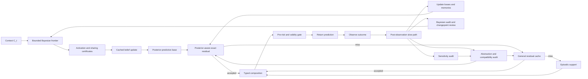

# 8. Complexity and Runtime Model

EventFrame separates prediction-time computation from post-observation refinement. The fast path may use only \(\mathscr F_t^{\mathrm{pred}}\) and state \(S_{t^-}\); realized loss, residual estimation, and abstraction learning begin only after the next outcome's availability time.

The reference fast path is:

1. Incrementally update \(C_t=e_{t-k+1:t}\).
2. Optionally form \(X_t=\chi(C_t,\mathcal M_t,G_t,\sigma_t)\).
3. Construct the bounded vector, sheaf-inspired, and as-of graph candidate frontier \(\mathcal N_t^B\).
4. Check evidence readiness, total nomination-and-activation probabilities, and materialized Anti-Pigeon sharing certificates; retrieve the corresponding cached prior and apply only a bounded Bayesian update.
5. Compute the posterior-predictive base law \(\mathsf Q_t^0(\cdot\mid C_t)\) and aligned template \(b_t^0\) from the valid effective posterior family, falling back to \(\mathsf Q_B\) and \(B\) only when that family is empty; independently compute packet baseline \(B_Y(X_t)\) when required.
6. Construct the bounded action key \(k_t=\alpha(C_t)\).
7. Try \(\mathcal C_{A,t^-}(k_t)\), then \(\mathcal C_{R,t^-}\), then episodic support if confidence is insufficient; require the residual's posterior-predictive version, the law-motion margin for every law-bearing record, and the template-motion margin for every point-bearing record to match \((\mathsf Q_t^0,b_t^0)\).
8. Compose a candidate event output bundle or packet using the separately typed clipped point and law residual components.
9. Evaluate \(\mathcal R_{\mathrm{pre}}\), confidence, effective support, age, epoch, margin, provenance, and decoder validity from \(S_{t^-}\).
10. Return the admissible prediction or fall back to the posterior-predictive no-residual bundle \(\mathcal O_t^0\). Do not evaluate realized prediction loss yet.

The packet names memory nodes, graph edges, retrieval lane, compaction risk, response mode, and an optional control branch. It predicts what the runtime should read or do; the event prediction describes what is expected to happen.

Expected constant-time lookup is a conditional implementation property. Let \(T_K\) be key-construction cost, \(T_A\) exact-key lookup, \(T_R(N)\) general residual retrieval, \(T_E(M)\) episodic retrieval, \(T_{\oplus}\) typed composition, and \(T_{\mathrm{Bayes}}^{\mathrm{fast}}\) the selective Bayesian work. Then:

\[
T_{\mathrm{fast}}
=T_C+T_{\mathrm{Bayes}}^{\mathrm{fast}}+T_B(k)+T_K+T_A
+I_R T_R(N)+I_E T_E(M)+T_{\oplus}+T_{\mathrm{pre}},
\]

where \(I_R,I_E\in\{0,1\}\) indicate fallbacks. Let \(N_t^{\mathrm{act}}=|\{e\in\mathfrak E_t^B:J_t^{\mathrm{act}}(e)=1\}|\), let \(M_{\mathrm{hyp}}\) bound the updated sufficient-statistic or discrete-hypothesis dimension, and let \(R_{\mathrm{cp}}\) bound retained changepoint run-length states. Let \(T_{\mathrm{act}}(|\mathfrak E_t^B|)\) evaluate the frozen nomination, readiness, score, and threshold rule, and let \(T_{\mathrm{sel}}(N_t^{\mathrm{act}},M_{\mathrm{hyp}})\) evaluate or approximate the complete nomination-plus-activation probability required by the selected likelihood. For a conjugate, finite-hypothesis, or otherwise bounded primitive,

\[
T_{\mathrm{Bayes}}^{\mathrm{fast}}
=T_{\mathrm{vec}}(k_v)+T_{\mathrm{expand}}(d_{\mathrm{sh}},d_G)
+T_{\mathrm{act}}(|\mathfrak E_t^B|)
+T_{\mathrm{sel}}(N_t^{\mathrm{act}},M_{\mathrm{hyp}})
+O(N_t^{\mathrm{act}}M_{\mathrm{hyp}}R_{\mathrm{cp}})+T_{\mathrm{cert}}.
\]

This is history-independent only when \(k_v\), sheaf-inspired degree \(d_{\mathrm{sh}}\), as-of graph degree \(d_G\), \(|\mathfrak E_t^B|\), \(N_t^{\mathrm{act}}\), \(M_{\mathrm{hyp}}\), and \(R_{\mathrm{cp}}\) are bounded, when the vector-index query itself has a declared bound, and when \(T_{\mathrm{sel}}\) uses a bounded exact computation or a predeclared bounded approximation. Constant time per sample in a cited streaming algorithm means constant with respect to accumulated stream length under that algorithm's fixed resources; it does not mean zero dependence on particle count, parameter dimension, optimization iterations, graph degree, selection-probability evaluation, or hardware. Sliding-window maintenance gives \(T_C=O(1)\). A bounded, already-constructed key and bounded hash table give expected \(T_A=O(1)\). The claim fails if key construction scans unbounded context, graph degree grows, the posterior or run-length support expands without cap, the table is unbounded, or lookup falls back to unrestricted nearest-neighbor search. Concurrency, hashing, collision handling, every term in \(T_{\mathrm{sel}}\), and eviction costs must be measured rather than hidden inside the constant.

The slow path starts after \(Z_{t+1}\) or the audited packet target exists:

1. Evaluate \(\mathcal L_{\mathrm{pred}}\), \(\mathcal L_{\mathrm{event}}^H\), and \(\mathcal A_{\mathrm{post}}\).
2. Evaluate packet component loss when a packet was used.
3. Estimate observed residuals and update support/confidence.
4. Consolidate episodic and residual memory.
5. Evaluate inactive audit samples, omitted influence, posterior calibration, and changepoint triggers.
6. Refit or expand Bayesian posteriors with particle, variational, or model-comparison methods when required.
7. Run validity-constrained sensitivity tests.
8. Run causal analysis only when an explicit SCM and identification strategy exist.
9. Audit bucket coverage and future-diameter estimates.
10. Accept split, merge, posterior-sharing, or ontology changes only on independent held-out evidence.

A cost decomposition is:

\[
T_{\mathrm{base}}
=T_{\mathrm{score}}+T_{\mathrm{residual}}+T_{\mathrm{consolidate}}
+T_{\mathrm{Bayes},\mathrm{audit}}+T_{\mathrm{cp}}
+\sum_{q=1}^{M_f}T_{\mathrm{predict}}^{(q)}+T_{\mathrm{audit}}
\]

\[
T_{\mathrm{upgrade}}
=T_{\mathrm{comp}}+T_{\mathrm{reconcile}}
+T_{\mathrm{snap}}+T_{\mathrm{spectral}}+T_{\mathrm{mixture}}
+T_{\mathrm{Bayes},\mathrm{deep}},
\]

\[
T_{\mathrm{slow}}=T_{\mathrm{base}}+T_{\mathrm{upgrade}}
+\sum_{q=1}^{M_c}T_{\mathrm{causal}}^{(q)},
\]

where \(M_f,M_c\in\mathbb N_0\) are the numbers of fuzzing-prediction and causal-analysis invocations. Set \(M_c=0\) when no causal model is available. Slow work must be budgeted, deferred, or batched so it does not silently migrate into the latency-critical path.

The Bayesian upgrade has an orthogonal cumulative ladder that does not renumber the abstraction-refinement stages:

\[
\begin{aligned}
\mathcal B_0&=\text{bounded activation, certificate lookup, and cached update},\\
\mathcal B_1&=\text{bounded robust changepoint monitoring},\\
\mathcal B_2&=\text{declared event-pattern forecast refinement},\\
\mathcal B_3&=\text{particle, variational SMC, and model recalibration}.
\end{aligned}
\]

Only \(\mathcal B_0\), and \(\mathcal B_1\) when its run-length state is explicitly bounded, may be admitted to the direct fast path. \(\mathcal B_2\) is fast only for a bounded precompiled pattern family and state space. \(\mathcal B_3\) is slow-path work. A changepoint, high omitted-influence certificate, missing prior, invalid sharing certificate, high-priority case, or exhausted approximation budget escalates to a predeclared deeper Bayesian stage.

The full upgrade is defined as a staged family rather than one indivisible algorithm. Let \(S_t\) contain the current forecasts, caches, abstraction graph, audit state, and hardware profile \(h\). Define refinement operators:

\[
\mathcal U_0=\text{certified baseline/residual reuse},
\qquad
\mathcal U_1=\text{edge compatibility audit},
\]

\[
\mathcal U_2=\text{local reconciliation},
\qquad
\mathcal U_3=\text{bounded predictive sheaf snap},
\]

\[
\mathcal U_4=\text{component or spectral refinement},
\qquad
\mathcal U_5=\text{regime-mixture and map refinement}.
\]

Starting from \(S_t^{(0)}=\mathcal U_0(S_{t^-})\), let \(r_n\in\{1,2,3,4,5\}\) be the stage selected for slow-path invocation \(n\), subject to its prerequisites. The step-integration recurrence is:

\[
S_t^{(n)}=\mathcal U_{r_n}(S_t^{(n-1)}),
\qquad n=1,\ldots,N_t.
\]

Let every conservative invocation-cost bound be strictly positive, \(c_r^{U}(h,S)>0\), and charge repeated stages separately:

\[
C_t^{U}(n;h)=
\sum_{q=1}^{n}c_{r_q}^{U}(h,S_t^{(q-1)}).
\]

Invocation \(n\) is permitted only if:

\[
C_t^{U}(n;h)\le\mathcal B(p_t^{\mathrm{pri}}),
\]

and all prerequisite evidence and safety gates pass. The run stops at the first failed budget or prerequisite check, a declared convergence condition, or a finite iteration cap. Its reported refinement depth is:

\[
d_t(h)=\max\left(\{0\}\cup\{r_1,\ldots,r_{N_t}\}\right).
\]

Here \(p_t^{\mathrm{pri}}\in[0,1]\) is priority declared from prediction-time information, \(\mathcal B\) is a priority-dependent resource budget, and \(c_r^U(h,S)\) is a preregistered upper confidence bound or deterministic worst-case bound on hardware profile \(h\). The runtime also accumulates actual cost and reports overruns. Predicted admission alone is not a hard budget guarantee; a strict deadline additionally requires interruptible stages and a reserved worst-case completion margin or a deterministic stop. Stage 5 may revise mixtures or comparison maps, after which Stages 1--4 may be selected again; every rerun appears again in \(C_t^U\). The architecture targets certified reuse plus all five refinement stages; \(d_t(h)\) records the deepest stage reached, while the complete invocation sequence \((r_1,\ldots,r_{N_t})\), actual cost, and stopping reason are also reported.

This definition separates semantic interfaces from hardware policy. Faster processors, larger memory, improved accelerators, or cheaper distributional solvers reduce measured costs and their conservative bounds and can increase \(d_t(h)\) without changing event, residual, compatibility, or causality definitions. A conforming implementation must therefore record both the output stage and the hardware/cost profile used to select it.

For a changed edge set \(E_{\Delta}\), compatibility work is approximately:

\[
T_{\mathrm{comp}}=O\!\left(\sum_{e\in E_{\Delta}}C_{D_e}\right),
\]

where \(C_{D_e}\) is the cost of mapping and comparing the two incident forecasts. With bounded local degree this is local in the changed neighborhood. Spectral work depends on component size, representation dimension, sparsity, solver, and requested tolerance. Mixture refinement additionally depends on component counts and optimization restarts and is expected to remain the most expensive stage. No fixed millisecond or slowdown claim is made without an implementation and hardware profile.

For a finite predictive-snap family \(\mathfrak S_t\), the design-block computation is bounded by the work charged for every inspected candidate:

\[
T_{\mathrm{snap}}
\le
T_{\mathrm{generate}}
+
\sum_{\Xi'\in\mathfrak S_t}
\left[
T_{\mathrm{refit}}(\Xi')
+\sum_{e\in E_\Delta(\Xi')}C_{D_e}
+T_{\mathrm{obl}}(\Xi')
+T_{\mathrm{score}}(\Xi')
\right]
+T_{\mathrm{confirm}}+T_{\mathrm{publish}}.
\]

Here \(T_{\mathrm{generate}}\) includes bounded neighborhood and candidate construction, \(T_{\mathrm{obl}}\) validates direct or composed comparison obligations, and \(T_{\mathrm{confirm}}\) is confirmation scoring cost rather than the wall-clock wait for future outcomes. \(T_{\mathrm{score}}\) includes candidate risk, affected-bucket Anti-Pigeon evaluation, and affected-edge compatibility evaluation not already charged in the explicit edge sum; an implementation must partition these measurements so no operation is omitted or counted twice. The ordinary \(T_{\mathrm{comp}}\) term audits the published graph, whereas the inner edge sum charges incremental candidate comparisons. The untouched confirmation block may delay publication but is not placed on the current prediction path. Candidate count, neighborhood radius, reverse dependency closure, refit budget, comparison-obligation set, and map class must be bounded before the review begins; unrestricted graph-structure search is not a conforming snapping implementation. The candidate graph, induced local abstraction mapping, and dependent keys are built in shadow state, and publication is an atomic graph-key-epoch swap. Consequently snapping requires only the existing version-consistent epoch check on the direct fast path. The indirect cost is a temporary rise in baseline or certified-fallback use while affected residual entries are recertified.

The integration roadmap is cumulative:

1. Specify typed Bayesian evidence, parameter spaces, activation maps, source model, selection semantics, bounded sufficient statistics, and deterministic fallbacks.
2. Add shadow-only activation, independent audit sampling, and omitted-influence measurement before allowing production posterior updates.
3. Materialize Anti-Pigeon posterior-sharing certificates and enable bounded cached updates with atomic posterior-key-epoch publication.
4. Add bounded robust changepoint monitoring and targeted invalidation; keep particle or unbounded run-length methods asynchronous.
5. Add read-only compatibility auditing and materialize epoch/margin certificates for the unchanged residual fast path.
6. Enable local reconciliation only on held-out evidence that it improves priority-weighted utility without unacceptable harm.
7. Add bounded predictive sheaf snapping with shadow construction, targeted invalidation, atomic publication, and rollback.
8. Add component-level spectral diagnostics and refinement where linearization assumptions are validated.
9. Add predictive regime mixtures and deep Bayesian state-space refinement; promote causal interpretations only with explicit SCMs and identification assumptions.
10. Rebenchmark every stage on each hardware generation and widen activation budgets without weakening validation, selection, or Anti-Pigeon gates.

The runtime reports prediction score, event-aware timing error, pre-risk calibration, cache hit and fallback rates, residual improvement, activation and audit rates, selected and unselected posterior calibration, omitted influence, effective support, changepoint delay and false alarms, Bayesian frontier size, posterior-update cost, decoder failures, slow-path delay, selected Bayesian and abstraction refinement depths, hardware profile, edge defects, bucket audit coverage, snap attempts and acceptances, rollback, cache recertification delay, and split/merge churn. Without these measurements, the claimed fast/slow tradeoff remains an architectural proposal rather than an established result.
