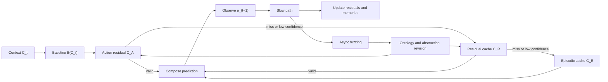

# 8. Complexity and Runtime Model

EventFrame separates low-latency prediction from slower refinement. The fast path produces an immediate prediction using the current context, baseline model, and available memory. The slow path evaluates errors, updates caches, tests invariants, and refines abstractions. This separation is a systems claim that must be evaluated experimentally.

The reference fast path is:

1. Form \(C_t = e_{t-k+1:t}\).
2. Compute \(b_t = B(C_t)\).
3. Retrieve \(r_t^A\) from the action-residual cache \(\mathcal{C}_A\), if a valid entry exists.
4. Otherwise retrieve \(r_t^*\) from \(\mathcal{C}_R\).
5. If residual confidence is insufficient, retrieve episodic support from \(\mathcal{C}_E\).
6. Compose \(\hat{e}_{t+1} = b_t \oplus_{\mathcal{A}} r\), using the highest-confidence admissible correction or \(0_{\mathcal{Q}}\).
7. Return the prediction with confidence metadata.

The architecture can be summarized as:

If context formation is treated as a sliding window, its incremental cost is \(O(1)\). The baseline cost is \(T_B(k)\), which depends on the model. Action-residual lookup can be expected \(O(1)\) when \(\mathcal{C}_A\) is a bounded hash table or array over declared action keys. General residual lookup cost depends on the cache design. A hash-like lookup may be approximately \(O(1)\), while nearest-neighbor search over \(N\) entries may be \(O(N)\) without indexing. Episodic retrieval has its own cost \(T_E(M)\). Composition cost is \(T_{\oplus}\), determined by encoding, clamping, projection, and decoding.

A simple fast-path cost sketch is:

\[
T_{fast} \approx O(1) + T_B(k) + T_A + T_R(N) + T_E(M) + T_{\oplus}.
\]

Here \(T_A\) is the action-residual lookup cost, \(T_R(N)\) is the general residual lookup cost, and \(T_E(M)\) is episodic retrieval cost. In a successful action-residual hit, \(T_R(N)\) and \(T_E(M)\) may be skipped. This equation should be interpreted as a decomposition, not a guarantee. The framework does not prove constant-time prediction. It identifies where cost enters and which parts can be optimized or approximated.

The slow path begins after an observation becomes available:

1. Evaluate \(\mathcal{L}_{time}^{H}\).
2. Estimate the observed residual.
3. Decide whether the residual is worth caching.
4. Update episodic memory and residual cache metadata.
5. Run selected fuzzing tests.
6. Reassess invariants and abstraction maps.
7. Revise 5W1H field assignments when intervention evidence shows that information should migrate, split, or be marked uncertain.

The slow path may be much more expensive:

\[
T_{slow} \approx T_{loss} + T_{residual} + T_{consolidate} + M_f T_{predict} + T_{abstraction},
\]

where \(M_f\) is the number of fuzzed variants and \(T_{predict}\) is the cost of rerunning prediction. This cost is acceptable only if slow-path work is deferred, batched, or scheduled under a budget.

The conceptual reason for the split is that prediction and learning have different latency requirements. A system may need to answer quickly, but it does not need to discover invariants synchronously with every prediction. Residual caches allow some slow-path learning to be reused later by the fast path.

The runtime model has several failure modes. If the residual cache grows without control, lookup cost and pollution increase. If slow-path refinement is delayed too long, stale residuals may remain active. If fast-path prediction trusts low-confidence memory, errors can compound. If abstraction is too aggressive, the system may become fast but wrong.

The runtime should therefore report not only prediction accuracy but also cache hit rate, residual utility, cache age, slow-path budget, and abstraction degradation. The next section proposes experiments to measure these properties.
