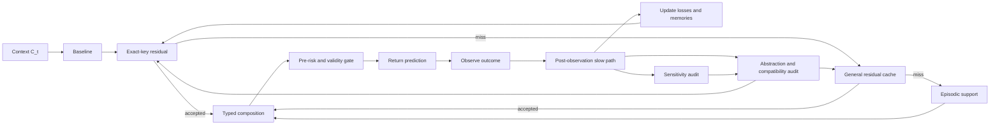

# 8. Complexity and Runtime Model

EventFrame separates prediction-time computation from post-observation refinement. The fast path may use only \(\mathscr F_t^{\mathrm{pred}}\) and state \(S_{t^-}\); realized loss, residual estimation, and abstraction learning begin only after the next outcome's availability time.

The reference fast path is:

1. Incrementally update \(C_t=e_{t-k+1:t}\).
2. Optionally form \(X_t=\chi(C_t,\mathcal M_t,G_t,\sigma_t)\).
3. Compute baseline law \(\mathsf Q_B(\cdot\mid C_t)\) and point summary \(b_t=B(C_t)\), or packet baseline \(B_Y(X_t)\).
4. Construct the bounded action key \(k_t=\alpha(C_t)\).
5. Try \(\mathcal C_{A,t^-}(k_t)\), then \(\mathcal C_{R,t^-}\), then episodic support if confidence is insufficient.
6. Compose a candidate event output bundle or packet using the shared clipped effective residual.
7. Evaluate \(\mathcal R_{\mathrm{pre}}\), confidence, effective support, age, epoch, margin, provenance, and decoder validity from \(S_{t^-}\).
8. Return the admissible prediction or fall back to the baseline. Do not evaluate realized prediction loss yet.

The packet names memory nodes, graph edges, retrieval lane, compaction risk, response mode, and an optional control branch. It predicts what the runtime should read or do; the event prediction describes what is expected to happen.

Expected constant-time lookup is a conditional implementation property. Let \(T_K\) be key-construction cost, \(T_A\) exact-key lookup, \(T_R(N)\) general residual retrieval, \(T_E(M)\) episodic retrieval, and \(T_{\oplus}\) typed composition. Then:

\[
T_{\mathrm{fast}}
=T_C+T_B(k)+T_K+T_A+I_R T_R(N)+I_E T_E(M)+T_{\oplus}+T_{\mathrm{pre}},
\]

where \(I_R,I_E\in\{0,1\}\) indicate fallbacks. Sliding-window maintenance gives \(T_C=O(1)\). A bounded, already-constructed key and bounded hash table give expected \(T_A=O(1)\). The claim fails if key construction scans unbounded context, graph degree grows, the table is unbounded, or lookup falls back to nearest neighbors. Concurrency, hashing, collision handling, and eviction costs must be measured rather than hidden inside the constant.

The slow path starts after \(Z_{t+1}\) or the audited packet target exists:

1. Evaluate \(\mathcal L_{\mathrm{pred}}\), \(\mathcal L_{\mathrm{event}}^H\), and \(\mathcal A_{\mathrm{post}}\).
2. Evaluate packet component loss when a packet was used.
3. Estimate observed residuals and update support/confidence.
4. Consolidate episodic and residual memory.
5. Run validity-constrained sensitivity tests.
6. Run causal analysis only when an explicit SCM and identification strategy exist.
7. Audit bucket coverage and future-diameter estimates.
8. Accept split, merge, or ontology changes only on independent held-out evidence.

A cost decomposition is:

\[
T_{\mathrm{base}}
=T_{\mathrm{score}}+T_{\mathrm{residual}}+T_{\mathrm{consolidate}}
+\sum_{q=1}^{M_f}T_{\mathrm{predict}}^{(q)}+T_{\mathrm{audit}}
\]

\[
T_{\mathrm{upgrade}}
=T_{\mathrm{comp}}+T_{\mathrm{reconcile}}
+T_{\mathrm{spectral}}+T_{\mathrm{mixture}},
\]

\[
T_{\mathrm{slow}}=T_{\mathrm{base}}+T_{\mathrm{upgrade}}
+\sum_{q=1}^{M_c}T_{\mathrm{causal}}^{(q)},
\]

where \(M_f,M_c\in\mathbb N_0\) are the numbers of fuzzing-prediction and causal-analysis invocations. Set \(M_c=0\) when no causal model is available. Slow work must be budgeted, deferred, or batched so it does not silently migrate into the latency-critical path.

The full upgrade is defined as a staged family rather than one indivisible algorithm. Let \(S_t\) contain the current forecasts, caches, abstraction graph, audit state, and hardware profile \(h\). Define refinement operators:

\[
\mathcal U_0=\text{certified baseline/residual reuse},
\qquad
\mathcal U_1=\text{edge compatibility audit},
\]

\[
\mathcal U_2=\text{local reconciliation},
\qquad
\mathcal U_3=\text{component or spectral refinement},
\]

\[
\mathcal U_4=\text{regime-mixture and map refinement}.
\]

Starting from \(S_t^{(0)}=\mathcal U_0(S_{t^-})\), let \(r_n\in\{1,2,3,4\}\) be the stage selected for slow-path invocation \(n\), subject to its prerequisites. The step-integration recurrence is:

\[
S_t^{(n)}=\mathcal U_{r_n}(S_t^{(n-1)}),
\qquad n=1,\ldots,N_t.
\]

Let every conservative invocation-cost bound be strictly positive, \(c_r^{U}(h,S)>0\), and charge repeated stages separately:

\[
C_t^{U}(n;h)=
\sum_{q=1}^{n}c_{r_q}^{U}(h,S_t^{(q-1)}).
\]

Invocation \(n\) is permitted only if:

\[
C_t^{U}(n;h)\le\mathcal B(p_t^{\mathrm{pri}}),
\]

and all prerequisite evidence and safety gates pass. The run stops at the first failed budget or prerequisite check, a declared convergence condition, or a finite iteration cap. Its reported refinement depth is:

\[
d_t(h)=\max\left(\{0\}\cup\{r_1,\ldots,r_{N_t}\}\right).
\]

Here \(p_t^{\mathrm{pri}}\in[0,1]\) is priority declared from prediction-time information, \(\mathcal B\) is a priority-dependent resource budget, and \(c_r^U(h,S)\) is a preregistered upper confidence bound or deterministic worst-case bound on hardware profile \(h\). The runtime also accumulates actual cost and reports overruns. Predicted admission alone is not a hard budget guarantee; a strict deadline additionally requires interruptible stages and a reserved worst-case completion margin or a deterministic stop. Stage 4 may revise mixtures or comparison maps, after which Stages 1--3 may be selected again; every rerun appears again in \(C_t^U\). The architecture targets all five stages; \(d_t(h)\) records the deepest stage reached, while the complete invocation sequence \((r_1,\ldots,r_{N_t})\), actual cost, and stopping reason are also reported.

This definition separates semantic interfaces from hardware policy. Faster processors, larger memory, improved accelerators, or cheaper distributional solvers reduce measured costs and their conservative bounds and can increase \(d_t(h)\) without changing event, residual, compatibility, or causality definitions. A conforming implementation must therefore record both the output stage and the hardware/cost profile used to select it.

For a changed edge set \(E_{\Delta}\), compatibility work is approximately:

\[
T_{\mathrm{comp}}=O\!\left(\sum_{e\in E_{\Delta}}C_{D_e}\right),
\]

where \(C_{D_e}\) is the cost of mapping and comparing the two incident forecasts. With bounded local degree this is local in the changed neighborhood. Spectral work depends on component size, representation dimension, sparsity, solver, and requested tolerance. Mixture refinement additionally depends on component counts and optimization restarts and is expected to remain the most expensive stage. No fixed millisecond or slowdown claim is made without an implementation and hardware profile.

The integration roadmap is cumulative:

1. Specify typed node laws, edge comparison spaces, maps, divergences, confidence procedures, and deterministic fallbacks.
2. Add read-only compatibility auditing and materialize epoch/margin certificates for the unchanged fast path.
3. Enable local reconciliation only on held-out evidence that it improves priority-weighted utility without unacceptable harm.
4. Add component-level spectral diagnostics and refinement where linearization assumptions are validated.
5. Add predictive regime mixtures; promote them to causal mixtures only with explicit SCMs and identification assumptions.
6. Rebenchmark stage costs on each hardware generation and widen activation budgets without weakening validation gates.

The runtime reports prediction score, event-aware timing error, pre-risk calibration, cache hit and fallback rates, residual improvement, effective support, decoder failures, slow-path delay, selected refinement depth, hardware profile, edge defects, bucket audit coverage, and split/merge churn. Without these measurements, the claimed fast/slow tradeoff remains an architectural proposal rather than an established result.
